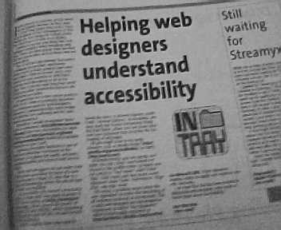

Web accessibility on In.Tech
===

Last week, the In.Tech pull-out section of The Star newspaper wrote something about web accessibilty. It's an article by Raslan Sharif titled 'An unreadable Internet'. It's a pretty good writing, not only for me, but also for all the web designers in Malaysia. I was totally pleased to see such story appearing on a local newspaper. So pleased that I send the In.Tech guys an email, just to show my gratitude and add some comments. I've included some good references such as [Dive Into Accessibility](http://diveintoaccessibility.org/) and [Building Accessible Websites](http://joeclark.org/book/sashay/serialization/), plus an example of a beautiful *and* accessible web site, [CSS Zen Garden](http://csszengarden.com/).

Today, I found that [my email response is printed](http://star-techcentral.com/tech/story.asp?file=/2004/6/10/itfeature/8126176&sec=itfeature "Helping web designers understand accessibility") on paper, page 17 of the In.Tech section. Good. At least, I've put my effort to *promote* web accessibility.