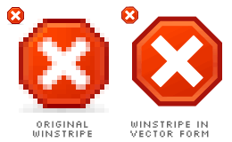
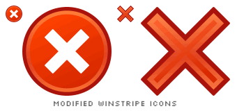
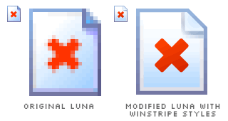

Winstripe Stoppage
===

It's time for another detective work. Today, I focus on the Stop icon. It's quite a *controversial* icon, because it always interferes with other icons such as Delete, Close and Error. All of them are practically designed with the 'X' sign. It's quite a headache to create *different* icons for those functions.

Again, I recreate the Winstripe Stop icon in vector form, still neglecting the shadow effect. The icon has an octagonal shape around its 'X' sign. Yes, it's an octagon. It looks just like the stop sign on the roads. Frankly speaking, this is a brilliant idea because it doesn't actually feel like Delete, Close or Error. The first time you look at it, you'll directly know that it's a Stop icon. I really don't understand why some Firefox users don't like the octagon. Maybe due to its sharp edges or whatever?

Let's *assume* that the octagon is ugly. Why not a circle then? An 'X' sign with a circle around it seems fine. So fine that it looks almost like the Windows Error icon! Windows users would be shocked to see this on their browser!

The circle has to go. Leave the 'X' sign alone then, without any shapes accompanying it. Much better but again, it interferes with Delete and Close.

I try to take the *Luna approach*, modifying the Luna Stop icon with Winstripe styles. The document is designed following the same styles applied to the Winstripe Copy and Paste icon. The 'X' sign is placed on top of a document icon, which means to stop loading the web page. At the same time, it also means to delete a document. I'm afraid someone, especially students, might see it as marking a red 'X' on a piece of paper. Or maybe it's an old treasure map, reprinted on a high-quality paper, where 'X' marks the spot! Wow. Just kidding.

I think I'm getting nowhere to designing the *perfect* Stop icon. Mind you, the octagonal Stop icon is perfect enough for me.