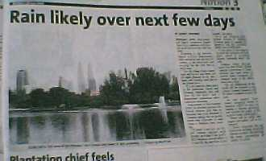

Rainy day
===

Today is a rainy day. It rained since this morning. After few minutes, it stopped. After next few minutes, it rained again. After that, it stopped again. Then, it rained, stopped, rained and so on. The weather *is* ironically unpredictable. I read the newspaper and know that the rain will be around for the next few days. It will be cold and wet outside. I better prepare my umbrella then.