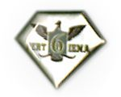

Creative badge
===

This is the Pertiena badge, the symbol of my school's Form 6 Society. Every member has one, including myself of course. For those scratching their heads, Pertiena stands for Persatuan Tingkatan Enam. On the badge, it shows the *beautiful* Pertiena logo. Okay, I admit it looks very dull. It's definitely **not** me who designed it. Mohd Safar, the chairman, did it, with a little *artistic twist*. A bird spreading its wings behind a metallic shield with the number 6 on it.

*Creative*, isn't it?