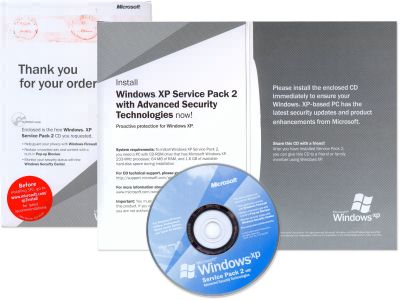

Service Pack package
===

I received the Windows XP SP 2 CD this evening. I'm impressed that it took *only* two weeks, since the day I [order it from Microsoft's web site](http://microsoft.com/windowsxp/downloads/updates/sp2/cdorder/en_us/ "Order Windows XP Service Pack 2 on CD"). The package looks neat, which opens like a booklet. As I look around, I noticed this printed quote:

> After you have installed Service Pack 2, you can give this CD to a friend or family member using Windows XP.

*Really?*

Anyway, I'm not going to install it. I don't have the time to troubleshoot my computer if any disaster happens after installation. Besides, my CD-ROM is not functioning and I haven't buy a new one yet.