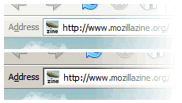

'Address' label for address bar
===

Last two weeks, David Tenser [quoted](http://weblogs.mozillazine.org/djst/archives/006398.html "Firefox Default Toolbar Proposal"):

> The Address bar should have a label, like in IE. It's not completely obvious now what the text field is for, and it's not easy to tell the difference between the two (address and search), especially not when the Google icon is there instead of the magnifying glass.
>
> — <http://weblogs.mozillazine.org/djst/archives/006398.html>

This is [Bug 171245](http://bugzilla.mozilla.org/show_bug.cgi?id=171245 "Bug 171245 - [cust] text labels for address field and search fields."), and it will not be fixed, as [commented](http://bugzilla.mozilla.org/show_bug.cgi?id=171245#c21 "additional comment #21 from Asa Dotzler") by Asa:

> Ben says there will be no label for the address field.
>
> — <http://bugzilla.mozilla.org/show_bug.cgi?id=171245#c21>

I'm not sure if this is the right decision, since I'm not an usability expert. Before I switched to Firefox, I always thought of removing the 'Address' label from Internet Explorer's address bar. Of course, there is **no** way to do that. Even third-party IE-based browsers don't allow me to do that. For me, it's useless, because the label doesn't serve much purpose except to tell me that it *is* an address bar. I expect most users can easily recognise the address field from the intuitive page icon and the autocomplete dropmarker on the right edge. But then, it *might* be useful for beginners, especially those who just started to learn using computers.

So, I take a look at the [patch](http://bugzilla.mozilla.org/attachment.cgi?id=156319&action=view "Updated patch"), created by Chu Alan and [updated](http://bugzilla.mozilla.org/show_bug.cgi?id=171245#c15 "additional comment #15 by Jon Henry") by Jon Henry. I played around the codes, via an XBL binding and 'userChrome.css'. I know this is an useless tip, but I'm going to share it anyway. First, create an XBL binding file called 'address.xml', with this content:

<pre><code>&lt;?xml version=&quot;1.0&quot;?&gt;

&lt;bindings id=&quot;AddressBarBindings&quot;
xmlns=&quot;http://www.mozilla.org/xbl&quot;
xmlns:xul=&quot;http://www.mozilla.org/keymaster/gatekeeper/there.is.only.xul&quot;
xmlns:xbl=&quot;http://www.mozilla.org/xbl&quot;&gt;

&lt;binding id=&quot;address-label&quot;&gt;
&lt;content&gt;
<em>&lt;xul:label id=&quot;urlbar-label&quot; value=&quot;Address&quot; accesskey=&quot;d&quot; control=&quot;urlbar&quot; onclick=&quot;this.nextSibling.focus()&quot;/&gt;</em>
&lt;children/&gt;
&lt;/content&gt;
&lt;/binding&gt;

&lt;/bindings&gt;</code></pre>

The codes above will add the 'Address' label next to the address field. If you don't like it, you may change it from the `value` attribute of the `xul:label` element. Since `Alt + D`, for Windows, is one of the keyboard shortcuts to focus on the Location bar, I've also added `accesskey="d"` which makes the 'd' letter underlined. You may need to change this too, if you change the label. If you click on the label, the address field will be focused too.

Just save the file to the folder where your 'userChrome.css' file is located. Then, add the following codes to 'userChrome.css':

<pre><code>#main-window #urlbar-container{
-moz-binding: url(address.xml#address-label) !important;
}

#urlbar-label{
margin-right: 1px !important; /* reduce some spacing */
opacity: .5 !important; <strong class="remark">/* remove this if you&apos;re using Windows Classic */</strong>
}</code></pre>

Done.

For your information, this tweak can work on the Search field too, simply by duplicating the same code and changing the IDs and values. I don't think that the Search field needs a label, so I didn't post any codes here. A better solution is reported as [Bug 258672](http://bugzilla.mozilla.org/show_bug.cgi?id=258672 "Bug 258672 - grey text in search box showing search engine name").

This has been an useless tip from a Phoenity guy. Enjoy.