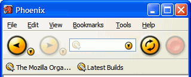

Malaysians and Firefox
===

I always wonder, am I the *only* Malaysian involved in this Firefox mania? I asked myself this question ever since the [release of Phoenix 0.1](http://mozillazine.org/talkback.html?article=2494 "Phoenix 0.1 Released"), about two years ago. If you don't know what is Phoenix, you might not realise that this open-sourced web browser project has **5 names**, rebranded over and over again from 'mozilla/browser', 'm/b', 'Phoenix', 'Firebird' to the current 'Firefox'. It's quite confusing, I know.

I still have the 'phoenix-0.1-win32.zip' file on my hard disk. And it's *still* installed, just incase I feel nostalgic one day. I *might* be the only Malaysian to download this piece of software, despite my slow dial-up connection. After few releases of Phoenix, I start to contribute to the Phoenix development by [creating various application icons](http://www.deftone.com/blogzilla/archives/change_the_phoenix_icon.html "Change the Phoenix Icon"). Later on, I create a simplistic theme called Phoenity and publish it to the community on October 2002. At that time, [MozillaZine](http://mozillazine.org/) has a *primitive* [forum](http://mozillazine.org/talkback.html?article=2096 "Forums Arrive!") that I used to browse around. To my surprise, I'm the only Chinese there, because most posters have *non-Chinese* names, or nicknames, as I observed.

Anyway, I don't care. When the [phpBB-powered MozillaZine forums was launched](http://mozillazine.org/talkback.html?article=2638 "New Forums Now Open!"), I am one of the earliest fans to register. If you [check out my profile](http://forums.mozillazine.org/profile.php?mode=viewprofile&u=370 "cheeaun's profile"), you could notice that my joined date is **6 November 2002**, just one day after the launching date. On the first few weeks of December 2002, I've released a total of **9 themes** for Phoenix, which most of their development has been discontinued now, thanks to *Real Life*. Besides, I've also lent my hand to David Tenser working on Firefox Help, which has now been [officially transferred to Mozilla.org](http://weblogs.mozillazine.org/djst/archives/006640.html "texturizer.net -> mozilla.org").

I *might* be the first Malaysian to [switch from Internet Explorer to this browser](http://mozilla.org/products/firefox/switch.html "Switching from Internet Explorer to Mozilla Firefox"). Generally, my decision to switch is not due to security concerns, unlike nowadays, but more into web standards support and innovative browsing features. I like the complexity of the [Gecko rendering engine](http://mozilla.org/newlayout/ "Mozilla Layout Engine") and the simplicity of the user interface. To be more specific, I cannot live without tabbed browsing, popup blocking, and [Find As You Type](http://mozilla.org/access/type-ahead/). Believe me, those features are **essential**.

All the while, I never thought of encouraging *other* people to [switch](http://switch2firefox.com/ "Switch2Firefox"). Most of my friends are not hi-tech enough to even understand the term 'web browser' or 'alternative browsers', not to mention 'Mozilla Firefox' which could scare them away. However, I managed to convert Navin, a Form 4 friend of mine and Mac enthusiast, to a Firefox user. For the past few months, my Phoenity theme somehow has encouraged few people to make the switch, too, because they favour my icons. How nice.

Mozilla Firefox has been mentioned few times on The Star [In.Tech](http://star-techcentral.com/ "Star Tech Central"). I supposed, more Malaysians get to know this browser now. I couldn't recognise any Malaysian Firefox users until I found [a weblog post](http://www.zlah.com/pd/archives/000029.html "Spread the Fox") linking to my weblog, shown on my site stats. This blogger, called Zaim, is a **Malaysian Firefox fan**. Whoa. Suddenly, I felt that I'm **not alone** after all.

He is so enthusiastic that he suggests spreading Firefox *here* in Malaysia:

> So Malaysian open source and Firefox users out there, why not start a spread Firefox campaign here? I can think of a few things we can concentrate on:
>
> - Localized Firefox buttons and ad in BM
>
> - Revive the localization of Mozilla (not only Firefox) to BM, the last localized version is Mozilla (not Firefox) v1.0.1! To my knowledge, there hasn't been any localized version of Firefox
>
> - Push the usage of Firefox at local colleges, universities or schools
>
> Okay, so I'm probably over my head, but why not?
>
> — <http://www.zlah.com/pd/archives/000029.html>

Later, I found few more Malaysian Firefox fans, listed:

- Liew Cheon Fong of [LiewCF.com](http://liewcf.com/)
- Squall of [Chonghwa Lifestyle](http://chonghwa.blogspot.com/)
- David Wang of [Itchy Hands](http://www.itchyhands.com/)
- Sashi of [Sashi-isms](http://sashiweb.com/)

All of them have displayed the Firefox button link on their sites. I guess *none of them* knows the existence of a *made-in-Malaysia* Firefox theme listed on [Mozilla Update](http://update.mozilla.org/). Well, maybe I'm the kind of guy who don't like to show off. Mind you, this blog doesn't contain *any* direct or indirect link to my Phoenity site, whether you notice or not.

What I'm thinking right now is to find *more* Malaysian Firefox fans out there. So, if you know any, don't forget to tell me!