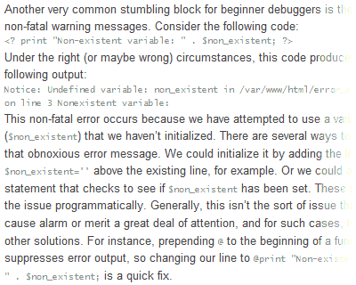
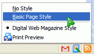

Read, find, express, fix
===

[](http://digital-web.com/articles/phpitfalls/ "PHPitfalls: Five Beginner Mistakes to Avoid")

PHP is a nice scripting language to learn. I'm still a beginner, so I read articles and tutorials which are made *specifically* for beginners. I found [one such article](http://digital-web.com/articles/phpitfalls/ "PHPitfalls: Five Beginner Mistakes to Avoid") written by Daryl L. L. Houston from [Digital Web Magazine](http://digital-web.com/). I read it and find that the text on the page is quite *unfriendly* to my eyes. The small font is okay, but there are **no spacing** at all between the paragraphs and codes, making it hard for me to read line by line. Anyone, at least myself, can easily get lost tracing the lines. I'm not sure if this is an intended visual effect or something wrong with my copy of Mozilla Firefox, so I investigated and found this piece of code in the 'design.css' file of the page:

<pre><code>#content p {
<em>margin: 0;</em>
}</code></pre>


Sigh, I decided to disable the page style, removing all the formatting and styles. I clicked the Page Style icon on the status bar and surprised to see the Print Preview icon on the popup. The alternative stylesheet of Digital Web Magazine is labeled as 'Print Preview'. At that time, I'm using my Phoenity theme, applied with the cute menus sub-skin. Somehow the codes implemented for the sub-skin is *so good* that it even iconise *this* menu item, also removing the radio character.

I've just discovered a bug on my own theme. Immediately, I found my mistake when reading the codes of the cute menus sub-skin. The code `menuitem[label="value"]` seems to be too aggressive, even affecting checkbox-type and radio-type menu items which logically shouldn't be iconic. The way to fix this is to change it to `menuitem[label="value"]:not([type])`. I take a look at the 'cutemenus.css' file and sigh again. There are **so many** codes to be changed! It would be *too strenuous* to change every single instance one by one, not to mention the mess in the content of the file.

Fortunately, Regular Expression comes to the rescue. Using my text editor, I just make it find this expression:

```
menuitem\[label="([^"]+)"\]
```

This will match all values of the `label` attribute except the double quote character. Then, replace with this:

```
menuitem[label="\1"]:not([type])
```

Done. The bug is fixed, in Phoenity version 1.3.2, just released as of this writing.

Okay, back to my reading.

**Update 17 October 2004**: The article is now more readable, thanks to the [commentators](http://digital-web.com/articles/phpitfalls/comments/ "PHPitfalls: Five Beginner Mistakes to Avoid : Comments").