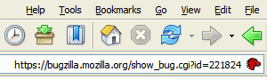

The inverted Firefox experiment
===

Would anyone  like to conduct an experiment? A *very simple* experiment?

I once watched a documentary on how wonderful the human brain is. Our grey matter has the ability to learn new things, remember a lot of data, control our body system and adapt to new environments. There was one experiment conducted by one scientist, being the guinea pig to wear a special pair of glasses that *inverts* our vision. That means the sky is at the bottom and the ground is at the top. Within some time, that scientist got used to it as the brain successfully adapt to the *inverted surrounding world*. After the scientist take off the glasses, the brain adapts again to the normal condition, also within a period of time. Amazing.

Just recently, I found [Bug 221824](https://bugzilla.mozilla.org/show_bug.cgi?id=221824 "Bug 221824 - themes should be RTL compatible") from Kevin's [blog post](http://kmgerich.com/archive/000075.html "Firefox 1.0almost"). It's a bug report to make themes compatible with right-to-left systems. I wonder, what is right-to-left, in short, RTL? I read the comments and understand that it's related to systems with RTL languages such as Hebrew and Arabic. As a theme designer, I got quite interested in this issue and added my email address to the CC list. However, there is a problem. English is not a RTL language, so how am I going to see a RTL interface?

Well, it's pretty simple anyway. First, I type `about:config` into Firefox's location bar and press `Enter`. Then, I modify the value of the 'bidi.direction' preference name from 1 to 2. Reload Firefox and behold. **Everything is cross-eyed**. It gets a bit scary the first time I see it on my monitor screen. Suddenly, I lost my way around the interface, as my brain tries to adapt to this *new environment*. Since this setting also affects the web pages I visit, it messes up the page layout and makes the text hard to read. To prevent so, I have to put this code into the 'userContent.css' file:

<pre><code>*:not([dir=&quot;rtl&quot;]){
<em>direction: ltr !important;</em>
}</code></pre>

If you try this setting now, you might notice that some widgets are not quite RTL-friendly, yet, such as the Back/Forward toolbar buttons, menu arrows and tree children items. For me, those are pretty minor glitches. The most *frightening* part is the Options window, where the 'Ok' button is located at the left side!

Now, I would like to challenge anyone to do this experiment. Try use this RTL interface on your Firefox for at least one week or more and let's see what will happen.