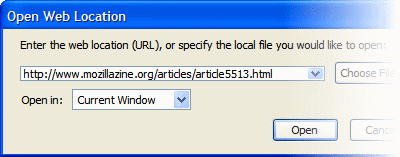
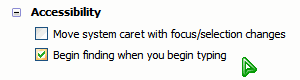

Personal review of Firefox 1.0
===

After two years of using Firefox, I have never actually write a *thorough* review of this browser. Okay, I am not a tech specialist or journalist but somehow I feel like want to write something. I don't regard my previous blog posts about Firefox as my *reviews*. For the past few months, I wrote about pre-release Winstripe icons, Firefox interface's tiny glitches, Firefox tips and my little *adventure* in the process of updating the Phoenity theme for latest releases. This time, I'm going to write a review. My *personal* review.

I've installed Mozilla Firefox 1.0 on my machine. I notice that the size of the setup file is 4803Kb, a little bit larger than RC2 which is 4797Kb. Mind you, I am quite sensitive to small details. The installation process went smoothly and my Firefox profile is imported successfully. My Phoenity theme works well in this build, including most of the extensions installed.

This release features an improved logo. Jon Hicks has perfected the edges, brighten the colors and added some fine details. It's a beautiful artwork. On the other side, the toolbar and interface icons don't have much changes. Some of the *old* Winstripe 0.1 icons, such as Mail, Cut, Copy and Paste, are *still* there. Maybe Stephen and Kevin don't have ideas to improve them further? I have some, though. For me, every icon has its own story to tell.

Looking at the main window interface, I felt so proud of my toolbar items arrangement and interface customisations. I drag the location bar to a new toolbar because I want it to be as long as possible, so that I can read certain URLs. I browse through long web pages better, thanks to my Mac-alike scrollbar tweak. When in full screen mode, I can read URLs of hovered links on the statusbar, because I unhide the statusbar with this code:

<pre><code>statusbar[moz-collapsed=&quot;true&quot;]{
<em>visibility: visible !important;</em>
}</code></pre>

I have a question in my mind, but I dare not ask other people. Yeah, I'm a little shy to ask *potentially stupid* questions. Here goes anyway. If the location bar and search bar are *dragged away* from the toolbars, obviously into the Customize window, what would happen to the 'Open Location...' and 'Web Search' menu items? Basically, when you click these menu items, the location bar or search bar will be focused with a blinking caret. If these bars are gone, where would the caret be? Well, guess no more because I'm going to find it out myself. I press `Ctrl + K`, nothing happens. I press `Ctrl + L`, a dialog appears. Everyone, behold the mysterious 'Open Web Location' dialog. I guess most Firefox users have *never* seen this before, right?

Okay now, let's have a look at one of the coolest feature in Firefox, the find bar. It is an innovative feature, as a solution to provide an usable interface for [Find As You Type](http://mozilla.org/access/type-ahead/). This neat feature was formerly known as 'Type Ahead Find', and now it's renamed to 'Find As You Type'. On the [Firefox web page](http://mozilla.org/products/firefox/ "Firefox - Rediscover the web"), it's also known as 'FastFind'. In the Options window, it's referred as 'Begin finding when you begin typing'. Confusing? Anyway, it's such a handy tool that I use it almost every day, especially when I read *long* documents or web pages such as the [CSS3 Selectors](http://w3.org/TR/css3-selectors/) working draft. Just simply type few keys, the Find bar pops up, and the typed characters on the page will be highlighted right away. `F3` is the keyboard shortcut that I remember for sure, because it functions as both `Ctrl + F` and `Ctrl + G` together. I admit the Find bar interface is a bit weird, for example the left-positioned Close button. Kevin has proposed a [much better solution](http://kmgerich.com/archive/000074.html "Find Bar Feng Shui"), in my opinion. For your information, the Find bar not only works in the View Source window, but also the Help Contents window! To make things *more* complicated, it even works in the Print Preview window! Awesome, but **it's actually a bug** I found recently. Practically, you cannot *find anything* when print previewing web pages. Sigh.

I supposed this is all I have to say about Firefox 1.0, at least, for now. There are few tiny things that I haven't mention here, which are not quite worthwhile, yet. After all the beers and parties, let's move onward to **Firefox 2.0**!