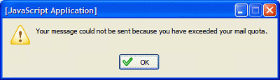
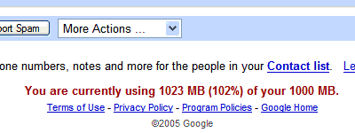

Exceeded mail quota
===

[Gmail](http://gmail.com/) provides **1 Gigabyte** of email space. Awesome. I guess most people would have know that by now, right? Some of my friends think that it's *crazy*. It's **too much**. Who needs that much? Well, I was just replying to an email and suddenly an alert message dialog pops up. At first glance, I ignore it and quickly press the 'OK' button. When I try to send the message again, it pops up the second time. I noticed it and was shocked.

Ladies and gentlemen, I have **exceeded my Gmail account's email quota!** Yeah! A more shocking fact is I've used **more** than 1000Mb!

Now, this may seem impossible but really, it just happened. I'll have to delete and clear up some mails so that I can reply and send emails, ironically. I'm not sure how much Gmail can accommodate if I don't delete some emails, though. Maybe about 1050Mb or Gmail automatically delete old emails?

If you don't have Gmail and want one, just email me. I've offered 6 invitations last Christmas but somehow there was no response, at all. Anyone?