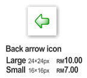

Non-commercial artwork
===

Sometimes, I receive emails from people asking to use my Phoenity icons *commercially*. Most of them are software developers and web designers. I remember the first time receiving such email, I was **shocked**, never even realised that I can actually *sell* icons. I was quite new in this *icons design industry* and had no idea how to reply. Somehow, I rejected the offer and start to think about this.

I'm not experienced in selling stuff online. I'm not sure how much should I charge for the icons. *RM10 per icon?* That would be **RM400 for 40 icons!** Wow. Ridiculous. I don't even take a minute to finish one icon. My icons are so simple that *any* experienced graphic designer can create them in a snap! It's just simply too ironical for me to sell such simplistic artwork. I laughed at it too. Besides, I don't like the term 'commercial'. I like free things, so I should give free things to the public as well. This explains why my Phoenity icons and artwork are licensed under the [Creative Commons Attribution-NonCommercial License](http://creativecommons.org/licenses/by-nc/2.0/).

Till today, I still get such offers. And I've rejected them all. Am I a fool? I can earn money from this, for my education and personal requirements. I can use this money to buy all the stuff in my wish list, such as an iPod or a digital camera. My friends couldn't understand why I'm not gaining anything from this. Paypal buttons are nowhere to be seen and I don't provide any details for donations from other people. Yet, I'm still committed to designing **more** icons. As an aside, I design logos and web sites for my friends and other people too, **free of charge**.

I couldn't explain my reasons in words, specifically. I don't know how.