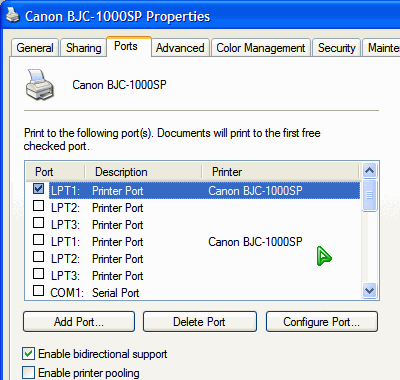

Déjà vu ports
===

Few months ago, maybe last year, I have a problem with my printer. Suddenly Windows couldn't detect my printer automatically. My printer is the [Canon BJC-1000SP](http://bubblejet.canon.com.my/product/bubble_jet/bjc1000sp.htm), an *old* model.

Yesterday, Mr. Steven, my neighbour from the 4th floor of my apartment and also the one who fixed my CD-ROM last time, came to my house and tried to fix this problem. As he was installing drivers and work around the technical stuff, he found something *shocking*. In the 'Ports' tab of the printer properties window, he saw **two** LPT1 printer ports! And even **two** LPT2 and LPT3 ports! Further scrolling down, it also displays **two** COM1, COM2, COM3 and COM4 serial ports! What is happening here?

Later, he take my printer to test it and today, he confirmed that the problem lies in the printer itself. About the ports, he said that my computer system is corrupted. Definitely corrupted. Whoa. I have no idea at all how it can be *this* serious.