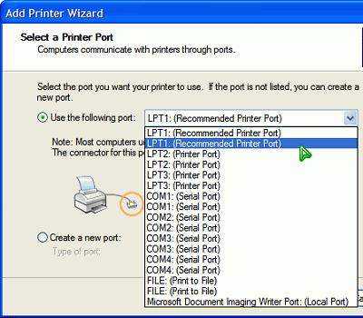

Attack of the cloned ports
===

Two days ago, Mr. Steven has managed to fix my printer. He gave it to me and I was happy. I connect the printer to the parallel port and the power source. The printer runs, cleaning its cartridge head. I boot up my computer and Windows couldn't auto-detect the printer. Okay, I try to use the Add Printer Wizard and it reveals yet again the same *shocking* sight. The wizard lists all ports and **cloned** ports including LPT1, LPT2, LPT3, COM1, COM2, COM3, COM4 and even FILE (Print to File) ports.

I see, maybe my computer system *is* corrupted. Mr. Steven advised me to clean up my hard disk, reformat it completely. Somehow I don't think that this is a software-related problem. I still insist that it's a hardware problem even though he has verified that my printer is okay now. My copy of Windows XP and Windows 98 couldn't auto-detect it. Even Redhat Linux couldn't detect it too.

Well, this is one *weird* problem indeed. To solve this, I might just reformat my hard disk and start all over again. But wait, I have to back up my files first and unfortunately, I don't have CD or DVD burners, portable hard disk drives, Zip drives, Flash drives, back-up drives, whatever. Sigh, maybe I should just leave this and don't care of anything? Maybe not.

What a dilemma.