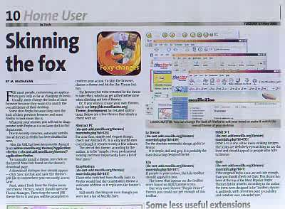

Foxy changes
===

Today in Star In.tech, Mozilla Firefox is yet again featured with few articles written by Chan Lee Meng, Tan Kit Hoong, M. Madhavan, Chris Chong and Zam Karim. This time, it focused on Firefox's wonderful extensions and themes. What excites me is the article about themes by M. Madhavan which he listed few themes that *struck a chord* with the In.tech editors such as Abstract PC, GrayModern, Le Breeze, Lila, Orbit 3+1 and Qute. Wow.

But wait the minute, where's Phoenity? Hmm, maybe it didn't *strike the chord*? Or maybe due to my recent *inactivity* in the themes arena? Sigh, it's time for me to go back to the drawing board then.