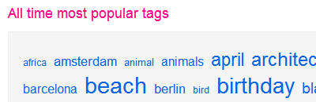

Tag clouds markup
===



Tag clouds are cool though they do have [some disadvantages](http://zeldman.com/daily/0505a.shtml "Remove Forebrain and Serve: Tag Clouds II") as well. I just look at [the popular ones on Flickr](http://flickr.com/photos/tags/ "Popular Tags on Flickr Photo Sharing") and noticed something wrong in the way the cloud is presented. I view the source of the page and realise that it's an **ugly markup**:

```
<p class="TagsBox">
&nbsp;<a href="/photos/tags/africa/" style="font-size: 12px;" class="PopularTag">africa</a>&nbsp;
&nbsp;<a href="/photos/tags/amsterdam/" style="font-size: 17px;" class="PopularTag">amsterdam</a>&nbsp;
&nbsp;<a href="/photos/tags/animal/" style="font-size: 13px;" class="PopularTag">animal</a>&nbsp;
&nbsp;<a href="/photos/tags/animals/" style="font-size: 16px;" class="PopularTag">animals</a>&nbsp;
&nbsp;<a href="/photos/tags/april/" style="font-size: 23px;" class="PopularTag">april</a>&nbsp;
&nbsp;<a href="/photos/tags/architecture/" style="font-size: 24px;" class="PopularTag">architecture</a>&nbsp;
&nbsp;<a href="/photos/tags/art/" style="font-size: 30px;" class="PopularTag">art</a>&nbsp;
&nbsp;<a href="/photos/tags/austin/" style="font-size: 12px;" class="PopularTag">austin</a>&nbsp;
&nbsp;<a href="/photos/tags/australia/" style="font-size: 23px;" class="PopularTag">australia</a>&nbsp;
&nbsp;<a href="/photos/tags/baby/" style="font-size: 23px;" class="PopularTag">baby</a>&nbsp;
&nbsp;<a href="/photos/tags/barcelona/" style="font-size: 16px;" class="PopularTag">barcelona</a>&nbsp;
...
</p>
```

How *awful*. The cloud shows a list of popular tags, sorted out of order, based on the popularity of the individual tag. The more popular the tag is, the bigger its font size gets. If I'm not mistaken, the `font-size` value should be generated from the server scripting, calculated relative to the tags' popularity.

So, let's clean it up:

```
<ul class="popular-tags-cloud">
<li><a href="/photos/tags/africa/" class="popular-tag-12">africa</a></li>
<li><a href="/photos/tags/amsterdam/" class="popular-tag-17">amsterdam</a></li>
<li><a href="/photos/tags/animal/" class="popular-tag-13">animal</a></li>
<li><a href="/photos/tags/animals/" class="popular-tag-16">animals</a></li>
<li><a href="/photos/tags/april/" class="popular-tag-23">april</a></li>
<li><a href="/photos/tags/architecture/" class="popular-tag-24">architecture</a></li>
<li><a href="/photos/tags/art/" class="popular-tag-30">art</a></li>
<li><a href="/photos/tags/austin/" class="popular-tag-12">austin</a></li>
<li><a href="/photos/tags/australia/" class="popular-tag-23">australia</a></li>
<li><a href="/photos/tags/baby/" class="popular-tag-23">baby</a></li>
<li><a href="/photos/tags/barcelona/" class="popular-tag-16">barcelona</a></li>
...
</ul>
```

I replace the `p` tag with `ul` because it's an *unordered list* and the tags turned into list items. I've also changed the class of the tags to be more semantic. Inline styles are removed and an external stylesheet is applied for presentational purposes, for example:

<pre><code><em class="remark">/* remove spaces and bullets */</em>
.popular-tags-cloud{
margin: 0;
padding: 0;
list-style-type: none;
}

<em class="remark">/* make the list items inline and add spaces between tags */</em>
.popular-tags-cloud li{
display: inline;
margin: 0 .3em;
padding: 0;
}

<em class="remark">/* tags&apos; font size */</em>
.popular-tag-10{ font-size: 10px; }
.popular-tag-11{ font-size: 11px; }
.popular-tag-12{ font-size: 12px; }
.popular-tag-13{ font-size: 13px; }
.popular-tag-14{ font-size: 14px; }
.popular-tag-15{ font-size: 15px; }
.popular-tag-16{ font-size: 16px; }
.popular-tag-17{ font-size: 17px; }
.popular-tag-18{ font-size: 18px; }
.popular-tag-19{ font-size: 19px; }
.popular-tag-20{ font-size: 20px; }
.popular-tag-21{ font-size: 21px; }
.popular-tag-22{ font-size: 22px; }
.popular-tag-23{ font-size: 23px; }
.popular-tag-24{ font-size: 24px; }
.popular-tag-25{ font-size: 25px; }
.popular-tag-26{ font-size: 26px; }
.popular-tag-27{ font-size: 27px; }
.popular-tag-28{ font-size: 28px; }
.popular-tag-29{ font-size: 29px; }
.popular-tag-30{ font-size: 30px; }
...</code></pre>

There, the codes look better now.