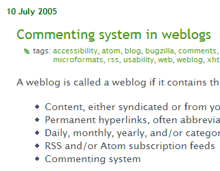

Automatic tagging system
===

A lot of sites have implemented tagging systems nowadays. We tag our bookmarks on various social bookmarking sites such as [del.icio.us](http://del.icio.us/), [de.lirio.us](http://de.lirio.us/), [Furl](http://furl.net/), [BlogMarks](http://blogmarks.net/), [Simpy](http://simpy.com/) and [Wists](http://wists.com/). We also tag our photos and images on [Flickr](http://flickr.com/). We even tag the things we do on [43 Things](http://43things.com/) and places around the world on [43 Places](http://43places.com/). It's obvious that [tagging is pure fun](http://ok-cancel.com/archives/article/2005/07/tagging-for-fun-and-finding.html "Tagging for Fun and Finding").

Okay now it's time for us to tag our weblog posts. But how?

For some sites powered by [MovableType](http://movabletype.org/) or [Wordpress](http://wordpress.org/), there's the *existing* categorical archiving system which can be used for tagging. I'm not very sure about the difference between categories and tags but I do notice some sites implement this. If I'm not mistaken, categories are hierarchical but tags are *flat*, right? When you organise your posts into categories, you might have to think if your future posts will use the same categories again. For tags, you are virtually free to specify *any* keywords that could add *visible data* relevant to the post.

Currently, I'm using [Blogger](http://blogger.com/) as my content publishing system. It's pitiful that there are **no** categories or tags to play with, yet. It seems that the only way for me to tag is to use a [Greasemonkey script](http://falsepositives.blogspot.com/2005/05/technorati-and-delicious-tags-added.html " Technorati and del.icio.us Tags added with GreaseMonkey for Blogger.com users") which provides easy tagging for Blogger's posting interface. I'll just have to edit my previous blog posts and tag **all of them** one by one, breaking my fingers while navigating the mouse. *That* would be quite tiring though. To be frank, I'm a lazy guy. So lazy that I don't even know how many blog entries I've posted since the day I started blogging.

Due to my laziness, I have accidentally came up with an idea. *Manual* tagging is not a solution for me. So here I introduce the **automatic tagging system**. Just observe around and notice that it's *already* implemented on my blog. Generally, the concept is almost like how Jonathon Snook [adds tagging](http://snook.ca/archives/000385.html "How I Added Tagging Using PHP and MySQL") for [FontSmack](http://fontsmack.com/). He uses PHP and MySQL to do the job. While I use **only** PHP. **No** MySQL or any database at all.

The system is very simple. Let's say if an article contains the keyword 'PHP', then it will be tagged '[php](http://technorati.com/tag/php "Technorati Tag: php")'. The tagging works relatively based on the presented content. If the 'PHP' keyword is not found, then it will not be tagged as such. I don't have to tag all posts by myself because the script will run through all my blog entries and tag them *automatically*. What I only need to do is to maintain a *tags list* to be used for the tagging system. The tags point to [Technorati Tags](http://technorati.com/tag/) and are displayed *almost* like Tantek's [site](http://tantek.com/log/ "Tantek's Thoughts").

Being a PHP beginner, I am way too embarrassed to show off the tagging codes to the public. Yet, it's still in beta testing. I think I will only release them based on special requests. While you're here, feel free to browse around and evaluate the efficiency of this implementation.

Cheers.