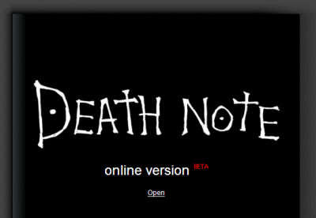

Another project, Death Note
===

Ya, I have *my* own projects, in case if you're wondering. I've done a content aggregation site before, using [lilina](http://lilina.sourceforge.net/). I've done a mapping site before, using [worldKit](http://worldkit.org/). I learn a lot through these projects. Now I'm stepping my foot on another one. A good one, I think. I somehow got the idea when I was on the way back to my hometown, feeling so bored in the bus.

It's called [Death Note](http://www.deathnoteonline.com/ "Death Note (online)").

Let me repeat, it's **Death** Note. Sounds scary?

")

For your information, [Death Note](http://en.wikipedia.org/wiki/Death_Note) is the name of a Japanese [manga](http://en.wikipedia.org/wiki/Manga). The story begins with a notebook that could kill people, by merely writing the name. Of course, it may sound simple, but there are some rules using the book and all that death god stuff. So, I think it would better for you to watch the movie or animation, or read the comic just to *experience* its exciting storyline.

Okay, I'll just continue now, *assuming* that you know much about Death Note. Haha. Basically speaking, I'm just trying to create a web page that looks like Death Note and *partially* works like Death Note. In other words, make it look like a book and works like a book. Is that hard? Maybe.

The first thing I thought is how the *book* is going to work. According to the [Death Note rules](http://en.wikipedia.org/wiki/Death_Note#Rules_of_the_Death_Note "Rules of the Death Note"):

> - The human whose name is written in this note shall die.
>
> - This note will not take effect unless the writer has the subject's face in their mind when writing his/her name. Therefore, people sharing the same name will not be affected.
>
> - If the cause of death is written within 40 seconds of writing the subject's name, it will happen.
>
> - If the cause of death is not specified, the subject will simply die of a heart attack.
>
> - After writing the cause of death, the details of the death should be written in the next 6 minutes and 40 seconds.
>
> — <http://en.wikipedia.org/wiki/Death_Note#Rules_of_the_Death_Note>

Cool, eh?

There will be three fields to be filled which are the name, cause and details of death. The name is compulsory while the other two fields are optional. But the cause is compulsory if there are details. The name may be optional too, because the cause and details can be written first, later the name is written. That may work on the *real* Death Note, but definitely not the one I'm making. After the fields are filled up, it has to be added to the database and cannot be re-edited again, unless I create a user registration system. However, I'm not planning to do that. I wanted this online version of Death Note to be written by people **anonymously**, just like how Kira did. There will be no records on that. Anyone will be able to post death entries to the site. **Anyone**.

From one perspective, what I need is only a posting system, for example a commenting script of a weblog. It will have features like a posting form interface, paging system with archives and an administration interface. I would prefer to use flat file database to store all the entries, instead of MySQL. As lazy as I get, I search for scripts on [Hotscripts.com](http://hotscripts.com/), tried a lot of scripts, and finally settle down on a [guestbook script from flumpCakes](http://flumpcakes.co.uk/php/guestbook/). The script is simple and light enough for me to modify and tweak to my liking.

After the back-end script is done, I start to design the site to look *almost exactly* like a Death Note. It may seem difficult to design a site to look like a book, but with CSS, anything is possible. The secret behind it is `line-height` and probably `min-height`, if you know CSS. For the first time ever, I start to use a 32-bit alpha-transparent PNG image on a public web page! It's an image of a pen with very cool shadows casting on the lines of the page. It works on Firefox and even on Internet Explorer 7! As for Internet Explorer 6 and maybe older, I use [an easy hack](http://blog.bjorkoy.com/2006/12/12/flawless-and-fast-png-support-in-ie6/ "
The easiest way to PNG support in IE6 ") along with some conditional comments to filter the styles.

The back-end script and design is done. Then what? Of course, this project is also an excuse for me to learn how to do those cool web 2.0 effects with frameworks such as [Prototype](http://prototype.conio.net/ "Prototype JavaScript Framework") and [script.aculo.us](http://script.aculo.us/). Anyway, I love simple things, so I chose [moo.fx](http://moofx.mad4milk.net/) and [mootools](http://mootools.net/) instead. It was so much fun! However, the cool effects are mostly focused on the entry form, so not many people will notice them.

Before I start uploading the files for public consumption, I first experiment it in my hostel, via LAN, where everyone could access the web page on my computer. It went on smoothly though. I was wondering how this kind of site would affect people. Just think about it, are people going to write the name of the person who they want to die? What would people think? Death is a serious topic, but could people treat it as a joke in this case? I thought of a possibility that this site will become sort of a hate site or stress-relieve site, since people know that this online Death Note **will not work** as realistic as the one in the story. Some people might get pretty upset by the *inhumane* entries written by other people. So I guess, this site proves that such people exists, unfortunately.

I have expected few things. Someone will write popular names, for example, Bill Gates? Someone might write names of political people. Some will write their friend's name, for the sake of fun. Some could write the names of bad people, probably bullies or criminals. Some might just read through all the *funny* entries in Death Note and maybe too freaked out to add an entry there. Yet, someone might just write **my name**.

Wicked.

There are some crazy ideas as well. I thought of allowing people to upload photos. Instead of the writer having the person's face in their mind when writing the name, why not have the person's face **in the note?** Haha! Before this, I thought of adding some stuff like [Captcha](http://en.wikipedia.org/wiki/Captcha) to get rid of spams, but I kind of trying very hard to preserve the nature of the book. A book doesn't have Captcha, right?

On 18 December 2006, I decided to launch it online. Open to the public. I realised few things. First, Death Note can be multi-lingual! Second, I am not multi-lingual, enough. Third, I don't know how to filter *inappropriate* phrases of other languages. Sigh, I'm not even sure *if* i should filter them nor *how* to filter!? I might as well don't care about it yet. Few days after the launch, I started working on a subscription feed and pass it through [FeedBurner](http://feedburner.com/). Few weeks later, I asked my friend, Simon Lim, to code a simple AJAX-powered search engine for the online Death Note. It works great and really, really cool. I actually took quite some time to think how to integrate the search feature *without* affecting the nature of the book. Haha!

As of today, 5 January 2007, 19 days since the date of launch, there are **97 pages** of entries on the online Death Note, each page containing up to 10 entries. The site is steadily getting an average of **1000 page loads** and **200 unique visitors** per day. Also, an average of **13 subscribers** for the feed. Cool. And surprising too.

As a disclaimer, this project is not meant to *promote death* or anything *evil*. Please do not misunderstand. All I can say is, this site can be described with three words, **funny**, **scary** and **reality**. The note contains quite a number of hilarious entries that should be laughable. I purposely design the site to look scary enough so that people would be freaked out to add an entry. If there are people who treat this seriously, this is what you call, reality. Think about it, again.

Okay, this is all. Please do note that I've added a *hidden* Easter Egg on the site, waiting for anyone to find it. Further improvements are on the way, depending on the number of feedback I'm getting. Enjoy.

**Death Note rules.**

**Update 16 February 2007**: The Death Note site now [has its own domain!](http://www.deathnoteonline.com/ "Death Note (online)") Cool!

**Update 13 February 2011**: The site is now long gone due to intellectual property rights.