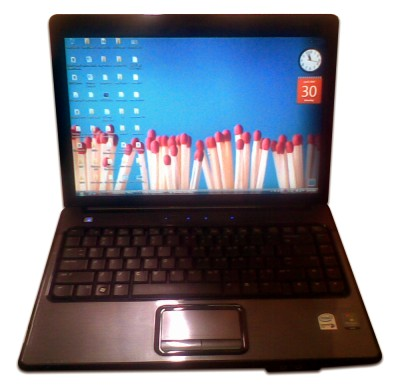

Laptop, Vista and examination
===

April is a great month. Quite great. Let's start:

- 
	

	Finally, **I got myself a new laptop!** It's a [HP Compaq Presario V3205TU](http://h10010.www1.hp.com/wwpc/my/en/ho/WF06b/1090709-1116637-1123071-1123071-1123071-13031696-78196163.html "Compaq Presario V3205TU Notebook PC specifications"), bought on 9 April 2007. I choose it over other products because it just looks so sleek. Intel Core 2 Duo processor, 1Gb RAM, 120Gb hard disk memory space, 14.1" WXGA High Definition BrightView Widescreen Display and Altec Lansing speakers. Okay enough for my needs.

- Also, my new laptop runs on **Windows Vista**. Tried it, tested it, pretty satisfied with it. The Aero effects are nice. I couldn't get used to it at first, because my eyes couldn't adapt to its eye candy effects. I'm glad few of my favourite software works great on Vista, such as, [Mozilla Firefox](http://firefox.com/), [AntiVir PersonalEdition Classic](http://free-av.com/) and [IrfanView](http://irfanview.com/). I've also had fun with [Switcher](http://insentient.net/) and [VirtualBox](http://virtualbox.org/).

	And ya, the wallpaper shown on the photo is called [Ready for ignition](http://flickr.com/photos/photomomo/421018724/), looks great on a wide-screen display.

- Actually, I'm having my semester examination, started last Monday. The first paper, Data Communications And Networks, is quite okay. The next paper, Operating Systems, is okay too. The third paper, Economics, is really not okay. The fourth paper, Computer Object-Oriented Programming, is of course, **super okay** for me. Haha. The last paper is on 7 May, so I have one week of free time to get ready because it will be a difficult one. Wish me luck.