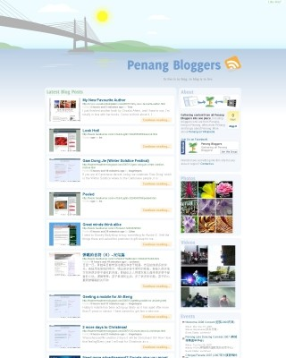
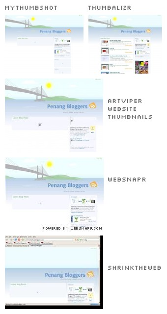

PenangBloggers.com launched
===

Yes, a [domain name for the Penang Bloggers portal](http://penangbloggers.com/)! And of course, after about two years, **a whole new refreshing design**. Even the back-end script has been rewritten from scratch. Perhaps I should say, it's a totally different script.

Previously, the Penang Bloggers portal hosted under my phoenity.com domain, was powered by [Lilina](http://getlilina.org/). It's a good script. However, I kind of got tired of hacking the internal code to my liking. And I found that managing the feeds is quite a hassle with all those feed cache, feed compatibility and stuff. I need something new, therefore decided to use the [Google AJAX Feed API](http://code.google.com/apis/ajaxfeeds/), a client-side JavaScript-based solution to parsing feeds. Before that, I did try another similar solution called [SimplePie Live](http://live.simplepie.org/). It's really cool that everything can be done with just few lines of JavaScript code! I tried comparing both hosted scripts and did not find much significant difference, in terms of code and documentation. I choose Google's feed API in the end, probably because [Google servers are much faster](http://dean.edwards.name/weblog/2007/03/google-it/ "Using Google To Serve Faster JavaScript").

When I'm thinking of a new design for the site, I did some research of other content aggregation sites such as:

- [mozillaZine feedHouse](http://feedhouse.mozillazine.org/)
- [Planet Malaysia](http://www.planetmy.com/)
- [Bloglah](http://www.bloglah.org/)
- [Project Petaling Street](http://www.petalingstreet.org/)

Obviously, the page layout and design are either a bunch of links or a pile of blog posts all compiled into one page. A bunch of links makes the site looks like a **link dump site**. A pile of blog posts on a single page makes the site **loads too slow**. No offense though, but I just feel that the layout can be further improved. Here is a list of notes I made when designing the portal site:

- The site shouldn't show only a bunch of links because it's boring, at least for me. It's not a social bookmarking site like [del.icio.us](http://del.icio.us/).

- The aggregated blog posts should at least contain the post title and content. The content should be a summary of the whole post entry, so that it won't clutter the page and will not have site-specific formatting issues such as aligned images. If the visitor would love to read more, a 'continue reading' button is provided, potentially sending traffic to the original blog site. Good.

- Since this is a site where all blog posts compiled into one, it doesn't make sense to show the readers *the exact date* of a post, provided that everyone should expect all blog posts are written within 24 hours period. At most, a week or two. Therefore, it's preferable to show the time *since* the entry was posted, for example 'posted 5 hours and 40 minutes ago', just like how [Technorati](http://www.technorati.com/) does it.

- For each blog entry, the entry URL, author, source information are optional. Or should I say, insignificant. So, they are rendered with a small font size. In addition, the layout and colors are slightly inspired by [Firefox 3's new almighty location bar](http://mozillalinks.org/wp/2007/11/firefox-3-location-bar-just-became-almighty/ "Firefox 3 location bar just became almighty"), as quoted:

	> According to studies on human cognition, it is easier for us to isolate elements on an image based on different coloring than any other attribute.
	>
	> — <http://mozillalinks.org/wp/2007/11/firefox-3-location-bar-just-became-almighty/>

	Pretty neat.

Okay, done? No.

The initial layout is too plain, somehow. The list of blog posts are from various blogs, so I need to provide a visual cue for visitors to recognise where the post originates from. At first, I thought of grabbing the site icon, or so-called [favicon](http://en.wikipedia.org/wiki/Favicon) for each blog site. It can be done with CSS Guy's [Hyperlink Cues with Favicons](http://www.askthecssguy.com/2006/12/hyperlink_cues_with_favicons.html). Awesome, but I found a much, much better way.

**Web site thumbnails**.

If I'm not mistaken, it's easier to recognise a web site from its design viewpoint than its favicon. So, I've taken some time to try almost all web site thumbnail providers and it comes down to these few promising services:

- [MyThumbShot](http://www.mythumbshot.com/)
- [websnapr](http://www.websnapr.com/)
- [thumbalizr](http://www.thumbalizr.com/)
- [ShrinkTheWeb](http://www.shrinktheweb.com/)
- [artViper Website Thumbnails](http://www.artviper.com/tools.php)

There are few criterias to be considered, such as the queue time to produce the thumbnail image, the image quality, the image dimensions provided, JavaScript or Flash support and the implementation methods or API. [Websnapr](http://www.websnapr.com/) and [thumbalizr](http://www.thumbalizr.com/) watermark the image with a URL text of their web sites. It's a little ugly, but well, they are free anyway. [MyThumbShot](http://www.mythumbshot.com/) and [artViper Website Thumbnails](http://www.artviper.com/tools.php) can be quite slow sometimes for its queuing time. [ShrinkTheWeb](http://www.shrinktheweb.com/) does not only create a screenshot of the web page but also includes the browser chrome. *Very, very ugly*. I decided to use websnapr because it's quite reliable and its queuing time is the shortest so far. Also note that I use thumbalizr on [my tumblelog](http://cheeaun.tumblr.com/ "cheeauntumb"), instead.

Using the Google AJAX Feed API, I code the site to fetch four feeds. The first feed is the blog posts of all penang bloggers. Even though the API [allows displaying a collection of feeds](http://code.google.com/apis/ajaxfeeds/documentation/#FEEDCONTROL "The FeedControl"), I need an easier method to merge multiple feeds into one **and** manage them. Simple, I use [Google Reader](http://www.google.com/reader/) with its [public page](http://www.google.com/support/reader/bin/answer.py?answer=70656 "How do I create a public page?") settings, which I could make a tag *public*. The other three feeds are the [photos from Flickr](http://flickr.com/photos/tags/penang/ "Flickr: Photos tagged with Penang"), [videos from Youtube](http://youtube.com/results?search_query=penang) and [events from Google Calendar](http://www.google.com/calendar/embed?src=alexlee76%40gmail.com&ctz=Asia/Kuala_Lumpur) made by Alex Lee.

I drew the whole header scene on [PenangBloggers.com](http://penangbloggers.com/). The Penang island and the Penang bridge. Light colour scheme. The Pinang tree, or [Betel nut](http://en.wikipedia.org/wiki/Betel_nut) tree, as the logo and used in the banners. With a little [Mootools](http://mootools.net/) magic, I add a little animation to the page, such as the floating feed icon and the moving cloud, *if you could see them*. To encourage community involvement, I even create a [Penang Bloggers group on Facebook](http://www.facebook.com/group.php?gid=22807221240)!

So is it done? Yes, for now.

Feel free to view the [Penang Bloggers web site](http://penangbloggers.com/) in its full glory.

**Update 1 January 2008**: The site is now *friendly* to Internet Explorer 6 users, [as requested](http://www.webmastermalaysia.com/showcase/12261-penangbloggers-com.html#post68506). Also, I've temporarily changed the thumbnail provider to [MyThumbShot](http://www.mythumbshot.com/), after finding some problems with [websnapr](http://www.websnapr.com/). Might be switching back and forth though.
