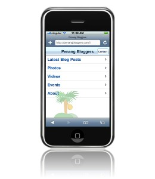
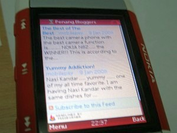

Mobile-friendly version of PenangBloggers.com
===

Last week, I've been trying to make [PenangBloggers.com](http://penangbloggers.com/) **mobile-friendly** so that phone or PDA users could look out for the latest blog posts. Also, I would love to include [iPhone](http://www.apple.com/iphone/) as well. And perhaps try to create an iPhone-friendly site since there are [so](http://www.digg.com/iphone "Digg") [many](http://i.bloglines.com/ "iBloglines") [out](http://iphone.facebook.com/ "Facebook") there. As the matter a fact, it shouldn't be called 'iPhone-friendly' because iPod touch has Mobile Safari as well. So, it's better that I use the term '**Mobile Safari**-friendly'.

First, I start with the development for Mobile Safari. It's cool. It's one of the best mobile web browsers ever.

But, **I don't have an iPhone**.

Or iPod Touch.

How?

Here, I'll reveal the steps:

1. **You need a template**. A complete web template that is made for Mobile Safari. [Knox iPhone Template](http://www.ebaspace.com/2007/08/20/create-iphone-apps-with-knox-iphone-template/ "Create iPhone Web Apps With Knox iPhone Template") is the one, which is also packed with Joe Hewitt's [iPhone navigation work](http://www.joehewitt.com/blog/introducing_iui.php "Introducing iUI"), [iUI](http://code.google.com/p/iui/). Play around, it's really simple. It's truly amazing that Mobile Safari could support Javascript. Even [Bejeweled for iPhone](http://static.popcap.com/iphone/) uses [Mootools](http://mootools.net/)!

2. **You need Safari**. The [desktop web browser](http://www.apple.com/safari/), I mean. As of now, the version 3 Public Beta is great and free for both Mac *and* PC. Why do you need it? It's because I found that the template contains [Safari-proprietary styles](http://developer.apple.com/documentation/AppleApplications/Reference/SafariCSSRef/Introduction.html "Introduction to Safari CSS Reference") such as `-webkit-border-image` and `-webkit-text-size-adjust`. Those doesn't work on other browsers.

3. **You need an emulator**. A Mobile Safari emulator. An iPhone simulator. An iPod Touch simulator. *Anything.* [iPhoney](http://www.marketcircle.com/iphoney/) looks really good, but it works only on Mac. I'm on Windows, so the only solution is the online [iPhone tester](http://iphonetester.com/) and [TestiPhone.com](http://www.testiphone.com). These sites require Safari 3 for the *real* experience.

4. **You need Mobile Safari**. Buy iPhone. *Just kidding.* At least, pick one from your friends list who owns the device and ask them to test the site. Here in Malaysia, it's hard to find that particular person. I do know few, but don't have the guts to ask them, don't ask me why. Perhaps I'll just walk to an Apple reseller store, try out iPod Touch and probably load the site in Mobile Safari. Later, I found that there's no Internet connection there.

The final result is the [Mobile Safari-friendly version of PenangBloggers.com](http://penangbloggers.com/i).

Cool. I did it!

However, the [GeminiGeek](http://geminigeek.com/) guy, who shares the same birth date as myself, told me that iPhone **is not hot stuff in Malaysia**, yet. I [got excited on my own in the forums](http://www.facebook.com/topic.php?uid=22807221240&topic=3423). Hmm...

Okay now, let's do a non-Mobile-Safari version of the mobile site. What other *mobile web browsers* do we have? Of course, we have the great [Opera Mini](http://www.operamini.com/)! My [Nokia 5300](http://en.wikipedia.org/wiki/Nokia_5300) has a built-in browser which I really hate to use. I use Opera Mini all the time. I did a search online and found a [publisher tip from Feedburner](http://blogs.feedburner.com/tips/ "FeedBurner Publisher Tips") on how to [make your site mobile friendly in under 5 minutes](http://blogs.feedburner.com/tips/optimize/make_your_site_mobile_in_under/).

The article explains everything in details, but I'll wrap it up in a simple and quick list here:

1. Publish your site feed with [FeedBurner](http://www.feedburner.com/). This is compulsory.

2. Sign in, go to the particular feed page, and under the 'Publicize' tab, go to the 'BuzzBoost' page.

3. Set up the settings and display preferences, then **Activate** the service.

4. Embed the BuzzBoost code on a web page and make it accessible via URLs such as 'domainname.com/mobile', 'domainname.com/m' or 'm.domainname.com'.

5. Test the site with the [Opera Mini simulator](http://www.operamini.com/demo/) or on your mobile device.

6. Done!

The final result is a [mobile-friendly version of PenangBloggers.com](http://penangbloggers.com/m). Sure, I did some customizations on the page stylings, so that it looks nice on Opera Mini, on my phone. It should work on other mobile browsers as well, though the page doesn't work on the built-in browser of my phone because it doesn't support Javascript. *Who cares*, right?

The mobile pages are up and running. I hope this will be useful for the visitors of [PenangBloggers.com](http://penangbloggers.com/) and interested web developers.