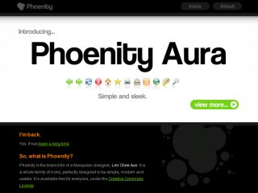

Phoenity is back
===

Phoenity.

What a nice name.

That's what I said [last time](/blog/2006/01/fate-of-phoenity "The fate of Phoenity"). Even now, it is still a **very nice name**. Phoenity.

Good news everyone, **I'm back**. [Phoenity is back](http://phoenity.com/). For the past two years, I've been very busy with university life and never actually have time for Phoenity. Many things have changed since then. Few things I noticed are:

- The *explosive* emergence of [free](http://www.smashingmagazine.com/2007/08/25/20-free-and-fresh-icon-sets/ "20+ Free And Fresh Icon Sets") [icon](http://speckyboy.com/2008/01/01/top-25-free-icon-resources-for-web-designers/ "Top 25 Free Icon Resources for Web Designers") [sets](http://www.smashingmagazine.com/2007/11/29/icons-for-your-desktop-and-icons-for-your-web-designs/ "Icons For Your Desktop and Icons For Your Web Designs") from various talented designers. There are so many beautiful icons these days that sometimes I felt how *insignificant* Phoenity is. For some reasons, it's a great thing for me because I'm an icon lover. I started to have interest in icons ever since the release of Windows XP, which was in 2001.

- The original [Phoenity Firefox](https://addons.mozilla.org/en-US/firefox/addon/1406) theme development by John Ramirez has been inactive for over a year. I guess John is a little busy with *Real Life*. Surprisingly, the only long-lasting Phoenity theme is [Phoenity Modern](https://addons.mozilla.org/en-US/firefox/addon/1013) by Kuden! Kudos to Kuden! Quite unbelievable that he could maintain that theme till *now*.

- In the MozillaZine [Theme Development](http://forums.mozillazine.org/viewforum.php?f=18) forum, I'm glad to [see few familiar names](http://forums.mozillazine.org/viewtopic.php?t=617422 "Phoenity Aura theme development"). Haha.

Around the month of December last year, I started planning on how to *revive* Phoenity. To tell the truth, I never manage to recover the files from my dead hard drive. So, I can't possibly do much with the old icons. But then, I have an idea. Why not create a *new* set of icons? An *improved* set. The old Phoenity design has never been a *professional* one, [depending on how you define it](http://www.mozillazine.org/talkback.html?article=3809 "Phoenity Online Store Launches"). I need to create a much better version, based on all the experience and knowledge I've gained for past years.

This is the time for me to introduce my new icon set, **Phoenity Aura**.

Nice name, eh?

Wondering what's the difference between the old and new design? The old design, which I rename it as Phoenity *Classic*, is basically drawn with thick, blurry borders, circular gradients, no shadows, limited colours, and cartoonish looks. On the new design, the icons are drawn all the way down to the **pixel level**. Yes, [pixels do](http://mezzoblue.com/archives/2007/02/21/icon_design/ "Icon Design: Sizing") [matter in](http://mezzoblue.com/archives/2007/07/11/icon_design/ "Icon Design: Anti-Aliasing") [icon design](http://www.firewheeldesign.com/sparkplug/2006/April/icon_design_bitmap_vs_vector.php "Icon Design: Bitmap vs Vector"). Slight realism with focus on details. I call Phoenity Aura the ultimate **successor** of the classic icons.

I took few weeks drawing about 3-5 icons a day and started off by creating the [Phoenity Aura theme for Firefox](http://forums.mozillazine.org/viewtopic.php?t=617422 "Phoenity Aura theme development"). I'm very glad that the icons are [looking](http://twitter.com/liewcf/statuses/589824452) [great](http://tumblr.jarkolicious.com/post/23624832). The [Phoenity web site](http://phoenity.com/) is redesigned with a little black-and-white touch, so that Phoenity will have a refreshing start this new year 2008. As of now, [Phoenity Aura theme](https://addons.mozilla.org/en-US/firefox/addon/6278) only works on Firefox 2. I plan to update it once Firefox 3 is out of beta, or perhaps work it out for the Beta 2 if I have the time. Well that depends on public reviews and requests, though.

Feel free to [browse around](http://phoenity.com/ "Phoenity") and if you like my work, why not [donate few bucks](http://www.pledgie.com/campaigns/480 "Support Phoenity")?

As an aside, I am [one of the winners](http://www.intothefuzz.com/2008/01/11/and-the-winners-are/ "And the Winners Are…") of the [Firefox 3 Beta 2 'robot' artwork interpretation contest](http://www.intothefuzz.com/2007/12/19/the-robots-are-coming/ "The Robots Are Coming!") by John Slater. Thanks a lot! This is [my *analytical* entry](http://www.intothefuzz.com/2007/12/19/the-robots-are-coming/#comment-2009):

> Ok, I'll join the fun.
>
> The robot doesn't seem like a bad guy. It's actually a good guy! It's beaming up the Firefox logo in the sky, just like in the Batman movies! It'll fight off all the bad guys with its powerful boxing gloves and could run super fast like Flash (notice the Flash superhero symbol on the ears?). It's built to be tough against any attacks, bugs and even evil UFO's that shoot down buildings. "The world needs Firefox 3!" The robot's antenna (on the head) shall spread the news through all forms of telecommunication. Though it's getting dark (notice the dark background and the sun sets), the robot shall not rest and will always fight till the end! Firefox rules!
>
> The end.
>
> — <http://www.intothefuzz.com/2007/12/19/the-robots-are-coming/#comment-2009>

I'll be expecting a [Firefox Black T-Shirt](http://store.mozilla.org/product.php?code=MZ13009&catid=9) when I'm back to my hometown during the Chinese New Year next month. The best gift ever!