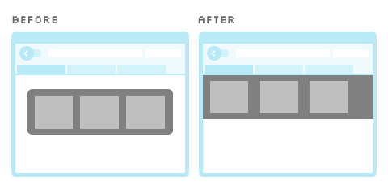
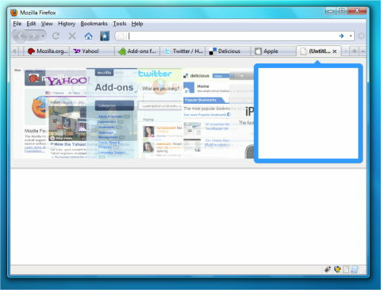

Tab previews idea for Firefox
===

Tab previews feature is not a new idea. It was originally planned for [Firefox 3](http://mozillalinks.org/wp/2007/11/firefox-3-gets-beautiful-tab-switching/ "Beautiful tab switching for Firefox 3") and [3.5](http://mozillalinks.org/wp/2008/11/meet-firefox-31-new-tab-preview-panel/ "Meet Firefox 3.1 new tab preview panel") (was known as [3.1](http://mozillalinks.org/wp/2008/07/new-tab-switching-added-for-firefox-31/ "
New tab switching added for Firefox 3.1")). Now, it's [back again in the Firefox 3.6 nightlies](http://mozillalinks.org/wp/2009/08/tab-previews-in-firefox-3-6-third-time-the-charm/ "
Tab previews in Firefox 3.6. Third time the charm?"). There is also the [Ctrl-Tab](https://addons.mozilla.org/en-US/firefox/addon/5244) extension by Dao Gottwald, for you to install and try.

In my opinion, this is a very cool feature. I've tried the extension on my Firefox and felt that it can be further improved. One of first thing that I personally find weird is the position of the previews pane, which is always at the center of the screen. I know that this mimics the `Alt`+`Tab` or `Cmd`+`Tab` switching pane on Windows, Mac and Linux, but when I `Ctrl`+`Tab` on a web browser, my eyes have gotten used to look at the tab bar area which is slightly higher than the center of the screen. This is also the same case where I couldn't get use to the most-recently-used order when switching tabs. Frankly speaking, I'm not a fan of both *features* and not really sure if they are done the *right way*.

However, I have an idea for the tab switching pane to be positioned at the **bottom** of the tab bar instead.

If the tab switching pane *sticks* to the tab bar, there is no need for me to move my eyes to the center of the screen. The previews can be arranged based on the order of the tabs and probably overlap on one another if there are too many tabs. Switching tabs could even be as fancy as [Cover Flow](http://en.wikipedia.org/wiki/Cover_Flow), like in most Mac applications such as Safari.

Here are some mockups:

Upon triggering the `Ctrl`+`Tab` shortcut, the pane appears at the bottom of the tab bar, showing previews of the web pages. Current selected preview is highlighted with a border and an arrow pointing to its mutual tab. Previews that are not selected fade with a slight transparency.

From this point, there are few possibilities when tabbing through the list of tabs. As long as the `Ctrl` key is not released, some sort of 'Tab Previews' mode kicks in and in this mode, pressing `Tab` will move to the next preview. When the preview is highlighted, its related tab may probably be in selected state **or** hover state. Previews will scroll together with the tabs when there are too many of them. When tabbing through the list, the current page stays. So, if I'm on google.com, pressing `Ctrl`+`Tab` will flick through the previews as Google's homepage is still visible *under* the pane. In the 'Tab Previews' mode, pressing `Ctrl`+`Esc` could just *escape* and cancel the action of switching to a tab. `Ctrl`+`Left` and `Ctrl`+`Right` could switch to the previous or next tab. And of course, releasing the `Ctrl` key exits the 'Tab Previews' mode and switch to the tab of the last highlighted preview.

That's all. As simple as it gets. I would be very interested to see this idea implemented into an extension.

**Update 4 August 2009**: Thanks to [@sryo](http://twitter.com/sryo/status/3123328670), I found that [a similar idea has been proposed](http://www.azarask.in/blog/post/firefox-31-control-tab-woes/ "Firefox 3.1: Control-Tab Woes") before, by Aza Raskin. Oh well, mine *pushes* it slightly further.