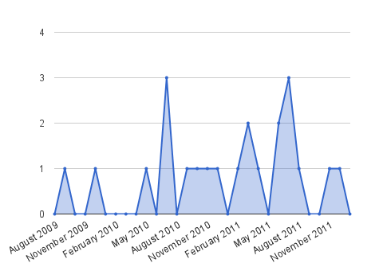

What I've done this year
===

I think my blog looks very deserted here, so I thought why not write a post by the end of the year? Obviously I'm not good at new year resolutions, so perhaps writing what I've done for the past year would be a better idea.

Not specifically this year, but for the past 3 years since 2009, I've been tweeting about strangers keep asking me for directions. Heck I've created my very own **#askdirection** hashtag for these occassions. Looking through my Twitter archives, the [first relevant tweet](https://twitter.com/cheeaun/statuses/3967617758) seems to be posted on 14 September 2009.

Thanks to Google Spreadsheet, here is a roughly-made chart showing the number of times I've been asked every month:

It averages to about 0.7333 per month. The reason is probably because I look <del>good</del> *trusty* and people seems to think that I know every single place on the planet. But the data is **all** in Singapore! On a small island. Surrounded by water. And flash floods.

Aside from this, I've been watching a lot of anime series. Yes, [anime](http://en.wikipedia.org/wiki/Anime). As some anime or manga lovers may know, there's this so-called the **big three**; [One Piece](http://en.wikipedia.org/wiki/One_piece), [Naruto](http://en.wikipedia.org/wiki/Naruto) and [Bleach](http://en.wikipedia.org/wiki/Bleach). One Piece is the only anime that's not in my watching list for years, and this year, I've manage to unlock the achievement of watching the anime from the first episode on 27 January 2011 to episode 494 on 17 April 2011. That's like almost **500 episodes** in just **3 months**! To put things into perspective, the first episode was aired on October 1999 and episode 494 is on April 2011. I'll never forget how my weekends feel like months gone by and it's really **one hell of an adventure**.

Besides One Piece, the other mentionable anime I've watched this year is none other than the two seasons of [Kaiji](http://en.wikipedia.org/wiki/Kaiji_%28manga%29) which seriously blew me away. Highly recommended for those liking psychological thrillers and gambling stuff. Another *significant* achievement I've done is *rereading* all manga chapters of [Dragon Ball](http://en.wikipedia.org/wiki/Dragon_ball) in few weeks around October and November. It's a nice refresh and feels rather nostalgic, with [manly tears](http://9gag.com/gag/1364498).

As usual, I've worked on a number of little projects. One of them is [connections.my](http://connections.my/) which is a simple one-page aggregator for all things tech in Malaysia. I launched it on June and it is heavily inspired by [connections.sg](http://connections.sg/). Previously it was hosted on Google App Engine and it's now on [GitHub Pages](http://pages.github.com/) which makes it really convenient for me to deploy static content and for anyone to fork.

Developers might call them [side projects](http://rawsyntax.com/blog/importance-of-side-projects/) or [silly projects](http://engineering.slideshare.net/2011/08/the-importance-of-silly-projects/), nevertheless all that matters is I always learn **a lot**. New languages, new APIs, and new web technologies. Learning is awesome. Sharing your knowledge is even more awesome. Open-sourcing stuff helps in that aspect.

I'm looking forward to *even* more new stuff to learn and of course, new anime series in the new year. Happy 2012 to everyone.