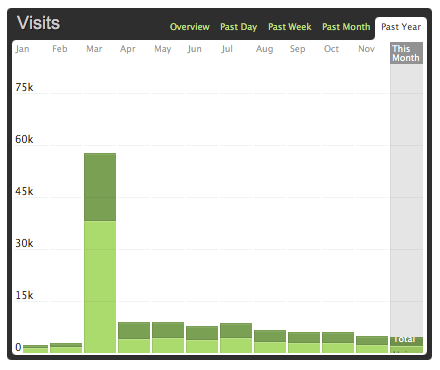

Unlocked achievements in 2012
===

It's time to reflect on this year and after going through some *deep* thinking, I decided to make a list of all my unlocked *achievements*. Here goes:

- For the first time ever, my site got [featured on the front page of Hacker News](http://twitter.com/bearwithclaws/status/176302505054052352). Rather than words, I think my site stats here does a better job at expressing how **phenomenal** it is:

	

- I attended two really awesome conferences, [RedDotRubyConf](http://reddotrubyconf.com/) on May and [JSCamp.Asia](http://jscamp.asia/) on November. Both events were very eye-opening and [mind-blowing](http://twitter.com/cheeaun/status/274534221119361024). Special thanks to [Andy Croll](http://andycroll.com/) and the [JSCamp.Asia team](http://jscamp.asia/team) for organizing them, not to mention giving out all the nice goodies and holding after-parties.

- Finally have the chance to see and meet some of the high-profile *superstar* developers in Real Life. Some of them are [Zach Holman](http://twitter.com/holman), [Christian Heilmann](http://twitter.com/codepo8), [Divya Manian](http://twitter.com/divya), [Jed Schmidt](http://twitter.com/jedschmidt), [Alex MacCaw](http://twitter.com/maccman) and [Angus Croll](http://twitter.com/angustweets).

- Received few positive tweets from [John Gruber](http://twitter.com/gruber/status/275827639795728384) and [Loren Brichter](http://twitter.com/lorenb/status/279049098273910784). Yes, little things do matter.

- Aside from my [Hacker News web app](http://hackerwebapp.com/), I've released three other projects:

	- Singapore Bus Routes Explorer, on [20 January](http://twitter.com/cheeaun/status/160380168739897344)
	- Max Tabs extension for Firefox, on [24 May](http://twitter.com/cheeaun/status/205662037743898624)
	- Octofication extension for Chrome, on [29 October](http://twitter.com/cheeaun/status/262913493068558337)

- [Survived](http://twitter.com/cheeaun/status/282082168409292800) the [Mayan apocalypse](http://en.wikipedia.org/wiki/2012_phenomenon), somehow. No meteors, no zombies.

That's all for 2012. I can't wait to see what's in store for me next year. Happy 2013!