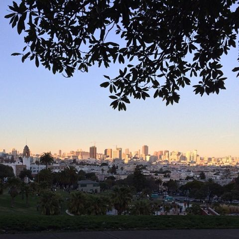
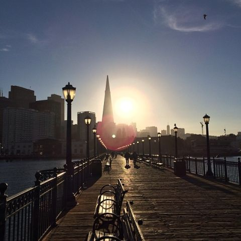
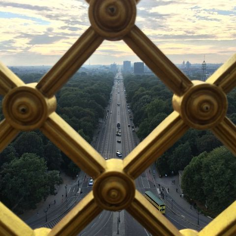
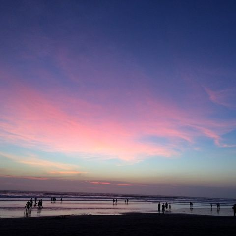
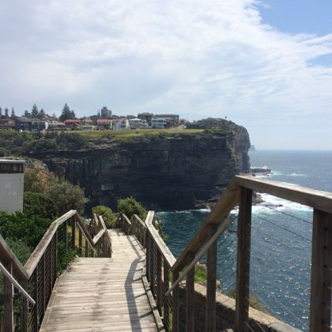

2014 in review
===

It's been a year of travelling and conferences for me. Something that I don't do much in the previous years and has always been in my to-do list for a *very* long time.

It's time to look back and review what I've experienced and learned.

San Francisco and Portland
---

On [January 10](https://twitter.com/cheeaun/status/421420241533403136), I departed from Singapore and arrived at the San Francisco International Airport (SFO). Eventhough it was a long 16-hour flight, I didn't feel like I've lost time because it was like Friday morning in Singapore and I reached San Francisco on a Friday morning.

I've never traveled anywhere far outside of Malaysia and Singapore. My first and second time flying, roundtrip between Penang and Kuala Lumpur, were not very pleasant, thanks to air sickness. For some reason, I always compare myself to this character from [Nodame Cantabile](http://en.wikipedia.org/wiki/Nodame_Cantabile), Shinichi Chiaki, who has a more serious case of flying phobia that forces him to be *grounded* in Japan.

It's pretty much my first time in the United States, first time being outside of Southeast Asia and first time in a cold weather place. I threw up after the long flight, had headache and lower jaw numbness due to the cold, had thigh sore due to walking on the steep hills, and jet lagged for almost three days.

One of the first thing I saw there is this *amazing* view from [Dolores Park](http://en.wikipedia.org/wiki/Dolores_Park).

That was a moment when I decided to use the #nofilter hashtag more often and stop obsessing with too many Instagram filters. Oh yeah, also that feeling of "Wow, I'm *finally* here, the so-called [paradise for geeks](https://twitter.com/kaihendry/status/422646456428679168)".

During my 4-month stay, I made some observation notes which I think would be cool to share, so here goes:

- The cars drive on the right side, driver's seat is on the left. Whenever I take an Uber and sit on the right front seat, it feels like I'm driving but without the steering wheel. That's probably how it's like in a driverless car.
- Even the switches are the other way around. For light toggle swithes, Up means turn on.
- The shopping malls are not as flashy as the ones in Singapore.
- When there's no Daylight Saving Time, the day gets dark around 5 PM, which I think is *very* early.
- Prepaid mobile plans suck. The one I use is [T-Mobile](http://prepaid-phones.t-mobile.com/prepaid-plans). It limits tethering and falls back to 2G connection once exceeded the monthly data usage.
- While walking and crossing roads, the cars *actually* give way, which I find interesting and hard to get used to. Even if I manage to get use to it, I have to unlearn everything when I get back to Singapore or Malaysia.
- There is quite a number of homeless people on the streets. The advice I got from locals is to **not** give them money.
- Hills are everywhere in San Francisco. Steep ones.
- Tissues are called napkins.
- There are [MUNI](http://www.sfmta.com/) buses, MUNI trains, [BART](http://www.bart.gov/) trains, [Caltrain](http://www.caltrain.com/) and [cable cars](http://www.sfcablecar.com/) for public transportation. Get a [Clipper card](https://www.clippercard.com/). Use [Routesy](http://www.routesy.com/) app for train or bus arrival times. [Caltrain Now](https://itunes.apple.com/us/app/caltrain-now/id579940926?mt=8) for Caltrain schedules, especially watch out for the [Baby Bullet Express Service](http://www.caltrain.com/riderinfo/howtoride.html).
- There are black, blue and green thrash bins. I have to learn how to separate the thrashes and throw them into the right bins. Never actually get them right.
- Apparently *a lot* of people hang out in the parks. Lie down on the grass and soak up the sun. Walk the dog. Play frisbee. Read a book. Get some [ice-cream](http://biritecreamery.com/).
- For payments, I have to learn how to calculate the tips or gratuities. It gets really troublesome when you have to split the bill with multiple people **and** include the tips at the same time.
- [Walgreens](http://www.walgreens.com/) are like 7-elevens in Singapore. It's everywhere and there are different types (pharmacy-only, etc) and different opening times too. Google Maps [does a good job in guiding me there](https://twitter.com/cheeaun/status/458801706982064128).
- MUNI trains have this interesting moving steps that elevate when it goes to underground stations or when there's a wheelchair-bound person boarding it.
- When riding on MUNI trains, the next destination are sometimes announced by the operator's voice, not recorded audio.
- If you're doing groceries in places like [Whole Foods](http://www.wholefoodsmarket.com/), remember bring your own bag. Else, pay 10 cents for a paper bag.

I've checked in at **a lot** of places on Foursquare/Swarm. Few of them are:

- [Golden Gate Bridge](http://goldengatebridge.org/). Walked [until the middle](https://twitter.com/cheeaun/status/435138405652250624).
- [Golden Gate Park](http://www.golden-gate-park.com/). [Rode a Segway](http://instagram.com/p/jUoeUxS93F/) there.
- [Mozilla monument](https://wiki.mozilla.org/Monument) at the Mozilla office. [Saw my name](https://twitter.com/cheeaun/status/427609048175759360) on it.
- [Japantown](http://sfjapantown.org/). Drank [Matcha tea](http://instagram.com/p/m3arb2y90p/) there.
- [Napa Valley](http://www.napavalley.com/). Tasted [wine](http://instagram.com/p/lWbf_Zy9_6).
- [Presidio](http://www.presidio.gov/). [Off the Grid](http://offthegridsf.com/markets/PICNIC) picnic.
- [Stinson Beach](http://www.stinsonbeachonline.com/). For the sun, sea and sand.

I've attended some meetups and events:

- [SushiJS](https://github.com/sushijs/san-francisco-ca-usa/issues/1) at Kama Sushi.
- [SFHTML5](http://www.meetup.com/sfhtml5/events/149698902/) at [Google San Francisco](https://twitter.com/cheeaun/status/426536935671074818).
- [SFJS Functional Monthly](http://www.meetup.com/jsmeetup/events/160602812/) at [PubNub HQ](https://twitter.com/cheeaun/status/428363722701422592). Saw [Ariya Hidayat](https://twitter.com/ariyahidayat).
- [Patchwork night](https://ti.to/github-events/patchwork) at GitHub HQ. As a [noob](https://twitter.com/cheeaun/status/428722047477223426) [attendee](https://twitter.com/cheeaun/status/428717185390108672). Saw [Maxwell Ogden](https://twitter.com/maxogden).
- [Apache Lucene: Then and Now](https://www.eventbrite.com/e/apache-lucene-then-and-now-tickets-10071789995) at [Twitter HQ](https://twitter.com/cheeaun/status/433061035399217152).
- [Famo.us Beta Launch Preview](https://www.eventbrite.com/e/famous-beta-launch-preview-tickets-10402479095) at [Folsom Street Foundry](https://twitter.com/cheeaun/status/433786178983452672).
- [Ember.js San Francisco](http://www.meetup.com/Ember-SF/events/155999452/) at [Yahoo!](https://twitter.com/cheeaun/status/435965301591900160). With [Kamal](https://twitter.com/kamal) and met [Jason Ong](https://twitter.com/jasonong). Saw [Tom Dale](https://twitter.com/tomdale) and [Yehuda Katz](https://twitter.com/wycats).
- [Node.js on the Road](https://www.eventbrite.com/e/nodejs-on-the-road-san-francisco-tickets-10630240335) at [New Relic HQ](https://twitter.com/cheeaun/status/439226768646746112).
- [Bay Area Pivotal Tracker Meetup](https://www.eventbrite.com/e/bay-area-pivotal-tracker-meetup-beta-update-planned-features-and-more-tickets-10863650471) at [Pivotal Labs](https://twitter.com/cheeaun/status/446096299369439232).
- [EmberConf 2014](http://2014.emberconf.com/) in [Portland](https://twitter.com/cheeaun/status/448243913300537345). Met [Ryan Florence](https://twitter.com/ryanflorence).
- [Nitrous.IO Mountain View Office-Warming Party](https://www.eventbrite.com/e/nitrousio-mountain-view-office-warming-party-tickets-10695964919).
- [SFJS #39](https://www.eventbrite.com/e/sfjs-39-convergence-of-the-browser-and-os-tickets-10957996663) at [Yelp HQ](https://twitter.com/cheeaun/status/449364246611390465).
- [Tech Talks](https://www.airbnb.com/meetups/ajxwaqj8n-tech-talk-jan-overgoor-and-will-moss) at [Airbnb](https://twitter.com/cheeaun/status/451537474389811200). First time trying out [Envoy](https://signwithenvoy.com/) there.
- [Belgian Night with Mathias Bynens!](http://www.meetup.com/sfhtml5/events/164590802/) at Say Media. Met [Mathias Bynens](https://twitter.com/mathias), [Tomomi Imura](https://twitter.com/girlie_mac) and [Norbert Lindenberg](https://twitter.com/norbertonearth).
- [Front End Ops Conf](http://www.feopsconf.com/) [2014](http://lanyrd.com/2014/feopsconf/) at [Terra Gallery](https://twitter.com/cheeaun/status/459384475135533057). Met [Paul Irish](https://twitter.com/paul_irish), [John-David Dalton](https://twitter.com/jdalton) and (unexpectedly) [Steve Souders](https://twitter.com/Souders). Saw [Alex Sexton](https://twitter.com/SlexAxton).

I've tried a whole bunch of services and apps:

- [Instacart](https://www.instacart.com/), for [groceries](https://twitter.com/cheeaun/status/425003713158053888).
- [Sprig](http://www.sprig.com/), for my [dinner](https://twitter.com/cheeaun/status/428018786780717056).
- [Postmates](https://postmates.com/), [doesn't work for me](https://twitter.com/cheeaun/status/432722585529229312) because it requires a US credit card.
- [Yelp](https://www.yelp.com/), for reviews.
- [Uber](https://www.uber.com/)
- [Lyft](https://www.lyft.com/), for a [CNY parade](https://twitter.com/cheeaun/status/434953249943089152).
- [Sidecar](https://www.side.cr/)
- [MyEatClub](https://www.myeatclub.com/)
- [Square Wallet](https://twitter.com/cheeaun/status/439094911506194432), before [it was removed](http://www.theverge.com/2014/5/12/5709256/square-kills-square-wallet-tries-again-with-square-order).
- [Sticker Mule](http://www.stickermule.com/), for [stickers](https://twitter.com/cheeaun/status/451090686419283968) [obviously](https://twitter.com/cheeaun/status/453383481792290816).
- [CustomInk](http://www.customink.com/), for [t-shirts](https://twitter.com/cheeaun/status/454732849271152640) [obviously](https://twitter.com/cheeaun/status/460886871837376513).

I watched the [Super Bowl](https://twitter.com/cheeaun/status/430193797197090816). I built [my own standing desk](https://twitter.com/cheeaun/status/441755270880837633). I've [overtaken someone else](https://twitter.com/D_mitar/status/442622974924161024) on Foursquare. I bought [a Nexus 5](https://twitter.com/cheeaun/status/460883646811865088). I've exchanged my coins with the [Coinstar](https://www.coinstar.com/). I've tried almost all the *hipster* coffee places such as [Blue Bottle](https://bluebottlecoffee.com/), [Sightglass](http://www.sightglasscoffee.com/), [Four Barrel](http://fourbarrelcoffee.com/) and [Stumptown](http://stumptowncoffee.com/). I've [organized](https://github.com/KopiJS/kopi.js/issues/7) **two** [Kopi.JS](http://kopijs.org/) [meetups](https://twitter.com/cheeaun/status/447594879233687552), albeit the [second](https://twitter.com/cheeaun/status/449596309448585216) one wasn't that successful. I've also met [Winnie Lim](https://twitter.com/wynlim), [Divya Manian](https://twitter.com/divya), [Teng Siong](https://twitter.com/siong1987), [Guillermo Rauch](https://twitter.com/rauchg), [Andrea Giammarchi](https://twitter.com/webreflection), [Nicolas Gallagher](https://twitter.com/necolas), [Jacob Thornton](https://twitter.com/fat), [Alex Maccaw](https://twitter.com/maccaw), [Heather Arthur](https://twitter.com/harthvader), [Jenn Schiffer](https://twitter.com/jennschiffer) and many more people who I have no idea why I forgot their names.

Four months doesn't seem like a long time yet not short. Time passes so quickly and before I know it, it's time to leave. Before [returning to Singapore](https://twitter.com/cheeaun/status/464855236687847424), I bowled at [Lucky Strike](http://www.bowlluckystrike.com/) which is definitely [**not** a good idea](https://twitter.com/cheeaun/status/465281897480736768).

I love to collect [stats](https://twitter.com/cheeaun/status/467649828256632832) and look at numbers, so here they are:

- 303 [Foursquare/Swarm checkins](https://foursquare.com/cheeaun) (14 in Portland, 289 in San Francisco).
- 178 [Instagram photos](http://instagram.com/cheeaun) (11 in Portland, 167 in San Francisco).
- 741 [tweets](https://twitter.com/cheeaun) (30 in Portland, 711 in San Francisco).
- A total of [1,852 photos and 42 videos](https://www.flickr.com/photos/cheeaun/sets/72157644277519688/) on Flickr. The numbers are kind of *doubled* thanks to iOS (older version) saving both HDR and non-HDR version of the same photos.

My most favorite Instagram which also happens to be the most-liked Instagram this year:

It's been one hell of a ride.

Berlin
---

It doesn't stop there. Singapore's weather is (and has always been) [hot](https://twitter.com/cheeaun/status/465652153462161408), so I immediately miss the cold weather. I was interested to attend JSConf and found [one via Lanyrd](http://lanyrd.com/2014/jsconfeu/) on September. It also sounds like a good two-in-one deal to get the tickets for **both** [JSConf EU](http://2014.jsconf.eu/) and [CSSConf EU](http://2014.cssconf.eu/). The conferences were held in Berlin, supposedly the [next Silicon Valley](http://www.bbc.com/news/technology-26770568), which sort of grabbed my attention.

I departed on [September 10](https://twitter.com/cheeaun/status/509718457936404480) from Singapore to Berlin Tegel Airport (TXL), via a stopover at Helsinki Airport (HEL). 14 hours of flight time, not bad. Even though Tegel Airport is an international airport, it's surprisingly small. Also, there's no direct flight from Singapore and needs a stopover at other airports around it before landing there.

It's the first time I attend a [three](https://twitter.com/cheeaun/status/510322105037385728)-[day](https://twitter.com/cheeaun/status/510682200535465984) [conference](https://twitter.com/cheeaun/status/511078084616134657) (well, two conferences in fact) and it's really **super tiring**. I tried [drinking](https://twitter.com/cheeaun/status/510324584806375424) [Club-Mate](http://en.wikipedia.org/wiki/Club-Mate), the so-called [Red Bull of Berlin engineers](https://twitter.com/kamal/status/510064766316855296). I saw [Mikeal Rogers](https://twitter.com/mikeal), [Remy Sharp](https://twitter.com/rem), and (accidentally talked with) [Jake Archibald](https://twitter.com/jaffathecake). I met [Michael Donohoe](https://twitter.com/donohoe), [Sebastian Markbåge](https://twitter.com/sebmarkbage), [Mathias](https://twitter.com/mathias) (again?), and [Jed Schmidt](https://twitter.com/jedschmidt).

After the conference, I spent the next 5 days exploring around Berlin. Without further ado, let's proceed with my observations notes:

- Berlin is a very bike-friendly city. Places are spacious, so it makes sense I guess. Even walking on the street starts to feel awkward. On some roads, there are even special traffic lights for bikes.
- The pedestrian symbols on traffic lights are called [Ampelmännchen](http://en.wikipedia.org/wiki/Ampelm%C3%A4nnchen).
- [Currywurst](http://instagram.com/p/s-9fBIS9xJ) is everywhere. [Döner kebab](http://instagram.com/p/tODTAPS9x1) as well.
- Toilets are called [WC](http://instagram.com/p/tHodR0y97v) which means [Water Closet](http://en.wikipedia.org/wiki/WC). Most of the time, there are no icons for toilet signs. Remember, *Damen* is Women and *Herren* is Gentlemen.
- Toilets are usually located at the underground level. No idea why.
- Way, way **too many** museums.
- Quite a lot of smart cars.
- To ride a Segway, you need [a driving license](https://twitter.com/cheeaun/status/511561118922596352).
- *Danke* means thank you. Someone told me that *Danke schön* is the more polite version.
- Beers are super cheap.
- Uber was [banned](http://www.bbc.com/news/technology-29027803) then [lifted](http://www.nytimes.com/2014/09/17/business/international/uber-ban-in-germany-is-lifted-by-court.html). Even then, there are a lot of taxis and [Mytaxi](https://de.mytaxi.com/) app works great.
- The train stations are really huge, looks like a hotel and you can see it from far.
- In elevators, ground floor is sometimes marked as '0' (zero). Underground floors would be [negative numbers](http://instagram.com/p/s1HXDey9yr/).
- [Graffiti](http://instagram.com/p/tI966Hy9ys/) [everywhere](http://instagram.com/p/tI-IyAy9zE/).
- *Straße* means street. If you type 'Strabe' and not '*Straße*' into Google Maps, it might point to a totally different place.

Out of all the places I checked in, two places that I really like:

- [Tiergarten](http://en.wikipedia.org/wiki/Tiergarten_%28Berlin%29), a really huge park that's great for jogging and cycling.
- [Tempelhofer Feld](http://en.wikipedia.org/wiki/Berlin_Tempelhof_Airport), another really huge park that was once an airport. It's *really* tempting to [rent and ride a bike there](http://instagram.com/p/tLWIPcS91A).

I got back to Singapore on [September 22](https://twitter.com/cheeaun/status/513767084426559489). Some [stats](https://twitter.com/cheeaun/status/516132124710010880):

- 73 Foursquare/Swarm check-ins
- 42 Instagram photos
- 52 tweets
- [871 photos and 39 videos](https://www.flickr.com/photos/cheeaun/sets/72157647681056838/) on Flickr

My favorite Instagram photo, which is a view from the top of [Victory Column](http://en.wikipedia.org/wiki/Berlin_Victory_Column):

Bali
---

Bali was a [short](https://twitter.com/cheeaun/status/520479284712853504) [weekend](https://twitter.com/cheeaun/status/521414690488864769) getaway trip with my colleagues. Some observation notes:

- Small roads, traffic jams and lots of motorcycles.
- The beach ([Kuta beach](http://www.bali-indonesia.com/kuta-beach/)) is filled with people selling stuff and services like tattoos and massages.
- [Circle K](http://www.circlek.com/) marts everywhere.
- There's the normal cabs and there's also the *Ojeks* ([Motorcycle taxi](http://en.wikipedia.org/wiki/Motorcycle_taxi)).
- Lots of spa/massage places.
- Hard to calculate the money due to the currency rates. 1 SGD converts to around 9000+ IDR. Always count the zeros.
- Unfortunately there's no Uber or any taxi booking apps.

I think one of the highlights for this trip is rafting on the [Ayung River](http://en.wikipedia.org/wiki/Ayung_River) where I fell from the raft and *nearly* drowned. It was **so cool**.

Some stats:

- 4 Instagram photos
- [33 photos and 4 videos](https://www.flickr.com/photos/cheeaun/sets/72157648443096048/) on Flickr
- The number of tweets and check-ins are too little and insignificant to be included here. Lack of mobile Internet really affect these numbers.

Sydney
---

Again, I miss the cold weather and somehow got interested in [Web Directions South](http://www.webdirections.org/wds14/). Off I flew to Sydney on [October 28](https://twitter.com/cheeaun/status/526769308399968257) and attended this [two](https://twitter.com/cheeaun/status/527602473859809280)-[day](https://twitter.com/cheeaun/status/527946742067900417) conference. It's really awesome to (finally) [see](https://twitter.com/cheeaun/status/528029724300152832) [Doug Bowman](https://twitter.com/stop) giving a talk. I'm also surprised to see [Jessica Hische](https://twitter.com/jessicahische)'s talk as I'm very impressed by [her work on the MailChimp logo *facelift*](http://jessicahische.is/monkeyingaround). Web Directions has two tracks; the Product track and the Engineering track. Curiously enough, I spent the whole two days in the former.

Conference aside, I spent almost 8 days exploring around Sydney. I met [Seng Ming](https://twitter.com/sengming) and two of my [longtime](https://twitter.com/brianritchie) [friends](https://www.facebook.com/yileen.lim) who I know since the [primary school](http://ms.wikipedia.org/wiki/Sekolah_Kebangsaan_Seberang_Jaya) days! While I was there, I was super lucky to be part of the [10th Sydney Open](https://sydneylivingmuseums.com.au/sydneyopen) biennial event on [November 2](http://instagram.com/p/u41Ob6y9_T), which gave me the chance to explore buildings that are usually off limits to the public. I've also joined the [Worldwide Meteor Day](http://www.meetup.com/Meteor-Sydney/events/212510832/) meetup on November 6.

As always, I wrote down some observation notes:

- Good mix of Asian people; Korean people, Thai people, Japanese people, Vietnamese people and even Malaysians. Lots of Asian food choices as well.
- Taxi fares are very expensive. The train ride from the [international airport](http://www.sydneyairport.com.au/) to my hotel is very expensive. *Normal* train and bus rides are still kind of okay.
- There's Uber, slightly cheaper than taxis.
- [Optus prepaid plans](http://www.optus.com.au/shop/mobile/prepaid) are awesome. I got the 'My Prepaid Daily Plus' plan, $2 for 500MB a day. If you exceed the limit, another $2 for another 500MB. And so on and on. Totally awesome if you're a heavy mobile data user. Use the [My Optus](http://www.optus.com.au/shop/mobile/apps/my-optus-app) app to keep track of your usage and even recharge the credit from within the app itself.
- There are hills but not as hilly as San Francisco.
- 'VIP Lounge's everywhere.
- Lots of alchohol-free zones.
- Going around places with the train and bus is pretty easy. Get an [Opal](https://www.opal.com.au/) card, and use [Opalapp](http://www.opalapp.com.au/) to check balance *and* top up from within the app itself. Use [NextThere](http://nextthere.com/) for train and bus arrival times. Use [iFerries](https://itunes.apple.com/au/app/iferries/id452514739?mt=8) for ferry times.

One of the places that I like and also find hilarious is [Manly](http://en.wikipedia.org/wiki/Manly,_New_South_Wales). I thoroughly enjoyed the long [coastal walk](http://instagram.com/p/vHlYNnS9zB/) from [Bondi to Coogee](http://bonditocoogeewalk.com.au/). I saw the [Sculptures by the Sea](http://www.sculpturebythesea.com/), the [Martin Place fountain](http://instagram.com/p/u7ZDSLS9-a/) featured in the film '[The Matrix](http://en.wikipedia.org/wiki/The_Matrix)', and also a [moving koala](http://instagram.com/p/u7ZqzKy9-2/). The [purple Jacaranda trees](http://instagram.com/p/vGfm-HS9zQ/) are everywhere and visually pleasing to the eyes as I walk around the places in Sydney.

I flew back to Singapore on [November 8](https://twitter.com/cheeaun/status/530881524967567363) and these are the [stats](https://twitter.com/cheeaun/status/531466158051196928):

- 131 Foursquare/Swarm check-ins
- 35 Instagram photos/videos
- 35 tweets
- [820 photos and 10 videos](https://www.flickr.com/photos/cheeaun/sets/72157646868674304/) on Flickr

Singapore
---

Despite all these travels and conferences, I'm not missing any action in Singapore at all. I [ate balut](http://instagram.com/p/oVb--uS94R/) for the [first time](https://twitter.com/cheeaun/status/469773375217217537) and it's surprisingly tasty. I [tried GrabTaxi](https://twitter.com/cheeaun/status/470139413461073920) and wasn't quite impressed with the experience. [Lakshan](https://twitter.com/laktek) and I organized the [5th](https://github.com/KopiJS/kopi.js/issues/10), [6th](https://github.com/KopiJS/kopi.js/issues/14), [7th](https://github.com/KopiJS/kopi.js/issues/15) and [8th](https://github.com/KopiJS/kopi.js/issues/18) [Kopi.JS](http://kopijs.org/) meetups. Kopi.JS now has a [legit branding](https://github.com/kopijs/branding) and a [legit web site](http://kopijs.org/).

I've also attended these events:

- [RedDotRubyConf](http://www.reddotrubyconf.com/) [2014](http://lanyrd.com/2014/rdrc/), day [one](https://twitter.com/cheeaun/status/481970537149640705) and [two](https://twitter.com/cheeaun/status/482333527820627968)
- [Singapore Gophers meetup](https://twitter.com/NitrousIO/status/468955363476537344)
- [Singapore Docker meetup](https://twitter.com/cheeaun/status/522344456683405312)
- [Matt Mullenweg Live!](https://www.eventbrite.com/e/matt-mullenweg-live-tickets-3836477006)
- [Walkabout Singapore](https://www.facebook.com/walkaboutsg) at the [Viki](https://twitter.com/borryshasian/status/476773312727498753) [office](https://twitter.com/borryshasian/status/477401466445901825)
- [Geek Brunch](https://twitter.com/coderkungfu/status/518297556900528128) at [Wheeler's Yard](http://wheelersyard.com/). Met a whole bunch of geeks, duh.
- [Front End TL;DR](http://feds.strikingly.com/)
- [CSSConf.Asia 2014](http://2014.cssconf.asia/) at [Amara Sanctuary](https://twitter.com/cssconfasia/status/534880024881418240), Sentosa. Met [Rico Sta. Cruz](https://twitter.com/rstacruz).
- [JSConf.Asia 2014](http://2014.jsconf.asia/), day [one](https://twitter.com/cheeaun/status/535254793166807040) and [two](https://twitter.com/cheeaun/status/535615249828040705)

Penang
---

I [went back](https://twitter.com/cheeaun/status/545536961016901632) to my hometown for [few days](https://twitter.com/cheeaun/status/546928668585373697) since I never actually gone back during Chinese New Year this year (was stuck in San Francisco). Finally manage to [get rid](https://twitter.com/cheeaun/status/546674985964535808) of my 14-year-old computer in my room. Also found [a book](https://twitter.com/cheeaun/status/546701610538131456) written by [Chu Yeow](https://twitter.com/chuyeow) while nostalgically going through my old stuff. And not forgetting all the delicious Penang food that I miss so much.

Travel notes
---

I've learnt a lot of things while travelling and made some notes in my mind on some tips and tricks which I think is worth sharing. These might not be applicable to everyone, so be warned.

- Print hard copies of the passport, identification cards and any important documents. Store soft copies on [Dropbox](https://www.dropbox.com/) and star them so that they are available offline on your phone. For protection, [set a PIN passcode](https://www.dropbox.com/en/help/227) on the Dropbox app.
- Use [Simplenote](http://simplenote.com/) for important notes and numbers. Set up a PIN passcode on the app as well. I use it for my observation notes too.
- Get [ginger ale](http://en.wikipedia.org/wiki/Ginger_ale) for drinks when flying, to alleviate indigestion or motion sickness.
- Get aisle seats on planes for easy access to toilets.
- Roll your wearables to save space and prevent wrinkles.
- Bring at least another phone besides the main phone. It's particularly useful for placing your main operator's SIM card into the backup phone and put your new travel SIM card in your main phone.
- Bring a [nice jacket](http://www.thenorthface.com/) that's lightweight, wind-proof, water-resistant, insulated and includes a hood. [UNIQLO](http://www.uniqlo.com/)'s [HEATTECH](http://www.uniqlo.com/sg/store/men/collections/heattech.html) wearables are pretty good too.
- Get a portable power bank. I've been using the [CPX power bank](https://www.kickstarter.com/projects/962021031/cpx-max-power-min-size-portable-battery-solution) due to its compact size, lots of power and **built-in** cable(s) for both charging *and* re-charging.
- Get a compact, lightweight and water-proof backpack. I've been using the [Incase Campus Mini Backpack](http://www.goincase.co.uk/bags/campus-mini-backpack) and really loving it so far. Useful for storing the essentials like pens, notebooks, medications, power bank, lip balm and tissues.
- First thing after landing on the airport, get a prepaid mobile Internet SIM card. At least 1 GB usage, for my use case. Ask what happens and what to do after the limit is exceeded.
- Use [Foursquare](https://foursquare.com/) for place recommendations and ratings. I find [Yelp](http://yelp.com/) is only useful in the United States, especially the reviews. I use [Swarm](https://www.swarmapp.com/) to check in places so that I can keep track of where I've gone to. I also use Foursquare to plot down all the places that I **want to go** by saving them to my 'To-do' list. When I check-in to a saved place, it'll automatically be removed from the list. I've built [Fourcircle](https://github.com/cheeaun/fourcircle) to plot all my to-do venues on a map that loads *much quicker* than the Foursquare native app itself.
- Use [Google Maps](https://www.google.com/maps) for directions. Usually accurate in most places, though you'll need to be [good at reading maps](https://twitter.com/cheeaun/status/435203938929766400). Star important places like your hotel or the conference venue. Learn how to visually link the 2D maps on the phone with your 3D surroundings. Google maps mobile app shows the little blue arrow pointer on the 'Current location' marker which tells you where your phone is pointing at. If there's no Internet connection, try '[OK maps](http://www.cnet.com/how-to/how-to-use-google-maps-offline-on-ios-android/)' to cache offline maps. If all else fails, use one of those dedicated offline map apps like [ForeverMap](https://itunes.apple.com/us/app/forevermap-2-worldwide-offline/id424183595?mt=8).
- Use [Google Translate](https://translate.google.com/) app or [Word Lens](http://questvisual.com/) for translations.
- Use Uber, Lyft, Sidecar or any taxi apps that are available.
- Use local apps for travel, buses, trains and ferries. I usually find them via the iOS App Store app's Explore tab that shows 'Popular Near Me'.
- Use [Viator](http://www.viator.com/) to find for tours and activities.
- While walking on hills, try raise your legs as if you're walking up the stairs. It's easier. Slow down when you feel tired. Avoid steep routes wherever possible. I built [Steepless](https://github.com/cheeaun/steepless) just for this purpose but hasn't really use it much unfortunately.
- Use [Carousel](https://carousel.dropbox.com/) for backing up photos to Dropbox. Use [Flickr](https://www.flickr.com/) for secondary backup.

That's pretty much it, for now.

T-shirts, stickers and stuff
---

I got a lot of free swags from conferences and bought a lot of stuff this year, usually t-shirts and stickers. Here is a list of them, though not really a complete list:

- [Put.io](http://teespring.com/imgonnaputiothatshit) [t-shirt](https://twitter.com/cheeaun/status/433440407272189952)
- [Node.js t-shirt](https://twitter.com/cheeaun/status/439297362838568960)
- [The](https://twitter.com/cheeaun/status/439150751903141889) [Slim Wallet](http://theslimwallet.com/) to replace my old [Mighty Wallet](https://www.dynomighty.com/)
- [Firebase, Ember.js, jQuery and Digital Ocean t-shirts](https://twitter.com/cheeaun/status/448636062231851008) from EmberConf
- [A lot of stickers from Emberconf](https://twitter.com/cheeaun/status/448636181110980608)
- [Instagram t-shirt](https://twitter.com/cheeaun/status/452111163631751168) from [Social Print Studio](http://printstagr.am/)
- [Stickermule t-shirt and my own logo stickers](https://twitter.com/cheeaun/status/453946946340679680)
- My very own logo t-shirt, in [black](https://twitter.com/cheeaun/status/460886871837376513) and [white](https://twitter.com/cheeaun/status/454732849271152640)
- [#doyouevenswift](http://teespring.com/officialdoyouevenswift) [t-shirt](https://twitter.com/cheeaun/status/489266780389392384)
- [RedDotRubyConf t-shirt](https://twitter.com/reddotrubyconf/status/482448387707383808)
- [Aaron Patterson](https://twitter.com/tenderlove)'s [Gorby](https://twitter.com/gorbypuff) [sticker](https://twitter.com/cheeaun/status/482528758541209600)
- [Mozlove t-shirts](https://twitter.com/cheeaun/status/492853080782692353)
- [Pile of poo](http://www.emojistickers.com/collections/persons/products/pile-of-poo) [stickers](https://twitter.com/cheeaun/status/494040132157054977)
- [Product Hunt Glasshole Kitty](http://teespring.com/product-hunt-kitty-t-shirt) [t-shirt](https://twitter.com/cheeaun/status/499835253536477184)
- [Miniature 3D-printed table](http://instagram.com/p/uNMAj9Pher/) from [3D Hubs](https://twitter.com/cheeaun/status/521951769010528256)
- [Tesla, Foursquare and Yo t-shirts](https://twitter.com/cheeaun/status/531808080745336832)
- [Dribbble t-shirt and sticker](https://twitter.com/cheeaun/status/532713230779428864)
- Random [Christmas gift](https://twitter.com/cheeaun/status/537265127792197632) from [Santa Japan](http://santajapan.co/)
- [Kopi.JS](https://twitter.com/cheeaun/status/536020524032200705) [stickers](https://twitter.com/cheeaun/status/545045379738116096) and [t-shirts](https://twitter.com/cheeaun/status/545073311265206272)
- [Chope book](https://twitter.com/cheeaun/status/545132103529021441) from [The Little Dröm Store](http://www.thelittledromstore.com/chope/book/)

Random thoughts
---

- Seemingly I [starred too many projects](https://twitter.com/Espen_Antonsen/status/535630957416435712) on GitHub. Some people [approves it](https://twitter.com/_mauris/status/514800188515303424) though.
- I [started a new](https://twitter.com/cheeaun/status/537525107170631680) [Tumblr site](http://iosappswhatsnew.tumblr.com/) for my iOS-app-changelog screenshots. [Khoi Vinh](https://twitter.com/khoi) seems to [like it](https://twitter.com/khoi/status/541059481308626944).
- I was [surprised](https://twitter.com/cheeaun/status/530335620275507200) that [Naruto](http://en.wikipedia.org/wiki/Naruto) manga finally ended after 15 years of publication. It's really one of the most impactful story that really changed my view on everything.
- I'm glad that I [watched](https://twitter.com/cheeaun/status/481830157338955776) [Lars and the Real Girl](http://en.wikipedia.org/wiki/Lars_and_the_Real_Girl). It's so unexpected and totally swept my feet off.
- I'm featured in the [JSConf EU 2014 impressions video](https://www.youtube.com/watch?v=isrOs-ieMGI). Twice.
- I'm [so honoured](https://twitter.com/cheeaun/status/448140623942393856) to be mentioned in Winnie Lim's article on [Bridging connections](http://journal.winnielim.org/bridging-connections). It always strikes me whenever I realise that my existence has an impact on other people.

So this is my 2014. One of the best years I've ever had. 2015 will be better.

Happy new year.
