The Kopi.JS meetup story
===

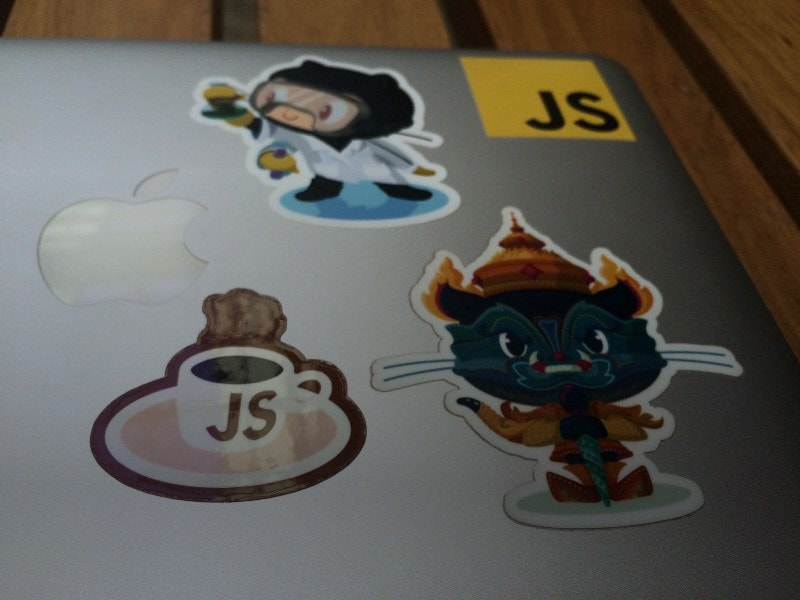

A look at how it got started and why it works.

Preface
---

[Kopi.JS](https://kopijs.org/) is the name of a *fun* JavaScript library that has almost all the specifications for various names of Singaporean coffee. It was made possible by a bunch of engineers in Singapore who got bored and want to have fun with some of the Singaporean [*kopitiam*](http://en.wikipedia.org/wiki/Kopi_tiam) language.

Then somehow we have a meetup. And another meetup. And more meetups after that. It’s unbelievable to see that it *actually* works. Here’s my side of the story on how it got started and why it works.

Developer meetups
---

I’ve been to a lot of meetups. Both developer-focused and non-developer-focused meetups.

I find that there are two main reasons why people go to meetups:

1.  **Learn** something new from the talks.
2.  **Mingle** around with like-minded people.

I personally find more value in the latter. The talks are not bad most of the time but still, it’s difficult for the meetup organizer to maintain or control the quality of the talks over a long period of time. The mingling part is always the surprising aspect for me because I get to talk with people from all walks of life. People from a startup, from the enterprise, from the government, and even from another country.

In some meetups, I noticed that few people just attend for the talks and leave after that. Totally missing the mingling part. They are not very good in mixing with strangers. They don’t know anyone there, so it’s hard to start a conversation. They are too tired from work especially when meetups start **after** work hours. If the location is small and too crowded, people will leave.

Conferences
---

I see conferences as a much larger-scale version of meetups. The lunch time and coffee breaks in between the talks are the mingling sessions. Some conferences purposely make the lunch time session a longer period or add more coffee breaks in between one or two talks, as an attempt to encourage people to, you know, mingle and meet new people.

Unlike meetups, you have the **whole day** for this social activity. It’ll be two days if the conference runs for two days, and so on. Some people even skip the talk sessions and continue with their interesting discussion. It can be a little overwhelming with so many people talking around you. Conference presentations are more intensive so it’s easier for people to get tired from all the learning, listening and talking. Usually a conference only runs once a year and that’s kind of “limited”, in my opinion.

Some people go to conferences with their work colleagues. Around 3 to 5 people. That’s great news because you get to enjoy and learn new things with your colleagues. Unfortunately, I’ve noticed that some of them only hang out within their own group and don’t really mix with others. I understand that it’s obviously easier to talk with your own colleagues than some random strangers, but that’s not the point, right?

Blogger and Twitter meetups
---

Before this, some time ago, I use to attend blogger meetups and Twitter meetups (*tweetups*). My first blogger meetup was in 2005 in Penang. That was the first time I meet up with people I know online and never seen their faces.

Then, I moved to Kuala Lumpur and there was a bunch of tweetups. I remember there was even a Wii Tweetup called “tWiitKL” where we hang out at someone’s house to play Wii games together! It was totally random and somehow it worked. It was a fun and refreshing experience for me. There were no awkward moments and it feels like hanging out with your close friends.

A new kind of meetup
---

I was thinking about this the other day. What if we can take all the good parts from all these meetups and conferences and put them all together? What if we can remove all the barriers from people to start mingling with other people? What if we can make meetups like one of those casual coffee breaks with your close friends?

The first Kopi.JS meetup was kind of *accidental* and impromptu.

> [@chuyeow](https://twitter.com/chuyeow) [@cheeaun](https://twitter.com/cheeaun) [@soulofpeace](https://twitter.com/soulofpeace) hey guys, how about some kopi tasting tomorrow?
> 
> — Lakshan Perera (@laktek) [November 28, 2013](https://twitter.com/laktek/status/405873862891429888)

We were tweeting around, asking who is on the way and who has reached the coffee place. Since our Twitter conversations are public, our followers were getting curious and wanted to join us.

Four of us met at [Toast Box in Chinatown Point](https://foursquare.com/v/toast-box-%E5%9C%9F%E5%8F%B8%E5%B7%A5%E5%9D%8A/50d514dce4b028bbc75ba0b9) and had coffee.

That marks the beginning.

> Alrighty first [#kopijs](https://twitter.com/hashtag/kopijs) meetup success with [@chuyeow](https://twitter.com/chuyeow) [@laktek](https://twitter.com/laktek) [@soulofpeace](https://twitter.com/soulofpeace)
> 
> — Chee Aun ✨ (@cheeaun) [November 29, 2013](https://twitter.com/cheeaun/status/406427812682158081)

The experiment
---

I set up [a Github issue](https://github.com/KopiJS/kopi.js/issues/2) for the second meetup. It was an experiment. There’s no Facebook event. No Meetup.com or EventBrite. Why, you ask? Because you can use [GitHub for anything](http://www.wired.com/2013/09/github-for-anything/)!

It turned out **great**.

> [#KopiJS](https://twitter.com/hashtag/KopiJS) meetup. Good coffee. Nice chats. Thanks all for joining.
>
> 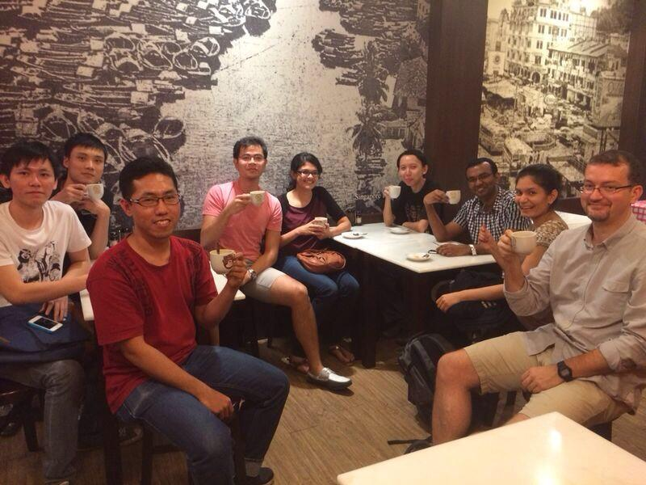
>
> — Lakshan Perera (@laktek) [December 12, 2013](https://twitter.com/laktek/status/411151258574016512)

Since then, we had our [3rd](https://github.com/KopiJS/kopi.js/issues/7), [4th](https://github.com/KopiJS/kopi.js/issues/8), [5th](https://github.com/KopiJS/kopi.js/issues/10), [6th](https://github.com/KopiJS/kopi.js/issues/14), [7th](https://github.com/KopiJS/kopi.js/issues/15), [8th](https://github.com/KopiJS/kopi.js/issues/18), [9th](https://github.com/KopiJS/kopi.js/issues/20) and [10th](https://github.com/KopiJS/kopi.js/issues/21) meetups. The 3rd and 4th were in San Francisco when we’re there for a period of time. There was also an [*unofficial* meetup](https://twitter.com/laktek/status/545499636035637248) in Sri Lanka.

> So yesterday's [#kopijs](https://twitter.com/hashtag/kopijs) meetup success. Photo by [@ValentineChua](https://twitter.com/ValentineChua) , FB: <https://www.facebook.com/photo.php?fbid=10154588871275618&set=a.253367320617.291573.504105617&type=3&theater>
>
> 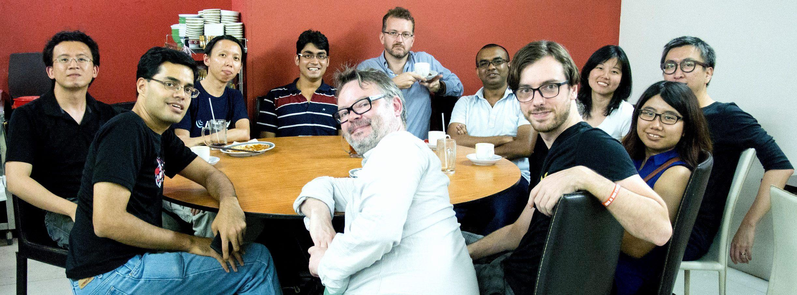
>
> — Chee Aun ✨ (@cheeaun) [October 2, 2014](https://twitter.com/cheeaun/status/517505549424795648)

> So [#KopiJS](https://twitter.com/hashtag/KopiJS) happened!
>
> 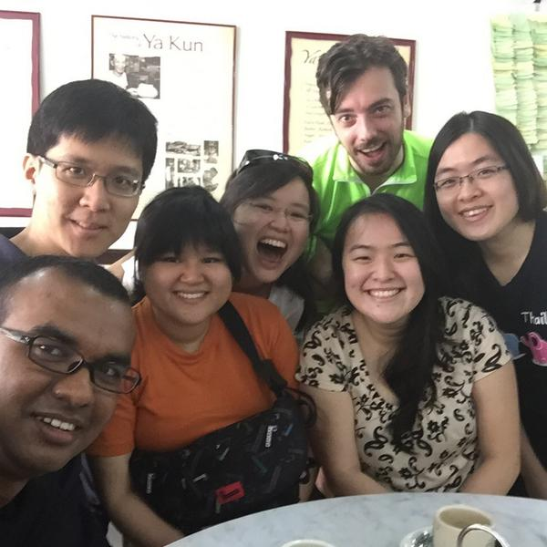
>
> — Lakshan Perera (@laktek) [October 19, 2014](https://twitter.com/laktek/status/523688293188128769)

> [#KopiJS](https://twitter.com/hashtag/KopiJS)
>
> 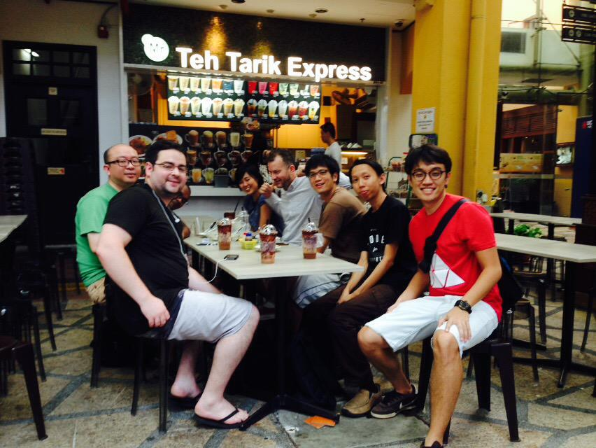
>
> — Thomas Gorissen (@serrynaimo) [November 22, 2014](https://twitter.com/serrynaimo/status/536010124666470400)

> [#kopijs](https://twitter.com/hashtag/kopijs) gopro group picture ☕️
>
> 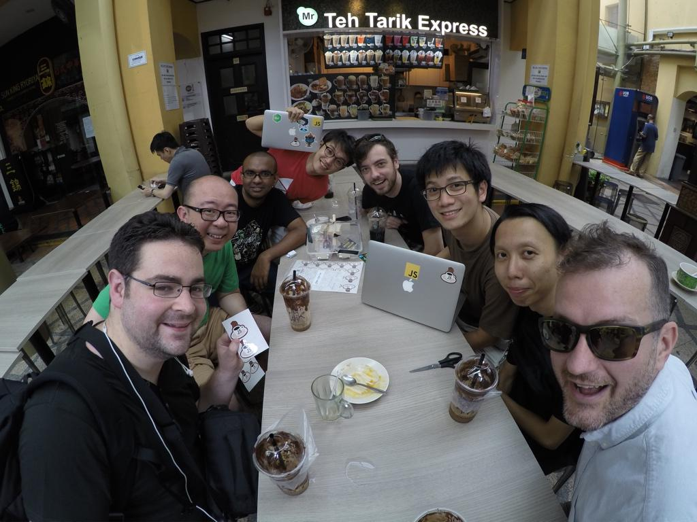
>
> — Kai Hendry (@kaihendry) [November 22, 2014](https://twitter.com/kaihendry/status/536017178567262210)

> January [#KopiJS](https://twitter.com/hashtag/KopiJS) - amazing how this cult is growing.
>
> 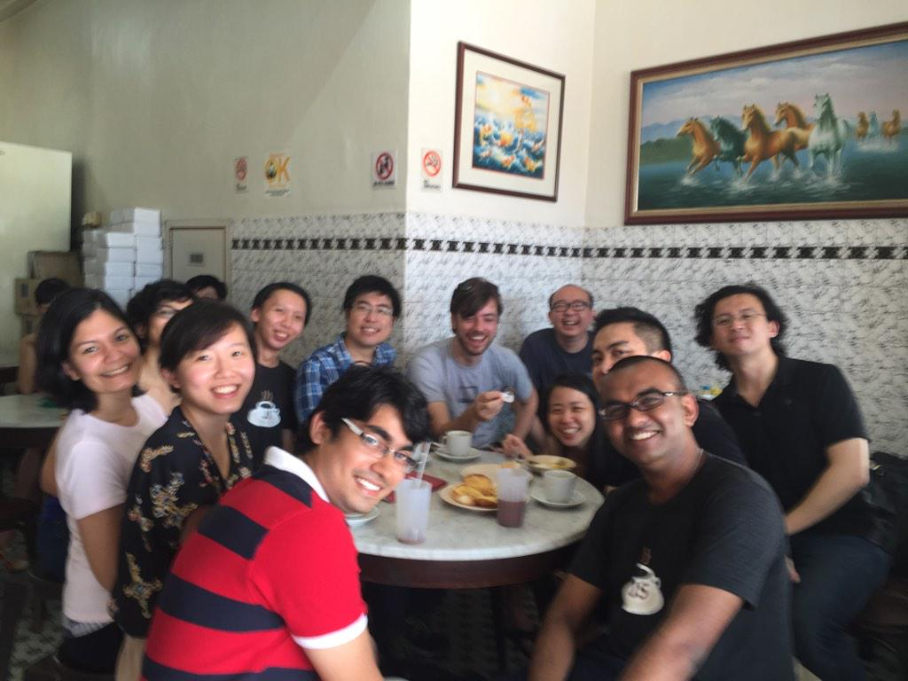
>
> — Lakshan Perera (@laktek) [January 24, 2015](https://twitter.com/laktek/status/558846955103588352)

> [@cheeaun](https://twitter.com/cheeaun) [@webuildsg](https://twitter.com/webuildsg) some pics, here you go! [#kopijs](https://twitter.com/hashtag/kopijs)
>
> 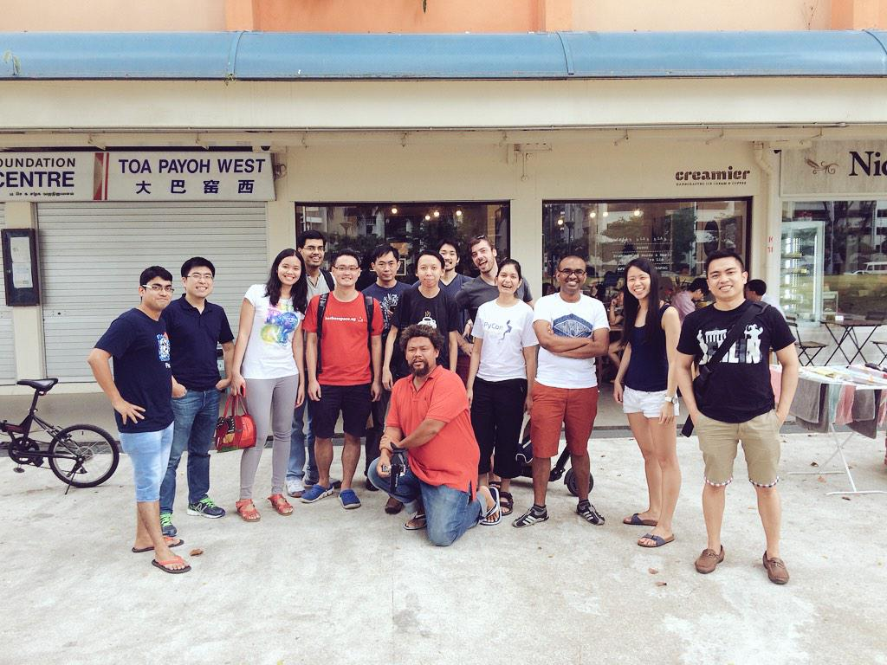
>
> 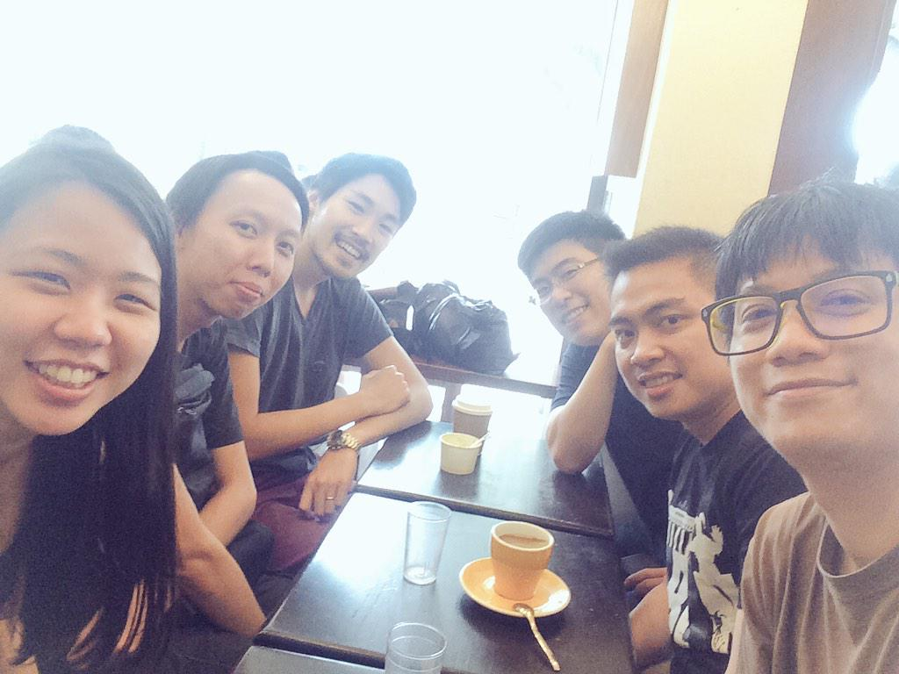
>
> 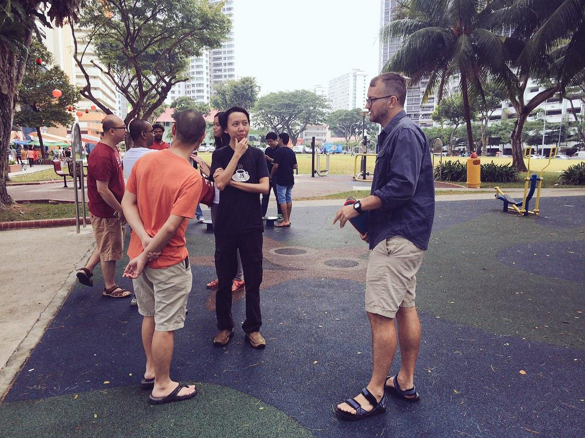
>
> 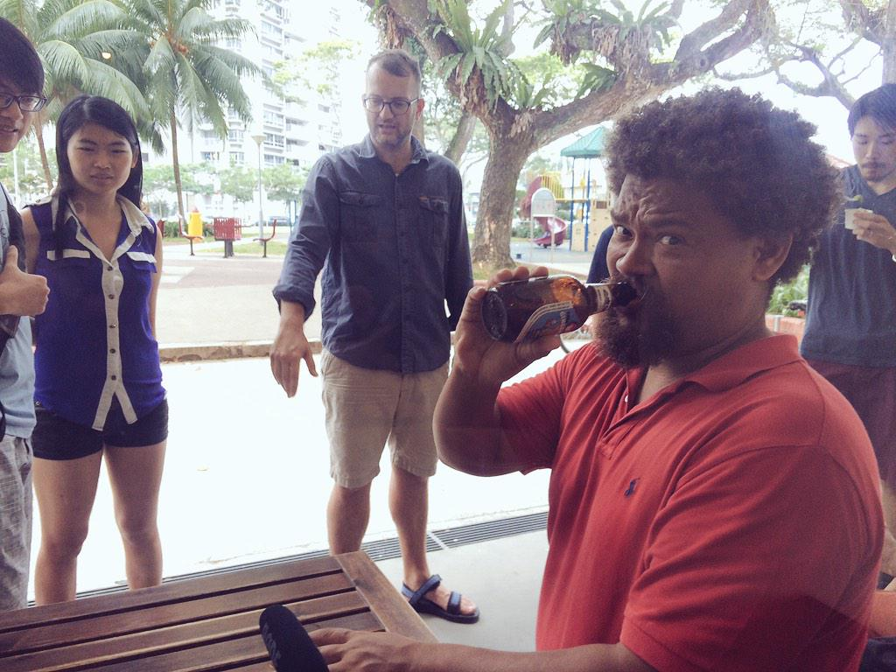
>
> — Graphics Noob (@BlurSpline) [February 14, 2015](https://twitter.com/BlurSpline/status/566526060594864128)

It’s incredible how good things happen when least expected.

Taking a step back
---

Kopi.JS is a small JavaScript library that we built for fun. Kopi.JS is a name that can’t be taken seriously because it’s… Kopi. And when you combine it with JS, it sounds funny to any geeks in Singapore. We had a fun little meetup to talk about coffee and stuff. And now we’re here with so many meetups in the pipeline.

It starts with a repository on GitHub. Open a new issue for every event. Add the ‘event’ label for easy filtering. Always set a date first. The place can be set later with discussions in the issue. Create a public calendar on Google Calendar so that people can subscribe to events with iCal. Set an agenda so that people know what will happen and what to expect during the meetup. RSVP by replying with 👍 (**:+1:**) on the GitHub issue. Create a Twitter account ([@kopi\_js](https://twitter.com/kopi_js)) for the meetup, so that people can follow and get updates. Create a hashtag ([#kopijs](https://twitter.com/search?q=%23kopijs)) so that it feels awesome. Create a nice logo for [branding](https://github.com/kopijs/branding) and easy recognition.

We have **stickers**.

> New batch of [#kopijs](https://twitter.com/hashtag/kopijs) stickers yo
>
> 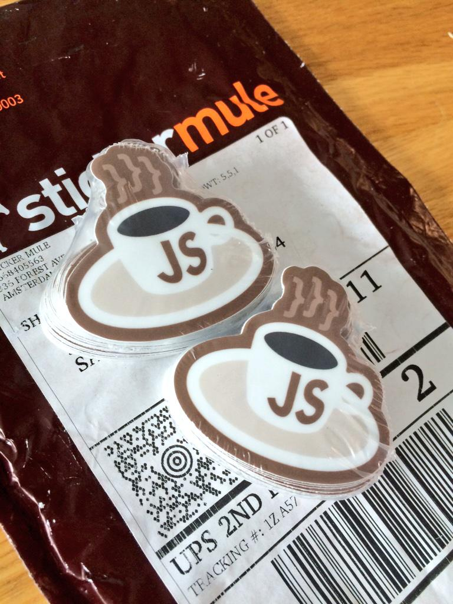
>
> — Chee Aun ✨ (@cheeaun) [December 17, 2014](https://twitter.com/cheeaun/status/545045379738116096)

We have **t-shirts**.

> So uh, [#teefie](https://twitter.com/hashtag/teefie) ? [#kopijs](https://twitter.com/hashtag/kopijs)
>
> 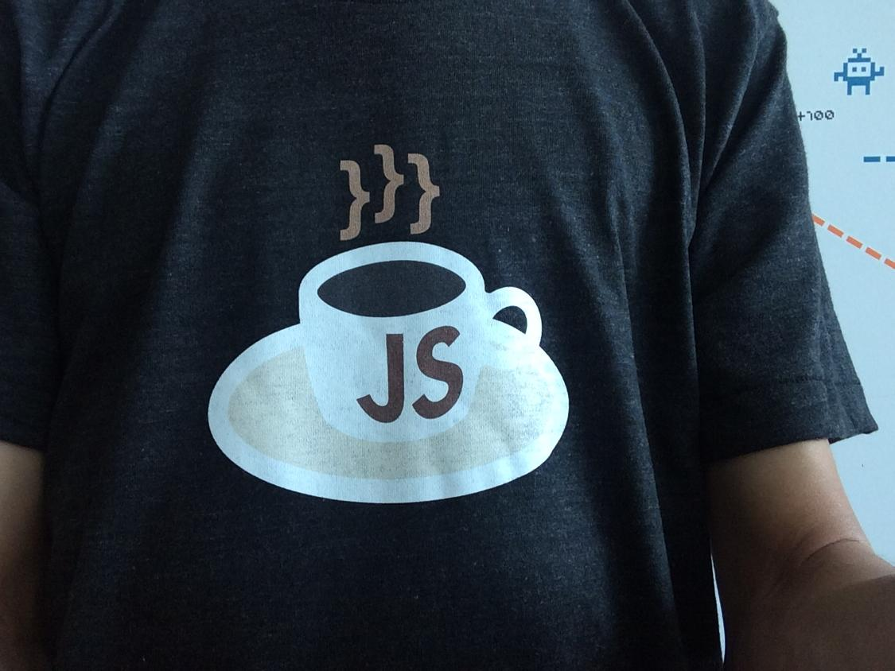
>
> — Chee Aun ✨ (@cheeaun) [December 18, 2014](https://twitter.com/cheeaun/status/545400552901718016)

We make use of social media for our **marketing** efforts.

> No [#ValentinesDay](https://twitter.com/hashtag/ValentinesDay) plans? Why not come and join our 10th [#kopijs](https://twitter.com/hashtag/kopijs) meetup? <https://github.com/KopiJS/kopi.js/issues/21>
>
> 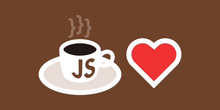
>
> — Kopi.JS (@kopi\_js) [February 12, 2015](https://twitter.com/kopi_js/status/565707339370868736)

Kopi.JS is a **casual** meetup. There’s no speakers and no talks. No schedules. No pizza. No commitment. You don’t have to drink coffee if that’s your choice. You don’t have to know JavaScript or *Coffee*Script too. The event is open for the public and anyone can join. It’s a good chance to meet and talk with the local developer community. It’s a good *excuse* to go out there and mix with strangers who probably share the same interests as you do.

Spread the love
---

Kopi.JS meetup is not the first of its kind. There’s [BeerJS](https://github.com/beerjs/meta) in a lot of cities. There’s [SushiJS](http://www.sushijs.org/) and I’ve attended [its first meetup](https://github.com/sushijs/san-francisco-ca-usa/issues/1) last year. There’s even [DimsumJS](http://dimsumjs.github.io/) in London.

I especially like how SushiJS describe this kind of event:

> Many meetups are designed to disseminate information, but not bring communities together. However, talking with other people over food became my favorite part of meetups and conferences, so I decided to make a “eatup” built around that.
>
> — Terin Stock

There’s no such meetup in your city? Organize one! It’s not *that* hard compared to a conventional developer meetup. Talk with people in the community, hang out with them, ask around and invite them. Use GitHub for easy contribution. Have fun with names for the meetup and print stickers for the sake of it.

Epilogue
---

Despite all the effort in organizing the meetups, Kopi.JS wouldn’t exist without the community. If people don’t attend them, it seriously wouldn’t work at all. I have **high gratitude** towards people who joined and helped making this a success. Don’t thank *me* for organizing, thank **you** for joining.

I would like to quote Winnie Lim, who joined the 3rd meetup:

> We were all very different individuals, from vastly varying backgrounds and life stories, with divergent trajectories and hopes — but all of that didn’t matter when we were all bridged by the work we all love to do, made possible by the lack of a physical distance across ones and zeroes.
> 
> — Winnie Lim, [Bridging connections](http://journal.winnielim.org/bridging-connections)

---

*Originally published at [medium.com](https://medium.com/kopi-js-community/the-kopi-js-meetup-story-5ee2cd574678)*