Kopi.JS in 2015
===

I personally find it amazing that [Kopi.JS](http://kopijs.org/) got started in 2013 and next year is going to be 2016. Even the [last article I wrote](/blog/2015/02/the-kopijs-meetup-story) was in February *this* year but somehow feels like a *long* time.

I would like to look back and see how we progress so far, one meetup at a time and one photo at a time.

There’s a total of [**11 Kopi.JS meetups**](https://github.com/kopijs/kopi.js/issues?utf8=%E2%9C%93&q=is%3Aissue+is%3Aclosed+label%3Aevent+created%3A2015-01-01..2015-12-31) this year so here goes:

January 24th
---

Location: [Chin Mee Chin Confectionery](https://foursquare.com/v/chin-mee-chin-confectionery/4b2d8577f964a5204fd824e3)

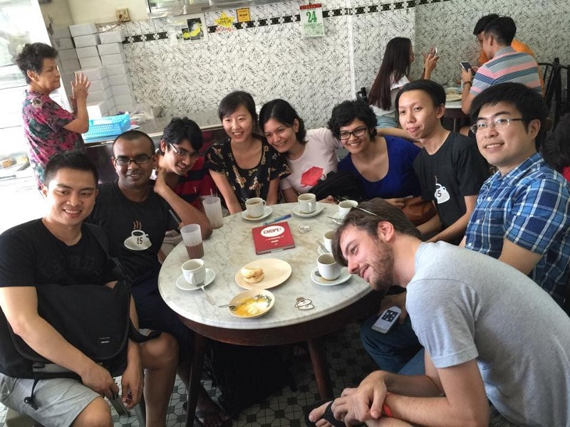

[Photo by Michael Cheng](https://www.facebook.com/photo.php?fbid=10153079340482229&set=a.475431307228.261529.503517228&type=3&theater). Everyone’s looking at the other camera. Ignore the aunty.

February 14th
---

Location: [Creamier](http://creamier.com.sg/) (a little 🍦 and ☕️ there)

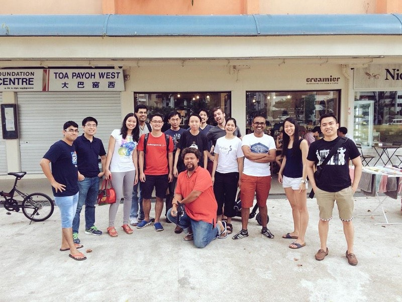

[Photo by Joshua Koo](https://twitter.com/BlurSpline/status/566526060594864128).

February 28th
---

Location: [Ya Kun Kaya Toast](https://foursquare.com/v/ya-kun-kaya-toast-%E4%BA%9E%E5%9D%A4/4b231bc2f964a520635324e3) 

😥 *No photos, so putting here a nice photo of coffee for now* 😜

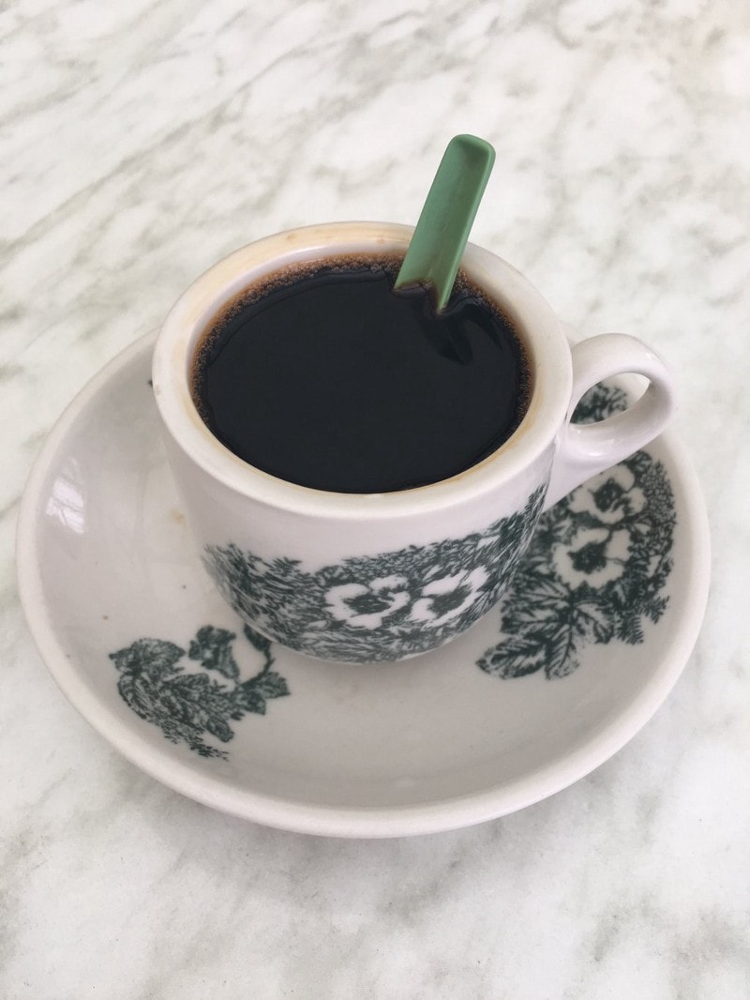

[Photo by myself](https://twitter.com/cheeaun/status/668260125866598400), going to drink this cup of Kopi.

March 12th
---

Location: [Amoy Street Food Centre](https://foursquare.com/v/amoy-street-food-centre/4b305537f964a520fef824e3)

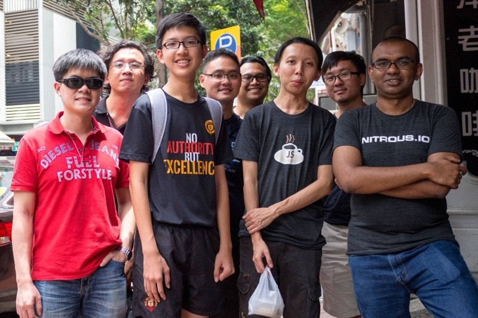

[Photo by Valentine](https://github.com/KopiJS/kopi.js/issues/26#issuecomment-78430254). Look at those smiles.

April 11th
---

Location: [My Awesome Cafe](http://www.myawesomecafe.com/)

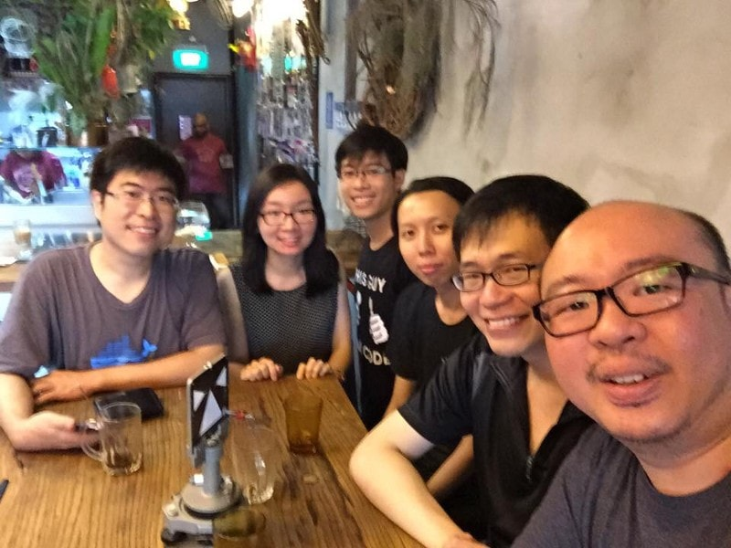

[Photo by Michael Cheng](https://www.facebook.com/photo.php?fbid=10153260605662229&set=pcb.10153260607237229&type=3&theater)

May 21st
---

Location: [Selfie Coffee Singapore](https://instagram.com/selfiecoffeesg)

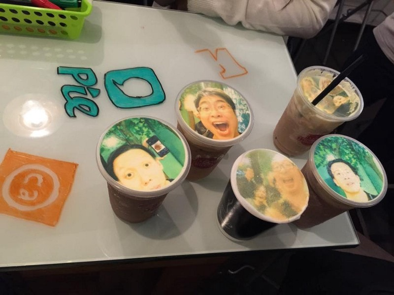

[Photo by Michael Cheng, again](https://www.facebook.com/photo.php?fbid=10153353568702229&set=pcb.10153353568847229&type=3&theater). Yeap, those are selfie photos on top of coffee. Drinkable.

July 18th
---

Location: [Oberstrasse](https://www.facebook.com/oberstrasse)

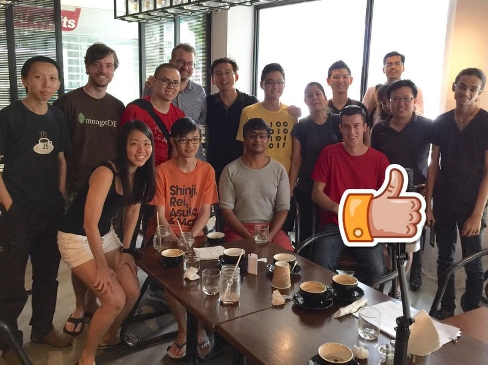

[Photo by Michael Cheng…](https://twitter.com/coderkungfu/status/622280774616788992) 👍

August 19th
---

Location: [Yahava KoffeeWorks](http://www.yahava.sg/)

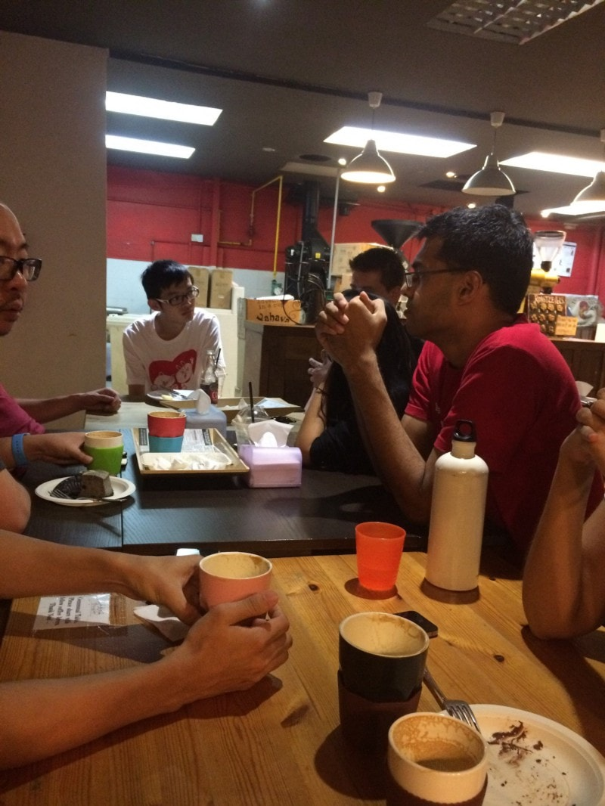

[Photo by myself](https://www.flickr.com/photos/cheeaun/20951976836/in/pool-kopijs/). Pretty bad angle shot there, I know.

October 4th
---

Location: [Percolate](http://percolate.sg/)

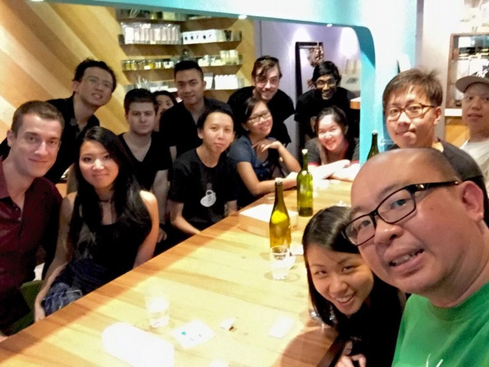

[Photo by Michael C.. again?!](https://www.facebook.com/photo.php?fbid=10153708182727229&set=pcb.10153708182877229&type=3&theater) 💁

October 31st
---

Location: [Chin Chin Eating House](https://foursquare.com/v/chin-chin-eating-house/4b0eb596f964a520ea5923e3)

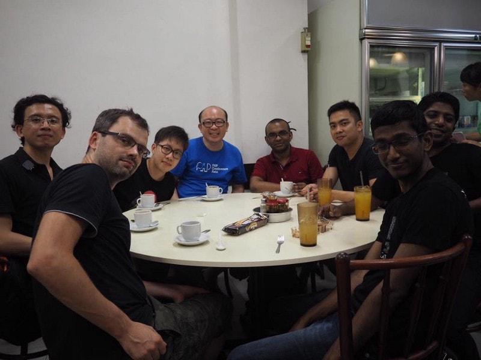

[Photo by Lakshan Perera](https://github.com/KopiJS/kopi.js/issues/32#issuecomment-153139188). I’m not there but luckily Tim Tams were there.

November 22nd
---

Location: [Ya Kun Kaya Toast](https://foursquare.com/v/ya-kun-kaya-toast-%E4%BA%9E%E5%9D%A4/4b231bc2f964a520635324e3)

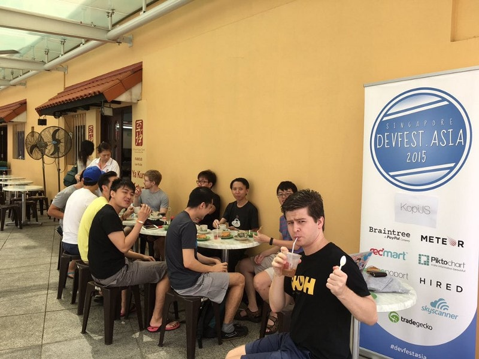

[Photo by probably… Thomas?](https://twitter.com/devfestasia/status/668273204788486145)

Tiny milestones
---

Yeap, for newcomers, first of many #kopijs meetups to come. And that includes next year. As always, I would like to thank **everyone** for joining the Kopi.JS meetups and take all these nice and memorable photos.

Happy 2016 to all Kopi (and non-Kopi) lovers 🎉

---

*Originally published at [medium.com](https://medium.com/kopi-js-community/kopi-js-in-2015-423fc469930f)*