2015 in review
===

Last year, I did [a review](/blog/2014/12/2014-in-review) and mentioned that this year will be better. Now it's that time of the year again to look back and review all the things.

Little things
---

First, let's look at the *little* things:

- [11 Kopi.JS meetups](https://medium.com/kopi-js-community/kopi-js-in-2015-423fc469930f#.480fahtp7) were successfully organized this year.
- On January, I published my very old [Newt Edge site on GitHub Pages](https://twitter.com/cheeaun/status/560102638583169026). Mathias [approves](https://twitter.com/mathias/status/560103594989723648).
- I wrote my [first public Medium post](https://twitter.com/cheeaun/status/560102638583169026).
- I finally got [my own MooTools t-shirt](https://twitter.com/cheeaun/status/573336885067563008) despite being an advocate since [the beginning](https://twitter.com/cheeaun/status/521509002).
- I started using [Slack](https://slack.com/) as a [chatroom for Kopi.JS](https://twitter.com/cheeaun/status/573357936208048128).
- On March, I published my very old (again) [pre-Phoenity site on GitHub Pages](https://twitter.com/cheeaun/status/574536412864778240).
- I [attended](https://twitter.com/cheeaun/status/576250938345680896) [FOSSASIA](https://twitter.com/cheeaun/status/576579335315849216).
- I migrated a lot of my repositories from Google Code to GitHub because [Google Code will be shut down](http://google-opensource.blogspot.sg/2015/03/farewell-to-google-code.html). One of the prominent projects that [I migrated is Pentagoo](https://twitter.com/cheeaun/status/577058393661165568) which surprisingly still works.
- I [moved my list of Hacker News apps](https://twitter.com/cheeaun/status/582187798393827328) to a repository of its own.
- On April, I [built Kyoku, my first ever Mac app](https://twitter.com/cheeaun/status/586550447399251969) with [Electron](http://electron.atom.io/) (previously known as Atom Shell), which later became [available on Homebrew Cask](https://twitter.com/cheeaun/status/603035181310586880).
- I [integrated an outgoing webhook](https://twitter.com/webuildsg/status/588214751462756352) into Kopi.JS Slack room and many other rooms, using [Blockspring](https://www.blockspring.com/blog/serverless-slack-bots).
- I built [Arrivelah](https://twitter.com/cheeaun/status/593731645057802240), a fast simple API for bus arrival times in Singapore.
- On May, I [bought some cool t-shirts](https://twitter.com/cheeaun/status/602716372309676035) from [Cotton Bureau](https://cottonbureau.com/).
- I [contributed a little](https://twitter.com/webuildsg/status/604667901300211712) on the [We Build SG](https://webuild.sg/) OSX menubar app.
- I [watched Silicon Valley](https://twitter.com/cheeaun/status/605630304930308096).
- On June, I [attended](https://twitter.com/cheeaun/status/606275160593862657) [RedDotRubyConf](https://twitter.com/cheeaun/status/606648310334689280) and [helped a little](http://winstonyw.com/2015/07/30/half_a_decade_of_reddotrubyconf/) by collecting [links to slides and photos](https://twitter.com/cheeaun/status/608838300376301568), as always.
- I helped the [Walkabout SG](http://www.walkabout.sg/) peeps by creating a [simple](https://twitter.com/cheeaun/status/607105138847670272) [map](https://twitter.com/vlauria/status/613306941352185856) for participating companies. Also participated by visiting some offices such as [Twitter's new office](https://twitter.com/cheeaun/status/614326875331104768).
- I [started](https://twitter.com/cheeaun/status/608590286424449024) [playing](https://twitter.com/cheeaun/status/608973704224096258) [Neko](https://twitter.com/cheeaun/status/609632388461674496) [Atsume](https://twitter.com/cheeaun/status/609677594238169088) 😻
- I tried playing this [Flappy-Birds-like game on Pebble Time watch](https://twitter.com/cheeaun/status/609198427604303873). It was disastrous.
- I redesigned my [BusRouter.SG](https://busrouter.sg/) web app, posted a [lot](https://twitter.com/cheeaun/status/609655376808534017) [of](https://twitter.com/cheeaun/status/610451541187690496) [sneak](https://twitter.com/cheeaun/status/610973074494623744) [previews](https://twitter.com/cheeaun/status/611023628440711168) before [launching it](https://twitter.com/cheeaun/status/611908395537297409). It was also [*featured*](https://twitter.com/slightlylate/status/621233817429372928) due to using [Service Workers](http://www.w3.org/TR/service-workers/).
- I [compulsively registered cheeaun.life domain](https://twitter.com/cheeaun/status/611861874565451776), on the day before my birthday.
- On July, I [started an AMA (Ask Me Anything) *page*](https://twitter.com/cheeaun/status/618620990474457088) on [GitHub issues](https://github.com/cheeaun/ama/issues) where random people ask me some good and weird questions. My most favourite question is '[How do you get your next idea to work on?](https://github.com/cheeaun/ama/issues/7)'.
- I [showed a whole](https://twitter.com/cheeaun/status/620961706236252162) [bunch of](https://twitter.com/cheeaun/status/621679246944043008) [sneak previews](https://twitter.com/cheeaun/status/625282235353006080) of my new [HackerWeb for iOS](https://github.com/cheeaun/hackerweb-ios) app, finally [open-sourced it](https://twitter.com/cheeaun/status/643438214561275904) and then show [even more](https://twitter.com/cheeaun/status/647704108451827712) [previews](https://twitter.com/cheeaun/status/648379573525086208), including [the new icon](https://dribbble.com/shots/2242465-The-new-HackerWeb-iOS-icon-v2).
- I painstakingly [moved from using Google Authenticator to Authy](https://twitter.com/cheeaun/status/622025724426235904) for my two-factor authentication needs.
- I [received my LithiumCard Pro](https://twitter.com/cheeaun/status/623024355329441792) from my backing in the [Kickstarter project](https://www.kickstarter.com/projects/lithiumcardpro/lithiumcard-pro-hypercharging-evolved).
- I [upgraded my JS error logging services list](https://twitter.com/cheeaun/status/625136768765956097) from a Gist to a GitHub repository.
- I [bought Lea Verou's CSS Secrets book](https://twitter.com/cheeaun/status/626248554768568320)!
- On September, I [upgraded my personal site (cheeaun.com)](https://twitter.com/cheeaun/status/641280531192111104) to a pure static site with [Metalsmith](http://www.metalsmith.io/).
- I [gave a talk](https://twitter.com/engineersftw/status/644491713549983744) on ['Getting excited on Electron'](https://twitter.com/webuildsg/status/644483031533666304) in Talk.JS meetup. There's even [a video](https://www.youtube.com/watch?v=Dll0Eb6dVOM) in case you wonder how I talk. I'm glad that my talk *inspired* some developers to [write their own](https://twitter.com/BlurSpline/status/663460668436180992) [desktop apps](https://twitter.com/BlurSpline/status/664152504729337856).
- I [got mentioned](https://twitter.com/imknight/status/646210043063304192) by [Sam-Mauris Yong](https://twitter.com/_mauris) in [PHPConf.Asia](http://phpconf.asia/) even though I didn't attend it.
- On October, I [bought the new 12-inch Macbook](https://twitter.com/cheeaun/status/649879880465649665) and [upgraded from 5S to iPhone 6S](https://twitter.com/cheeaun/status/652773147888881664).
- I [built a line-drawing web app](https://twitter.com/cheeaun/status/656631323923091456) to demonstrate 3D Touch on Mobile Safari. It [got featured on MacStories](https://twitter.com/macstoriesnet/status/656868229525057542) and used by [Maximiliano Firtman](https://twitter.com/firt) to test on [the new](https://twitter.com/firt/status/666438652860506112) [iPad Pro](https://twitter.com/firt/status/666414635390795776).
- I [received the Earin earbuds](https://twitter.com/cheeaun/status/657428217129644032) from my backing of the [Kickstarter project](https://www.kickstarter.com/projects/1629248706/earin-the-worlds-smallest-wireless-earbuds).
- I [quit my job](https://twitter.com/cheeaun/status/657395165691146240).
- On November, I bought [Chromecast 2, Nexus 5X](https://twitter.com/cheeaun/status/662086120331591680) and [Peelcase](https://twitter.com/cheeaun/status/664953810771537920).
- I attended [CSSConf.Asia](https://twitter.com/cheeaun/status/666778444555001856) and the [two-day](https://twitter.com/cheeaun/status/667149235465359360) [JSConf.Asia](https://twitter.com/cheeaun/status/667516737387175936). I saw [Mathias](https://twitter.com/mathias) (again), [Jennifer Wong](https://twitter.com/mybluewristband), [Chris Lilley](https://twitter.com/svgeesus), [Mathieu Henri](https://twitter.com/p01) and [Mariko Kosaka](https://twitter.com/kosamari). I've also [collected links for the talks](https://twitter.com/cheeaun/status/667336413231251457).
- I attended the [first ever](https://twitter.com/soareschen/status/668389005663145984) [Singapore CSS meetup](https://twitter.com/devfestasia/status/668391087166242816).
- I [renewed my Malaysian passport](https://twitter.com/cheeaun/status/669447767127924736).
- I [attended the 3rd annual Geek Brunch](https://twitter.com/webuildsg/status/670469343080124416).
- On December, I [bought stickers and buttons](https://twitter.com/cheeaun/status/678133207234031616) from [Support Web Standards.com](http://supportwebstandards.com/).
- I [donated to Molly's fundraiser](https://www.gofundme.com/ThanksMols).
- I [watched the seriously kick-ass One Punch Man](https://twitter.com/cheeaun/status/678628475553509376).

Okay, that's *a lot* of little things. And little things matter.

So now let's look at my travels.

Auckland
---

On [April 22](https://twitter.com/cheeaun/status/590859150885670912), I departed from Singapore to Auckland, New Zealand, to attend [Codemania](http://lanyrd.com/2015/code-mania/) conference. It's a 10-hour flight and I stayed there for 9 nights. The first thing I see from the hotel is the Sky Tower.

 [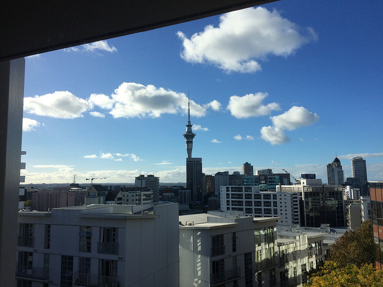](https://www.instagram.com/p/15CdaWS9_J/)

It turns out that when I was there, the New Zealanders were celebrating [Anzac Day](https://en.wikipedia.org/wiki/Anzac_Day) on April 25. The weather was good though it rained few times in a day sometimes. I visited the [Auckland Zoo](https://foursquare.com/aucklandzoo) to look at kiwis but sadly didn't manage too see any. I was looking forward to walk on the [Harbour Bridge](https://foursquare.com/v/auckland-harbour-bridge/4b4cd551f964a520c9c026e3) but later realised that it's not walkable, which then I found out about the [SkyPath project](http://www.skypath.org.nz/) that is proposed to provide a walking path along the bridge.

One of my most favorite and rather-unexpected place is [Mount Eden](https://foursquare.com/v/mount-eden--maungawhau/4b5204e0f964a520b06127e3).

 [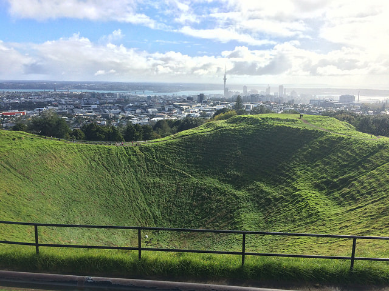](https://www.instagram.com/p/2AZ4-py92c/)

As how I describe it in [my AMA](https://github.com/cheeaun/ama/issues/15#issuecomment-120687652):

> I love going up hills and take photos. The hiking process gives you a sense of achievement once you reach the top and take photos of the amazing view. There are also similar experiences if you go for Sky Tower in Sydney, TV Tower in Berlin or even Eiffel Tower in Paris, but the effort it takes to go up **makes a difference**. This is Mount Eden in Auckland, New Zealand. It was quite a challenging hike for me because it was also raining or drizzling on and off while I'm going up the steep trails. When I reach the top, I totally didn't expect the crater at all. And if you zoom in the photo, there's an umbrella and some stone decorations in the middle of the crater. I don't know how they got there but seems kinda hilarious to me.

Also not forgetting the wandering sheeps at [One Tree Hill](https://foursquare.com/v/one-tree-hill-summit/4f1b96c8e4b0d1a655e49391).

 [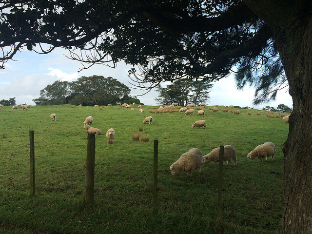](https://www.instagram.com/p/2Aa2N6S94H/)

Like my previous trips, I made some observation notes which I personally find interesting:

- During my stay, it gets dark by 6PM.
- Mostly buses as public transportation. The trains are available only for longer distances.
- Tank Juice bars, Starbucks and Gloria Jean's everywhere.
- The convenience stores or mini-marts are called 'Superette'.
- When the bus stops and the door opens, people say 'thank you' to the bus driver before alighting. Fascinating.
- The whole CBD is a liquor band area.
- No liquors are allowed in the taxi.
- Use [MetService](http://metservice.com/) for more accurate weather forecasts.
- Use [AT HOP card](https://en.wikipedia.org/wiki/AT_HOP_card) for the public transportation.
- The letterboxes in front of a lot houses always mark 'No circulars' or 'No junk mail'.
- The Sky Tower has [different lightings at night](https://www.skycityauckland.co.nz/attractions/sky-tower/lighting/). It became red during the Anzac Day.

I went back to Singapore on [May 1](https://twitter.com/cheeaun/status/593926205511835648). Some [stats](https://twitter.com/cheeaun/status/594872615929446400):

- 48 Swarm check-ins
- 17 Instagram photos and videos
- 45 tweets
- [237 photos and 3 videos](https://www.flickr.com/photos/cheeaun/albums/72157651925636988) on Flickr

Düsseldorf and Cologne
---

A week later, I travelled to Germany (again) on [May 8](https://twitter.com/cheeaun/status/596688821317578752). This time, on the west side, in Düsseldorf. It's a 15-hour flight, with a stopover at the Frankfurt airport.

I [attended a conference](https://twitter.com/cheeaun/status/597674110802624513) called [Beyond Tellerrand](http://beyondtellerrand.com/events/duesseldorf-2015) (double 'L' and double 'R' there) which at first I didn't expect much but ultimately became the **best conference** I have ever been. I [saw *a lot* of my web heroes](https://twitter.com/cheeaun/status/598171921172291584) of the early *and* not-so-early Internet days; [Simon Collison](https://twitter.com/colly), [Chris Heilmann](https://twitter.com/codepo8), [Scott Jehl](https://twitter.com/scottjehl), [Jeremy Keith](https://twitter.com/adactio), [Peter-Paul Koch](https://twitter.com/ppk), [Rachel Nabors](https://twitter.com/rachelnabors), [Dave Shea,](https://twitter.com/mezzoblue) [Sara Soueidan](https://twitter.com/SaraSoueidan) and [Jeffrey Veen](https://twitter.com/veen). Got to say, this is a really amazing line up of speakers. My most favourite talk has to be Jeffrey Veen's [Momentum: Crafting a Creative Culture](https://vimeo.com/129198643) where I learnt a very powerful term called '**equanimity**'. At the end of the day, I was mind-blown, satisfied and tired at the same time.

After the conference, I spent few days touring around. Compared to Berlin, I think Düsseldorf is more chill and less touristy. Lesser bike lanes, lesser [Geldautomat](https://de.wikipedia.org/wiki/Geldautomat) and not that many *grand* train stations. Oh well, more geese instead.

 [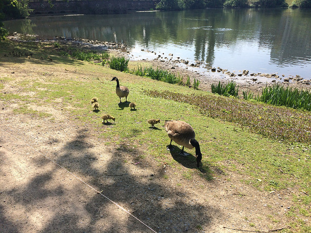](https://www.instagram.com/p/2gqY3iy98C/)

It's probably hard to believe this, there are quite a lot Japanese people and restaurants in Düsseldorf. There's a Japanese temple called [EKŌ-House of Japanese Culture](https://foursquare.com/v/eko-haus-der-japanischen-kultur/4e3e89a552b1a04aff264017) and a [German–Japanese co–educative kindergarten](http://www.eko-kindergarten.de/) beside it. So if you go to one of the ramen restaurants, for example [Naniwa](https://foursquare.com/v/naniwa-noodles--soups/4bb64cb06edc76b092b7301c) or [Takumi](https://foursquare.com/v/takumi/4b3be8f6f964a520207e25e3), the Japanese servants speak to you in German, which I personally find rather interesting. Sometimes I feel like I'm in the wrong place.

 [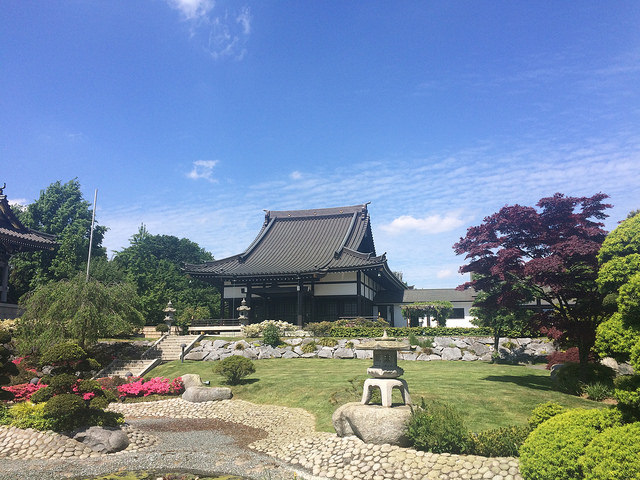](https://www.flickr.com/photos/cheeaun/17277437504/in/album-72157652750212588/)

Here's more of my observation notes:

- During my stay, sunrise around 6AM but [sunset around 9PM](https://twitter.com/cheeaun/status/597467335834923010).
- Most pedestrian traffic lights have red and green lights. In Düsseldorf, there's an additional intermediate **yellow** light.
- When you order *plain* water, there's always two options; carbonated or still.
- I feel that nature is quite well-blended into the city. Grasses on the train tracks. Free-roaming geese in the parks and lakes surrounded by people and buildings. Rabbits in the parks with kids' playground.

While staying there, I've heard of people talking about the *rivalry* between Düsseldorf and Cologne (also known as Köln in German). It even appears on [Chris Heilmann's slides](http://www.slideshare.net/cheilmann/beyond-tellerand2015/3). So I got a little curious and decided to take a one-day totally-unplanned trip there, by taking a 30-minute train ride between the main stations. I was also trying out using [Captain Train](https://www.captaintrain.com/) (previously known as [Capitaine Train](https://blog.captaintrain.com/9415-name-logo)) to book the tickets on my phone which is surprisingly easy and seamless. I rode on the ICE (InterCity Express) high-speed train, to and fro.

 [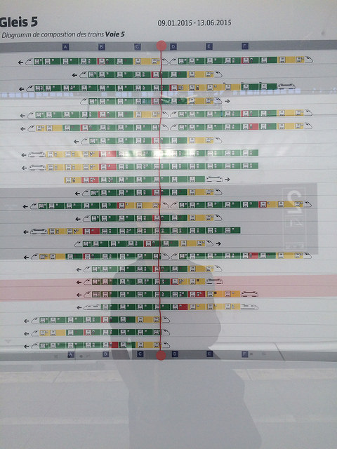](https://www.instagram.com/p/2t5Vr7y95K/)

It was a bit confusing until I [see this *chart*](https://www.instagram.com/p/2t5Vr7y95K/):

> The red vertical line marks where I'm standing now. Those are A to F zone indicators. Green section of the train = 2nd class. Yellow = 1st class. So, stand at the right zone depending on which class of ticket you purchased.

Cologne was a bit *different* than what I expect.

[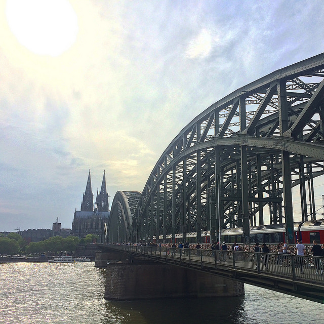](https://www.instagram.com/p/2rDymJS90O/)

My observation notes:

- There are more bikes there than in Düsseldorf but the lanes are slightly less *organized* than in Berlin.
- More tourist-friendly, for some reason.
- If having a yellow light in pedestrian traffic lights sounds weird to you, Cologne has **two** red lights and one green light. A little googling reveals that it's probably for *backup* in case one of the red lights stops working 😅
- Most of the stairs have bike rails, so called the [bicycle stairway](https://en.wikipedia.org/wiki/Bicycle_stairway).
- Quite random when I saw a bus called [MEGA-Partybus](http://www.mega-partybus.de/).

It was a rather short trip. I didn't manage to go the Apple Store in Cologne because [it's too far](https://twitter.com/cheeaun/status/598784928780791808). I headed back to Düsseldorf and a day later, flew back to Singapore on [May 16](https://twitter.com/cheeaun/status/599630059184463872).

Some [stats](https://twitter.com/cheeaun/status/601042709122420736):

- 61 Swarm checkins
- 20 Instagram photos
- 76 tweets
- [117 photos and 1 video](https://www.flickr.com/photos/cheeaun/albums/72157652750212588) on Flickr

Paris
---

Since I [couldn't make it](https://twitter.com/cheeaun/status/560686864386912257) to the [first React.js conference](http://conf2015.reactjs.org/) in San Francisco, I decided to go for [ReactEurope](https://www.react-europe.org/2015/2015.html) instead, in Paris. I flew on [June 26](https://twitter.com/cheeaun/status/614424601913769984) with a stopover at Dubai. The talks were amazing and mostly from Facebook employees. I saw [Christopher Chedeau](https://twitter.com/Vjeux), [Sebastian Markbåge](https://twitter.com/sebmarkbage) (again, since last year's JSConf.EU), [Michael Jackson](https://twitter.com/mjackson) (nope, not *that* Michael Jackson), [Cheng Lou](https://twitter.com/_chenglou), [Sebastian McKenzie](https://twitter.com/sebmck), [Jed Watson](https://twitter.com/JedWatson), [Dan Abramov](https://twitter.com/dan_abramov), [Ryan Florence](https://twitter.com/ryanflorence) (again, since last year's EmberConf, who also wore the same MooTools t-shirt as I did) and [Stefano Ceschi Berrini](https://twitter.com/stecb) (who [noticed me wearing the MooTools t-shirt](https://twitter.com/stecb/status/616657880020856832)).

On the [first day](https://twitter.com/cheeaun/status/616516104387735552) of the conference, I wore the MooTools t-shirt. On the second day, I wore a jQuery t-shirt which has a tagline that says 'write less, do more' 😝. It sort of grabbed some attention and some random stranger [even took at photo with me](https://twitter.com/cheeaun/status/617080148370812928). On the third day, I wore the ReactEurope t-shirt, went to [Versailles](https://foursquare.com/v/ch%C3%A2teau-de-versailles/4adcda09f964a520df3321e3), cycled around the garden and got spotted by some of the conference attendees as they were on [their own trip planned by the organizers](https://medium.com/@patcito/a-day-at-versailles-to-relax-after-the-reacteurope-conference-4e600d0feac). Seriously [wearing the right t-shirt at the right time helps](https://twitter.com/cheeaun/status/617297713550487552).

 [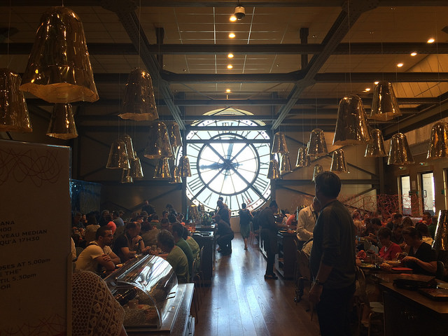](https://www.instagram.com/p/4epPwuy941/)

It's *literally* the [hottest conference I've ever been to](https://twitter.com/cheeaun/status/616644799236567040). It was [around 34° Celcius](https://twitter.com/cheeaun/status/615925625770090497) in Paris at that period of time. I visited [Musée du Louvre](https://www.instagram.com/p/4eo0Wwy94G/), [Musée d'Orsay](https://www.instagram.com/p/4epPwuy941/), [Panthéon](https://www.instagram.com/p/4eqO3ry96_/), [Eiffel Tower](https://www.instagram.com/p/4hQM-Py92n/) ([twice](https://www.instagram.com/p/4iw6jbS99T/)), and [Mozilla's office](https://www.instagram.com/p/4mcoPRS939/) (for the [hackathon](https://medium.com/@patcito/announcing-the-reacteurope-hackathon-at-mozilla-paris-60e8105b85eb)). I saw the [Mona Lisa](https://www.instagram.com/p/4eocH1S93V/), ate [*French* fries](https://www.instagram.com/p/4jcNmOy98n/), found [Flappy birds](https://www.instagram.com/p/4mdxZ1S96a/), ate [escargots ](https://www.instagram.com/p/4sSkg5y9wn/)and witnessed [a real wheat field](https://www.instagram.com/p/4uXWTvy9x6/).

My most favourite shot has to be this sunset view taken at Rue Saint Louis en l'Ile:

 [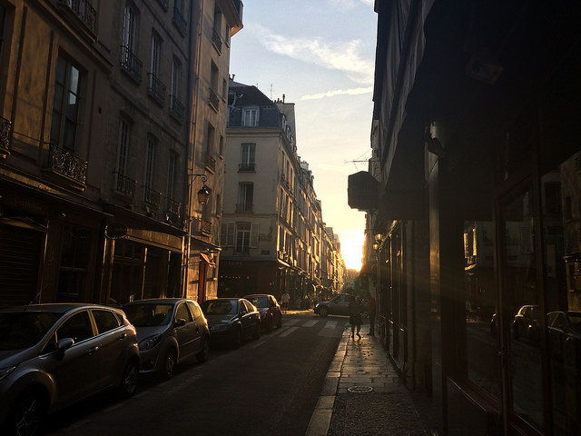](https://www.instagram.com/p/4fJEY6y9w8/)

Time for my observation notes:

- I heard this few times from other people but never actually believe them much. The first time I take a metro there, I saw poo stains in the train. On the second day, I saw actual poo in the train. It smells. After a few days of taking trains, I sort of got used to it. Oh well.
- The word 'soldes' is like everywhere. It means 'sales' in French.
- 'Pain' means 'Bread' in French.
- Graffiti everywhere.
- Bike rentals everywhere.
- Prepaid data plans are quite expensive.
- There's a "red cross" at the rear of the red lamp of the traffic light. If red lights up, people at the back can see it lights up. Not sure why...
- Public toilets are really, really hard to find. Even if you found one, it might be closed ಠ_ಠ
- Some train stations have [pretty neat typography on the signage](https://en.wikipedia.org/wiki/Architecture_of_the_Paris_M%C3%A9tro#Signage_and_typography).
- Use [Navigo pass](https://en.wikipedia.org/wiki/Navigo_pass) for public transportation. Hat tip to [Alvin](https://twitter.com/alvinsj)!
- There are condom vending machines in some Metro stations.

[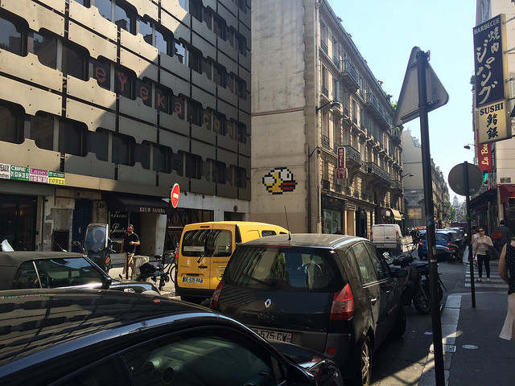](https://www.instagram.com/p/4mdxZ1S96a/)

I returned back to Singapore on [July 5](https://twitter.com/cheeaun/status/617685588620222464). The [stats](https://twitter.com/cheeaun/status/618425755177857025):

- 62 Swarm check-ins
- 30 Instagram photos and videos
- 44 tweets
- [310 photos and 13 videos](https://www.flickr.com/photos/cheeaun/albums/72157655579781585) on Flickr

Tokyo and San Francisco
---

This is my [3-week 'San Fransokyo' trip](https://www.instagram.com/p/-LxPy5S9wm/) (reference from [Big Hero 6](https://en.wikipedia.org/wiki/Big_Hero_6_(film))).

From the beginning, I planned to attend [An Event Apart: San Francisco](http://aneventapart.com/event/san-francisco-2015), but was hesitant to take a more-than-16-hour flight over the Pacific Ocean, so I decided to stop over at Tokyo for longer periods of time as vacation. Basically I flew on [October 25](https://twitter.com/cheeaun/status/658278004506755072), stayed for 4 nights in Ueno, [flew](https://twitter.com/cheeaun/status/659925431768879104) to San Francisco, stayed for 11 nights in [SoMa](https://en.wikipedia.org/wiki/South_of_Market,_San_Francisco), [flew](https://twitter.com/cheeaun/status/664457738710155265) back to Tokyo, stayed for 6 nights in Shinjuku and finally flew back to Singapore on [November 17](https://twitter.com/cheeaun/status/666429959674564610). Pretty straightforward.

Tokyo was amazing.

 [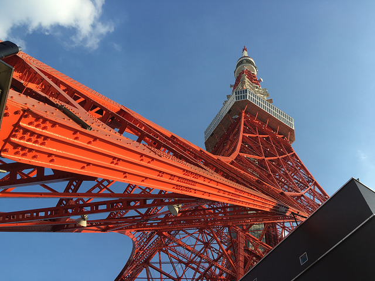](https://www.instagram.com/p/9YTRASS9_g/)

I visited a few places such as:

- [Sensō-ji Temple](https://www.instagram.com/p/9VxSo7S951/) ([twice](https://www.instagram.com/p/-GsJdgy9wa/))
- [Tokyo Skytree](https://www.instagram.com/p/9Vxu0Wy96f/)
- [Akihabara](https://foursquare.com/v/%E7%A7%8B%E8%91%89%E5%8E%9F-akihabara/4b5a80a4f964a52078c828e3) (3 times)
- [Tokyo Imperial Palace](https://www.instagram.com/p/9YTKwFy9_V/)
- [Tokyo Tower](https://www.instagram.com/p/9YTz75y9wU/)
- [Ghibli Museum](https://www.instagram.com/p/9avSQbS9_B/)
- [Nakano Broadway](https://foursquare.com/v/%E4%B8%AD%E9%87%8E%E3%83%96%E3%83%AD%E3%83%BC%E3%83%89%E3%82%A6%E3%82%A7%E3%82%A4-nakano-broadway/4b575f69f964a520463428e3)
- [Shinjuku Gyoen National Park](https://www.instagram.com/p/9_IUvdS95m/)
- [Meiji Jingu Shrine](https://foursquare.com/v/%E6%98%8E%E6%B2%BB%E7%A5%9E%E5%AE%AE-meiji-jingu-shrine/4b5bd0a2f964a520c31729e3)
- [Shibuya crossing](https://foursquare.com/v/%E6%B8%8B%E8%B0%B7%E9%A7%85%E5%89%8D-%E3%82%B9%E3%82%AF%E3%83%A9%E3%83%B3%E3%83%96%E3%83%AB%E4%BA%A4%E5%B7%AE%E7%82%B9-shibuya-crossing/4b654f7df964a520beec2ae3)
- [Nezu Museum](https://www.instagram.com/p/-Dit7Py94d/)
- [Tsukiji fish market](https://www.instagram.com/p/-ImBXBS9_u/)

[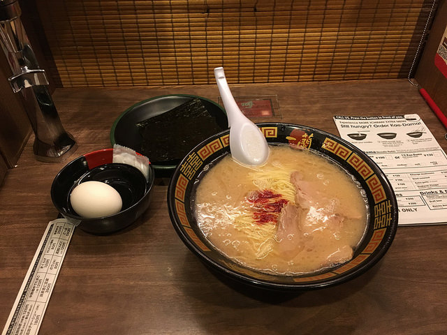](https://www.instagram.com/p/9_Itgpy96K/)

[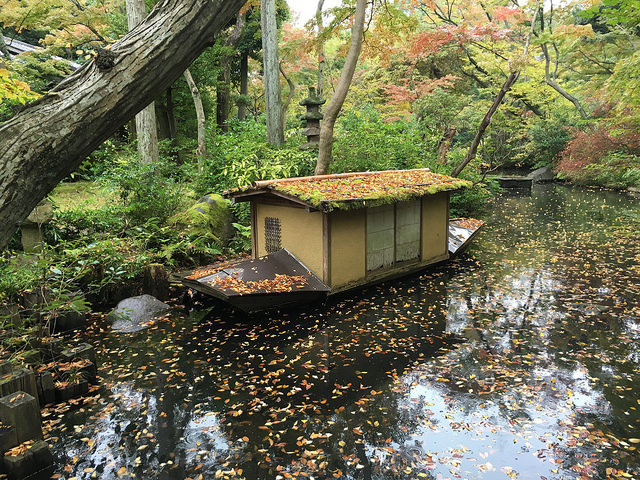](https://www.instagram.com/p/-Dit7Py94d/)

[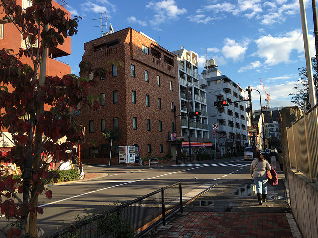](https://www.instagram.com/p/-GiA5jy9wY/)

I ate ramen at [Ichiran ramen restaurant](https://www.instagram.com/p/9Tb-7aS946/) [twice](https://www.instagram.com/p/9_Itgpy96K/). I've also ate [Niboshi (Japanese dried sardines) ramen](https://www.instagram.com/p/-EbpMuS95y/), [curry rice](https://www.instagram.com/p/9VyUZES97y/), [sushi](https://www.instagram.com/p/-BJiIvy98f/), [takoyaki](https://www.instagram.com/p/-BZFBKy9xQ/), [lobster sandwich](https://www.instagram.com/p/-DXN0gS96E/), [dango](https://www.instagram.com/p/-F2khsy9zA/), [taiyaki](https://www.instagram.com/p/-F-Ac7S9_w/), [oyster](https://www.instagram.com/p/-GEcN4S95R/), [unagi rice](https://www.instagram.com/p/-GkkxPS909/) and drank [matcha](https://www.instagram.com/p/-DFUiLS9-_/). I went to *almost* all the hipster coffee places like [Fuglen Tokyo](https://www.instagram.com/p/-AmGWly92M/), [Toranomon Koffee](https://www.instagram.com/p/-BA1PQS90S/), [Sarutahiko Coffee](https://www.instagram.com/p/-DO64KS9_O/) and [Omotesando Koffee](https://foursquare.com/v/omotesando-koffee-%E8%A1%A8%E5%8F%82%E9%81%93%E3%82%B3%E3%83%BC%E3%83%92%E3%83%BC/4d4a7d2448a06dcb94157ba2). I saw [Gundam](https://www.instagram.com/p/9YWfx2S90K/), [a speaking robot](https://www.instagram.com/p/9YXn6BS91j/), [devil fruits](https://www.instagram.com/p/9YTmF2S9__/), [dogs wearing t-shirts](https://www.instagram.com/p/-Gh5ixy9wQ/), and even the classic [Nintendo Famicon](https://www.instagram.com/p/-GiLSKS9wo/)! Not to mention I *accidentally* [boarded a women-only subway car](https://twitter.com/cheeaun/status/659202062647848960) too.

Lots of observation notes here:

- Some of the trains have station announcements in Mandarin and Cantonese languages.
- Most restaurants provide a basket under the seat for you to put your things like backpacks and hand-carries. Pretty neat because I don't have to put my backpack on the floor which may be dirty sometimes.
- Convenience stores like Lawson, 7-eleven, Sunkus, FamilyMart and Matsumoto Kiyoshi are everywhere. Starbucks and McDonald's too.
- Ask for 'eigo menu', which means 'English menu'.
- Some stores are *still* selling CDs and Blu-Rays.
- Coin lockers are everywhere.
- Yellow tactile pavings are everywhere, which is meant to assist blind or visually impaired pedestrians. I felt that the pavings became like a divider for walking directions, in conjunction with the arrow signs on the floor to indicate the direction.
- Pedestrian traffic lights have progress bar indicators for *both* red and green lights.
- Got to say, the stores in Akihabara are very overwhelming for me.
- [Pachinko](https://en.wikipedia.org/wiki/Pachinko) everywhere.
- In the trains, there are sections at the top of the seats where you can put your stuff like bags or backpacks.
- Seems like all ramen restaurants have vending machines for ordering before taking a seat.
- [PASMO](http://www.pasmo.co.jp/en/) or [Suica](http://www.jreast.co.jp/e/pass/suica.html) card for public transportation. Both can be use as digital wallet to buy things too.
- For some reason, whenever I visit some nature places in Tokyo, I always notice spider webs.
- A lot of Japanese working men wear formal suits. Regardless of how hot or cold the weather is.
- I saw some people still use flip phones.
- Some businesses display their opening times with AM/PM before the time, like  'AM 11:30'. If it opens until 1AM, it might even display '25:00'. Yeap, confusing indeed.
- There are diamond marks on the road, which indicates crosswalk ahead.
- Surprisingly there are a lot of Japanese people in touristy places. Even more than foreigners, perhaps.
- Some stations like Shibuya and Shinjuku are a bit confusing because they have so many inter-connecting lines with different exits and entrances. It's kind of like multiple stations combined into one.
- LINE chat is everywhere. Almost on par with Twitter and Facebook.
- When it rains, I saw a lot of people use [transparent plastic umbrellas](https://twitter.com/cheeaun/status/665372534020313088). Later I realised that most of them bought the umbrellas from convenience stores. I personally find it weird that even though their jackets are hooded, they still use the umbrellas anyway.
- I tried a few of the 'pocket wifi' and data SIM card solutions, such as [Global Advanced Communications](http://www.globaladvancedcomm.com/), [Sakura Mobile](https://www.sakuramobile.jp/) and [eConnect Japan](https://www.econnectjapan.com/). So far all of them works really well, and can be delivered to the airport or your hotel. Most of them need to return back the device or SIM card before you leave. I particularly prefer [eConnect Japan Prepaid SIM](https://www.econnectjapan.com/products/sim/) because it seems to be the only one I found which doesn't require returning and is disposable.
- When you buy cup noodles from convenience stores, the cashier will give you a pair of chopsticks, with [a handy toothpick](https://www.instagram.com/p/-JnWEUS92o/).
- Smoking is prohibited on some (or most) walkways. Thus there always the designated smoking areas for people to smoke.

[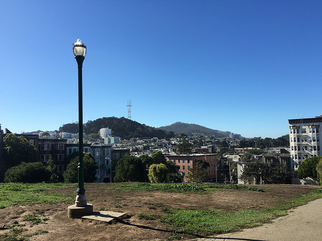](https://www.instagram.com/p/9hkkKGy9-P/)

In between my stays in Tokyo, I [went to San Francisco](https://twitter.com/cheeaun/status/660166004882980864) for [An Event Apart](https://twitter.com/cheeaun/status/661226078762049536) and stayed for a couple of days. Going to San Francisco for the second time feels a little nostalgic to me ever since my last 4-month stay there last year. During the conference, I saw a few of [my web heroes](https://twitter.com/cheeaun/status/661738238088863744) again; [Jeffrey Zeldman](https://twitter.com/zeldman), [Sarah Parmenter](https://twitter.com/sazzy), [Cameron Moll](https://twitter.com/cameronmoll), [Jeremy Keith](https://twitter.com/adactio) (again), [Josh Clark](https://twitter.com/bigmediumjosh), [Rachel Andrew](https://twitter.com/rachelandrew) and [Derek Featherstone](https://twitter.com/feather). I was really lucky to have the chance to talk with [Eric Meyer](https://twitter.com/meyerweb), who happens to be the **legend** who inspired me to learn CSS through his [early **css/edge** demos](http://meyerweb.com/eric/css/edge/).

Conference aside, I became a "tourist" again in San Francisco, going to random places, hanging out with people and noticing what's changed. [Ramen Underground](https://foursquare.com/v/ramen-underground/4e498f31b61c6886484fe715) sort of got *upgraded* and have a few more branches around the city. The construction in front of the [Apple Store](https://foursquare.com/v/apple-store-san-francisco/42cc7080f964a520e9251fe3) is still not yet done. The construction in [Dolores Park](https://foursquare.com/v/mission-dolores-park/4ab595e1f964a520877520e3) is roughly halfway done with the kids' playground still accessible to the public. I [tried UberPool](https://twitter.com/cheeaun/status/660527868498210816). I coudn't use Lyft anymore because it requires a US bank or credit card now. I've also tried a bunch of new startup-ish *things* like [Envoy Passport](https://envoy.co/passport/), [Swapbox](https://twitter.com/cheeaun/status/663547512997830656), [Breather](https://twitter.com/cheeaun/status/663920801201065984), [OfferUp](https://offerupnow.com/), and (*almost*) [Gone](https://twitter.com/cheeaun/status/660710287310393345).

Being a tourist feels refreshing.

 [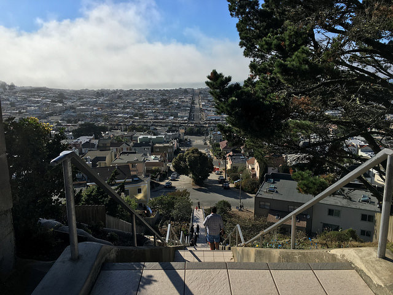](https://www.flickr.com/photos/cheeaun/22075777364/in/album-72157660623090159/)

 [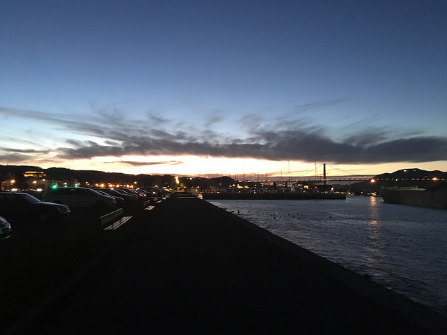](https://www.instagram.com/p/9z8tkJy98q/)

This time I didn't post any stats because there's just too much to keep up. So far I've taken [385 photos and 10 videos](https://www.flickr.com/photos/cheeaun/albums/72157660623090159) on Flickr. Since I've collected too many photos and videos, my Dropbox (free) space [immediately ran out](https://twitter.com/cheeaun/status/604211053296132096) so I started backing them up on [Glacier](https://aws.amazon.com/glacier/) and also my other files with [Backblaze](https://secure.backblaze.com/r/01blna) (my referral link).

I'll definitely try this 3-week (or longer?) travel plan again in the future when I have the chance. It's been an eye-opening experience for me.

Dad
---

6 years ago, in 2009, I was staying in Petaling Jaya (near Kuala Lumpur), working for a startup. At that time, I hang out with a friend who's also from Penang and working in that area as well. I remember that was one time he told me that I'm lucky to have a father because his father passed away when he was much younger. That thought struck me a little, with a sense of empathy. I didn't know how to respond to his statement because I don't know how he felt about it. I don't know what I don't know.

6 years later, it [happened without warning](https://twitter.com/cheeaun/status/626619948664619008) on a Thursday morning, July 30. My sister, brother-in-law, niece and I immediately booked a flight and returned to Penang as fast as possible. That 1-and-a-half-hour flight felt like days passed by. The moment we reach there, I [saw my dad](https://twitter.com/cheeaun/status/628097591759077376). I was told to have a last look at his face and place some flowers on his body before sealing the casket. And I did that.

The next 3 days, starting Friday, were for the Buddhist funeral ceremony with all the setup nearby my house apartment. The first day, Friday, was my mom's birthday.

I find that the way our mind works is very impressive. I was fully aware that my mind is trying very hard **not** to think about it and keep blocking those feelings away. I didn't cry but was rather stunned because things happen so, so fast. It's kind of like the mind needs time to digest all the information. During the 3 nights, we have take turns to stay overnight at the ceremony setup. It was very tiring.

On the third day, everyone including myself were told to walk around the casket, take another last look before moving the casket into a hearse. At that time, I don't really know what's going on. I just did what I was told to do. I prayed. I kneeled. I walked. I kneeled again. I walked again. Again and again. I held the urn. I sweated a lot. I felt pain in my knees. I sat beside the driver in the hearse. I saw the crematorium. I picked one of the bone fragments into the urn with a chopstick. I saw the urn being stored inside a columbarium.

It was surreal.

It was sudden.

Everything happened in a blink.

I simply couldn't put into words how I felt.

Few days later, I [flew back to Singapore](https://twitter.com/cheeaun/status/629950177072189441).

Life goes on
---

 [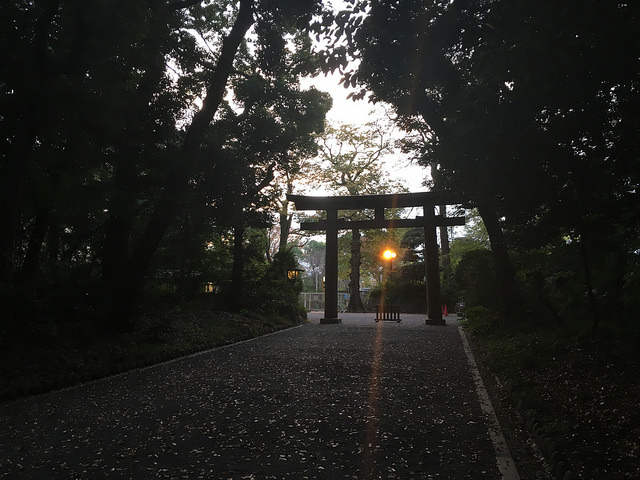](https://www.flickr.com/photos/cheeaun/22981828835/in/album-72157660623090159/)

It takes time. And it has to be one step at a time.

[Life](http://cheeaun.life/) is short. Don't waste it.

I'm very glad that I'm *able* to write this year in review. After all, life goes on as I continue my long journey to find the light. Through my travels, my work, my projects, my writings, my learnings, my observations, my friends and my family. I don't really know what my future holds, but I do know that I should never give up.

This is my 2015. The year when my life takes an unexpected turn.

Onwards to 2016.
