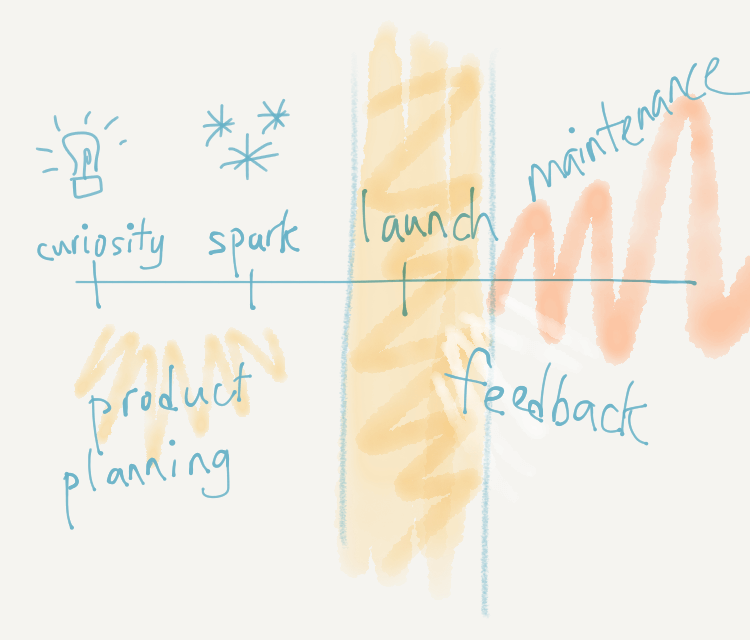

Building side projects
===

On 3rd January 2016, I started my first side project of the year, despite having [few more side projects](http://cheeaun.github.io/) up my sleeve. It's called [RailRouter SG](https://railrouter.sg/). It's a web app for people to explore MRT and LRT routes in Singapore. On [20th January 2012](https://twitter.com/cheeaun/status/160380168739897344), I built [BusRouter SG](https://busrouter.sg/) which is initially known as 'Singapore Bus Routes Explorer'. It's a web app for people to explore bus stops and routes for all bus services in Singapore. Quite similar to RailRouter SG but for buses instead.

I've built a lot of *things*. From small web applications to desktop applications. From small libraries to browser add-ons. From basic *demo* projects to web-based multiplayer games. Even then, I still find myself not *that great* compared to other people with more than hundreds of projects, like [TJ Holowaychuk](https://github.com/tj) and [Sindre Sorhus](https://github.com/sindresorhus).

So asking myself few questions. Why do I build it? What motivates me to build it? Is there a need for this kind of app? Do people request for this? Am I doing this for fame and fortune? Well, no. There's only one reason.

Curiosity
---

Some people call it an 'idea'. I prefer to call it 'curiosity'. Sayanee asked a question in my AMA, [How do you get your next idea to work on?](https://github.com/cheeaun/ama/issues/7) and my brief [answer](https://github.com/cheeaun/ama/issues/7#issuecomment-119830311) is:

> I usually don't find for ideas. For me, ideas come from being aware of things around you.

And being aware leads to being curious:

> First is being aware of things around you, be curious about them, think about them, and things just naturally flow from that point.

More than 10 years ago, I used to take buses all the time. At first, it's quite *exhilarating* because there were no apps or smart phones at that time. No Google Maps, no directions, no GPS. Every time I take a bus, I have to board the bus and ask the driver if the bus goes to destination X. And once I tried it few times, it slowly becomes a routine for me to take bus from point A to point B and vice versa. I have to memorise bus numbers and their routes. Whenever I look at bus stops, I'll observe every bus that stops there and note to myself, "Ah okay, these buses stop here, I'll have to memorise them in case I need to come here one day." A question always pops into my mind, what if one day, I missed my stop? Where would I end up at? In fact, where does the bus end up anyway? I know that every bus has a route but I don't know how the route looks like.

That *curiosity* has stuck with me for a *long* time.

From my experience, there's a difference between *wanting* to build something and *starting* to build something. Curiosity is the **first trigger** to make me *feel* like I want to build something. Or perhaps in other words, I *need* to build something. It's quite similar to what people say that they have an idea and they want to *materialize* it into something more *solid*. So now that I have the curiosity to *ignite* my project, how do I *start*? *When* do I start?

Spark
---

Spark is the **second trigger**. For some people, this trigger happens in seconds *right after* the first trigger. For others, it happens in few weeks, months or even years. For me and BusRouter SG, it happened on 7th January 2012 when I read this tweet:

> if i could view bus routes on a map the way you can view subway routes on a map, i would take them a whole lot more.
>
> —[@mengwong](https://twitter.com/mengwong/status/155511398653362177)

9 days later, I [tweeted](https://twitter.com/cheeaun/status/158891916786794497):

> If I'm not mistaken, there are 318 bus services and 4617 bus stops in Singapore.

4 days after that, I [launched BusRouter SG to the public](https://twitter.com/cheeaun/status/160380168739897344).

Perhaps there's another term for this. It's kind of like a *magical moment* for me to start building it. It feels like *good timing* for me to start *now* rather than later. This kind of *spark* doesn't have to come from other people, places or any external *inspirations*. Sometimes it comes from within, for example when I'm taking a shower, hiking up a hill, or talking to a friend.

Obviously, this is not all that magical. Things don't just suddenly happen in the timing between the first trigger and the second trigger. For years, I subconsciously kept my curiosity somewhere at the back of my mind, and constantly adding small bits and pieces of information to slowly *grow* the idea. I need to know where to get the data and which sites have it. I need to make sure there's a feature to detect my current location to instantly find nearby bus stops. I know that I can't draw *thousands* of bus stops and routes on the map because it'll be too overwhelming for the user, so I need to think of a better UI for this. I kind of draw *mockups* in my head and learn from how other apps present huge amount of data with a simple user interface. I probably need a better name for the app. I need to market it so that users would learn about it and use it, because I know there's no point launching an app that no one uses. I kind of want to display a realtime bus arrival information for every bus stop but the API was not perfect at that time, so I'll probably do that in the next phase.

Some people call this '**Product planning**', as an ongoing process to define a product's feature set. And it has to be simple and feasible in terms of time and money spent for development. That's when the term '**Minimum Viable Product**' (MVP) came into the picture.

From my experience in building apps, I learnt this the hard way. In fact, I don't even have or know the term until I read some articles that mention them. And I'm like, "Oh, there's a term for this? Okay, cool." So how *minimum* does the product need to be? For my own side projects, I always try to estimate if I can finish it in a day. How about a week? Two weeks? A month? I usually avoid side projects that last more than a month because I always feel bored looking at the same thing over and over again. Basically maximum one month. Within a month, I have to launch it publicly. If somehow I'm *unable* to publish it, I have to *at least* make it open-source and let the world see my code.

Launch
---

This is the ultimate **third trigger**. I call this a trigger because it's like a game-changer, well, depending on how you launch it. I've seen some developers didn't even manage to cross this line because of *lame* reasons like the app is not perfect yet or the code is too ugly. I've also seen some developers did a *soft-launch* for their side projects, which I think is pretty *lame* too. When I launch a product, I tweet it. I tell people. I try to blog about it. I post it on Hacker News. I want many, many people to look at my imperfect app or ugly code.

The moment when I launch a project, my senses are heightened. Suddenly I become aware of bugs that I didn't notice while coding. I start writing good READMEs so that developers understand what I did. I start writing good copy for non-technical users to understand what the product does. I check for grammatical errors, broken links and broken flows.

It's addictive. After the project is launched, I start to learn how to market it, experiment with advertising, play around with SEO, think about monetisation, and even pitch it to other people. It's surprisingly **a lot of work**.

Every single time when I do all these work, I start to understand the situation and difficulties behind all the *non-engineering* work. In a typical company, these are done by *other* departments; marketing, sales, advertising, social media, designers, bloggers and copywriters. There are times when I find it funny that I *could* understand what other (non-engineering) people do, but they don't understand what *I* do 😥

Feedback
---

When the project is public, I start to get many types of **feedback** from people. Positive feedback makes me happy. Negative feedback makes me try harder. *Unconstructive* feedback makes me learn how to ignore them. No feedback? Well... either try harder or be patient. It's *always* surprising when the project that you thought *no one* is going to care, *actually* cares. If there's still no feedback, just move on, start another project, go though the whole cycle again starting from the first trigger!

Sometimes I'll get one more type of feedback, which I think is *worse* than negative ones. It's the kind of feedback that makes me feel really bad and start to lose my love on the project, which ultimately lose my **passion** in building things. Obviously when we build stuff for the public, things don't always go your way. I'm not sure how to describe this but it's kind of like a moment when I ask myself, "Oh god, what have I done?". I've had my bad moments. I've done a lot of mistakes. I also know that some people have had it worse than me. One of them is Remy Sharp, who has the courage to even write a [5-part story on the *dark side* of JS Bin](https://remysharp.com/2015/09/14/jsbin-toxic-part-1), especially [part 5](https://remysharp.com/2015/09/18/jsbin-toxic-part-5).

It's like a test for mental strength. A test to see if I'll give up and quit. As what *most* people think, it's *just* a side project, right? How bad could it be? Well, you'll never know until you launch it.

Maintenance
---

I call this the **maintenance** phase, the period of time when I have to continuously handle user feedback, do customer support, fix bugs, add features and improve the project. It's a bit like an *endurance* test to see how long I can last maintaining everything and stay focused on them. At this stage, many things could happen. Some people end up *stop* maintaining and starting something else. Some people manage to monetize their own project and let it self-sustaining. Some people manage to turn a side project into a startup, for example, [Lanyrd](http://blog.natbat.net/post/61658401806/lanyrd-from-idea-to-exit-the-story-of-our).

This 'maintenance' phase doesn't always work with the first trigger, curiosity, also known as the 'starter' phase. It's very difficult to start something new while maintaining the old stuff. Vice versa, it's hard to dedicate the time on maintenance when you keep creating new things.

[James Long mentioned](http://jlongster.com/Starters-and-Maintainers):

> There are two roles for any project: starters and maintainers. People may play both roles in their lives, but for some reason I’ve found that for a single project it’s usually different people. Starters are good at taking a big step in a different direction, and maintainers are good at being dedicated to keeping the code alive.

As for me, I try my best to play both roles. It's challenging. Sometimes I fail. Sometimes I got bored. Sometimes the projects I built became deprecated.

Few weeks ago, I got [a new GitHub issue](https://github.com/cheeaun/mangafeeder/issues/1) reported on an old project that I'm no longer using. The project is called [mangafeeder](https://github.com/cheeaun/mangafeeder), built in 2012, and never had any issues or pull requests until that very day. It was hosted on AppFog V1 which [became retired](https://www.ctl.io/knowledge-base/afv1/migration-faq/) since December 15th last year, and I didn't even realise it. When I read the reported issue, I was very surprised that *someone* is actually using it. Despite the fact that I've built a lot of things, this shouldn't be *that* surprising anymore but I can't help it. I tried to redeploy the app to the new AppFog V2, found it quite troublesome so I decided to deploy it to Heroku instead. The site is up and I resolved the issue with a reply.

The response I got is [this](https://github.com/cheeaun/mangafeeder/issues/1#issuecomment-168313991):

> awesome 👍

Somehow it reminded me of the [WWDC 2012 developer appreciation video](https://www.youtube.com/watch?v=FirarNC85sU), especially the part where Emil Ovemar said:

> It's really fantastic to see what we have created has made a difference in people's lives. Those reactions worth way more than any downloads.

From time to time, I always see people getting excited or obsessed over the numbers. Number of downloads, likes, loves, retweets, reposts, reshares, stars, followers, fans, visits, impressions and clicks. For me, those are just *nice-to-haves*. They are not really the most important thing in the world.

The **number one reason** why I don't give up and will continue building things is the positive response from other people. The **thank you's**. The "Oh my god, you saved my life" kind of feedback. Sometimes when I get 9 positive feedback and suddenly one negative feedback, it will make me feel bad for the rest of the day. I personally learnt that if one day, I get 9 negative feedbacks and one positive feedback, I should be happy instead, thinking that I helped at least one person.

Beyond side projects
---

Few days ago, on January 21st, I [gave a talk on this topic](https://www.facebook.com/photo.php?fbid=10153701648345189), at the time of writing, to a group of students in [General Assembly Singapore](https://generalassemb.ly/singapore). I drew this simple diagram as a visual way to describe the *complete* 'side project timeline'. It's a rough sketch of how I visualize it in my mind.

I mentioned that if you look at this timeline, it's a bit like a startup, but without the business strategy, hiring process, VC funding and money.

I took a third look at this and realise that it's a bit like **life** itself. 'Curiosity' begins when you're born into this world. 'Spark' probably begins when you start studying in school. 'Launch' happens when you graduate. 'Maintenance' is when you start working, buying a house, having a family and kids. Okay, pardon me, probably I got too far with this 😅

Nevertheless, it's a **journey**.

A journey that I wish that more people would be able to experience and tell the story.
