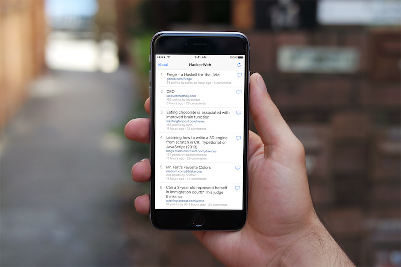
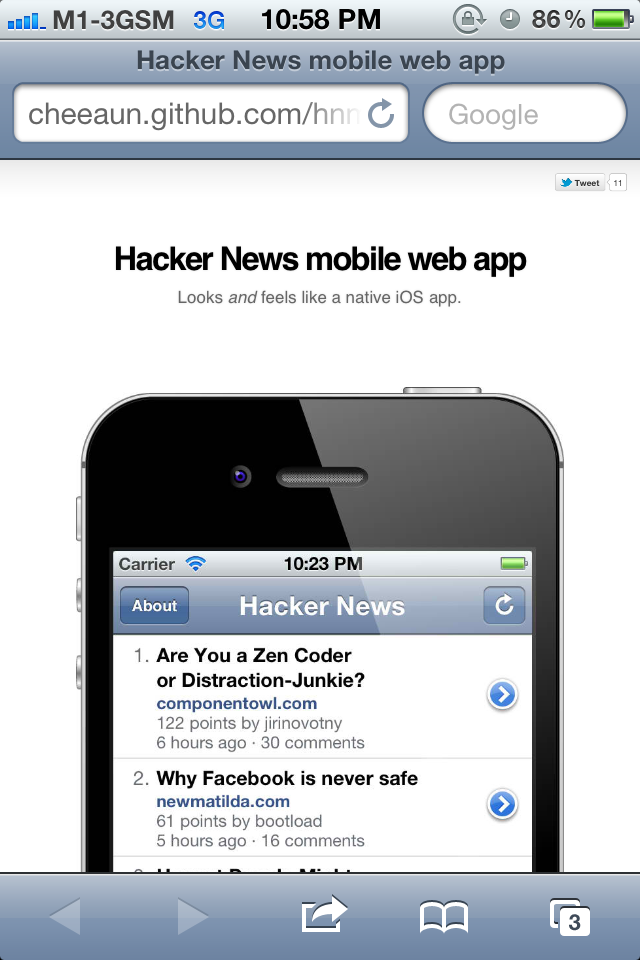
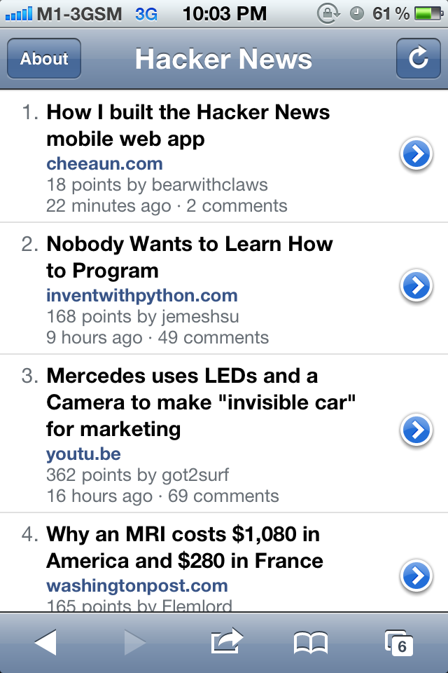
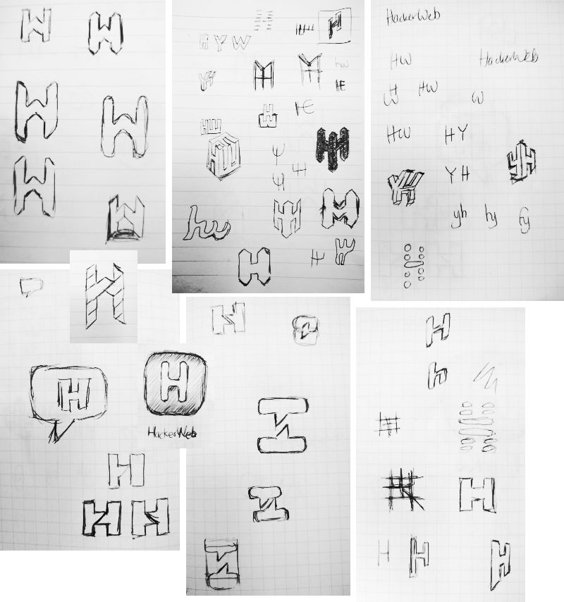
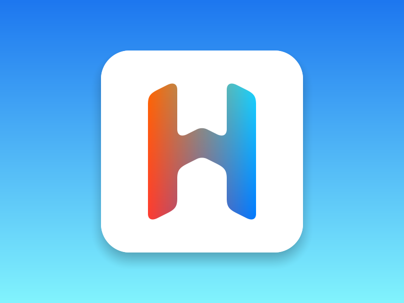
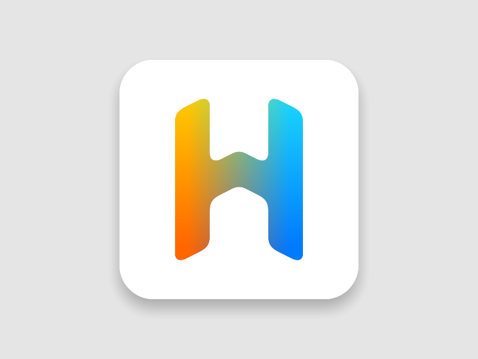
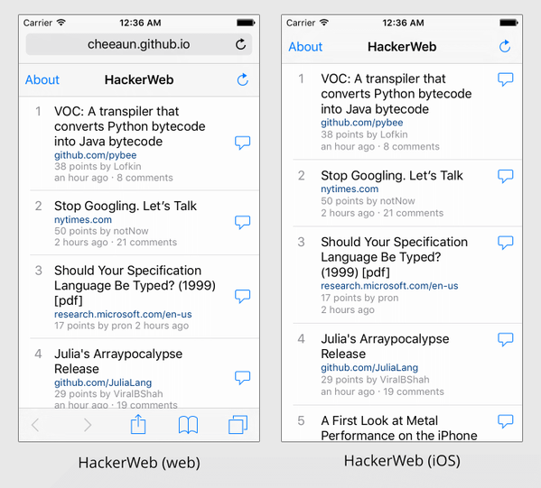
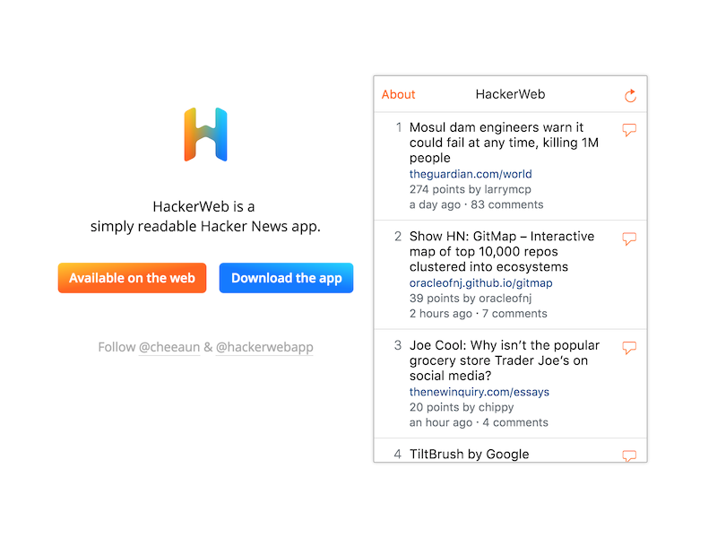
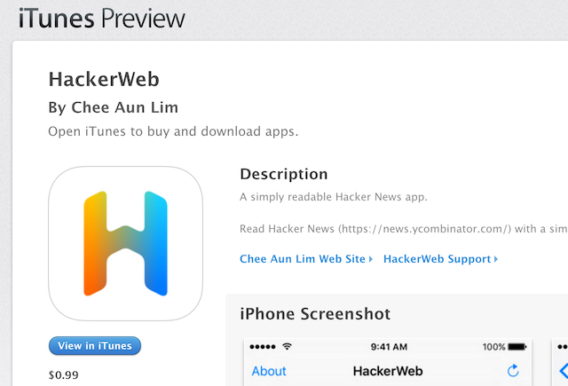

Building HackerWeb for iOS
===

 

[**HackerWeb**](http://hackerwebapp.com/) is one of my most favorite side projects.

It's *yet another* mobile-friendly minimalistic client for [Hacker News](https://news.ycombinator.com/). It's a *web-only* client for the past few years, and now I've built an iOS client, which turns out to be my first ever iOS app publicly [available on the App Store](https://itunes.apple.com/app/hackerweb/id1084209377)! 🚀

The backstory
---

On June 2011, I [made a statement](https://twitter.com/cheeaun/status/82464262156587008):

> Making a web app feels (exactly) like a native app sure takes effort. Still, it's doable.

On October 2011, I [was playing around with `-webkit-overflow-scrolling: touch`](https://twitter.com/cheeaun/status/125548998118490112), introduced with the release of iOS 5.

On Feb 2012, I [released HackerWeb](https://twitter.com/cheeaun/status/170127822818516993) (known as "HNmobile" at that time). I tried to coin the phrase "Looks and feels like a native iOS app" for the *web* app. I believe that HackerWeb is the first ever web app that tries to ambitiously cross the boundary between native and web.

On March 2012, I [wrote](https://twitter.com/cheeaun/status/176294093259948033) an [article on how I built it](/blog/2012/03/how-i-built-hacker-news-mobile-web-app). It [got submitted](https://twitter.com/cheeaun/status/176301483866865664) to [Hacker News](https://news.ycombinator.com/item?id=3662709) and to my surprise, [appeared on the front page](https://twitter.com/cheeaun/status/176308046493003776).

Feedback has been remarkable.

> Behold @cheeaun 's very native looking Hacker News mobile web app. http://cheeaun.github.com/hnmobile/#/
>
> —[SengMin Tan (@sengming)](https://twitter.com/sengming/status/170390232670281728)

>  HN mobile web app http://cheeaun.github.com/hnmobile/landing/ … #hnmobile Now you tell me that a mobile web app can do everything a native app does... as easily!
>
> —[Sebastien Arbogast (@sarbogast)](https://twitter.com/sarbogast/status/176321258277978112)

> Holy shit. A webapp that is better than a lot of native apps: http://cheeaun.github.com/hnmobile/#/
>
> —[Mitchell (@mitchell209)](https://twitter.com/mitchell209/status/176547385655296000)

> Really impressed by @cheeaun's Hacker News mobile web app. Much better than any native clients/the full site on iOS.
>
> —[Nathan Clark (@nthnclrk)](https://twitter.com/nthnclrk/status/176991572578148355)

> This is quite possibly the best iOS web app I've ever used, http://cheeaun.github.com/hnmobile/ it's almost perfect in every way I can think of…
>
> —[Philip (@philo23)](https://twitter.com/philo23/status/178031308042280960)

> This web app feels snappier than every native HN app I've tried. You should give it a try
>
> —[Romain Ruetschi (@_romac)](https://twitter.com/_romac/status/181643344416481280)

> This is THE BEST and ONLY useful way to read Hacker News on an iPhone or iPad. Bookmark.
>
> —[Scott Hanselman (@shanselman)](https://twitter.com/shanselman/status/234657758736158723)

Time goes by as I continue improving the app bit by bit.

Since it's a web app, it auto-updates itself *quietly* and doesn't need uh... much announcements.

- On 26 March 2012, I wrote [a second article](/blog/2012/03/how-i-built-hacker-news-mobile-web-app_26) with more details and examples.
- On 2 June 2012, I made it [work on the iPad](https://twitter.com/cheeaun/status/208902768830853120).
- Around September 2012, I [updated the UI for iOS 6](https://twitter.com/cheeaun/status/249455647458988032).
- On 12 Dec 2012, I [renamed the app to HackerWeb](https://twitter.com/cheeaun/status/278876187634327553).
- On 21 January 2013, I [gave a talk](https://github.com/cheeaun/talks/tree/master/things-learnt-hackerweb) about the things I learnt while building the app.
- On 21 December 2013, I [updated the UI again for iOS 7](https://twitter.com/cheeaun/status/414423892707401728).

Okay, more tweet reviews:

> I use HackerWeb every day, best thing ever.
>
> —[Mario Ricalde (@mario_ricalde)](https://twitter.com/mario_ricalde/status/456159545769742336)

> HackerWeb A simply readable Hacker News web app to bookmark on your mobile phone http://buff.ly/1tLaNwR - and it's open source :)
>
> —[Jacob Shea (@JacobShea)](https://twitter.com/JacobShea/status/459769437328244736)

> Have you guys seen HackerWeb? HackerNews reading pleasure (mobile included)
>
> —[Hugo Bessa (@hugoBessaa)](https://twitter.com/hugoBessaa/status/463476381603889153)

> just discovered #hackerweb today, best mobile experience I've seen so far http://hackerwebapp.com/
>
> —[Vince Mi (@v_mi)](https://twitter.com/v_mi/status/488034079544049665)

Ever since HackerWeb is launched, there's been a few relevant articles and JavaScript libraries popping up on the Internet:

- March 2012 - [Will HTML5 iPhone apps ever cross the Uncanny Valley of Native UI?](http://www.quora.com/Will-HTML5-iPhone-apps-ever-cross-the-Uncanny-Valley-of-Native-UI)
- September 2012 - [10 tips for getting that native iOS feel with PhoneGap](http://www.mikedellanoce.com/2012/09/10-tips-for-getting-that-native-ios.html)
- November 2012 - [Anatomy of a Native Feeling HTML5 iOS App](http://justinvincent.com/page/2043/anatomy-of-a-native-feeling-html5-ios-app)
- December 2012 - [The Making of Fastbook: An HTML5 Love Story](https://www.sencha.com/blog/the-making-of-fastbook-an-html5-love-story/)
- December 2012 - [Junior](http://justspamjustin.github.io/junior/)
- September 2013 - [Cloning the UI of iOS 7 with HTML, CSS and JavaScript](http://come.ninja/2013/cloning-the-ui-of-ios-7-with-html-css-and-javascript/)
- September 2013 - [A Beginner's Guide to Perceived Performance: 4 Ways to Make Your Mobile Site Feel Like a Native App](http://www.mobify.com/blog/beginners-guide-to-perceived-performance/)
- October 2013 - [Ionic Framework](http://ionicframework.com/)
- February 2014 - [Framework7](http://www.idangero.us/framework7/)
- January 2015 - [Native Web Apps](https://blog.andyet.com/2015/01/22/native-web-apps)

...and probably a few more which I've missed.

Obviously at this point, it's clear to say that I'm *quite* obsessed with "native".

When [React Native is announced on January 2015](https://www.youtube.com/watch?v=KVZ-P-ZI6W4), I was super excited and a little sceptical at same time. I gave it a quick try and wasn't really satisfied with it. Perhaps it was too new for me and I didn't *get it* yet.

After [attending ReactEurope](https://twitter.com/cheeaun/status/596304731166744576) on July 2015, I become inspired again to try React Native. It took me few weeks and finally, [the iOS project comes alive](https://twitter.com/cheeaun/status/643438214561275904).

Accepting the challenge
---

Previously, I have to make a web app that *looks* and *feels* like a native app. It was really difficult especially the time when I start doing this with the iOS 5 *skeuomorphic* design. I totally wouldn't recommend trying this for production web sites at all.

This time, I have to make a native app that looks and feels like the **original** web app. I personally find this ironic because it actually comes full circle. I have a feeling that I *need* to prove that it can be done the other way around.

I set a few requirements for my "Minimum Viable Product":

- **New logo**. I've never been satisfied with the old logo. This app needs a new one.

- **No new features**. It needs to be exactly the same as the current web app. There were a lot of new ideas during the building phase, but I manage to get a hold of myself and stick to the end goal 😎

- **Must use [Safari View Controller](https://www.macstories.net/stories/ios-9-and-safari-view-controller-the-future-of-web-views/)**. Technically it's a much better *built-in* browser or in-app web view. It has all the power of Safari, so it shares the same cookies and session as Safari app itself. It's more secure and convenient for users at the same time. The only caveats are the *minimum* iOS 9 requirement and users who prefer other 3rd-party browsers like Chrome.

- **Great performance**. With React Native, I find no difficulty at all to make the app *feels* fast. My concern is a pretty classic problem with every app out there: super long list of items on the screen. The threaded comments interface is pretty challenging especially for Hacker News where the length of a comment text can fill up the whole screen and the nested levels of threads can be quite deep. "Who is hiring?" posts become a different kind of thread where all comments are on the root level and the count can go up to 600 or more.

Designing the logo
---

 

The first logo/icon was designed in 2011. The first 3 iterations feature the letter 'Y' because it matches Hacker News's favicon, which is actually the logo of [Ycombinator](http://www.ycombinator.com/). This 'Y' logo was never meant to be a logo for Hacker News.

Paul Graham [mentioned this before](https://news.ycombinator.com/item?id=4735226):

> The YC logo on HN is not the site's logo; it's a very small banner ad.

However, for the sake of familiarity, most Hacker News apps use 'Y' even though there's no letter 'Y' in the name of the site at all.

So in the 4th iteration, I decided to change the letter to 'H' while [*rebranding* the app](/blog/2012/12/introducing-hackerweb/) as 'HackerWeb'. It's a very simple logo until someone mentioned to me that [it looked too similar](https://twitter.com/kriskhaira/status/278924792969699328) to [Harvest](https://www.getharvest.com/)'s logo. I admit that I didn't put much effort at all in this design iteration and the similarity is purely coincidental.

In the 5th iteration, it's still 'H' with a flatter design, but contains a hidden 'Y' in the orange background (Not sure anyone notice?).

I've done a lot of sketches.

I really like [this one](https://dribbble.com/shots/2163235-An-experimental-icon) as it was inspired by the [Monument Valley](http://www.monumentvalleygame.com/) game.

And then I moved on to [this](https://dribbble.com/shots/2165406-The-new-HackerWeb-iOS-icon):

This design really caught my eye because I was focusing on combining the letter 'H' and 'W' into one. The 'H' is "folded" to form a hidden 'W'. It's both 2D and 3D at the same time depending on how a person look at it. The blue side of the logo looks like a tilted lowercased 'y', which I think is a nice touch.

The colors somehow look a bit "off" so I played around with colors and gradients.

I choose orange and blue. Orange symbolises the web app while blue is for the native app. Right in the middle, it blends together signifying the boundary between web and native. Finally I got to replace the orange background with a white background, which I think is more complementary to the cleanliness and undistracting nature of the app.

The [final winner](https://dribbble.com/shots/2242465-The-new-HackerWeb-iOS-icon-v2) is this:

Building with React Native
---

[React Native](http://facebook.github.io/react-native/) is simply amazing.

Few notes:

- As I'm already familiar with React, it's surprisingly easy to get started with React Native. Everything is still about components, JSX, states and props.
- CSS in JS. Yes, it takes a while to get used to it. In React Native, there's [a limited set of CSS properties](http://facebook.github.io/react-native/docs/style.html) available for styling. [Flexbox](http://facebook.github.io/react-native/docs/flexbox.html) is definitely your best friend.
- There's still [no one true answer](http://facebook.github.io/react-native/docs/navigator-comparison.html) for the navigation system in React Native. There is an [experimental implementation](https://github.com/ericvicenti/navigation-rfc) coming soon. However I prefer using [`NavigatorIOS`](http://facebook.github.io/react-native/docs/navigatorios.html) because it feels *more* native on iOS despite its limited API and occasional bugs.
- [Linking native libraries](http://facebook.github.io/react-native/docs/linking-libraries-ios.html) used to be quite troublesome but it's easier now with [rnpm](https://github.com/rnpm/rnpm) (React Native Package Manager).
- Even though I can `require` or `import` modules, React Native [doesn't run in the Node environment](http://facebook.github.io/react-native/docs/javascript-environment.html#content). For some modules, I'll have to compile them into standalone modules with [Browserify](http://browserify.org/).
- I use [Alt](http://alt.js.org/) for managing data and states.
- [`ListView`](http://facebook.github.io/react-native/docs/listview.html) unfortunately [doesn't work](https://github.com/facebook/react-native/issues/332) like iOS's `UITableView`. It's *slightly* worse in performance when rendering huge lists and doesn't render the rest of the rows until it's scrolled.
- 3D Touch support landed in [version 0.20.0](https://github.com/facebook/react-native/releases/tag/v0.20.0) but I haven't figure out how to integrate it with Safari View Controller, for example when 3D-touching a link.
- There's no `display: inline-block` in React Native. But it's possible to *simulate* it with [some flexbox magic](https://github.com/facebook/react-native/issues/298#issuecomment-86816434).
- Not quite relevant to React Native or React, but I got to say, spread operators and JSX spread attributes are [pretty darn cool](https://twitter.com/cheeaun/status/698505035634733056).
- [`LayoutAnimation`](http://facebook.github.io/react-native/docs/layoutanimation.html) is [simply magical](https://medium.com/@Jpoliachik/react-native-s-layoutanimation-is-awesome-4a4d317afd3e). It's **unbelievable** to see how [a one-liner code](https://twitter.com/cheeaun/status/699444307892113408) can do so much to animate *almost anything* on the screen.

Overall, I'm very impressed with React Native. There were a few small issues once in a while but usually they are fixed in just few days.

I built a few of my own custom components, put together in the [same repository](https://github.com/cheeaun/hackerweb-ios/):

- `LoadingIndicator`, inspired by [react-native-activity-indicator-ios](https://github.com/pwmckenna/react-native-activity-indicator-ios), which is a wrapper for [`ActivityIndicatorIOS`](http://facebook.github.io/react-native/docs/activityindicatorios.html) that fades in after about one second.
- `HTMLView`, inspired by [react-native-htmlview](https://github.com/jsdf/react-native-htmlview), [react-native-htmltext](https://github.com/siuying/react-native-htmltext) and [react-native-html-render](https://github.com/soliury/react-native-html-render), which converts HTML string into *pure* React Native components. For example, it converts a `<pre>` element into a `<ScrollView>` styled with a monospaced font.
- `CacheStore`, inspired by [lscache](https://github.com/pamelafox/lscache), which is a wrapper for [`AsyncStorage`](http://facebook.github.io/react-native/docs/asyncstorage.html) that works like `localStorage` but with key expiration.

When I have the time, I plan to separate them out into individual modules and repositories.

Web and native
---

On 28 September 2015, I posted [a comparison screenshot](https://twitter.com/cheeaun/status/648379573525086208) between the web app and the iOS app:

 

It's beautiful.

It's [a moment](https://twitter.com/cheeaun/status/621679246944043008) when I couldn't even differentiate both of them.

Along the way, I've made a few tiny changes and decisions:

- The comment icon used to be vertically centered in each individual row. I [moved it to the top](https://github.com/cheeaun/hackerweb/commit/1de8929a846d9204327a5035a562808b500d96f0) mainly because I couldn't make it work on React Native 😜. I gave up and fix the icon placement on the web app instead for consistency sake.

- On the web app, if a user long-press on a story link in the list, it will show the iOS Share sheet menu. It's a browser feature. However, I realise that this gesture is not common at all on iOS native apps. I thought of removing this *feature* but decided to keep it and [increase the long-press activation delay](https://github.com/cheeaun/hackerweb-ios/commit/7f5444ee685c13600a5dc4a663213dbd72bf067a) instead.

- Visited story links on the web app are grayed out. Basically, it's just a styling for `:visited` CSS pseudo-class. As a web developer, I've [never thought of it as a "feature"](https://twitter.com/cheeaun/status/622593694038818816) and kind of take it for granted. On the iOS app, I have to *manually* implement this feature and simulate browser history in a *very* simplified way. If only I could use a [*hidden* Safari View Controller](https://library.launchkit.io/how-ios-9-s-safari-view-controller-could-completely-change-your-app-s-onboarding-experience-2bcf2305137f) to check visited links somehow 🤔

- On the iOS app, I decided to *linkify* the commentator username pointing to the profile page on Hacker News, for example, my [profile page](https://news.ycombinator.com/user?id=cheeaun). It simply opens up the Safari View Controller. I've thought of creating a nicer interface for it but feels like over-designing it and perhaps over-engineering it because will need to fetch another API call, etc. After implementing this, I [back-ported](https://github.com/cheeaun/hackerweb/commit/fde086722a598d7a57679198dd4f0c008257dafe) [the change](https://github.com/cheeaun/hackerweb/commit/9ade8b53a5bc2d4197a1dd357337f83c08181e3e) to the web app.

- In the comments view of the iOS app, I [added a 'Share' button](https://github.com/cheeaun/hackerweb-ios/commit/8b6ca264566324f51cb10714b599c0a3c9719568) in the navigation bar. This is not needed on the web app because everything shareable can be triggered by long-pressing. Since long-press gesture is not common for native apps, I add the 'Share' button there.

- For both web and iOS app, there's **no** pull-to-refresh. Technically it's not hard to [implement it](http://facebook.github.io/react-native/docs/refreshcontrol.html) with React Native, yet it's not a natural gesture on web sites. I *choose* not to implement it because there's no reason to do it. Hacker News is not Twitter or Facebook. There's no real-time stories sliding in from the top. I *purposedly* make it difficult to reload the stories. Even if the reload button is tapped, it will fetch from the cache most of the time which will expire in few minutes. It's a bit like I'm helping readers to be *less* obsessive in an unusual way, thus also explains why I limit the number of stories to 60. No more, no less. Done with the stories? Go back to your life 😉

- As of now, there is no visible "integration" between the iOS app and the web app. No [Universal links](https://developer.apple.com/library/ios/documentation/General/Conceptual/AppSearch/UniversalLinks.html). No *jumping* from the web app to the iOS app. If the user shares a story from the Share sheet, the URL points to Hacker News website, **not** the web app. From my point of view, there is no need to *pull* users away from the web app or trying to get more *active* users on my iOS app. I just don't care about the *platform* differences.

Launching on the App Store
---

On 19 February 2016, I [gave out a few TestFlight invites](https://twitter.com/cheeaun/status/700641588041502720) to a number of people, so that I could gather feedback and flesh out the bugs. Surprisingly, most of the feedback are positive and there were no serious bugs.

I *really* need to launch the app on the App Store soon because I've been taking a break since October and stalling the progress for few months. I *accidentally* diverted my attention to my other side projects and fortunately manage to refocus back on this project on [31 January](https://github.com/cheeaun/hackerweb-ios/commit/62359af915d998026838e72e103e26d062f140ac).

I think hard about the pricing of my app. Usually I would make my apps free, but this time, I need to offset the Apple Developer Program membership cost, not to mention all the money I've spent maintaining my [(unofficial) Hacker News API](https://github.com/cheeaun/node-hnapi) since the 2012 [*debut*](https://news.ycombinator.com/item?id=3662709). [Gratipay](https://gratipay.com/~cheeaun/) (previously known as Gittip) [doesn't work for me](https://github.com/cheeaun/hackerweb/commit/50edf474c89ca13e33ac8a64d193532c9c538de7) at all. PayPal.Me doesn't work in Singapore or even any parts of Asia.

I did some research on the pricing of other Hacker News apps and finally decided to just go for minimum pricing (99 cents at this point), judging from the complexity of the app and the fact that it looks **exactly the same** as the current web app now. I don't have to implement a "trial phase" thing or any similar strategies because users can *try* it on the web app itself **before** purchasing.

In the end, this is more like a *small* donation to me, not really a source of revenue or profit.

On 25 February 2016, I submitted the app to the App Store.

I know that the review process would take roughly a week so while waiting, I focus on revamping the [landing page](http://hackerwebapp.com/). I took this chance to rethink of *everything* on the page, like removing all the unnecessary marketing nonsense, removing GitHub links, and just go straight to the point.

Super minimalistic. The preview "image" on the right side is actually the live web app itself contained inside an `iframe`. And I've also included [an easter egg](https://twitter.com/cheeaun/status/705055048045187072) 😁

On 1 March, the review status changed to "In Review". I was [thrilled](https://twitter.com/cheeaun/status/704487865787379712). Then the status changed to "Pending Contract" and I have to sign some contracts. [Stan Chang](https://twitter.com/lxcid) helped me a lot in figuring out all the confusing documents and legalities. After that, it changed to "Ready for Sale" and my first impression was like "Wait, really?". Honestly I was expecting the app to be rejected after hearing those *horror* stories from other iOS developers, but I guess I got lucky(?)

Officially I announce the release of my first iOS app on [Twitter](https://twitter.com/cheeaun/status/704697299922919424) and [Facebook](https://www.facebook.com/cheeaun/posts/10153809554241294) 🚀

 

So this is it. HackerWeb for iOS. Since 2011.

I am deeply grateful to all my long-time loyal users, beta testers, and my friends who supported me. I really appreciate [Paul Irish's compliment](https://twitter.com/paul_irish/status/649491293232480256) and everyone else's because positive feedback is always the reason that kept me going and continue building things. It has always been worth more than any number of downloads or likes or whatever.

I’ll be continuing to work on [my project](https://github.com/cheeaun/hackerweb-ios/) in my spare time and further improve things along the way. [Follow me on Twitter](https://twitter.com/cheeaun) or [@hackerwebapp](https://twitter.com/hackerwebapp) for updates.

**Update 2 May 2016**: [Continue to Part 2, Building HackerWeb for Android.](/blog/2016/05/building-hackerweb-android/)
