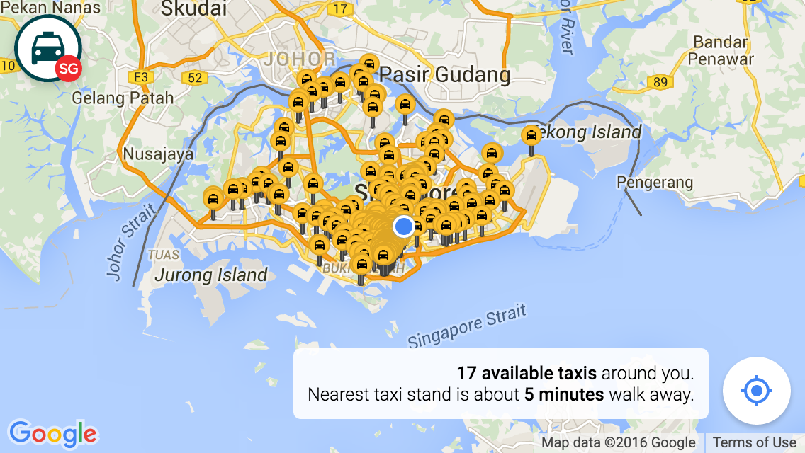
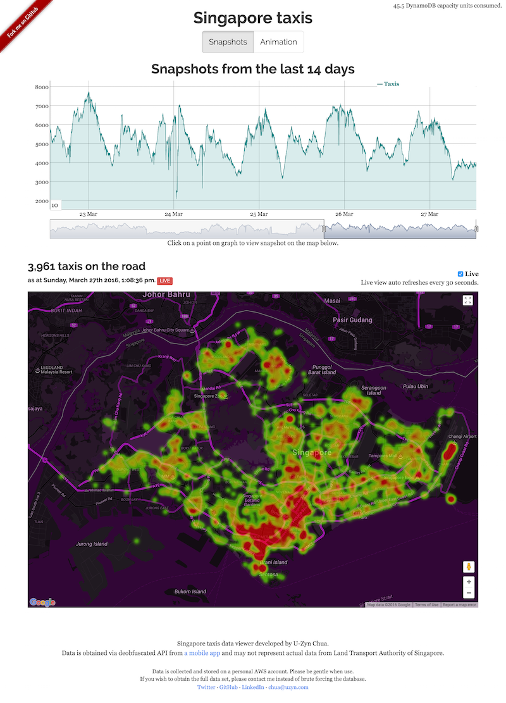
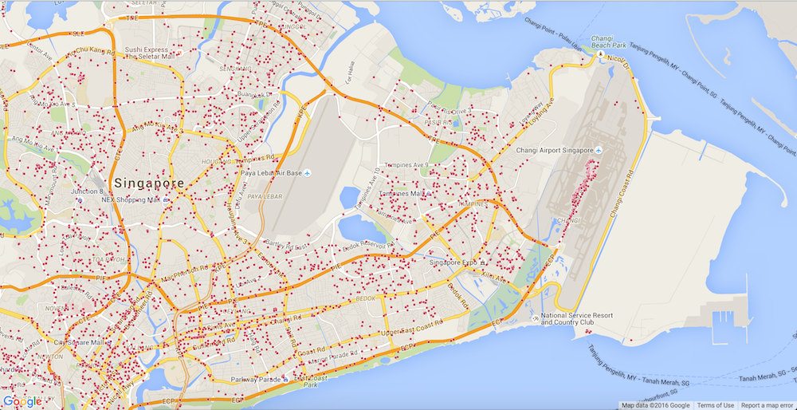
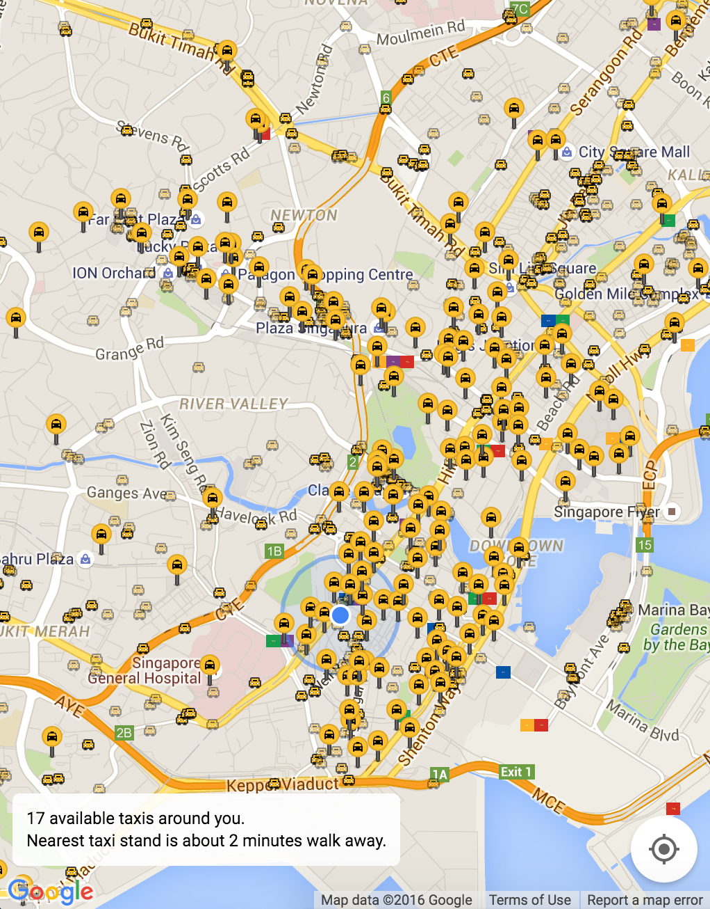
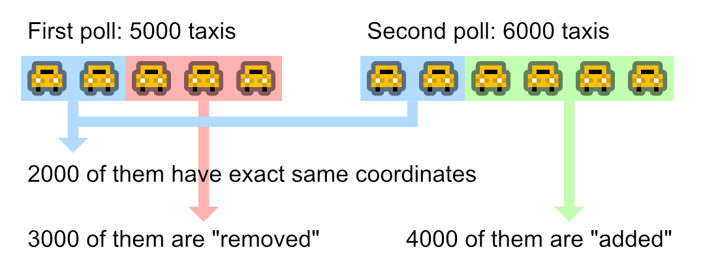
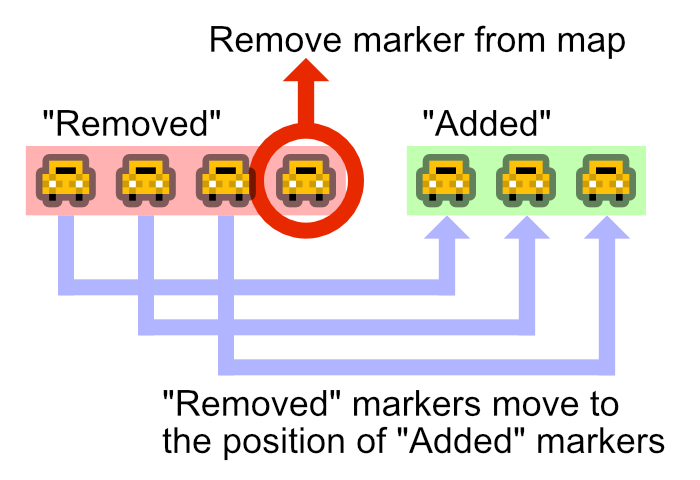
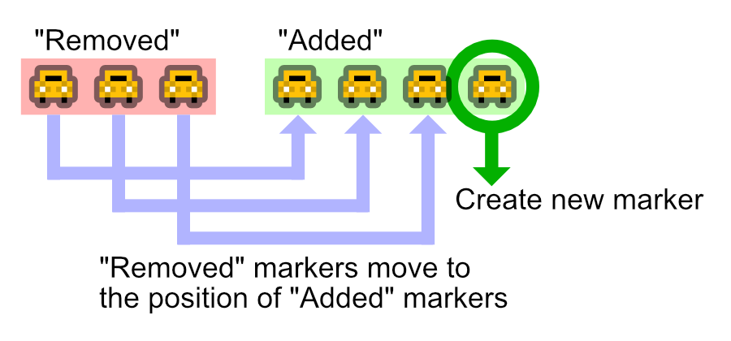
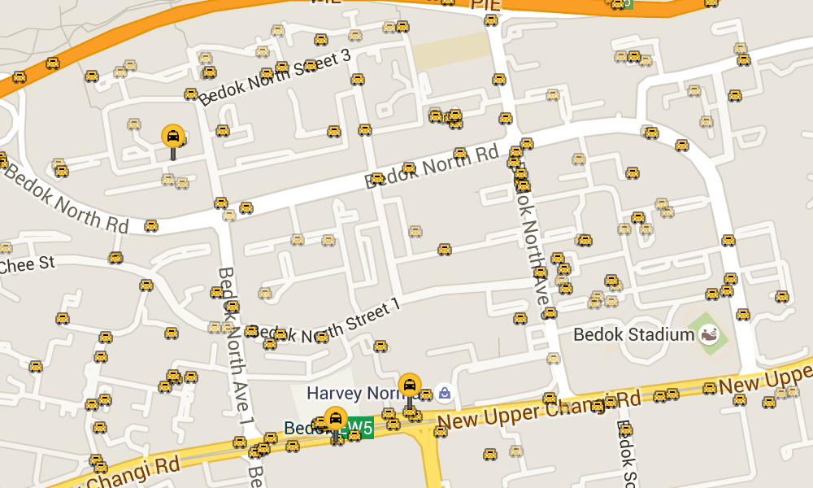
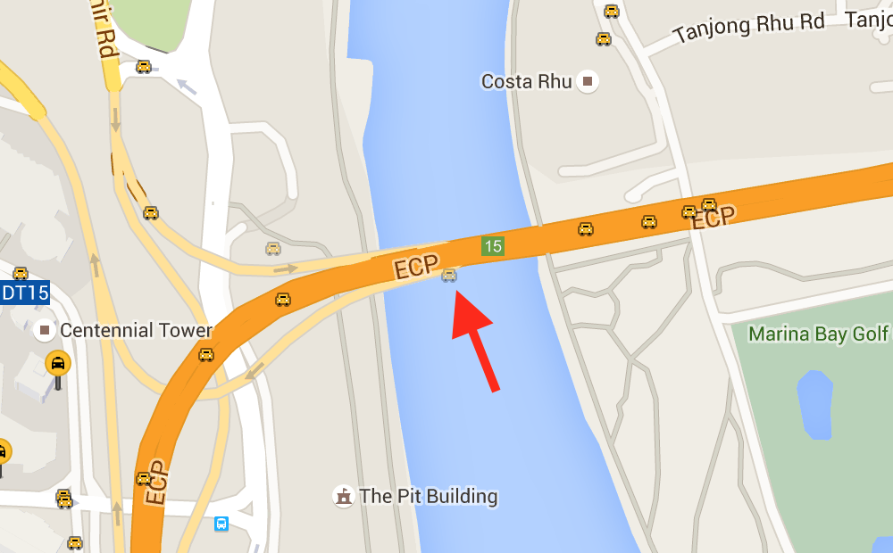
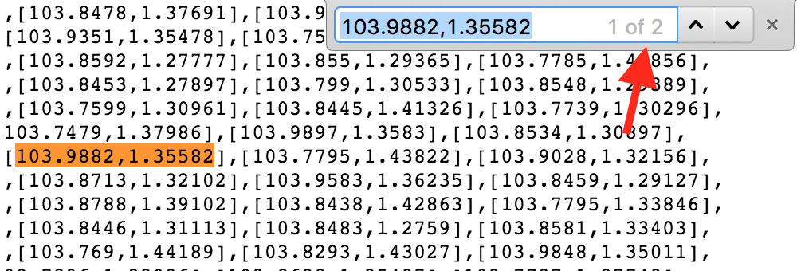

Building TaxiRouter SG
===

For some reason, I check my [GitHub](https://github.com/) news feed regularly and really like to know what my followings are starring, forking, pull-requesting, creating and open-sourcing. It's like Twitter, but for public projects and repositories.

On 18 March 2016, I found that [Kah Wee](https://github.com/kahwee) started watching [U-Zyn Chua](https://github.com/uzyn)'s new repository called [taxisg](https://github.com/uzyn/taxisg). I was curious and clicked to find a really awesome project that [visualizes the Singapore taxi data](http://uzyn.github.io/taxisg/), with snapshots of historical data and live heatmap visualization for thousands of available taxi locations on a map.

U-Zyn also [gave a talk](https://speakerdeck.com/uzyn/uncovering-of-an-obfuscated-public-governmental-api-foss-asia-2016) during the [FOSSASIA 2016](http://2016.fossasia.org/) conference on 18 March, the same day I discovered the project.

Here's a few brief highlights from his talk:

- Taxi-Taxi@SG app by the Land Transport Authority (LTA) is [stunningly pointless](https://www.techinasia.com/taxi-app-singapores-transport-agency-stunningly-pointless), compared to other taxi booking apps.
- Despite its *pointlessness*, the app actually shows **realtime** taxi locations!
- API endpoint hunting begins, with **lots of technical surprises**. (No spoilers here, [check out his slides](https://speakerdeck.com/uzyn/uncovering-of-an-obfuscated-public-governmental-api-foss-asia-2016) which contain very cute photos 😊)
- Data mining begins after that with a few discoveries, for example the airport is always packed and Singapore Zoo (Night Safari) closes at midnight.
- Single-page application front-end with serverless architecture, using [AWS Lambda](https://aws.amazon.com/lambda/) and [Amazon DynamoDB](https://aws.amazon.com/dynamodb/).

Coincidentally, [Data.gov.sg](https://data.gov.sg/) opened up the [same (public) API](https://developers.data.gov.sg/datagovsg-apis/apis/get/transport/taxi-availability) on the same day!

It's **really exciting** to see such awesome realtime data and I just can't stop myself from trying it out. Later in the evening, also on the same day, I experimented with the API and [came up with this](https://twitter.com/cheeaun/status/710841970747252736):

More than **5 thousand markers** are plotted on the map. Auto-refresh every 60 seconds. Pretty mind-blowing.

On the next day, I tried [replaying the markers in a time-lapse fashion](https://twitter.com/cheeaun/status/711155044490420230) and got to say, the dots were [too random](https://twitter.com/lg/status/711232681497858049) to be useful. The API only returns a list of geographical coordinates so I don't know which taxi moves to which position in the next minute. Keep in mind that the list contains only **available** taxis which means that if a taxi is taken, it will disappear from the list. Vice versa, if a taxi drops off a passenger, it will become available and appear again in the list. Even though the API is so-called *realtime*, 60 second interval is not enough to even simulate *movement* of the vehicles on a map.

Instead of *visualizing* the data, I try to see what's the best I could do from the dataset to be at least **useful** for people. Useful in the sense that you could use it while walking on the streets, either as a local or a tourist in Singapore.

I made a decision to build a super simple web app that tells the user **how many** available taxis nearby and where's the **nearest** taxi stand. That's it. It's not a taxi booking app. Instead of the taxi go to you, you go to the taxi. Very classic, right? Well at least now, users can roughly guess where's the "busy" area, avoid them, and figure out where all the other taxis are "hiding".

Designing the markers
---

On 21 March, I continued puting some nice touches on the markers and further [polishing the details](https://twitter.com/cheeaun/status/711725043017854976):

The marker designs went through a few short iterations as I keep trying out different colors and styles. They have to work well with the default tiles styling of Google Maps. They have to look *familiar* as in yellow being a recognizable color for taxis, even though [taxis in Singapore](https://en.wikipedia.org/wiki/Taxicabs_of_Singapore) are also painted in red, blue, brown, silver, copper, black and white. The taxi and taxi stand have to look different while having the taxi glyph in them.

I started with simple circles, which later I find them too plain and *static*. The taxi markers are *dynamic* and constantly on the move. A plain circle simply doesn't cut it.

So I decided that a taxi marker has to look like a taxi, which is more straight-to-the-point and hopefully shows that it's a *moving* target. I did a quick pixel art of the front view of a taxi vehicle, with a dark outline, so that there's more contrast, especially where a lot of taxis flock together in the same spot. I tweaked the outline opacity a few times until I get the right balance, roughly based on how the taxis flock together on the map. I've also tried making the headlights more visible within the yellow background of the car, by introducing a few artifacts around them.

The fourth icon, with black-colored taxi and yellow background, was meant to be a taxi stand, purposely designed to have inversed colors from the taxi icon. I tried plotting it on Google Maps and found it really difficult to differentiate between the taxi and the stand.

I ended up making the taxi stand to look like, again, a taxi stand. It's way bigger than a taxi marker, with the anchor point at the bottom center. It's a non-moving target, so making it look like a pin makes sense. I use the taxi icon from Google's [Material icons](https://design.google.com/icons/), which is also used as the logo of the site.

Getting rid of flicker
---

During the first phase of development, the app basically fetches the API response and draw all the thousands of markers with the [Google Maps JavaScript API](https://developers.google.com/maps/documentation/javascript/). The polling happens every minute and each time, it will fetch the API response again, destroy all markers and redraw them again. It results in flickering of markers, which they disappears briefly and reappears again. Kind of jarring and *feels* slow.

I use the Google Maps Javascript API a lot in my past projects. The usual solution for "[Too Many Markers](https://developers.google.com/maps/articles/toomanymarkers)" problem is always *not* displaying all of them at once.

This time, I'm taking the plunge and try to somehow work things out. 5000+ markers on the map, every minute, without flickering.

The **first step** is to compare the differences between the current list of coordinates and the subsequent list. Technically speaking, just `diff` it.

Let's say the first poll contains 5000 taxis and next poll contains 6000. At this point, 5000 markers are already drawn on the map. Now I need to see the next list of coordinates and check if some of the coordinates are *changed* from the first list.

At first, I was expecting that the chances of taxis staying at the same coordinates would be very, very low. It turns out that, during my first attempt, there was about 2000 taxis out of 5000 that **did not move from their location** at all! I'm not even *intelligently* comparing the coordinates, just a basic strict comparison of exact latitudes and longitudes. Eventually, I could leave the 2000 markers untouched and only operate on the changed ones.

I separate the changed markers into two buckets: "removed" and "added".

The **second step** is to deal with the "removed" markers. If the number of "removed" markers is more than "added" ones, the code will simply remove the markers from the map, which hopefully could reduce memory usage in the browser.

If the number of  "added" markers is more than "removed", the code will create new markers and plot them on the map.

The **third step** now is to reset the "removed" markers' positions to the coordinates of the "added" markers. I think here is the *magical* part which prevents the flickering problem. Instead of removing and readding markers, I basically "reuse" the existing markers.

Mission accomplished.

Observing the data
---

After fixing the flickering problem, the stationary taxis count really caught my attention. I **purposely** render them differently by fading out the markers, with 50% opacity, trying to figure out *more* details. Why are they stationary and not moving at all after 60 seconds?

Few possible reasons that I could think of:

- The taxi drivers are waiting for their passengers in the parking lot.
- They left the car parked and went for lunch or dinner.
- They are stuck in a heavy traffic.
- They are waiting in line at the taxi stand.
- They forgot to turn off their GPS device or something.
- Their GPS device doesn't update every 60 seconds, but probably longer than that.
- They got into an accident?

Anyway, I don't really have the final answer.

Oh yeah, I couldn't help myself noticing this one taxi being stuck on the ECP (East Coast Parkway) highway bridge. It's been stationary there for like few days now:

There is one more interesting surprise in the dataset. Sometimes, the response contains **two** exactly same coordinates in the list. It's usually around *five* pairs of same coordinates per request. I don't quite understand why, but I guess, either the taxis are *very* near to one another, or they just overlap on top of each other.

¯\\\_(ツ)\_/¯

The launch
---

On 24 March 2016, 6 days after inception, I [launched TaxiRouter SG](https://twitter.com/cheeaun/status/712809348230066176) [to the public](https://www.facebook.com/cheeaun/posts/10153872232651294). It's [open-sourced on GitHub](https://github.com/cheeaun/taxirouter-sg) and even has its [own Twitter account](https://twitter.com/taxiroutersg).

Overall, it took me 7 days from idea to launch, which I'm quite surprised myself. I hope that this app would be useful for everyone, including locals and tourists. Any feedback is [always welcomed](https://twitter.com/cheeaun).

TaxiRouter SG now joins my *collection* of public transportation apps for Singapore, with the almighty [BusRouter SG](https://busrouter.sg/) and the [quite-recently-launched](https://twitter.com/cheeaun/status/687826686625198080) [RailRouter SG](https://railrouter.sg/).

[As tweeted](https://twitter.com/sayanee_/status/712866961370308608) by Sayanee:

> [@_fadhli](https://twitter.com/_fadhli) how can we go around Singapore effectively without [@cheeaun](https://twitter.com/cheeaun)'s apps? 🤗 🚆 🚔 🚌

Exactly.
