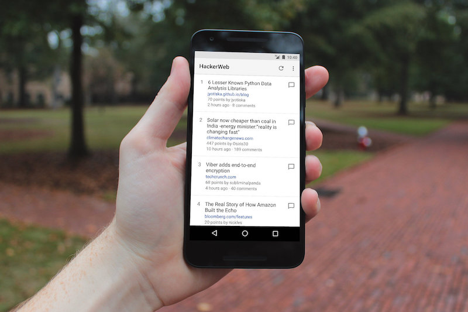
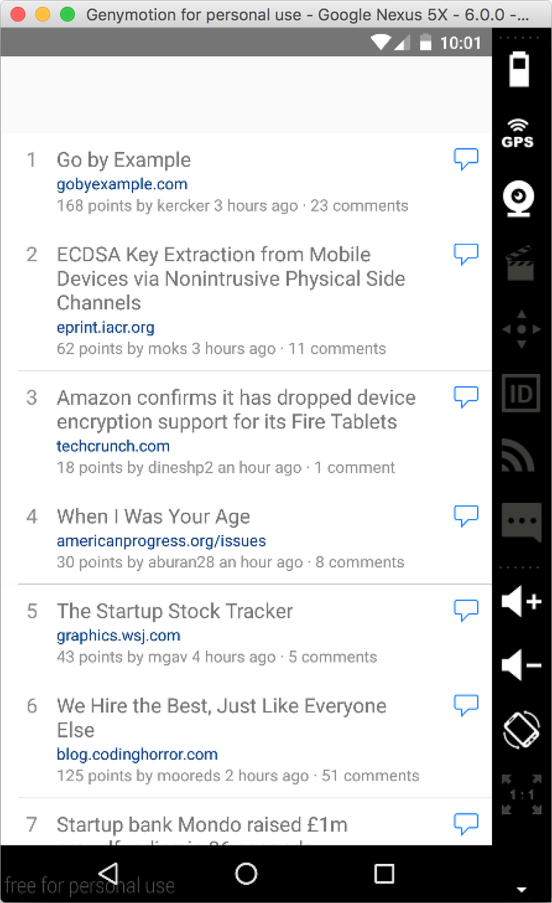
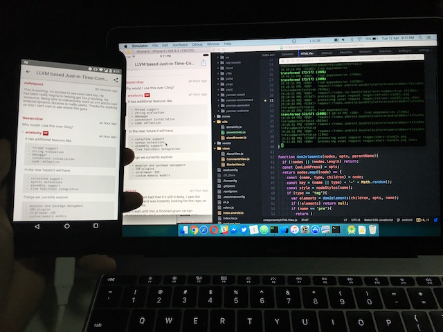
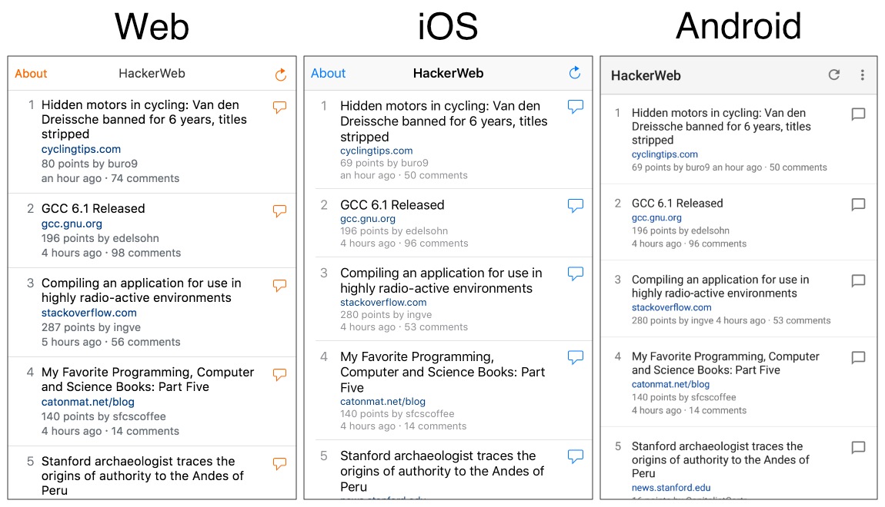
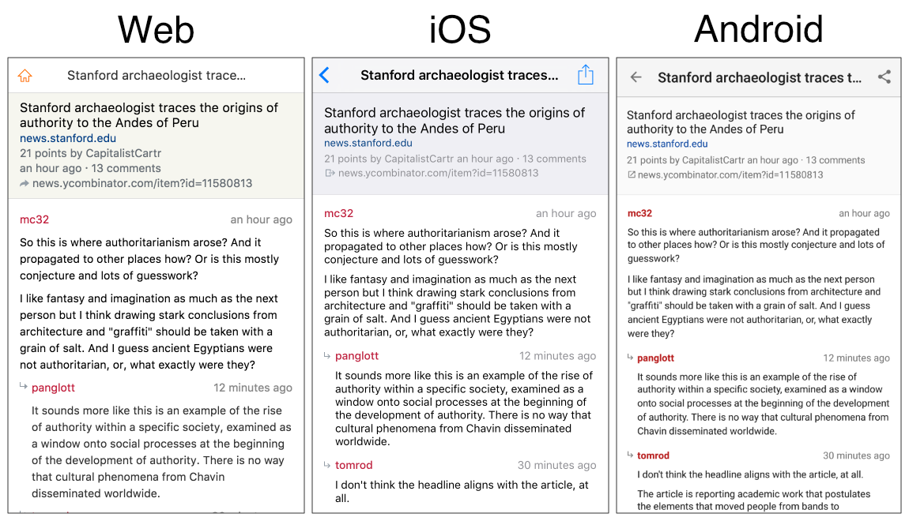
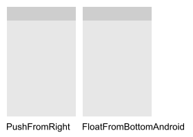
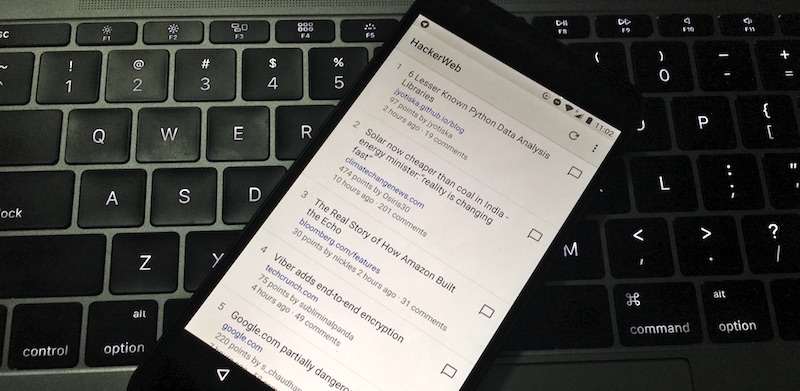

Building HackerWeb for Android
===

On [March 1](https://twitter.com/cheeaun/status/704697299922919424), I [introduced HackerWeb for iOS](http://cheeaun.com/blog/2016/03/building-hackerweb-ios/). It was *briefly* featured on [Product Hunt,](https://www.producthunt.com/tech/hackerweb) [React Native Community Facebook Group](https://www.facebook.com/groups/react.native.community/permalink/730638060405108/), [Tech In Asia](https://www.techinasia.com/talk/building-hackerweb-ios), and even listed on the [React Native Showcase](http://facebook.github.io/react-native/showcase.html) page.

As always, I love good feedbacks:

> Enjoying Hackerweb an iOS Hacker News client by @cheeaun.
>
> —[Fadhli Rahim](https://twitter.com/_fadhli/status/704835167005704193)

> HackerWeb by @cheeaun is on the App Store… Classy way to, err, read Hacker News. Solves 1st world problems, etc etc
>
> —[Chu Yeow](https://twitter.com/chuyeow/status/704858962374430722)

> As a beta user of @hackerwebapp Hacker News Reader on iOS, it’s definitely worth the dollar. Great job @cheeaun :-)
>
> —[Jin](https://twitter.com/jin_/status/704949161540657153)

> Love this! “…I limit the number of stories to 60. No more, no less. Done with the stories? Go back to your life 😉”
>
> —[Dominic Ee](https://twitter.com/dominic/status/707775108614467584)

> Kudos to @cheeaun for building the elegant HackerWeb app and documenting the process behind it
>
> —[Michael Donohoe](https://twitter.com/donohoe/status/707919680976130050)

50 days later, after [51 commits, 82 changed files with 1,323 additions and 336 deletions](https://github.com/cheeaun/hackerweb-native/compare/50116220e7fed04f3bbca808570ca2498065c939...1b5da7cc1be66ba92a19a78e77b6bae49f167b4e), I released HackerWeb for Android.

A slow start
---

At first, I have no serious plans on porting the app to Android at all. Two days after the iOS launch, I was kind of curious and want to try out how easy it is to run a React Native app on the Android emulator. I mean, if [Facebook can do it](https://code.facebook.com/posts/1189117404435352/react-native-for-android-how-we-built-the-first-cross-platform-react-native-app/), why not give it a try myself?

It was [mind-blowing](https://twitter.com/cheeaun/status/705770568696500225). I totally did not expect that with just few lines of code changes, the whole app is *almost* visually done.

The screenshot shows a straight port of the iOS app running on the Genymotion Android emulator. The navigation bar is missing because [`NavigatorIOS`](http://facebook.github.io/react-native/docs/navigatorios.html#content) doesn't work there and I didn't even bother adding the cross-platform [`Navigator`](http://facebook.github.io/react-native/docs/navigator.html#content) component yet.

Honestly, I wasn't too confident with the port because about a month ago, React Native has a known issue with [getting Android to feature parity with iOS](https://productpains.com/post/react-native/get-android-to-feature-parity-with-ios) (now fixed in version 0.24.0).

In fact, my main issue is actually the Android emulator itself which I always find it **very** slow. I remember the first time I was trying it out, it took me more than an hour to set up the emulator. Until [Genymotion](https://www.genymotion.com/) comes along which makes things *much* faster, though it [doesn't support HiDPI displays](https://twitter.com/cheeaun/status/705748310087192576) yet. On April 7, [Android Studio 2.0](http://android-developers.blogspot.sg/2016/04/android-studio-2-0.html) was released with a super fast Android emulator, which is finally good news for me! However, the new emulator [uses too much CPU resources](https://twitter.com/cheeaun/status/719135623685144576), so I end up running the app [on my Nexus 5X phone instead](https://twitter.com/cheeaun/status/719876657838841862).

One stupid bug
---

For quite a long time, I was stuck with one very stupid bug that is trapped inside an unhandled `Promise` rejection or something like that. I couldn't trace where the error comes from, and my first suspicion is that it's a bug in React Native itself.

When the app is loaded in the emulator, the stories list loads once and permanently shows an error in subsequent reloads. When I enable `Debug in Chrome` from the developer menu, everything starts to work perfectly for some weird reason. When I disable `Debug in Chrome`, the bug comes back again!

So on one fine day, **April 9**, to be exact, I took few hours, painstakingly tracing the errors and **finally** found it.

This:

    this.state = {
      visited: links.includes(data.url),
    };

It turns out that [`Array.prototype.includes`](https://developer.mozilla.org/en-US/docs/Web/JavaScript/Reference/Global_Objects/Array/includes) doesn't work! Wait, it works fine on the iOS app but not Android?

I immediately read through the [documentation](http://facebook.github.io/react-native/docs/javascript-environment.html) and it mentioned:

> When using React Native, you're going to be running your JavaScript code in two environments:
>
> - On iOS simulators and devices, Android emulators and devices React Native uses [JavaScriptCore](http://trac.webkit.org/wiki/JavaScriptCore) which is the JavaScript engine that powers Safari. On iOS JSC doesn't use JIT due to the absence of writable executable memory in iOS apps.
> - When using Chrome debugging, it runs all the JavaScript code within Chrome itself and communicates with native code via WebSocket. So you are using [V8](https://code.google.com/p/v8/).
>
> While both environments are very similar, you may end up hitting some inconsistencies. We're likely going to experiment with other JS engines in the future, so it's best to avoid relying on specifics of any runtime.

For some reason, the JavaScript engine in iOS supports `Array.prototype.includes` but **not** the one in Android. The app works when debugging in Chrome because Chrome's JavaScript engine supports this method.

Immediately I fixed the bug, for [three](https://github.com/cheeaun/hackerweb-native/commit/a1cbd0c39dc5ab3b7c25d8dd245dc6ac36b6aaf3) [fricking](https://github.com/cheeaun/hackerweb-native/commit/94b3ee310641af8dbdfe4df5346c7014585bb7fb) [times](https://github.com/cheeaun/hackerweb-native/commit/1fb3d25d84c4f0eb0df1b65e330c240bcbf44577).

Ever since then, my life has changed for the better.

UI and colors
---

When I build HackerWeb in [2012](http://cheeaun.com/blog/2012/03/how-i-built-hacker-news-mobile-web-app/), I focus **primarily** on the iOS interface design, which later I came up with a more generic 'Web' theme. The Web theme applies to all browsers *except* Mobile Safari, where the iOS theme kicks in. HackerWeb for iOS simply uses the web app's iOS theme.

So far I've never made an Android theme for the web app, so I'll have to make one for the Android app. At this point, it's pretty obvious that [Google's Material Design](https://www.google.com/design/spec/material-design/introduction.html) is the right path to take.

Material design's [color palette](https://www.google.com/design/spec/style/color.html), [measurements](https://www.google.com/design/spec/layout/units-measurements.html), and [icons](https://design.google.com/icons/) are very helpful for me.

One of the very first thing that I have to decide on "materialising" the app interface is the (accent) color of the top navigation bar or so-called "App bar" combined with the status bar. Most Android apps have vibrantly-colored app bars, which I personally find very distracting.

The specifications [says](https://www.google.com/design/spec/style/color.html):

> Material takes cues from contemporary architecture, road signs, pavement marking tape, and athletic courts. Color should be unexpected and vibrant.

For HackerWeb, the *accent* color would probably be either orange or blue. However, I strayed away and decided to use the [Light theme](https://www.google.com/design/spec/style/color.html#color-themes) with a light-colored App bar which is less distracting and a better fit for the nature of the app.

By default, Android always render the system status icons as white, which wouldn't work well at all with a light gray (`#E0E0E0`) background. To change the color to semitransparent black, I have to [configure an additional `windowLightStatusBar` setting](https://plus.google.com/+RomanNurik/posts/4WBSonAZxt1) which only works for Android Marshmallow (6.0) and above. For any versions before Marshmallow, I make it fallback to whatever the default color is.

Navigational transitions
---

The second thing that I need to change is the transition animation between views, for example, clicking the comment button in Stories view goes to the Comments view. By default, the [scene animation](http://facebook.github.io/react-native/docs/navigator.html#configurescene) used in `Navigator` is `Navigator.SceneConfigs.PushFromRight`, which *pushes* the old view away and *slides* in the new view from the right side. This animation is *not quite* native on Android unfortunately.

According to Material Design patterns on [Navigational transitions](https://www.google.com/design/spec/patterns/navigational-transitions.html), this is referred as a 'Parent to child' transition with the focus on 'Elevation and expansion':

> The surface that the user touches should lift up and expand into place from its origin. This expansion and motion highlights movement away from the parent towards a destination (a child element) in a natural movement using the material motion curve.

 

Honestly I'm not sure how to implement such *advanced* transition on React Native yet. So I opted for a **simpler** option, for now, `FloatFromBottomAndroid`, which is kind of like the *standard* animation in a few Android apps I've tried. It *floats* on top of the view and fades in to the top.

More Materials
---

I spent most of my time adjusting the spacings to match the baseline grid and using the right colors. There were a few tiny adjustments and concerns that differ from the iOS app.

- [Material design spec](https://www.google.com/design/spec/style/typography.html) didn't mention anything about fixed-width typography, so I use the "monospace" value in the stylesheet, which looks like 'Courier' font if I'm not mistaken. On the iOS app, 'Menlo' font is used.
- [Material design spec](https://www.google.com/design/spec/layout/metrics-keylines.html) did mention vertical spacings for fixed-height list items. The story rows on HackerWeb's Stories view **don't** have fixed heights because I don't truncate the story title when it's too long. The spec says `72dp` for the height of a list item and `16dp` for the horizontal margins. In CSS terms, I set `padding-left` and `padding-right` to `16px` but I have no idea how much to set for `padding-top` and `padding-bottom`.
- The spec on [Product icons](https://www.google.com/design/spec/style/icons.html#icons-product-icons) mentions a lot on the visual proportions, shadows, lightings, tints and shades. HackerWeb's app icon follows these "rules" and now looks *smaller* than the other Android apps because they don't follow the "rules". I was thinking of adding a shaded edge but most of the other app icons use drop shadows. In the end, I gave up and apply none of them 😅
- On the Web and iOS version of HackerWeb, the 'About' button is on the left side of the navigation bar. On the Android app, I moved it into the action overflow menu (button with 3 dots).

React Native awesomeness
---

- On April 3, I released [`react-native-cache-store`](https://github.com/cheeaun/react-native-cache-store) as an [NPM package](https://www.npmjs.com/package/react-native-cache-store). It's a `localStorage`-like wrapper around React Native's `AsyncStorage` with cache expiration, fully inspired by Pamela Fox's [lscache](https://github.com/pamelafox/lscache). It's not very well-tested for now, as it's my first time trying out [Jest](https://facebook.github.io/jest/) for unit testing.
- I use [`react-native-android-share`](https://github.com/haydenth/react-native-android-share) for sharing, because there's no [`ActionSheetIOS`](http://facebook.github.io/react-native/docs/actionsheetios.html#content) for Android, yet.
- I also use [`react-native-chrome-custom-tabs`](https://github.com/dstaley/react-native-chrome-custom-tabs), a wrapper around [Chrome Custom Tabs](https://developer.chrome.com/multidevice/android/customtabs) which surprisringly works like iOS's Safari View Controller. It's probably better than Safari View Controller because I can set it to prefetch the story URL by calling `mayLaunchUrl` if the user opens the Comments view.
- Besides using the `Navigator` component for navigation, I also have to use the [`BackAndroid`](http://facebook.github.io/react-native/docs/backandroid.html#content) component to detect the "hardware" back button and allow users to navigate back to the previous view.
- `TouchableOpacity` and `TouchableHighlight` components are not native anymore on Android, so I have to change most of them to [`TouchableNativeFeedback,`](http://facebook.github.io/react-native/docs/touchablenativefeedback.html) which shows the pretty neat [Touch Ripple](https://www.google.com/design/spec/animation/responsive-interaction.html#responsive-interaction-surface-reaction) effect.

It's been a pretty good experience as I spend most of my time on the presentation layer rather than the logic parts of the app. Comments collapsing works. Long-pressing works. Data management with [Alt](http://alt.js.org/) works. As I'm convinced that the 'Live Reload' feature in React Native is so fast and awesome, [development got **even faster**](https://twitter.com/cheeaun/status/719142803293351936) with [Hot Reloading](https://facebook.github.io/react-native/blog/2016/03/24/introducing-hot-reloading.html) landed in version 0.22.0.

Before I knew it, the app is production-ready and waiting to be published to Google Play!

Launching on Google Play
---

Before publishing, I followed *all* the instructions on [generating a signed APK](http://facebook.github.io/react-native/docs/signed-apk-android.html). Very helpful and a bit confusing sometimes. Unlike using Xcode, I don't need to always set the 'scheme' from `Debug` to `Release` because the command `./gradlew assembleRelease` will automatically create an APK file with debugging turned off. Running the release build on my Nexus phone is pretty easy, though sometimes when I get installation errors, I'll need to uninstall the app first before installing.

To record my iPhone 6S screen, I can use QuickTime on my MacBook. But for my Nexus 5X, I use a super simple screenshot/recording tool called [Android tool](https://github.com/mortenjust/androidtool-mac) (yeap, very generic name). After recording, I'll use [CloudConvert](https://cloudconvert.com/) to convert it to an animated GIF, with reduced resolution and lowered to usually 15 FPS. When I'm tweeting the video, I use [Slow Fast Slow](https://itunes.apple.com/us/app/slow-fast-slow-control-speed/id727309825?mt=8) to speed up and shorten the video length to satisfy Twitter's video upload criterias.

On April 19, I fiddled around the Google Play Developer Console and [set up Alpha testing](https://twitter.com/cheeaun/status/722445719139823616) for HackerWeb. I don't know why I choose Alpha testing instead of Beta testing. To be honest, I have no clue why there are two 'stages' of testing at all. One thing I find really cool is that as I set the minimum SDK version to 23 (6.0), the Console can tell me that there are 428 supported Android devices. Later I realised some users are still using older versions, so I reduced the minimum SDK version to 21 (5.x) and the Console shows me 2554 supported devices. Neat.

A day later, I officially announce the release of my first Android app on [Twitter](https://twitter.com/cheeaun/status/722800946053394433) and [Facebook](https://www.facebook.com/cheeaun/posts/10153949800466294) 🚀

Now that HackerWeb is available on both iOS and Android, it's quite clear for me to [rename the repository 'hackerweb-ios' to 'hackerweb-native'](https://twitter.com/cheeaun/status/722812442586165248), basically *borrowing* the word 'native' from, well, React **Native**. I don't have to worry about broken links because [GitHub will automatically redirect to the new name](https://help.github.com/articles/renaming-a-repository/).

This has been a surprisingly interesting and unbelievable experience for me because everything seems to happen so fast. I believe '[Cross-stack engineering](https://twitter.com/cheeaun/status/702328068774318080)' will be the next big thing and React Native provides an opportunity for everyone.

Thanks again to all my users, testers and friends. [Stay tuned](https://github.com/cheeaun/hackerweb-native). [Follow me on Twitter](https://twitter.com/cheeaun) or [@hackerwebapp](https://twitter.com/hackerwebapp) for updates.
