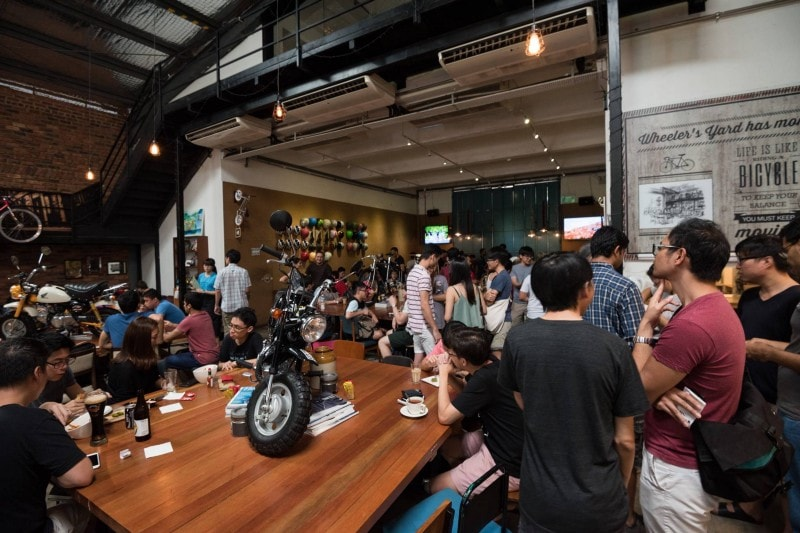

The story of Geek Brunch Singapore
===

Last month, on April 30th, we had our [4th Geek Brunch](https://www.facebook.com/events/883049111807282/) event at [Wheeler’s Yard](http://wheelersyard.com/). It was a blast and definitely the largest gathering we’ve ever had!

[**Geek Brunch**](https://geekbrunch.sg) is a biannual social gathering of geeks — **engineers, makers and designers** — inviting and welcoming **anyone** curious to know more about this brilliant community. Most importantly, as [confirmed by the community](https://www.facebook.com/events/883049111807282/permalink/899784046800455/), it is about **making new friends and having fun! 👫👬👭**

At this point, we think that it would be great to go down memory lane and look back since the first Geek Brunch and see how we got here.

Geek Brunch #1 — March 1st, 2014
---

[Group photo](https://www.facebook.com/photo.php?fbid=10152236004722229&set=a.475431307228.261529.503517228&type=3&theater&__mref=message) at Chye Seng Huat Hardware Cafe.

The initial idea was to have a social gathering as a way of celebrating [WeBuild Live Podcast’s recording of *Tim Oxley*](https://live.webuild.sg/013-tim-oxley/). So *Michael Cheng* initiated a Facebook event and *spammed* a bunch of his friends in the tech scene. We did it in the name of [WeBuild.SG](http://webuild.sg/) to gather all the friends of *Tim Oxley* and mostly an *excuse* to have some hipster brunch and coffee at [Chye Seng Huat Hardware Cafe](https://www.facebook.com/ChyeSengHuatHardware) (CSHH).

The response was very good. It was spontaneous, very casual and a meetup of friends and common friends.

Then the day rolled along. We listened to the live recording of the podcast. At the end of the recording, the podcast hosts announced that we’ll be meeting up for brunch at CSHH in the afternoon.

At first, we took up just a few tables. As more came in, we started taking up *more* tables in the courtyard. Eventually, we had a turnout of about 20 geeks and our table had grown into a sprawling T-shape occupying half of the courtyard. This wasn’t the first gathering of geeks for brunch in CSHH, but the social network effect of so many connectors coming for the event (eg. *Sayanee*, *Michael Cheng*, *Tim Oxley*, *Chinmay*, [*Lu Wei*](https://twitter.com/luweidewei), and [*Roland Turner*](http://rolandturner.com/)) lead to a certain tipping point. We met some new people as well as familiar faces on Twitter, Facebook and Github. For example, *Michael Cheng* met *Raman Shalupau* there for the first time in person!

Right around the same time, another frequent monthly cafe-hopping group was also forming up. It’s [KopiJS](http://kopijs.org/) by *Lim Chee Aun*. Little did we know that a couple of years later, due to the synergy and similar goals of geekiness, friendship and fun, we will come to organise a huge Geek Brunch together.

*Roland* acting surprised at the camera, *Raman* checking his fingernails 💁, and *Sebastiaan* demonstrating how to type with the keyboard up-side-down.

*Loong Jin*, *Alyssa* and *Wei* pretending to listen to *Tim Oxley* as they were mesmerized by his long silky hair.

[**More photos here!**](https://www.flickr.com/photos/miccheng/sets/72157667899701881/)

Geek Brunch #2 — October 4th, 2014
---

Group photo at Wheeler’s yard. *Sayanee* pointing at herself instead of the Batman logo. 👉💁

It’s been few months since then and we (*Sayanee* and *Michael*) were itching for another gathering of geeks for brunch. So we created another event on Facebook. This time, the RSVP numbers were too high for CSHH to accommodate. We had about 80+ RSVPs. A good problem to have by any measure.

So the search was on for a new location for Geek Brunch #2. Through our search on the lazy web and online, we found a cafe called Wheeler’s Yard. It has been around for a year at the time and received good reviews from bloggers. Additionally, it was big enough to accommodate more than 50 people.

We decided to just go and occupy the tables organically and spontaneously as we did in Geek Brunch #1. Turned out that it wasn’t a good idea as the tables were not movable. And we risked having too many separate pockets of people. Fortunately for us, our friend [*Hisham*](https://twitter.com/mhisham) (a blogger that *Sayanee*, *Chinmay* and *Michael* knew from the [Ping.SG](http://ping.sg/) blogging days) reached there much too early and he managed to tell the service staff about the in-bound horde of caffeine-deprived geeks.

They reserved a couple of tables for us.

As per the first Geek Brunch, people slowly trickled in. Slowly and organically, we occupied table after table. Eventually we colonized an L-shaped area in the cafe. It was quite awkward when we decided to do a group photo later because the central table had other diners as well 😅

Sometimes the discussion can get quite sleepy and serious at the same time. 😪😠

Conversation goes on and on, outside the cafe, with bikes. We Build SG sticker spotted on *Mugunth*’s shirt.

Look at that smile. And red shirts.

Some of us went for a Geek Brunch [“after-party”](https://www.facebook.com/photo.php?fbid=10152790206707229&set=a.10152789816567229&type=3&theater) at the Papa Shop.

*Lakshan* showing off his beer-drinking skills. *Audrey*, on the left, showing her non-beer-drinking skills.

[**More photos!**](https://www.flickr.com/photos/miccheng/sets/72157668038467516/)

Geek Brunch #3 — November 28th, 2015
---

Group photo at Wheeler’s Yard. Look at all the new faces! 😍

*Sayanee* and *Chinmay* got busy with their house renovation and had paused [WeBuild Live podcast](https://live.webuild.sg/). Alas, the renovation took longer than expected and we couldn’t arrange for her return to podcasting with Geek Brunch #3.

Anyhow, after haphazardly, unofficially and abruptly depositing our horde geeks into the cafe in our previous outings, we decided to try and make an official reservation with the next cafe that we invade for Geek Brunch. After much deliberation and research with *Sayanee*, we concluded that there are no other cafes in existence right now that could accommodate our group other than Wheeler’s Yard. The RSVP numbers had swelled into the 100+.

So *Michael* made a trip to Wheeler’s Yard a few weeks earlier to ask in person for a reservation. As it turned out, they don’t do reservation in person, so he took a name card and decided to email them with our reservation.

Wheeler’s Yard was really unresponsive until *Michael* decided to make a phone call to the cafe owner to ask about it. That prompted a response the next day, so we managed to book quite a number of tables with the option to occupy more as the gathering progressed.

The turnout was once again **phenomenal**. *Sayanee* decided that we should do a **massive sticker exchange** as one of the activities that people can look forward to. So we perused all the stickers we have (including *Michael*’s personal collection of stickers from Rails Conf Atlanta 2015). The sticker exchange depot kinda evolved out of laziness. We took them out and placed them on the table in front of us and somehow others took the cue and proceeded to deposit their stickers at the same place. The unexpected benefit of the sticker depot was that it became a nice entry point and ice breaker for new people who are joining us (and our geek community for the first time).

Geek Brunch #3 was **memorable** for us, as it was the first time we meet the students from [General Assembly’s inaugural Web Dev Immersive](https://generalassemb.ly/education/web-development-immersive) class — a class that [*Sebastiaan Deckers*](https://twitter.com/sebdeckers) was teaching. And the profile of people turning up were much more diverse. For example, we had a few people from DBS’s UX team mingling with the developers!

*Sayanee* smiling with our “sticker depot”. 👾

Photo of *Michael Cheng*, which eventually became his social media “avatar”. ✨

Very nice angle shot, by *Jurvis Tan*. The people, bikes, helmets, wooden tables, and glass walls. 😍

Everyone looking at the camera. Obviously the focus is on *Michael* for some reason.

*Alvin* and *Min*, the students from General Assembly, posing with *Sayanee*, with a GitHub sticker and a Quora t-shirt.

[**More photos here**](https://www.flickr.com/photos/jurvistan/sets/72157661087124089/), by *Jurvis Tan*.

Geek Brunch #4 — April 30th, 2016
---

Group photo at Wheeler’s Yard. Super huge crowd. Cute babies over there. Thanks *Andrew* for your camera!

By the time we organize the 4th iteration, it seemed quite rational that Geek Brunch could be formalised to be held **every 6 months** with a much bigger group, spaced by KopiJS, the monthly cafe-hopping social meetup of geeks and friends. So *Sayanee* roped in *Chee Aun*, who was also there since the early days of Geek Brunch.

*Sayanee* created [the event](https://www.facebook.com/events/883049111807282/) on Facebook and started a whole new **collaborative joint effort** between [We Build SG](https://webuild.sg/), [Engineers.SG](https://engineers.sg/) and [KopiJS](http://kopijs.org/).

The event was announced on April 1st, which is kind of a *bad idea* because people might think of it as an April Fools’ joke 😅 Anyway, things work out well as we continued our barrage of marketing and social media *strategies* and *outreach* throughout the whole month.

Few days after the announcement, *Chee Aun* [built a dedicated web site](https://twitter.com/cheeaun/status/717525608335409154) for Geek Brunch, [geekbrunch.sg](https://geekbrunch.sg/) ([open-sourced](https://github.com/webuildsg/geekbrunch.sg)) so that it gives a much better online presence for *even more* people to discover. A simple landing page with a simple domain for people to remember, instead of the long Facebook event page URL.

[GeekBrunch.SG web site](https://geekbrunch.sg/). Group photo from Geek Brunch #3 as the background.

Over the course of 30 days, RSVP count grew *tremendously*, from 50 to 100, and to almost **150**! 😱

We managed to book 6 tables in Wheeler’s Yard, again, despite the slow response as usual. Even then we did not expect for *that* many people to attend anyway. And boy we were wrong. Michael estimated **a total of 100+ people (including 2 babies and 1 girl)** turned up for the event! 😳

We had our sticker depot as our reliable entry point and everyone turned up one after another. After about an hour, we totally owned *more* than half of the *entire* space in the cafe! It’s **super amazing** what the community can do when we are all motivated into making this happen. And also a testament to what *Michael*, *Sayanee*, and *Chee Aun* are capable of 😜

*Sayanee*, *Chee Aun* and *Michael Cheng*, getting ready for the largest Geek Brunch yet.

Stickers! Stickers everywhere!!!

*Sayanee* waving at the camera with *Raman*. Oh wait, there are motorcycles there?

Another angle, just in case. This angle should be from the queue to order food and coffee.

There’s where you order food and coffee. Look at the queue, people sitting and smiling.

And here’s a few 360-degree videos and photos:

And few more finishing photos:

Mic on a mic. Rap battle in some backyard ghetto.

The 2nd group photo. Everyone pointing at *Valentine* 👉👨👈

…and [**more photos!**](https://www.flickr.com/photos/miccheng/sets/72157667471548440/)

Nevertheless, **a HUGE thanks to everyone** who joined our Geek Brunch gatherings! We’re glad that everyone had a lot of fun and we will continue to foster even closer community relationships with all the geeks and curious non-geeks or geeks-wannabes in Singapore and *beyond* 🚀

**Join us again** in the next gathering and feel free to contact us on Twitter at [@geekbrunchsg](https://twitter.com/geekbrunchsg) or directly via our accounts: [@coderkungfu](https://twitter.com/coderkungfu), [@sayanee\_](https://twitter.com/sayanee_) and [@cheeaun](https://twitter.com/cheeaun).

As what Michael said:

> Here’s to greater things ahead, everyone!

---

*This story is co-written by Michael Cheng, Sayanee and Lim Chee Aun.*

*Originally published at [medium.com](https://medium.com/we-build-sg/the-story-of-geek-brunch-singapore-943c3c99515f)*