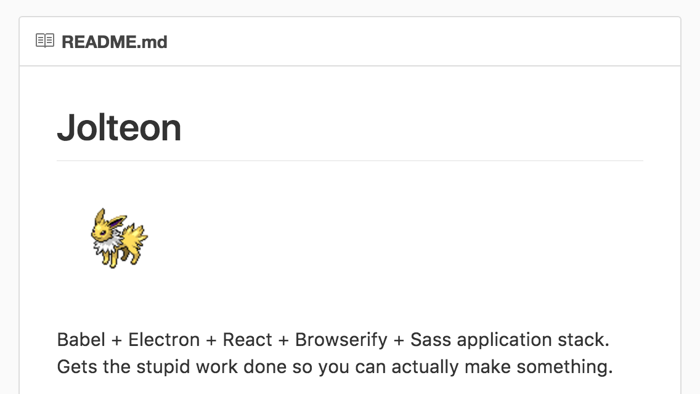
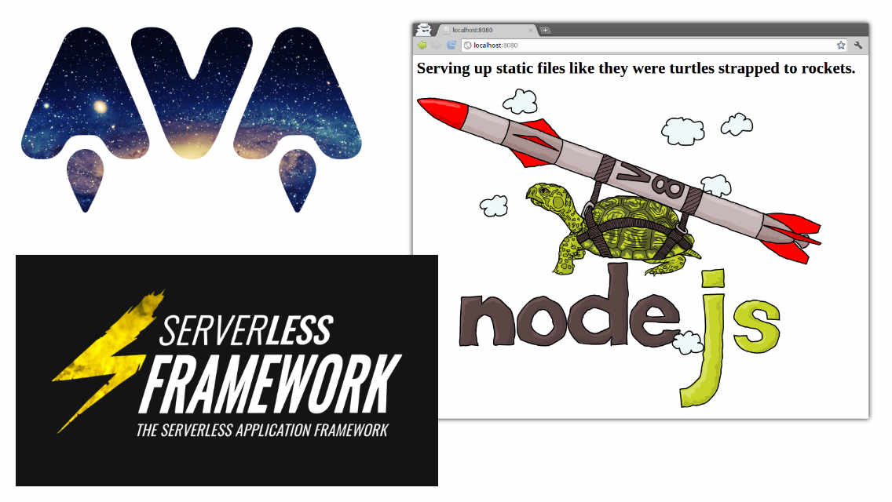
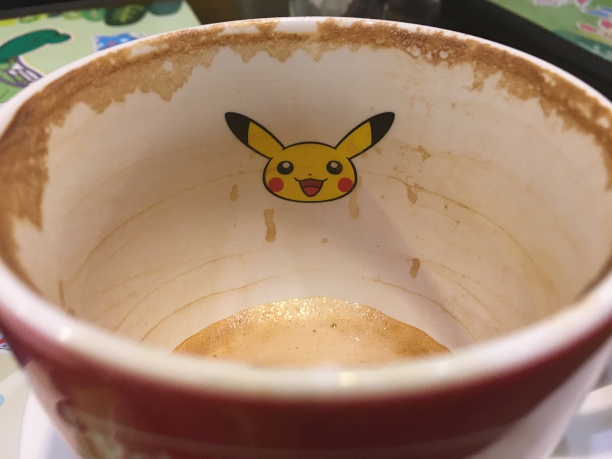
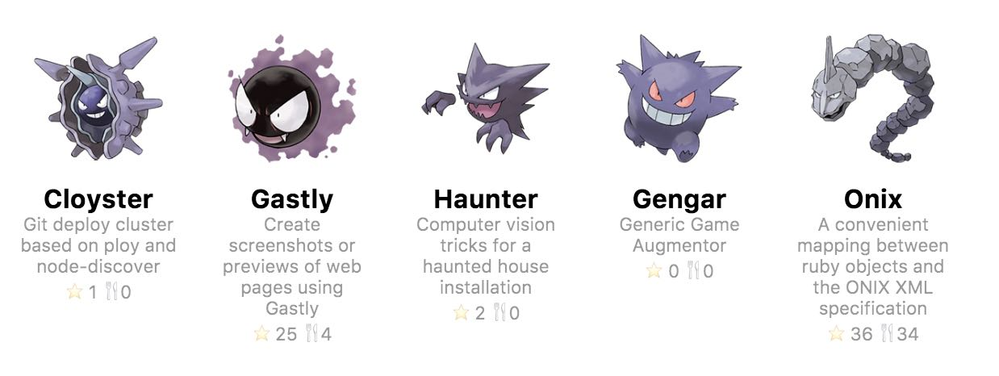
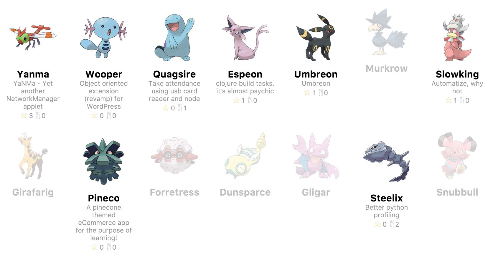
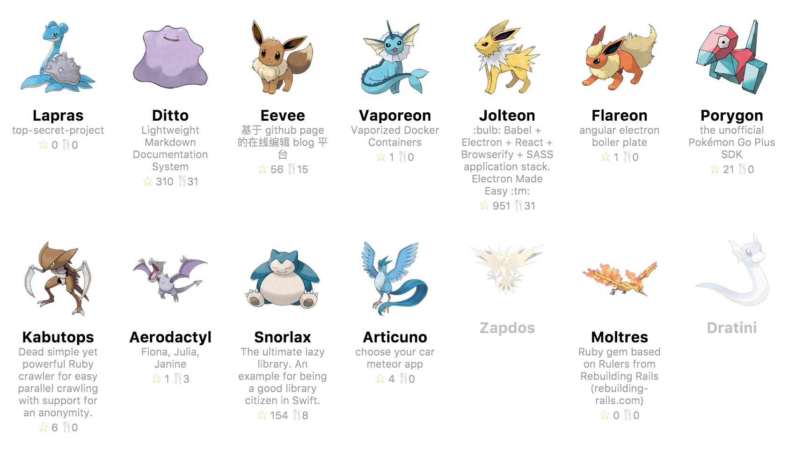
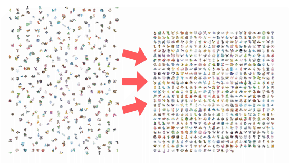
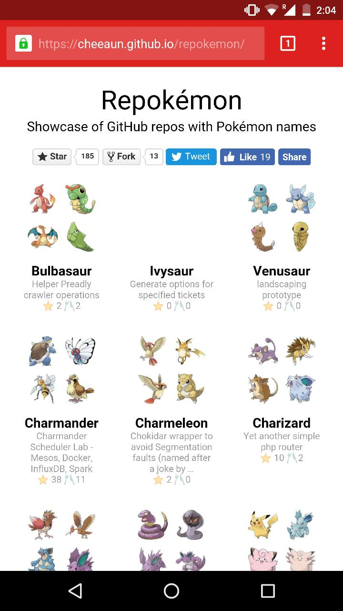
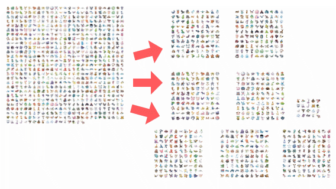
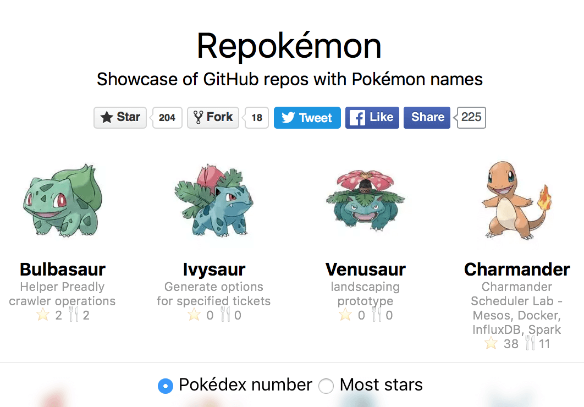

Building Repokémon
===

Once in a while, it's nice to work on one of those *silly* side projects that most people think would be useless or a waste of time.

So far I've always been building *useful* projects and occasionally neglecting the **real fun and joy of building things**, without thinking about the number of users, acquisition, retention, number of features, feasibility, scale, money, competition, market fit, and whatever terms out there.

It's time for a *silly* side project.

Inspiration and naming
---



Few months ago, probably on February 22, I stumbled upon a repository called [Jolteon](https://github.com/vulpino/jolteon). It's an application stack made by Kyle Fahringer that uses Babel, Electron, React, Browserify and Sass.

It's quite a popular project with lots of stars, and the [Jolteon](https://en.wikipedia.org/wiki/List_of_Pok%C3%A9mon_(102%E2%80%93151)#Jolteon) Pokémon image in the README file really catches my attention for some reason. At that time, I thought "Hey, that's pretty smart". Naming things is always the *first* hard part when we build things. Name for a project, a database table, a server in the cloud, a newly introduced variable in the code, a meeting room, a tech conference, or even a startup.

Some companies use a certain convention for names, such as *sweet* food names for [Android releases](https://www.android.com/history/) (Marshmallow, Lollipop, KitKat), California landmarks for [macOS releases](https://en.wikipedia.org/wiki/OS_X) (Seirra, El Capitan, Yosemite), Japanese animation character names (Kanade, Hachibi), island names (Bali, Phuket, Koh Samui), Singaporean food names (Laksa, Chicken Rice, Mee Pok) and more.

Here's a few projects with pretty cool names:

- [frisbee](https://github.com/crocodilejs/frisbee) - API wrapper around ES6/ES7's [fetch()](https://developer.mozilla.org/en-US/docs/Web/API/Fetch_API) method. Fetch and frisbee. Get it?
- [Bulma](https://github.com/jgthms/bulma) - Modern CSS framework based on [Flexbox](https://developer.mozilla.org/en-US/docs/Web/CSS/CSS_Flexible_Box_Layout/Using_CSS_flexible_boxes). [Name of a female character](https://github.com/jgthms/bulma/issues/17#issuecomment-178181276) in Dragon Ball.
- [clif](https://github.com/rauchg/clif) - Cross-platform CLI GIF maker. CLI and GIF, combined.
- [meatier](https://github.com/mattkrick/meatier) - A meteor alternative. Like meteor, but meatier 🍔
- [cash](https://github.com/dthree/cash) - Cross-platform `bash` scripting 💸
- [lave](https://github.com/jed/lave) - [eval](https://developer.mozilla.org/en-US/docs/Web/JavaScript/Reference/Global_Objects/eval) in reverse.

While some projects have pretty nice visuals:

- [ava](https://github.com/avajs/ava) - Futuristic JavaScript test runner, with a *galactic* logo.
- [http-server](https://github.com/indexzero/http-server) - a simple zero-configuration command-line http server, with a *mascot* of a turtle strapped to a rocket.
- [serverless](https://github.com/serverless/serverless) - a Serverless framework, with a flashy lightning logo.



Naming is hard. Getting these cool visuals is even harder, especially for engineers with zero or minimal design sense.

Looking back at the Jolteon project, it fulfils both criteria: a cool name and a cool visual (the Pokémon itself). So I thought to myself, having a Pokémon name *convention* would be pretty cool because there are over **700 Pokémon creatures** out there and we could associate the project description and vision with the **abilities of the Pokémon** creature itself!

Idea and timing
---

I start to wonder, besides Jolteon, are any other GitHub repositories with Pokémon names? I wonder if all the [720 names](https://en.wikipedia.org/wiki/List_of_Pok%C3%A9mon) are already "taken"? Would there be multiple repositories with the same Pokémon name?

Since February, I've been stashing this little idea in my project "to-do" list, as I was busy with other projects, work and life. I'm not sure if the idea would work at all, so I brushed it off a few times. I [was waiting for a spark](/blog/2016/01/building-side-projects/).

And yeap, [Pokémon Go](https://en.wikipedia.org/wiki/Pok%C3%A9mon_Go) got released on July 6 and started the [whole Pokémon craze](https://twitter.com/cheeaun/status/750547880805593089) again.

On [July 13](https://twitter.com/cheeaun/status/753187070538092548), I went to meet my friends at the [Pokémon Cafe](https://foursquare.com/v/pokemon-cafe-singapore/5747aa23498ebf9e2797a80f) and [found](https://www.instagram.com/p/BHzeWqmhetG/) [a](https://www.instagram.com/p/BHzea8bB0bP/) [few](https://www.instagram.com/p/BHzegN1BOQF/) [inspiration](https://www.instagram.com/p/BHzej8_hgL-/) [there](https://www.instagram.com/p/BHzeoNohgMU/).



On July 14, I started coding by scraping a list of Pokémon names and query every name via the [Github search API](https://developer.github.com/v3/search/). Within few hours, I manage to finish up a [minimum viable project](https://github.com/cheeaun/repokemon) that could let me see a list of GitHub projects with Pokémon names. At that time, I have no idea on the numbers and percentage of projects with Pokémon names. It could be just 10 out of 720, or worse? Turns out there's **quite a lot**.

I couldn't believe my eyes as I [tweet out](https://twitter.com/cheeaun/status/753623773434171392) [sneak peeks](https://twitter.com/cheeaun/status/753624970182270980) [on Twitter](https://twitter.com/cheeaun/status/753626210660290560). From a tiny curiosity, slowly grows into **pure fan-boy mode** 😍

[](https://twitter.com/cheeaun/status/753623773434171392)

[](https://twitter.com/cheeaun/status/753624970182270980)

[](https://twitter.com/cheeaun/status/753626210660290560)

On the next morning, I publicly announce the project on [Twitter](https://twitter.com/cheeaun/status/753773619935793152) and [Facebook](https://www.facebook.com/cheeaun/posts/10154148733861294). There were a few hiccups as some people couldn't see [my](https://twitter.com/cheeaun/status/753758270083375104) [tweets](https://twitter.com/cheeaun/status/753762545656172544). My account is set to public but opening the tweet links in Chrome's Incognito window shows a 404 page. My [3rd tweet attempt](https://twitter.com/cheeaun/status/753773619935793152) finally works as I suspect Twitter is probably *censoring* the term "Pokémon" from public consumption. Or perhaps some regional trademark laws or something?

Anyway, I call the project "Repokémon", which combines the word "repo" from "repository" and "Pokémon". It's quite ironic that I didn't use a Pokémon name for this project instead 😉.

Within hours, my project got retweeted, liked and [shared](https://twitter.com/indutny/status/753861032066637824) a few hundred times on [Twitter](https://twitter.com/search?q=repokemon). It appeared briefly on [Hacker News' frontpage](https://news.ycombinator.com/item?id=12098918) and [Designer News](https://www.designernews.co/stories/71852-repokmon--showcase-of-github-repos-with-pokmon-names). It also got featured on [Product Hunt](https://www.producthunt.com/tech/repokemon)!

[](https://twitter.com/indutny/status/753861032066637824)

Right at the same time, I've also received a few helpful pull requests:

- A `manifest.json` file and [a cool Pokéball app logo](https://github.com/cheeaun/repokemon/pull/9/files) by [Henry Lim](https://limhenry.xyz/).
- [Mixed content warning fixes](https://github.com/cheeaun/repokemon/pull/3) by the awesome [Juanito Fatas](https://juanitofatas.com/).

As always, I love good feedbacks ☺️

> How to name your next pet project…
>
> —[Ted Johansson](https://twitter.com/drenmi/status/753808653736554496)

> I wish [@**github**](https://twitter.com/github) really was like this…
>
> —[Mika](https://twitter.com/Akimraht/status/754036051363127298)

> happy that this is a thing (list of all repos on github with pokemon names)...
>
> —[Stuart Lee](https://twitter.com/_StuartLee/status/755653223877382144)

> haha, so @cheeaun has built a list of pokemon names of GitHub repos. claim yours today :)
>
> —[Dimitar Christoff](https://twitter.com/D_mitar/status/753941774616387584)

Spriting images and improving performance
---

Repokémon is a **very simple** single-page web site. It lists all 720 Pokémon creatures linking to its associated GitHub repositories. There are about 200 Pokémon names already "taken", while the rest are either not "taken" or just empty repositories with nothing in them.

The first version was slow. The page actually loads **720 Pokémon images**, which uses up to **20MB of bandwidth**! It uses a lot of memory and exceeds the browser limit of maximum concurrent connections. It might seem fast *after* everything is loaded, but I could see it being [janky](http://jankfree.org/) sometimes when scrolling the page on Chrome and Firefox.



[My first solution](https://github.com/cheeaun/repokemon/commit/fcc3e4ce7d1c8df30f6d2922b1f23f2ed78e6f76) is to combine *all* images into a single sprite image and further compress the image *lossily*. So instead of making 720 connections to the server, it could just make one. It [sort of worked](https://twitter.com/cheeaun/status/755068597458706434) as I use [spritesmith](https://github.com/Ensighten/spritesmith) to generate the **5805×5805px** sprite image, convert the image into JPEG with [TinyJPG](https://tinyjpg.com/), and manually generate a custom stylesheet out of it. The total download size for the images went down from **20MB to roughly 2MB**!

Unfortunately the solution has some issues. In less than a day after I deployed this, [Alvin Teh](http://alvinteh.me/) reported a weird bug on Chrome for Android:



On Chrome for Android, all the sprite image styles with `background-image`, [`background-size`](https://developer.mozilla.org/en-US/docs/Web/CSS/background-size) (the image is downsized for high-DPI displays) and `background-position` are **totally messed up**. Strangely, it works fine on other browsers like Firefox, Safari and even on Chrome on destop.

It took me a while to figure out the bug. It seems that the bug happens for the JPEG sprite image, but **not** for a similar PNG sprite image. Quite perplexing but anyway I did a [super-quick fix](https://github.com/cheeaun/repokemon/commit/d3ea7320b1d9c897a53135d929544b5f65f25938) by *conditionally* use a [WebP](https://en.wikipedia.org/wiki/WebP) sprite image, which somehow doesn't trigger the bug. Only JPEG has the bug? Oh well.

I could potentially be lazy and just point to a PNG sprite image. However, the PNG file size was too large. Even when I try to compress the PNG sprite image **lossily** with [ImageAlpha](https://pngmini.com/), it's still larger in file size than a lossily-compressed JPEG image. WebP supports lossy compression and is surprisingly on par with JPEG format.

Everything looks great *but* the scrolling jank is still there. So I did a little *googling*, and found [an interesting comment on Stack Overflow](http://stackoverflow.com/a/4375272/20838):

> Well, Safari/iOS lists these limits:
>
> - The maximum size for decoded GIF, PNG, and TIFF images is 3 megapixels. That is, ensure that width * height ≤ 3 * 1024 * 1024. Note that the decoded size is far larger than the encoded size of an image.
> - The maximum decoded image size for JPEG is 32 megapixels using subsampling. JPEG images can be up to 32 megapixels due to subsampling, which allows JPEG images to decode to a size that has one sixteenth the number of pixels. JPEG images larger than 2 megapixels are subsampled—that is, decoded to a reduced size. JPEG subsampling allows the user to view images from the latest digital cameras.
> - Individual resource files must be less than 10 MB. This limit applies to HTML, CSS, JavaScript, or nonstreamed media.

I'm not 100% sure how accurate these "limits" are but I deduced a few things:

1. A 5805×5805px sprite image is **way too large**, especially after it's decoded by the browser.
2. Different browsers might set different limits for different image formats. They could cause weird and unexpected bugs, like the one in Chrome for Android. PNG and WebP are fine, but not JPEG.
3. Even if it works, the sprite image is downsized to 2700×2700px with `background-size`, so that it will look sharp on high-DPI displays, which makes it *even more* difficult for browsers to handle the rendering and memory usage.

At this point, things got a bit complicated and I need to revisit my goals:

1. Reduce HTTP round trips.
2. Reduce file size.
3. Remove scroll jank.

The sprite image solves the 1st and 2nd goals but not the 3rd goal 😔



[My second solution](https://github.com/cheeaun/repokemon/commit/09a531941b4ab08cfc7b0256d7c7f8131ffe2987) is to *split* the sprite image to multiple **smaller** sprite images.

Every sprite contains a maximum of 100 Pokémon characters, with a 10×10 grid, resulting in at most 2150×2150px dimension. It's now **8 sprite images** with the last one in 1075×860px dimension.

Technically the sprite images are still not small enough, though I need to balance between the number of HTTP round trips, overall file size and concurrent connections throughput. I figured that multiple sprite images, not too many yet not little, could somehow make use of the number of concurrent connections that the browser could make, and hopefully speed up the download time and start render time of the images. I suspect that it could make it easier for browsers the juggle the memory usage a little.

Speculations aside, I tested this on both desktop and mobile browsers. The scroll jank is somewhat gone. On Firefox for Mac, I still see a bit of jank sometimes and more noticeably blank whitespaces if I scroll too fast. Well, at least it's better than before 😅

Optimizing the CSS
---

The CSS code for multiple sprite images is not pretty. At first, It looks like this:

```
.i001,.i002,.i003, ..., .i098, .i099, .i100{ background-image: url(sprite-1.png) }
.i001{background-position: -100px -0px;}
.i002{background-position: -700px -100px;}
...

.i101,.i102,.i103, ..., .i198, .i199, .i200{ background-image: url(sprite-1.png) }
.i101{background-position: -100px -0px;}
.i102{background-position: -700px -100px;}
...
```

The `class` names with the same background image are grouped together and individually assigned its own `background-position`.

I was thinking if there is a way to have a CSS selector to match a *range* of numbers, like from `001` to `100`. I'm already using [clean-css](https://github.com/jakubpawlowicz/clean-css) to minify the CSS file. It works wonders as I enable `--semantic-merging` option which groups all selectors with the same `background-position` values.

I wonder if I could save a few more bytes? I came up with this:

```
[class*=i0],.i100{ background-image: url(sprite-1.png) }
.i001{background-position: -100px -0px;}
.i002{background-position: -700px -100px;}
...

[class*=i1]:not(.i100),.i200{ background-image: url(sprite-1.png) }
.i101{background-position: -100px -0px;}
.i102{background-position: -700px -100px;}
...
```

The magic happens thanks to [substring matching attribute selectors](https://www.w3.org/TR/css3-selectors/#attribute-substrings) (`E[foo*="bar"]`) and the [negation pseudo-class](https://www.w3.org/TR/css3-selectors/#negation) (`E:not(s)`). The `[class*=i0]` selector matches all `class` names from `i001` to `i099`. `.i100` class is appended because it's also part of the first sprite image.

The succeeding CSS selectors, for example `[class*=i1]:not(.i100)` has a `:not` selector so that it doesn't match the selector from the *previous* sprite image batch.

Some developers might think that the performance for attribute selectors would be *slower* compared to normal `class` names. Nevertheless, I don't care about it for now since I've already solved the main performance bottleneck with the sprite images.



On July 26, I [announced the change](https://twitter.com/cheeaun/status/757759674435317760), including a tiny feature for sorting by Pokédex numbers or GitHub stars. The sort options bar at the bottom uses the cool [backdrop filters](https://webkit.org/blog/3632/introducing-backdrop-filters/), which is currently [supported only on Safari](http://caniuse.com/#feat=css-backdrop-filter) 😁

Side projects should be stupid
---

This is not the first time I build a silly or stupid side project.

As always, I **learned a lot** within just few days of building one. I'm glad that I could go through this process all over again with [Repokémon](https://cheeaun.github.io/repokemon/).

I would like to quote Tobias van Schneider, from the article [Why Side Projects Should Be Stupid](http://firstround.com/review/Spotifys-Design-Lead-on-Why-Side-Projects-Should-be-Stupid/):

> I didn't build it because it stopped being fun. It stopped being stupid.

Exactly 😉

---

*Disclaimer: All Pokémon content is © Nintendo, Game Freak, and The Pokémon Company. This article is not affiliated with Nintendo, Game Freak, or The Pokémon Company in any way.*
