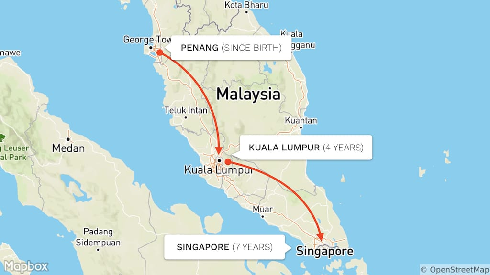

Bridging connections
===

On 25 November 2016, I gave a talk at [JSConf.Asia](https://2016.jsconf.asia/) (day 1). It was supposed to be a 30-minute talk but when I rehearsed it on the night before, it turned out to take more than an hour! Luckily I manage to squeeze it into a small timeframe somehow 😅

Here are the [slides](https://speakerdeck.com/cheeaun/bridging-connections) and the [video](https://www.youtube.com/watch?v=V0dKzbhtHpQ):

During the talk, I was wearing my favourite [San Fransokyo t-shirt](https://twitter.com/cheeaun/status/801081510476464129) from [Cotton Bureau](https://cottonbureau.com/products/san-fransokyo-1). I use a MacBook 12" with a [USB-C Digital AV Multiport Adapter](http://www.apple.com/sg/shop/product/MJ1K2AM/A/usb-c-digital-av-multiport-adapter) that connects to the HDMI display projector. It was the last talk of JSConf.Asia Day 1 at 4:30PM. The [talk before me](https://www.youtube.com/watch?v=uNVlQ1yPsto), which starts at 4PM, was by [Marco Cecconi](https://twitter.com/sklivvz) and imagine how nerve-wracking it was for me to wait at the backstage for 30 minutes 😰

Nevertheless, here lies a written (extended?) version of my talk (perhaps for those who are not into videos).

This is [a photo I took](https://www.flickr.com/photos/cheeaun/17873683736/) at Hohenzollern Bridge in Cologne. It's kind of a wordplay since the title of my talk is '**Bridging** connections'. It's also the first bridge I see that has [**a lot** of love padlocks](https://www.flickr.com/photos/cheeaun/17900059215/), which kind of relates to *connections* 💞

Hi, I'm Chee Aun. That's my usual [waving emoji](http://emojipedia.org/waving-hand-sign/) whenever there's someone new in the [Kopi.JS](http://kopijs.org/) chatroom (or any chatrooms).

I'm [@cheeaun](https://twitter.com/cheeaun) on Twitter. The 'You should follow me on Twitter' text at the bottom right was my attempt to [revive Dustin Curtis's experiment on clickthrough rates](http://kottke.org/09/07/you-should-follow-me-on-twitter). I wonder if it would work for slides? 🤔

So most of my social avatars now use this photo, but as social media sites require square or circle avatars, the actual photo is cropped.

The cropped part reveals a [selfie coffee](https://www.facebook.com/selfiecoffeesg) at the bottom, which I can drink a coffee with my face on it. I was wearing my favorite [Beyond Tellerrand](https://beyondtellerrand.com/events/duesseldorf-2015/) t-shirt (It says 'Five' because [5 years](https://beyondtellerrand.com/blog/btconf-duesseldorf)) and this photo was taken by Valentine Chua during the [14th Kopi.JS meetup](https://github.com/KopiJS/kopi.js/issues/28) on 21 May 2015.

And this is me on [TV](https://www.youtube.com/watch?v=8zH8fbUNdKI). It's an interview about me building my [TaxiRouter SG](/blog/2016/03/building-taxirouter-sg/) app on [Channel 8 News](http://www.channel8news.sg/). In [Mandarin](https://en.wikipedia.org/wiki/Mandarin_Chinese) 😅

And me again, this time on a **huge** projector screen. The man on the stage, and also the smaller projector screen on the left, is [Dr. Yaacob Ibrahim](https://www.parliament.gov.sg/mp/yaacob-ibrahim), the Minister for Communications and Information in Singapore.

I like how my colleague, [Lester Chan](https://lesterchan.net/), commented on the photo which was taken by [Huiyi](https://twitter.com/heliumlife). There's also [another photo taken by U-Zyn](https://www.facebook.com/photo.php?fbid=10154389789005923&set=a.476548385922.295063.706830922&type=3&theater) from another angle 🙈

I'm born in Penang, one of the states in Malaysia. I stayed there since birth, moved to Kuala Lumpur for 4 years and now in Singapore for almost 7 years.

I was planning to give a technical talk ever since my proposal was accepted in the CFP. However, it's kind of difficult to maintain the *excitement* of my topic until November, especially when I'm not one of those professional speakers who give the same talk in multiple conferences throughout the whole year.

One day, [Thomas](https://twitter.com/serrynaimo) messaged me, telling me that I'd be the best person to do a *community* talk. 'Self-reflectability' is a word that he *invented* which kind of describes me in a good way 😅

This year has been an awesome year for me. I used to blog *once* a year, but I manage to write so many articles this year! I built a whole bunch of apps and wrote down all the implementation details, design processes and my experiences.

One of the *prominent* articles I wrote this year is '[Being invisible](/blog/2016/07/being-invisible/)'.

I guess this is the article that makes me *self-reflective*, as people around me start to know me better.

I didn't expect the conference audience to read this immediately as it'll probably take like 30 minutes to read it. It took me **two years** to write it and finally have the courage to publish it.

I've also built [Life](https://github.com/cheeaun/life), which is simple side project that shows a timeline of important events in my life.

This is my own life timeline on [cheeaun.life](http://cheeaun.life). Yes, that's a [dot-life TLD](https://icannwiki.com/.life).

Before I proceed, I try to set expectations and set a disclaimer that this is **not** a technical talk.

Since it's the last talk of the day, I suspect that the attendees are getting pretty tired (especially those who attended [CSSConf.Asia](https://2016.cssconf.asia/) on the day before). No code on the slides. No worries.

I'm a storyteller and yes, I like to tell stories.

But first, let's look at photos. It's like appetizers before the entree.

This is a group photo of the attendees in last year's [JSConf.Asia](http://2015.jsconf.asia/).

This is a group photo of a bunch of engineers, designers and makers in [Geek Brunch SG](https://geekbrunch.sg/) which happened on 30 April this year.

And… the first Geek Brunch, on 1 March, two years ago. There's [a story behind it](https://medium.com/we-build-sg/the-story-of-geek-brunch-singapore-943c3c99515f).

This is a group photo of my classmates and teachers in my secondary school, SMK Dato' Onn, in Butterworth, Penang. That's me in the red circle.

For some reason, group photos always remind me of anime group photos since I watch animes all the time. This is [Naruto](https://en.wikipedia.org/wiki/Naruto), one of my most favorite Japanese animation series.

Every single time when I see group photos, I start to wonder, why do we even take them? It's kind of troublesome because everyone needs to gather, stand for a few minutes, look at the cameraman to give hand signals and pose when the shot is taken. It makes me wonder as I look at every single person in the photo, trying to think if I know everyone or even talked with some of them.

I asked myself and think it's time to look back into the beginning and try to understand this.

Initially I use "Let's start with the beginning" but don't know why I change it to "Let's begin with the beginning". Probably I'm trying to play with words here again 🤔

First is [Chris Neale](https://twitter.com/cdncx), the first stranger on the Internet who offered help to me, without me asking at all.

I'll never forget him as what he did really changes the way I think about communities on the web. At that time, I don't know how he looks like, what's his real name, and where he's from. Yet he lent a hand when I needed it. He probably doesn't know how I look like, what's my real name and where I'm from too. A stranger helping a stranger, in a boundaryless world of the web.

Second is [David Tenser](https://twitter.com/djst). He's the first person who inspired me on UI design. I first learn about "native user interfaces" from him and it sparks my whole obsession with building native-like interfaces and experiences.

Besides people, sometimes web sites can be a form of inspiration too. This is [css/edge](http://meyerweb.com/eric/css/edge/) by [Eric Meyer](https://twitter.com/meyerweb), the first web site that inspired me to learn CSS.

It might seem a bit plain now, but it was **really cool** back then. I especially **love** the [complexspiral demo](http://meyerweb.com/eric/css/edge/complexspiral/demo.html).

This is [A List Apart](http://alistapart.com/) by [Jeffrey Zeldman](https://twitter.com/zeldman), which was the ultimate source of all the cool CSS, JavaScript and web design tricks last time. I took [this old 2001 screenshot from Wayback Machine](https://web.archive.org/web/20010302064946/http://www.alistapart.com/). It's really nostalgic to see the validation text for HTML 4.01 and CSS-1 there ☺️

Not forgetting [Kamal Fariz](https://twitter.com/kamal), the first person who *tricked* me into giving my first public talk. And that first talk was at [BarCamp Malaysia](/blog/2008/09/meaningful-three-years/), on July 2008, just one month after my university graduation in [UTAR](http://www.utar.edu.my/).

Also not forgetting [Jinny Wong](https://twitter.com/shujinh), who teached me a bit on coding when I was a total beginner. I remember asking her about a simple `if/else` statement and she told me that I did it correctly.

Thinking about it, these are not *big* helps. These are just *small gestures* that push me forward as I was struggling with my studies, my passion and my journey in learning new things.

They have changed my life.

They've inspired me to become who I am now, from the *very* beginning.

I don't know why, but I decided that I want to be like them. I want to be **cool** like them. I want to inspire other people and become a *hero*.

I did a lot of things like attending many different kinds of meetups, not just JavaScript or CSS ones.

I built **a lot** of apps and [still continue building](https://github.com/cheeaun). I maintain a lot of them too. I'm known for [my side projects](/blog/2016/01/building-side-projects/).

I write blog posts and sometimes [give talks](https://engineers.sg/presenter/lim-chee-aun--16) when I feel like it.

For the past three years, I embarked on a journey. I was feeling kind of *trapped* in Singapore (and Malaysia) and needed to get out to see things outside. I want to see my web heroes, see them talk in real life and know more *heroes* in other cities and countries.

As shown on my [Life](http://cheeaun.life/), these (in the red box) are my travels outside of Singapore, since the beginning of 2014 until 2015.

**2014**: 7 conferences, 5 cities, 4 countries. The photo on the right is [the stage of JSConf.EU](https://www.flickr.com/photos/cheeaun/15181580780/in/album-72157647681056838/) taken on 13 September 2014.

**2015**: 8 conferences, 5 cities, 5 countries. The photo on the left is [the stage of Beyond Tellerrand](https://www.flickr.com/photos/cheeaun/17713748289/in/album-72157652750212588/) taken on 11 May 2015.

**2016**: 9 conferences, only Singapore and Tokyo. Photo on the right is the stage of [RedDotRubyConf](http://www.reddotrubyconf.com/) taken on 23 June 2016.

When I was working on this slide, I counted the number of conferences and was genuinely surprised 😱. In 3 years, I've attended **25 conferences**!

In all 24 conferences, except JSConf.Asia 2016, I did not speak at all. Just a normal attendee. I would usually sit at the back of the conference hall and look at the speaker. But this time, I'm looking at the other way around with all the spotlights above me, which I find… rather interesting.

As I attend so many conferences, I start to [jot down all my reasons for attending them](http://cheeaun.com/blog/2015/12/why-i-attend-conferences/). I found out about the *real* reasons, tips and tricks for going to conferences and has been advocating to my friends to attend as well.

After all these years, I ask myself "What have I learned?".

I ask lots of questions.

I ask people how they organize events, from small meetups to huge conferences. Where does the food come from? How do you get the sponsors? Who record the videos? Where do you print the t-shirts from? How do you get the volunteers? How do you pick the talks from the CFPs?

As I go to many meetups and conferences, I meet more and more people from various companies, industries and backgrounds. There are two persons that I would like to mention.

This is [Sayanee](https://twitter.com/sayanee_).

She's the creator of [We Build SG](https://webuild.sg/), a web site that aggregates all the free tech events in Singapore. She also [gave a lot of talks](https://engineers.sg/presenter/sayanee-basu--69) and even encouraged a lot of people to give talks.

We Build SG is built to make it easier for people to find out about tech events in Singapore, as there are always new people coming to Singapore and want to engage with the community.

After a while, Sayanee [use all the aggregated data and introduced](https://twitter.com/sayanee_/status/668757449923391490) [data.webuild.sg](https://data.webuild.sg/) which features some visualizations of events, user groups, and repositories.

This is [Michael Cheng](https://twitter.com/coderkungfu). He is like a must-know tech community guy in Singapore 😎

Michael built [Engineers.SG](https://engineers.sg/), a not-for-profit community initiative, created to help document the Singapore tech and startup scene. Simply put, it's a web site that lists [all video recordings](https://engineers.sg/episodes/) of *almost* all meetups in Singapore.

Now the question is, where do these videos come from?

Well, they are recorded by Michael and a few trained volunteers. With all those video, audio and screen recording software and hardware equipments. For free. Since 2013.

Michael and Sayanee are very special to me, and so it came to a point when we have a chance to organize [Geek Brunch SG](https://geekbrunch.sg/) together this year (2016). That's a photo of us at [Wheeler's Yard](http://www.wheelersyard.com/) on 30 April 2016.

I would like to mention [Lakshan](https://twitter.com/laktek) as well, for giving me a rather-accidental chance of hosting a meetup that's *very* different than other meetups.

I wrote [a whole story on how Kopi.JS got started](https://medium.com/kopi-js-community/the-kopi-js-meetup-story-5ee2cd574678), mainly thanks to him for being curious about ordering the local coffee (kopi) in Singapore.

Over the years, it's [amazing to see how this is growing](https://twitter.com/laktek/status/558846955103588352).

This is the [17th Kopi.JS meetup](https://github.com/KopiJS/kopi.js/issues/31), on 4 October 2015. Two students there from [SUTD](http://www.sutd.edu.sg/).

This is the [9th Kopi.JS meetup](https://github.com/KopiJS/kopi.js/issues/20), on 24 January 2015.

This is the [21st Kopi.JS meetup](https://github.com/KopiJS/kopi.js/issues/35), on 1 February 2016. The guy in the red shirt is the awesome [Guillermo Rauch](https://twitter.com/rauchg).

Besides organizing meetups, I [print Kopi.JS stickers](https://twitter.com/cheeaun/status/536020524032200705) and give them away.

I [print a few Kopi.JS t-shirts](https://www.instagram.com/p/BL2vBtCDON5/?taken-by=ksaitor) and give them away.

I also helped in designing logos for other people, like [the one for RedDotRubyConf](https://twitter.com/cheeaun/status/746365611828084736).

Sometimes I just design for fun, like [the iOS Conf SG stickers](https://twitter.com/cheeaun/status/789099088939589632).

I also print *more* stickers for other people and local meetups here, like these [SingaporeJS and SingaporeCSS stickers](https://twitter.com/cheeaun/status/711064410983309313).

Here's [a photo I've taken](https://www.flickr.com/photos/cheeaun/17896985172/in/album-72157652750212588/) at [Rheinuferpromenade](https://www.duesseldorf-tourismus.de/sehenswuerdigkeiten/rheinuferpromenade/) in Düsseldorf. I use this photo as hint for myself to transition to the next slide. On [my Instagram](https://instagram.com/p/2oLU5gy9x5/), I described it as 'Looks like a long way to go', to visualize my journey so far.

After doing all these things, I start to ask myself, why am I doing this?

In fact, I'm not the only one doing this, there are **many** people out there who did *way more* than what I've done. So the question should be why are **we** doing this?

I've seen a lot of people who come and go. New meetups are organized and old meetups are gone. Hosting a meetup is so tiring. Going to meetups are so tiring. Talking with people can be tiring. Printing stickers need money. Printing t-shirts is not simple at all. Recording meetups is not simple at all. All these can be very tiring and sometimes… stressful.

Again the question is… **why?**

There could be a lot of reasons for the things that we do. After a while, I realised that sometimes you don't need a very complicated or long-winded answer to the question.

In the end, it's just **one simple reason**.

It's the "Thank you"'s. It's the "Oh my god, you saved my life" kind of feedback. It's basically all the **positive** feedback that you get from other people, perhaps from emails, instant messages, forums, articles or words of mouth.

These two **powerful words** are what kept me and many others going. It might not seem like a lot but it really means a lot.

Sometimes, I feel that some of us have taken things for granted. We take a lot, but sometimes we don't give a lot.

Think about all the libraries and frameworks that we use. All the nice documentation, READMEs, articles, podcasts, screencasts, and tutorials that we refer to. Think about it. Who wrote them? How much time does it take to write them? It's actually a lot of work.

My point here is that sometimes we should take time to give back. If you found a bug, report it. If you found a typo, make a pull request. Ask the organizers if they need help.

Obviously you can do *more* to help others, like giving talks, write articles or even teach other people.

Eventually, I realised that almost everything we do is always about the people. Seriously, **everything**.

For example, building a product is always about getting more users and customers, and making them happy. Building a library or framework needs people to use them so that it can be better as more people contribute back. Writing a web standards specification needs developers to give feedback and ideas so that it would be useful for themselves. Meetups and conferences wouldn't be possible at all without people buying the tickets and attending them.

Talking about people, I really mean **everyone**. Family members, relatives, cousins, school friends, work colleagues, and even people outside of your circle.

This is [Winnie Lim](https://twitter.com/wynlim), the best storyteller ever, in my opinion. She [writes](http://journal.winnielim.org/) [a lot](https://medium.com/@wynlim) and I always read her writings, as they reflect upon her own opinions, as well as mine.

The title of my talk is in fact *stolen* from her article, '[Bridging connections](http://journal.winnielim.org/bridging-connections)'.

At the end of her article, there is this quote that I really like:

> We were all very different individuals, from vastly varying backgrounds and life stories, with divergent trajectories and hopes – but all of that didn’t matter when we were all bridged by the work we all love to do, made possible by the lack of a physical distance across ones and zeroes.

So beautiful.

Thank you 😊
