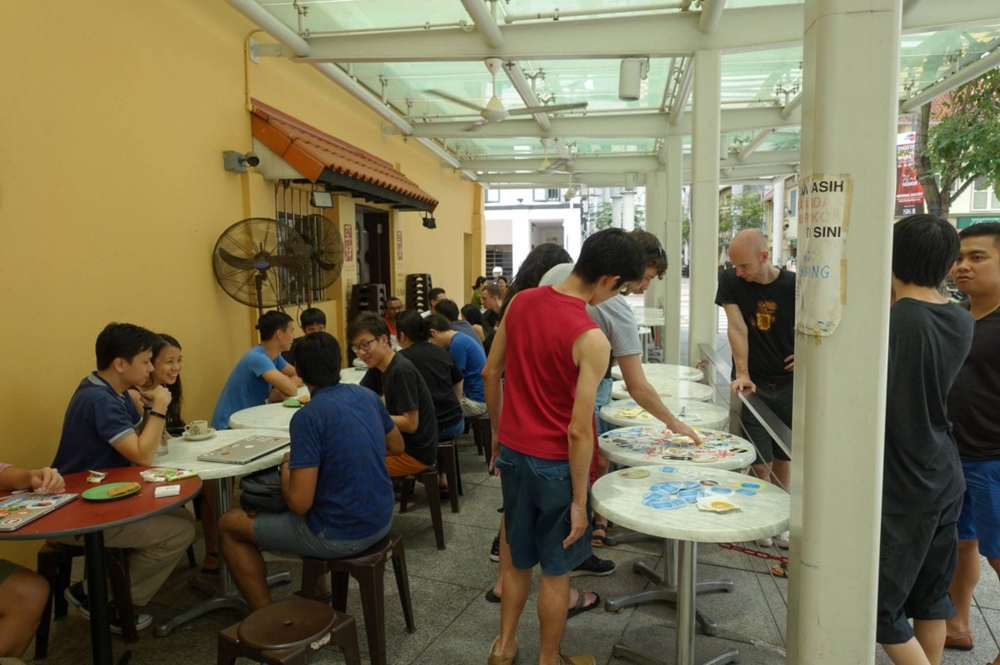

Kopi.JS in 2016
===

I wrote a “round-up” post last year: [**Kopi.JS in 2015**](/blog/2015/12/kopi-js-in-2015)

So I guess I’ll write one again this year.

There’s a total of [**14 Kopi.JS meetups**](https://github.com/kopijs/kopi.js/issues?utf8=%E2%9C%93&q=is%3Aissue%20is%3Aclosed%20label%3Akopijs%20created%3A2016-01-01..2016-12-31%20) so here goes:

January 16th
---

Location: [Revelry](https://www.facebook.com/revelrysg/)

Look at those cool elephants! 🐘🐘

February 1st
---

Location: [Food Republic](http://foodrepublic.com.sg/stores/food-republic-capitol-piazza-new) (formerly known as Palette)

That’s *Guillermo Rauch* in the red shirt.

March 12th
---

Location: [Whisk & Paddle](http://whiskandpaddle.com.sg/)

😥 _No photos_ 😔

May 28th
---

Location: [The Coffee Bean & Tea Leaf](https://foursquare.com/v/the-coffee-bean--tea-leaf/4b1a2166f964a520b3e723e3)

June 22nd
---

Location: [Victory Restaurant](https://foursquare.com/v/victory-restaurant-pte-ltd/4dfc9c0e149599f28fcb28b1)

That’s me closing my eyes 🙈 Photo by *Nazrul Kamaruddin*.

July 16th
---

Location: [Drips Bakery Cafe](http://www.drips.com.sg/)

Not a very good photo, but oh well…

July 30th
---

Location: [Wimbly Lu Chocolates](http://www.wimblylu.com/)

Photo obviously by *Michael Cheng*

August 21st
---

Location: [Big Street](https://www.facebook.com/bigstreetsg/)

Look at those prata’s… 😋

September 3rd
---

Location: [The Bravery](https://foursquare.com/v/the-bravery/51f0e03d498ef9340516284b)

Photo by *Michael Cheng* again…

And again…

The Kopi.JS crew? ☕️🤔

September 18th
---

Location: [I am…](http://www.iam.com.sg/)

October 16th
---

Location: [Ya Kun Kaya Toast](https://foursquare.com/v/ya-kun-kaya-toast-%E4%BA%9E%E5%9D%A4/4b231bc2f964a520635324e3)

Photo by *MarkFull*. And OMG… stickers on the tables! 😍

November 12th
---

Location: [A Poke Theory](http://www.apoketheory.com/)

😥 _No photos_ 😔

November 27th
---

Location: [FabCafe](http://www.fabcafe.com/singapore/)

Yes, it’s true that some of us are not looking at the camera 📸

December 11th
---

Location: [Auntie Teo Place](https://foursquare.com/v/auntie-teo-place/4ba1b491f964a520d5c837e3)

It’s always *Michael Cheng* who takes photos. Next time need to hire him as photographer 🤔

Tiny milestones
---

> Went to my first [@kopi\_js](https://twitter.com/kopi_js?ref_src=twsrc%5Etfw) meet up with [@ongmin](https://twitter.com/ongmin?ref_src=twsrc%5Etfw) and met [@cheeaun](https://twitter.com/cheeaun?ref_src=twsrc%5Etfw) and [@jin\_](https://twitter.com/jin_?ref_src=twsrc%5Etfw) and loads of other developers! Woohoo!
> 
> — Jesstern 🕺 (@jsstrn) [January 16, 2016](https://twitter.com/jsstrn/status/688258253118025729?ref_src=twsrc%5Etfw)

> Meeting [@rauchg](https://twitter.com/rauchg) the creator of socket.io [@kopi\_js](https://twitter.com/kopi_js) 😸☕️
>
> 
>
> — Graphics Noob (@BlurSpline) [February 1, 2016](https://twitter.com/BlurSpline/status/694162431275175936)

> Woot just got the new \*pixelated\* [#kopijs](https://twitter.com/hashtag/kopijs) stickers from [@stickerhd](https://twitter.com/stickerhd) 😍👾☕️🇸🇬👍💥
>
> 
>
> 
>
> — Chee Aun ✨ (@cheeaun) [February 5, 2016](https://twitter.com/cheeaun/status/695599738708594690)

> Quote of the day from [@cliener](https://twitter.com/cliener) in [@kopi\_js](https://twitter.com/kopi_js) chat [https://t.co/5A9M2JAfdK](https://t.co/5A9M2JAfdK) 😱Which icons can you recognise?
>
> 
>
> — We Build SG (@webuildsg) [March 8, 2016](https://twitter.com/webuildsg/status/707086387338567680)

> .[@kopi\_js](https://twitter.com/kopi_js) isn’t just great for meeting devs and designers in SG, but also awesome at bring me to places I’ve never been to before
>
> — Jin (@jin\_) [March 12, 2016](https://twitter.com/jin_/status/708510427664089089)

> Meet [@webuildsg](https://twitter.com/webuildsg) [@sayanee\_](https://twitter.com/sayanee_) [@cheeaun](https://twitter.com/cheeaun) [@kopi\_js](https://twitter.com/kopi_js) at \*THE\* tech social event of the year. It's gonna be awesome! <https://geekbrunch.sg/>
>
> — Engineers.SG 🇸🇬 (@engineersftw) [April 6, 2016](https://twitter.com/engineersftw/status/717531597143052288)

> A friend asked me what's [@geekbrunchsg](https://twitter.com/geekbrunchsg) and I said it's like [@kopi\_js](https://twitter.com/kopi_js) only with loads more geeks and loads more kopi. ☕️
>
> — Jesstern 🕺 (@jsstrn) [April 6, 2016](https://twitter.com/jsstrn/status/717654022421807108)

> Thanks everyone! See you at a meetup [@webuildsg](https://twitter.com/webuildsg), checkout talks [@engineersftw](https://twitter.com/engineersftw) and drop by with coffee [@kopi\_js](https://twitter.com/kopi_js) 👫👬👭
>
> 
>
> — Geek Brunch SG (@geekbrunchsg) [April 30, 2016](https://twitter.com/geekbrunchsg/status/726330597031858176)

> "You can survive in Singapore by just visiting tech meetups every day and eating free pizza."
> —[@mbrochh](https://twitter.com/mbrochh)
>
> 
>
> — Kopi.JS (@kopi\_js) [May 5, 2016](https://twitter.com/kopi_js/status/728041591940747264)

> The story of our geek community with [@engineersftw](https://twitter.com/engineersftw) [@kopi\_js](https://twitter.com/kopi_js) and lots of photos with cute notes by [@cheeaun](https://twitter.com/cheeaun)  
>
> 👉 <https://medium.com/we-build-sg/the-story-of-geek-brunch-singapore-943c3c99515f>
>
> — We Build SG (@webuildsg) [May 9, 2016](https://twitter.com/webuildsg/status/729495817803825152)

> [#kopiquotes](https://twitter.com/hashtag/kopiquotes) [#justsaying](https://twitter.com/hashtag/justsaying) Join [@kopi\_js](https://twitter.com/kopi_js) slack now: <https://kopijs.herokuapp.com/>
>
> 
>
> — We Build SG (@webuildsg) [May 13, 2016](https://twitter.com/webuildsg/status/731029159380537345)

> Basically `=` is more vulnerable. The more `=` is appended, the better the equality check is .💥―[@cheeaun](https://twitter.com/cheeaun)
>
> 
>
> — Kopi.JS (@kopi\_js) [May 14, 2016](https://twitter.com/kopi_js/status/731318198881140736)

> Woot, finally new [#kopijs](https://twitter.com/hashtag/kopijs) and [#milodinosaur](https://twitter.com/hashtag/milodinosaur) stickers from [@stickerhd](https://twitter.com/stickerhd) ! ☕️😍
>
> 
>
> — Kopi.JS (@kopi\_js) [May 14, 2016](https://twitter.com/kopi_js/status/731482519590326273)

> Thanks [@cheeaun](https://twitter.com/cheeaun) for the [#kopiJS](https://twitter.com/hashtag/kopiJS) stickers. So awsum. 🤓☕️👾
>
> 
>
> — 🙋🏻 Hui Yi Lee (@heliumlife) [May 26, 2016](https://twitter.com/heliumlife/status/735674311843811330)

> Today in KopiJS... :D no bicycle.. [@kopi\_js](https://twitter.com/kopi_js)
>
> 
>
> — Min and her Cat (@ongmin) [May 28, 2016](https://twitter.com/ongmin/status/736464574828810240)

> This is to remind me that imma [#milodinosaur](https://twitter.com/hashtag/milodinosaur) and I'd better keep coding to level up! [@kopi\_js](https://twitter.com/kopi_js)
>
> 
>
> — 🙋🏻 Hui Yi Lee (@heliumlife) [June 2, 2016](https://twitter.com/heliumlife/status/738362396784218113)

> Finally [#kopijs](https://twitter.com/hashtag/kopijs) on my laptop!
>
> 
>
> — Nazrul is a mid life crisis (@nazroll) [June 22, 2016](https://twitter.com/nazroll/status/745629735158308864)

> Introducing "Kopi Maker" <https://kopijs.org/#kopi-maker> [#kopijs](https://twitter.com/hashtag/kopijs) ☕️️
>
> 
>
> — Chee Aun ✨ (@cheeaun) [July 12, 2016](https://twitter.com/cheeaun/status/752874588170629122)

> Thanks [@cheeaun](https://twitter.com/cheeaun) for the [#kopijs](https://twitter.com/hashtag/kopijs) tee! ☕
>
> 
>
> — Jinny Wong (@shujinh) [August 23, 2016](https://twitter.com/shujinh/status/768064653339439104)

> So what's the next logical step after stickers? Magnets. [#kopijs](https://twitter.com/hashtag/kopijs) 💥💥💥
>
> 
>
> 
>
> — Chee Aun ✨ (@cheeaun) [September 18, 2016](https://twitter.com/cheeaun/status/777531446302871553)

> This is how we roll during our live podcast with [@kopi\_js](https://twitter.com/kopi_js) t-shirt! It's been a fabulous 40 episodes 💕 Big thanks to YOU 🎤
>
> 
>
> — We Build SG (@webuildsg) [December 10, 2016](https://twitter.com/webuildsg/status/807449278633213952)

> Very happy I can still fit into the challenging "M" sized Milo Dinosaur! Thanks [@cheeaun](https://twitter.com/cheeaun) [#holdBreath](https://twitter.com/hashtag/holdBreath) [#proveWifeWrong](https://twitter.com/hashtag/proveWifeWrong)
>
> 
>
> — choonkeat (@choonkeat) [December 16, 2016](https://twitter.com/choonkeat/status/809671249202810880)

Stats on the free swags that I’ve provided for Kopi.JS from the beginning:

*   Kopi.JS stickers: **400** pieces (200 from [StickerMule](https://www.stickermule.com/), 100 from [StickerHD](https://stickerhd.com/), 100 from [Touch & Print](http://www.touch-print.com.sg/))
*   Pixelated Kopi.JS stickers: **200** pieces (150 from StickerHD, 50 from [Custom.SG](http://custom.sg/))
*   Milo Dinosaur stickers: **100** pieces (from StickerHD)
*   Kopi.JS magnets: **30** pieces (from StickerMule)
*   Kopi.JS t-shirts: **3** pieces; 1 S, 1M, 1L (limited edition for the _founders_, from [CustomInk](https://www.customink.com/))
*   Pixelated Kopi.JS t-shirts: **35** pieces; 12 S, 13 M, 8 L, 2 XL (from [Cottony](http://www.cottony.sg/))
*   Milo Dinosaur t-shirts: **30** pieces; 12 S, 15 M, 1 L, 2 XL (from Cottony)

As always, I would like to thank **everyone** for joining the Kopi.JS meetups and hope that the swags make everyone happy 😊

Looking forward to 2017! 🎉☕️🎉

---

*Originally published at [medium.com](https://medium.com/kopi-js-community/kopi-js-in-2016-cf1b64f3f74a)*