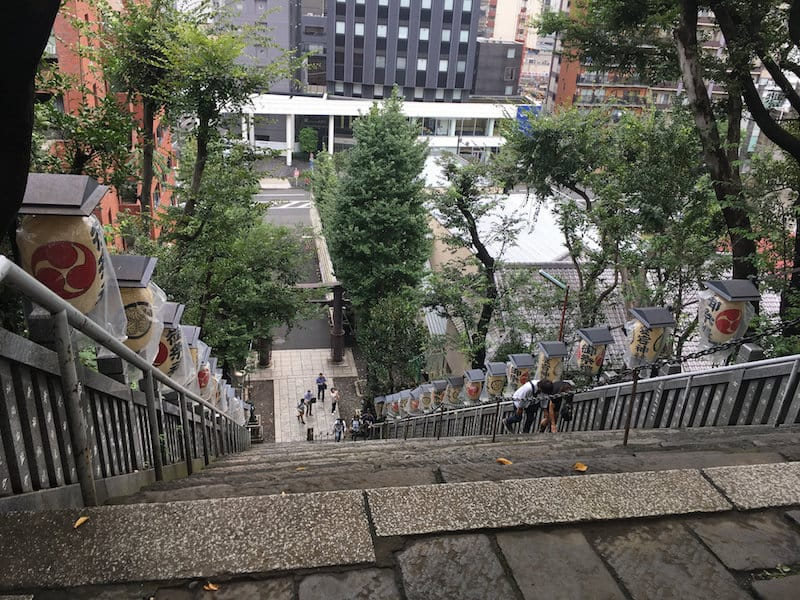
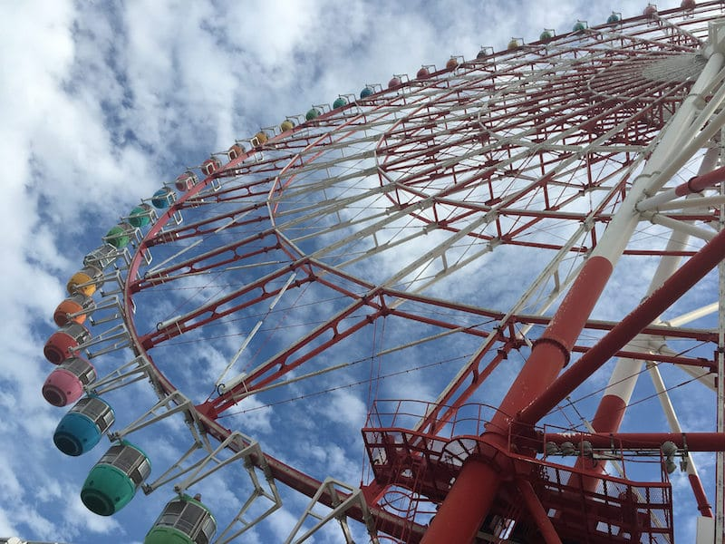
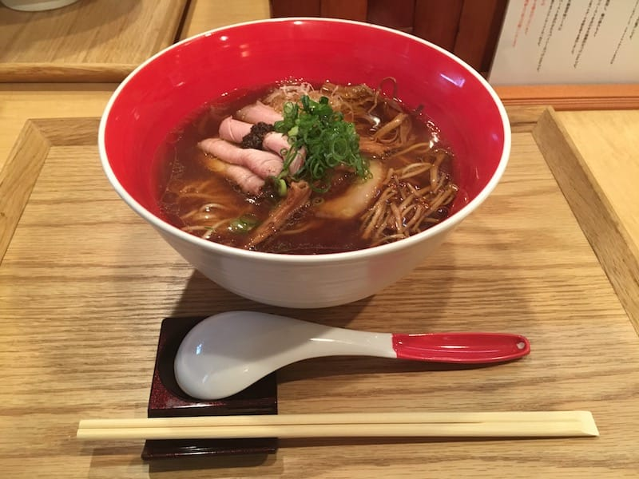
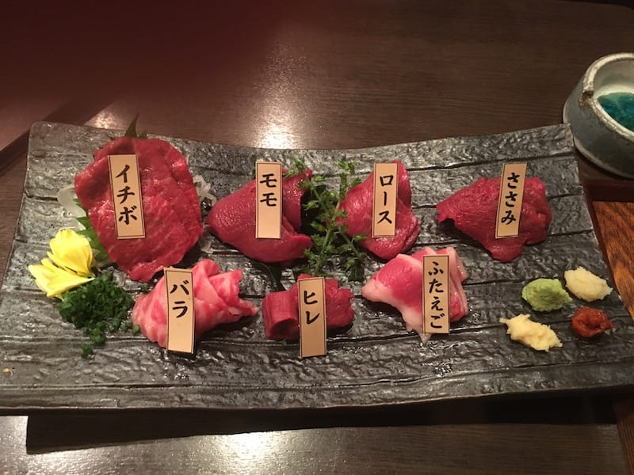
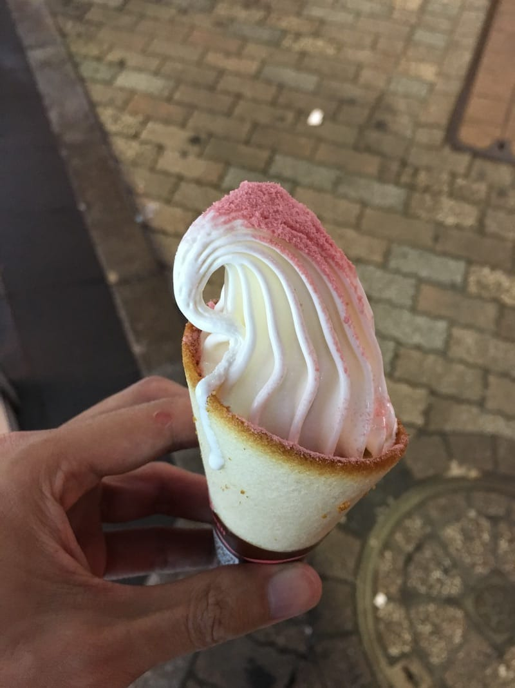
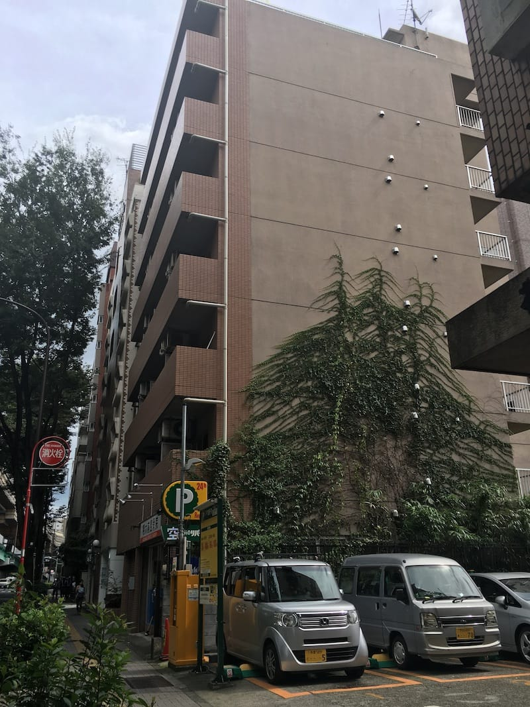
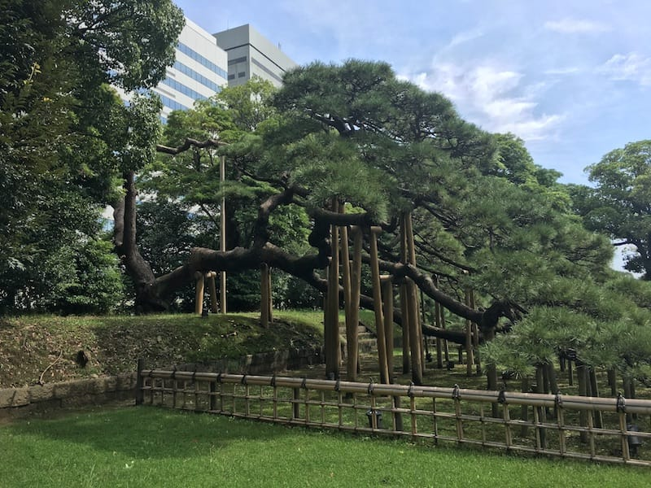
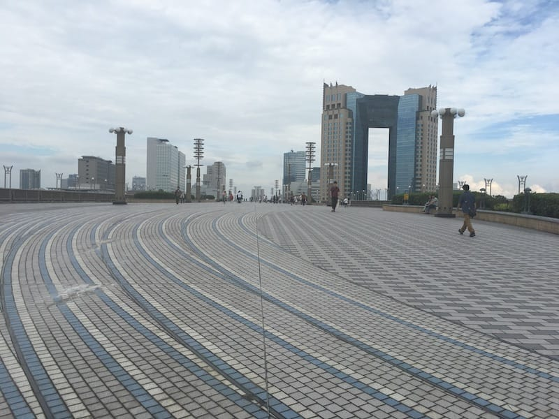
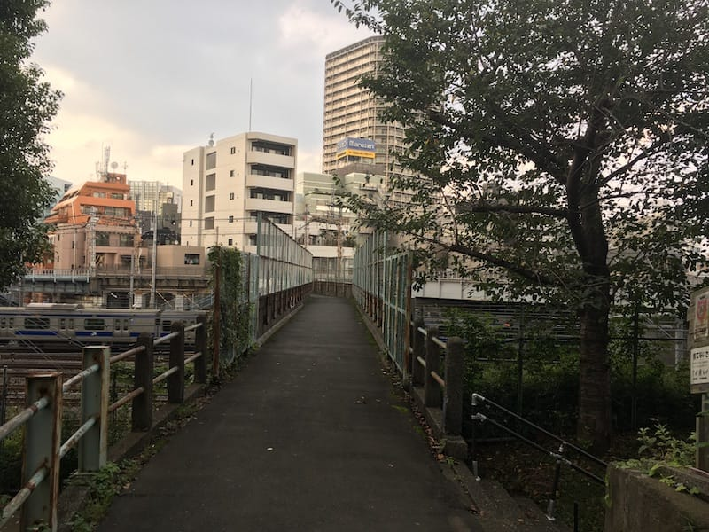

2016 in review
===

I've been writing this review thing for quite a long while, and the past [two](/blog/2014/12/2014-in-review/) [years](/blog/2015/12/2015-in-review/) were pretty *epic* in my opinion. Now it's that time again to look back and see what happened and what I've done.

The *little* things:

- [14 Kopi.JS meetups](https://medium.com/kopi-js-community/kopi-js-in-2016-cf1b64f3f74a) organized this year. ☕️
- On January, I moved my [3-year-old app away from AppFog](https://twitter.com/cheeaun/status/682945640037388288).
- I [accidentally](https://twitter.com/cheeaun/status/683309888676564992) [built](https://twitter.com/cheeaun/status/683495506031448064) [RailRouter SG](https://twitter.com/cheeaun/status/683630691968397312). With [exits](https://twitter.com/cheeaun/status/684668992003248129)/[entrances](https://twitter.com/cheeaun/status/685105246301863938). Also made it more [beautiful](https://twitter.com/cheeaun/status/685761029591011328), [complete](https://twitter.com/cheeaun/status/686477545118646272) and [functional](https://twitter.com/cheeaun/status/687205902751944704). [Launched it](https://twitter.com/cheeaun/status/687826686625198080) on the 15th. 🚀
- I drew the [pixelated Kopi.JS logo](https://twitter.com/cheeaun/status/687132633118064640) with [Aseprite](https://www.aseprite.org/).
- My RailRouter SG app got featured on Winnie's article, [Makers making together](https://medium.com/@wynlim/makers-making-together-d5c50a0747f5#.hcm9l5kwo).
- I [ate wanton mee](https://twitter.com/madebyjw/status/690504861239013377) with Jian Wei and Joshua.
- My [Steepless](https://github.com/cheeaun/steepless) app got [featured by React Rocks](https://twitter.com/React_Rocks/status/690919457867169792).
- I published '[Building side projects](https://twitter.com/cheeaun/status/691644100244688896)' 📝. I also gave a talk about it [*twice*](https://twitter.com/cheeaun/status/693065472103682049) at the [General Assembly Web Development Immersive class](https://www.facebook.com/photo.php?fbid=10153701648345189&set=a.10153571215710189.1073741834.608990188&type=3&permPage=1) and [the NUS Friday Hacks #106](http://nushackers.org/2016/01/friday-hacks-106-Jan-29/) 🗣. [Thanks](https://twitter.com/vinhnglx/status/691656613090824193) [for](https://twitter.com/sayanee_/status/691770145136574464) [all](https://twitter.com/kentkadim/status/691824456122109953) [the](https://twitter.com/winstonyw/status/691833900675506177) [nice](https://twitter.com/samratshaw/status/693029072276840449) [feedback](https://twitter.com/UpWorks/status/693054984368185345)! 😊
- On February, I [started working](https://twitter.com/cheeaun/status/699187300295536640) at [Tech In Asia](https://www.techinasia.com/), after almost [4 months](https://twitter.com/cheeaun/status/657395165691146240) of *unpaid sabbatical*.
- I started [sending out TestFlight invites](https://twitter.com/cheeaun/status/700641588041502720) for my [HackerWeb](http://hackerwebapp.com/) app for iOS.
- On March, I [launched my first ever iOS app](https://twitter.com/cheeaun/status/704697299922919424) on the App Store. I [published](https://twitter.com/cheeaun/status/707735647134437376) '[Building HackerWeb for iOS](/blog/2016/03/building-hackerweb-ios/)'. 🚀📝
- I received a few cool [Hacktoberfest stickers from Digital Ocean](https://twitter.com/cheeaun/status/707542539771858945). 👾
- I [played basketball](https://twitter.com/cheeaun/status/710678145490243585) in the Facebook Messenger app.
- I attended [FOSSASIA 2016](http://2016.fossasia.org/).
- I voluntarily printed [stickers for SingaporeCSS and SingaporeJS meetups](https://twitter.com/cheeaun/status/711064410983309313). 👾
- I [launched TaxiRouter SG](https://twitter.com/cheeaun/status/712809348230066176) and [published](https://twitter.com/cheeaun/status/714619229618606080) '[Building TaxiRouter SG](/blog/2016/03/building-taxirouter-sg/)'. 🚀📝
- On April, I [attended the Tech In Asia Singapore conference](https://twitter.com/cheeaun/status/719707096384540672).
- I [launched my first ever Android app](https://twitter.com/cheeaun/status/722800946053394433) on Google Play and published '[Building HackerWeb for Android](/blog/2016/05/building-hackerweb-android/)' few weeks later 🚀📝
- I [co-organized Geek Brunch SG](https://twitter.com/geekbrunchsg/status/726330597031858176) with Sayanee and Michael 😁. Also co-written '[The story of Geek Brunch Singapore](https://medium.com/we-build-sg/the-story-of-geek-brunch-singapore-943c3c99515f)'.
- On March, someone [caught me looking at my streaming Twitter feed](https://twitter.com/huiyileeee/status/729949926424117248). 👀
- I [gave a talk](https://twitter.com/woohuiren/status/733270479964774400) [on my TaxiRouter SG project](https://twitter.com/cliener/status/733276057604784129) [at the SingaporeJS meetup](https://engineers.sg/video/taxi-router-talk-js--737). 🗣
- I [found](https://twitter.com/cheeaun/status/733508759721377792) [my first pull request](https://github.com/jquery/jquery-ui/pull/11) for the jQuery UI project on GitHub.
- I tried [Apple Pay with my iPhone 6S at Toast Box](https://twitter.com/cheeaun/status/735353321867841536). Pretty amazing.
- I tried [UberEATS](https://twitter.com/cheeaun/status/735684613842960385).
- I printed [stickers of my HackerWeb logo](https://twitter.com/cheeaun/status/736388132568862721). 👾
- On June, I [got sick for a whole week](https://twitter.com/cheeaun/status/741836646639796224) and did [a few blood tests](https://twitter.com/cheeaun/status/742549511537451008). 😷
- I bought [a React Native t-shirt](https://twitter.com/cheeaun/status/742376103256330240) from [Teespring](https://teespring.com/shop/react-native-fan). 👕
- I attended [Echelon Asia Summit 2016](https://e27.co/echelon/asia/).
- I [got featured](https://twitter.com/cheeaun/status/744732576904949760) on [Digital News Asia](https://www.digitalnewsasia.com/digital-economy/datasets-rest-us-datagovsg). 😎
- I [attended](https://twitter.com/cheeaun/status/745784891644719104) [RedDotRubyConf](https://twitter.com/cheeaun/status/746161599954690049) and [helped a little](https://twitter.com/JuanitoFatas/status/746278748882755584).
- I was [interviewed](https://twitter.com/cheeaun/status/745900777164636160) and [appeared](https://twitter.com/cheeaun/status/746003325007495168) [on](https://www.facebook.com/cheeaun/posts/10154099796376294) [Channel 8 News](https://www.youtube.com/watch?v=8zH8fbUNdKI). 📺
- I had [a *fun* conversation](https://twitter.com/jsstrn/status/746997997964169216) with [Huiren](https://twitter.com/woohuiren) on Twitter. 😂
- I gave a talk on [Introduction to Electron](https://engineers.sg/video/introduction-to-electron-singapore-php-user-group--837) at the [Singapore PHP Meetup](https://www.facebook.com/events/1029564810445427/). 🗣
- On July, I received [a few nice stickers](https://twitter.com/cheeaun/status/749984711011819520) from [DevSwag](https://devswag.com/). 👾
- I started [playing Pokémon Go](https://twitter.com/cheeaun/status/750547880805593089).
- I [published](https://twitter.com/cheeaun/status/751386198044618756) '[Being invisible](/blog/2016/07/being-invisible/)', the most honest and *bravest* blog post I've ever written. Also surprised to be [mentioned by Winnie on her writing](http://journal.winnielim.org/learning-to-be-a-human-being). 📝
- I built [Kopi](https://twitter.com/cheeaun/status/752174327064203264) [Maker](https://twitter.com/cheeaun/status/752874588170629122), a simple interface to generate Kopi names based on the ingredients, *states* and *expressions*. ☕️🚀
- I dined at the [Pokémon Cafe](https://www.instagram.com/p/BHzeoNohgMU/).
- I [launched Repokémon](https://twitter.com/cheeaun/status/753762545656172544) and [published](https://twitter.com/cheeaun/status/761391635053674499) '[Building Repokémon](/blog/2016/08/building-repokemon/)' a month later. 🚀📝
- Somehow I [got featured on VentureBeat](http://venturebeat.com/2016/07/27/space-chickens-and-other-strange-pictures-people-have-sent-to-wtf-is-that-bot/) because I [tweeted about the WTFIT bot](https://twitter.com/cheeaun/status/727791783971721216) 😎🐔
- On August, I [shared my findings on my MacBook, Nexus 5X, iPhone 6S and USB-C experiment](https://www.facebook.com/cheeaun/posts/10154217567516294).
- I accidentally [triggered 'Hey Siri' by just watching a YouTube video](https://twitter.com/cheeaun/status/764654413860528128). 😅
- I finally invested in [custom-printed Kopi.JS t-shirts](https://twitter.com/cheeaun/status/765883251688927233) by [Cottony](http://www.cottony.sg/), after so many months of consideration and experimentation. 👕
- I printed [a few stickers](https://www.instagram.com/p/BJUzDKkBa8y/) for [TechLadies](http://www.techladies.co/) and got [free Pokémon stickers](https://twitter.com/cheeaun/status/766964825125597184) from [StickerHD](https://stickerhd.com/)! 👾
- I [had](https://www.facebook.com/cheeaun/videos/10154248188206294/) [Salted Egg Prata Bom](https://www.instagram.com/p/BJX8CeZB4v2/). 💥
- I [attended](https://twitter.com/cheeaun/status/767901228735094784) [PHPConf.Asia](https://twitter.com/cheeaun/status/768265980925665280).
- It [was publicly announced](https://twitter.com/jsconfasia/status/769055813457543171) that I'm one of the [JSConf.Asia](https://2016.jsconf.asia/) speakers.
- I found [a very old photo of me giving a talk](https://www.flickr.com/photos/maltman23/4247730193/) at a conference called 'Neoteny Singapore Camp' back in December 2009.
- I [gave a talk](https://twitter.com/SingaporeCSS/status/770624036715892737) [about Repokémon](https://engineers.sg/video/repokemon-talk-css--1041) at the [SingaporeCSS meetup](https://www.meetup.com/SingaporeCSS/events/232766411/). 🗣
- On September, I [bought two shirts](https://twitter.com/cheeaun/status/772669093753126912) from [Cotton Bureau](https://cottonbureau.com/). 👕
- I bought [custom-printed Kopi.JS magnets](https://twitter.com/cheeaun/status/777531446302871553) from [Sticker Mule](https://www.stickermule.com/products/custom-magnets). 👾
- I bought [a formal made-to-measure shirt](https://twitter.com/cheeaun/status/778615578399416320) from [Edit Suits](http://www.editsuits.com/), in preparation for my cousin's wedding. 👕
- I [passed the Basic Theory Test](https://twitter.com/cheeaun/status/778772323994181633) for converting my Malaysia driving license to Singapore driving license.
- I [published](https://twitter.com/cheeaun/status/779135409422860288) '[Designing artwork for RedDotRubyConf 2016](/blog/2016/09/designing-artwork-reddotrubyconf-2016/)'. 📝
- I [attended](https://twitter.com/cheeaun/status/781301145079865346) [LINE Developer Day](http://linedevday.linecorp.com/jp/2016/) in Tokyo.
- On October, I [got](https://twitter.com/uzyn/status/784216794089201665) [featured](https://twitter.com/heliumlife/status/784217428410544128) by [Dr. Yaacob Ibrahim](https://www.parliament.gov.sg/mp/yaacob-ibrahim) at the [GovTech](https://www.tech.gov.sg/) conference. 😎
- Finally I [got my Singapore driving license](https://twitter.com/cheeaun/status/786892294620188672).
- I [attended](https://twitter.com/cheeaun/status/788921436182343682) [iOS Conf SG](https://twitter.com/cheeaun/status/789283295536099329). Designed [some stickers too](https://twitter.com/cheeaun/status/789099088939589632). 👾
- I bought the [Samsung Portable SSD T3](https://www.facebook.com/cheeaun/posts/10154441401556294), 1TB space with USB-C port. No more Micro-B SuperSpeed port.
- I attended [Geekcamp.SG](https://www.geekcamp.sg/).
- On November, I [designed a panda wearing a pair of glasses](https://twitter.com/cheeaun/status/793791324591841280).
- I [released a new side project](https://twitter.com/cheeaun/status/795433901871112193) called [Nobita](https://github.com/cheeaun/nobita). 🚀
- I [printed even more stickers](https://twitter.com/cheeaun/status/795953046761050112). 👾
- My [Skype account got hacked](https://twitter.com/cheeaun/status/799152247435247616). 😡
- I [bought Google Pixel and Chromecast Ultra](https://twitter.com/cheeaun/status/800597477468446720) via [ShopandBox](http://www.shopandbox.com/), to replace my *old* Nexus 5X and Chromecast (non-ultra). 📱
- I [attended the Product Hunt meetup](https://twitter.com/cheeaun/status/800667609595199488) at the [new Google office](https://www.meetup.com/Product-Hunt-Singapore-Meetup-Group/events/234747587/).
- I [bought yet another t-shirt](https://twitter.com/cheeaun/status/801081510476464129) from Cotton Bureau. 👕
- I [attended CSSConf.Asia](https://twitter.com/cheeaun/status/801588036677025798) and [gave](https://twitter.com/zellwk/status/802065265106092032) [a](https://twitter.com/uzyn/status/802068434246717440) [talk](https://twitter.com/jacobtyq/status/802072670921629696) [at](https://twitter.com/cheeaun/status/801956680636502016) [JSConf.Asia](https://twitter.com/cheeaun/status/802339384708235264). 🗣
- On December, I [received free Dribbble stickers from Sticker Mule](https://twitter.com/cheeaun/status/804229555472842754). 😻👾
- I [got featured](https://twitter.com/techinasia/status/806294919979507712) on [Tech In Asia's Developer Spotlight column](https://www.techinasia.com/talk/developer-spotlight-this-frontend-dev-wont-tell-you-where-to-start). 😎
- I *celebrated* my [10-year Twitter anniversary](https://twitter.com/cheeaun/status/810281727042031617).
- I *celebrated* my [4K Foursquare/Swarm check-in milestone](https://twitter.com/cheeaun/status/810690299391459328).
- I [got my AirPods](https://twitter.com/cheeaun/status/812209154601275393), before Christmas. 🎄🎁 Also [reviewed it](https://www.facebook.com/cheeaun/posts/10154695783141294).
- I published '[Bridging connections](blog/2016/12/bridging-connections/)', an extended written version of the talk I gave at JSConf.Asia. 📝

Some statistics; I've attended **9 conferences**, launched **7 side projects**, and written **9 blog posts** (including this one) this year.

As for my travels, I'm kind of toning it down a bit this time, compared to my previous *adventurous* two years.

Tokyo
---

I didn't plan this trip initially but somehow I got a free ticket to the [LINE Developer Day](http://linedevday.linecorp.com/jp/2016/), so… why not?

On [September 23](https://twitter.com/cheeaun/status/779258921949106176), I departed from Singapore to Tokyo Haneda Airport (HND) with a stopover at Suvarnabhumi Airport (BKK). By the time I reached there, it's already September 24 and the conference is held on September 29, so basically I only have 5 full days of doing *touristy* stuff.

This is my second time in Tokyo and honestly, it feels *really* good to be back. I know my way better now, including all the opening/closing times and station exists/entrances.

This time, Tokyo [felt warm](https://twitter.com/cheeaun/status/779869648984477696) to me as I sweated every time I walk around the city. It rained on the first day and last day so I have to buy those transparent umbrellas from the convenience stores. 😅

I tried [matcha](https://www.instagram.com/p/BKuo5bpAz1l/), [unagi don](https://www.instagram.com/p/BKuwFV2A1Dm/), [sushi](https://www.instagram.com/p/BKxBthaAyro/) and [Ichiran](https://www.instagram.com/p/BKvTKOsgLfD/) [ramen](https://www.instagram.com/p/BKxzy_LAhSR/) [again](https://www.instagram.com/p/BKx1iLpAjYG/). I saw not one but **two** Ferris wheels; one at [Odaiba](https://www.instagram.com/p/BKxiCRngGui/) and another one at [Kasai Rinkai Park](https://www.instagram.com/p/BKxiTPXggWN/). I tried the [ramen at the Michelin-starred Tsuta restaurant](https://www.instagram.com/p/BKzsSwcgzXc/). I tried [taking the bus](https://www.instagram.com/p/BK47go1A_6O/) instead of the usual trains.

I've also tried **two** exotic meals; [raw horse meat](https://www.instagram.com/p/BK0pM3QgSFp/) 🐴 and [whale sashimi](https://www.instagram.com/p/BK2GB0Tgg13/) 🐳. Not forgeting the quite-hyped [melon pan](https://www.instagram.com/p/BK2e8-igHRB/), [okonomiyaki](https://www.instagram.com/p/BK8S1vyACq5/), the [7-shades-of-green](https://www.instagram.com/p/BK5S7UxgINb/) [Nanaya matcha ice cream](https://www.instagram.com/p/BK5TB9yAExb/) and the **must-try** oh-my-god-super-milky [Cremia](https://www.instagram.com/p/BK8Uf0QADO_/). 😋😋😋

I visited a few places, mostly the ones I didn't manage to go on my previous trip:

- [Pokémon Store](https://foursquare.com/v/%E3%83%9D%E3%82%B1%E3%83%A2%E3%83%B3%E3%82%B9%E3%83%88%E3%82%A2-%E6%9D%B1%E4%BA%AC%E9%A7%85%E5%BA%97/52a52e8311d2677d8b045583)
- [Hamarikyu Gardens](https://www.instagram.com/p/BKxhkj5AKZS/)
- [Venus Fort](https://www.instagram.com/p/BKxhtFWg_Iy/)
- [Tokyo Sea Life Park](https://www.instagram.com/p/BKxvXS3gfUk/)
- [Pokémon Center Mega Tokyo](https://foursquare.com/v/%E3%83%9D%E3%82%B1%E3%83%A2%E3%83%B3%E3%82%BB%E3%83%B3%E3%82%BF%E3%83%BC-%E3%83%A1%E3%82%AC%E3%83%88%E3%82%A6%E3%82%AD%E3%83%A7%E3%83%BC-pok%C3%A9mon-center-mega-tokyo/546688fa498efb616379c044)
- [J-World Tokyo](https://www.instagram.com/p/BK0Au_vA70P/)
- [Sunshine Acquarium](https://www.instagram.com/p/BK0BAzzgh01/)
- [Yanaka Ginza](https://www.instagram.com/p/BK0BYesgSJC/), so-called "[Cat Town](https://www.instagram.com/p/BK0Bgk_gawg/)"

I also found [Saitama's apartment](https://www.instagram.com/p/BK4nCO-Adqx/) (character from [One Punch Man](https://myanimelist.net/anime/30276/One_Punch_Man) anime, via [Reddit](https://www.reddit.com/r/OnePunchMan/comments/3yzuja/saitamas_houseapartment_is_real/)).

A few more photos:

I flew back to Singapore on [September 30](https://twitter.com/cheeaun/status/781659713066807296).

Some stats:

- 120 Foursquare/Swarm checkins.
- 45 Instagram photos.
- 21 tweets.
- [507 photos and 10 videos](https://www.flickr.com/photos/cheeaun/albums/72157674625807336) on Flickr.

Best year yet
---

Even though I had less travels this year, it's been my best year yet as I write more, give more talks, release more side projects, meet more people, got interviewed a few times, and got featured by other people and publications a few times.

2015 was the year when my life took an unexpected turn and 2016 *turned* it around again, in a surprisingly positive way. It's rather unexpected but I guess that's what makes life so interesting.

Looking forward to 2017. 🚀
