Designing Super Silly Hackathon
===

Two weeks ago, I gave a talk on "CSS-ing the Super Silly Hackathon website" at [Talk.CSS #23 Party Edition 🎉](https://singaporecss.github.io/23/) meetup. I realised that I didn't give any talks at all since last year in *any* meetups, so this is basically my **first** talk of the year and perhaps my last for this year 😌

[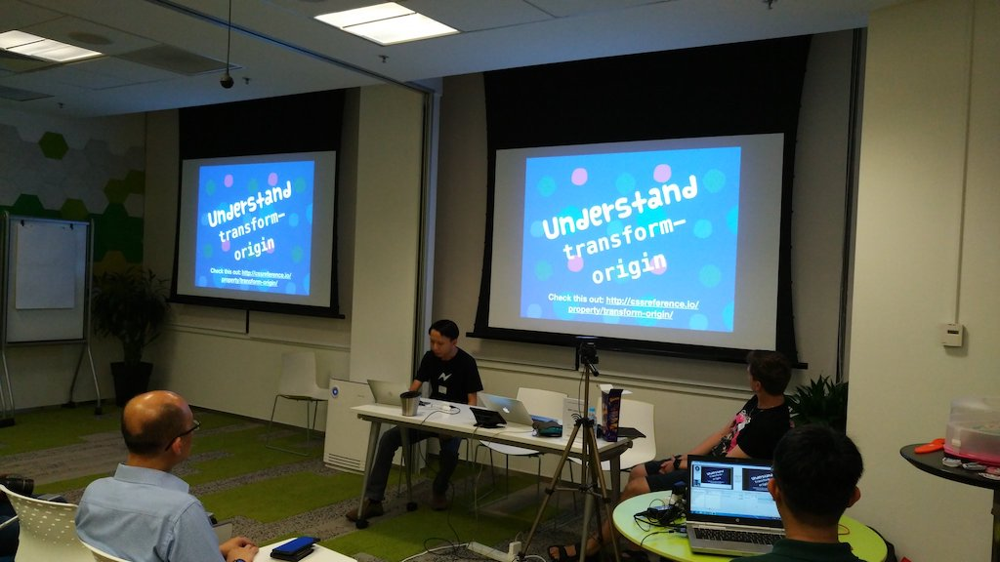](https://twitter.com/hj_chen/status/935837598265720832)

The video of my talk is [available on Engineers.SG](https://engineers.sg/v/2156) ([YouTube](https://www.youtube.com/watch?v=4k0cAQLjDtg)) and the slides are on [my `talks` repository](https://github.com/cheeaun/talks/tree/master/css-super-silly-hackathon).

It's a 20-minute talk as I try to keep it short, so not everything is revealed. Thus, I'm going to write them down here.

🤔 What is Super Silly Hackathon?
---

It's an initiative *sparked* from a Facebook post by [Min](https://twitter.com/ongmin) on September 29, which is then followed by 4 enthusiastic people including myself who somehow got into organizing a totally different kind of hackathon, inspired by [The Stupid Hackathon](http://lav.io/2014/11/stupid-projects-from-the-stupid-hackathon/).

In short, instead of focusing on building something to make the world a better place, it's an *unhackathon* for building something silly that no one ever needs 🤷‍♂️

Turns out there were already few stupid hackathons around the world:

- New York (original) <http://www.stupidhackathon.com/>
- San Francisco <http://stupidhackathon.github.io/>
- Toronto <http://stupidhacktoronto.com/>
- Amsterdam <http://www.stupidhackathon.wtf/>
- and *more* on [this list that I've compiled](https://gist.github.com/cheeaun/c3fe6cbb11aef1e146a3474dccf63b87)...

🎨 Design time
---

For the past few months, I've been [sort of active](https://dribbble.com/shots/3654189-Geekcamp-SG-logo-proposal) [in designing logos](https://dribbble.com/shots/3711505-iOS-Conf-SG-logo-proposal-4th-iteration) [for the community](https://dribbble.com/shots/3727547-Engineer-SG-logo-proposal-2) 😉 So, I volunteered to design the logo for Super Silly Hackathon and came up with this around October:


The font is [Vanilla](https://www.fontsquirrel.com/fonts/vanilla) designed by Cutie Explosion, as I wanted it too look like Comic Sans but not too much. The color scheme and art style is mostly **inspired** by a conference web site called [Keep Ruby Weird](https://keeprubyweird.com/) *and* [the opening of Boruto anime](https://www.youtube.com/watch?v=9prtl1aVcdM) (Yes, that's [Naruto](https://en.wikipedia.org/wiki/Naruto)'s son).

For some reason, I tilted the text to give the impression of silliness, which later became the art *direction* of the whole web site. After a while, I felt that there were too many colors competing each other, so I adjusted and reduced the colors a bit:

[](https://dribbble.com/shots/3897354-Super-Silly-Hackathon-branding)

All the colors have 100% saturation, no straight lines and no perfect circles 😜

And… **UniCat** as the mascot (mascat?)!

[](https://dribbble.com/shots/3923537-Unicat)

It's everyone's favorite cat with a unicorn-like pink horn, creepy green eyes, cute red nose, two-instead-of-three blue whiskers and a cool purple bow tie. As I mentioned, there are no perfect circles. Every "circle" glyph, including the cat face and eyes, comes from the [tittle](https://en.wikipedia.org/wiki/Tittle) of the letter 'i' of the Vanilla font!

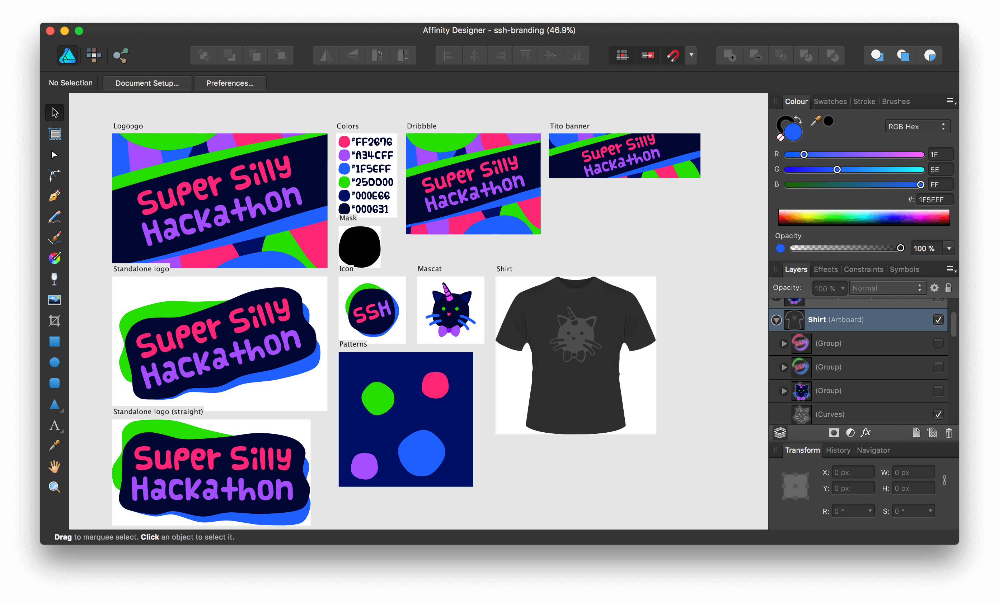

I use [Affinity Designer](https://affinity.serif.com/en-gb/designer/) and **all files** are [open-sourced on GitHub](https://github.com/supersillyhackathon/branding).

😎 Webmaster mode
---

Over the years, I've always been fascinated by **unique** website designs, usually inspired by other mediums such as print magazines. I did [a large header design](https://github.com/cheeaun/csszengarden-greenmind) [for my personal site](http://cheeaun.com/blog/2005/05/rebooted-into-greenery/) in 2005 (12 years ago! 😱). I made [a horizontal-scrolling](https://twitter.com/cheeaun/status/882967448) [Tumblr theme](http://litewireh.tumblr.com/) in 2008 (9 years ago! 😱).

Once again, I'm reminded by [Hui Jing's talk](https://github.com/huijing/slides/tree/gh-pages/ffc-2017) on [drawing inspiration from graphic design and print designs](https://www.chenhuijing.com/blog/rethinking-web-design/) that couldn't be built before, but they can be *now*.

As I look at the logo and think how I could make it *different* this time, I wonder if it would be horizontal scrolling *again* or something else? [Horizontal scrolling](https://www.awwwards.com/websites/horizontal-layout/) is not *that* new anymore, so why not… **diagonal**? 🤔

Yeah, why not?

Lo and behold.

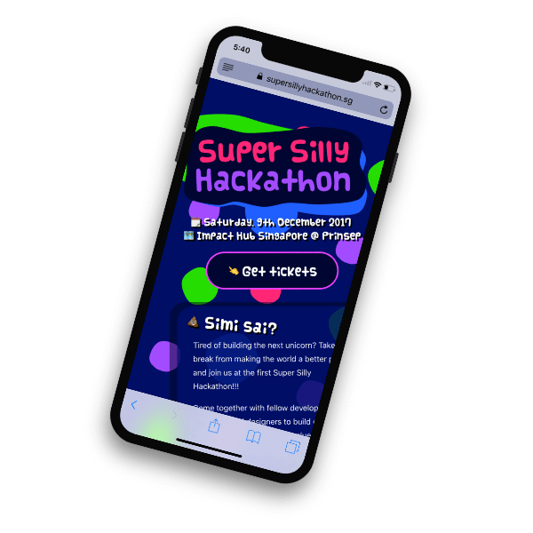

This is not a visual or Photoshop trick. There's nothing wrong with the phone frame. I purposely tilt it so that the site itself would look… vertical.

It's pretty difficult for me to explain to people how cool the site is until I tell them to try it on their phones. And when they try it out, I **absolutely love** the reaction on their faces!

At first, I don't fully understand why I tilt the logo for that *impression* of silliness. Until I see someone else look at the site on his/her phone, I realised that the person has to tilt the head *or* the phone to read the site, which in turn make themselves look silly! 🤣

Go on, try the site now at [supersillyhackathon.sg](https://supersillyhackathon.sg). I've also prepared [a video to show how the scrolling feels like on Mobile Safari](https://www.youtube.com/watch?v=lIdB466G90E).

[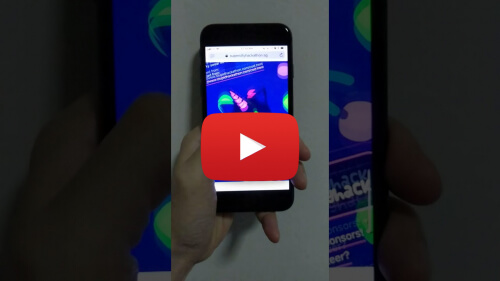](https://www.youtube.com/watch?v=lIdB466G90E)

This could be the **world's first diagonal-scrolling web site**!

I posted a sneak peek on [Twitter](https://twitter.com/cheeaun/status/923740722196463618) and [Facebook](https://www.facebook.com/cheeaun/videos/10156139209691294/) on October 27. I [officially launched](https://twitter.com/cheeaun/status/933526704273756160) [the site](https://www.facebook.com/cheeaun/posts/10156232920531294) on November 23.

🔮 Diagonal sorcery magic
---

Some folks ask me how I did the diagonal scrolling thing. I suspect most people thought that it's *just* `transform: rotate(-15deg)`.

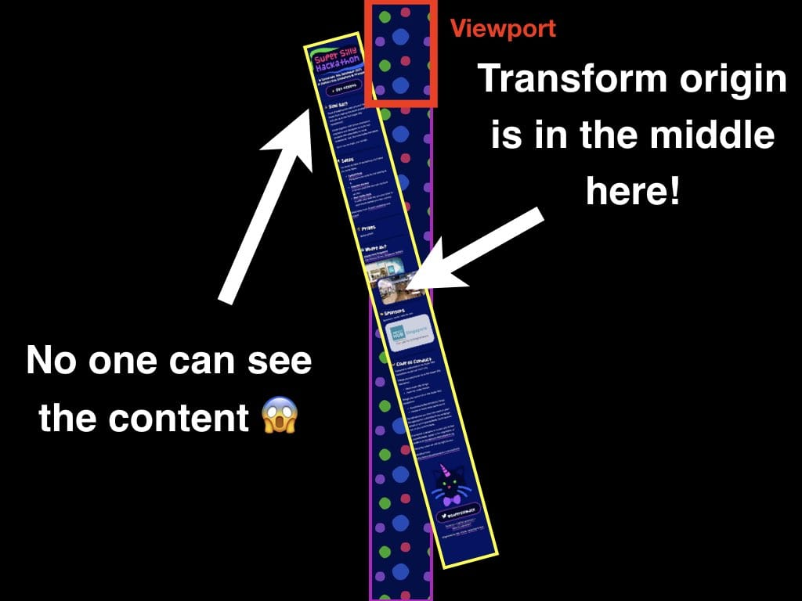

Nope, not that easy. By default, CSS `transform-origin` is at the center of the element. If the whole content (yellow bordered box) is rotated, the top part of the page would be shifted and hidden from the viewport (red bordered box) and no one can see the content 😱

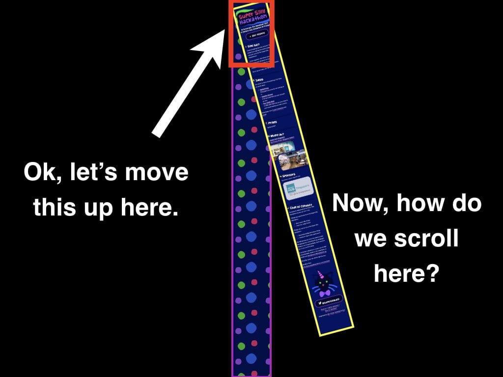

What I need to do is to move the content *up*, to the viewport area. Now, how do we scroll here? If you scroll downwards, you'll see nothing again because the rotated content is slowly shifted to the right. It's kind of weird. Should the user scroll horizontally to see the other *side* of the content? What happens if the user pinch zoom out of the page on mobile browsers?

I've made a few attempts.

**First attempt: Move the `transform-origin`**. I personally find this weird but if you [understand `transform-origin` well enough](http://cssreference.io/property/transform-origin/), it's possible to actually move things around with it. Usually, we transition or animate elements based on the origin, but now we transition the origin itself!

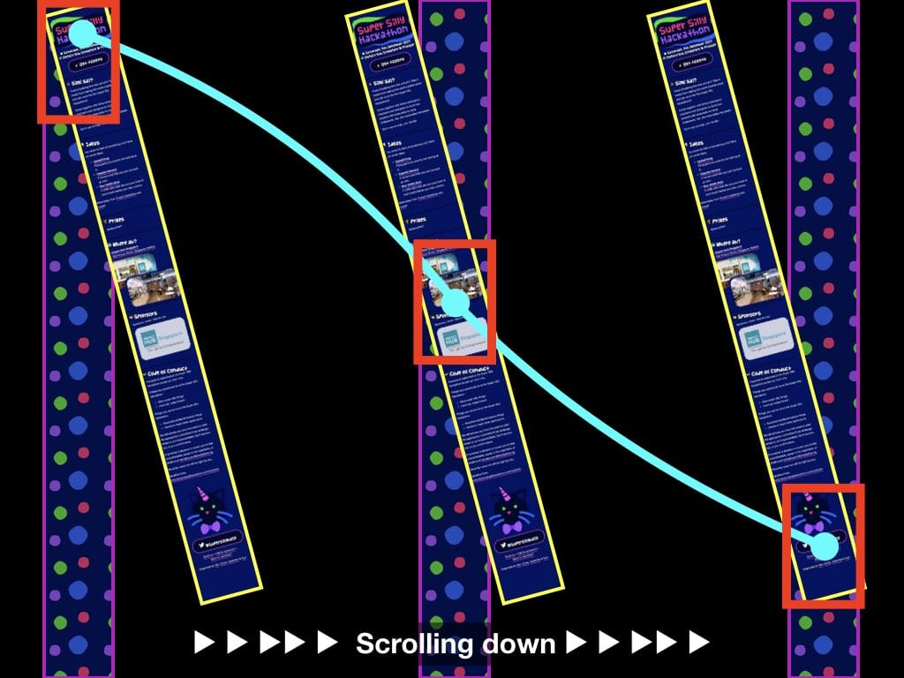

As the page is scrolled downwards, I wrote a piece of JavaScript code to get the top scroll offset of the page and manipulate the `transform-origin` of the rotated element (yellow bordered box).

It's pretty cool and I was really mind-blown that this actually works!

```
window.onscroll = function(){
  var top = window.scrollY || window.pageYOffset;
  var origin = top + window.innerHeight/2;
  container.style.transformOrigin = 'center ' + origin + 'px';
}
```

As simple as… that 😱

Unfortunately, it's a bit slow and my gut feeling tells me that transitioning `transform-origin` is weird and doesn't feel right.

This leads to my **second attempt: `translateX` CSS with awesome Math**.

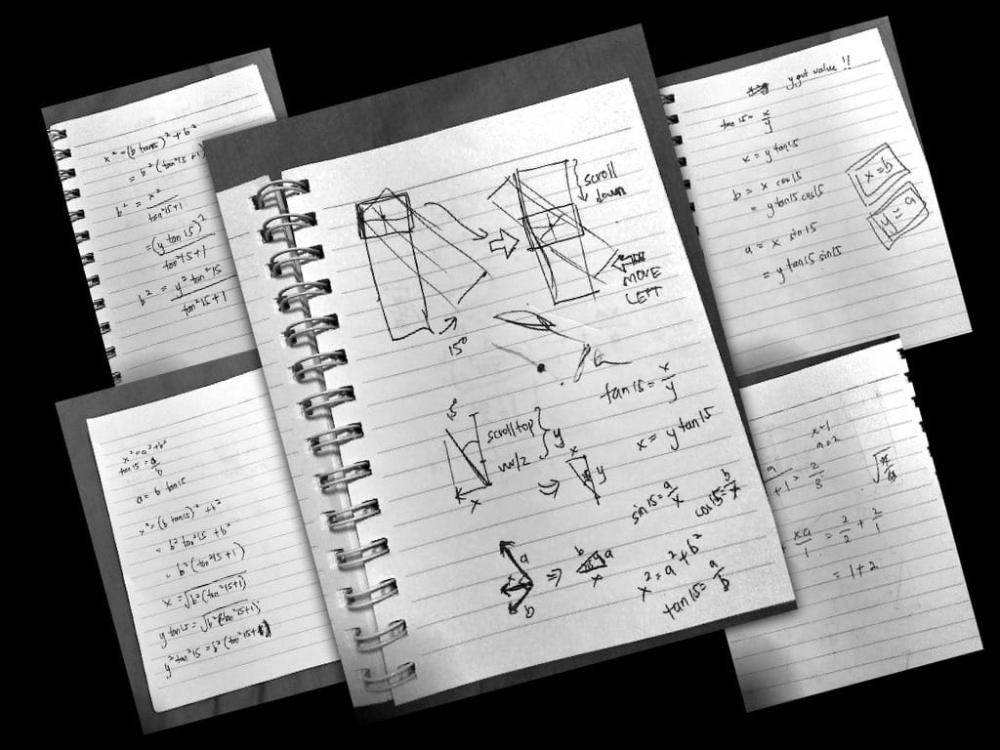

I took out my trusty notebook and started sketching. I looked up the Internet, found the formula that I've forgotten the name and realised that it's called [Pythagorean theorem](https://en.wikipedia.org/wiki/Pythagorean_theorem). I made a few mistakes and miscalculations in the beginning but somehow manage to slowly revive my good old Math skills.

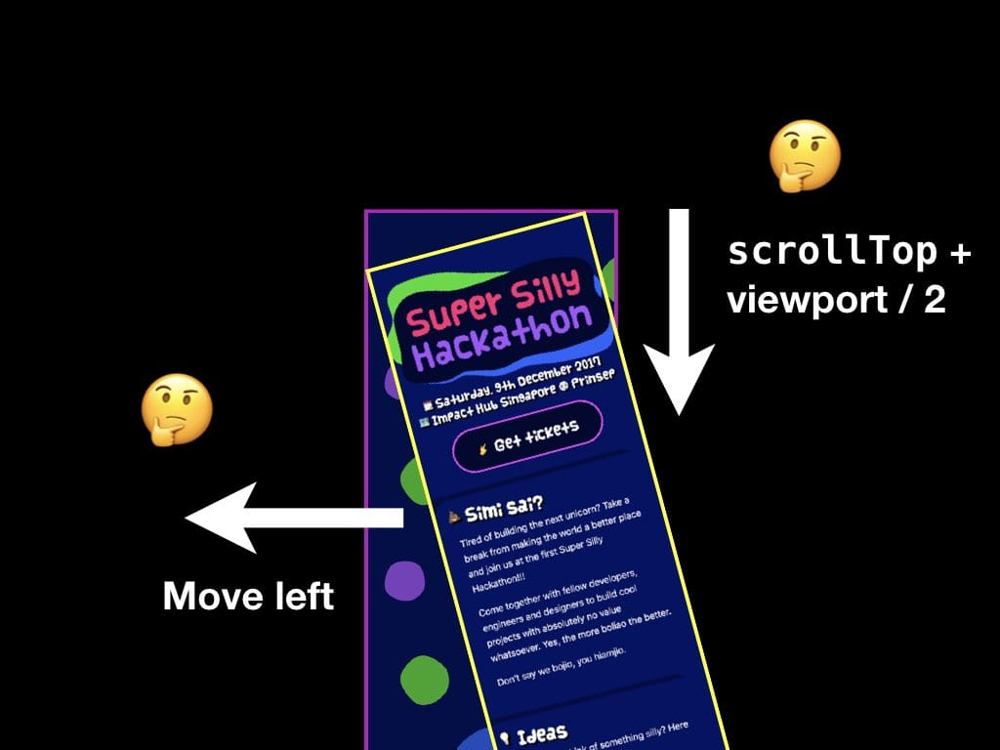

First, the basics; scroll down, move content to the left. I'll need the `scrollTop` value in addition to the viewport height divided by 2, because the origin is somewhere around there.

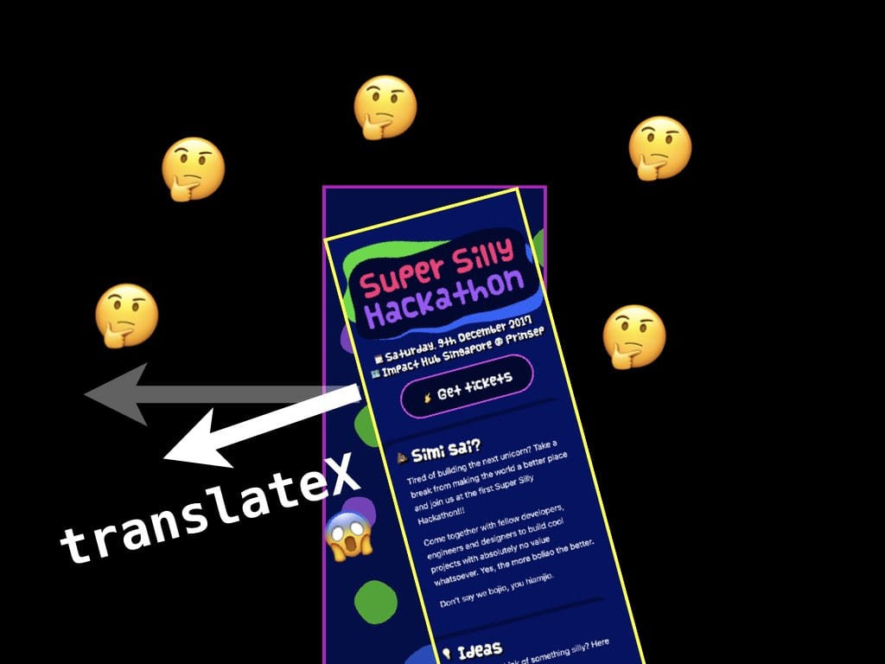

Unfortunately, things don't always go the way you want. Turns out that `translateX` doesn't move to the actual left. Since the content (yellow bordered box) is rotated, the whole X/Y axis has been rotated so `translateX` will eventually move to the **bottom** left 😅

At this point, awesome Math is definitely needed to solve the problem.

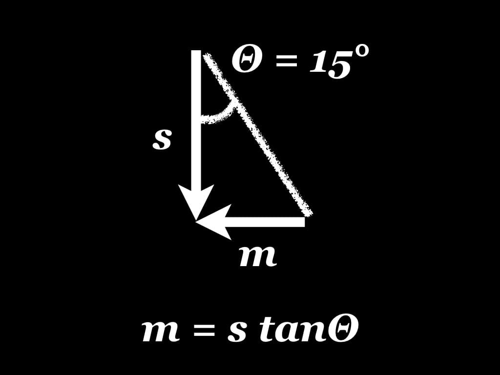

Yeap. `m = s tanΘ`. `s` is roughly the scroll top offset, `m` is the horizontal translation of the content and `Θ` is 15° because I'm the one who purposely set it.

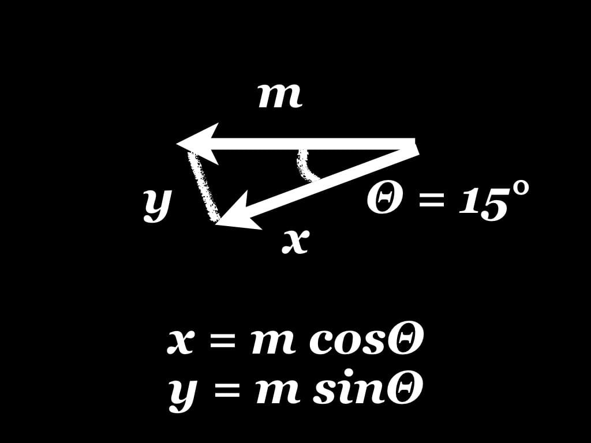

Yeap again. `x = m cosΘ` and  `y = m sinΘ`. In order to move to the real left, I need to get the `x` and `y` values, as the content will move to bottom left (`x`) then move up again (`y`).

With all these formulas combined, **magic happens** and everything works **exactly the same way** as my first attempt! Zero compromise on *functionality* but more lines of code now:

```
var rad15deg = 15 * Math.PI / 180;
var tanRad15deg = Math.tan(rad15deg);
var cosRad15deg = Math.cos(rad15deg);
var sinRad15deg = Math.sin(rad15deg);
var bodyStyle = document.body.style;

window.onscroll = function(){
  var top = window.scrollY || window.pageYOffset;
  var a = -top * tanRad15deg;
  var x = a * cosRad15deg;
  var y = a * sinRad15deg;
  bodyStyle.transform = 'rotate3d(0, 0, 1, -15deg) translate3d(' + x + 'px, ' +  y + 'px, 0)';
};
```

Again, it's still kind of slow 😕. I think probably there's too much Math for the browser to handle?

Onwards to my **third attempt: wrap around another `div` and `translateX` it**.

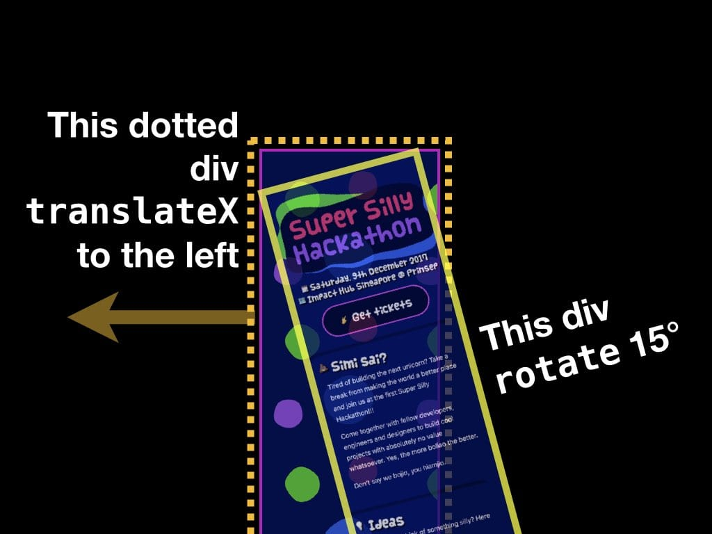

I wrap the content (yellow bordered box) with another container element `div` (dotted yellow bordered box). Since this new container is **not** rotated together with the content, its X/Y axis is **not** affected! Therefore, I don't need to calculate the sine and cosine values to get the *real* horizontal translation!

This attempt *feels* a bit faster and easier to control. With this extra container, I can hide the scrollbars easily with `overflow-x: hidden`, which will work on both desktop *and* Mobile Safari (special case here).

One very clear and surprising fact; the site **performs well on mobile browsers**, but **decent on desktop browsers**. Usually, mobile browsers have worse performance than desktop browsers, but this time, it's the other way around 🤷‍♂️

[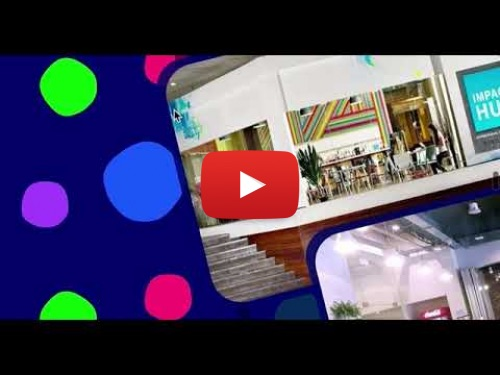](https://www.youtube.com/watch?v=Gs0J2GIqonk)

On my machine, the site scrolling is [very, very laggy on Firefox](https://www.youtube.com/watch?v=Gs0J2GIqonk). I have no idea why. After revealing the site, I've gotten a few feedback from some people...

> Damn. On my monitor, for every scroll down, the entire thing is sort of like vibrating. My eyes died.
>
> Then I use another Mac and the scroll is fluid. Ahhhh...
>
> — Kiong

It doesn't work well on one Mac, but works well on another Mac 🤔

> Because the background is not `fixed`, scrolling on a mouse wheel creates a pretty strong flicker.
>
> — Ted

I suspect mouse-wheel scrolls at certain number of lines, so it "jumps" at specific transition points instead of smoothly transitioning between them with a smooth scroll 🤔

🕵️‍♂️ Research time
---

At this point, I don't know what's the cause of the problem. There are a few speculations in my mind, but I'll need to research.

One of the first things that I stumble upon is the term "**scroll jank**". It took me a while to find out the *official* definition of this term but I gave up and use this instead:

> When you scroll a page and there's such a delay that the page doesn't feel anchored to your finger, that's called scroll jank.
>
> — [Improving Scroll Performance with Passive Event Listeners](https://developers.google.com/web/updates/2016/06/passive-event-listeners)

This explanation seems to focus more on finger touch latency when scrolling web pages, but can be applied to normal trackpad or mouse scrolling as well.

Ultimately this leads to the discovery of [passive event listeners](https://github.com/WICG/EventListenerOptions/blob/gh-pages/explainer.md). I looked up [Can I use…](https://caniuse.com/#feat=passive-event-listener) and was surprised to see *a lot* of browsers now support it. I've also read about Firefox Quantum's latest [Async Pan/Zoom (APZ) feature](https://hacks.mozilla.org/2017/11/async-panzoom-apz-lands-in-firefox-quantum/) which *decouples* the scrolling from the JavaScript thread. Apparently I was confused by all these terms as I know that both are meant for making sure that nothing *blocks* scrolling, one is meant for touch events, and the other is a browser-side implementation.

I've also discovered [Animation Worklet](https://github.com/WICG/animation-worklet), while reading about [Scroll-linked effects on MDN](https://developer.mozilla.org/en-US/docs/Mozilla/Performance/Scroll-linked_effects). It's quite a long read and honestly I just skimmed through keywords like "sticky positioning", "scroll-snapping" and "web animations". Animation Worklet was previously known as "[Compositor Worker](https://docs.google.com/document/d/18GGuTRGnafai17PDWjCHHAvFRsCfYUDYsi720sVPkws/edit?pli=1#heading=h.iy9r1phg1ux4)" since around 2015. There's an additional proposal to [Web Animations](https://drafts.csswg.org/web-animations-1/) specification that's for [mapping scroll position to time and use it as a *timeline* for the animation](https://wiki.mozilla.org/Platform/Layout/Extended_Timelines). 🤯

Okay, let me step back a bit and rethink this over.

Scroll jank was a problem last time. Back in 2011, John Resig once [wrote about attaching handlers to the window `scroll` event as a very, very bad idea](https://johnresig.com/blog/learning-from-twitter/). This leads to the term "[Jank Busting](https://www.html5rocks.com/en/tutorials/speed/rendering/)" (2012) by preventing frame rate drops, [debouncing scroll events](https://www.html5rocks.com/en/tutorials/speed/scrolling/), [using `requestAnimationFrame`](https://www.html5rocks.com/en/tutorials/speed/rendering/) and ensuring a [jank-free experience](http://jankfree.org/). Fast forward to today, browser developers have kind of solved this by introducing new methods, specifications and implementations.

But, why am I *still* seeing this lag on the Super Silly Hackathon website? 🤔

As I was trying to fix the jank issue, I saw this warning on Firefox Developer Tools' Console:

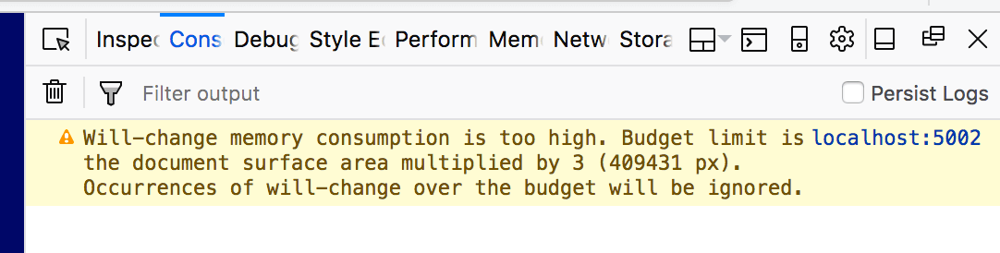

I applied the [`will-change` CSS property](https://css-tricks.com/almanac/properties/w/will-change/) on the **whole** rotated content and got this warning message:

> `Will-change` memory consumption is too high. Budget limit is the document surface area multiplied by 3 (409431 px). Occurences of `will-change` over the budget will be ignored.

**Whoa**. From my basic understanding of this property, I see `will-change` property as a *better* version of the `translate3d(0, 0, 0)` or `translateZ(0)` hacks as mentioned by Sara Soueidan's article on [Everything You Need to Know About the CSS `will-change` Property](https://dev.opera.com/articles/css-will-change-property/) (2014).

It's like asking the browser that I want one (or more than one) specific CSS property to be optimized *magically* and the browser will somehow answer "Yes". In this case, the browser answered "No" 😭. A little bit more reading reveals that one of the **proper** usage of `will-change` is:

> *Don't apply will-change to too many elements.* The browser already tries as hard as it can to optimize everything. Some of the stronger optimizations that are likely to be tied to `will-change` end up using a lot of a machine’s resources, and when overused like this can cause the page to slow down or consume a lot of resources.
>
> — [MDN web docs: will-change](https://developer.mozilla.org/en-US/docs/Web/CSS/will-change)

This is when it hits me.

> Reducing paint areas is often a case of orchestrating your animations and transitions to not overlap as much, or finding ways to avoid animating certain parts of the page.
>
> — [Simplify Paint Complexity and Reduce Paint Areas](https://developers.google.com/web/fundamentals/performance/rendering/simplify-paint-complexity-and-reduce-paint-areas)

I stepped back and look at the web site again…

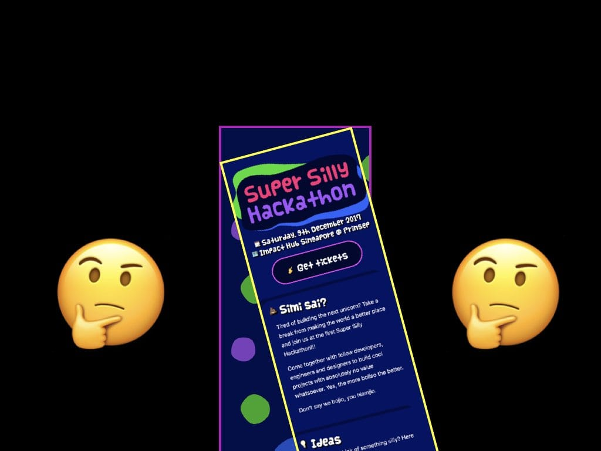

I see two very important points.

- **Large paint areas**. The *whole* rotated content is a huge large paint area. Technically speaking, the more content I put, the larger the paint area gets 😅
- **Animate everything**. The *whole* rotated content is translated horizontally when scrolling. Instead of animating only certain parts of the page, *everything* on the page is animated 😅

All this while, I've been doing things that are *against* all these best practices. Instead of minimizing paint areas, compositions, transitions and animations, **everything is maximised!** 😅😅😅 Despite these realizations, I'm still dumbfounded by the fact it's slower on a desktop than on a mobile 🙄

So in the end, I *still* have no idea what I'm doing but at least I learnt a few things 😊. For the past few days, I've been trying out a few methods to speed things up and I hope that I could somehow solve this 😁. For those of you who asked me if I found a solution yet, the answer is no for now 😬.

🦄 Trivia time!
---

Conforming to the name and theme of this hackathon, I tried my *very* best, that no one ever was, to have as much fun as possible building the site 😂

I hid a lot of fun stuff in the source code and was secretly hoping that someone would view source and read them. I didn't reveal them during my [talk](https://engineers.sg/video/css-ing-the-super-silly-hackathon-website-talk-css-23-party-edition-singaporecss--2156) due to shortage of time and me being usually tired after a whole day of work 😜

On December 2, I'm super glad that **finally** [someone view the source](https://twitter.com/cheeaun/status/936967159682441218) and [found a few gems](https://twitter.com/jg_lim/status/936975447262298115), though not *all* of them 😝

**Trivia #1**: I use emoji characters as CSS class names, animation names and even font names!

```
@font-face {
  font-family: '🍦';
  src: url('fonts/vanilla.woff2') format('woff2'), url('vanilla.woff') format('woff');
}

...

h1, h2, h3, button {
  font-family: 🍦, sans-serif;
}

...

.🦄🐱 {
  filter:
    drop-shadow(10px 10px 0 rgba(0, 14, 102, .85))
    drop-shadow(-10px -10px 0 rgba(0, 14, 102, .85));
  animation: 😼 2s infinite ease-in-out alternate;
}

@keyframes 😼 {
  0% { transform: rotateZ(5deg) }
  100% { transform: rotateZ(-5deg) }
}
```

**Trivia #2**: I invented `<em oji>`, which is the `em` tag with the `oji` attribute. Technically speaking, `oji` attribute is invalid but still, it can be styled with CSS, like this:

```
em[oji]{
  font-style: normal;
  display: inline-block;
  animation: 🌀 10s infinite linear;
}
```

Don't try this at home!

**Trivia #3**: I use [Viewport Unit Based Typography](https://zellwk.com/blog/viewport-based-typography/), mainly inspired by one of [Zell](https://zellwk.com/)'s talks and Vitaly Friedman's [talk](https://youtu.be/a_1--3T8y6Y?t=11m42s), using this magic formula:

[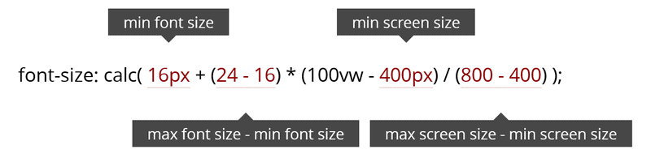](https://www.smashingmagazine.com/2016/05/fluid-typography/)

**Trivia #4**: The site *embraces* the iPhone X notch. I don't own an iPhone X so I could only test this in the iPhone Simulator. I followed some of the new features highlighted on [Designing Websites for iPhone X](https://webkit.org/blog/7929/designing-websites-for-iphone-x/) and added this meta tag:

```
<meta name='viewport' content='initial-scale=1, viewport-fit=cover'>
```

Here's a before and after comparison:

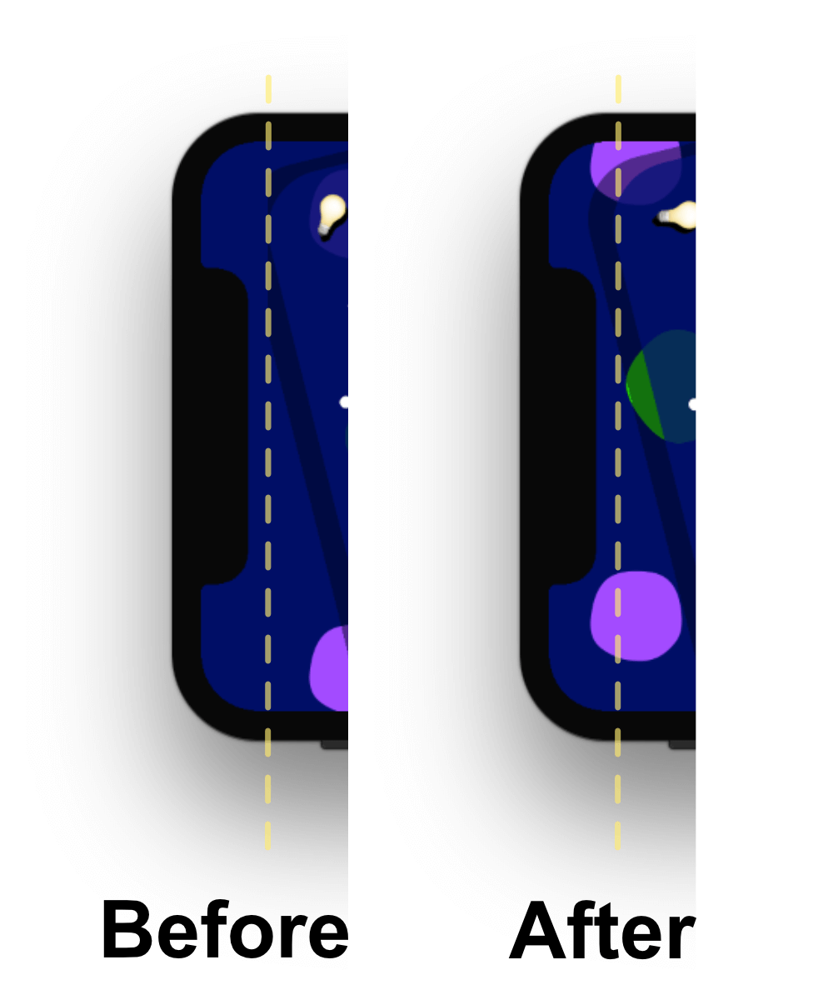

Before applying the meta tag, the site doesn't *bleed* to the edges, but after that, it does. Do note that **the site does not respect the safe areas at all**. The reasoning is… it doesn't have to, due to its diagonal scrolling nature 😎

From the very beginning, this diagonal design **already works in the "dangerous" areas, even for normal rectangular screens**. Think about it, technically this layout can work for *any* shapes of screens *without* the need for applying spaces for safe areas. Personally I see all this hype on iPhone X notch **as a small first step towards a non-rectangular-screen future**.

**Trivia #5**: Due to parallax-ish and titled nature of the design, the site also implements the [`prefers-reduced-motion` media feature](https://webkit.org/blog/7551/responsive-design-for-motion/) which is meant for folks who experience [motion sickness and vertigo](http://simplyaccessible.com/article/balance-awareness/). It's only supported on Safari for now, on both iOS and macOS. Web developers can test this locally by turning on the 'Reduce Motion' option in Accessibility settings.


When "Reduced Motion" is turned on, I've made a few adjustments:

- Use `background-attachment: fixed` to make the background image stays and reduce the "parallax" effect.
- Fade out the repeating background image.
- Make the backgrounds of the sections to be less transparent.
- Un-tilt the whole content, make it vertical.
- Disable *all* animations and transitions.

Disclaimer: I'm not 100% sure if these help at all since I don't have vestibular disorders or any tools to test this. There is a pretty detailed post on A List Apart, [Designing Safer Web Animation For Motion Sensitivity](http://alistapart.com/article/designing-safer-web-animation-for-motion-sensitivity) which helps much.

And… that's all! **5 trivia**. Or rather, "*Easter eggs*"? 🤷‍♂️

🦄 And so it begins…
---

On Saturday December 9th, we organised the Super Silly Hackathon starting at 9AM for setup, registration and stuff.

The t-shirts are super cute 😍:

[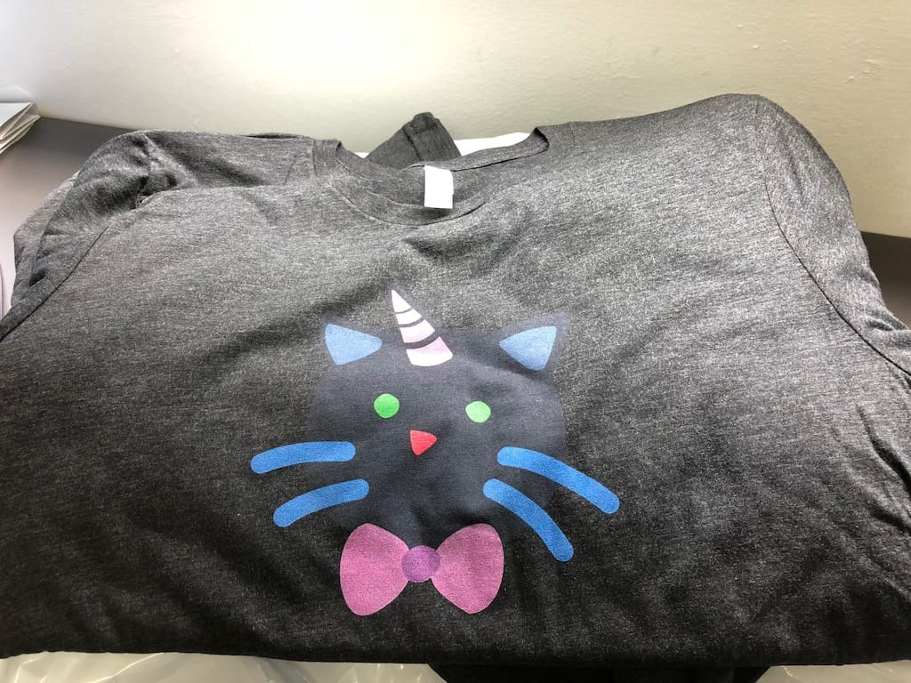](https://www.instagram.com/p/BchxhIVn44h/)

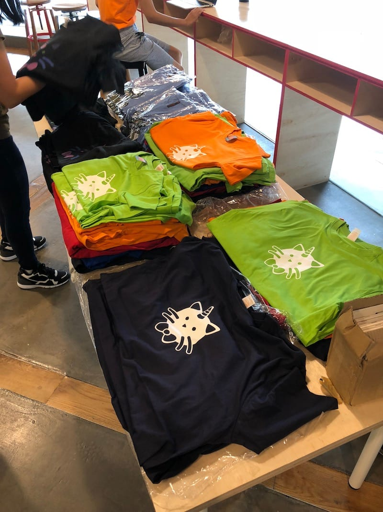

The stickers are super cute too 😍:

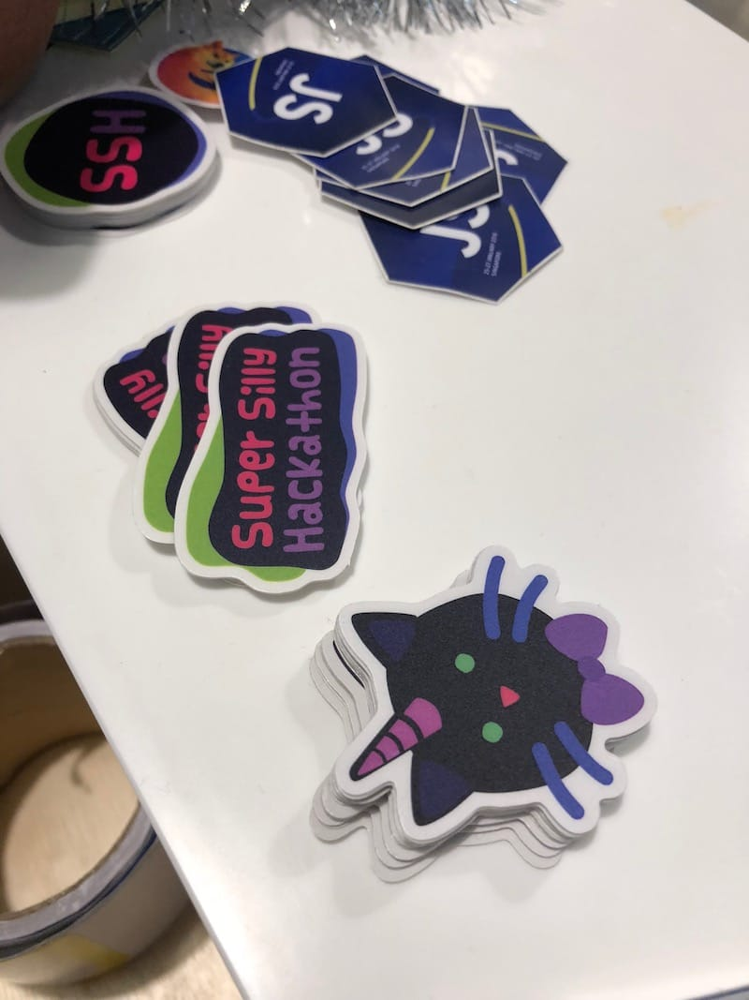

There are **more photos** on the [Super Silly Hackathon Facebook page](https://www.facebook.com/supersillyhackathon/) [photo album](https://www.facebook.com/media/set/?set=a.1936822189970611.1073741828.1932500953736068&type=1&l=64fb457395)! [Videos of all presentations from 17 teams](https://engineers.sg/conference/supersillyhackathon2017) are also up, thanks to the wonderful [Engineers.SG](https://engineers.sg/).

I'm also quite pleased that the Super Silly Hackathon site was *featured* on [Hui Jing](https://twitter.com/hj_chen/status/939691952622022656)'s [Team 486's presentation](https://www.chenhuijing.com/blog/hardware-hacks-super-silly-hackathon/) where they serve the site, uh… *locally*, from a IBM PS/1 Consultant 2133 19C machine 😱

Throughout the event, everything went surprisingly well with too many swags, over-fed participants, chill *co-hacking* environment, and great demos & presentations with lots of enthusiasm and laughter 😊

🎬 The aftermath
---

It's been a pleasure to be part of this fun-filled event. Hearing positive compliments from people about my designs and the event always make me feel warm and fuzzy inside. ☺️

To be honest, I didn't really put much thought into the designs. Most of the time, I just wing it with random colors, shapes and sizes. There are no grids, golden ratio or anything. I didn't know how things will turn out or how the design will look like in real life or how people would feel about it.

It's always that sense of uncertainty and doubt, which sometimes when things go well, I'll probably say it's "pure luck".

A friend told me this, which made me paused for a while:

> Not lucky, it's because of your years of experience 👍

I guess I'll accept that for now 😊