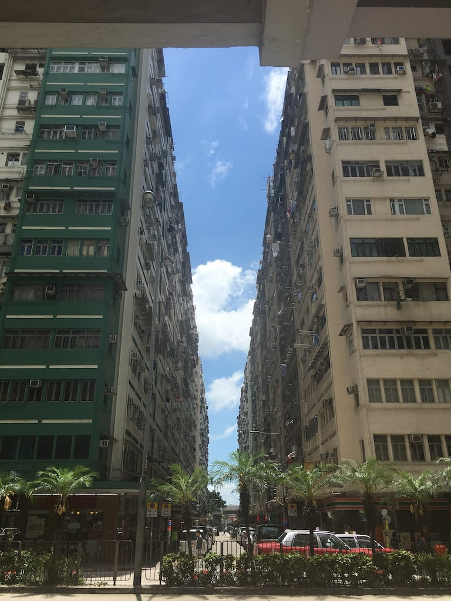

2017 in review
===

I don't make new year's resolutions. I've tried it, it doesn't work and I always get too lazy to *resolve* them. Turns out the best way for me to do things is to go with the flow and *just do it* along the way. ✓

Now it's that time again to look back and review my year.

First, the little things:

- On January, I found the [existence of "Yuan Yang O"](https://twitter.com/cheeaun/status/816536840039645184). It's [coffee and tea](https://en.wikipedia.org/wiki/Yuenyeung) *without* milk. ☕️🍵
- [One](https://www.instagram.com/p/-DFUiLS9-_/) of my Instagram photos got featured on [a Japanese article about Nezu Cafe in Nezu Museum](https://retrip.jp/articles/76099/). 😎
- I was surprised to find that my [old FirefoxOS phone is still alive](https://twitter.com/cheeaun/status/825549593228087296) (released 2013). I still have no idea what to do with it.
- I showed a [sneak peek](https://twitter.com/cheeaun/status/820821687239221249/) of the new Geek Brunch site and [launched it](https://twitter.com/cheeaun/status/821170039596326912) on January 17. 🤓🚀
- I bought my first ever [360-degree camera called Insta360 Nano](https://www.facebook.com/cheeaun/posts/10154869963691294). 💸
- I [visited Gardens by the Bay](https://www.instagram.com/p/BQIWUvogw31) for the first time.
- On February, I [co-organized](https://twitter.com/cheeaun/status/830245211343298560) [Geek Brunch with Sayanee and Michael Cheng](https://www.facebook.com/events/663549580471268/). ✨ Also launched [The Geek Path](https://twitter.com/thegeekpath/status/830293751536836609), with [posters](https://twitter.com/thegeekpath/status/833911748885303296) and [screensavers](https://twitter.com/thegeekpath/status/835425531315150848). 🚀
- I received [free poly mailers from StickerMule](https://twitter.com/cheeaun/status/831398586646568961). 👾
- My [photos were featured by Foursquare Singapore twitter account](https://twitter.com/i/web/status/833194514097590272). The photos are taken at [Mellower Coffee](https://foursquare.com/v/mellower-coffee/588ab9417220e605c346a3a5). ☕️
- On March, I tried the [new *reusable* stickers from JustStickers](https://twitter.com/cheeaun/status/838608228527190016). 👾
- I bought [a really cool backpack](https://www.facebook.com/cheeaun/posts/10155040538721294) called [Invisible Backpack One Mini](https://www.opposethis.com/products/invisible-backpack-one-mini). 💸
- I bought a second [360-degree camera called Insta360 Air](https://www.facebook.com/cheeaun/posts/10155199840836294). 💸
- My HackerWeb app [got featured on Product Hunt](https://twitter.com/cheeaun/status/847260308133388289) again, thanks to [Scott Hanselman](https://twitter.com/shanselman/status/846536395933937664)! 🚀
- I [gave a talk partially with Sayanee](https://www.youtube.com/watch?v=tTh9zST36js&feature=youtu.be) on building [The Geek Path](https://thegeekpath.com/) site at [Talk.CSS #15](https://singaporecss.github.io/15/). 🗣
- On April, I [started watching](https://twitter.com/cheeaun/status/848131240045625344) [Boku no Hero Academia Season 2](https://myanimelist.net/anime/33486/Boku_no_Hero_Academia_2nd_Season) and [Shingeki no Kyojin season 2](https://myanimelist.net/anime/25777/Shingeki_no_Kyojin_Season_2) (No spoilers please!).
- I rode on the [Mastodon hype train](https://twitter.com/cheeaun/status/849850895869157376). 🚆
- I tried [riding oBike](https://www.instagram.com/p/BSoQy5Vg7x2) for the first time. First time riding a bicycle in Singapore too, after staying here for so long. And under the rain as well.
- I attended [AWS Summit](https://aws.amazon.com/summits/singapore/), [got interviewed by Kai Hendry](https://twitter.com/kaihendry/status/851677850813947905) and became known as "[Frontend God](https://www.youtube.com/watch?v=jDEUiVaeI78)" 🎫😅🎤
- I took [one of the coolest 360-deg photo](https://www.instagram.com/p/BS5aJZ6AXfr/) I've ever taken.
- I received [free sticker samples from Gumtoo](https://twitter.com/cheeaun/status/856832968681304064). 👾
- On May, I [had a great chat](https://twitter.com/webuildsg/status/860684093054255105) at the [We Build LIVE podcast](http://live.webuild.sg/), with [transcript](http://live.webuild.sg/046-chee-aun-lim/). 🎤
- I bought [a Dogenut shirt](https://twitter.com/cheeaun/status/862534535400927232)! [Doge + donut](https://store.hongkonggong.com/product/dogenut-shirt/), get it? 👕💸
- I [attended Tech In Asia Singapore conference](https://www.instagram.com/p/BUPRSgvgko3/).
- I bought the [Slimfold wallet: Micro CL Beta edition](https://www.facebook.com/cheeaun/posts/10155437917536294) after reading "[Creating Composite Laminate](https://www.slimfoldwallet.com/blogs/blog/creating-composite-laminate)". I'm currently using a Tyvek-based wallet by [Paprcuts](http://www.paprcuts.net/) and was researching if anyone has ever *evolve* the Tyvek material. 💸🕵️‍♂️
- I played [Magikarp Jump](https://twitter.com/cheeaun/status/867742892487462916). 🐟
- I [attended GopherCon Singapore](https://twitter.com/cheeaun/status/867918365192409089). 🎫
- On June, I attended the [first ever Webconf.Asia](https://twitter.com/cheeaun/status/870824608504496128) in Hong Kong. The weather [was hot](https://twitter.com/cheeaun/status/871341674361901056). 🎫✈️
- I [updated my RailRouter.SG app](https://twitter.com/cheeaun/status/876391649114341376) with the new Tuas West MRT Extension. 🚀
- I [attended](https://twitter.com/cheeaun/status/877700207399522305) [RedDotRubyConf](https://twitter.com/cheeaun/status/878079584171810816). 🎫
- I was inspired and did [an "impulse project"](https://twitter.com/cheeaun/status/879905475608760320) called ['npm-star'](https://twitter.com/cheeaun/status/879906198798991360). [Takayuki Matsubara was amazed](https://twitter.com/ma2ge/status/879912243189567488). 🚀😂
- On July, I [showed](https://twitter.com/cheeaun/status/882058898634493953) [a sneak](https://twitter.com/cheeaun/status/883310698809376768) [peek](https://twitter.com/cheeaun/status/883706003052666880) [of my new side project](https://twitter.com/cheeaun/status/884244631906533376). [Played around](https://twitter.com/cheeaun/status/883669917110738944) with [SVG optimizations](https://twitter.com/cheeaun/status/884389164979896321). [Launched it](https://twitter.com/cheeaun/status/884605816547885057) on July 11, with [journey lines](https://twitter.com/cheeaun/status/885330891161059328), [3D](https://twitter.com/cheeaun/status/886594525904330753) [buildings](https://twitter.com/cheeaun/status/890042635909423105), [angles](https://twitter.com/cheeaun/status/909778924673974272) and [experimental](https://twitter.com/cheeaun/status/912119623264362496) [time-machine](https://twitter.com/cheeaun/status/914682369398923264) [mode](https://twitter.com/cheeaun/status/915406990167257088). 🚀
- I *celebrated* [my 5000th check-in on Foursquare/Swarm](https://twitter.com/cheeaun/status/882211344430252033). Last year, I celebrated my [4000th check-in](https://twitter.com/cheeaun/status/810690299391459328), so that means I did roughly a thousand check-ins in just 7 months? 😱
- I reminisced on [my old blog post](https://twitter.com/cheeaun/status/883487553675866112).
- I *celebrated* [my 40,000th tweet](https://twitter.com/cheeaun/status/884313330101264384).
- I designed [a logo for Geekcamp Singapore](https://dribbble.com/shots/3654189-Geekcamp-SG-logo-proposal). 🎨
- I [attended](https://twitter.com/cheeaun/status/891093482353438720) [DevRelCon](https://twitter.com/cheeaun/status/891130699851476992) in Tokyo. 🎫✈️
- On August, I designed [a logo for iOS Conf SG](https://twitter.com/iosconfsg/status/893481925293125634). 🎨
- I received my [Indiegogo-backed](https://www.indiegogo.com/projects/air-acoustically-stunning-wireless-headphones-audio--2/x/2619825#/) [Crazybaby Air wireless headphones](https://www.facebook.com/cheeaun/posts/10155853383706294). 💸
- I [played](https://twitter.com/cheeaun/status/899919383165784064) [around](https://twitter.com/cheeaun/status/901384004695281666) with [Puppeteer](https://github.com/GoogleChrome/puppeteer), and [launched Puppetron](https://twitter.com/cheeaun/status/901465911030292480), with [CJK fonts support](https://twitter.com/cheeaun/status/902340897433501696) and [most](https://twitter.com/diversionary/status/854193359153385474) importantly, [emojis](https://twitter.com/cheeaun/status/903492052452728832). Got [featured](https://twitter.com/cheeaun/status/908593129225195520) as well 🚀
- I received my [Kickstarter-backed](https://www.kickstarter.com/projects/switch-con/switch-con-worlds-first-hdmi-hub-for-switch-and-s8) [C-Force HDMI/USB/USB-C hub](https://www.facebook.com/cheeaun/posts/10155897718541294). 💸
- On September, I *accidentally* [built a 3D Earth](https://twitter.com/cheeaun/status/904317333862203392), at first [with A-Frame](https://aframe.io/blog/awoa-77/), then [with Three.js](https://twitter.com/cheeaun/status/905250107129421824). [Not forgetting](https://twitter.com/cheeaun/status/906905846776422400) [all the](https://twitter.com/cheeaun/status/907440257087373312) [cool things](https://twitter.com/cheeaun/status/907972023632019456) [I've learnt](https://twitter.com/cheeaun/status/908338936774197250). 🚀
- I bought [a few nice stickers from RedBubble](https://twitter.com/cheeaun/status/907845804974632960). 👾
- I built [a "2.5D" map of the F1 circuit](https://twitter.com/cheeaun/status/908508652826324992) in Singapore. 🚀
- My 'node-hnapi' project [got featured](https://twitter.com/cheeaun/status/910677333694181376) on Addy Osmani's article, [Hacker News Progressive Web Apps](https://blog.hnpwa.com/hacker-news-progressive-web-apps-2d8cbf7bc077). 😎
- I've also updated RailRouter.sg to [show the new Downtown Line 3](https://twitter.com/cheeaun/status/911565621472632832). 🚀
- I attended the [Google Cloud Summit](https://cloudplatformonline.com/Summit-Singapore-2017.html). 🎫
- On October, I [attended](https://twitter.com/cheeaun/status/916114832742604801) the [AMP Roadshow](https://twitter.com/cheeaun/status/909639839678525440) and finally saw Paul Bakaus. 🎫
- I [announced](https://twitter.com/cheeaun/status/917943781239832576) that I'm looking for co-organizers for Kopi.JS and open-sourced [a complete guideline on being one](https://twitter.com/cheeaun/status/917943847186874373). 
- I [rebuilt](https://twitter.com/cheeaun/status/919755411909091330) the Geek Brunch site again. 🤓
- I [attended](https://twitter.com/cheeaun/status/920830402561851393) [iOS Conf SG](https://twitter.com/cheeaun/status/921219087329517569). More of my logos [revealed](https://twitter.com/subhransu/status/923777403146534912). 🎫🎨
- For the second time of the year, I [co-organized](https://twitter.com/khorkexin/status/921761475445735424) [Geek Brunch](https://twitter.com/kerion7/status/921965957773369344) again with Sayanee and Michael, which is held on the day after iOS Conf SG. ✨
- I [got featured](https://www.facebook.com/cheeaun/posts/10156139657461294) on [LesterChan.net](https://lesterchan.net/blog/2017/10/27/onan-korea-lumena-n9-fan/)! 😱😎
- I showed a [sneak peek](https://twitter.com/cheeaun/status/923740722196463618) of the [Super Silly Hackathon](https://supersillyhackathon.sg/) website. 🤓🎨
- I [completed the Hacktoberfest challenge](https://twitter.com/cheeaun/status/923853968303779840), with [6 pull requests](https://twitter.com/cheeaun/status/925004429517930496).
- I [attended WordCamp Singapore](https://twitter.com/cheeaun/status/924107043472138240). 🎫
- On November, I *upgraded* from 6S to [iPhone 8](https://twitter.com/cheeaun/status/929367763654647808) (instead of X). Also tried [adding my Suica card](https://twitter.com/cheeaun/status/929537572228833280). 📱
- My AirPods [died](https://twitter.com/cheeaun/status/930229716660789248) and got [replaced](https://twitter.com/cheeaun/status/930746914114433024) **within a day for free** because it's still under a one-year warranty. I bought it since [December last year](https://twitter.com/cheeaun/status/812209154601275393).
- I received my [free tomato sticker pack from Sticker Mule](https://twitter.com/cheeaun/status/931378533133205504). 👾
- I reminisced on the [first Geekcamp](https://twitter.com/cheeaun/status/931678797056827392) and attended [Geekcamp Singapore](https://twitter.com/cheeaun/status/931700474096574464). 🎫
- I [launched the Super Silly Hackathon website](https://twitter.com/cheeaun/status/933526704273756160) and [gave a talk](https://twitter.com/hj_chen/status/935836318436749312) [about it](https://twitter.com/cheeaun/status/936039775789752320) at [Talk.CSS](https://singaporecss.github.io/23/). 🚀🗣
- On December, I [launched 3 sites](https://twitter.com/cheeaun/status/936399317341843456); [KopiJS.org](https://kopijs.org) (redesign), [Venusaur](https://venusaur.glitch.me/) (quick side project) and [Order Kopi Guide](https://kopi.guide/) (It's a [.guide TLD](https://www.iana.org/domains/root/db/guide.html)!). 🚀🚀🚀
- I became an ["Expert Photographer"](https://twitter.com/cheeaun/status/938332745318539265) on Google Maps. 😂📸
- I [co-organized the Super Silly Hackathon](https://twitter.com/cheeaun/status/939331063272366080) with Elisha, Min and Valentine. It's filled with [t-shirts](https://twitter.com/supersillyhack/status/939024243655712769), [stickers](https://twitter.com/supersillyhack/status/937674453462409217), and [good food](https://twitter.com/supersillyhack/status/939346874611331072). ✨👕👾😋
- I also [designed](https://www.facebook.com/cheeaun/posts/10155847417301294) a new logo for Engineers.SG and [now available publicly](https://www.facebook.com/cheeaun/posts/10155847417301294)! 🎨
- My Google Pixel 1 phone, which I bought on [November last year](https://twitter.com/cheeaun/status/800597477468446720), got [*swollen*](https://twitter.com/cheeaun/status/940190601068216320) ಠ_ಠ and [got fixed](https://twitter.com/cheeaun/status/943479228397371392) after bringing it to a shop at Sim Lim Square.
- I [published](https://twitter.com/cheeaun/status/940398933179641857) '[Designing Super Silly Hackathon](/blog/2017/12/designing-super-silly-hackathon/)'. 📝
- I celebrated [my 11th year on Twitter](https://twitter.com/cheeaun/status/942434740245749760).
- I tried [Old Chang Kee's Chicken Kopi O puff](https://www.facebook.com/cheeaun/posts/10156315507581294). 🐓☕️😱
- I bought [10 sticker samples from Sticker Mule](https://www.facebook.com/cheeaun/posts/10156323792861294). 👾💸

Statistically speaking, I've attended **8 conferences**, volunteered in **3 of them**, organised [**6 Kopi.JS**](https://github.com/kopijs/kopi.js/issues?utf8=%E2%9C%93&q=label%3A2017) hangouts, co-organized **two [Geek](https://www.facebook.com/events/663549580471268/) [Brunch](https://www.facebook.com/events/261062764416175/)** hangouts, co-organised **a ["unhackathon"](https://www.facebook.com/events/152050502202670/)** and launched **7 side projects** this year. 📈

Year of 360° photos
---

I took quite a few 360° photos. Here are my favourites, which I think are seriously cool. They are not exactly 360° photos but turned into "tiny planet" (stereographic) projections.

Year of design
---

I designed quite a lot more things this year. Seems like my creative juices started flowing ever since [RedDotRubyConf last year](/blog/2016/09/designing-artwork-reddotrubyconf-2016/).

The sites I've designed (and built):

That's 9 sites, which I think is a lot.

The logos I've designed:

And… a manifesto poster?

Okay, this starts to feel like a portfolio site 😆

For some of these sites and designs, I planned to write down more details but didn't manage to find the time 😅 However, it's been rather unexpected for me to churn out so much *creativity* this year that I suspect I might just get dried up next year 😆

Hong Kong & Macau
---

From the beginning of the year, I've been raring to attend [Webconf.Asia](https://webconf.asia/) and also travel to Hong Kong since I've never been there (only as a stopover). I bought the early bird ticket on February 25 ([Charis](https://twitter.com/charis) told me that I'm actually the first buyer 😱).

On [June 2](https://twitter.com/cheeaun/status/870433799011618816), I departed from Singapore to Hong Kong International Airport (HKG). From the moment I stepped out of the airport, I already felt the intense summer heat that seems way more unbearable than Singapore's. Instead of the train, I took a bus from the airport to my hotel.

One of the first meal I ate was this scrambled egg with ham and toast, and "[lai cha](https://en.wikipedia.org/wiki/Hong_Kong-style_milk_tea)".

The next day, I went for the conference and saw this:

Pretty healthy options there 😉.

I [particularly like this lanyard design](https://twitter.com/cheeaun/status/871006964343488512) that shows the upside-down schedule so that it's easy for the wearer to view it. Notice that the attendee name and conference name is still upright so that other people can read when socializing 👍

I saw [Hui Jing's talk](https://2017.webconf.asia/talks#huijing-chen) and very glad to **finally** see talks by [Vitaly Friedman](https://twitter.com/smashingmag) and [Bruce Lawson](https://twitter.com/brucel). The conference was amazing, after-party was pretty chill and after that somehow I manage to hang out with [MiniTheory](http://minitheory.com/) folks and ate this amazing meal at [Joy Hing Roasted Meat](https://foursquare.com/v/joy-hing-roasted-meat-%E5%86%8D%E8%88%88%E7%87%92%E8%87%98%E9%A3%AF%E5%BA%97/4b18f7ecf964a520cbd623e3) restaurant.

After the conference, I [strolled around](https://www.instagram.com/p/BU6sNozgQdY) Hong Kong, took [the tram](https://www.instagram.com/p/BU8CiVYAhOD), took [the ferry](https://www.flickr.com/photos/cheeaun/35120956662/in/album-72157682752402101/), ate [steamed milk pudding](https://www.instagram.com/p/BU8C18Mg-nw), embracing the [32° Celcius weather](https://twitter.com/cheeaun/status/871341674361901056) (but actually feels more like 44° 🔥🔥🔥🔥), took [a hilly-and-speedy bus ride to Tai O](https://www.instagram.com/p/BU9WM0mgnns), walked up lots of stairs at [Ngong Ping](https://www.instagram.com/p/BU9XCRcg79d), almost [got stranded due to missing a bus stop](https://www.flickr.com/photos/cheeaun/35121244042/in/album-72157682752402101/), took the [Ngong Ping **Crystal** cable car](https://www.instagram.com/p/BU9YmKJAJPc), went [up to Sky100 Observation Deck](https://www.instagram.com/p/BVAIpEVHK42), took [a mini-bus to Victoria Peak then hike back down on feet](https://www.instagram.com/p/BVAPpU3HwMW), and took a pretty cool 360° [photo](https://www.instagram.com/p/BVMrIw2HBIa) & [video](https://www.instagram.com/p/BVM-VLLncbL) on [Sky Terrace 428](https://www.flickr.com/photos/cheeaun/34477926433/in/album-72157682752402101/).

Here are my observations notes:

- Left-hand traffic on the roads, but [keep right on escalators](https://www.quora.com/Why-does-Singapore-keep-left-on-the-escalator-while-Hong-Kong-keeps-right). 🤔
- Mandarin and English are still acceptable when ordering or buying things.
- Circle K and 7-eleven everywhere.
- Lots of FORTRESS stores.
- Hong Kong has one additional form of public transport; the tram. They are like buses but *slimmer*? It runs pretty slow but *very, very* cheap.
- Lots of public toilets (free) and signs to find them.
- [Metallic balloons are not allowed in stations or trains](https://expats.hk/797-why-mtr-bans-metallic-balloons.html).
- The queue lanes for the buses can be pretty confusing. The queues themselves can be long sometimes and can be confused as pedestrian traffic while walking down the street.
- People seems to *always* prefer sitting on the upper deck of a double-decker bus, even when the lower deck is empty.

I was planning to go to more scenic nature places (hiking?) but had to *pivot* due to the weather. ☀️

So I went to Macau by taking the [TurboJET](https://www.turbojet.com.hk/en/) boat from [Hong Kong Macau Ferry Terminal](https://foursquare.com/v/hong-kong-macau-ferry-terminal-%E6%B8%AF%E6%BE%B3%E5%AE%A2%E8%BC%AA%E7%A2%BC%E9%A0%AD/4b086cbef964a520960b23e3) to [Macau Maritime Ferry Terminal](https://foursquare.com/v/macau-maritime-ferry-terminal-%E6%BE%B3%E9%96%80%E5%A4%96%E6%B8%AF%E5%AE%A2%E9%81%8B%E7%A2%BC%E9%A0%AD/4b17c268f964a520dbc723e3). It's a quick one-hour ride and they don't seem to be strict about the ticket departure timing, so I could go earlier and ride on it earlier than the stated departure time on my ticket.

Macau was surprisingly surreal.

I get to see old buildings and streets…

…and super huge fancy buildings that I can't even fit into my photo canvas.

I was hoping that the weather would be colder but it's only slightly less warmer 😅. However, thanks to all these huge fancy buildings, there were more shaded areas and more free air-con than Hong Kong 😂

I ate [steamed milk pudding (with sweetened red beans)](https://www.instagram.com/p/BVGWpT8HxeO), tried their famous [pork chop bun](https://www.instagram.com/p/BVGWzq9n837), almost got lost [inside the casino](https://www.instagram.com/p/BVHL-6inQJY) at Galaxy Macau, saw [a huge bottle of Coca-Cola](https://www.instagram.com/p/BVHP5JcHbZE), visited *two* [A-Ma](https://www.instagram.com/p/BVG-1MVHry5) [Temple](https://www.instagram.com/p/BVHXsx2HaWq)(s), saw [Eiffel Tower](https://www.instagram.com/p/BVHixBrnZIV) [again](https://www.instagram.com/p/BVJefDAnAT4), watched [The House of Dancing Water](https://www.instagram.com/p/BVHuyZpnaXq), and [rode](https://www.instagram.com/p/BVKJAcPnsp-) on the [Golden Reel](https://www.instagram.com/p/BVHurc1HOvm) on top of [Studio City](https://www.instagram.com/p/BVHvfLsnRDB).

My observation notes:

- HKD and MOP currencies are accepted equally, despite the small exchange rate difference. Basically, $1 HKD is treated the same as $1 MOP, so it's okay to mix the notes together when paying.
- Portuguese words everywhere, so I needed to "Google Translate" a lot.
- "Saida" means Exit in Portuguese.
- For some reason, durian (ice cream, and parfait?) is kind of popular, besides the pork chop bun.
- Pastelaria (Portuguese for pastry shop) everywhere.
- Huge and flashy casinos everywhere.
- I kept seeing "Mocha" everywhere too. Seems like a gaming club or cafe.
- I tried to buy [Macau Pass](https://www.macaupass.com/) for taking buses. It's not sold at the ferry terminal but only been told to buy it in 7-eleven. 😅
- Google Maps doesn't show the complete bus routes, with lots of missing bus stops and wrong route lines. 😅
- Bus stop names are in Portuguese. 😅
- Uber is pretty cheap. Taxis are actually okay too.
- There are no trains.

On [June 10](https://twitter.com/cheeaun/status/873420038652297218), I flew back to Singapore. I'll be back again to go more places  when the weather is a bit more forgiving 😅

Some stats:

- 123 Swarm check-ins (94 in Hong Kong and 29 in Macau).
- 48 Instagram posts.
- [658 photos and 20 videos](https://www.flickr.com/photos/cheeaun/albums/72157682752402101) on Flickr.

Tokyo (again)
---

I needed an excuse to visit Japan again, then found [DevRelCon Tokyo](https://tokyo-2017.devrel.net/) rather interesting and immediately bought the early bird tickets. It's quite different than the other web-related or developer-related conferences, as the talks are more about… well, developer relations. I'm not a developer relations person but it's refreshing to [listen to talks](https://www.youtube.com/channel/UCjq8Gi9QoMYRBPbo9ReTiUw) about the developer community and perspectives from all different directions. It's even more surprising that the conference is organized by [Atsushi Nakatsugawa](https://twitter.com/goofmint) who also organizes [DevRel meetup in Singapore](https://www.meetup.com/DevRel-Meetup-in-Singapore/).

I flew on [July 27](https://twitter.com/cheeaun/status/890355906092843008). It's a much shorter trip this time compared to my previous trips, because weather forecast showed that it's going to be warm. Well, yes, it's warm, though not as hot as Hong Kong.

Since I don't really plan my itineraries, I usually plan on-the-fly. I [bumped into a random festival](https://www.instagram.com/p/BXDUMJ8HHtA), ate [spicy](https://www.instagram.com/p/BXDUgnMHZRK) [ramen](https://www.instagram.com/p/BXDUr0GnWdO) despite the warm weather, heard [real-life anime-like Summer-ish cicada sound effects](https://www.instagram.com/p/BXFo1XeH3FL), saw a [pixelated Astro Boy](https://www.instagram.com/p/BXFpRyenW9l), observed the [Kimi No Na wa](https://www.instagram.com/p/BXFpyvQHHXI) [stairs](https://www.flickr.com/photos/cheeaun/36165819171/in/album-72157686925301366/) ("[Your Name](https://myanimelist.net/anime/32281/Kimi_no_Na_wa)" in English), ate my favorite [unagi don](https://www.instagram.com/p/BXGA3JjnOTn) (a.k.a. unadon or unaju), impressed by [real-time Japanese-to-English translators](https://twitter.com/cheeaun/status/891120677884903424) in the [conference](https://twitter.com/nakansuke/status/891224481145823232), saw [a kid riding on a bicycle simulator machine](https://www.instagram.com/p/BXKYpU5Hphh), ate my favorite [uni chutoro don](https://www.instagram.com/p/BXKaglUn-HP), never gonna miss [my Cremia](https://www.instagram.com/p/BXKczY1HxUa) ever again, and obviously [ate some sushi](https://www.instagram.com/p/BXM9ehznT1z).

Stats again:

- 61 Swarm check-ins.
- 22 Instagram posts.
- [176 photos and 4 videos](https://www.flickr.com/photos/cheeaun/sets/72157686925301366) on Flickr.

I flew back to Singapore on [July 31](https://twitter.com/cheeaun/status/891929212285632514) and still continue [saying “はい”](https://twitter.com/cheeaun/status/892210899271901184). 😅

Looking back
---

[2015](http://cheeaun.com/blog/2015/12/2015-in-review/) was the year when my life took an unexpected turn. [2016](http://cheeaun.com/blog/2016/12/2016-in-review/) was the year when things turn around again into a surprisingly positive way.

This year has been quite positive, from the outside. I volunteered in a few events, designed a few artworks, built a few cool side projects and visited two countries.

From the *inside*, this year has been both wonderful and sad for me. I've been very open and public about most of the things I do. I "open-sourced" my life timeline on [cheeaun.life](http://cheeaun.life/). I "open-sourced" my whereabouts on [cheeaun.earth](https://cheeaun.earth/). Nevertheless there are still some things that I never share to anyone, no matter how close they are.

I've been "blind" for a very, very long time. This year I gained sight and experienced a lot of wonderful new things. Things that I felt are too good to be true. Things that I can't believe is real and happening. When things are going too well, I'm afraid that they could fall apart at any second. I felt that I shouldn't have the right to experience good things when people around me are suffering. I felt that I should wait for other people to be happy first before me. My self-sacrifice instinct always kicks in just to make others happy, which then makes myself unhappy.

I wrote about [being invisible](/blog/2016/07/being-invisible/) last year. I mentioned that I don't mind being invisible, as I would rather make *other* people visible. I'm always empathetic, trying to be a good listener and trying to be nice. Unfortunately, I realised that [being highly empathetic can eventually hurt my health](https://www.washingtonpost.com/national/health-science/being-empathetic-is-good-but-it-can-hurt-your-health/2017/09/22/b25b83ca-6cd0-11e7-96ab-5f38140b38cc_story.html). This kind of strikes me that everything starts to make sense, on why I still feel empty, directionless and sometimes stressed.

It's been pretty scarce for me to have a good, long and comfortable conversation with someone. It doesn't have to be a group of people, just one is enough. Organizing [Kopi.JS](https://kopijs.org/) for the past 3 years have made me realise this even more, as I slowly unable to have a proper conversation with anyone anymore. As I thought I finally found someone special this year but I felt more invisible and distant as time passes. People think that I'm *popular* due to my previous work, therefore I *should* have a lot of friends. I *know* that I have friends and I'm not alone. But in the end, I still do feel terribly lonely.

I envy those people who can have proper conversations one-on-one, without any disturbances or people chipping in and suddenly taking over the conversation. I hate it when the waiter always chip in at the wrong timing to clean up the table or serve more water or beer. Whenever I talk with someone, I naturally try to make it a group chat when there's more than one people around me. Whenever I talk to someone, I always prepare for the moment when someone else will immediately interrupt and render me speechless for the rest of the conversation. The moment when that happens, I simply feel too tired to continue and eventually stopped talking. That always make me feel like no one is genuinely interested to listen to me at all, as they won't ask me to continue my topic after the interruption or simply forgot about it altogether.

I'm empathetic yet I yearn for empathy from someone. I'm curious yet I yearn for curiosity from someone. I care for other people, yet I yearn for people caring about me. My desires lead me to being very pushy sometimes, especially when I don't get what I've been yearning for, and that made me feel like an insecure selfish jerk.

I made a lot of mistakes, again and again. As I try so hard to make someone happy, I realised that I made things worse and unintentionally caused more unhappiness.

This year, I gained sight and in the end, I **lost** it. I became "blind" again. Back to zero. Back to this feeling of unwantedness and emptiness. Back to my old self of being an emotionless puppet. Back to being misunderstood, ignored and invisible.

In a way, it feels almost like two years ago. I would be lying if I said I didn't cry at all.

I appreciate and will never forget all the things that have happened. I'm not sure how long it'll take for me to recover and gain my sight again. I have no idea what's in store for me next year. I don't know how my future would look like either.

In spite of everything, I keep telling myself that life moves on.