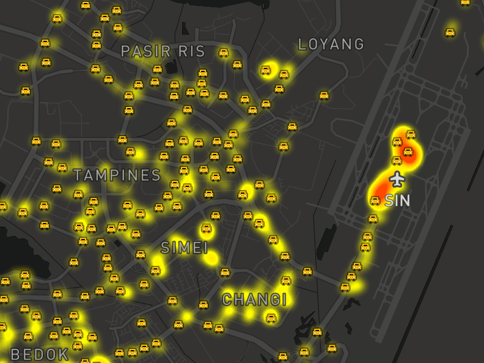

Rebuilding TaxiRouter SG
===

[](https://twitter.com/cliener/status/733276057604784129)

In 2016, I built [TaxiRouter SG](https://taxirouter.sg/) and [wrote an article about it](/blog/2016/03/building-taxirouter-sg/). I even [gave a talk](https://engineers.sg/video/taxi-router-talk-js--737) on [Singapore JS meetup](http://www.meetup.com/Singapore-JS/events/231037529/). Heck I even got featured on [Digital News Asia](https://www.digitalnewsasia.com/digital-economy/datasets-rest-us-datagovsg), [Channel 8 News](https://www.youtube.com/watch?v=8zH8fbUNdKI) and the [GovTech conference](https://twitter.com/heliumlife/status/784217428410544128)! 😅

It's been two years and I still find it unbelievable that such a simple little web app could get me this far. Since then, I had a few ideas on improving it but slowly neglecting it as I got busy with too many things. My days of peace were taken away when someone reported to me that the map *disappeared* from the site, on February 15.

It turns out that the map was *not loading* on **all** my transportation web apps, including [BusRouter SG](https://busrouter.sg/) and [RailRouter SG](https://railrouter.sg/)! 😱 I immediately suspect that something must be broken on Google Maps since all of them uses the [Google Maps JavaScript API](https://developers.google.com/maps/documentation/javascript/). Perhaps my API key stopped working or my apps have exceeded the [free daily usage limits](https://developers.google.com/maps/documentation/javascript/usage)?

Turns out, it's this:

```javascript
map.addListener('bounds_changed', function(){
   var bounds = map.getBounds();
   if (bounds.intersects(mapBounds)){
     ...
   }
});
```

Since my web apps mostly revolve around Singapore, I always have to write a piece of code to detect if the user panned outside of Singapore's boundary. It could be unintentional too if the user outside of Singapore clicked on the 'Current location' (or 'My Location') button that utilizes the browser's [geolocation](https://developer.mozilla.org/en-US/docs/Web/API/Geolocation/Using_geolocation) feature.

Anyway, looking back at the code, the *critical* error happens when the `bounds` variable returns as `null` and it doesn't have the `intersects` method. It didn't break before, so somewhere along the [Google Maps JavaScript API releases on February](https://developers.google.com/maps/documentation/javascript/releases) kind of broke it and rendered all my apps useless 😅

[Immediately](https://twitter.com/cheeaun/status/965240001536520193), I [applied all](https://github.com/cheeaun/railrouter-sg/commit/b6264f1ebfca70c45f7b27ef59a3c2ca2ebf9a59) [the quick](https://github.com/cheeaun/busrouter-sg/commit/810b7cef8596e1095bee166229ac1f8fa22f228c) [hotfixes](https://github.com/cheeaun/taxirouter-sg/commit/ab3c39a20f2c74760942a1fb319344bcae191eb4). 🔥

Scratching my own itch
---

After the quick fixes, obviously I looked at my apps and started to have that itch again. Revamping TaxiRouter.SG has always been on my mind for the past 2 years.

Why? This.


In the first version, I [spent too much of my time](/blog/2016/03/building-taxirouter-sg/) trying to optimize the performance of the thousands of taxi markers on Google Maps. I was proud that I devised a pretty smart way of rendering them on high zoom levels, but **not** on the lower zoom levels.

The markers ended up **hidden** on low zoom levels and taxi stands are rendered by default instead, as shown in the screenshot above. For first-time users, this is a bit confusing when they see a map that *should* show actual taxis but they won't see any of them until they zoom in.


Other sites, for example, [Joseph Tang's taxi heat map](https://mothership.sg/2016/05/nus-student-who-created-singapore-taxi-heat-map-made-several-other-cool-ones-too/) uses a heatmap (duh), and [Yongquan's taxi availability visualisation](https://yongquanben.github.io/sg_taxi_availability/) uses a hexbin map.


These are very useful to easily spot the density of the populated available taxis. They work very well on low zoom levels, but unfortunately not so much on higher zoom levels.

Ultimately, here's the ideal case:

- On low zoom levels, show a heatmap.
- On high zoom levels, show individual taxis, not grouped or coalesced.
- Taxi stands only appear on high zoom levels because they are not useful on low zoom levels anyway.
- Zero performance issues.

Challenge accepted
---

I've always been quite dissatisfied with the Google Maps JavaScript API V3 due to its usage of raster tiles. Meanwhile on the user-facing [Google Maps](https://maps.google.com/) web site, it uses [vector tiles](https://en.wikipedia.org/wiki/Vector_tiles), rendered in WebGL, resulting in super smooth zooms and technically reduced data transfer.

Last year, I got my [first taste](https://mobile.twitter.com/cheeaun/status/884605816547885057) on another WebGL-based vector-tiled map JavaScript library called [Mapbox GL JS](https://www.mapbox.com/mapbox-gl-js/). Also last year, I remembered that [Mapbox finally introduced heatmaps](https://blog.mapbox.com/introducing-heatmaps-in-mapbox-gl-js-71355ada9e6c) that are dynamically generated, powered by WebGL and could render smoothly at 60 fps while panning and zooming! One of the highlighted features is the application of `heatmap-opacity` to fade out the heatmap for a more detailed look when zooming in!

Comparatively speaking, the same features could be done on Google Maps JavaScript API as well. The differences would be:

- Google Maps JS API V3 only allows *fixed* zoom levels (1, 2, 3), which explains the "lag" when it needs to fade in or out the tiles between the zoom levels. Mapbox GL JS allows floating-number zoom levels (1.234, 2.887, 3.147) because… vector 😉
- Markers performance on Mapbox GL JS is so much better, as the data layer is passed to the GPU, as if you're building a game.
- Customizing the map (markers and styles) based on zoom levels is quite troublesome on Google Maps JS API. On Mapbox GL JS, [**expressions**](https://www.mapbox.com/mapbox-gl-js/style-spec/#expressions) are super powerful for data-driven styling. Transitions between property values can be automagically interpolated and `zoom_changed` events are not needed!

On 21 February, I [posted some sneak peeks](https://twitter.com/cheeaun/status/966131208726790145) of the all-new TaxiRouter SG:




I was pretty excited to see that it works!

At this point, I don't really get why or how it could work at all. The [taxi availability API](https://data.gov.sg/dataset/taxi-availability) already returns the results in [GeoJSON](https://en.wikipedia.org/wiki/GeoJSON) so it's pretty straightforward as the format is primarily the *standard* data source for Mapbox GL JS. Unlike the first version of TaxiRouter SG, I don't have to fix flickering issues when refreshing all markers, reusing or recycling existing markers, or use [`d3.queue(50)`](https://github.com/d3/d3-queue) which runs at most 50 tasks concurrently among the thousands of markers!

Mapbox GL JS has successfully deprecated all the efforts I've done with Google Maps JS API two years ago! It feels like a cheat code when all it does is to push everything (mostly?) to the GPU 😅😅😅

All the little details
---

On first load, TaxiRouter SG shows the whole Singapore with the heatmap layer on it. The heatmap colors are pretty self-explanatory with red showing the most densely populated taxis among the yellow portions.


I manage to maintain **all** existing features from the first version:

- "My location" or current location button, which will plot the user's location so that they can use it to locate taxis surrounding them. I've also added a bonus feature, a compass indicator which resembles very closely to the one on Google Maps.
- Stationary taxis, which I labeled for taxis that didn't move for a minute, are still there. Instead of 50% opacity, I changed them to **orange-colored** taxis and purposely put more attention on them.
- Taxi stands are available on higher zoom levels.
- Bottom right panel indicator for nearby taxis and taxi stands, within a 5-minute walk, are there as well.

As the map is zoomed in, individual taxis will slowly and *partially* fade in.


Do note that the heatmap layer is still there, but the taxi markers are on top of it. As the map is further zoomed in, taxi stands will start appearing.


When the markers start appearing, they seem to automatically disappear when it's detected that they may collide with other markers or labels around them. In fact, at these zoom levels, **not all markers** are displayed yet! Only *some* of them are rendered, as each marker are carefully shown without colliding one another.

This wonderful magic is all done by Mapbox GL JS's [`icon-allow-overlap`](https://www.mapbox.com/mapbox-gl-js/style-spec#layout-symbol-icon-allow-overlap) and [`icon-ignore-placement`](https://www.mapbox.com/mapbox-gl-js/style-spec#layout-symbol-icon-ignore-placement). These properties are turned off **by default**, which means that the markers will **not** overlap with other symbols and will **auto-disappear** if they collide with other symbols 💥. The markers also have a default padding of 2 pixels via the [`icon-padding`](https://www.mapbox.com/mapbox-gl-js/style-spec#layout-symbol-icon-padding) property, which kind of gives some space **in between** markers 💥.

Finally as the map is zoomed in to much higher levels, these properties are **turned on** to show **all** taxis (everything, no more hiding).


The heatmap layer disappears at this zoom level as it's no longer useful. Taxis and taxi stands overlap one another.

There are two new features:

- [Traffic layer](https://www.mapbox.com/vector-tiles/mapbox-traffic-v1/) is shown to give a rough idea on where to easily grab taxis and avoid congestion. At first I apply the traffic layer on top of the [Mapbox Dark](https://www.mapbox.com/maps/light-dark/) layer but later I [found a much better layer](https://blog.mapbox.com/better-maps-for-navigation-e2a41b9dc048) called `navigation-preview-night-v2`. It includes the traffic congestion layer by default, shows road direction symbols (the arrows), and even renders more Points of Interests ([POIs](https://en.wikipedia.org/wiki/Point_of_interest))!
- Buildings are rendered to give a clearer picture of the surroundings, which can be useful for people to identify stopping points especially when using cab-hailing apps.

Oh yeah, the buildings are **3-dimensional**, [a feature that was introduced by Mapbox in 2016](https://blog.mapbox.com/3d-features-in-mapbox-gl-js-e94734f12110). Users can zoom, rotate and tilt the map up to 60 degrees! Buildings are styled to be slightly opaque so that they don't block the labels and symbols behind them. 💥💥💥


I think most people would agree that this is **the best** version of TaxiRouter SG yet.

The relaunch
---

On 26 February, around 10 days after the disappearing-map issue, I [publicly relaunched TaxiRouter SG V2](https://twitter.com/cheeaun/status/967939487190757381). It's still [open-sourced on GitHub](https://github.com/cheeaun/taxirouter-sg) and any feedback is [always welcomed](https://twitter.com/cheeaun).

I hope that this web app continues to serve both as a visualization tool and a utility that's useful for everyone, especially the locals and travellers in Singapore. 😀🚕🇸🇬