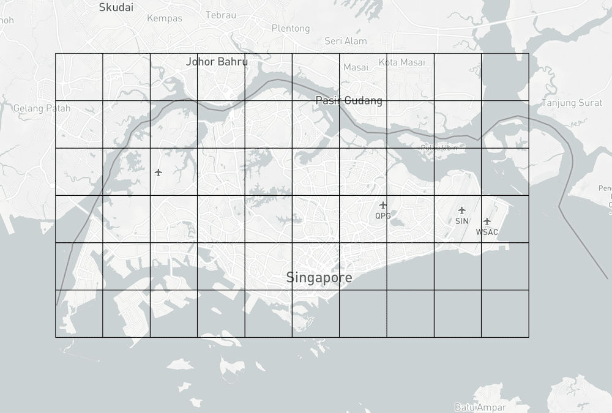
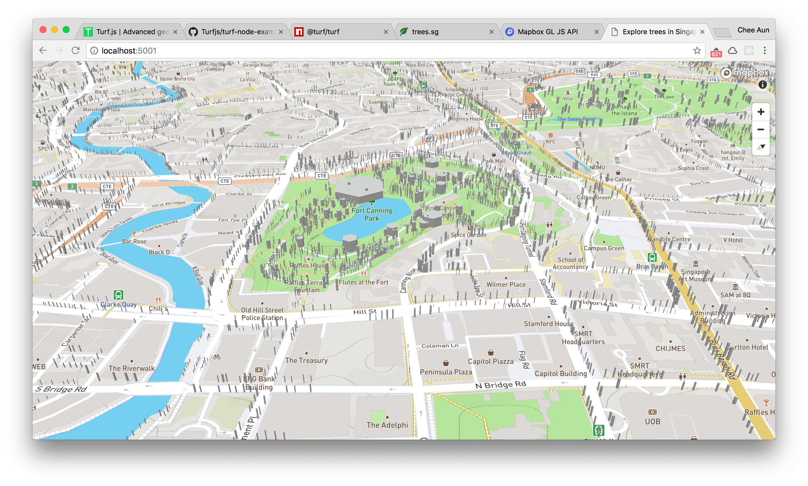

Building ExploreTrees.SG
===

On 17 March 2018, [National Parks Board](https://www.nparks.gov.sg/) (NParks) [launched a new portal site](https://twitter.com/nparksbuzz/status/974857306734120960), [Trees.sg](http://trees.sg), dedicated to trees in Singapore. It's [featured on Mothership.sg](https://mothership.sg/2018/03/trees-sg-map-nparks/) and [The Straits Times](http://www.straitstimes.com/singapore/new-national-parks-board-online-map-treessg-lists-locations-info-of-500000-trees), and [tweeted by the Prime Minister](https://twitter.com/leehsienloong/status/977007986236256256). The map took **10 months** to create at a cost of **$100,000**. It has a record of **500,000 trees** and was billed as the **most extensive tree map in Asia**.


On 18 March 2018, I [successfully scraped all the trees data](https://twitter.com/cheeaun/status/975272277926330369) from the site, which is roughly **600MB** in file size. According to the data, there's a total of **564,266 recorded trees**. I was super psyched to see how I could visualize the data to my heart's content.

Acquiring the data
---

Opening the [Chrome Developer Tools](https://developers.google.com/web/tools/chrome-devtools/), via the 'Network' tab, the initial requests for the map data look like this:

```
https://imaven.nparks.gov.sg/arcgis/rest/services/maven/PTM_View_Grid/FeatureServer/1/query?…
```

It seems to return *clusters* of the trees, which is not exactly what I want. As the map is zoomed in, individual trees start to appear.


The request endpoint changed to this:

```
https://imaven.nparks.gov.sg/arcgis/rest/services/maven/PTMap/FeatureServer/2/query?returnGeometry=true&where=1%3D1&outSr=4326&outFields=*&inSr=4326&geometry=%7B%22xmin%22%3A103.8482666015625%2C%22ymin%22%3A1.2935302390231982%2C%22xmax%22%3A103.85101318359375%2C%22ymax%22%3A1.2962761196418218%2C%22spatialReference%22%3A%7B%22wkid%22%3A4326%7D%7D&geometryType=esriGeometryEnvelope&spatialRel=esriSpatialRelIntersects&geometryPrecision=6&f=geojson
```

One particular query string that caught my eye is `geometry` which contains a value that looks like an encoded `JSON` string. Once the string is decoded, it looks like this:

```json
{
  "xmin": 103.8482666015625,
  "ymin": 1.2935302390231982,
  "xmax": 103.85101318359375,
  "ymax": 1.2962761196418218,
  "spatialReference": { "wkid":4326 }
}
```

Judging from the API URL address, I suspect it runs on [ArcGIS](https://www.arcgis.com/) to serve the data based on tile boundaries or something. I'm not very familiar with ArcGIS so I experimented with the REST API calls by modifying the queries. My first attempt was to put the **whole Singapore boundary** into the `xmin`, `ymin`, `xmax` and `ymax` values, but it returned an error probably due to response being too large and it timed out 😅

I was thinking, I probably would need to *chop* the whole Singapore boundary into multiple smaller boundaries and make an API request for every boundary. Judging from the vastness of Singapore and the zoom levels, I roughly guessed that it would be quite a lot of API requests and that sounds troublesome 😅

So… **I gave up**.

Yeap.

Nope. 😉 I needed something like a grid. Something that can auto-generate multiple boundaries from a single large boundary. I've been using [Turf.js](http://turfjs.org/) a lot in my previous projects, so I looked around and found [`squareGrid`](http://turfjs.org/docs#squareGrid). The example code looks like this:

```javascript
var bbox = [-95, 30 ,-85, 40];
var cellSide = 50;
var options = {units: 'miles'};

var squareGrid = turf.squareGrid(bbox, cellSide, options);
```

This code creates a square grid from a bounding box, `bbox`, with each cell having the side length of 50 miles (`cellSide`). According to [Wikipedia](https://en.wikipedia.org/wiki/Geography_of_Singapore), the mainland of Singapore measures 50 kilometres (31 miles) from east to west. If I want a grid of 10 cells horizontally, I guess I'll have to specify a cell side of 5 km. I tried it out with a rough boundary of Singapore and… it kind of worked. 😯



I might have missed the other parts of Singapore but fortunately, there are no recorded trees over *there* yet. 😌

I wrote a script to fetch the API responses for **every** boundary, and *boom*, I [got **all the data**](https://twitter.com/cheeaun/status/975272277926330369)! 🤩🤩🤩


Visualizing the trees
---

I looked at [Trees.sg](https://www1.nparks.gov.sg/trees) and wondered how I could do it differently. The data contains quite a few interesting information about the trees such as the girth size (meters), height (meters), age (years), species and type.

I find that the height information is quite odd because the value is stored like this: `>6 but ≤9` (interpreted as: more than 6 but less or equal to 9 meters). The `but` value is quite hilarious in my opinion 😆. I'm not an expert in this field, so pardon my amateur reaction as I realise that [tree measurements](https://en.wikipedia.org/wiki/Tree_measurement) can be so complicated!

My first attempt was to **push the limits** as much as possible by **drawing all the trees on a map in 3D**. 💥💥💥

[](../images/screenshots/software/3d-trees-girth-height-map-singapore@2x.png)

I have no idea why some of the trees overlap one another. Probably I [miscalculated the tree radius](https://twitter.com/cheeaun/status/975398673516396544) from the girth size or something. 🤷‍♂️

Here's a close-up:


The code, simplified:

```javascript
const radius = GRTH_SIZE/(Math.PI*2);

const circle = turf.circle(center, radius/1000, {
  steps: 6,
  properties: {
    height: parseInt((HEIGHT.match(/(\d+)[^\d]*$/) || [,0])[1], 10),
  },
});
```

I use [`Turf.circle`](http://turfjs.org/docs/#circle) to generate circle polygons with a radius calculated from the girth (`GRTH_SIZE`). The `steps` property is set to `6` instead of the default `64` for performance reasons, which explains why the tree 3D models look hexagonal (6 sides).

Since the height is a ranged value (between two values), I use a regular expression to pick the last number in the string. If the `HEIGHT` value is `>6 but ≤9`, the tree height will be 9 meters.

By using [Mapbox GL JS](https://www.mapbox.com/mapbox-gl-js/api/) and its [3D features](https://blog.mapbox.com/3d-features-in-mapbox-gl-js-e94734f12110), I manage to render the *extruded* polygons with both the girth and height values. However, the map was too embarrassingly** slow. Unlike buildings and skyscrapers, the trees were smaller and needed higher zoom levels. Without 3D terrain elevation data and [tree crown spread](https://en.wikipedia.org/wiki/Tree_measurement#Crown_spread) data, it doesn't seem realistic or useful enough in my opinion.

It may look super cool and *can* be done, but it doesn't mean that it *should* be.

So… **I gave up**.

Yeap.

Nope. 😂 I downgraded it to [a simple 2D version](https://twitter.com/cheeaun/status/975535356924669952). I personally find it quite difficult to gauge the density of the recorded trees in [Trees.sg](https://twitter.com/cheeaun/status/975535356924669952) due to the clusters.

I want to see **all** trees in the whole of Singapore **without** clusters.

[Behold](https://twitter.com/cheeaun/status/975763429402198017).

[](../images/screenshots/software/all-trees-singapore@2x.png)

Similar to Trees.sg, the circle markers also have different sizes based on their girth widths.

[](../images/screenshots/software/all-trees-around-singapore-botanic-gardens@2x.png)

[](../images/screenshots/software/all-trees-in-singapore-botanic-gardens@2x.png)

[](../images/screenshots/software/all-trees-near-fort-canning-singapore@2x.png)

Even though I manage to make this work, the map is **still kind of slow** when panning and zooming around. 😭

Deep diving into the data
---

I researched on Google and found this article on [Working with large GeoJSON sources in Mapbox GL JS](https://www.mapbox.com/help/working-with-large-geojson-data/). There's the '[Even bigger data](https://www.mapbox.com/help/working-with-large-geojson-data/#even-bigger-data)' section that states:

> If your source data starts to get really large (over 500,000 data points), there are a couple other techniques you can use to improve speed.

So it seems that **500,000** is like a magic number when performance issues will start happening for Mapbox GL JS. And yes, coincidentally there are more than 500,000 data points for the trees 😏.

The first technique is called 'Source splitting', which is to break up the GeoJSON sources so that I can double or triple the ability for data loading and rendering. I tried it but it still doesn't feel significantly faster, especially on a mobile. 😔

The second technique is to use [Tippecanoe](https://www.mapbox.com/help/large-data-tippecanoe/), which I end up using for ExploreTrees.SG. With [Tippecanoe](https://github.com/mapbox/tippecanoe), I generate [vector tilesets](https://www.mapbox.com/developers/vector-tiles/) in [MBTiles](https://github.com/mapbox/mbtiles-spec) format from the large GeoJSON files, upload it to [Mapbox Studio](https://www.mapbox.com/mapbox-studio/), and load it on the web with Mapbox GL JS.

Sounds easy? Nope. I spent more than 10 days *massaging* the data, deduplicating trees that seem to be the same(?), interpreting the tree types that are not consistent at all and [playing around](https://twitter.com/cheeaun/status/977756905564073985) with various [options](https://github.com/mapbox/tippecanoe#options) in Tippecanoe.


At lower zoom levels, Tippecanoe will drop or coalesce a fraction of features (data points) by setting some limits on the number of features and tile sizes. It's almost the same concept as clustering but with *more* control and the "clusters" are *much* smaller and more geographically detailed.

As how Tippecanoe described its intent:

> If you give it all the building footprints in Los Angeles and zoom out far enough that most individual buildings are no longer discernable, you should still be able to see the extent and variety of development in every neighborhood, not just the largest downtown buildings.

During my trials and errors in generating the vector tiles, I find it difficult to *preserve* certain data points. There are two *special* type of trees that are highlighted on Trees.sg; *heritage* trees and *flowering* trees. In a way, I want to *prioritize* these trees and make sure they *always* appear in *any* zoom levels.

Tippecanoe defines a [GeoJSON extension](https://github.com/mapbox/tippecanoe#geojson-extension) that can *enforce* the *appearance* of the features. Here's an example:

```json
{
    "type" : "Feature",
    "tippecanoe" : { "maxzoom" : 9, "minzoom" : 4 },
    "properties" : { "FULLNAME" : "N Vasco Rd" },
    "geometry" : {
        "type" : "LineString",
        "coordinates" : [ [ -121.733350, 37.767671 ], [ -121.733600, 37.767483 ], [ -121.733131, 37.766952 ] ]
    }
}
```

This `LineString` feature will be preserved from zoom level 4 until zoom level 9, stated in the `tippecanoe` property.

However, when I try this out, the important features are *still* being dropped at some zoom levels, which I generally don't quite understand. I might be running this incorrectly and finally I decided to use [the solution mentioned in one of the GitHub issues](https://github.com/mapbox/tippecanoe/issues/351#issuecomment-273575593). The solution is to split the data into **two** GeoJSON files, separating the important trees and *other* trees, generate **two** vector tiles and **join** them back again with [`tile-join`](https://github.com/mapbox/tippecanoe#tile-join).

The commands:

```bash
$ tippecanoe -f -r1 -l trees -o data/trees-important.mbtiles data/trees-important.geojson
$ tippecanoe -f -r2 -Bg -as -ae -l trees -o data/trees-other.mbtiles data/trees-other.geojson
$ tile-join -f -o data/trees.mbtiles data/trees-other.mbtiles data/trees-important.mbtiles
```

Note that `-r1` option is used for important trees to preserve all of them *without* point dropping.

As a result, it becomes *super easy* to spot the heritage and flowering trees! Instead of *realistically* marking all markers as green, they are applied with *distinct* colors to make them stand out on lower zoom levels (lime for heritage trees, red for flowering trees).


I even styled them with bigger radii to make sure they're more visible.


Amazingly, I also found a tree in Katong Park that's **both** a heritage tree *and* flowering at the same time! 🤯 (Color-coded as pink)


I'm so excited to see that it works that I also applied the same visual treatment for styling the trees based on girth width… (yellow for thinnest, red for widest)


…and tree age. (yellow, green and red for less than 50 years, pink for 100 years and above)


**Not all** trees have girth and age information, so they are sort of *grayed out*.

There is *one more thing* that I wanted to visualize: the **tree species**. I checked the data and found **1,709 species** in total. Color-coding such large amount of data points would be quite *gibberish* in my opinion, so I decided to group them up and visualize the **tree families** instead.

Surprisingly the data that I fetched from Trees.sg doesn't have the tree family information, but on the site, it contains that information. 🤔


A little detective work reveals that it's from yet another (`POST`) API call:

```
https://www1.nparks.gov.sg/ptmapi/TreeInformationApi/GetTreeInformation
```

Again, I sprinkled my scripting magic to fetch *all* tree families, construct a list of species-to-family mappings, reinforce the tree family information to the GeoJSON files, regenerate the vector tiles, and reupload them again to Mapbox Studio.

[**Feast your eyes**](https://twitter.com/cheeaun/status/979547016911994880) on this map of **65 tree families** in its **full rainbow glory**. 🤩😍🌈

[](../images/screenshots/web/tree-families-singapore-exploretrees-sg@2x.png)


Obviously the color range is not 100% perfect because I did a simplistic hue rotation from 0 to 300 (not 360), and apply them with [HSL](https://en.wikipedia.org/wiki/List_of_color_spaces_and_their_uses#HSV_and_HSL) color space.

I'm not particularly knowledgeable in choosing colors for data visualization so I did a little research and found Mike Bostock's [A Less-Angry Rainbow](https://bl.ocks.org/mbostock/310c99e53880faec2434). I learned that HCL contains a more constant luminance than HSL, and Cubehelix rainbow extends that further while looking prettier 💅. These color spaces are also part of [d3-color](https://github.com/d3/d3-color), which helps a lot for me to try them out.

The next few hours after that, I was drowning in the *psychedelic* world of colors and research papers of data visualizations on the Internet 😵. I manage to pull myself back to reality and simply stick to HSL since it's easier to manipulate with CSS and on Mapbox GL JS. Mapbox GL JS *does* support [RGB, Lab and HCL color spaces](https://www.mapbox.com/mapbox-gl-js/style-spec/#function-colorSpace) but there doesn't seem to have any examples on how to use them and it's not yet supported on non-JS platforms. 🤔

Designing the User Interface
---

While tinkering with the data, I iterated and evolved the UI quite a few times.

From the default 'Street' tiles in Mapbox GL JS, I changed it to 'Light' tiles to match Trees.sg, and finally settled with 'Dark' tiles so that the data points would stand out.

My main goal for this project is to make it super easy to *explore* trees, which leads to these requirements:

- **Super-quick information popovers** when hovering over the data points. Unlike Trees.sg, it won't have any clusters so that users don't need to keep zooming in until they see individual trees. It has to be super-quick because I personally don't have the patience to click on the trees one-by-one to see more information 😅 (Remember, there are 500,000 of them).
- **Quick scanning of data points**. On lower zoom levels, users would be able to quickly scan *within seconds* for the heritage trees, flowering trees, oldest trees, trees with the widest girth, or specific tree families. This goal has already been achieved by my initial attempts.
- **Geolocation feature** for users to find trees around their current location. Since this feature is more common among mobile phone users, the web app has to be **mobile-optimized**. Trees.sg has this feature too.

For the informations popovers, it'll only work on devices supporting mouse hovers. For touch devices, users will still have to tap on them. 😢


There are 4 layers of visualization; tree type, girth size, age and family. They are shown in the Layers panel, hidden by default on smaller screen sizes and can be shown by clicking on the 'map' icon at the top right.

The UI for the Layers panel is mostly inspired by Apple Maps' Settings popover.


The Layers panel also includes relevant information and legends for the data points. For example, when the 'Family' layer is selected, it'll show legend for all tree families. As the screen size is larger, the Layers panel will be shown at the top left by default.


On Trees.sg, when the map is zoomed in to a higher level, it will switch to the satellite view from Google Maps. I think it make sense as people could *map* the plotted trees to the real trees on actual satellite images.

Despite that, it can be quite blurry and sometimes don't work too well…


I thought Mapbox's satellite tiles *could* be better but boy was I wrong 😅


I agree that it's a *logical* idea, but ideally speaking, it doesn't work well as the satellite images can be a bit messy and congested with too much information. If the satellite images are outdated, some of the recorded trees might be plotted on newly developed or demolished sites.

I decided to show the satellite image inside the information popover instead.


The information popover also includes a 'Learn more' link to [NParks Flora & Fauna Web](https://florafaunaweb.nparks.gov.sg/) (warning, very slow site), for each individual tree species, for example this page on [*Sterculia* *parviflora* Roxb](https://florafaunaweb.nparks.gov.sg/Special-Pages/plant-detail-master.aspx?id=1848).

Unlike Trees.sg, ExploreTrees.sg doesn't have these features:

- Location and species search
- Layers for tree conservation areas and heritage roads
- Additional information like tree benefits and pruning date
- Photo uploading for flowering trees
- Hugs (Facebook Like 👍, for trees)
- Treemail (Send a post, message or photo to specific trees)

I'm not sure if I'll implement them soon but so far, I think it's good for now for ExploreTrees.SG ([MVP?](https://en.wikipedia.org/wiki/Minimum_viable_product)).

Honestly, I never even thought of creating a web app out of this in the first place, as my [initial intention](https://twitter.com/cheeaun/status/975708579976982529) was just to visualize the data for fun. 😝

Launching ExploreTrees.SG
---

Ever since the day I posted about [my attempt to scrape the data](https://twitter.com/cheeaun/status/975272277926330369), it's been retweeted and liked a few times, especially [this tweet by @ruanyf](https://twitter.com/ruanyf/status/975889480698572800). Even [@OpenDataTaylorSwift retweeted it](https://twitter.com/t_s_institute/status/975398354690674688), [twice](https://twitter.com/t_s_institute/status/976012797543899137)! 😂 #achievementunlocked


On 27 March, I showed [a sneak peek](https://twitter.com/cheeaun/status/978451797248425984).

On [2 April](https://twitter.com/cheeaun/status/980627763781513216), I **launched [ExploreTrees.SG](https://exploretrees.sg/)** to the public 🚀.

[Some](https://twitter.com/jg_lim/status/975400158706860032) [folks](https://twitter.com/uzyn/status/976700816504471553) might be wondering why I don't call it 'treerouter.sg'. Firstly, I've built 3 web apps with the word 'router' prepended; [busrouter](https://github.com/cheeaun/busrouter-sg), [railrouter](https://github.com/cheeaun/railrouter-sg) and [taxirouter](https://github.com/cheeaun/taxirouter-sg). Though it has become sort of a *brand* for me, I'm kind of bored of it and perhaps wanted to reserve it for transportation-specific purposes. [Trees.sg](http://trees.sg) domain is already taken (seriously good domain in my opinion), so I thought why not append a verb to it, and voilà, [ExploreTrees.SG](https://exploretrees.sg/) 😂.

Feedback has been good and *moderate* so far. Obviously I wouldn't want my project to take the attention away from [Trees.sg](http://trees.sg) since I believe that those guys have done **way more work** than I do.

In fact, during the few days of building this project, a few people have indirectly helped me along the way. [Steve Bennett](https://twitter.com/stevage1/status/976682256860246016) have built a similar project called [OpenTrees.org](http://www.opentrees.org/). [Hannah Yan](https://twitter.com/hannahyan/status/978303790108454913) referred me to other projects like [Treepedia by MIT Senseable City Lab: Singapore](http://senseable.mit.edu/treepedia/cities/singapore) and [An Interactive Visualization of NYC Street Trees](https://www.cloudred.com/labprojects/nyctrees/). My further research reveals *even more* projects that are quite similar and I've listed most of them in [my project's README](https://github.com/cheeaun/exploretrees-sg).

I still find it quite unbelievable that all these happened in just **two weeks**. From a tiny curiosity, leads to a super cool full-fledged interactive data visualization web app.

I've learnt *so much* and [open-sourced everything on GitHub](https://github.com/cheeaun/exploretrees-sg). I *really* hope that this will help others to learn more, as much as it helps me. 😊

Happy [tree exploring](https://exploretrees.sg/). 🌳🚶‍♂️🚶‍♀️