Building Check Weather SG
===

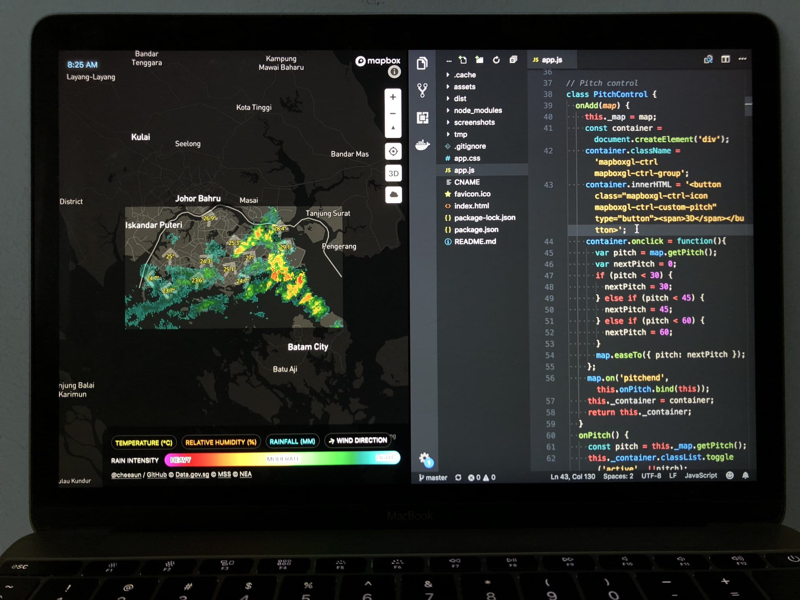

Over the past 9 years, since the day I step foot into Singapore, I've never even once seen a reliable weather forecast for Singapore. Singapore is only a tiny island on the world map and it's nearly impossible to predict or forecast the weather. It's always either rainy 🌧 or sunny 🌞. Or *(cough)* hazy 🌫.

Somehow this reminds me of 4 years ago, when I flew to San Francisco for the first time, when the weather potentially became a viable topic for day-to-day conversations, I always use this cool web app called [Forecast.io (now called Dark Sky)](https://www.theverge.com/2016/9/20/12994194/dark-sky-website-launches) which gives pretty *scarily* accurate weather forecast, including temperature changes, wind speed and precipitation. Some people told me that San Francisco has this unique micro-climates going on, for example, as you walk around the city, temperatures could drop dramatically and suddenly becomes warm after that. Also not forgetting, [Karl the fog](https://twitter.com/KarlTheFog) 😉.

I personally find this quite amazing for a city as *huge* as San Francisco, but oh, wait, wait the minute… it's not huge at all. Turns out, it's [smaller than Singapore](https://thetruesize.com/#?borders=1~!MTI3OTAxMDA.MTI3NTQ2MzQ*NTc5NjcwMg(NTcwODgxMQ~!SG*MTM1OTc1NDQ.MjIyNDIyMzk)Mw) 😅

[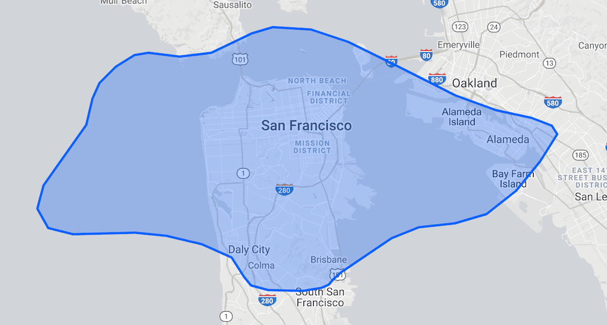](https://thetruesize.com/#?borders=1~!MTI3OTAxMDA.MTI3NTQ2MzQ*NTc5NjcwMg(NTcwODgxMQ~!SG*MTM1OTc1NDQ.MjIyNDIyMzk)Mw)

Like, way, *way* smaller. That blue region is Singapore. 🔥 **Burn** this image into your mind.

Here's the question(s). How could a smaller city gets a much more accurate weather forecast than a bigger city/country? Is it because of the satellites? Is it because of the geography? Does the size even matter?! 🤔🤔🤔

I don't have the answers. 🤷‍♂️

However recently I found that some brilliant people I know, including myself 🧐, start to use [Weather.gov.sg](http://www.weather.gov.sg/) for the most *reliable* weather forecast in Singapore.

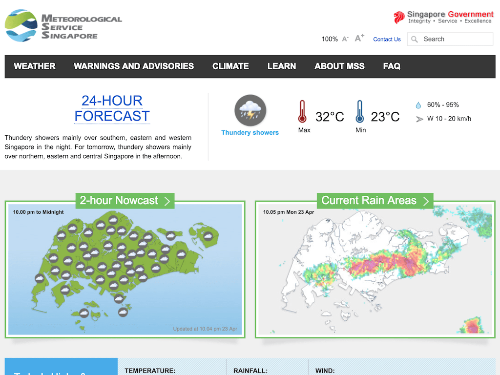

Nope, not the [2-hour Nowcast](http://www.weather.gov.sg/weather-forecast-2hrnowcast-2/) (on the left). Not the [24-hour Forecast](http://www.weather.gov.sg/weather-forecast-24hrforecast/) either. It's the [50-km rain area radar images](http://www.weather.gov.sg/weather-rain-area-50km/) (on the right) instead.

Most of the time, the only weather that matters is whether it rains or not, because that affects the road traffic and people traffic around Singapore, *especially* during peak hours.

From the radar images, it shows rain areas which tells exactly where in Singapore to… **avoid**. It's useful for public transport users, so that they can avoid people traffic in the stations or the bus stops. Taxi riders can choose a different spot to pick up cabs or decide their next stop based on the *shapes* of the rain areas. Motorcyclists and vehicle drivers can avoid the rain by taking different routes as they would expect traffic jams in those areas. Also, for motorcyclists and cyclists, they would need to reroute so that they don't have to wear raincoats or stuck under a bridge. 😉

By looking at the radar animation, people could roughly guess *where* the rain is heading to. In other words, they are not even relying on the provided forecast information, they are literally **forecasting the weather themselves!** 💥

Thinking about it, it *does* make sense. If the forecast is not 100% accurate, better leave that judgment to yourself…? 😅😅

Anyway… the radar images have become an integral part of some peoples' lives. However in *my* opinion, those radar images are a bit… blurry and looks *outdated*.

I felt that it needs a new *perspective*. A new design *uplift*.

I think it's time to move on from raster to vector. 💥💥💥

Here are the **5 essential steps** that I've formulated in my head:

1. **Acquire the boundary coordinates for the radar images**. Technically north, south, east and west sides.
2. **Render the radar image on Mapbox GL JS**. I need to see if it really works and looks the same as the one on Weather.gov.sg
3. **Convert radar image to vector**. If I could find any tools to do this, it would be helpful. Else, I'll need to figure it out with something else.
4. **Render the vector *with* the radar image on Mapbox GL JS**. Again, to check if it works and looks the same. At least to make sure the conversion and calculations are correct.
5. **Optimizations & improvements**. At this step, things would have been more realistic and I can move on to performance optimizations, feature improvements and design aesthetics.

Acquire the boundary coordinates for the radar images
---

This step took me a few surprising *round-trips*.

On the [Weather.gov.sg site](http://www.weather.gov.sg/weather-rain-area-50km/), there are no information on the boundary coordinates. I didn't look at the source code and assumed that the site simply overlay the radar image on a Singapore map.

My first attempt was to sniff the API calls from [myENV iOS app](https://itunes.apple.com/sg/app/myenv/id444435182?mt=8), which is [built and designed by the wonderful folks at Buuuk](https://buuuk.com/work/nea). I'm a fan of their work and thought that it would be cool to see how they worked out with the APIs. I manage to pinpoint to this URL:

```
http://cdn.neaaws.com/rain_radar/dpsri_70km_Remove_XXXXXXXXXXXX0000dBR.dpsri.png
```

The `XXXXXXXXXXXX` value in the URL is a 12-character date-time string, for example `201805152335` represents 15 May 2018 at 23:35 (11:35PM). The last four zeros probably represents the milliseconds but seems like not needed to be modified. And not sure what `dBR` means. 🤷‍♂️

This radar image is a bit different that the one on [weather.gov.sg](http://www.weather.gov.sg/home/):

```
http://www.weather.gov.sg/files/rainarea/50km/v2/dpsri_70km_XXXXXXXXXXXX0000dBR.dpsri.png
```

So the former is a 70km radar image, and this one is a 50km image… despite the file name has the word `70km` there. 😅 One is served from `cdn.neaaws.com` which is obviously hosted on [AWS](https://aws.amazon.com/), and the other is under `weather.gov.sg` domain. It's all pretty confusing but throughout my tests,  `weather.gov.sg` seems to serve the latest radar images much earlier than `cdn.neaaws.com`.

Anyway, as I sniff the API calls on myEnv app, I found some coordinates. They are pretty rough, and I'm not sure if they're accurate, so I tried them out and they kind of worked…(?)

A few weeks later, to my surprise, I discovered that the source code of [Weather.gov.sg](http://www.weather.gov.sg/weather-rain-area-50km/) site actually contains the coordinates! In fact, there are 8 coordinates?!?

```javascript
function calculatePosition(basemapImg,latitude,longitude){
	  /* var map_latitude_top = 1.490735;		 
	  var map_longitude_left = 103.568691;
	  var map_latitude_bottom = 1.177710;		 
	  var map_longitude_right = 104.134487; */
	var map_latitude_top = 1.4572;		 
	  var map_longitude_left = 103.565;
	  var map_latitude_bottom = 1.1450;		 
	  var map_longitude_right = 104.130;
		var width_calibration = 20720;
		var height_calibration = 246;
		var zoom_level_height = 200;
		var zoom_level_width = 200;
		var imgWidth  = basemapImg.width;
		var imgHeight = basemapImg.height;
		var scale		  = imgWidth/100;
...
```

Some of them worked, some don't. Some of the edges were off by few degrees and don't look the same as the displayed map image on weather.gov.sg. Obviously at this point, I'm throwing numbers around randomly and trying to get things as accurately as possible.

It got me thinking; does accuracy even matter at all? Looking at it, the radar images are actually quite low in resolution and some measurements could have been rounded off. The folks maintaining weather.gov.sg might have tweaked the coordinates even further to make it look good on the web site. Do anyone care if the accuracy is off by a few degrees?

Finally I end up using these values:

- Lower latitude = 1.156°
- Upper latitude = 1.475°
- Lower longitude = 103.565°
- Upper longitude = 104.130°

Disclaimer: these values **are not accurate**.

Convert radar image to vector
---

I have the radar image with width and height information. I have the boundary coordinates for all four sides.

Theoretically speaking, [the math is sound](http://siliconvalleyism.com/silicon-valley-image.php?id=732).

I did a little research on the Internet and the only relevant resource that I found is this article: [Creating vector tiles from raster datasets](https://blog.mapbox.com/creating-vector-tiles-from-raster-datasets-f8c9dc652c97). It uses [`make-surface`](https://github.com/mapbox/make-surface) for the raster-to-vector conversion with "triangulated" data. It looks pretty cool but the tool does seem a little complicated and much overkill for a *tiny* region like Singapore. 😅

Instead, I did the *simplest* thing that I could think of: converting every pixel in the radar image into vector coordinates. The radar image is a PNG image, so I did a quick [`npm` search](https://www.npmjs.com/search?q=png%20parser) and voilà, [pngjs](https://github.com/lukeapage/pngjs) is found.

The main idea here is to parse the PNG file, loop through every single pixel, extract the color information, convert X and Y coordinates into latitudes and longitudes, generate GeoJSON polygons and lastly output a GeoJSON file. 💥💥💥

I'm generally not going into the details and the [source code is available](https://github.com/cheeaun/rain-geojson-sg) 😉. Those who have learned digital image processing in college/university or did some work with [HTML5 canvas](https://en.wikipedia.org/wiki/Canvas_element), will be able to guess what I did. Those who hasn't, could start by reading this article, [Pixel Manipulation with canvas](https://developer.mozilla.org/en-US/docs/Web/API/Canvas_API/Tutorial/Pixel_manipulation_with_canvas). 💪

Render the vector with the radar image on Mapbox GL JS
---

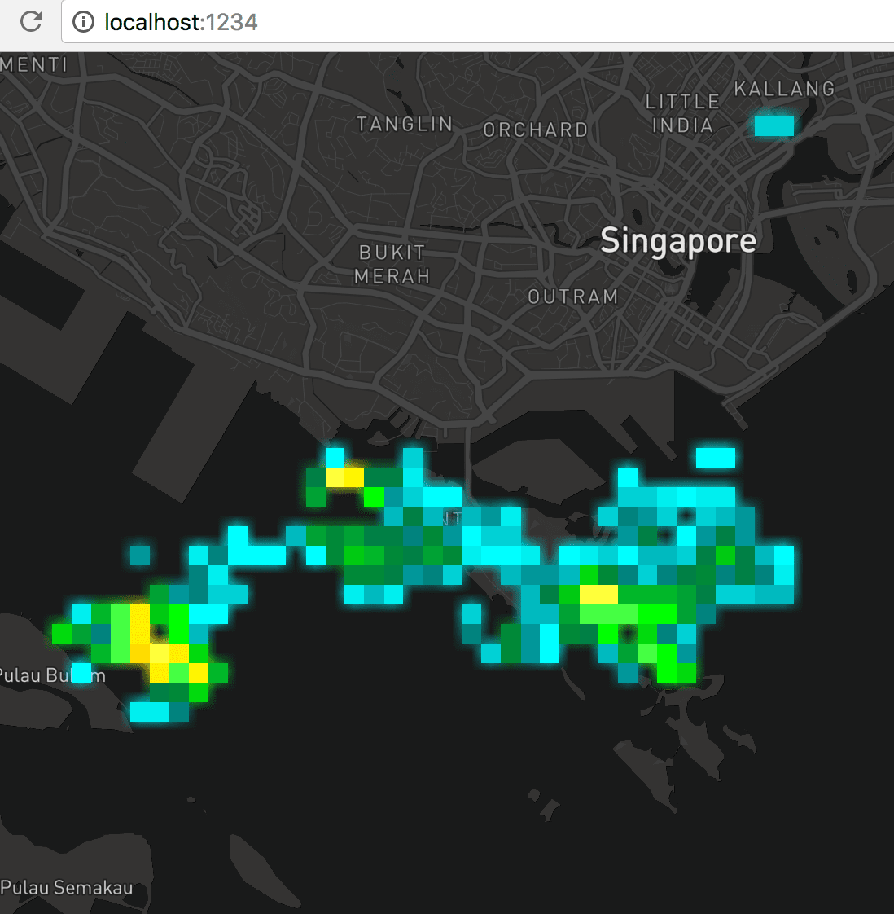

I did a super quick demo page and… [it worked](https://twitter.com/cheeaun/status/982477428713963527)! 😱 The screenshot above might not show it clearly, but the blurry shadow-like edges around the square shapes is the radar image itself. For the radar images, it becomes blurry when zoomed in. For the GeoJSON vector polygons, it stays sharp. Judging from the squares overlapping on the blurry edges, it proves that the math is correct and the conversion works! 💪

Optimizations & improvements
---

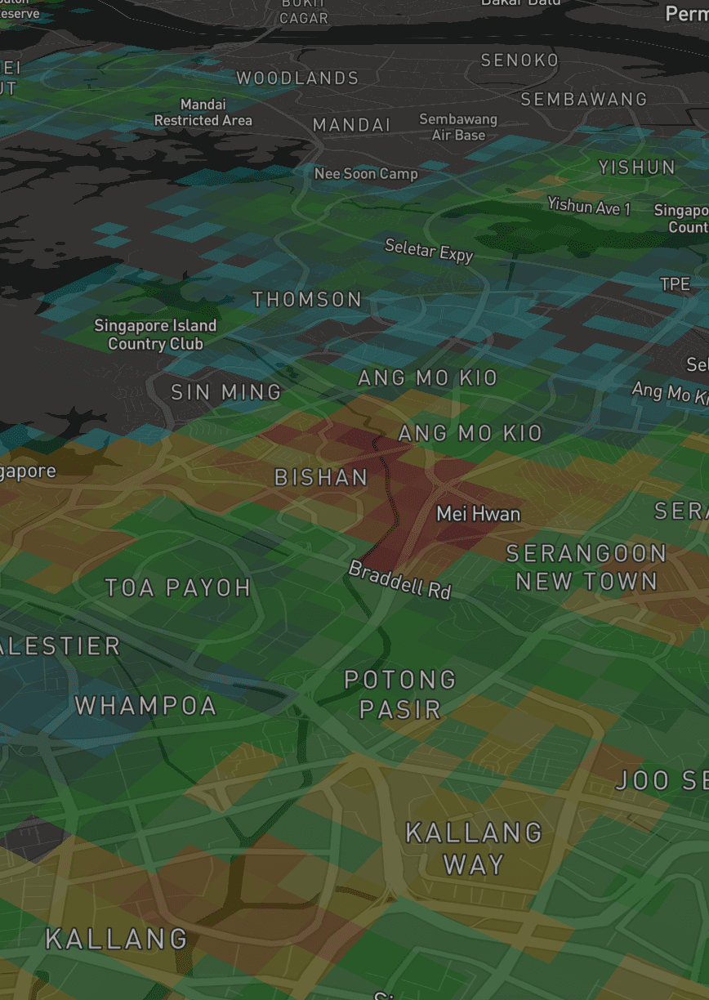

With [Mapbox GL JS](https://www.mapbox.com/mapbox-gl-js/api/)'s features, the polygons can even be [viewed with a slanted 3D pitch](https://twitter.com/cheeaun/status/982555182520086528) and applied with different opacity styles!

Since it's already viewable in 3D, why not add a little [extrusion](https://blog.mapbox.com/3d-features-in-mapbox-gl-js-e94734f12110)? 🤩

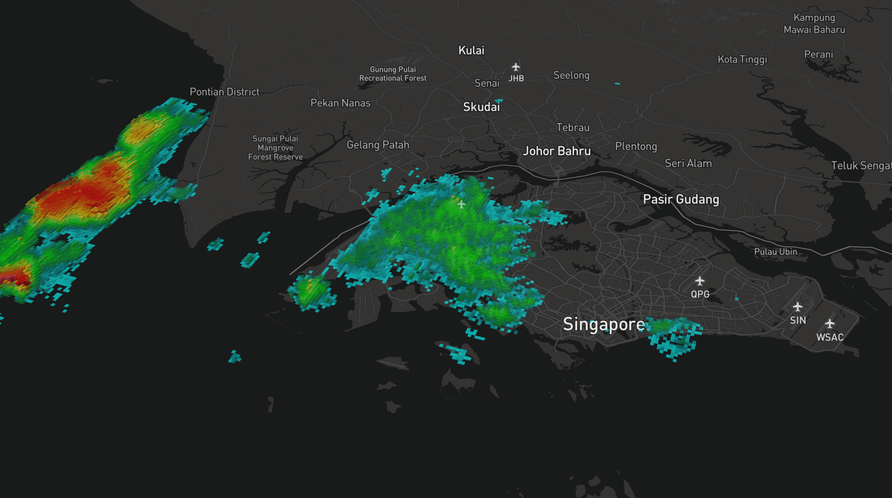

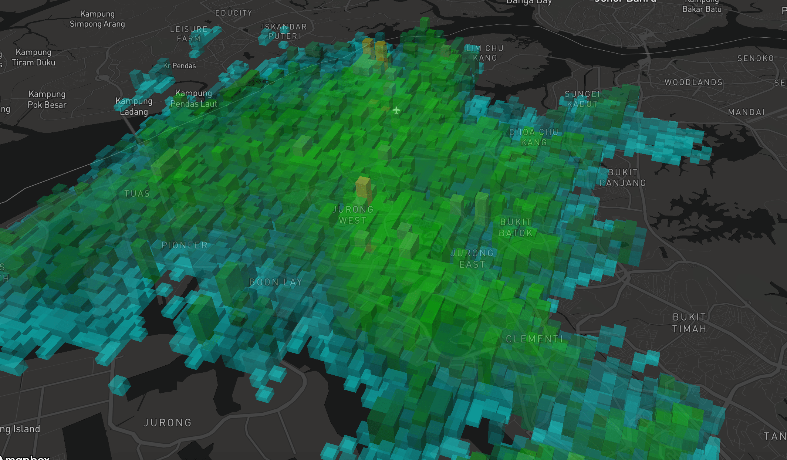

For this extrusion feature to work, I need more than color information from the radar image. Basically, higher rain intensity (heavier) translates to higher 3D extrusions (taller).

Here's a relatively simple diagram:


I took the first step in color-picking the rain intensity legend on [weather.gov.sg](http://www.weather.gov.sg/weather-rain-area-50km/). It's a bit rough and may not match the colors found from the radar image, so I use a library called [`nearest-color`](https://github.com/dtao/nearest-color) to *map* the colors to the list of colors that I picked. For example, if the color on the radar image is `#40FFFE`, then it'll be mapped to `#40FFFD` from the `intensityColors` list.

From the intensity colors list, I only have colors but I don't have any scientific values for rain intensity. From [weather.gov.sg](http://www.weather.gov.sg/learn_observations/), the rainfall measurement section explains:

> MSS uses the tipping bucket rain gauge, which uses a seesaw mechanism to measure both the amount and intensity of rainfall — when rain fills one end of the ‘bucket’ to the brim, it tips over and is recorded as a quantum unit of rainfall (e.g. 0.1 mm). The more the ‘bucket’ tips from side to side, the higher the amount of measured rainfall. The faster the ‘bucket’ tips from side to side, the higher the intensity of measured rainfall.

I guess… this is a little complicated, so I did a super simple *assumption* by assigning ranged values from 0 to 100, where 0 is for least intensity (aqua) and 100 is for highest intensity (pink). Moderate intensity (green or yellow) would have values around 50.

```json
{
	"type": "Feature",
	"properties": {
		"color": "#00efef",
		"intensity": 7
	},
	"geometry": {
		"type": "Polygon",
		"coordinates": [...]
	}
}
```

Each GeoJSON polygon contains two values; `color` in hexadecimal format and `intensity` in numbers ranging from 0 to 100. Using these values, I could apply them to the 3D extrusions of the polygons. The Mapbox style expression looks like this:

```javascript
'fill-extrusion-height': ['*', 50, ['get', 'intensity']]
```

The height of extrusion is further multiplied by 50 to make them look more awesome on the 3D map. 💥

After that, I realised that some of the square polygons of the same colors are *duplicated* on the map. The dimension of the radar image is 217×120, which means the GeoJSON file will contain a maximum of 26,040 polygons, which results in 26,040 squares/cubes to be rendered on the map. I could perhaps reduce the number of polygons by merging polygons with the same color/intensity.

I tried using [Turf.js union](http://turfjs.org/docs/#union) and [martinez](https://github.com/w8r/martinez) which can perform union operation on polygons, but to no avail. Somehow the polygons are merged in a weird way which I have no idea what happened. I tried a few other solutions and finally manage to make it work with [polygon-clipping](https://github.com/mfogel/polygon-clipping).

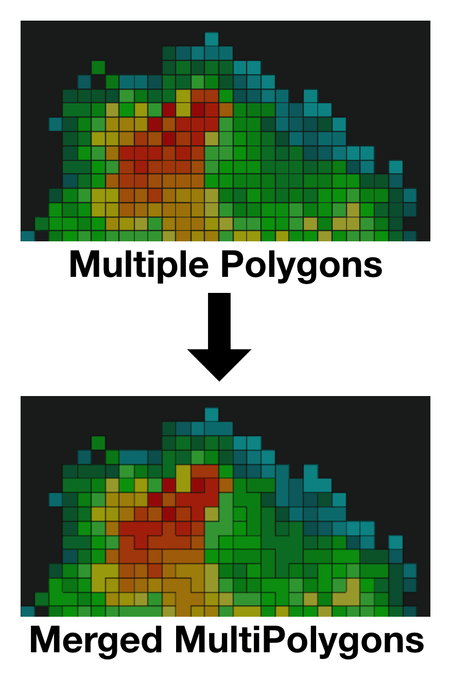

In this step, I'm killing two birds with one stone:

1. The number of polygons are reduced. Any adjacent polygons with the same color will be merged into a single polygon.
2. All polygons with the same color are grouped together into a `MultiPolygon`, one of the [interesting geometries in GeoJSON](https://en.wikipedia.org/wiki/GeoJSON#Geometries).

This [optimization](https://twitter.com/cheeaun/status/982932686397366274) reduced the number of polygons, resulting in smaller file size and better rendering performance.

On 8 April, I [open-sourced](https://twitter.com/cheeaun/status/982997632812380161) my work on converting the rainfall radar images to GeoJSON, on [GitHub](https://github.com/cheeaun/). 🚀

The unexpected final step
---

So my [Proof of Concept](https://en.wikipedia.org/wiki/Proof_of_concept) works and... my job is done! 🙌

This is when I thought to myself, should I build a web app out of this? Is this going to be "Yet Another Weather App" (YAWA)? Am I going to register another SG domain again? Who's going to use this app? Is this any better than [weather.gov.sg](http://www.weather.gov.sg/)?

Whatever, I built it anyway. I showed [a sneak peek on 9 April](https://twitter.com/cheeaun/status/983160181084241925).

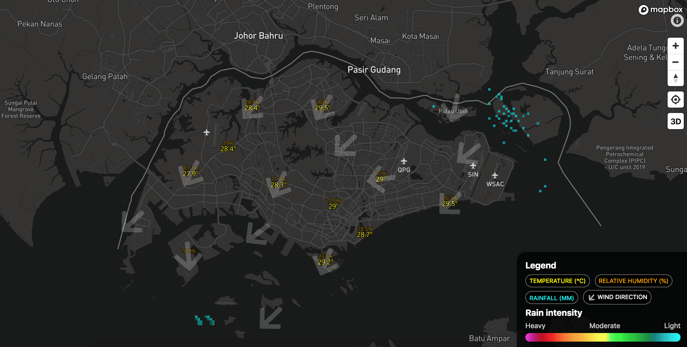

In this screenshot, there are tiny specks of clouds in aqua-ish colors. I manage to integrate additional weather information such as [temperature](http://www.weather.gov.sg/weather-currentobservations-temperature/), [rainfall](http://www.weather.gov.sg/weather-currentobservations-rainfall), [relative humidity](http://www.weather.gov.sg/weather-currentobservations-relative-humidity) and [wind](http://www.weather.gov.sg/weather-currentobservations-wind) (direction); each of them only visible at certain zoom levels so that the user won't be bombarded by lots of numbers on the map. To onboard new users, I add a simple legend panel at the bottom right.

It took roughly 5 days to test it myself, as I kept tweaking every little detail and [adding the finishing touches](https://twitter.com/cheeaun/status/985161104073437185).

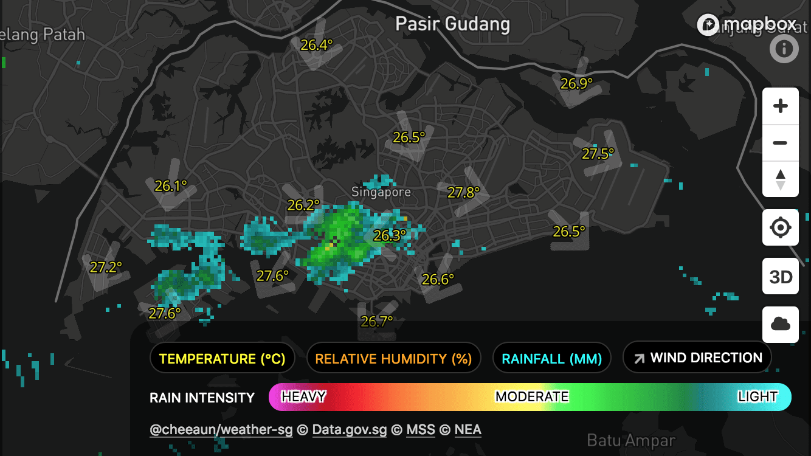

The legend panel is readjusted to take less space.

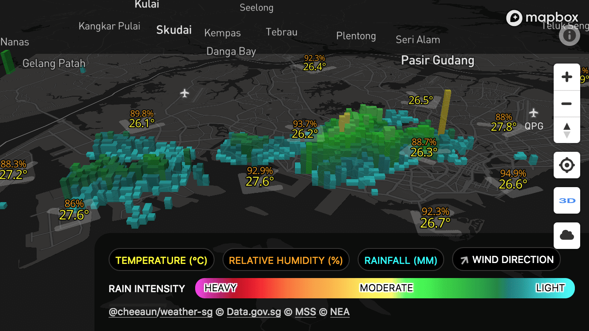

"3D mode" can be triggered via the '3D' button on the right. Tapping it multiple times will adjust the tilt (pitch) of the map. Polygons are extruded with heights based on their rain intensity values.

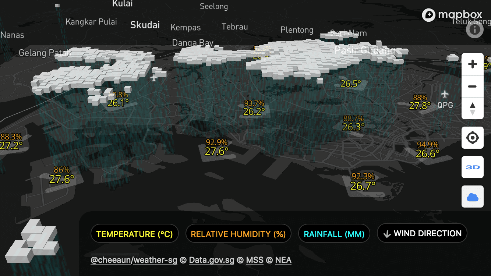

This "Cloud mode" is perhaps the coolest thing I ever came up with.

Technically speaking, it's quite similar to "3D mode" but I have to change the **elevation** and **height** (extrusion) of the polygons. The elevation values (height of clouds from land base) are not accurate and purely estimated.

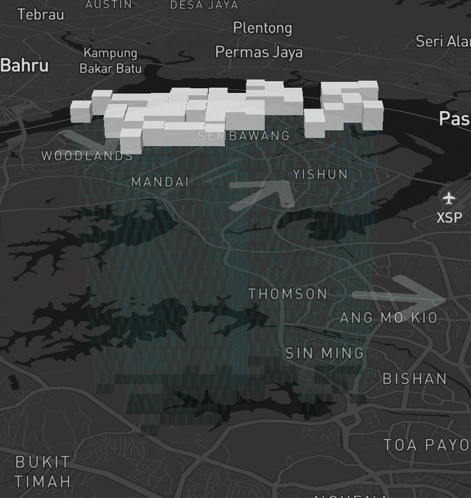

The patch of clouds are *literally* floating on the map as they can cover the map labels *behind* them. There are rain patterns made possible via the [`fill-extrusion-pattern` style](https://www.mapbox.com/mapbox-gl-js/style-spec/#paint-fill-extrusion-fill-extrusion-pattern), which are *actually* 3D polygons with *fixed* heights from the bottom of the clouds to the land base. Assuming that the sun's position is always at the top, a few more (2D) polygons are added at the base to simulate subtle drop shadows. If I take the wind direction into account, I probably could have tilted the rain drops but… let's leave that for another day. 😄

On [15 April](https://twitter.com/cheeaun/status/985405046937432064), I launched [Check Weather SG](https://checkweather.sg/) to the public. 🚀 It's also [open-sourced on GitHub](https://github.com/cheeaun/checkweather-sg). There were a few hiccups in the beginning but I manage to iron them out pretty quickly.

Once in a while, I like [tweeting nice screenshots](https://twitter.com/cheeaun/status/986848547302555648) and [discover bugs](https://twitter.com/cheeaun/status/999304424244658176) like this:

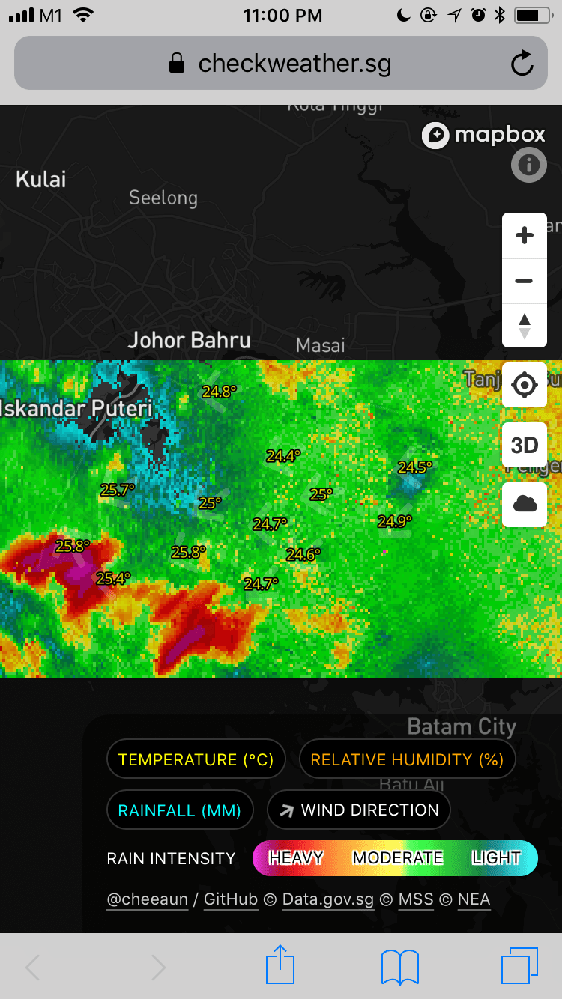

So when it's raining all over the place, users can't really see Singapore anymore 😅.

Few days later, I [fixed it](https://twitter.com/cheeaun/status/1002698753097097216) by applying opacity based on rain intensity. So, low intensity areas (aqua) will be less visible and high intensity areas will be more visible (pink). I agree that it's not the best solution, but it works for now. One possible flaw would be, what if it's heavy rain (pink) all over the area, which will still end up hiding the whole Singapore 😅.

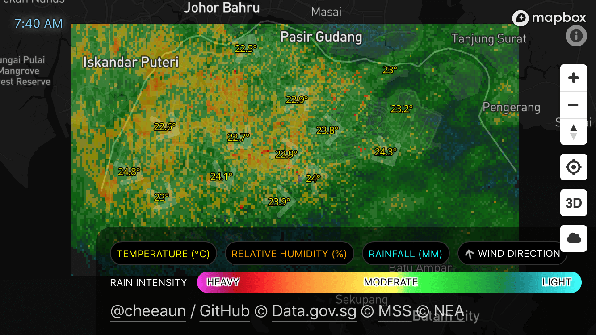

I've also added a timestamp at the top left to indicate the time of the radar image snapshot, which is roughly generated and will be updated every 5 minutes.

One frequently requested feature that I **did not** implement is the playback animation of past radar images. From my personal testing and judgement, I never manage to forecast the rain areas based on the animation, which explains my lack of enthusiasm in implementing this feature. 😏 Somehow I find the wind direction arrows are more useful? 🤷‍♂️ Also, implementing a playback UI is not easy in my opinion. Even though it *can* be done, like the ones on those weather sites, but I always find them too distracting or animating too fast. 😅

Lastly, I felt proud *and* sad at the same time, that **no one** found a *hidden* feature on [Check Weather SG](https://checkweather.sg/):

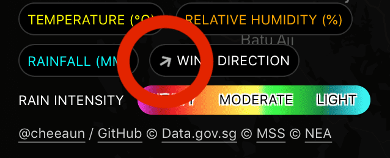

The arrow is the same as the blue "current location" arrowhead on Google Maps, pointing to the direction the phone (or any compass-supported devices) moved, relative to the map. On devices without compass support, it'll keep spinning slowly and infinitely. 😂

As time goes by, I've gotten more and more fond of the domain and app name. Like my previous project, [ExploreTrees.SG](/blog/2018/04/building-exploretrees-sg), I did the same naming trick of appending a verb to the word 'weather' (noun). It took me quite a few days to figure out a suitable verb that is easy to say and sounds natural at the same time.

So the next time you want to check the weather in Singapore, just go to [checkweather.sg](https://checkweather.sg/)! 💥😉