2018 in review
===

First, my usual list of *little things*:

- On January, I received [3 of my Kickstarter-backed Blank shirts](https://twitter.com/cheeaun/status/948175319273431041). Also got my [Blue Beanie Tee](https://twitter.com/cheeaun/status/948539836373200897). 👕
- I've also received my [Kickstarted-backed Bolstr bag](https://twitter.com/cheeaun/status/949248712412311552).
- I did my [citizenship application](https://twitter.com/cheeaun/status/950944523424710656). 🇸🇬
- I received the [Hacktoberfest shirt and stickers](https://twitter.com/cheeaun/status/953599511053484032) for last year’s participation. 👾
- I attended [Talk.CSS `max-content` edition](https://singaporecss.github.io/24/) and finally saw [Andy Clarke](https://twitter.com/cheeaun/status/955700174323515392). 🎫
- I [attended](https://twitter.com/cheeaun/status/956332596132278272) [JSConf.Asia](https://twitter.com/cheeaun/status/956731423804805121) [for 3 days](https://twitter.com/cheeaun/status/957082266257252353). I signed up for a [workshop](https://twitter.com/cheeaun/status/956763777990500352) by Shirley Wu and coded [some SVG flowers](https://twitter.com/cheeaun/status/956809966404317184)! 🎫 🌸
- On February, I [caught up watching](https://twitter.com/cheeaun/status/963063822721273856) [3-gatsu no Lion (March comes in like a lion)](https://myanimelist.net/anime/31646/3-gatsu_no_Lion). Really liking the artwork and the slow-pace storyline. 🦁
- I learned how to [properly pronounce Guillermo](https://twitter.com/swyx/status/963789383420841984).
- During Chinese New Year, I [fixed and updated all 3 of my transportation app](https://twitter.com/cheeaun/status/965240001536520193) due to a weird bug in Google Maps JS API.
- I showed [a few](https://twitter.com/cheeaun/status/966131208726790145) [sneak](https://twitter.com/cheeaun/status/966494410551705601) [peeks](https://twitter.com/cheeaun/status/967429056009416704), [re-launched TaxiRouter SG](https://twitter.com/cheeaun/status/967939487190757381) on Feb 26 and published ‘[Rebuilding TaxiRouter SG](https://cheeaun.com/blog/2018/04/rebuilding-taxirouter-sg/)’. 🚖 🚀 📝
- I randomly [received 旺 stickers](https://twitter.com/cheeaun/status/966156964479684608) from [StickerHD](https://stickerhd.com/). 👾
- On March, I [scraped some trees](https://twitter.com/cheeaun/status/975272277926330369), [did some visualizations](https://twitter.com/cheeaun/status/978451797248425984), [launched ExploreTrees.SG](https://twitter.com/cheeaun/status/980627763781513216) and published ‘[Building ExploreTrees.SG](/blog/2018/04/building-exploretrees-sg/)’. 🌳 🚀 📝
- On April, I showed some [sneak](https://twitter.com/cheeaun/status/982477428713963527) [peeks](https://twitter.com/cheeaun/status/985161104073437185) again, [launched Check Weather SG](https://twitter.com/cheeaun/status/985405046937432064) and published ‘[Building Check Weather SG](/blog/2018/06/building-check-weather-sg/)’. 🌧 🚀 📝
- I received my [Kickstarter-backed FODI](https://twitter.com/cheeaun/status/984057278704726016).
- I ventured into custom-designed [embroidered](https://twitter.com/cheeaun/status/983689034894462978) [stickers](https://twitter.com/cheeaun/status/988651730425397248). 👾
- I attended the [Ruby X Elixir Conf](https://twitter.com/cheeaun/status/989681515360604160) [Taiwan 2018](https://twitter.com/cheeaun/status/990055316837535744). 🎫
- On May, I finally [got my hands](https://twitter.com/cheeaun/status/994447884299878400) on `hackerweb.app` domain.
- I attended [Geek Brunch SG #7](https://www.facebook.com/events/1080374815437357/). 🎫
- Somehow I got featured in [Zell’s article](https://twitter.com/cheeaun/status/999151645043736577) on [Smashing Magazine](https://www.smashingmagazine.com/2018/05/future-of-web-design/). 😎
- On June, I received [free stickers from StickerMule & Dribbble](https://twitter.com/cheeaun/status/1003665983276441600). 👾
- I attended [Webconf.asia](https://twitter.com/cheeaun/status/1004915938997755906) [again](https://twitter.com/cheeaun/status/1005277239968223233). 🎫
- I updated my [RailRouter SG](https://railrouter.sg/) with [station outlines](https://twitter.com/cheeaun/status/1008884858955825153) and [arrival times](https://twitter.com/cheeaun/status/1009626041260765185). 🚉
- I did a [super cool visualization](https://twitter.com/cheeaun/status/1010542298810085376) on [all bus routes in Singapore](https://twitter.com/cheeaun/status/1010877308255649792) and [launched a mini-site on BusRouter SG](https://twitter.com/cheeaun/status/1012140014652686336). Seems well-received on [/r/dataisbeautiful](https://www.reddit.com/r/dataisbeautiful/comments/8xbvtz/oc_visualization_of_bus_routes_overlapping_each/) too. 🚌 🚀
- On July, I showed [a few](https://twitter.com/cheeaun/status/1013333415498637313) [sneak peeks](https://twitter.com/cheeaun/status/1020114981717651457) of the next-gen BusRouter SG.
- I was featured in [Hui Jing’s talk](https://twitter.com/hj_chen/status/1016294014146899968) at [CSSconf EU](https://2018.cssconf.eu/). 😎
- I [gave a talk](https://twitter.com/cheeaun/status/1015062752744783872) on [my trees project](https://www.engineers.sg/video/hack-tell-singapore-july-2018-mapping-564-266-trees-in-singapore--2801). 🌳 🗣
- I tried [printing Kopi.JS stickers](https://twitter.com/cheeaun/status/1017336422322204672) from a new local provider. 👾
- I discovered that [Google Maps renders roller coaster routes in 3D](https://twitter.com/cheeaun/status/1021377921905188864) at Universal Studios Singapore. 🎢
- On August, I [got heftily charged](https://twitter.com/cheeaun/status/1025041116284870656) by Google Cloud, after their [pricing changes](https://cloud.google.com/blog/products/maps-platform/introducing-google-maps-platform). 💸
- I ventured into [custom-printed socks](https://twitter.com/cheeaun/status/1027832919069323264). 🧦
- I received [a whole bunch of free stickers](https://twitter.com/cheeaun/status/1030378312701378560) from JetBrains. 👾
- I made Check Weather SG into [a Progressive Web App](https://twitter.com/cheeaun/status/1030807544342568960). 🚀
- On September, I played [a beautiful game called Florence](https://twitter.com/cheeaun/status/1036954663097065472). 🎮
- I *slowly* [switched from Inbox to Gmail](https://twitter.com/cheeaun/status/1041705819048357888). 😢
- I bought and received [the UnixStickers Pro Pack](https://twitter.com/cheeaun/status/1044242491027812352) for $1. 👾
- I showed [sneak peeks](https://twitter.com/cheeaun/status/1045295027507752960) of [a revolutionary bus arrivals UI](https://twitter.com/cheeaun/status/1045498645167009793) for next-gen BusRouter SG.
- On October, I attended [GovTech STACK 2018 Developer Conference](https://twitter.com/sausheong/status/1047872392968556545). 🎫
- Again, I showed [more](https://twitter.com/cheeaun/status/1046746110214037504) [sneak](https://twitter.com/cheeaun/status/1050585243311210496) [peeks](https://twitter.com/cheeaun/status/1051495281840156672) of [next-gen](https://twitter.com/cheeaun/status/1054344471679102976) [BusRouter SG](https://twitter.com/cheeaun/status/1055630640798789632).
- I gave [a brief talk at the Carousell x Hacktoberfest event](https://github.com/cheeaun/talks/tree/master/hacktoberfest-sg-2018). 🎫 🗣
- On November, I attended the first [DevRel Summit](https://twitter.com/cheeaun/status/1058162538851061760) in Singapore. 🎫
- I upgraded to [Flickr Pro](https://blog.flickr.net/en/2018/11/01/changing-flickr-free-accounts-1000-photos/).
- Yet again, I [showed](https://twitter.com/cheeaun/status/1058737041582645248) [a few more](https://twitter.com/cheeaun/status/1059334054380621830) [sneak peeks](https://twitter.com/cheeaun/status/1064150055341326337) and [finally launched the next-gen BusRouter SG](https://twitter.com/cheeaun/status/1064344313549574144) on Nov 19. 🚌 🚀
- I [bought the new MacBook Air](https://twitter.com/cheeaun/status/1059770085408038912), a week after the [Apple Special Event](https://www.apple.com/sg/apple-events/october-2018/), to replace my [old 12-inch MacBook](https://twitter.com/cheeaun/status/649879880465649665). 💻
- I decided to [try SF Mono font](https://twitter.com/cheeaun/status/1066656438422917120) as my coding font.
- On December, I [attended Geek Brunch SG #8](https://twitter.com/kaihendry/status/1069167789288505346). 🎫
- I [*attended*](https://twitter.com/cheeaun/status/1073887135936208897) the 2nd [Super Silly Hackathon](https://supersillyhackathon.sg/). (Partially co-organized it) 🎫
- I celebrated my [12th](https://twitter.com/cheeaun/status/1074713605025652736) Twitter anniversary.
- I received [some stickers](https://twitter.com/cheeaun/status/1077768107458887680) from Dev.to and Sticker Mule. 👾
- I [quit](https://twitter.com/cheeaun/status/1078478214811475968) my job.
- Someone used my [BusRouter SG](https://busrouter.sg/) app and made a [pretty neat video](https://twitter.com/cheeaun/status/1078549824696274944)! 🚌 📹
- After a significant amount of effort, I manage to [achieve all 100 scores](https://twitter.com/cheeaun/status/1078639141821112320) on [Lighthouse](https://developers.google.com/web/tools/lighthouse/) for my site. 💯
- I discovered a fork of Kopi.JS: [Bingsu.js](https://twitter.com/cheeaun/status/1078949207078187014). 🤩

Statistically, I’ve attended **6 conferences**, gave **2 talks**, launched **3 new side projects** and re-launched **3 existing side projects**. I didn’t really organize or even co-organized much events this year, except for [KopiJS #40](https://github.com/KopiJS/kopi.js/issues/63).

Instead, I was heavily involved in coaching for [TechLadies](http://www.techladies.co/) Bootcamp #4, which takes up every Saturday for 3 whole months. The bootcamp officially started on September with a few pre-events for applications and workshops. I deduced that my 2nd-half of year will be fully occupied, therefore I planned my travels on the 1st-half. 😉

Taipei
---

[Earlier this year](https://www.twitter.com/reddotrubyconf/status/967775918960754688), I found out that RedDotRubyConf will be taking a break. So I thought maybe I could take this chance to attend *other* Ruby conferences and coincidentally there’s one called [Ruby X Elixir Taiwan 2018](https://2018.rubyconf.tw/). I’ve never been to Taiwan before and also never been to an Elixir (joint) conference before, so… why not?

On [April 26](https://twitter.com/cheeaun/status/989276630659956736), I departed from Singapore to [Taiwan Taoyuan International Airport (TPE)](https://foursquare.com/v/%E8%87%BA%E7%81%A3%E6%A1%83%E5%9C%92%E5%9C%8B%E9%9A%9B%E6%A9%9F%E5%A0%B4-taiwan-taoyuan-international-airport-tpe/4b047f81f964a520a95422e3). Before the flight, I was having a stomachache, all the way during the flight, until I reached the airport *and* my hotel 😅😅. Definitely **not** a good start, but finally rewarded with [a delicious noodle](https://twitter.com/cheeaun/status/989518487562346497) from the famous [Ay-Chung Flour-Rice Noodle](https://foursquare.com/v/%E9%98%BF%E5%AE%97%E9%BA%B5%E7%B7%9A-aychung-flourrice-noodle/4ba22127f964a520cfdd37e3). 😋

[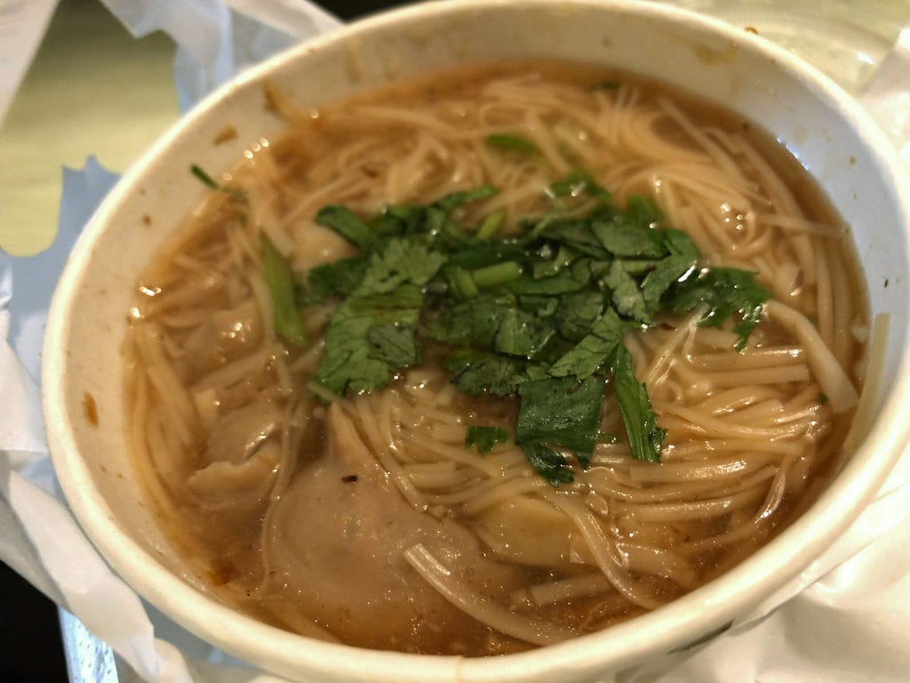](https://www.flickr.com/photos/cheeaun/28143612298/in/album-72157693520873492/)

For the next [two](https://twitter.com/cheeaun/status/989681515360604160) [days](https://twitter.com/cheeaun/status/990055316837535744), I attended the conference at [Chang Yung-fa Foundation](https://foursquare.com/v/%E8%B2%A1%E5%9C%98%E6%B3%95%E4%BA%BA%E5%BC%B5%E6%A6%AE%E7%99%BC%E5%9F%BA%E9%87%91%E6%9C%83-chang-yungfa-foundation/4d081985143cb60cc6ab79a6). First time I see that some of the talks are presented in Chinese (Mandarin) which fortunately I could understand. The audience were also quite mixed from Ruby and Elixir backgrounds. Both the creator of Ruby, Yukihiro Matsumoto *and* creator of Elixir, José Valim were there! 😱

The food, with bubble tea, was [amazingly generous](https://twitter.com/cheeaun/status/990093465022169088).

[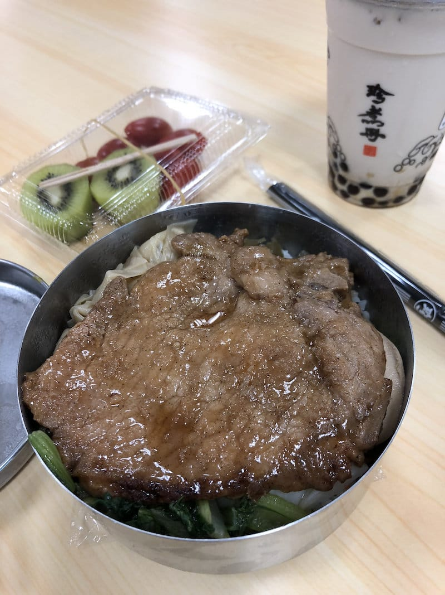](https://www.flickr.com/photos/cheeaun/41296726804/in/album-72157693520873492/)

On the 2nd day, right after the conference, I followed a bunch of folks to [try some special Taiwanese traditional food](https://twitter.com/rubyconftw/status/990097543982809088) at [Raohe St. Night Market](https://foursquare.com/v/饒河街觀光夜市-raohe-st-night-market/4bbf55e2ba9776b07feafec8) and later hung out near the [Rainbow Bridge](https://foursquare.com/v/rainbow-bridge/4baccacaf964a520a20c3be3).

The next few days, I did my own self-guided tour around Taipei. I [discovered hipster cups](https://twitter.com/cheeaun/status/990829858467987456), saw [a flight airline called FAT](https://twitter.com/cheeaun/status/990855372628881408) at [Taipei Songshan Airport](https://www.instagram.com/p/BiUi0dilLoI/), luckily [got immuned to stinky tofu](https://twitter.com/cheeaun/status/990942776618504193), had [fun with chinese characters on Labour Day](https://twitter.com/cheeaun/status/991165997137575936), witnessed & filmed [a real protest on the streets](https://twitter.com/cheeaun/status/991199148199198720), hiked up the [Elephant Mountain (Xiangshan)](https://foursquare.com/v/%E8%B1%A1%E5%B1%B1%E9%A0%82-top-of-xiangshan/4c6a74ac8e7c0f47ee24e20f) to [barely see a portion](https://twitter.com/cheeaun/status/991273715345190912) of [Taipei 101](https://www.instagram.com/p/BiTY38dFQdp/), saw a lady [throw a bunch of clothes into a Clothes Recycling Bank](https://twitter.com/cheeaun/status/991278319957037056), discovered the [true origin of Karaoke booths](https://twitter.com/cheeaun/status/991294257930514434), braved through the [hot weather](https://twitter.com/cheeaun/status/991595735337525249), ate [Cong You Bing (Scallion Pancake)](https://twitter.com/cheeaun/status/991602866304368640) [*twice*](https://twitter.com/cheeaun/status/991686938850574336), braved though [sudden cold weather](https://twitter.com/cheeaun/status/991871507360956416), always [got on the wrong side of the road](https://twitter.com/cheeaun/status/991872934384840705) to [take buses](https://www.instagram.com/p/BiUiddtlRvO/), and observed [a lot of Japanese people in Carrefour](https://twitter.com/cheeaun/status/992241188924080128) 🤔.

I really like [this photo](https://www.instagram.com/p/BiR9KHmlhhf/) for some reason.

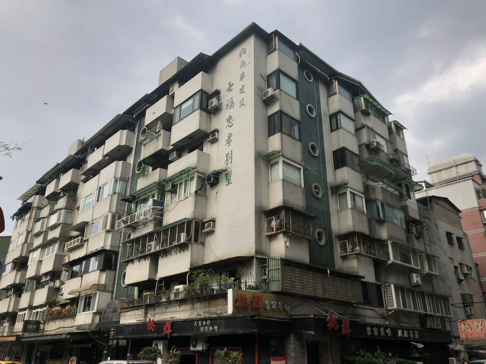

I also really like [this delicious-looking bowl of noodles](https://www.flickr.com/photos/cheeaun/41118418495/in/album-72157693520873492/), which I don’t know what it’s called but I remember I had it at a place called [老牌牛肉拉麵大王](https://foursquare.com/v/%E8%80%81%E7%89%8C%E7%89%9B%E8%82%89%E6%8B%89%E9%BA%B5%E5%A4%A7%E7%8E%8B/4b95efaef964a52003b834e3) (*Old beef noodle king*).

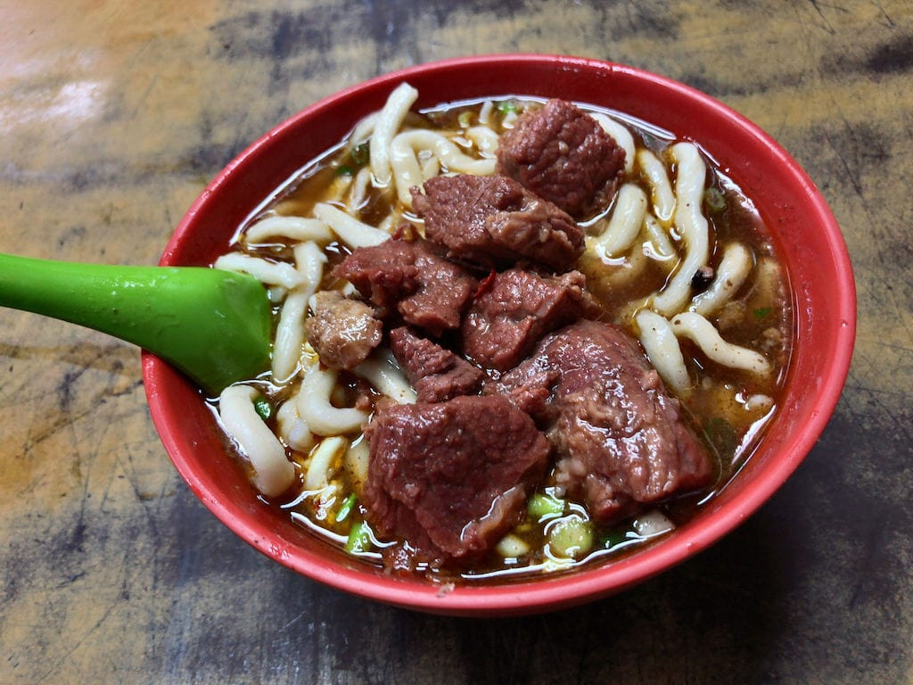

This shot is quite interesting and hilarious to me, because it’s taken from inside a building that is built *beside* Taipei 101. Or rather it’s built as the *base* of Taipei 101. I’m not really sure, though feels as if these two buildings were not connected in the first place. 🤷‍♂️

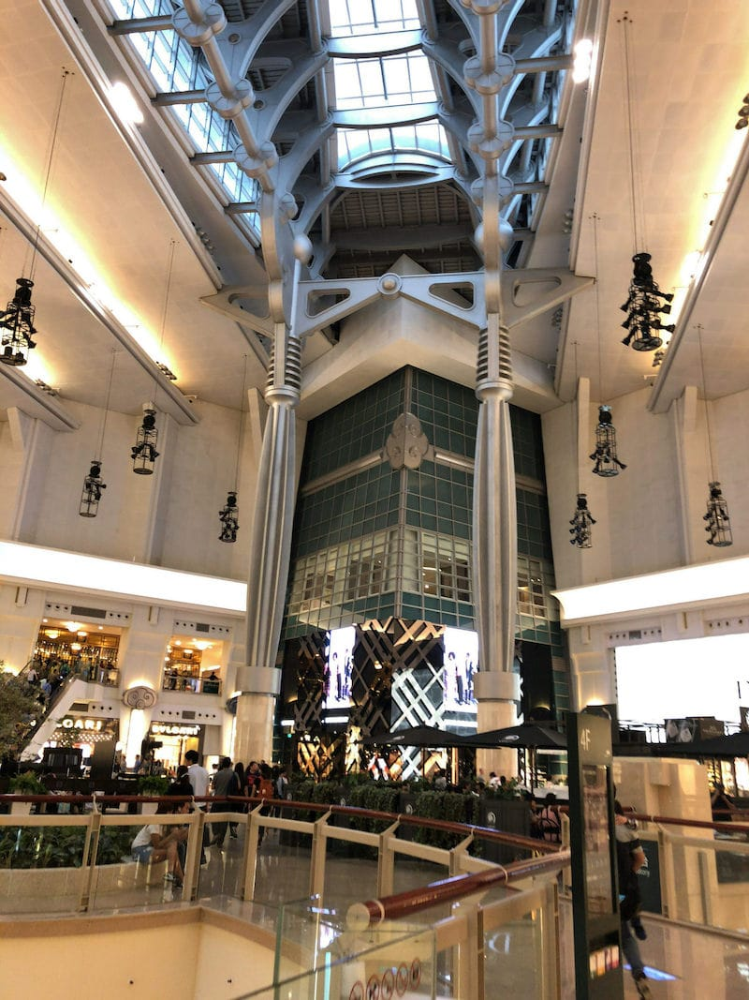

I’ve visited the [Treasure Hill Artist Village](https://foursquare.com/v/%E5%AF%B6%E8%97%8F%E5%B7%96%E5%9C%8B%E9%9A%9B%E8%97%9D%E8%A1%93%E6%9D%91/4d7c8450cf3f3704f1be5240) based on a friend’s recommendation and took [this beautiful shot](https://www.instagram.com/p/BiTZQ_3lZY3/).

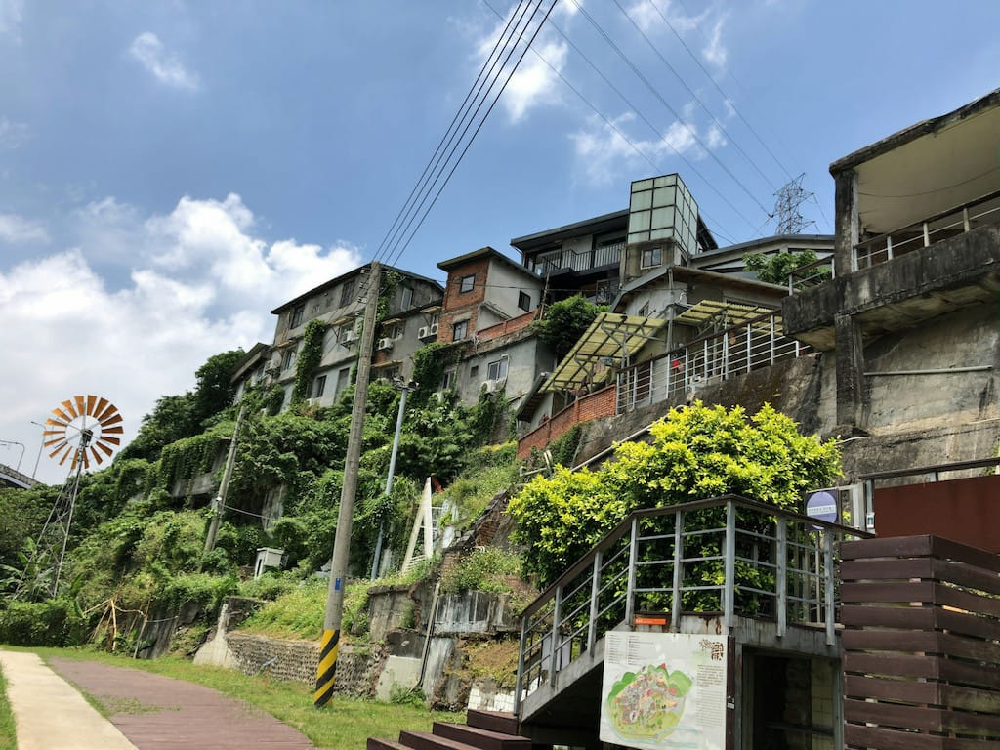

I went to a few night markets like [Ximending](https://foursquare.com/v/%E8%A5%BF%E9%96%80%E7%94%BA-ximending/4cbfa6c4a0c4f04d73825631) (a few times), [Raohe St. Night Market](https://foursquare.com/v/%E9%A5%92%E6%B2%B3%E8%A1%97%E8%A7%80%E5%85%89%E5%A4%9C%E5%B8%82-raohe-st-night-market/4bbf55e2ba9776b07feafec8) (twice), [Shilin Night Market](https://foursquare.com/v/%E5%A3%AB%E6%9E%97%E5%A4%9C%E5%B8%82-shilin-night-market/4b63ed57f964a52066972ae3), [Huaxi Street Tourist Night Market](https://foursquare.com/v/%E8%8F%AF%E8%A5%BF%E8%A1%97%E8%A7%80%E5%85%89%E5%A4%9C%E5%B8%82-huaxi-street-tourist-night-market/4b8e3121f964a520f01a33e3), [Guangzhou Street Night Market](https://foursquare.com/v/%E5%BB%A3%E5%B7%9E%E8%A1%97%E8%A7%80%E5%85%89%E5%A4%9C%E5%B8%82-guangzhou-street-night-market/4e94265d6da119d220b5526b) and [Ningxia Night Market](https://foursquare.com/v/%E5%AF%A7%E5%A4%8F%E5%A4%9C%E5%B8%82-ningxia-night-market/4b5ec02ef964a520959729e3). Not really a good idea to walk around when the weather is not cold because I sweated pretty much the whole time while eating and walking 😅

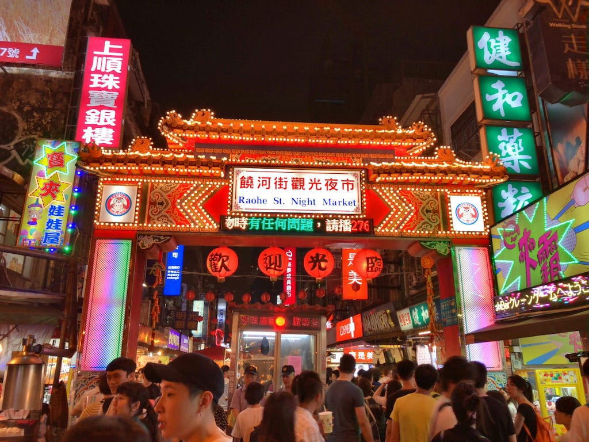

Here’s my observation notes:

- Taipei Taoyuan International airport doesn’t seem as big as I thought.
- Buses at the airport are quite confusing. I took one that looks like a long-distance bus but is actually a normal bus that stops at every stop. 😅🤦‍♂️
- The [EasyCard](https://www.easycard.com.tw/en/) machine enforces NT$100 bill. I tried using a NT$1000 note and it doesn’t work, so I had to go a nearby convenience store to get a new card and top up at the same time.
- 7-elevens are *everywhere*.
- Take away (to go) = *wai dai* in Mandarin.
- The roads seem to be separated for the bus lanes and stops.
- Pedestrian lights can go green for up to 90+ seconds, which I think is quite a long time! I realised that the long timespan is optimized for old people crossing the road slowly.
- Bus numbers on the buses are seriously huge and usually in red text color.
- Even though I see bicycles everywhere, motorcycles are still the mainstream transport in Taipei.
- The convenience stores always ask me if I want the receipt when I bought something. Turns out the receipt numbers are for a [lottery run by the government!](https://guidetotaipei.com/article/taiwan-receipt-lottery-%E7%B5%B1%E4%B8%80%E7%99%BC%E7%A5%A8%E4%B8%AD%E7%8D%8E%E8%99%9F%E7%A2%BC) If you don’t want the receipts, you can also [put them into donation boxes!](https://www.campus.sg/taiwan-keep-those-receipts/) 😱

On [May 5](https://twitter.com/cheeaun/status/992663083901308928), I flew back to Singapore.

Some stats:

- 126 Swarm check-ins.
- 21 Instagram posts.
- [524 photos and 18 videos](https://www.flickr.com/photos/cheeaun/sets/72157693520873492/) on Flickr.

Seoul
---

On [May 17](https://twitter.com/cheeaun/status/997128296662843392), merely 2 weeks after my Taipei trip, I flew to Seoul for a weekend vacation and meeting with ex-colleagues. No conference this time, which is rather refreshing.

It’s my first time in South Korea and I don’t how to read or speak Korean so the language game is strong. Felt better going around places with my ex-colleagues, especially when one of them is a local. 😉

Since this is a short trip, there’s not a lot of things that I could see.

The [weather](https://www.flickr.com/photos/cheeaun/42220904982/in/album-72157695368026401/) was 👌 **perfect**. (I like cold weather)

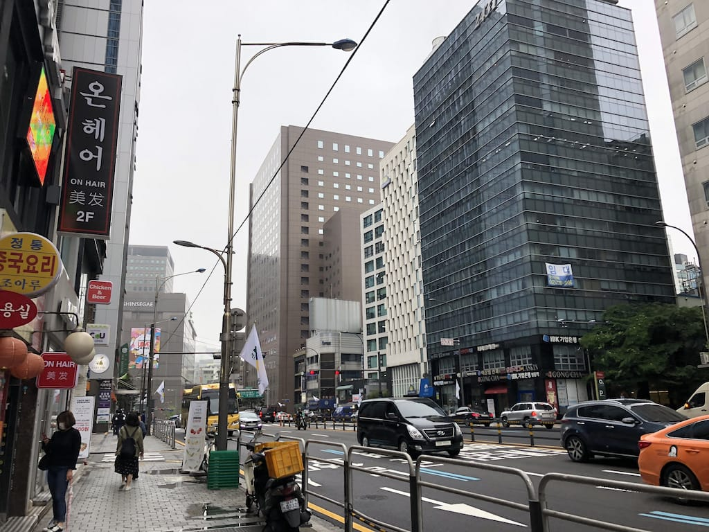

One of the first meal I ate is this hot bowl of noodles, called *kalguksu*, at [Myeongdong Gyoza](https://foursquare.com/v/%EB%AA%85%EB%8F%99%EA%B5%90%EC%9E%90-%E6%98%8E%E6%B4%9E%E9%A4%83%E5%AD%90/4b41bca1f964a5209ec825e3). I finally tried the *real* kimchi for the first time and **oh my god**, it’s so different than the kimchi from Korean restaurants in Singapore or any other countries! 😋

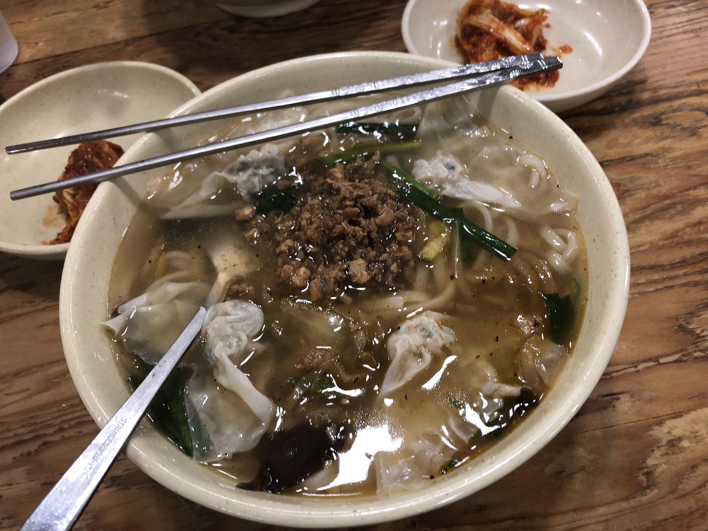

I [visited](https://www.instagram.com/p/BjBMKOMFLZ7/) this trendingly hipster library called [Starfield Library](https://foursquare.com/v/%EB%B3%84%EB%A7%88%EB%8B%B9-%EB%8F%84%EC%84%9C%EA%B4%80/592cecdf31fd147e47f101e1). Yes, the books are fake (I think) and [glued to the shelves](https://www.flickr.com/photos/cheeaun/42220922752/in/album-72157695368026401/). No, I can’t reach the books on the highest shelves.

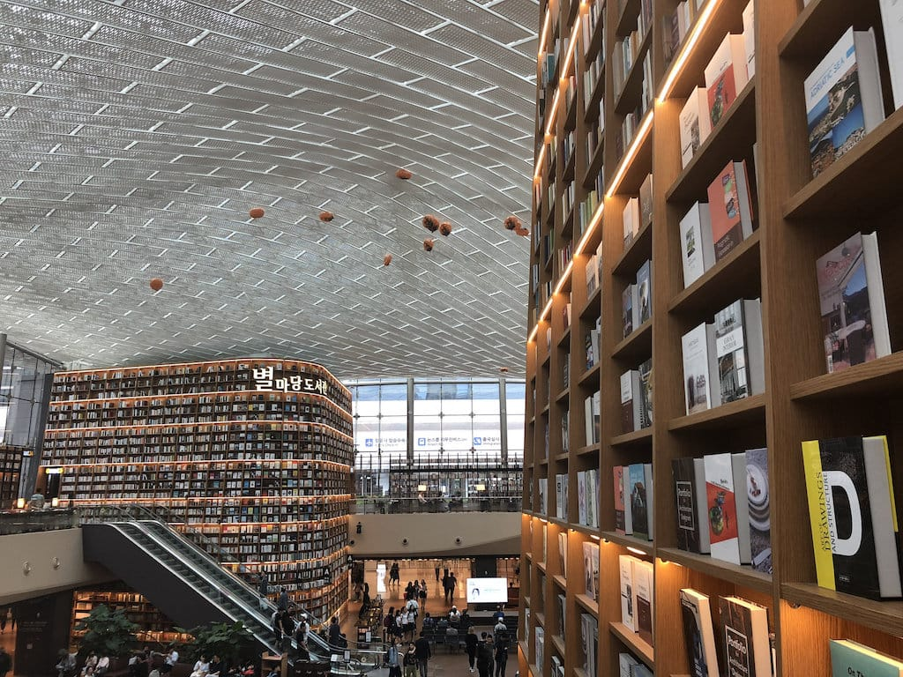

I climbed up and took the [cable car](https://foursquare.com/v/%EB%82%A8%EC%82%B0-%EC%BC%80%EC%9D%B4%EB%B8%94%EC%B9%B4-namsan-cable-car/4b058783f964a520c49622e3) to the [N Seoul Tower](https://foursquare.com/v/n%EC%84%9C%EC%9A%B8%ED%83%80%EC%9B%8C/4ba59e76f964a5201f1739e3).

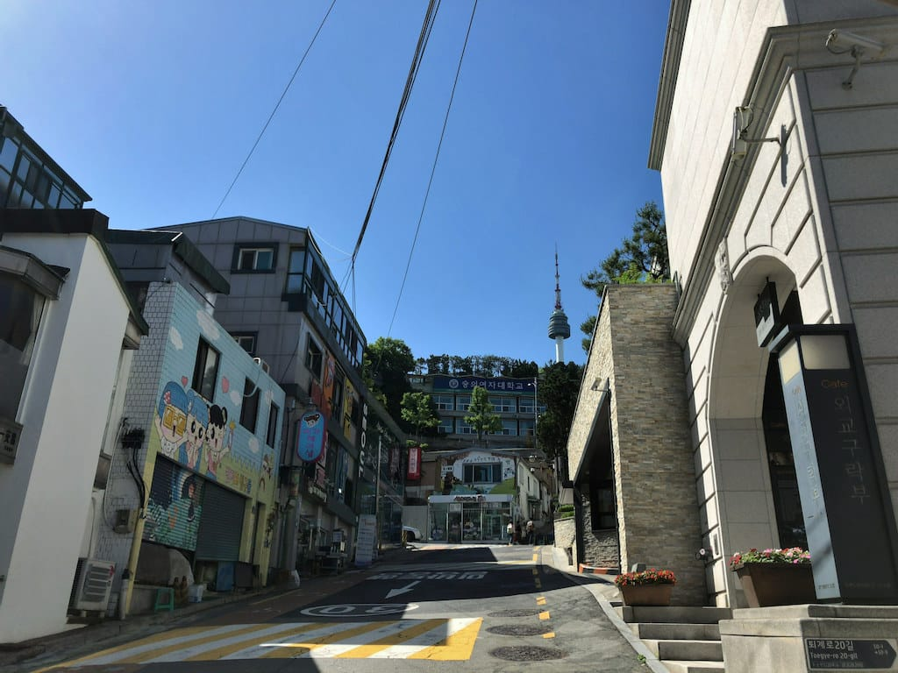

I visited the [National Palace Museum of Korea](https://foursquare.com/v/%EA%B5%AD%EB%A6%BD%EA%B3%A0%EA%B6%81%EB%B0%95%EB%AC%BC%EA%B4%80/4bdfd91ae75c0f47d776cc03) and took this [gorgeous shot](https://www.instagram.com/p/BjBlmd7F4YB/).

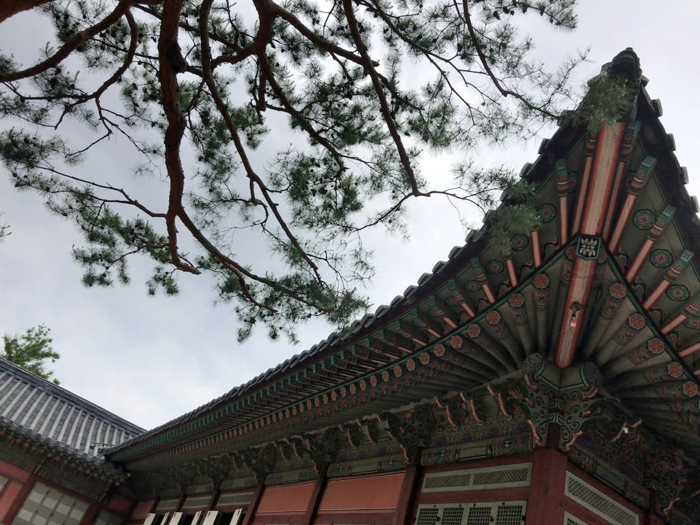

I [enjoyed the best view in town](https://www.instagram.com/p/BjBod3KlJUQ/) at the [Bukchon Hanok Village](https://foursquare.com/v/%EB%B6%81%EC%B4%8C%ED%95%9C%EC%98%A5%EB%A7%88%EC%9D%84/4bbed04dba9776b01d47fec8).

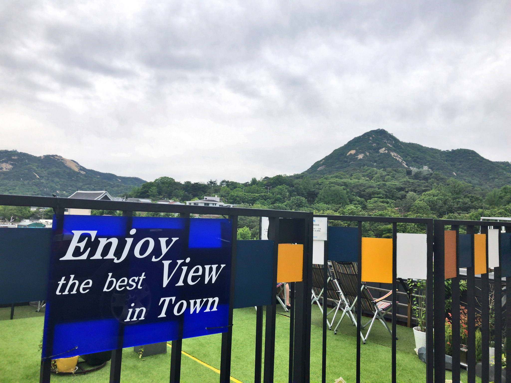

My observation notes:

- [Incheon International airport](https://foursquare.com/v/%EC%9D%B8%EC%B2%9C%EA%B5%AD%EC%A0%9C%EA%B3%B5%ED%95%AD/4ca5bb5d965c9c744ca7c7fa) is *huge*.
- Vehicles are driven on right side of the road. People also walk on the right side of the pedestrian lanes.
- Some drivers, including bus drivers, seem pretty aggressive on the roads.
- The geography is quite hilly, which kind of reminds me of San Francisco.
- If I’m not mistaken, some short-distance trains and buses have express mode which skips some stops.
- GPS doesn’t work well in underground trains and stations.
- Very few locals speak English.
- Weirdly enough, Google Maps app renders raster tiles instead of vector tiles. It’s pretty much useless in Seoul.
- [Naver Maps](https://map.naver.com/) outperforms [KakaoMap](https://map.kakao.com/) in terms of reliability and accuracy.
- Starbucks is seriously everywhere, **noticeably** around Gangnam station.
- In fact, there's **astoundingly a lot** of coffee shops around.
- [GS25](https://en.wikipedia.org/wiki/GS25) is like the 7-eleven in Seoul.
- Inside the bus, the windows can be slid open. 🤔
- Tested via [Fast](https://fast.com/) with prepaid SIM cards, [SK Telecom](https://www.sktelecom.com/index.html) provides better Internet speed by up to 2 or 3 times than [KT](https://www.kt.com/). (SKT vs KT, don’t be confused)
- Most of the coffee shops like [Ediya](https://www.ediya.com/), [Hollys](https://www.hollys.co.kr/) and [Starbucks](http://www.istarbucks.co.kr/) also have pretty darn good Wi-Fi speed.
- Bike rentals don’t seem common as most locals own their own (more powerful) bikes.
- Not sure if I’m hallucinating, I noticed that South Koreans consume their food really fast. 😅
- Some subway exits have escalators, most don’t.
- Myeongdong is obviously super-touristy with night markets and lots of currency exchange shops. Weirdly enough, reminds me of Taipei. 😅
- Gangnam is like Singapore’s Orchard.
- Uber actually works but very little cars.
- [Kakao T](http://kakaomobility.com/kakaot/)'s card registration is restricted to certain banks and requirements, so I was unable to try it.

On [May 21](https://twitter.com/cheeaun/status/998465596256698369), I flew back.

The stats:

- 61 Swarm check-ins.
- 24 Instagram posts.
- [548 photos and 4 videos](https://www.flickr.com/photos/cheeaun/sets/72157695368026401/) on Flickr.

Hong Kong & Macau (again)
---

On [June 7](https://twitter.com/cheeaun/status/1004539938765922304), I flew to Hong Kong to attend [Webconf.Asia](https://www.webconf.asia/) for the 2nd time. So it’s also my 2nd time in Hong Kong! Unfortunately even before I manage to step into Hong Kong, [my flight was delayed for an hour](https://twitter.com/cheeaun/status/1004552245935947776) due to weather conditions, with all passengers already sitting *inside* the plane 😅.

I [arrived](https://twitter.com/cheeaun/status/1004627595068170240) at the [Hong Kong International Airport](https://foursquare.com/v/hong-kong-international-airport-%E9%A6%99%E6%B8%AF%E5%9C%8B%E9%9A%9B%E6%A9%9F%E5%A0%B4-hkg/4a7379d2f964a52088dc1fe3) and had [this late lunch](https://twitter.com/cheeaun/status/1004642281427628032) at [Tai Hing](https://foursquare.com/v/tai-hing-%E5%A4%AA%E8%88%88/55c0c94b498eb3b4029f0abf).

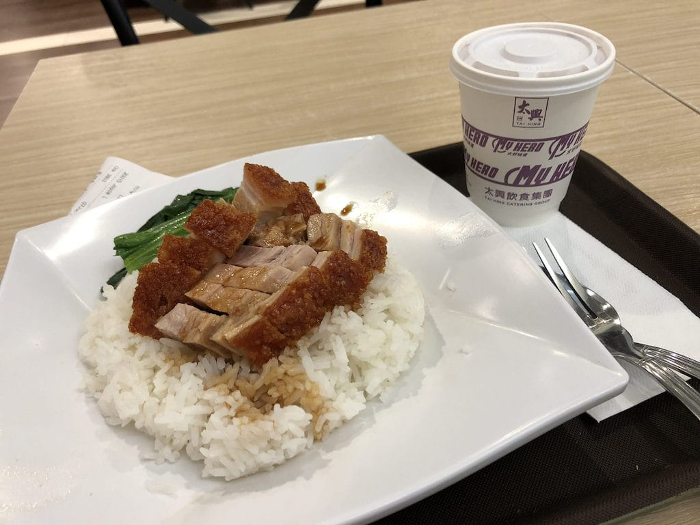

I [took the train](https://twitter.com/cheeaun/status/1004647131079049216) to my hotel, [Ibis Hong Kong Central & Sheung Wan](https://foursquare.com/v/ibis-hong-kong-central--sheung-wan-%E5%AE%9C%E5%BF%85%E6%80%9D%E9%A6%99%E6%B8%AF%E4%B8%AD%E4%B8%8A%E7%92%B0%E9%85%92%E5%BA%97/50279792e4b0f675676cad82), which I purposely choose so that I can get [this harbour view](https://www.instagram.com/p/Bj014zcl52Y/), with lots of [time-lapse videos](https://twitter.com/cheeaun/status/1004682319645401091/video/1). 😝

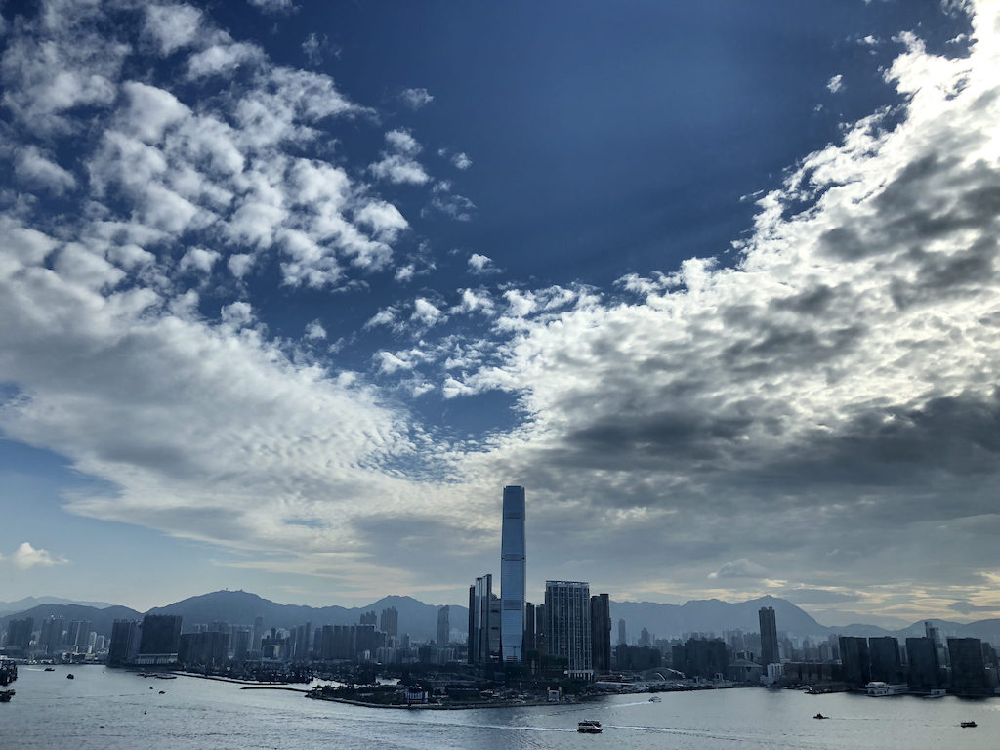

I [attended Webconf.Asia](https://twitter.com/cheeaun/status/1004915938997755906) and [didn’t miss Jake’s amazing talk](https://twitter.com/cheeaun/status/1004996854034018304) this time. The after-party was surprisingly [at a pet shop](https://twitter.com/cheeaun/status/1005025652326719489) called [WOW Pet Shop](https://foursquare.com/v/wow-pet-shop/56723fd5498e25fe3ec38b67). On the second day, I manage to see [Hui Jing being the emcee](https://twitter.com/cheeaun/status/1005278657051443200) (not speaker this time).

Ever since I left Hong Kong last year, I’ve been craving for this Roast Goose rice and finally [acquired it](https://twitter.com/cheeaun/status/1005408108703649793). 😋

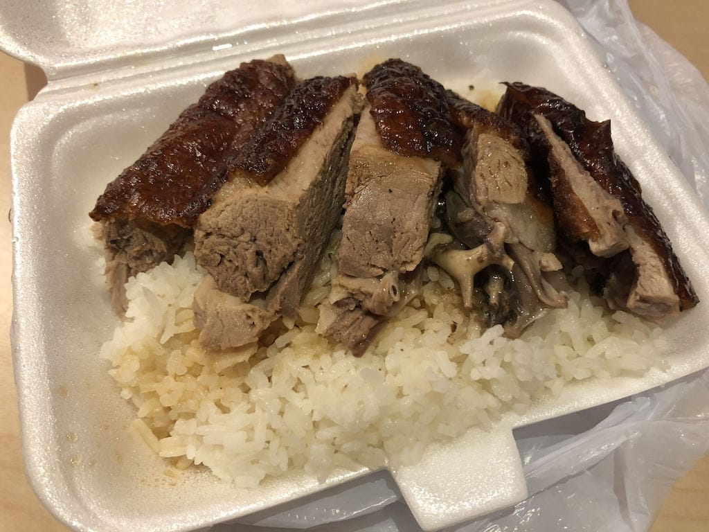

Before this trip, I already expected the weather to be either a [very hot](https://twitter.com/cheeaun/status/1005710809064878080) summer (June) or [rainy](https://twitter.com/cheeaun/status/1004907669155540992) due to some tropical storm warning (which delayed my flight). So I only stayed one day before and one day after the conference days. It’s not long though I [still](https://www.instagram.com/p/BjzaTzol2uh/) [manage](https://www.instagram.com/p/Bj1je4HFJBj/) [to](https://www.instagram.com/p/Bj1pfLxFOVC/) [walk](https://www.instagram.com/p/Bj12j8LFb0y/) [around](https://www.instagram.com/p/Bj169VKFDlm/) and visited mostly *artistic* or *architectural* places like:

- The epic [Yick Fat Building](https://www.instagram.com/p/BjzakmLFvdL/)
- [Hong Kong Arts Centre](https://www.instagram.com/p/Bj2BucvFotF/)
- [Innovation Tower](https://www.instagram.com/p/Bj33w6cFGTw/) at [The Hong Kong Polytechnic University](https://foursquare.com/v/the-hong-kong-polytechnic-university/4b15c1cdf964a520d1b323e3)
- [China Hong Kong City](https://www.instagram.com/p/Bj4sgHxFS0x/)
- [Lan Fong Yuen](https://twitter.com/cheeaun/status/1005699645752954881) (unfortunately unable to get a seat there)

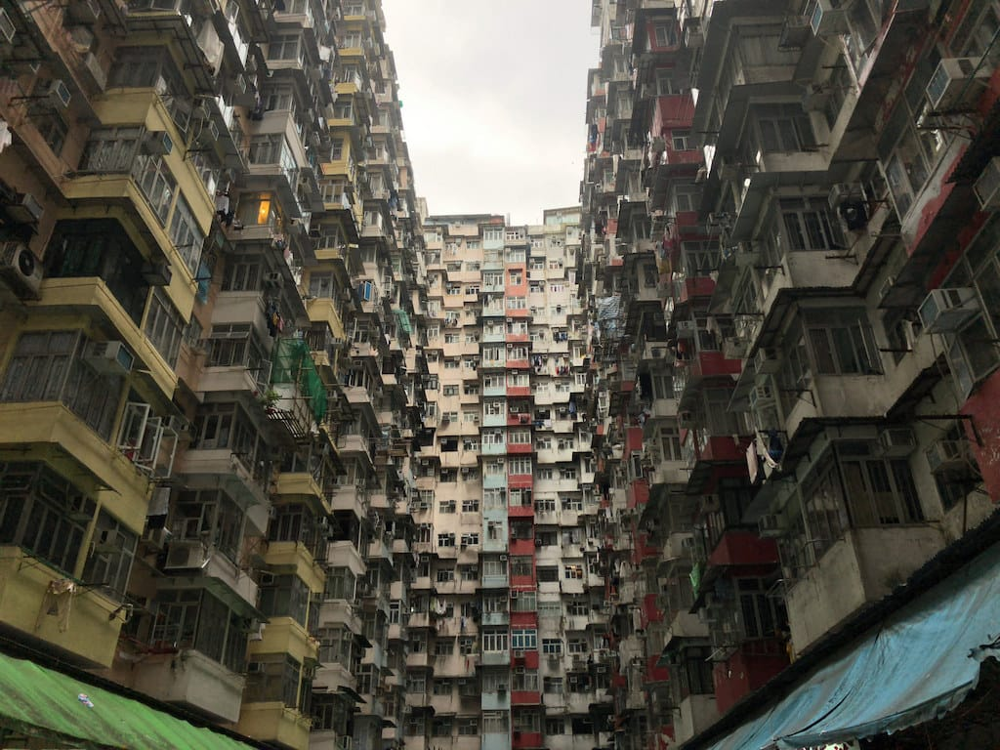

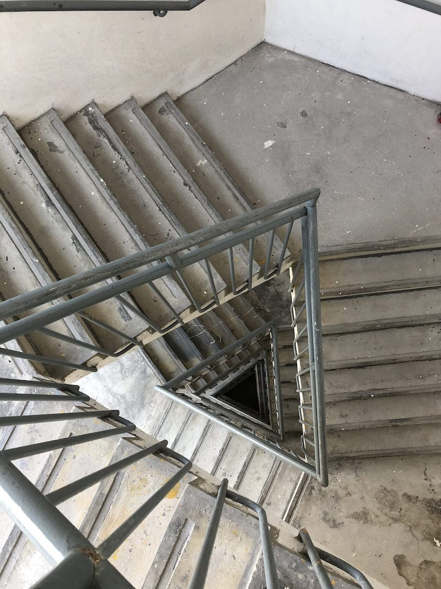

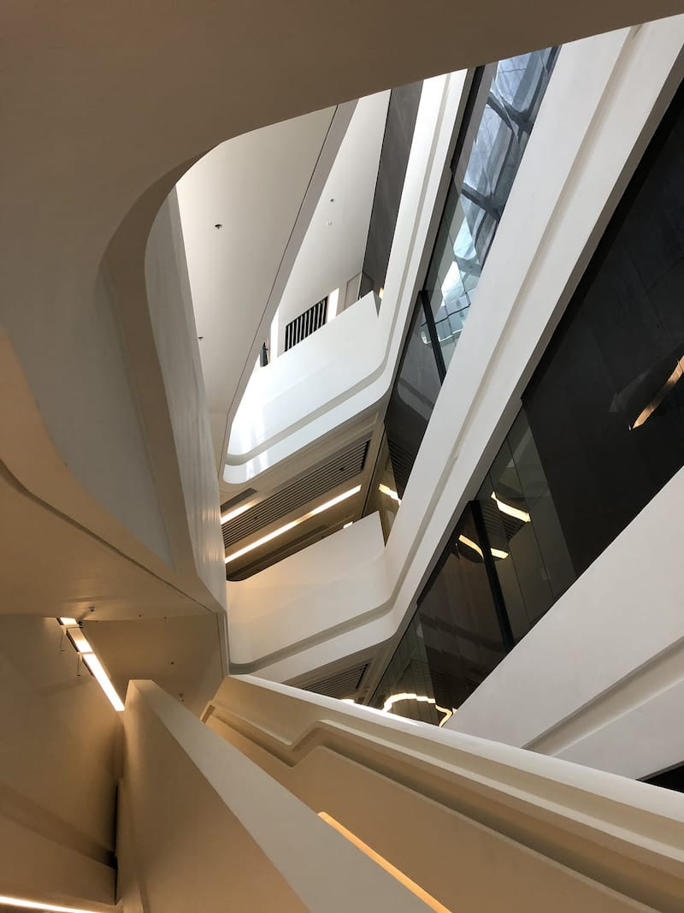

On [June 11](https://twitter.com/cheeaun/status/1006014134972903425), I took a one-hour [TurboJET](https://www.turbojet.com.hk/en/) ride to Macau. The weather in Macau was quite similar, so I [just](https://www.instagram.com/p/Bj4uUm8FbJU/) [walk](https://www.instagram.com/p/Bj53sR8F744/) [around](https://www.instagram.com/p/Bj6MQC0lkFp/) and try to be touristy by taking more photos 📸.

[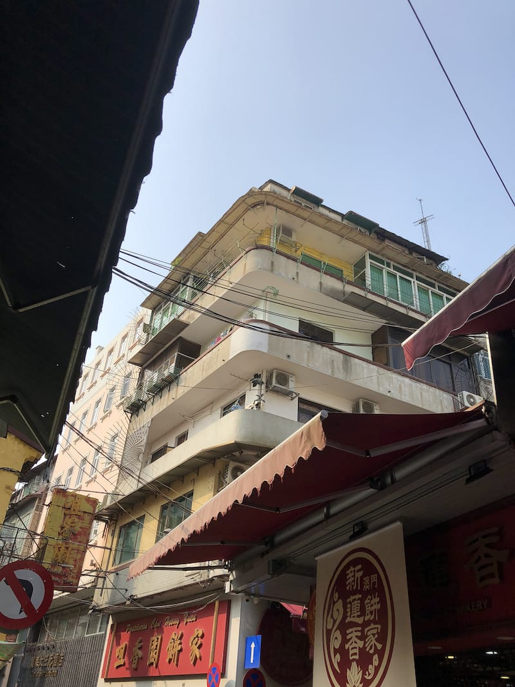](https://www.instagram.com/p/Bj6USRSFMPO/)

*Accidentally* [found](https://www.flickr.com/photos/cheeaun/28958329528/in/album-72157694878916242/) a [Lotus Pond](https://foursquare.com/v/lotus-pond/50454d4fe4b05fe83cdc6ed1) while wandering around as well.

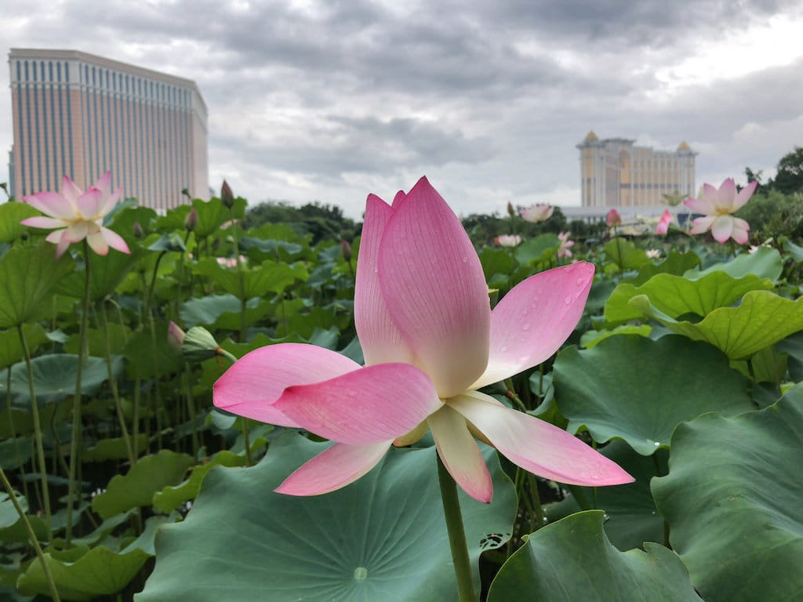

Lots of *architectural* buildings and structures…

[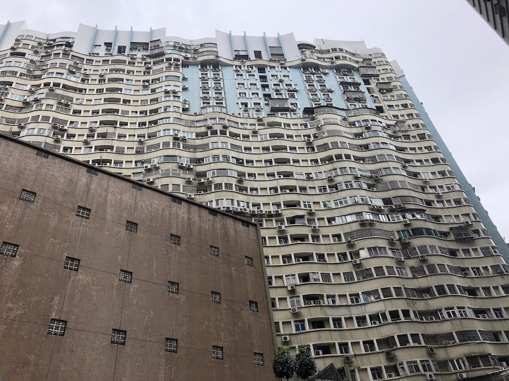](https://www.instagram.com/p/Bj6_xpalJ7j/)

[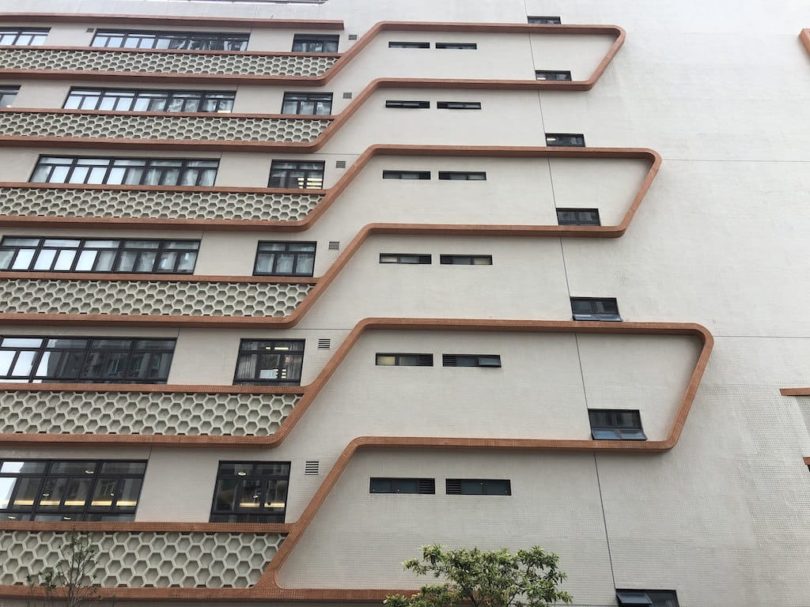](https://www.instagram.com/p/Bj7P_jtlVg-/)

For the first time in my life, I [entered a building](https://twitter.com/cheeaun/status/1006462069460295688) by taking a cable car 😅. It’s the [Wynn Palace](https://foursquare.com/v/wynn-palace-cotai-%E6%B0%B8%E5%88%A9%E7%9A%87%E5%AE%AB/574bb975498eb57fdc42df69), and it’s a free ride. 🚠

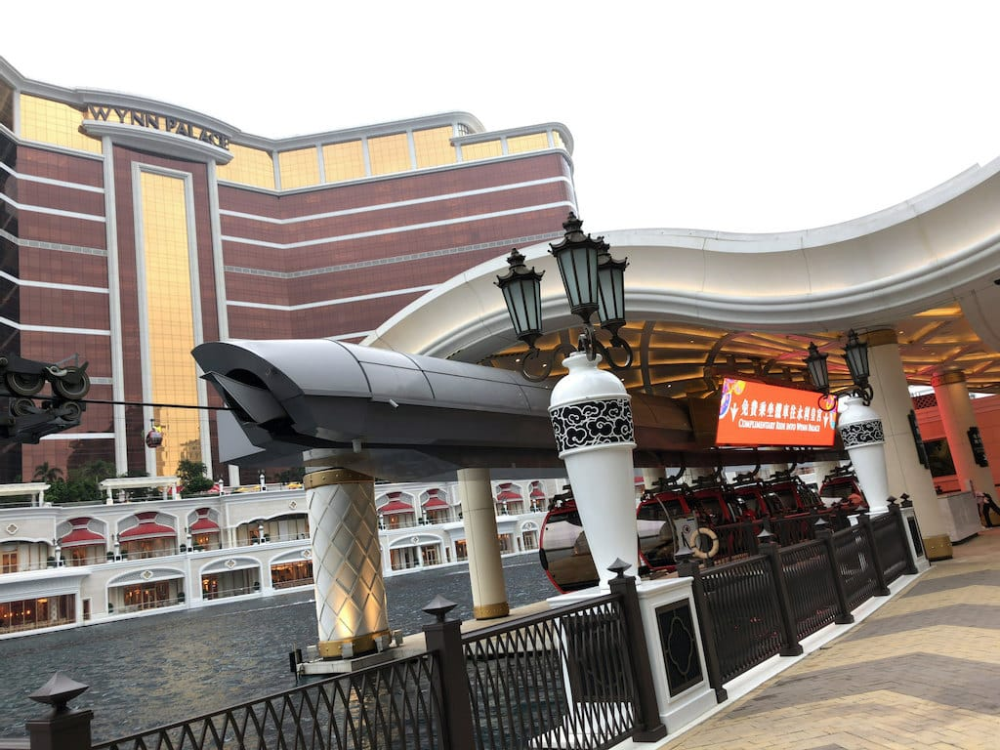

Unlike last year, I try to take some undiscovered routes this time and found this rather interesting [walking route map](https://routemap.dscc.gov.mo/m/en/dscc-line06.html):

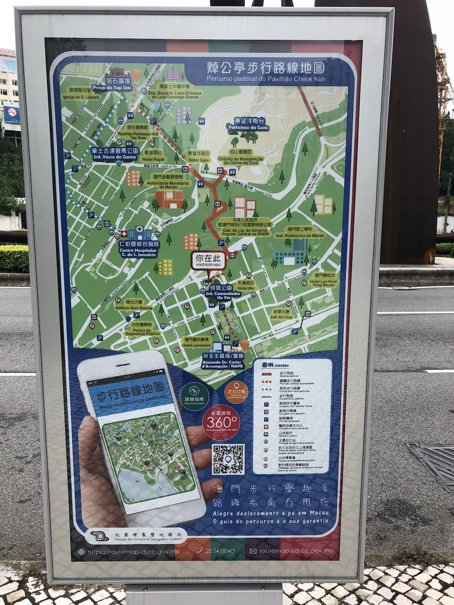

It was quite a hike in fact as I took a detour to higher grounds which later I [took](https://www.instagram.com/p/Bj9Y8g8lepT/) a [cable car](https://foursquare.com/v/teleferico-da-guia-%E6%9D%BE%E5%B1%B1%E7%99%BB%E5%B1%B1%E7%BA%9C%E8%BB%8A/50695807e4b08e8fd4d01530) (again) to go to lower grounds 😅🚠.

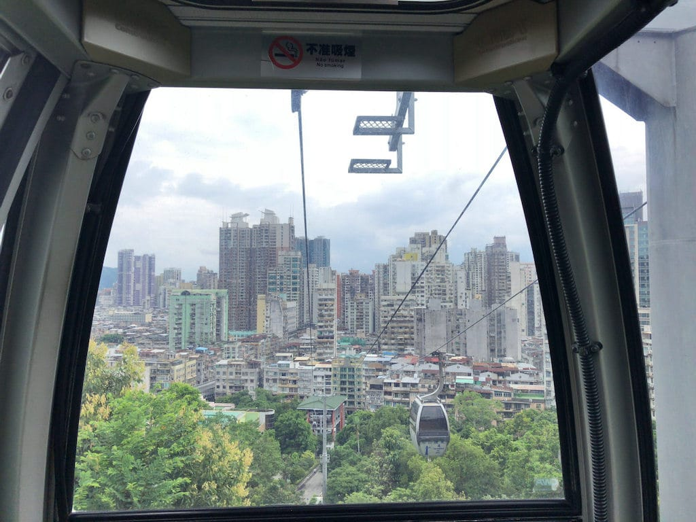

A few more *architectural* shots of some multi-stacking buildings which I find quite interesting…

[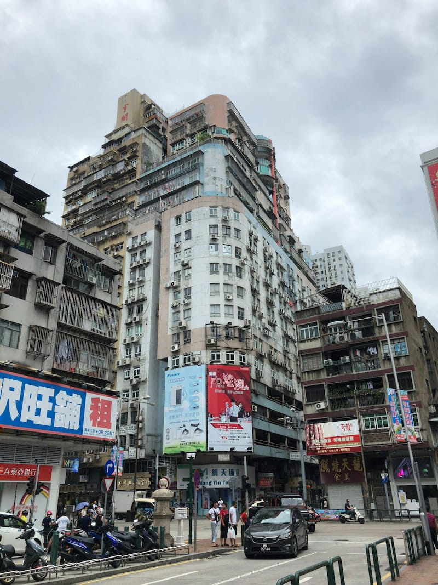](https://www.instagram.com/p/Bj9g2Fal1lb/)

[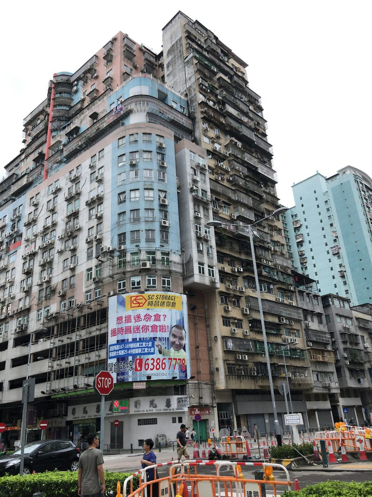](https://www.flickr.com/photos/cheeaun/27962807917/in/album-72157694878916242/)

On [June 14](https://twitter.com/cheeaun/status/1007126499248390144), I flew back to Singapore from the [Macau International Airport](https://foursquare.com/v/macau-international-airport-mfm-aeroporto-internacional-de-macau-%E6%BE%B3%E9%96%80%E5%9C%8B%E9%9A%9B%E6%A9%9F%E5%A0%B4/4b8dfdb7f964a5205a1533e3). Instead of a round-trip flight to-and-fro Hong Kong, I try a Singapore-Hong-Kong-Macau-Singapore route with 2 one-way flights. I also got a taste of [Macau's airport security checkpoints](https://twitter.com/cheeaun/status/1007102251477884928) as they seem *very particular* about power banks, which I have to show them physically one by one. I have three 😅.

Anyway, here are the stats:

- 93 Swarm check-ins (55 in Hong Kong and 38 in Macau).
- 36 Instagram posts.
- [350 photos and 12 videos](https://www.flickr.com/photos/cheeaun/sets/72157694878916242) on Flickr.

Looking back
---

This year, I’ve significantly reduced my developer/designer community participation, so that I can rest more and focus on other things. Not only that I did not organize much events, especially [Kopi.JS](https://kopijs.org/), I also didn’t attend some of them.

This is important because as I organise events and stuff, I start to feel the *immense* responsibility that I *need* to be around in order for things to work. It came to a point that some people who wanted to speak to me, purposely join a Kopi.JS event, just to speak to me, because as an organizer, I’ll definitely 100% be there. However, being an organizer, there’s no chance for me to have proper conversations with anyone as I need to… *organize* (duh).

Being a *participant* (not organizer) of Kopi.JS has been quite liberating for me. I can join and leave anytime, *actually* focus on the conversations, *finally* have the time to slowly consume my brunch, and optionally *not* attend when I feel exhausted or sick. Well, there are few occasions that I actually fell sick and really couldn’t make it 😅.

It’s not just my own events, I’ve also reduced my participation in local conferences and only focus on conferences that I’m interested at that moment. No artwork, no voluntary work (except for embroidered stickers and socks) and no more running around.

Being an introvert, I’ve pretty much made a *decent* effort to put myself *out there*. In the beginning, many years ago, as most folks don’t know, it was incredibly difficult for me. As I slowly indulge myself into the world of socializing, I’ve reached a point where it’s hard to get out. When I meet people, I start to lose track of who’s who and forgetting names. I do remember faces as I have a pretty good visual memory, but names are a bit more difficult for me, particularly when some names are not *unique*.

Around February, I've stopped posting on Facebook, though I’m still using it to keep myself updated with what my friends are doing. I’ve also stopped posting much photos on Instagram (except for my overseas trips). Same applies to Instagram Stories and *all* the Stories clone out there. I kind of got tired of these dopamine-driven feedback loops, which don’t make me feel better at all in the long term. There are constructive feedbacks sometimes but it’s quite rare. All the like counts and comments can be quite useless when everyone on your newsfeed is trying so hard to grab your eyeballs, mixed with clever algorithms, complicated privacy settings, distracting advertisements and annoying notifications.

I do [tweet](https://twitter.com/cheeaun) as usual because [I'm still liking it](/blog/2009/04/how-i-got-started-with-twitter/).

Doing less things let me focus on the important things. Primarily one of them is my health. Since April, roughly few weeks before my Taipei trip, I had gastric. I kept going to the toilet few times a day and couldn’t properly control my bowel. I had medication and once in a few weeks, I experience gastric symptoms like abdominal bloating, indigestion and burning. It’s been few months since then, my conditions are getting better.

Besides that, I’ve also been getting sick a lot, like coughs and headaches, mostly for the last quarter of the year. In fact, a lot of people around me were getting sick so there could be some viral or bacterial infection going on in Singapore. Seeing the doctor has become quite a frequent activity for me, as I was seriously getting sick of getting sick 😷.

On the last 3 days of my Taipei trip, I received [news](https://twitter.com/cheeaun/status/994201065619779584) that one of the first ex-colleagues who I enjoyed working with in Singapore, passed away. It happened without warning and I was **really, really shocked**. At that time, my state of mind was just like [3 years ago](/blog/2015/12/2015-in-review/), trying very hard **not** to think about it. Also because I was still in vacation mode.

Being sick always reminds me of my own mortality. The very fact that, **we don’t last**. I feel that it’s important to keep this in mind so that we don’t take things for granted and learn how to appreciate. We could regret on certain things but there’s no point regretting anymore when things can no longer go back. Yet as time passes, occasionally things will happen to remind us of the sad past.

I missed working with him, my ex-colleague. There were a lot of nice discussions and like-minded conversations. I couldn’t make it for the funeral service because it was on the day of my arrival flight from Taipei. Now it feels weird seeing the 'last seen' date on Telegram. And since the account has been inactive for more than 6 months, Telegram [deletes](https://telegram.org/privacy#10-4-account-self-destruction) the account by default. My last message to him was “Haha”.

After my Hong Kong/Macau trip, yet [another](https://twitter.com/cheeaun/status/1008228566734069762) happened. Around July, [another person](https://twitter.com/glazou/status/1023202423962312704) who I personally admire (and quoted in my [2005 blog post](/blog/2005/07/commenting-system-in-weblogs/) before) passed away.

Life is unquestionably fragile.

Despite so many things that happened in my personal and work life, everything else start to seem kind of trivial when you only focus on the more important things. There are times when I feel really tired, sick and want to give up. There are also times when I just want to relax, do nothing and focus on my own things. There are times when I need to accept the reality, move forward, continue pursuing my dreams and not giving up.

Events happen without warnings. Time is limited, yet there are so many things that conflict with one another. The world is not perfect, yet everyone has to find some form of balance in order to survive.

This is life.

In some way, it reminds me of a [Japanese animation](https://3lion-anime.com/) that I watched earlier this year, called [*3-gatsu no Lion*](https://myanimelist.net/anime/31646/3-gatsu_no_Lion) ([March Comes in Like a Lion](https://en.wikipedia.org/wiki/March_Comes_in_Like_a_Lion)). I don’t usually [talk](/blog/2011/12/what-ive-done-this-year/) about anime in this blog but this is an exception due to its impact on me.

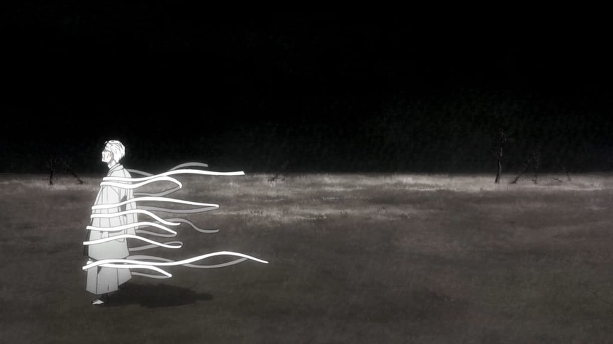

I really, really like episode 17 and 18 of Season 2. It’s a story of [Sakutarou Yanagihara](https://myanimelist.net/character/154707/Sakutarou_Yanagihara), a 66-year-old professional [shogi](https://en.wikipedia.org/wiki/Shogi) player who holds the title of Kishou championship for many years. Being the oldest active Class A player, he struggles hard every year playing against strong, younger opponents, while carrying the emotional burden and moral support from his friends and supporters. During the gameplay, the story focus on his flashbacks and inner voice:

“I don’t have a single predecessor left who would compare me to something”.

“Somewhere along the line, the people who have been fighting alongside me have disappeared, one after another”.

“So am I going to lose?”.

“If shogi is taken away from me, what would be left?”.

“I’ll shoulder this burden and deliver it”.

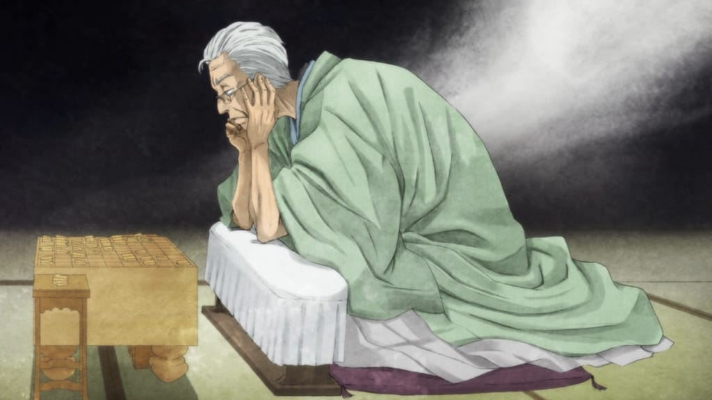

Despite everything that holds him back, his old age, his aching back, all the scary thoughts, all the comments on him to retire early, all the younger opponents, all his friends who have retired and entrusted their hopes on him, he fights *really, really hard*.

The delivery, visuals and expressions of this anime are so beautiful, that I teared when I watch this.

This may be a fictional story, and I’m sure there are real-world stories out there that are more or similarly inspiring. Being inspired is one thing, but being able to do something after that and eventually inspire others is another.

There’s a quote that says “Don’t compare yourself to others”, but instead I continuously compare myself to others who have **tried much harder** than me. It serves as a *constant* reminder to myself that there are *always* others who have done *way* more, so that means I can do it too. Every single time when I face a problem or challenge, I would tell myself that others have been through this before, and I can as well.

Sickness, depression, emptiness, directionless, aging and death are all *reminders*, that I have only one path and I have to keep moving forward. They are the reminders that makes me feel alive, for not taking things for granted and appreciate all the little things around me.

[Last year](/blog/2017/12/2017-in-review/), I *lost my sight*.

This year, I took a step back and focus on regaining my strength.

Onwards to 2019.