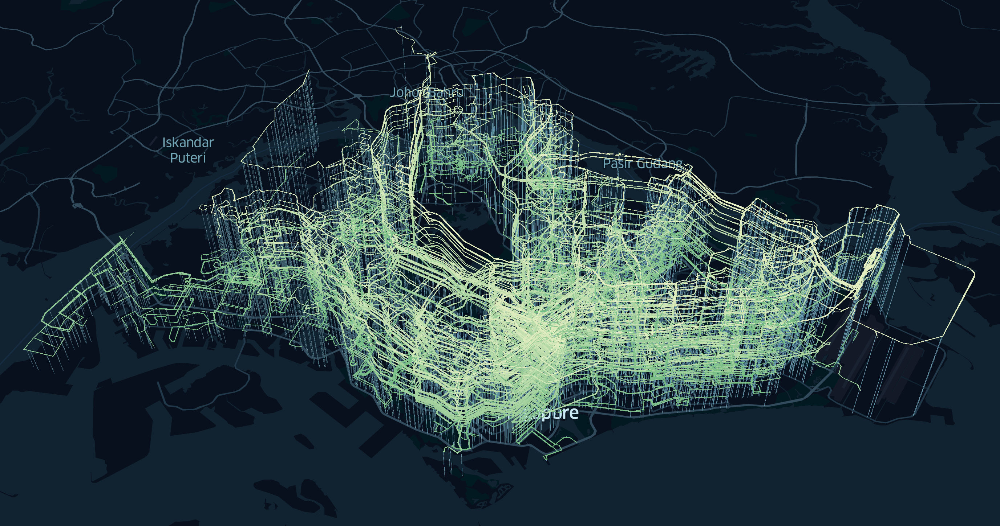

Building BusRouter SG
===

[](https://www.instagram.com/p/BS8ZX90gjw2/)

In 2016, I wrote on [Building side projects](/blog/2016/01/building-side-projects/):

> More than 10 years ago, I used to take buses all the time. At first, it's quite *exhilarating* because there were no apps or smart phones at that time. No Google Maps, no directions, no GPS. Every time I take a bus, I have to board the bus and ask the driver if the bus goes to destination X. And once I tried it few times, it slowly becomes a routine for me to take bus from point A to point B and vice versa. I have to memorise bus numbers and their routes. Whenever I look at bus stops, I'll observe every bus that stops there and note to myself, "Ah okay, these buses stop here, I'll have to memorise them in case I need to come here one day." A question always pops into my mind, what if one day, I missed my stop? Where would I end up at? In fact, where does the bus end up anyway? I know that every bus has a route but I don't know how the route looks like.
>
> That *curiosity* has stuck with me for a *long* time.

This was in my hometown, [Butterworth](https://en.wikipedia.org/wiki/Butterworth,_Penang), a small town in a state called Penang, in Malaysia. There were no taxis and no subways. Everyone drives to go places. No biking lanes and most of time, no pedestrian lanes as well.

I used to wait for the bus for roughly an hour after school. If I miss it, I might need to wait another hour again for the next bus. Sometimes I got so tired of waiting, I would just walk home, which also takes roughly an hour 😅.

Ironically, I wasn’t really inspired by public transports. I was actually inspired, or rather *frustrated*, by the **lack** of them. I was *yearning* for good public transports in Penang. Few years later (2005), I moved to Kuala Lumpur for university, and manage to have a *decent* public transport experience. There are subways and buses but they are not as efficient as I thought. Taxi fares were quite uncontrollable and sometimes exorbitant, before [Grab](https://en.wikipedia.org/wiki/Grab_(company)) exists (previously known as MyTeksi/GrabTaxi).

Fast forward to today, I live in Singapore, one of the countries with the best public transport system in the world. I’ve built not one, but **three**, public-transport-related web apps; [RailRouter SG](https://railrouter.sg/), [TaxiRouter SG](https://taxirouter.sg/) and my favorite, [BusRouter SG](https://busrouter.sg/).

The early days
---

On 7 June 2012, I stumbled upon this [tweet by @mengwong](https://twitter.com/mengwong/status/155511398653362177):

> if i could view bus routes on a map the way you can view subway routes on a map, i would take them a whole lot more.

This was the spark I needed to start building the app that’s been on my mind for so long.

9 days later, I [tweeted](https://twitter.com/cheeaun/status/158891916786794497):

> If I'm not mistaken, there are 318 bus services and 4617 bus stops in Singapore.

4 days after that, I [launched the site to the public](https://twitter.com/cheeaun/status/160380168739897344). Note that I named it 'Singapore Bus Routes Explorer', abbreviated as SBRE, because… naming is hard.

The first version looks like this:


Obviously this is a very MVP-ish release.

- It uses the [Gothere Maps API](https://gothere.sg/api/maps/overview.html). I had the impression that Gothere Maps is more *detailed* and *focused* than other map providers.
- It doesn’t display all routes at once, but one at a time. List view on the left, map view on the right.
- Some services have two routes, to and fro.
- It doesn’t display all stops by default. Only shows relevant stops when a specific service route is selected.
- Since colors are hard, I shamelessly copied the color scheme from [Gothere SG](https://gothere.sg/maps) 🙇‍♂️.

This version didn’t last long.

On [31 January 2012](https://twitter.com/cheeaun/status/164356317300006912), I committed a [huge update](https://github.com/cheeaun/busrouter-sg/commit/6fae653031fdf411b414d08e6eaa7d8614bbfc39).


- Migrated to [Google Maps JavaScript API](https://developers.google.com/maps/documentation/javascript/tutorial) because Gothere maps doesn’t show the land cover in Johor (north of Singapore, south of Malaysia peninsula). Turns out there are bus routes that stops in Johor Bahru, capital of Johor.
- Shows all stops on higher zoom levels (zoomed in), but *hidden* on lower zoom levels.
- Shows all routes passing through one bus stop. This is a big one because **no one** knows about this cool feature that I’ve built for a *very* long time (even until 2018).


There are two big *shortcomings* since the first release.

First, there’s no way to see **all** bus stops on first load. They are only visible when further zoomed in, so most users just see a blank map with a list of services on the right sidebar. The *discovery* phase failed at this point.

I *did* try to show all stops but it was… [**overwhelming**](https://twitter.com/cheeaun/status/163890092207902720).

> Definitely NOT a good idea.


There were more than 4,000 markers plotted on the map and performance wasn’t great at that time. Even when I make the stops to only appear on higher zoom levels, I still have to add conditions to render markers that are visible in the map viewport, remove markers that are outside of viewport, and re-render them when the map is zoomed or panned. 😅

The second shortcoming is the bus routes. From the [initial tweet](https://twitter.com/mengwong/status/155511398653362177) that started this, the ultimate goal is to render **all** bus routes on the map, like subway maps. Technically, it was possible to render all of them but it was such a huge mess as all the route lines would overlap one another until it’s not even discernible. Of course, rendering routes *without* stops wouldn’t make sense, so if plotting stops are visually challenging enough, then plotting route lines *and* stops together would just make it worse.

Based on these facts, I’ve decided that these goals would have to wait until there are better and faster solutions out there. Remember, this was in 2012, the year when [Internet Explorer 10](https://en.wikipedia.org/wiki/Internet_Explorer_10) was released and Internet Explorer had around 30% browser market share. [iPhone 5](https://en.wikipedia.org/wiki/IPhone_5) was released with [iOS 6](https://en.wikipedia.org/wiki/IOS_6), the last iOS version with *skeuomorphic* design.

Journey of iterations
---

Over the years, I’ve been continuously adding small design iterations and updating the bus data.

The site was made into a 'Chrome App’ in the [Chrome Web Store](https://chrome.google.com/webstore/detail/singapore-bus-routes-expl/kmoebclbglclobmahimdaniikogclifn). I used a [custom-built](https://github.com/cheeaun/busrouter-sg/commit/7990da0b589be66f90365ecd1021e9fa894bc83d) [Zepto.js](https://zeptojs.com/) library (lighter version of jQuery), [optimized](https://github.com/cheeaun/busrouter-sg/commit/b91add7206bb1ee189eac1713309ba2a379f141c) the site for small-screen devices, [replaced](https://github.com/cheeaun/busrouter-sg/commit/e6b53a00034f62280c881ecc08ee9e37fc08bc8e) Zepto.js and [Routie.js](https://github.com/jgallen23/routie) with my own self-written libraries called Yokuto.js and Ruto.js (which I planned to open-source but eventually forgot 😢), [switched](https://github.com/cheeaun/busrouter-sg/commit/fe9349a039d86d80564c5a5482bd163e593e7927) from Debuggify (now gone) to [Rollbar](https://rollbar.com/) and [then](https://github.com/cheeaun/busrouter-sg/commit/26ac33eb5829d82ab7d5bc11902482212ace59c2) [Bugsnag](https://www.bugsnag.com/), and made the site [available](https://github.com/cheeaun/busrouter-sg/commit/8c4b1458e4d357cd6d5c6d49dd720a43c9f86c02) on Firefox Marketplace (now gone).

In 2013, [Eddy Yanto](http://www.eddyyanto.com/) made a conceptual port of the site, as [an iPad app](https://github.com/eddyyanto/SGBusRouter) (now discontinued).


It might seem like not much now, but I was *really* impressed with this, mainly because I was hoping that someone would find my scraped data useful.

On 29 January 2013, I presented my web app on [Hack && Tell Singapore](https://sg.hackandtell.org/meetups/2013-01-29/) meetup. I can’t remember [how it went](https://www.facebook.com/miccheng/media_set?set=a.10151385054432229&type=3) but I guess most people were impressed(?).


On 15 April 2015, the Land Transport Authority announced [enhanced real-time bus arrival timings](https://www.lta.gov.sg/apps/news/page.aspx?c=2&id=a759467d-4ff4-4bd0-9a78-79f7fb7772a4). On May 2015, I [added](https://twitter.com/cheeaun/status/594392196612108288) [this rather](https://twitter.com/cheeaun/status/594664486025318401) [long-awaited feature](https://twitter.com/cheeaun/status/594700976675631104) on Singapore Bus Routes Explorer.


Since the API requires a *secret* key, I have no choice but to create a proxy API server called [Arrivelah](https://github.com/cheeaun/arrivelah). It's built with [Koa](https://koajs.com/), was previously hosted on [Heroku](https://heroku.com/) and now hosted on [Google App Engine](https://cloud.google.com/appengine/).


On 10 June 2015, I [registered](https://github.com/cheeaun/busrouter-sg/commit/cb33486366fcfed88eb60437264a9ed76cb5dc4a) `busrouter.sg` to finally replace the URL `cheeaun.github.io/busrouter-sg`. I realised it’s time to do this seriously and a dedicated domain would be useful for SEO and marketing purposes. `.SG` domains are generally not cheap, yet I had no means of generating revenue to offset the costs 🤷‍♂️.

Prior to 19 June 2015, I [posted](https://twitter.com/cheeaun/status/609655376808534017) [a lot of](https://twitter.com/cheeaun/status/610451541187690496) [sneak](https://twitter.com/cheeaun/status/610973074494623744) [peeks](https://twitter.com/cheeaun/status/611023628440711168) of the redesigned web app. On the day itself, I launched a [new redesign](https://twitter.com/cheeaun/status/611908395537297409), coincidentally in conjunction with the [SG50](https://www.sg/sg50) celebrations.


Note that even though the domain is `busrouter.sg`, the site is still called 'Singapore Bus Routes Explorer’. In this screenshot, it also shows the [Google Maps redesign](https://www.fastcompany.com/3027177/behind-google-maps-new-design) that was slowly rolled out from 2013.


This was also my first attempt to make the site more mobile-optimized. The previous releases… were embarrassingly not optimized at all, mainly because I was scratching my head on how to fit everything into a small screen 😅. It was actually quite challenging to show so many important information on a map even though users could zoom in and out. 2015 was a good timing as the bigger-screen iPhone 6 and 6S become more common.

My best-effort attempt was to split the viewport into half, for both map view and list view, even though by right, the map view should take *more* space, similar to the large-screen design.

On [27 March 2016](https://twitter.com/busroutersg/status/713943569321426944), I finally [*rebranded*](https://github.com/cheeaun/busrouter-sg/commit/a5c337804be7754e80659bf5c98bd59fb3889cea) the site from ’Singapore Bus Routes Explorer’ to ‘BusRouter SG’ and launched a slight redesign.


I’ve also designed a new logo, which has the same consistent design as my two other apps.


Also shamelessly *copied* the [post-SG50 logo](https://www.straitstimes.com/singapore/post-2015-sg50-logo-lives-on-in-altered-form), *stapled* on top of the generic transportation icons.

Maintaining the data
---

I always tell people that BusRouter SG is not really a new idea or *my* idea. It’s just a glorified version of what LTA has already built 🤷‍♂️. Surprisingly most people don’t know that there’s already an existing app that does the same thing. Some may have seen it but totally forgotten about it.

On [mytransport.sg](https://www.mytransport.sg/), there’s a prominent link called ‘[Interactive map](https://www.mytransport.sg/content/mytransport/map.html)’ in the navigation bar.


Previously when mytransport.sg is [known as](https://github.com/cheeaun/busrouter-sg/commit/004f0fc4c643828b97a4fc97516b0a7d22818c3c) publictransport@sg, the link was also there…


Clicking it will open up a new window that looks like this:


This interactive map was and still my main source of data. It contains all bus routes information including the stop codes, stop names, stop coordinates and route coordinates. Unfortunately the responses were not returned in nice JSON formats, but in HTML and KML formats, so I use [`cheerio`](https://github.com/cheeriojs/cheerio) (initially was using [`node-scraper`](https://github.com/mape/node-scraper)) and a few quick regular expressions to extract the data.

For example, to get a list of bus services, the code looks like this:

```
const $ = cheerio.load(body);
const services = [];

$('#busservice_option optgroup').each((i, el) => {
  const optgroup = $(el);
  const category = optgroup.attr('label').trim();

  optgroup.find('option[value]').each((i, el) => {
    const option = $(el);
    services.push({
      no: option.text().trim(),
      routes: parseInt(option.attr('value').trim().match(/[0-9]$/)[0], 10),
      category,
    });
  });
});
```

Then, the scraped data are stored as static JSON files.

Besides mytransport.sg, I’ve also scraped whatever data that’s useful and *hopefully* accurate, from [StreetDirectory](https://www.streetdirectory.com/), [OneMap SG](https://www.onemap.sg/), [Tower Transit SG](https://towertransit.sg/), and [OpenStreetMap](https://www.openstreetmap.org).

In [2013](https://github.com/cheeaun/busrouter-sg/commit/d4be0f52ce800b04de6f10736daeddaafcc8a0c8), it came to a point that there were so many scripts that I had to *organize* them with [Grunt](https://gruntjs.com/). It was later slowly removed because I realised I don’t *actually* need it, but somehow [started](https://github.com/cheeaun/busrouter-sg/commit/abf6b049636c60ca3b67c1806796aa7fd179c251) using [Yarn](https://yarnpkg.com/en/) (2016) because it *was* faster than `npm` and I liked its [`run` command](https://yarnpkg.com/lang/en/docs/cli/run/) where `run` can be intentionally left out in the full command (`yarn fetchBusServices` instead of `yarn run fetchBusServices`).

For all these years, I ran through quite a number of data reliability issues. The KML files had coordinates that were very messed up, some bus stops were missing, some bus stop locations were moved or inaccurate, and route lines [were missing](https://github.com/cheeaun/busrouter-sg/commit/a16a4f151ab3c43573b640e9ba97e4da65969963).

In the beginning, I have the impression that these bus data wouldn’t and shouldn't change often. Boy was I wrong 😅. Within just few months, there were new bus services, new stops, some stops were removed, some bus services gain new stops, and some routes were changed due to road constructions usually caused by new MRT station constructions. I was **really surprised** by the rate of changes and updates for buses in Singapore.

I received emails and messages on Twitter and Facebook from random strangers when a certain bus service is missing or some information is wrong. I also get [GitHub issues](https://github.com/cheeaun/busrouter-sg/issues?utf8=%E2%9C%93&q=label%3Adata-update+) when the data is outdated or inaccurate.

Some *requests* do sound pretty formal, as if I work for LTA or something 😅.


In 2018, I [moved](https://github.com/cheeaun/busrouter-sg/commit/04a0909bb84f51f47fbe3e7dbe5e749904e0ded4) from Yarn back to `npm` and rewrote *all* the scripts. I don’t even bother to *alias* the scripts with [`npm-run-script`](https://docs.npmjs.com/cli/run-script.html) since it doesn’t make much difference anyway.

Comparing between this:

```
npm run fetchServices
```

… and this:

```
node tasks/fetchServices
```

Yeah, not much difference right? Since I keep adding scripts for experimentation, I can’t be bothered to keep adding `run` aliases into the `package.json` file.

Unlike my first attempt, I rewrote the scripts and documented *everything*. One of the mistakes I did before was that the JSON files generated by the scripts are not *immutable* and can be overwritten by other scripts. For example, if `fetchServices` generates `services.json`, other scripts could also read the generated file *and* modify it. This causes confusion for myself (and contributors) when I don’t know if the generated file is mutated or not.

So, for version 3.0 of the data, I’ve set some rules, outlined in the [repository](https://github.com/cheeaun/busrouter-sg)'s `README.md`:

> All JSON files are "immutable", in the sense that all scripts above do not modify existing JSON files that are generated by other scripts. Every script is written to only create or modify its own JSON files and should not overwrite other JSON files.

This makes the data more predictable and easier to diff when there’s an update.

However, the data is still not perfect. There are some routes that are incomplete and inaccurate. To fix them, I’ve tried a few ways to generate the routes manually. My [first attempt](https://twitter.com/cheeaun/status/1010344976977285120) was to use Google Maps [Snap to Roads](https://developers.google.com/maps/documentation/roads/snap) API to generate the routes *between* all the stops for a service.

Here’s an *inaccurate* bus route line, drawing straight lines between stops, which is not logical as if the bus smashes *through* the buildings.


Using the Snaps To Road API, I manage to make the route more realistic. It follows the road and doesn’t cut through buildings. Here is a screenshot of a generated route that I pasted on [geojson.io](http://geojson.io/):


Sadly speaking, it’s [not perfect](https://twitter.com/cheeaun/status/1010455231572799488) either 😅. It tends to fail on some bus routes as I suspect that the API gives up if the distance between points is too far or weird.


I tried other solutions, such as Mapbox [Map Matching](https://docs.mapbox.com/api/navigation/#map-matching) API and HERE’s [Route Matching](https://developer.here.com/documentation/route-match/topics/what-is.html) API. Again, these APIs don’t work well when distance between stops is too far.

After few **weeks** of trial and error, I ended up using both Mapbox [Directions](https://docs.mapbox.com/api/navigation/#directions) API and Map Matching API *with* a little bit of magic code to come up with *best-effort* routes for all stops. They are *still* quite flawed but I’m kind of almost giving up here 😅.

To detect *faulty* routes, I’ve also written a script called `tasks/exposeFaultyRoutes` to deterministically identify bus routes that are too long or too short, by comparing straight distances between all stops in a route and distance of the route line itself. If I feel ambitious, I could also identify which bus route goes off-course and *skipped* a bus stop, though *before* that, I need a way to verify the accuracy of the bus stop location first 😅.

Nevertheless, it’s been years of data maintenance work as I continuously monitor the data and hopefully manage to keep it updated. Maybe the static JSON files is not a good idea, but I guess it works for now 😬.

Google Maps pricing hike
---

Before June 2018, everything’s [great](https://developers.google.com/maps/previous-pricing). The Maps JavaScript API was free for up to **25,000** map loads per day. Pricing for Maps Static API and Street View Static API were $0.50 USD per 1,000 additional map loads, up to **100,000** daily, if billing is enabled. It was super generous.

After [that](https://cloud.google.com/blog/products/maps-platform/introducing-google-maps-platform), **all hell breaks loose**. On 2 August, I tweeted:

> So my Google Cloud Platform/API July invoice came in: US$97.93 (SGD 133.58 +GST).

At first, I thought the bulk of it comes from BusRouter SG, but turns out it’s from another old app of mine. The app is not popular but I found *other* sites and projects that copied my Google Maps API key! Immediately I delete the key for that app to prevent myself from paying more 😅.

The horror didn’t stop. Deleting the key wasn’t enough. I blamed myself for not paying attention to the [pricing changes](https://cloud.google.com/blog/products/maps-platform/introducing-google-maps-platform) as I didn’t expect it to be so *dramatic*.

At the start of August 2018, I set [some *reasonable* daily limits in the Quotas page](https://developers.google.com/maps/documentation/javascript/usage-and-billing#set-caps) in the Google Cloud Platform Console and keep monitoring the usage. It [took me a while](https://github.com/cheeaun/busrouter-sg/issues/26) to make sure the limits don’t affect the user experience, because if the limit is reached, an error “This page can't load Google Maps correctly” will appear 😅.

At the end of the month, I [got this](https://twitter.com/cheeaun/status/1035470274945110016):


For the first 22 days of August, the chart line is flat because it’s compensated by the *free* $200 USD monthly credit. It’s like free tier pricing but paid with free credits instead.

According to the [price sheet](https://cloud.google.com/maps-platform/pricing/sheet/), the free-usage credit applies to *each* billing account and across *all* Google Maps Platform API calls, not just Dynamics Maps calls or Static Maps calls. For Dynamic Maps, $200 is enough for up to 28,000 loads and once exceeded, it’ll be $7 per 1,000 loads, for *within* a 100,000 monthly volume range. (Yes, I learnt my lesson and read everything carefully)

In the chart above, the costs soar up to $8 per day after 22 August. I checked BusRouter SG’s stats and found that it’s roughly **1,000 to 1,200** Dynamic Maps loads per day. So if I get charged roughly $8 a day, minus the credit of $200, **excluding** the occasional traffic spikes, the Static Maps loads, Places Autocomplete calls and costs for my *other* apps in the Google Cloud Platform, I would have to pay **at least $40 every month**!? 😱

During that month, the math freaked me out and I was thinking hard on how to solve this. I decided that putting advertisements would be the easiest low-effort way to temporarily cover my loss. I’ve also asked for donations on Twitter via [Buy me a coffee](https://www.buymeacoffee.com/cheeaun), though not very sustainable in the long term.

Adsense somehow didn’t work as it seems to favor web sites with static content instead of a web app like BusRouter SG. There’s nothing like [AdMob](https://en.wikipedia.org/wiki/AdMob) for web apps too 😢.

In September 2018, I reached out to [Carbon Ads](https://www.carbonads.net/) and managed to join their network. On 3 October, I [tweeted](https://twitter.com/cheeaun/status/1047388673711386624):

> For BusRouter SG, last month, Google Maps API usage cost (USD46) vs ads earnings (USD35)

It’s pretty obvious that I need to migrate away from Google Maps. At that time, there were [a few](https://news.ycombinator.com/item?id=17570029) [Hacker News posts](https://news.ycombinator.com/item?id=18390425) on folks migrating away as well. My first choice is [Mapbox](https://www.mapbox.com/) because I like their vector tiles and the [Mapbox GL JS](https://github.com/mapbox/mapbox-gl-js) library.

I’ve always been thinking of rebuilding BusRouter SG and this Google Maps pricing hike has become one of the biggest reasons.

Building the next-generation BusRouter SG
---

I’ve set three main ambitious goals.

1. **Migrate to Mapbox** from Google Maps API. Reasons:
   - Google Maps API costs got too expensive.
   - Google Maps API is still using raster tiles, while Mapbox uses vector tiles. It’s kind of unfair because Google Maps [web site](https://maps.google.com/) itself uses vector tiles instead 😅. And believe me, vector tiles is really the future of mapping on the web.
   - [Mapbox GL JS](https://github.com/mapbox/mapbox-gl-js) generally can handle more features (markers and polylines) on the map and perform better than Google Maps API.
2. **Redesign the whole UI** to be more map-focused and mobile-optimized.
   - Getting rid of the list view, especially the list of stops for a bus service. Despite its usefulness, I realised that most users don’t care about the bus stop numbers and names.
   - Putting more focus on the search field as I expect most users have a bus service in mind and won’t be *browsing* for bus services.
   - The map should take the full spotlight, by hiding any unnecessary information, and let users focus on the map data.
3. **Preload all data** from the start instead of on-demand.
   - In the previous version, every click on a bus service has to initiate a separate API call. It was meant to save bandwidth and improve performance.
   - With Mapbox, it’s possible to load *everything* on the map while still having great performance. It helps to reduce network calls, minimize round trip times, and the pre-cached data allows the site to have better offline capabilities.
   - Bandwidth can be saved by generating custom *minified* JSON files and be served with Gzip or [Brotli](https://en.wikipedia.org/wiki/Brotli) compression.

For my own side projects, I don’t have a habit of designing mockups before start coding. I usually have a rather rough mockup visualized in my head, with many wild ideas copied from few apps that I’ve used or seen.

For the new BusRouter SG, I was heavily inspired by [Apple Maps](https://www.apple.com/ios/maps/) (both iOS & macOS versions), and *partially* inspired by [Google Maps](https://maps.google.com/) (iOS & Android), [CityMapper](https://citymapper.com/) (iOS), [Transit](https://transitapp.com/), [Facebook Local](https://www.facebook.com/local/) and [SG NextBus](http://nextbus.sg/). It’s no doubt that most of my inspirations are from mobile apps as one of my goals is to make it more mobile-optimized 😬.

I [started](https://twitter.com/cheeaun/status/1013333415498637313) the rebuild on 1 July 2018.


My first *experiment* was to display *all* stops on the map. Right from the start, I mentioned that it’s slow on Google Maps and I had to work around the performance issues. But for this…, it just… works. 🤯

I did one thing that is *impossible* or *tricky* to be done on Google Maps: **Marker labels** 💥. Nope, not the [label *on* the marker](https://developers.google.com/maps/documentation/javascript/examples/marker-labels), it’s the label *outside* (or *around*) the marker.

On lower zoom levels, the bus stop markers are [circle layers](https://docs.mapbox.com/mapbox-gl-js/style-spec/#layers-circle) on Mapbox GL JS, which show the tiny red dots. It doesn’t require external images and is programmatically drawn on the map. As the map zooms in, it *switches* to the [symbol layer](https://docs.mapbox.com/mapbox-gl-js/style-spec/#layers-symbol) with an external image of a bus stop icon in a red circle. The bus stop label shows up and renders the bus stop number, e.g. ‘08057’. At higher zoom levels where there are more space around the stops, the label will show additional bus stop name, e.g.: ‘Dhoby Ghaut Stn’, *under* the bus stop number.


On 20 July 2018, I [continued experimenting](https://twitter.com/cheeaun/status/1020114981717651457) on the route lines.


I created another type of marker to differentiate the *significant* stops from the rest. Starting and ending stops are rendered with this pin-drop markers. On lower zoom levels, showing all stops on top of the route line makes it too crowded, so they are hidden until further zoomed in. The route line is also subtly ‘gradiented’ from red to purple to red, to give hints on the start point, middle point and end point.


Initially, I was thinking of using a linear gradient of red to purple; red for starting, purple for ending. Later I realised some bus services have round-trip routes where the start and end go to the same bus stop. Also, from the data sources, there is no 100% guaranteed way of determining the *direction* of the route line, which means it’s unsure that which stop is the start or the end. This is why I came up with a safe solution, for now, that is the linear gradient of red-purple-red, instead of red-purple.

As for the gradient line, it uses the cool `line-gradient` property that was [introduced](https://blog.mapbox.com/map-pride-2018-with-our-new-design-tools-32b886f7db1b) last year in [Mapbox GL JS version 0.45.0](https://github.com/mapbox/mapbox-gl-js/releases/tag/v0.45.0)!

During the month of August and September, I diligently work on it, while trying my best to reduce my Google Maps costs *and* working at my weekday job 😅. This two-month period was also the time when I got involved in coaching for a [coding bootcamp](http://www.techladies.co/). September was also the month when [iPhone XS](https://en.wikipedia.org/wiki/IPhone_XS) is introduced.

After months of hard work, the final result is **exquisitely top-notch**. ✨ (Yes, I’m praising myself). Here's the ‘Home’ view:


The map markers were changed slightly. I received a feedback that the tiny red dots on the map, when zoomed out, look… *“pandemic”* 😰. I kind of agree that for first-time users, there are no explanations on what these red dots are, and since they are red in color, they do look *dangerous* in some way, though my *real* intention is to make them contrasting against the map tiles.

First thought that crosses my mind was “Maybe I should put a legend”. But where should I put it, especially on a small screen viewport? I was feeling lazy of putting yet another element on the map so I try to think if there’s a way to make the markers self-explanatory *without* a legend. Then I realised that the tiny red dots may be too simplistic **but** the zoomed-in markers, with bus icons, are more self-explanatory! Users could have guessed that the bus-icon red circles are either the stops *or* the buses themselves. However, they shout out as “stops” as most [stop signs](https://en.wikipedia.org/wiki/Stop_sign) are in red 🤓.


So, the solution is to show the bus-icon red circles in zoomed-out levels, but they are not tiny enough and may just cover the whole Singapore in the map 😅. An idea struck my mind that I could render not all, but **some** bus stops as bus-icon red circles while the rest as tiny red dots. As I researched, the only criteria that differentiates stops is the *type*, either a normal stop or an [interchange/terminal](https://landtransportguru.net/bus/bus-infrastructure/bus-interchanges-and-terminals/).

> A **Bus interchange** (referred to as a Bus station outside of Singapore) is a large facility handling many bus routes and usually offers connections to the Mass Rapid Transit (MRT) network. As such, they are an integral part of Singapore’s hub-and-spoke public transportation system, where commuters frequently rely on buses for ‘last-mile’ connections from Town Centres to their homes.

Luckily it’s quite easy to identify a bus stop as an interchange, by the name ‘Int’ at the end, e.g.: ‘Toa Payoh Int’. As for a terminal, I roughly guessed it as a *smaller* version of an interchange.

Anyway, [rendering the bus interchanges](https://github.com/cheeaun/busrouter-sg/commit/cda35c3f5ce12842183510f285b48817c5817525) on the map seems to be sufficient enough to hint users on the context of the surrounding red dots. I’m surprised that some users even manage to guess them as bus interchanges even though there’s no legend 🤩.

This is the ‘Stop’ view:


When a stop is selected, a red glow appears around the stop marker and a stop popover slides up. This popover that slides up from the bottom of the viewport is a better UI than previous version’s [info window](https://developers.google.com/maps/documentation/javascript/examples/infowindow-simple) that looks like a chat bubble popping above the marker. The positioning is less hacky and more mobile-optimized.

Bus stop codes and service numbers are designed to look like badges, with a white outline and a subtle drop shadow. Red for stop, green for service. To allow quick preview of arriving bus services, the service badge can be expanded to show the arrival time in minutes.


This color scheme is originally *inherited* from [gothere.sg](https://gothere.sg/). Coincidentally, it matches the colors from LTA’s [Colour Your Buses](https://landtransportguru.net/lta-colour-your-buses/) public voting in 2016, to pick the color for new buses in Singapore. ‘Lush Green’ was [voted as the result](https://www.channelnewsasia.com/news/singapore/lush-green-picked-as-colour-for-new-singapore-buses-8153324) of the voting exercise.

This is the ‘Service’ view:


I added a rather unusual UI element at the top of the search panel. I call it a ‘floating pill’ when it was initially small in one of my first experiments  (above). The width fits the content and expands as needed until reaching the maximum width similar to the search panel width.

The bus services’ names are custom-generated from my scripts, showing the starting and ending bus stop names. I use ASCII arrow characters like ‘⟲’, ‘→’ and ‘⇄’ that can be easily understood, to indicate the directions of the route.

Some routes can be [complicated](https://github.com/cheeaun/busrouter-sg/commit/079e398ee5213f1086846376a71049b26f023a82):

> Services with two routes may contain A-to-B and B-to-A routes with different list of stops, usually on the opposite sides of the road. Some services may contain A-to-B and C-to-D routes where the first stop of a route may not be the last stop of the 2nd route, etc.

So, a route could also be A-to-B then B-to-C or A-to-B then D-to-A. I settled this issue with a ‘/’ character to separate different starting and ending stop names, e.g.: ‘Blk 32 / Blk 203 ⇄ Opp MAS Bldg / Mapletree Anson’.


Generally the names are not very important as I suspect most *frequent* bus riders memorize bus numbers. I think even starting and ending bus stop names won’t be as useful as the important landmarks that the bus service pass by. If there’s a way for me to get a list of landmarks that are nearby the route of every buses, I probably could have shown them. Though that leaves another tricky question, “How many landmarks?” 🤔. I’ll leave that for another day 😬.

As I was building this next-gen BusRouter SG and maintaining feature parity with the old version, there is one piece of the puzzle that I wanted to improve: **Bus arrivals UI**.

There’s quite a number of useful information returned by the [Bus Arrival API](https://www.mytransport.sg/content/mytransport/home/dataMall/dynamic-data.html), for all services per bus stop:

- Bus service number and operator
- Arrival timings of the next **three** oncoming buses
- Wheel-chair accessibility
- Vehicle type (single deck, double deck or bendy)
- Bus occupancy or load level (Seats Available, Standing Available, or Limited Standing)
- Coordinates of the oncoming buses (very cool, but not accurate sometimes)

Most third-party apps, including the old version of BusRouter SG, show a very plain table of arrival timings and sometimes display (or hide) one or two of these extra information.

For the past few years, I've downloaded and surveyed lots of apps and finally found one that sparked my interest: [**SG Bus**](https://itunes.apple.com/sg/app/sg-bus/id1148286322?mt=8) by *Sim Ruenn Kang*.


Despite the rather underwhelming app name and respectably decent designs, I was totally surprised to see a user interface that looks almost like a table of timings while at the same time, **visualizes** the distance of oncoming buses from the stop! It’s pure genius!

I liked this idea so much that I shamelessly *stole it* and made it **10 times better** 🤩.


The timing text is colored based on the bus load, with a legend at the bottom of the “table”. Green for ’Seats available’, red for ’Standing available’ and dark red for ‘Limited standing’. The distance of the buses are reverse-calculated from the timing data (in milliseconds, from the API), where 1 minute is equivalent to 10 pixels. So, 5 minutes = 50 pixels. A vertical grid line of 50-pixel interval is drawn to give further hints on how far the buses are. The second and third oncoming buses are *faded out* as they are less important than the first one. The wheelchair symbol is a [Material Icon](https://material.io/tools/icons/) and is blue-colored because… of the [♿ emoji](https://emojipedia.org/wheelchair-symbol/).

I designed three bus icons since I couldn’t find any on the Internet.


I posted [a few](https://twitter.com/cheeaun/status/1045295027507752960) [sneak peeks](https://twitter.com/cheeaun/status/1045498645167009793) and really liking this [**magical** transition](https://twitter.com/cheeaun/status/1055630640798789632):


At first glance, the arriving bus may seem like *passing through* the first vertical grid line. Essentially this reveals 2 possibilities; the bus has arrived or the bus has left the stop. This odd situation is caused by a weird response from the API where the arrival timing value can become zero and later *negative* 🤷‍♂️. The LTA [DataMall](https://www.mytransport.sg/content/mytransport/home/dataMall.html) API documentation does mention a guideline on how to display derived arrival duration like ‘4 min’ and ‘Arr’, but it doesn’t mention how to handle negative durations 😅. So, to be on safe side, I decided to display ‘Arr’ and *purposely* visualize the negative duration by making the bus icon *go through* the grid line.

There are no unique IDs to identify the buses, so I coded a custom diffing *logic*, comparing the old state and future state of the oncoming buses and apply transitions on them based on distances and bus features. The API calls are polled and always return results for **three** oncoming buses, and yet at the point of transition, in less than a second, **four** buses are rendered, as the *first* one fades out and the *last* one fades in.


Of course, there are some minor edge cases as well, which I’ve handled hopefully 🤞.

Overall, I’m very satisfied with this version as it’s getting almost perfect as what I imagined. [Passing routes](https://twitter.com/cheeaun/status/1089139497327939584) feature works great, after a few [failed experiments](https://twitter.com/cheeaun/status/1046746110214037504). It’s also functioning pretty well as a [Progressive Web App](https://twitter.com/cheeaun/status/1059334054380621830). I’ve also added a hidden feature to [visualize connecting routes between stops](https://twitter.com/cheeaun/status/1064150055341326337) (not public yet).

From a technical standpoint, the project uses [Preact](https://preactjs.com/) as a small-size React-like base library, [Fuse.js](http://fusejs.io/) for fuzzy-search, [cheap-ruler](https://github.com/mapbox/cheap-ruler) for ultra-fast geodesic calculations, [ls-cache](https://github.com/pamelafox/lscache) for caching with expiration, [Workbox](https://github.com/GoogleChrome/workbox) for working with service workers, and [Parcel](https://parceljs.org/) for blazing-fast bundling. It’s no surprise that [Mapbox GL JS](https://github.com/mapbox/mapbox-gl-js) and the static JSON files use up a huge chunk of the total download size and processing resources. I’ve done quite a lot of optimization work such as using [`requestAnimationFrame`](https://developer.mozilla.org/en-US/docs/Web/API/window/requestAnimationFrame) and [`requestIdleCallback`](https://developer.mozilla.org/en-US/docs/Web/API/Window/requestIdleCallback), adjusting [buffers](https://docs.mapbox.com/help/troubleshooting/working-with-large-geojson-data/#adjusting-the-buffer) and [tolerance](https://docs.mapbox.com/help/troubleshooting/working-with-large-geojson-data/#tolerance) on the map, and [throwing in](https://github.com/cheeaun/busrouter-sg/commit/eed544f0c50e4fb5f9c553d10c29396814bde210) all the `preconnect`, `dns-prefetch` and `preload` browser resource hints.

On 12 October 2018, I [asked around](https://twitter.com/cheeaun/status/1050580753749168128) for beta-testers and that’s how I got those early constructive feedback. The new site is not officially launched yet, so I need keep the old version on `busrouter.sg` and host the beta version on a separate subdomain like `next.busrouter.sg`. BusRouter SG was hosted on [GitHub Pages](https://pages.github.com/) and there’s no way I could add subdomains. I could potentially upload the new version on *another* web host and then `CNAME` the subdomain, but… I still need an easier migration/redirection procedure.

I moved on to [Netlify](https://www.netlify.com/). Netlify has a neat feature called [Branched Deploys](https://www.netlify.com/blog/2017/11/16/get-full-control-over-your-deployed-branches/) and can [turn deployed branches into their own subdomains](https://www.netlify.com/docs/custom-domains/#branch-subdomains). So if I have a `next` branch in my repository, I could set it to deploy to `next.busrouter.sg` 💥. Besides, Netlify also allows setting [custom headers and redirects](https://www.netlify.com/blog/2017/10/17/introducing-structured-redirects-and-headers/) and I can add `Link` headers to preload content!

Ultimately, on [19 November 2018](https://twitter.com/cheeaun/status/1064344313549574144), I officially launched the next-generation [BusRouter SG](https://busrouter.sg). 🚀

[](https://twitter.com/cheeaun/status/1064344313549574144)

For this tweet, I had a bit of fun creating a short introductory video/GIF ([high-res version](https://www.youtube.com/watch?v=3zMlTj81GTY)) with [Keynote](https://en.wikipedia.org/wiki/Keynote_(presentation_software)), kind of similar to [Apple](https://www.youtube.com/user/Apple) ones.

Pushing the visualization limits
---

While building BusRouter SG, I embarked on a little *side quest*.

As mentioned from the start, the ultimate goal is to render **all** bus routes on the map, like subway maps. Even though the new BusRouter SG is able to render all stops, rendering all routes is still… quite challenging. Back in 2012, it was *technically* challenging, but now it’s **visually** challenging.

On 1 Oct 2018, I performed [an experiment](https://twitter.com/cheeaun/status/1046789917932576768).


This was an experiment for ‘Passing routes’ feature, displaying all routes that passes through a stop. I use rainbow colors to separate the routes and all route lines have the same width as normal roads on the map. On lower zoom levels, the route lines overlap on one another. As the map is zoomed in, the [`line-offset` property](https://docs.mapbox.com/mapbox-gl-js/style-spec/#paint-line-line-offset) kicks in and *shifts* the lines into a parallel side-by-side arrangement, as shown in the GIF above.

Honestly, it looks pretty darn cool 😆. Unfortunately there are so many route lines that the road underneath them is not even visible anymore. Maybe I could reduce the line width to maybe… 1 pixel which then could be too small and not so scalable. This bus stop 82069 (Aft Lor 106 Changi) serves more than 20 routes. Imagine the visual horror for bus stop 08057 (Dhoby Ghaut Stn) which serves more than 40 routes! 😅 And... I haven’t even try this for **all** routes yet!

Logically speaking, there’s just not enough space. I think even the most complicated subway maps in the world don’t have this kind of problem. Some bus stops in Singapore have [service guides](https://sgwiki.com/wiki/Gallery_of_Service_Guides) and show subway-like maps but still, they look very, very complicated.

One day, I had an epiphany. If there’s not enough space in 2D, how about… **3D**? 🤔

Mapbox GL JS supports [3D extrusions](https://docs.mapbox.com/mapbox-gl-js/style-spec#layers-fill-extrusion) and I’ve played around them before when building [TaxiRouter SG](/blog/2018/04/rebuilding-taxirouter-sg/) and [Check Weather SG](/blog/2018/06/building-check-weather-sg/). So, if there’s no space to position the route lines side-by-side, why not *float* them on top of each other? 🤯

The [results](https://twitter.com/cheeaun/status/1010542298810085376) are **breathtakingly gorgeous** ✨.


I add extruding poles as bus stops and the whole visualization starts to look like roller coasters! 🎢


And a sprinkle of rainbow colors…


On 28 June 2018, I [published](https://twitter.com/cheeaun/status/1012140014652686336) this as a visualization mini-site on BusRouter SG. It may not seem useful but looks cool enough to warrant its own place on the Internet. I’ve also submitted it on [Reddit /r/dataisbeautiful](https://www.reddit.com/r/dataisbeautiful/comments/8xbvtz/oc_visualization_of_bus_routes_overlapping_each/).

There is one nifty trick I did in the visualization. The route lines are **not** randomly sorted or elevated. They are sorted from shortest distance at the bottom to the longest at the top.


My script will loop through all routes starting from the shortest and check for intersecting stops. If the subsequent route has a stop that intersects with the current route, it will be *promoted* to the next ‘level’, and the process repeats, level after level. This is intended to *reduce*, not completely eliminate, intersecting routes being drawn on the map and hopefully will reduce the visual clutter as well.

After the launch of the new BusRouter SG on November, the mini-site was *accidentally* removed, as I forgot about it and the build/bundle scripts have changed the directories. I’m not sure how much traffic the mini-site gets but I guess no one was as excited as I am(?) 😅.

On 17 January 2019, I suddenly remembered about the mini-site and decided to [bring it back](https://twitter.com/cheeaun/status/1085810382420099072), especially with the new set of scraped data.

There were two issues in the previous visualization that I wanted to fix:

- Hover states for extruded routes and stops. Older versions of Mapbox GL JS had issues with [ray picking extruded polygons](https://github.com/mapbox/mapbox-gl-js/issues/3122). So when a cursor hovers over a 3D block, above its base, it picks the object *behind* the block instead. Due to this bug, I couldn’t add hover effects properly, not to mention clicks.
- The route lines were converted from a line to a polygon, with [@turf/buffer](http://turfjs.org/docs/#buffer). For example, a line consists of two points, A to B. I could make it thicker by changing its line width. Mapbox GL JS allows that but it can’t be extruded (float in the air, in this case). To make extrusion possible, I have to convert it to a polygon “line”, which consists of 4 points. It’s a bit like ‘Expand Stroke’ in Affinity Designer or Illustrator to convert a path into a vector shape. As of result of this conversion, the amount of data **doubled** thus increasing the file size and affecting rendering performance.

This time, I managed to fix *all* of them by using [Deck.gl](http://deck.gl/), a large-scale WebGL-powered data visualization library. The route lines are not *buffered* anymore and they are rendered with [PathLayer](https://deck.gl/#/documentation/deckgl-api-reference/layers/path-layer). For the floating part, a 3rd coordinate (z) is provided, looks like this (x, y, z), to *elevate* the paths above the ground 🤯. Hover states just works, including clicks, by setting `pickable: true` and using interaction properties like `onHover` and `onClick`.

With [Custom Layers](https://blog.mapbox.com/launching-custom-layers-with-uber-2a235841a125) launched last October, integrating deck.gl with Mapbox becomes much easier. Data manipulation and updates are a bit tricky with Mapbox GL JS, but with deck.gl, it’s surprisingly straight-forward. It took me a while to grasp the concept but turns out it’s pretty similar to React’s declarative paradigm.

For example, I have a `data` array and set it as initial value for a map layer. If I want to update the data, hide or show some data, or change colors, I can mutate `data` and then set the value (the whole array) for the layer again and again 😱.

```
// Initial data
const data = [{path: [...]}, {path: [...]}];

// Initiate layer
const routesLayer = new deck.MapboxLayer({
  id: 'routes',
  type: deck.PathLayer,
  data: data,
  ...
});

// 1) Manipulate/mutate data
data = ...
...

// 2) Pass in data, layer will re-render
routesLayer.setProps({ data: data });

// Repeat step 1 and 2
```

On [19 January 2019](https://twitter.com/cheeaun/status/1086540096046653440), I relaunched the new [visualization mini-site](https://busrouter.sg/visualization/):




The new color scheme and map styles are influenced by [Kepler.gl](https://kepler.gl/), which is a geospatial analysis tool that also uses deck.gl.

The new mini-site has a pretty cool “opening entrance”…


…and [super-fast](https://twitter.com/cheeaun/status/1087702108525096960) interactivity ⚡️.


I’m quite satisfied with this visualization, though I believe that there could be more ways to improve it further. I might revisit this again after collecting more feedback and ideas 😁.

Post-launch aftermath
---

After the November 2018 launch of the next-generation BusRouter SG, I continued monitoring the costs. Ever since the switch from Google Maps to Mapbox, my Google Cloud costs have gone down for sure. However, on [3 Dec 2018](https://twitter.com/cheeaun/status/1069579123872284673), I calculated the cost for Mapbox and… it’s still not good news 😅.

According to [Mapbox’s pricing page](https://www.mapbox.com/pricing/), the ‘Pay-as-you-go’ plan is free for up to 50,000 [map views](https://docs.mapbox.com/help/glossary/map-view/) per month and once exceeded, charges $0.50 USD per 1,000 map views. This applies to *all* my apps and tokens, so it’s not just BusRouter SG alone. I have **five** apps (excluding BusRouter SG and visualization mini-site) under this plan.


On the launch day itself, the map views count spiked up to 12,000 and eventually averages down to 7,000 a day. My other apps use roughly 1,000 map views per day. That means *at least* 210,000 map views per month and minus the free 50,000 map views, I’ll have to pay **$80 every month**!?! That’s even more expensive than Google Maps! 😱

I can’t believe that I made the same careless mistake *twice* 😅.

I maintained my **equanimity** and calmly looked for solutions. Searching for ‘vector tiles hosting’ on the web, I came across [OpenMapTiles.org](https://openmaptiles.org/), a site that provides free OpenStreetMap vector tiles for self-hosting. Building [my own vector tile pipeline](https://openmaptiles.com/server/) sounds complicated, so I look at its hosting option called [Maptiler Cloud](https://www.maptiler.com/cloud/). Referring to the [pricing plan page](https://www.maptiler.com/cloud/plans/), the ‘Free’ plan allows for up to 100,000 requests per month. 1 request is equivalent to 1 map tile load and generally, vector maps load 4 tiles per view. That’s… roughly 25,000 map views per month. For the $20 USD ‘Flex’ plan, it allows 500,000 requests per month, which translates to 125,000 map views per month. Additional 1,000 requests cost $0.05.

If the definition of ‘map view’ is similar to Mapbox, the previously calculated 210,000 map views per month would result in **$37 USD** ($20 + $17 for additional requests). 🤔 Oh well, at least, it’s *cheaper* than Google Maps 🤷‍♂️. Since I have no other choices at the moment, why not give it a try?

On [5 Dec 2018](https://github.com/cheeaun/busrouter-sg/commit/d44a3611b94210506d9b076a326bbbdc54d8fa8d), I signed up for a free account and replaced Mapbox vector tiles with Maptiler vector tiles, with few of my own customizations which I did for Mapbox before, intentionally look quite similar to Apple Maps’ tiles.


It’s a pretty silent switch and so far I didn’t hear anyone mention about the changed map tiles. There’s an Analytics page on Maptiler to keep track of total number of requests, which is *estimated* based on the number of uncached requests and average CDN cache utilization. I’m not really sure if the cost involves cached requests or not, but so far it’s working fine under the ‘Free’ plan 🤷‍♂️. I would have thought of paying but looks like I don’t need… yet? 🤞

Here’s my cost and revenue table for BusRouter SG since July 2018.

| Month/Year     | Cost (USD) | Revenue (USD) |
| -------------- | ---------- | ------------- |
| July 2018      | $97.93     | $5.00         |
| August 2018    | $108.19    | $10.00        |
| September 2018 | $46.35     | $45.02        |
| October 2018   | $23.61     | $88.08        |
| November 2018  | $55.03     | $110.56       |
| December 2018  | $4.50      | $80.97        |

The costs include both Google Cloud and Mapbox, **excluding** domain renewals. The revenue comes from generous donations via [Buy Me A Coffee](https://www.buymeacoffee.com/cheeaun) and advertising via [Carbon Ads](https://www.carbonads.net/).

On December 2018, it reached a break-even point 😌.

On January 2019, I reverted back to maintenance-mode and did these:

- Replaced Mapbox GL JS’s [GeolocateControl](https://docs.mapbox.com/mapbox-gl-js/api/#geolocatecontrol) with my own custom-coded component. It has similar functionality like Google Map’s, with [compass heading](https://twitter.com/cheeaun/status/1080764913738407936).
- [Added](https://twitter.com/cheeaun/status/1083572537987031040) approximate first and last bus arrival times information.
- Approved [JinGen’s pull request](https://github.com/cheeaun/busrouter-sg/pull/29) for adding custom `apple-touch-icon` for every bus stop arrival time page.
- [Fixed](https://github.com/cheeaun/busrouter-sg/issues/30) Service 173’s hilariously weird route line.
- Added [quick-preview routes](https://twitter.com/cheeaun/status/1089140404425940992) when hovering over bus services.

Curiosity and beyond
---


It’s been an incredible journey and I’m confident to say that I’ve built one of the **most beautiful public transport web app ever seen**. After 6 years of development and maintenance, it’s getting very near to perfection and is definitely one of my best side projects (ever since [HackerWeb](/blog/2012/03/how-i-built-hacker-news-mobile-web-app/)).

What starts as a simple site to fulfill my curiosity, turns into a huge project that I’m proud to show off. Along the way, I’ve learned a lot and had so much fun coding and designing every single little detail. I’m glad that I finally able to write down this rather long story, which I kept reminding myself every year 😅. The series of events may seem *jumpy* but that’s how life works 😝.

As for now, I’ll continue monitoring the costs, maintaining the site, updating the bus data, fixing bugs and adding more useful features. [BusRouter SG](https://busrouter.sg/) is [open-sourced on GitHub](https://github.com/cheeaun/busrouter-sg) and I hope that my work could benefit more people living in and travelling to Singapore. **A big shout out** to all my users, contributors and folks giving me valuable feedback and donations.

I suppose the moral of this journey is **never let go of your curiosity** because one day, you’ll be able to fulfill it.