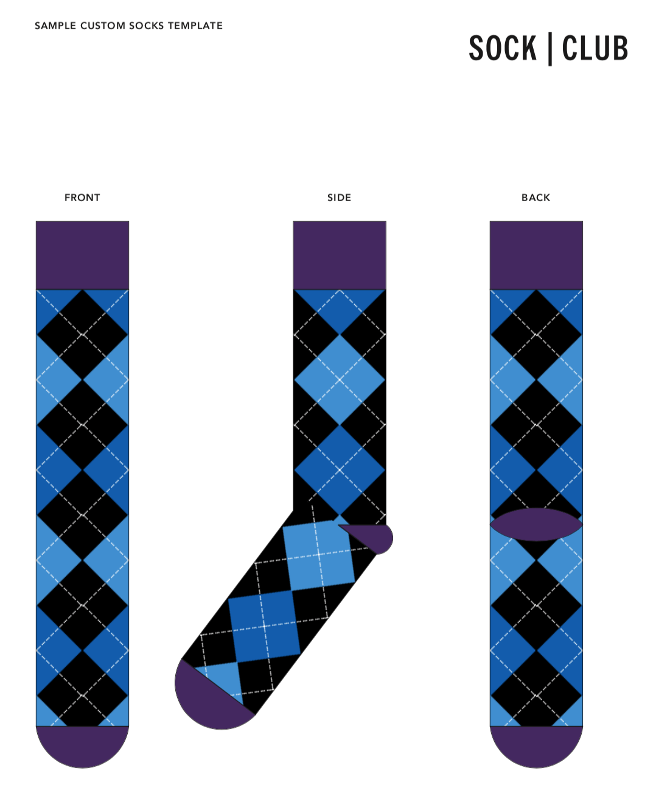

What I learned from printing custom swags
===

Apparently, I’ve been called the [“swag king” of Singapore](https://www.youtube.com/watch?v=pzmXcI2soPs&t=214) 😅, mainly due to my voluntary work on printing swags like stickers and t-shirts for the past few years. My contributions have made a significant impact towards the lives of all meetup goers and conference attendees in Singapore, and perhaps other countries as well.

Before I begin, a few disclaimers:

1. I don’t *print* swags literally. I simply order them from custom-printing shops and suppliers.
2. I’m not an expert in custom-printing swags and still have a lot to learn, compared to those who have done this work for many years.
3. I do this purely out of curiosity. Maybe as a hobby but it’s a rather expensive one 💸.
4. What I’ve learned may not be applicable to other situations, places or countries. Things might have changed over time. It’s still best to self-experiment before trusting everything written here.

The beginnings
---

I go to a lot of meetups and [conferences](/blog/2015/12/why-i-attend-conferences/). Sometimes these events, usually conferences, give free swags and I’m always very happy to get them. They’ve become a reason for me to attend, and swags are always good for ice-breakers to know new like-minded people.

After *years* of getting free swags, I start wondering to myself, can I create my own swags? Instead of doing the taking, maybe it’s time for giving? 🎅

I had no clue how this swag stuff works and honestly, been taking them for granted. I used to be quite *arrogant* and kept asking the organisers for free swags, without realising how difficult it is to produce them in the first place.

It all started with shirts.

Before 2014, most t-shirt swags from the conferences that I attended, in Malaysia and Singapore, were not… super great. I’m not picky about shirts but the quality for conference shirts were not very high-quality, and I don’t usually complaint much since they are free. Maybe due to this fact, I didn’t pay much attention to them, including all other swags like stickers. I just like them because… they are free, *not* because they’re awesome. Material-wise and design-wise were sub-par and didn’t leave much impression on me.

In 2014, I traveled to San Francisco, attended a few meetups and conferences, and found one very important difference: the swags were much, much better. They *felt* better somehow and at that time, I don’t really know why. I don’t know what makes it better or how it can be better at all. I thought all stickers and shirts are the same, right?

Right…?

I decided to find out why and did *a few* experiments.

Shirts 👕
---

I printed not one, but **three** t-shirts for my own ‘CA’ logo. They were completely experimental and at that time, I have no idea what I’m doing.

On 31 March 2014, I [ordered](https://twitter.com/cheeaun/status/454732849271152640) a t-shirt.

This is my first ever t-shirt with my own logo on it. Yes, I order only *one* t-shirt from [CustomInk](https://www.customink.com/) and it costs US$24.75. It’s [American Apparel Jersey](https://www.customink.com/products/styles/american-apparel-usa-made-jersey-t-shirt/15000), 100% combed ringspun cotton, size S, and white.

On 13 April 2014, I [ordered](https://twitter.com/cheeaun/status/460886871837376513) a second t-shirt from CustomInk.

This time, it’s a grey logo on black background. [Gildan Softstyle Jersey](https://www.customink.com/products/styles/gildan-softstyle-jersey-t-shirt/176100), 100% pre-shrunk ringspun cotton, size S and costs US$25.75.

It’s pretty neat that CustomInk allows me to order only *one* shirt as most vendors enforce a minimum order. This allows me to experiment and see how the shirt looks like.

I personally don’t quite like the white shirt as the base, because it looks more *crumpled*. The orange logo was too big because I was trying to measure it in inches, a measurement unit that I’m not familiar with (including the rest of the world 😏).

It does match my personal branding, orange and white, but I realise that I have to change it when it comes to shirts, since it’s something that I would be wearing, unlike a web site or a magazine.

Black (including other darker colors) is always the safest bet because:

1. It’s hard to decide on a base color that suits everyone’s taste.
2. Black is versatile enough to go well with anything to match your wardrobe.
3. Black is always mysteriously stylish.

With my second attempt, I use black as the base color with a grey version of my logo. I’ve also made the logo smaller as I try to match the measurements from Iron Man’s arc reactor 😎.

It was good… but the shirt material and printing were not great. The material is 100% cotton and feels *thick*. The logo print feels like it *sticks* on top of the shirt and not *part* of the shirt. I was comparing it to [some conference t-shirt swags](https://twitter.com/cheeaun/status/448636062231851008) and the level of quality is completely different.

I did some research and found an interesting material called **Tri-blend**. Googling it will reveal a few resources like:

- [What does Tri-blend mean?](https://creativeresources.threadless.com/what-is-tri-blend/)
- [Triblend Shirts - A Guide to Awesomeness](https://libertymaniacs.com/pages/triblend)

Tri-blend is a combination of 3 fibers:

- Cotton — Breathable, doesn’t trap heat.
- Polyester — Wrinkle-resistant.
- Rayon — Fit, durability, and crazy softness.

Sounds amazing, right? It is! Ever since I tried them, I’ve been slowly updating my wardrobe over the years, replacing **all** my 100%-cotton shirts to this.

I wanted to print my logo on this material but found that the price was too costly to print *one* shirt so I kind of gave up, until…

On 8 December 2014, I ordered [3 t-shirts with my Kopi.JS logo](https://twitter.com/cheeaun/status/545073311265206272).

It’s [American Apparel Tri-Blend](https://www.customink.com/products/styles/american-apparel-tri-blend-t-shirt/337000), in S, M and L sizes, and costs me US$105.30 (Yes, still expensive 😂).

I got size S [for myself](https://twitter.com/cheeaun/status/545400552901718016) and gave the rest to my other [Kopi.JS](https://kopijs.org/) co-founders ☕️.

On 28 November 2015, I ordered another one (again).

This is the 3rd, and perhaps the last, t-shirt with my logo. I ordered it from [ooShirts](http://www.ooshirts.com). It’s [Next Level Tri-Blend](http://www.ooshirts.com/t-shirts/short-sleeve-shirts/next-level-triblend), DTG-printed, size S and costs US$31.77 (getting more expensive, I know 💸).

I printed this one because I like tri-blend and I want my logo on it 😂. I also wanted to try *other* brands that produce this material and see if there are any differences.

Turns out it’s *not* the brand, it’s the fabrics themselves! I don’t know about American Apparel but this Next Level shirt contains 50% polyester, 25% cotton and 25% rayon. [My](https://www.printful.com/blog/guide-to-cotton-polyester-and-blended-fabrics/) [research](https://www.rushordertees.com/blog/cotton-polyester-5050-blend-which-better-you/) revealed that there are also the 50/50 blends (50% cotton, 50% polyester) and 65/35 (65% cotton, 35% polyester), which are also known as **polycotton**. And yeah, there are also other percentage ratios for the tri-blends besides the 50/25/25.

In short, this is how I *naively* see them:

- Cotton is the most popular fabric for normal wear. Best for vibrant printing and also the cheapest option.
- Polyester is mostly used for sportswear. Lighter and silkier.
- Rayon is super soft and perfect for women dresses, skirts, bed sheets, etc.

At first I don’t quite get rayon, since cotton and polyester already feels soft for me. So I looked into my wardrobe and found that I already have a few polycotton shirts (I didn’t realise it until my research 😅).

One of them is my most favourite so far, the [Dribbble t-shirt](https://twitter.com/cheeaun/status/532713230779428864) (with stickers 🤩).

It’s a [50/50 heather black](https://shop.dribbble.com/products/dribbble-tee).

Pretty soft. But not as soft as tri-blend. It feels slightly *heavier* too. I don’t know how to explain it properly but it just *felt* that way 🤷‍♂️. Maybe I just like the word “tri-blend” because it sounds cool 😂.

So the problem here is that most, if not all, local printers in Singapore don’t have tri-blend t-shirts. 100% cotton is like *everywhere* and the alternatives are usually dri-fit (100% polyester).

After **months** of research and googling, I finally found a local custom t-shirt printer in Singapore called [Cottony](https://www.cottony.sg/) that supplies tri-blend!

So heck yeah, I went in **full force**.

On 16 August 2016, I ordered **35** t-shirts (12 S, 13 M, 8 L, 2 XL) with the pixelated Kopi.JS logo. They are [Next Level](https://www.nextlevelapparel.com/) Tri-blend Crew, vintage black, DTG-printed, and cost SG$770 (free shipping, SG$22 per shirt).

I gave them away for **free**, mostly to those who are regulars to my [Kopi.JS](https://kopijs.org/) meetups. It’s also the first time I order so many shirts, all packed inside a huge plastic bag.

Folks who [received the shirts](https://medium.com/kopi-js-community/kopi-js-in-2016-cf1b64f3f74a), [seem](https://twitter.com/shujinh/status/768064653339439104) [to like it](https://twitter.com/meowlivia_/status/768236544997990400) [a lot](https://twitter.com/webuildsg/status/807449278633213952), which makes me feel really glad. 🤗

On 19 September 2016, I ordered *another* batch, **30** t-shirts (12 S, 15 M, 1 L, 2 XL) with the [Milo Dinosaur logo](https://dribbble.com/shots/2630937-Milo-Dinosaur-2nd-attempt-pixel-art-edition), from Cottony. It’s the same Next Level Tri-blend Crew, costs SG$606.60 (free shipping, SG$20.22 per shirt), but with screen printing instead.

Okay now, I mentioned DTG (Direct to Garment) and screen printing. What’s the [difference](https://www.printful.com/blog/dtg-vs-screen-printing/)?

- DTG
  - Ideal for small batches, thus affects the minimum order 😏.
  - Good for detailed designs and photos, with lots of colors.
  - Gets more expensive for large batches.
- Screen printing
  - Ideal for simple designs with limited colors (I had to specify the number of colors 😅)
  - Cost-effective for large batches (e.g. above 30 pieces).

Here is when it gets a little difficult. If I have a design that’s complicated, I would choose DTG but it’ll be more expensive. If I’m budget-conscious, I would have to tweak the artwork to contain lesser colors so that it would be screen-printed instead.

Screen-printed artwork does look more [vibrant](https://twitter.com/choonkeat/status/809671249202810880), but also feels more *sticky* (My personal description, some people described it as *thicker*). DTG-printed artwork feels a little *rough* but not sticky.

After some conversation with the Cottony folks, the first batch that I ordered was DTG-printed with water-based ink while this second batch is screen-printed with "rubbered-dyed water-based ink", which I think they call it Plastisol(?).

According to my [research](https://welogoit.com/blog/2018/05/types-of-ink-used-in-screen-printing), there are **three types of ink** that can be used for screen printing; plastisol ink, water-based ink and discharge ink. 🤯 Oh my god, not only that I need to learn about the various printing methods, I also have to learn about the ink used in each printing method?!? Not to mention that these inks and printing methods also depend on the used fabric(s) for the shirts! 😱

On November 2017, my co-organizers and I printed **35** tri-blend t-shirts for [Super Silly Hackathon](https://supersillyhackathon.sg/). There were **26** [BELLA+CANVAS](https://www.bellacanvas.com/) unisex tri-blend t-shirts (10 S, 5 M, 4 L, 1 XXL) for the guys and **9** [Tultex](https://tultex.com/) ladies-cut polycotton t-shirts (5 S, 2 M, 2 L). There were no stock for BELLA+CANVAS ladies-cut so we fallback to Tultex.

Interestingly, there were concerns about this artwork as we were told that DTG printing method is unable achieve the neon-type colors of the design and will make them less vibrant. Heat transfer printing was suggested instead, which is also cheaper than DTG 🤔.

At that time, I decided it’s fine to be less vibrant so we proceeded with DTG.

This led me thinking, what is heat transfer? As I researched, I also found out about dye sublimation which is also [a form of heat transfer](https://www.merchology.com/pages/heat-transfer-printing-vs-dye-sublimation)! They are kind of the same but different 😵. [What’s the difference?](https://www.coastalbusiness.com/blog/heat-transfer-paper-vs-sublimation.html)

- Heat transfer
  - Works on light and dark-colored cotton, polyester and polycotton blends.
  - Adds a layer on top of the garment.
  - More affordable, not as durable.
- Dye sublimation
  - Only works on polyester fabrics, no 100% cotton.
  - Said to only work for white or light-colored fabrics.
  - Ink becomes part of the fabric.
  - More durable, more expensive.

Besides that, I also found that the shirt cuttings and sizes are different between brands as well, even when they’re all unisex. I think this is rather expected since there's really no standard followed by all these providers. 🤷‍♂️

Here’s a list of things that I’ve learned:

- **Fabric** — cotton, polyester & rayon.
- **Printing method** — DTG, screen printing, heat transfer & dye sublimation.
- **Ink** — plastisol, water-based & discharge.
- **Sizing & cutting** — unisex & ladies-cut, differs by brand.

All the above affects or can be affected by these requirements:

- **Number** of shirt pieces (minimum order or large batch orders)
- **Costs**
- Number of **colors**
- **Quality of print** on the shirt (sticky, rough, smooth, etc)
- **Quality of shirt** (durability, breathability, softness, number of washes, etc)
- **Production lead** time and **delivery** time

It’s like a balancing act. If I want the print to be vibrant, it could be printed on top of fabric and feels *sticky* or *rough*. If I have a low order count, it could only be limited to DTG since it’s cheaper. If I want a high-quality shirt with blended fabrics, some printing methods might not work. If the design is complex, it might take a longer time for production and I might not get the shirts in time.

There’s also no way to measure the ROI (Return on Investment) for shirts, *except* based on my observations and intuition. If I try to save cost and produce low-quality shirts for a conference, people might wear them once and never wear again. If the shirt sizes don’t match well, especially for women who requires ladies cut, they might just end up as pyjamas or get [KonMari](https://konmari.com/)-ed.

Most companies or organisations want their logos to *pop out* by making them *big*, vibrant and even on *both* sides of the shirt. I personally find them *too much*. Catchy logos do grab attention, which serves the purpose, but it’s weird when people keep seeing my shirt instead of my face while walking down the street or having a conversation. It's a typical “[my eyes are up here](https://knowyourmeme.com/memes/my-eyes-are-up-here)” scenario for women, which atypically happens to me as a man 😅. If I wear a Google t-shirt, people assume that I work there and I have to keep explaining that I’m not, over and over again 😅.

For the past years of collecting t-shirts, wearing them and printing them, I’ve formulated the **ultimate** ingredients for the **best** t-shirt swag *ever*:

1. **Tri-blend** fabric, just because. Polycotton, if budget-conscious.
2. Screen printing with **discharge ink**. Or any printing method that lets the ink becoming part of the fabric. DTG as the last reliable fallback.
3. Single-colored **gray logo** on black shirts or dark-colored shirts. No catchy colors on the artwork. Let it blend naturally into the shirt, thanks to the ink.
4. Go an extra mile and [provide **fitted-cut** shirts](https://geekfeminism.wikia.org/wiki/T-shirts).

Personally I haven’t manage to achieve these *goals* yet, but I’ll be experimenting more in near future.

Stickers 👾
---

Stickers are easier to print than shirts. As a swag option, it takes up less space and weight to carry around. Most people, if not all, generally like stickers, regardless of gender or background.

I collect stickers from conferences and meetups. Sometimes, I [even](https://twitter.com/cheeaun/status/494040132157054977) [buy](https://twitter.com/cheeaun/status/678133207234031616) [them](https://twitter.com/cheeaun/status/749984711011819520) [if the](https://twitter.com/cheeaun/status/1030378312701378560) [designs are](https://twitter.com/cheeaun/status/1077768107458887680) [super nice](https://twitter.com/cheeaun/status/1084031032406401025) or when [there are](https://twitter.com/cheeaun/status/804229555472842754) [discounts](https://twitter.com/cheeaun/status/1003665983276441600). I don’t stick them on my laptop and I don’t keep them either. I just give them away **for free**, regularly at events like [Geek Brunch SG](https://geekbrunch.sg/).

I started my sticker printing experiments in 2014. I ordered [stickers of my own ‘CA’ logo](https://twitter.com/cheeaun/status/453946946340679680) from [Sticker Mule](https://www.stickermule.com/) on [10 April](https://twitter.com/kamal/status/453977995305181185). **50** die-cut stickers, 51×51mm and costs US$53 (free shipping, US$1.06 per sticker).

It’s pretty neat and nicely [shrink-wrapped](https://www.stickermule.com/support/how-will-you-package-my-stickers). The free t-shirt was part of a promotion at that time. I think it's 100% cotton 😏.

On 29 May 2014, I ordered a second batch from a different provider called [MOO](https://www.moo.com/). **52** kiss-cut stickers and costs US$12.74 (US$1.75 shipping with US$10 promo code discount, US$0.25 per sticker).

This obviously looks different from the first batch 😅. The stickers are kind of *grouped* together in a 4×4 grid instead of separated individually. It’s not quite visible in the photos above but this batch is actually *glossier* than the first one. At that time, I really did not expect this kind of differences at all.

On 12 November 2014, I printed the KopiJS stickers from a local vendor in Singapore called [Touch & Print](https://www.touch-print.com.sg/). **70** pieces, 5×5cm and costs SG$21.40 (self collection, SG$0.31 per sticker). On 19 November 2014, I [tried again printing](https://twitter.com/cheeaun/status/535731502789558272) the [KopiJS stickers](https://twitter.com/cheeaun/status/536020524032200705) from another local vendor called [Onedayprint](https://www.onedayprint.com.sg/). **50** pieces, 5×5cm and costs SG$32.35 (self collection, SG$12 *processing* fee, SG$0.65 per sticker).

It’s… *huge*. Not the artwork but the whole sticker sheets themselves! Also, quite evidently on this photo, they look *very* glossy.

It’s pretty troublesome to bring these sheets around. During [KopiJS #7](https://github.com/KopiJS/kopi.js/issues/15) meetup, I tried encouraging folks to grab these stickers and have to pass a pair of scissors around for them to cut the individual stickers out 😅. Compared to my first batch (CA logo from Sticker Mule), the sticker distribution flow and sticker *acquisition* experience are… not good enough 😓.

To double-confirm my judgement, I [ordered another batch](https://twitter.com/cheeaun/status/545045379738116096) of KopiJS stickers on 27 November 2014, from Sticker Mule.

**100** die-cut stickers, 51×49mm and costs US$68 (US$0.68 per sticker). They are not glossy, not reflective, slightly *thicker*, cut into individual pieces instead of sheets, and again, shrink-wrapped. So good!

Okay, let’s step back a bit and do a little research here.

There are [two terms](https://www.stickermule.com/blog/die-cut-stickers-vs-kiss-cut-stickers) for sticker cuttings:

- Die-cut — cuts through the vinyl and paper backing.
- Kiss-cut — cuts through the vinyl but not the paper backing.

Personally I think die-cut looks cooler because the edges are cut along the shape of the artwork or logo. The only exception that die-cut won’t make sense would be square-shaped or rectangle-shaped artworks.

Die-cut also makes it easy to *preview* how the sticker would look like on any surface without sticking it first.

From my observations, kiss-cut is only useful if there are multiple artworks to be printed at once. So it can be roughly [5 to 6 artworks printed on a sheet](https://www.stickermule.com/products/sticker-sheets).

Here’s an example of a good kiss-cut sticker from [RedDotRubyConf](https://www.reddotrubyconf.com/):

Unfortunately in Singapore, there’s quite a number of local print shops that neither does die-cut or even understand what it means sometimes. To speed up production and reduce cost, it’s easier and more efficient to print an artwork in grids on a large piece of sheet, and later cut it out with a sheet cutter machine. And… that is *if* the print shop provide the cutting service in the first place 😅.

Besides the cutting, there’s one more thing which is the *types* of [lamination](http://www.joshcornett.me/what-is-sticker-lamination/):

- Glossy lamination — reflective, shiny, and more vibrant colors.
- Matte lamination — nice texture feel, slightly muted palette and lower contrast.

Either one is fine, though I personally prefer matte lamination just because of the feel and texture 😊.

On January 2016, as I was *desperately* looking for cheaper-yet-good alternatives to Sticker Mule (US-based), I found a new vendor called [StickerHD](https://stickerhd.com/en/), based in Taiwan. It looks pretty new at that time and I couldn’t find any information if they could ship to Singapore, so I emailed them.

Turns out I could be the first one in Singapore, or outside Taiwan, to order from them 😆.

My [first order](https://twitter.com/cheeaun/status/695599738708594690) from StickerHD was **50** die-cut 5×5cm stickers of my [pixelated KopiJS](https://dribbble.com/shots/2454364-KopiJS-logo-pixel-art-edition) artwork. It costs NT$620 (NT$70 for shipping, NT$11 per sticker; roughly SG$0.47 or US$0.33 per sticker).

Not only that it’s shrink-wrapped, it’s also packed inside a sealed bag! This is more convenient than Sticker Mule because whenever I open up the shrink wrap for a deck of stickers, they might fall out so I always need another storage space to keep them.

The quality is also on-par with Sticker Mule, at a much cheaper price. Shipping took maximum two weeks from Taiwan to Singapore.

I also quite like this detailed preview confirmation step *before* they start printing:

It shows how your stickers will look like, with exact measurements! Since the size affects the pricing and is based on the actual dimensions of the artwork, the vendor has to readjust the width and height ratio instead of strictly limiting them as a maximum length. If I choose to print a non-rectangle artwork on a 5×5cm sticker, it should be readjusted accordingly, for example 4.5×5.5cm, instead of maybe 4×5cm.

Ever since then, I printed *a whole lot* of stickers from StickerHD 🤩.

[3 March 2016](https://twitter.com/cheeaun/status/711064410983309313) — **100** die-cut [SingaporeCSS](https://singaporecss.github.io/) stickers and **100** rectangle [SingaporeJS](https://github.com/SingaporeJS) stickers, costs NT$2,200 (NT$200 for shipping, NT$10 per sticker; roughly SG$0.42 or US$0.30 per sticker).

[10 April 2016](https://twitter.com/kopi_js/status/731482519590326273) — **100** KopiJS, **100** pixelated KopiJS and **100** Milo Dinosaur stickers, costs NTD$3,200 (NT$200 for shipping, NT$10 per sticker).

And **way, way more…** 💸💸💸

- 18 May 2016 — **100** stickers, NT$1,240.
- 28 July 2016 — **150** stickers, NT$1,760.
- 6 August 2016 — **400** stickers, NT$3,880.
- 8 September 2016 — **200** stickers, NT$2,020.
- 3 October 2016 — **120** stickers, NT$1,580.
- 27 October 2016 — **600** stickers, NT$5,540.
- 1 March 2017 — **350** stickers, NT$3,870.
- 9 June 2017 — **700** stickers, NT$6,580.
- 27 October 2017 — **450** stickers (300 transparent), NT$4,700.
- 18 November 2017 — **450** stickers (200 transparent), NT$5,370.
- 17 December 2017 — **600** stickers (400 transparent), NT$6,310.
- 4 February 2018 — **100** transparent stickers, NT$1,460.

Note that [transparent stickers](https://stickerhd.com/en/catalogs/transparent-die-cut) are die-cut but with transparent edges instead of white. They are slightly more expensive, but look better.

That is a lot. And… there’s more 😆.

Even though I’ve been loyally using StickerHD, I’m also constantly on the lookout for other vendors. I mean, it’s always good to check out the competitors and see who can do better, right?

On 18 February 2017, I found a new vendor based in India called [Just Stickers](https://juststickers.in/). I [ordered](https://twitter.com/cheeaun/status/838608228527190016) **200** 2.4×2.4" [*reusable* stickers](https://juststickers.in/introducing-juststickers-reusable-stickers/), which costs US$101.80 (US$8.50 shipping with 15% discount, US$0.51 per sticker).

This is the so-called *reusable* stickers which can be removed and reapplied multiple times, up to *almost* 99 times! I never actually try stress testing them but I think it’s a pretty nice-to-have feature for stickers 🙂. Despite that, the stickers are kind of *thinner* and the colors are a bit faded out compared to my other KopiJS stickers from other vendors 🤷‍♂️.

On 21 April 2017, I found *another* new vendor based in China, called [Zigpac on Alibaba](https://wz-zigpac.en.alibaba.com/), from [a tweet by Wes Bos](https://twitter.com/wesbos/status/839474532322795521). I had to order the stickers on the [Alibaba](https://www.alibaba.com/) web site, which is my first time trying it out. The site can get quite overwhelming and feels like an online marketplace for factories and suppliers. It took me a while to understand some parts like the Message Center and stuff. Some of the vendors on Alibaba not only can produce stickers but also a whole wide variety of *things*!

At first, I ordered **200** 5×5cm KopiJS stickers. They're matte-laminated, die-cut and cost US$80 including shipping (US$0.40 per sticker). After that, on 8 May 2017, they emailed me that their worker had mistakenly printed **1,500** stickers(?!) and asked me if I want to take the rest of them at US$200, which totals up to US$280 (US$0.19 per sticker! So cheap?!? 😱).

I know, it sounded fishy, but I took the deal anyway 😂. For the first time in my whole life, I [received](https://www.facebook.com/cheeaun/posts/10155456991151294) **1,500** stickers 💥💥💥.

Surprisingly, the quality of the stickers is pretty decent 😅 (I was expecting it to be really bad). The stickers are shrink-wrapped and the price is very cheap. It’s hard to say if it’s cheaper than the other vendors, because for most vendors, it gets cheaper as the quantity increases.

Ordering from China or India is still geographically too far away from Singapore. I wanted a vendor that’s nearer to reduce shipping time and cost. There are probably some local nearby vendors who *might* be able to produce high-quality stickers (die-cut, matte laminated) but it’s really hard to find them.

On July 2018, I finally found yet another vendor, based in Indonesia (and Singapore?), called [GoodieSwag](https://www.goodieswag.com/). I sent over a quick email enquiry to ask about the pricing and quality. After some back and forth, turns out the co-founder sort of knows me and have seen my stickers 😱.

So I [ordered](https://twitter.com/cheeaun/status/1017336422322204672) **200** die-cut matte-laminated 4.5×5.5cm matte-vinyl Pixelated KopiJS stickers, which costs SG$72 (SG$20 shipping, SG$0.36 per sticker).

On 9 October 2018, I ordered stickers again from GoodieSwag. **300** pieces of the [Unicat artwork](https://dribbble.com/shots/3923537-Unicat), same quality, at SG$95 (SG$20 shipping, SG$0.32 per sticker).

Obviously, I’m getting better at taking close-up photos of the stickers 😉.

This is a full-bleed, where the printing extends to the edge of the sticker. The alternative is the white borders around the edges. Some stickers have white borders, some don’t (full-bleed). Why is that?

There are a few resources on how to set up for full bleed printing:

- [Sticker Mule: How to set up for full bleed printing](https://www.stickermule.com/support/full-bleed)
- [Sticker Robot: Bleed & Safety Area](https://stickerobot.com/setup/bleed-and-safety-area/)
- [99designs: How to design a die cut sticker](https://99designs.com.sg/blog/design-tutorials/how-to-design-a-die-cut-sticker/)

Most of the time, clients (including myself) don’t really do this extra work on “bleeding” the artwork. Some vendors will proactively ask if the stickers require a white border or not. If no, then they will do the bleeding work and send a preview before start printing. Depending on the design, full-bleed may not make it look nicer and sometimes might not even be possible. It’s kind of like “extending” or “extrapolating” the edges of the artwork with matching backgrounds, which looks like this:

The red line is where they’ll cut the edges of the stickers.

After **5 years of custom-printing over 7,200 stickers**, I start to feel like a "sticker god” 😂.

Here are the things to consider when printing stickers:

- Die-cut or kiss-cut — I prefer the former because it looks better.
- Matte or glossy lamination — I’ve tried both, usually prefer matte but sometimes, glossy looks cool.
- Full-bleed or white borders — again, depends on the design.
- Reusability — A nice-to-have but not essential, in my opinion.
- Base location of vendor — whatever it takes to reduce shipping time and cost.
- Printing flow — ordering via web site or email, preview confirmation before printing, and customer support.

The *final* most-ignored consideration would be design itself. There's no limits in terms of shapes, sizes and colors. Literally *anything* can be printed as stickers, including even [a cat’s face](https://twitter.com/cheeaun/status/482528758541209600) (photographs instead of computer-generated art). But as a swag, it doesn’t mean that they would work and people would want them. Even if people grab the stickers, it doesn’t mean they would stick them. And if no one sticks them, there’s no point printing stickers in the first place 💥.

So, here’s my opinionated formula for the best sticker designs *ever*:

1. **Cute animals, mascots or logos**. Boring company or project logos are fine but very limited to those who are fans of them.
2. **No words**. Unless it’s catchy or *very* meaningful in some ways.
3. **Colorful and eye-catching**. Because who wants to stick a plain-looking sticker right?

For example, GitHub does a pretty darn good job at this:

Magnets 🧲
---

I used to believe that magnets will be the [next logical step](https://twitter.com/cheeaun/status/777531446302871553) of my experiments. I mean, both stickers and magnets stick to a surface, so they are not much different, right?

Anyway… it’s too tempting for me to resist trying it. On 14 April 2014, I [ordered](https://twitter.com/cheeaun/status/457360252577406976) **10** [2.25" round magnet](https://www.zazzle.com/pd/spp/pt-zazzle_magnet?size=2.25&style=round_magnet) of my ‘CA’ logo, from [Zazzle](https://www.zazzle.com/). It costs US$35.06 (US$6.89 shipping, US$2.27 tax, US$8.60 discount, US$3.51 per magnet).

These were huge and thick! The magnets were pretty strong too, and really sticks to the refrigerator (Yes, I was skeptical). Clearly, they are way more expensive than stickers 💸.

On 7 September 2016, I [ordered](https://twitter.com/cheeaun/status/777531446302871553) **30** 51×49mm KopiJS magnets from [Sticker Mule](https://www.stickermule.com/products/custom-magnets) which costs US$51 (free shipping, US$1.70 per magnet).

These are much, much thinner than the first one. It feels like a sticker being glued to a thin magnet at the back. It’s still [thicker](https://www.stickermule.com/support/how-thick-are-magnets) than a normal sticker but feels unexpectedly *bendable*. I thought magnets are supposed to be pure solids, but these are called [*flexible* magnets](https://www.stickermule.com/support/are-your-magnets-flexible), which can be bought as [sheets or tapes](https://www.wonkeedonkeetools.co.uk/magnets-flexible/what-is-a-flexible-magnet/). 🤔

The ‘CA’ magnets were quite a *hit*. These KopiJS magnets… not so much as most people were confused whether they’re stickers or magnets. Even then, it’s hard to find places to *stick* them, except… refrigerators 😅.

It’s cool at first but the novelty wore off pretty quickly 😐.

Embroidered stickers 🧶
---

After printing so many stickers, I wanted more. Magnets didn’t quite make it. I have to go back to basics and *extend* my ideas from there.

I don’t remember exactly how I got the idea for embroidered stickers but it was a few occasions when:

- I randomly saw embroidered iron-on patches in some hipster stores.
- I saw actual embroidered stickers in some conferences.
- I realised that those cute animal stickers need to be cuter by having some texture or something.

My first action was to find a local vendor that can print embroidered stickers. My initial encounter was with [Pew Pew Patches](https://pewpewpatches.com/) based in Singapore. I emailed them for the pricing and it was roughly SG$4 per sticker with minimum order of 100. I’m not sure if they are standard market prices, but I decided that I can’t afford to spend so much on such experimental swags that are not *proven* or *mainstream* yet, like the shirts and normal stickers.

Since I had my virgin experience printing stickers with Alibaba, I decided to try it again for embroidered stickers. Heck it took me a *long* time to browse through all the vendors, comparing them, reading the reviews, checking the prices, judging the quality from their previous productions, and doing background checks on the vendors.

At the same time, I was also learning a lot of new terms:

- Type — Embroidery or woven.
- Fabrics — twill, gingham, satin, felt, canvas or linen.
- Border — stitched/merrow, heat-cut, or laser-cut/die-cut.
- Backing — none, iron-on, fabric, hook-and-loop, pin, or self-adhesive (the one I want).

In all seriousness, I googled **all** the terms and note down the pros and cons.

Initially I don’t get the difference between embroidery and woven. I have no idea why I settled down on embroidery but it’s pretty cool to know there’s an alternative to it 🤔. Let’s get into the [details](https://www.gs-jj.com/blog/woven-patches-vs-embroidered-patches/):

- Embroidery
  - Thicker and *messier*. Looks *classic* or *vintage*.
  - More expensive.

- Woven
  - Thinner threads, finer details, smoother surface, brighter colors, and looks *flatter*.
  - Cheaper.

Naively speaking, woven is like an evolved, *modern* version of embroidery. It’s better, but looks pretty *boring* as I don’t see the pros against *actual* printed stickers. Embroidery is thicker, less-refined and gives that old-school feeling. Since it’s thicker, it’s also nicer to touch it and feel the texture. Its imperfections are its charm.

After doing much extensive research, I finally boiled down to **two** potential vendors.

On 18 March 2018, I [ordered](https://twitter.com/cheeaun/status/988651730425397248) **100** embroidered stickers of the [Gophercon SG mascot](https://gophercon.sg/), from [Shenzhen Xinbaoyuan Weaving Co., Ltd.](https://xbylabel.en.alibaba.com/). 100% embroidery, 5×5cm, twill fabric, heat-cut border, adhesive backing, and costs US$101 (US$26 DHL shipping, US$1.01 per sticker).

I have a feeling that this is actually woven and maybe… partially embroidered? 🤷‍♂️

On 21 March 2018, I [ordered](https://twitter.com/cheeaun/status/983689034894462978) a similar batch of **100** embroidered stickers from [Shenzen Awells Gift Co., Ltd.](https://awellsgift.en.alibaba.com/). 100% embroidery, 5×5cm, heat-cut border, adhesive backing and costs US$69.44 (US$26.94 shipping, US$0.69 per sticker).

Looks better, though it’s not 100% die-cut, with the adhesive paper at the back.

Here’s a comparison shot:

Pretty neat, huh?

I don’t know if I’m doing this right but I really like the feel of the stickers. I think this is great for cute mascots or animals, as it gives that soft cuddly feeling to them 😊.

Socks 🧦
---

I’m not really a socks person. As I’ve tried printing multiple types of swags, I wanted a new challenge.

Socks as [conference swags](https://www.instagram.com/p/9mP5o7S98g/) are not really new. [Slack socks](https://twitter.com/SlackHQ/status/467457718270189568) are pretty sweet. Socks are becoming [a fashion statement](https://footwearnews.com/2018/focus/socks/justin-trudeau-duck-socks-davos-world-economic-forum-487171/), thanks to Canadian prime minister, Justin Trudeau.

There’s also [a tweet by Sarah Mei](https://twitter.com/sarahmei/status/981759745299107845):

> Petition to replace all conference tshirts with socks.

React Rally also has this [pretty smart idea](https://twitter.com/ReactRally/status/978320677131505664) on combining socks and sandals:

> regular brain: give out socks as conference swag
>
> galaxy brain: give out socks and sandals as conference swag so everyone can see the socks

Yet it’s quite rare to see conferences in Singapore that give out socks. Maybe it’s not trendy yet? I don’t know. Why not give a try?

I began my research by finding out how Slack socks are made. They were produced by [Sock Club](https://custom.sockclub.com/why), a custom socks vendor based in Austin, Texas, US. I learnt that there are [many types of socks](https://custom.sockclub.com/custom_sock_options), with [variety of fabrics](https://sockdrawer.com/pages/fiber-content), offered in [a full range of sizes](https://custom.sockclub.com/sock_sizing). Again, this is yet another recurring theme of me spending days learning all these stuff and trying to find out what’s the best among them 🕵️‍♂️.

However, the very first thing that caught my attention is the socks sizing. I don’t remember having to choose my size when I grab the socks from conferences. Conference registrations usually ask for t-shirt size but **not** sock size. According to [Sock Club](https://custom.sockclub.com/sock_sizing), sock sizing is based on shoe sizing, which leads to varied sizes made for men, women, kids and toddlers. It also emphasises the “One Size Fits Most” which makes it more confusing 😵.

I dug though the [FAQ](https://custom.sockclub.com/faqs) and found this:

> Most of our clients order our one-size-fits-most, size Adult Medium. That size fits about 90% of our customers.

It doesn’t mention whether it's Adult size for men or women 🤷‍♂️. Also, they enforce a minimum order quantity (120) per design and **per size**. So I can’t order like 10 S, 20 M and 5 L, instead I have to order 120 S, 120 M and 120 L, for a single design!?! 😱 This basically leaves people no choice but to settle with one sizing, right? I don’t understand why it’s done this way but suspect could be some production or manufacturing challenges that seems more *limited* than t-shirts 🤔.

Anyway, the second thing that caught my attention is that some socks have certain “unprintable” areas. I found [some guidelines from Eversox](https://www.eversox.com/design/).

In short, the cuff, heel and toe areas are “prohibited” because they are prone to stretching or have knitting difficulties. This is also why Sock Club’s design mockup looks like this:

Those purple areas are “prohibited”.

On 26 June 2018, I asked [Charis](https://twitter.com/charis) about the vendor she [used](https://paper.dropbox.com/doc/Conference-Supplies-fjnsdJQKMOdnyMCyZrD4P) for the [Webconf.asia](https://webconf.asia/) conference, which I [attended](/blog/2017/12/2017-in-review/) [twice](/2018/12/2018-in-review/). It’s the [Fuzhou Firebird Sporting Goods Co., Ltd.](https://firebirdsocks.en.alibaba.com/). Two days later, I messaged them for a quotation and gave them this design; a repeatable image and how it should *potentially* look like on the sock:

This is the “Elephant” mascot artwork designed by [Lim Min Li](https://www.linkedin.com/in/mllim/) for [PHPConf.Asia 2018](https://2018.phpconf.asia/). I felt that a repeated pattern of randomly rotated Elephants would be cool. Since this is the first time I’m trying this out, I wanted to make the design as simple as possible to prevent unexpected results.

I hoped to get a sample delivered to reduce risk and the vendor told me that it would cost US$38 per design plus shipping cost of US$28 😅💸. So I decided to bite the bullet, made *dozens* of design amendments and color corrections with them, and [finally ordered](https://twitter.com/cheeaun/status/1027832919069323264) **200** 23×23cm 6-color (one for base, 5 for the mascot) socks (plus one sample), delivered in a **huge** box.

Yeah, I totally miscalculated the amount of space needed for 200 socks 😅. It costs US$573 (US$139 shipping, US$24 PayPal fee, US$2.05 per pair) *and* additional US$30 for material fee due to late change of *one* fabric color.

The socks are packed in these neat plastic bags.

I’m not super picky about this, but honestly very satisfied with the socks! The colors are *still* a bit off but seriously, colors are generally very *intricate* in the real world 😣.

This time, I didn’t print a second batch mainly due to time and delivery constraints. Taking this huge box to the conference venue is no easy task 😅. I do get some feedback that people liked it but it’s pretty hard to know if anyone wears them 🤷‍♂️. Unlike t-shirts or even stickers, it’s more difficult to spot people wearing your custom-designed socks.

Nevertheless, this is really fun for me 😊.

The journey
---

Throughout my whole journey of experiments with printing custom swags, it’s clear that I’ve changed and improved my procedures whenever I start exploring into new territories. In the beginning, I thought that this task is easy-peasy and underestimated the complexity behind all the free swags that I use to snag mindlessly. I did not do proper research and simply ordered without much considerations.

Along the journey, I slowly take baby steps to learn every single fabric, every single material, every single manufacturing techniques, and every single detail. I try to reverse-engineer some of the swags I got and try to find out how they were made and where they're manufactured. I spent countless hours researching and always play the balancing game between [fast, good and cheap](https://fastgood.cheap/) (and many more parameters). After that I check the *worthiness* of the production as my goal is to **delight** people with swags and make sure they *actually* use or wear them.

I’ve talked to a bunch of people and been misunderstood a few times on why I’m so *meticulous*, when they only care about minimizing costs and not **maximizing the swag experience**.

The design matters a lot, as I found some designers were designing the materials without *understanding* them in the first place. It’s like print designers who design for the web *without* any comprehension of the medium. It’s like artists who portray an artwork without understanding the canvas, the brushes, and the paints used. I personally believe that **understanding** the medium is very important because designs will always have certain challenges and constraints in the real world. If I could grasp the whole idea realistically, I’ll be able to produce better work that I’ll be proud of.

At this point, I’m not really done with my experiments yet. I always feel that there are *more* improvements to be done and more options to try out. As I mentioned, this is a pretty expensive “hobby”. However from these experiments, I’ve learned *so much*, had lots of fun and have thoroughly helped others in creating their own swags for their own meetups, conferences and even companies.

I do hope that my learnings could help more people, and hopefully encourage everyone to dive further into the world of awesome swags 😎.