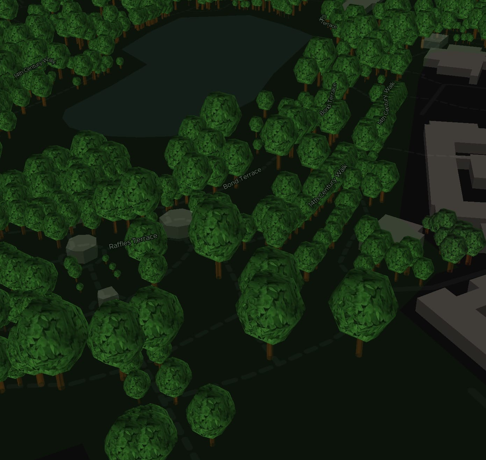
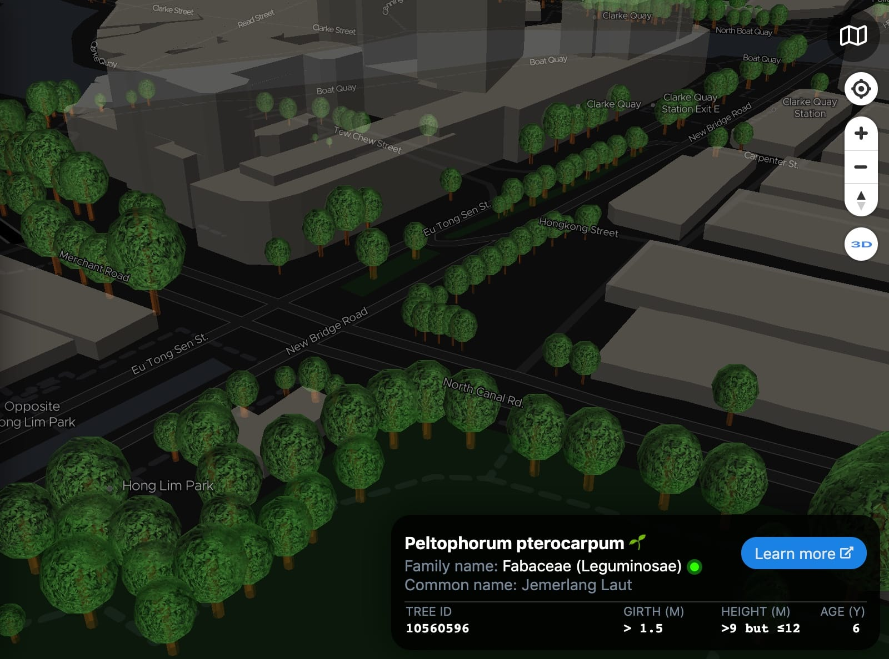

Next-level visualizations with ExploreTrees.SG
===

Last year, I [wrote about one of my most ambitious side project ever](/blog/2018/04/building-exploretrees-sg/), [ExploreTrees.SG](https://exploretrees.sg/). It was simply **breath-taking**.


Revisiting the masterpiece
---

I haven’t touch it since then. March this year, I *suddenly* had an itch to update the dataset and see if anything’s changed. I ran the script to fetch the latest data and [got this](https://twitter.com/cheeaun/status/1108010887984472069):


It’s a script that scrapes data from [National Parks Board](https://www.nparks.gov.sg/)’s [Trees.sg](http://trees.sg/), showing the total count of trees and species, and generates a GeoJSON file. From the count, I can compare the previous year’s number of trees to this year’s.

March last year, **564,266** trees. March this year, **564,678** trees. It increased by few hundreds!

Looking back previously, I attempted to render **all** trees on the map *in* the web browser, but failed due to exceedingly large file size and slow performance. I ended up uploading the data to [Mapbox Studio](https://www.mapbox.com/mapbox-studio/) as [vector tileset](https://docs.mapbox.com/help/glossary/vector-tiles/), to be served back on the map. It’s not a pure client-side solution, but a back-end supported one, which makes it no different from Trees.sg *except* it’s faster 🤷‍♂️.

Ultimately, I still want to achieve this pure client-side solution because I *love* to push the limits 😉.

A year has passed, technologies have improved, right?

I took a hard look at `trees-everything.geojson` which contains *all* trees data. It’s **197.6 MB** in size, which is *insane* for any web sites.

I came up with two ideas:

1. Give up on the GeoJSON format. Embrace normal JSON, remove all the keys and only store values. Convert, for example `{"id": "123", "height": 200}` into `["123", 200]`. Keys will be hardcoded somewhere else in the code.
2. Group *all* coordinates of trees into an array, technically like a line, and convert into [Encoded Polyline Algorithm Format](https://developers.google.com/maps/documentation/utilities/polylinealgorithm). It’s a lossy compression algorithm that allows you to store a series of coordinates as a single string. It’s lossy, with a precision of 5 decimal places, roughly [1 m in distance near equator](https://en.wikipedia.org/wiki/Decimal_degrees#Precision). For example, `[[1.27612,103.84744], [1.28333,103.85945]]` will be encoded into a shorter string: `wfxFouyxRal@ajA`.

Here’s the code:

```js
const data = JSON.parse(fs.readFileSync('data/trees-everything.geojson'));

const props = data.features.map(f => Object.values(f.properties).map(v => v === null ? '' : v));

const points = data.features.map(f => f.geometry.coordinates);
const line = polyline.encode(points);

const finalData = { props, line };
```

One is the  `props` variable storing all the values and one more `line` variable for the encoded polyline string.

The final result is a **37.7 MB** JSON file. That’s **524% smaller** than the GeoJSON file! 😱 After I compress the file with [gzip](https://en.wikipedia.org/wiki/Gzip), it becomes [**5.7 MB**](https://twitter.com/cheeaun/status/1108020569251827712), **3,466% smaller**! 😱😱


I think 5.7 MB is not bad. According to this [2017 article on SpeedCurve](https://speedcurve.com/blog/web-performance-page-bloat/), the average web page size was 3 MB and it predicted that by 2019, it will be 4 MB.

> According to the HTTP Archive, **almost 16% of pages today – in other words, about 1 out of 6 pages – are 4 MB or greater in size**.

That “today” was in 2017.

Compared to those sites that load 4 MB of *junk* plus few bytes of real content, I’m building an *awesome* site with 5 MB of useful data plus few hundred kilobytes of map tiles and JavaScript files.

Obviously at this point, I’m trying really hard to justify my actions 😅. I’m very excited that I manage to squeeze the bytes out of the dataset, but it’s still not small enough to be *lower* than the average web page size, so I try to deceive myself that I can do this for a good reason 😂.

As I look at the dataset, I noticed a few changes. I investigated and found that:

- Some flowering trees are gone, which I have no idea what happened until now.
- The API URL has changed from `https://imaven.nparks.gov.sg/arcgis/rest/services/maven/PTMap/FeatureServer/2/query` to `https://imaven.nparks.gov.sg/arcgis/rest/services/maven/Hashing_UAT/FeatureServer/0/query`.

The returned response has changed too. The most significant one is the **tree girth** data. It used to be precise measurements like 1.1 meters, but it became ranges like `0.0 - 0.5` and `> 1.5`. I don’t know the exact reason but I guess tree girths are pretty complicated stuff.

While re-fetching the data from scratch, I decided to restructure the grids. The fetching works by constructing a list of grids that will be passed as boundaries for the API calls. In other words, every box is equivalent to one API request. The previous one looks like this:


60 boxes, 60 API requests. The right and bottom side are sort of *neglected*, and luckily there are no trees data in those areas.

The new grid looks like this:


630 boxes, 630 API requests. Higher coverage over the whole Singapore *but* not the further southern parts. Fortunately, most trees are covered, as in the trees in other areas are not recorded by National Parks *yet*.

So, I got **all** the new data. I plotted them on the map with [Deck.gl](https://deck.gl/#/), a large-scale WebGL-powered data visualization library by Uber. It has better performance when it comes to large quantities of map features as I’ve tried in [my previous side project](/blog/2019/02/building-busrouter-sg/).

It was… **slow**. 😰

Nope, it’s not the fault of the library or Mapbox. It’s Chrome. My Chrome desktop browser was taking a *long* time decoding the JSON response. Turns out JSON parsing is pretty darn slow for super large files. It’s also a synchronous blocking operation. It took **more than 10 seconds** on my Macbook Air (2019). 😰

As I start to switch from my home-grown build scripts to [Parcel](https://parceljs.org/), even the Parcel build step fails with “Allocation failed - JavaScript heap out of memory” errors. I guess it tries to read the JSON file, probably doing something to it and Node keeps running out of memory 😅. I *could* fix the build step but let’s not get sidetracked here.

Maybe I need a faster `JSON.parse`. Maybe I could run it in a [web worker](https://developer.mozilla.org/en-US/docs/Web/API/Web_Workers_API/Using_web_workers), but it could be even slower due to the huge payload in message passing.

I had a different idea in mind, that is to use a *different* data format. Mapbox uses [Protocol buffers](https://developers.google.com/protocol-buffers/) for the map tiles. Deck.gl supports [some form of binary data](https://deck.gl/#/documentation/developer-guide/performance-optimization?section=on-using-binary-data) with an upcoming [RFC](https://github.com/uber/deck.gl/blob/master/dev-docs/RFCs/v7.x-binary/binary-data-rfc.md), which looks… quite complicated for me.

I ended up using [MessagePack](https://msgpack.org/) because:

1. Protocol buffers need types (`double`, `int64`, etc) and it’s quite troublesome to do a quick conversion from JSON. I’ve tried converting the GeoJSON file using [`Geobuf`](https://github.com/mapbox/geobuf) and the file size still seems bigger than MessagePack’s (with my combo compression ideas mentioned above).
2. Deck.gl’s binary data thing doesn’t seem to be stable *yet* and needs manual manipulation on the data.
3. MessagePack just works™.

There are two libraries available that can perform encoding and decoding of the MessagePack format:

- [msgpack-lite](https://www.npmjs.com/package/msgpack-lite) (listed on the official site)
- [@ygoe/msgpack](https://www.npmjs.com/package/@ygoe/msgpack)

I tried both and chose the latter because it’s [smaller in bundle size, according to Bundlephobia](https://bundlephobia.com/scan-results?packages=msgpack-lite,@ygoe/msgpack). I’m not choosing based on performance because I’ve confirmed that both are [way faster](https://twitter.com/cheeaun/status/1109818670711078912) than `JSON.parse`. Instead of more than 10 seconds, the data is decoded in **about 3 seconds** or less. The file size is smaller too, at around **30 MB** but after gzipped, it becomes the same as the gzipped JSON file at roughly **5 MB**. Too bad, I was hoping it'll be even smaller 😅.

In the previous dataset, I noticed a few discrepancies such as two or more trees, with different IDs, located at the *exact* same coordinates. This time, I try to clean it up and remove duplicates, partially with the hopes of reducing the file size.

It might sound silly but I’m actually performing *strict* comparison of *exact* coordinates. I’m not kidding that there's a few trees with *exactly* the same coordinates up to every single decimal place. Imagine two trees with the coordinates of 103.702059 longitude and 1.406719 latitude, with not a single difference in the decimals. 😅

Someone told me before that there could be a tree growing on top of another tree, but I quite… doubt it. 🤨

<video src="../videos/software/exploretrees-sg-chunk-command-remove-duplicate-trees.mp4" controls></video>

I checked the data, and could find other similarities in the name and species name. Okay, I could be wrong but I [decided to remove the potential duplicates](https://twitter.com/cheeaun/status/1110175312225030144) anyway, since this affects the map user interface. Two overlapping tree dots on a map poses quite a challenge, especially for visualization and user interactions. I have high suspicion that the original dataset actually comes from multiple datasets, via different agencies, which could explain this phenomenon.

The final gzipped file size remains the same 😅.

Pushing the limits, again
---

As the dataset is finalised with decent loading and decoding performance, I proceed to reimplement most of what I did in the first version using [Mapbox GL JS](https://docs.mapbox.com/mapbox-gl-js/api/), with Deck.gl instead.

In the original implementation with Mapbox GL JS:

- Every tree dot is styled via the [`circle`](https://docs.mapbox.com/mapbox-gl-js/style-spec/#layers-circle) layer.
- Pure client-side solution is impossible if there are [over 500,000 data points](https://docs.mapbox.com/help/troubleshooting/working-with-large-geojson-data/#even-bigger-data), thus the server-side solution via Mapbox Studio.
- Not all 500,000+ trees are rendered on the map in higher zoom levels because that’s how the vector tiles work; dropping or coalescing features on every zoom level if the limits on the tiles are exceeded.

Here’s a code example:

```js
map.addLayer({
  id: 'trees',
  type: 'circle',
  source: 'trees-source',
  'source-layer': 'trees',
  paint: {
    'circle-color': [
      'case',
      ['all', ['to-boolean', ['get', 'flowering']], ['to-boolean', ['get', 'heritage']]], 'magenta',
      ['to-boolean', ['get', 'flowering']], 'orangered',
      ['to-boolean', ['get', 'heritage']], 'aqua',
      'limegreen'
    ],
    'circle-opacity': [
      'case',
      ['to-boolean', ['get', 'flowering']], 1,
      ['to-boolean', ['get', 'heritage']], 1,
      .5
    ],
    'circle-radius': [
      'interpolate', ['linear'], ['zoom'],
      8, .75,
      14, ['case',
        ['to-boolean', ['get', 'flowering']], 3,
        ['to-boolean', ['get', 'heritage']], 3,
        1.25
      ],
      20, ['case',
        ['to-boolean', ['get', 'flowering']], 10,
        ['to-boolean', ['get', 'heritage']], 10,
        6
      ]
    ],
    'circle-stroke-width': [
      'interpolate', ['linear'], ['zoom'],
      11, 0,
      14, 1,
    ],
    'circle-stroke-color': 'rgba(0,0,0,.25)',
  },
});
```

For the new implementation with Deck.gl:

- The dots are rendered with [`ScatterPlotLayer`](https://deck.gl/#/documentation/deckgl-api-reference/layers/scatterplot-layer). May look the same as the former but the styles are written differently.

- Pure client-side solution becomes possible. The [documentation](https://deck.gl/#/documentation/developer-guide/performance-optimization?section=general-performance-expectations) quotes:

  > On 2015 MacBook Pros with dual graphics cards, most basic layers (like `ScatterplotLayer`) renders fluidly at 60 FPS during pan and zoom operations up to about 1M (one million) data items, with framerates dropping into low double digits (10-20FPS) when the data sets approach 10M items.

- **All** trees are rendered in **all** zoom levels.

The new code example:

```js
new MapboxLayer({
  id: 'trees',
  type: ScatterplotLayer,
  opacity: 1,
  radiusMinPixels: .1,
  radiusMaxPixels: 5,
  lineWidthUnits: 'pixels',
  getLineWidth: 1,
  getLineColor: [0,0,0,200],
  getRadius: (d) => (d.flowering || d.heritage) ? 100 : 3,
  getFillColor: (d) => {
    if (d.flowering && d.heritage) return colorName2RGB('magenta');
    if (d.flowering) return colorName2RGB('orangered');
    if (d.heritage) return colorName2RGB('aqua');
    return colorName2RGB('green');
  },
});
```

Yeap, shorter.

I have to create a new function called `colorName2RGB` to convert color names (`orangered`, `aqua`, etc) to RGB values in array form (`[R,G,B]`), because Deck.gl doesn’t support them. This function is surprisingly simple because it uses `canvas`’s magic [`fillStyle`](https://developer.mozilla.org/en-US/docs/Web/API/CanvasRenderingContext2D/fillStyle) property to convert a `CSS` color, instead of a lookup table, thanks to this [StackOverflow answer by *JayB*](https://stackoverflow.com/a/47355187/20838).

Everything became [crazy *smooth*](https://twitter.com/cheeaun/status/1114532995799478272).

<video src="../videos/web/exploretrees-sg-zoom-in-smooth-af.mp4" controls></video>

The reimplementation didn’t take long. There were some tiny differences in how the circle scales for different zoom levels but not significant enough for anyone to notice.

Deck.gl has yet again *amazed* me with its powerful features and performance. Honestly, I always get wowed every single time by how much I can achieve with this library! And I didn't stop there 😉.

This was my previous **failed** attempt:


It’s a failed attempt mainly due to performance. It was **too darn laggy** rendering *all* the 3D tree trunks! I also suspect that some girth measurements were wrong, which you could see that one huge hexagon in the image above, at Fort Canning Park. This was done with Mapbox GL JS’s 3D extrusion features.

This is my [second attempt](https://twitter.com/cheeaun/status/1114696975515963398), with Deck.gl:


Those orange dots are the tree trunks in 3D. Lets zoom in.


This attempt is about **3 to 4 times faster** in rendering *everything* 😱 (based on my perception). **But**, it still lags when panning around in higher levels 😢.

Ugh, I feel like I’m on roller coaster ride when things become fast, super fast, then slow again, then fast again, and then end up slow again 😖. Technically it’s my own fault. Repeatedly, I did try to make it fast and *then* purposely make it slow again. I have no idea why I keep doing this 😂

Anyway, I had an idea on how to make it fast 😏. I limit this 3D mode to higher zoom levels and then filter the list of trees based on the map’s geographical bounds. Like this:

```js
const bounds = map.getBounds();

const results = ... // magically filter the list of trees based on bounds

trees3DLayer.setProps({
  data: trees3Dify(results),
});
```

The returned value of `map.getBounds()` is the smallest bounds that encompasses the visible region of the map. Instead of rendering 500,000+ trees, it can be made to only render few thousands instead.

Basically this not only solves the performance problem, but also makes sense. There’s no point rendering 3D trees on lower zoom levels anyway since they’ll all look like small dots. Users still have to zoom in to see the 3D trunks in detail, which is the same reason why 3D buildings are only visible in higher zoom levels on maps like Google Maps and Apple Maps.

Thanks to this, it’s [fast again](https://twitter.com/cheeaun/status/1114833009289469952) 😬.

<video src="../videos/web/exploretrees-sg-3d-tree-trunks-no-lag.mp4" controls></video>

The right side is the Developer Tools Console, logging the number of 3D trees rendered every time the map is zoomed, panned or rotated. It’s quite noticeable that there’s completely no lag at all when panning around. The 3D trees outside of the bounds will only start rendering after the pan, zoom or rotate ends.

**Perfect**. What’s left for me is to finish up the remaining reimplementation, remove all the old code, choose a better color for these tree trunks and wrap up!


At first, I wanted to color the trunks as brown but it’s too dark and doesn’t contrast well with the dark map tiles. This explains why I choose brighter brown or orange as my first attempt. And then I changed the color to white because it’s still doesn’t *feel* right somehow…

Yes… 3D tree trunks look kind of weird, right?

I thought to myself, **what was I trying to do again?** What’s the purpose of the 3D renderings? Isn’t 2D enough for this visualization? I guess that drawing 3D trees on a map would be cool but didn’t really think much after that.

But what makes them look weird?

Oh! The tree [crowns](https://en.wikipedia.org/wiki/Crown_(botany))! It looks weird because it’s *incomplete*. Wait, the problem is that I don’t have the crown data, so how am I going to draw the tree crowns? Depending on the tree species or families, I might need to draw different shapes of crowns, which can be *a lot* of work 😅.

So I start to think, what’s the simplest form of a tree crown that is achievable? Of course, **another cylinder**.

I did a few [quick sketches](https://twitter.com/cheeaun/status/1119443171031703552) during my free time:


I have the height information of the trees, but it doesn’t necessarily mean the height of the trunks themselves. I could “chop off” the trunk to about 75% and leave the rest for the crown. The crown could take up 50% of the height so that it looks like it’s *covering* the trunk. As for the radius of the crown, I can roughly measure it based on the height as well. From my trials and errors, I found the sweet spot for the radius to be roughly 40% of the height.

Sounds like *complicated* math, but… **[voilà!](https://twitter.com/cheeaun/status/1114866910682681344)**


This is the moment when I felt that my efforts have finally becoming fruitful. Little did I know that the crowns actually make such a huge difference!

To be honest, I got super excited when this actually works. I tried to finish up the work and ensuring feature parity with the old implementation. It reached a point where it's [*almost* complete](https://twitter.com/cheeaun/status/1114919843541573632).

<video src="../videos/web/exploretrees-sg-3d-trees-almost-complete.mp4" controls></video>

I’ve also enabled [3D buildings](https://twitter.com/cheeaun/status/1115060661401182208), for a more *complete* picture.

<video src="../videos/web/exploretrees-sg-3d-trees-3d-buildings.mp4" controls></video>

…and [more photos](https://twitter.com/cheeaun/status/1115630822764105728)!


Look at those cute little trees! 😍


Nearby 3D buildings tend to give a pretty [realistic context](https://twitter.com/cheeaun/status/1115632732481019916) to the 3D trees around them. In a way, it feels like there’s a pattern on how these trees are planted based on the surrounding geography 🤔.


This image above shows one of the data mismatch cases, near Cecil Street, where the trees are no longer there and an interim food centre is built in this area.

Alright, I’m almost done. The 2D tree markers are working. Visualization filters work. 3D trees perform really well.

Just *one* thing left: **laggy** blue *marker highlighter* and tree information *hover cards*, as rendered on the videos above. On desktop browsers, when the mouse cursor hovers over a tree, the blue marker highlighter will appear around it, with the hover card popping out from the bottom right of the page. There’s a significant lag when the cursor moves across multiple trees on the map as the user interface is trying to keep up.


I tried three attempts.

My **first** piece of code was using the [`mousemove` event](https://docs.mapbox.com/mapbox-gl-js/api/#map.event:mouseover) from Mapbox GL JS. When the event is fired, a specific layer from the map can be queried and the marker or feature information can be extracted to be displayed as part of the hover card. The query is done by converting the pixel coordinates of the cursor to the actual map coordinates in latitude & longitude, and then find the nearest map feature from the coordinates. This operation is quite tedious — the `mousemove` event fires too often, there are way too many features under the cursor and every single call is blocking the UI thread, thus affecting the rendering speed of the marker highlighter and the hover card.

My **second** attempt was using Deck.gl’s powerful [picking engine](https://deck.gl/#/documentation/developer-guide/adding-interactivity), which uses something called the [Color Picking Technique](https://deck.gl/#/documentation/developer-guide/writing-custom-layers/picking):

> Rather than doing traditional ray-casting or building octrees etc in JavaScript, deck.gl implements picking on the GPU using a technique we refer to as "color picking". When deck.gl needs to determine what is under the mouse (e.g. when the user moves or clicks the pointer over the deck.gl canvas), all pickable layers are rendered into an off-screen buffer, but in a special mode activated by a GLSL uniform. In this mode, the shaders of the core layers render picking colors instead of their normal visual colors.

Honestly, I have no idea how this works. I roughly get it that the engine tries to pick the color under the cursor and somehow manage to find the relevant feature which matches the color?!? But how?

Anyway, I’ve tried it and this method doesn’t work too. Everything’s *still* slow 😭.

So, lo and behold my **third** attempt using a spatial index for points with a library called [`geokdbush`](https://github.com/mourner/geokdbush):

> A geographic extension for [kdbush](https://github.com/mourner/kdbush), the fastest static spatial index for points in JavaScript.
>
> It implements fast [nearest neighbors](https://en.wikipedia.org/wiki/Nearest_neighbor_search) queries for locations on Earth, taking Earth curvature and date line wrapping into account. Inspired by [sphere-knn](https://github.com/darkskyapp/sphere-knn), but uses a different algorithm.

I think it’s pretty cool because it’s written by [Vladimir Agafonkin](https://github.com/mourner), the creator of [Leaflet](https://leafletjs.com/).

Here’s a rough code snippet:

```js
const index = new KDBush(data, (p) => p.position[0], (p) => p.position[1]);
...
const nearestPoints = geokdbush.around(index, point.lng, point.lat, 1, radius);
```

The `geokdbush.around` method returns an array of the closest points from a given location in order of increasing distance. It has optional arguments to set custom maximum results, maximum distance in kilometers to search within, and even an additional function to further filter the results! 🤯

In fact, these methods are so useful that I also use it for filtering the rendering of the 3D trees based on the map bounds (in the beginning, for the `trees3Dify` call).

The result is [**insanely fast**](https://twitter.com/cheeaun/status/1116960702118318082). ⚡️

<video src="../videos/web/exploretrees-sg-super-fast-hovers.mp4" controls></video>

Even works in [3D mode](https://twitter.com/cheeaun/status/1116960752122777601):

<video src="../videos/web/exploretrees-sg-super-fast-hovers-3d.mp4" controls></video>

I’m quite satisfied with this.

But I think I can **do more**. 💪

Plus ultra
---

Initially I have an idea for getting a listing of all tree species mapped to their own crown shape patterns. I couldn’t find such list unfortunately 😭.

My research led me to few subjects like [tree crown classes](https://openoregon.pressbooks.pub/forestmeasurements/chapter/5-3-crown-classes/) and I especially like this diagram from [Structures of Forest](https://www.toppr.com/guides/science/forest-our-lifeline/structure-of-forest/):


These are the various crown shapes of trees and I think I only covered the “full-crowned” type, with blocky cylinders. The other crowns would be a bit difficult to model in 3D…

Similar to how the tree trunks are rendered, the tree crowns are rendered with deck.gl’s [SolidPolygonLayer](https://deck.gl/#/documentation/deckgl-api-reference/layers/solid-polygon-layer), which works like [PolygonLayer](https://deck.gl/#/documentation/deckgl-api-reference/layers/polygon-layer) but without strokes. Extrusion is enabled from the `extruded` option combined with z-indices of the coordinates. The circle shape is formed with [@turf/circle](https://turfjs.org/docs/#circle). Elevation is performed via the `getElevation` accessor.


This is **the basics**.

Creating complex polygons for all the different tree crowns would be too complicated for me, both computationally *and* mathematically 😵.

While developing this project, I’ve been following the updates on the then-upcoming [version 7.0 of Deck.g](https://github.com/uber/deck.gl/blob/master/CHANGELOG.md#deckgl-v70)l. The changes that caught my attention was the (re-)introduction of [`SimpleMeshLayer`](https://github.com/uber/deck.gl/issues/2890) and [`ScenegraphLayer`](https://github.com/uber/deck.gl/issues/2871), which allows the rendering of actual 3D models in formats such as [OBJ](https://en.wikipedia.org/wiki/Wavefront_.obj_file), [PLY](https://en.wikipedia.org/wiki/PLY_(file_format)) and [glTF](https://en.wikipedia.org/wiki/GlTF). This means… I can put *real* tree models on the map! 😱

Wait the minute, I don’t have a species-to-crown-type mapping yet, so rendering a super realistic full-crowned tree for every single tree would be kind of weird, especially for those tiny little trees. Even if I have the mapping, it would take a gargantuan effort for me to code the species-specific crowns for all 500,000+ trees, manage all the 3D model files, *and* tune the asset loading & map rendering performance at the same time!

There *has* to be some compromise here. I want to replace the cylinder tree crowns with something more realistic **but** cannot be *too* realistic. So it should be **semi-realistic**, right?

I read through the [documentation](https://deck.gl/#/documentation/deckgl-api-reference/layers/simple-mesh-layer) and noticed this interesting piece of code from the example:

```js
import {CubeGeometry} from 'luma.gl'
```

That’s one of scenegraph model nodes provided by [luma.gl](https://luma.gl/#/). Pretty neat.

They are like pre-made 3D objects that can be used like, as what it described, WebGL components. One of the geometries that I found is the [SphereGeometry](https://luma.gl/#/documentation/api-reference/geometry-nodes/sphere), which looks like what I need. Or perhaps, a sphere is what I think would be a better alternative than a cylinder, right? 🤔

Not only that I can create a sphere object with this, I can also apply a texture on it with the `texture` property for `SimpleMeshLayer`.

Here’s a code snippet:

```js
const treesCrownLayer = new MapboxLayer({
  id: 'trees-crown',
  type: SimpleMeshLayer,
  texture: document.getElementById('leaves'),
  mesh: new SphereGeometry(),
  ...
});
```

The `texture` property accepts one of these 3 types of value:

- A luma.gl `Texture2D` instance
- An `HTMLImageElement`
- A URL string to the texture image

So the `document.getElementById('leaves')` code above is a reference to an `img` element in the HTML page. I use this method to *preload* the image instead of lazy-load it during runtime.

As for the image, I *googled* and managed to sift through *hundreds* of images to find **one** “leaves” texture image from [Dim's environmental and architectural textures](https://opengameart.org/content/dims-enviromental-and-architectural-textures). Honestly, it’s not easy to find a *good* texture image at all 😂, but luckily there are existing available resources mostly for game development 😀.

Here’s the moment of truth 🤞:


**Oh my god, It works!!** 😱😱😱



For this image, I tried playing around with the number of vertices. If it’s reduced, the sphere will have less triangular faces and look less spherical. I kind of suspect that reducing the number of vertices might improve performance but doesn’t seem to affect much.

Anyway, before I get too happy with this result, there are few problems:

- The trees look a bit too dark, so might need some sort of lighting. Maybe use brighter colors too.
- The tree crown need to be “see-through”, to simulate the empty spaces between the leaves.
- The leaves on the crown are too big, especially when zoomed in. I’ll need to make them smaller.

Using [Affinity Photo](https://affinity.serif.com/en-gb/photo/) and [Affinity Designer](https://affinity.serif.com/en-gb/designer/), I made some adjustments from the original texture image (top left):


First, I select the dark areas between the leaves and make them alpha-transparent. To reduce the size of the leaves, I make the image bigger instead, by flipping it 3 times, creating a repeatable leaves image pattern.

The results:





Not bad. The leaves are smaller and it’s possible to see the tree trunk hiding *inside* the crown. 👀

As for the lighting, I use the new lighting effects system [introduced in deck.gl v7.0](https://medium.com/vis-gl/introducing-deck-gl-v7-0-c18bcb717457), particularly the [`AmbientLight`](https://deck.gl/#/documentation/deckgl-api-reference/lights/ambient-light) source and the new experimental [`SunLight`](https://deck.gl/#/documentation/deckgl-api-reference/lights/sun-light) source. `SunLight` is a variation of `DirectionalLight` which is automatically set based on a UTC time and the current viewport. In other words, it **simulates the sun** by calculating the sun position with a JavaScript library called [SunCalc](https://github.com/mourner/suncalc) (again, created by Vladimir Agafonkin, creator of Leaflet 🤩).

Coincidentally as I was [researching on how the code and formula work](https://www.aa.quae.nl/en/reken/zonpositie.html), I saw Vladimir [tweeting](https://twitter.com/mourner/status/1120748294190141440) about his tiny [900-byte function to calculate the position of the Sun](https://observablehq.com/@mourner/sun-position-in-900-bytes)! 😱 If I’m not mistaken, it’s like a simplified version of SunCalc.

Without further ado, I implemented them all, this way:

```js
const phaseColor = getPhaseColor(timestamp);
const ambientLight = new AmbientLight({
  intensity: phaseColor === 'dark' ? 1 : 1.5,
});
const sunLight = new SunLight({
  timestamp,
  intensity: phaseColor === 'dark' ? .5 : 2,
});;
const lightingEffect = new LightingEffect({
  ambientLight,
  sunLight,
});
treesCrownLayer.deck.setProps({
  effects: [lightingEffect],
});
```

The light intensities reduce when the sun phase is “dark” to simulate night time.

Before 🔅:


After 🔆:


Looks much better!

Here’s [a time-lapse of the sun lighting](https://twitter.com/cheeaun/status/1124981208427810816) on the trees, to show how the (sun) light direction changes based on time. Also, it’s not affected by user's local time and will always be in actual Singapore time, since the formula depends on location coordinates instead of time.

<video src="../videos/web/exploretrees-sg-sun-lighting.mp4" controls loop></video>

Unfortunately, the lighting transition from night to day and day to night is kind of abrupt for now. Just in case someone stays on the site for too long, I’ve also added a time interval to update the lighting every 10 minutes.

Along the way, I’ve added a few useful POIs (Points of Interest) that are [listed on NParks](https://www.nparks.gov.sg/gardens-parks-and-nature), which include these categories of places:

- Parks
- Community gardens
- Heritage roads
- Skyrise greenery

On their [site](https://www.nparks.gov.sg/gardens-parks-and-nature), it looks like this:


On ExploreTrees.SG:


Besides the POIs, I’ve also made the train stations and bus stops more prominent to guide navigation and exploration. These markers only appear on higher zoom levels as they are only useful in those levels and to prevent clutter on the map.

As a side quest, I took this chance to try out [lit-html](https://lit-html.polymer-project.org/) for the hover card, replacing the constant `innerHTML` layout-trashing (destroying and rebuilding the content on every hover event).

The final boss
---

Despite the fact that I’ve ticked off *all* the checkboxes in my todos for this project, there’s one problem that I ignore since the beginning of this exercise.

**It doesn’t work well on mobiles.** 😞

There are a few issues:

- MessagePack decoding crashes on Mobile Safari. When I try switch it to JSON format, the browser didn’t crash but it takes a significant amount of time to load. Either way, it’s a pretty bad user experience.
- Even after everything is loaded successfully, Mobile Safari will randomly crash after few minutes of panning and zooming on the map. I’ve tried asking a friend to try the site on an iPad, which I suspect has more memory and processing power than iPhone, yet the site still crashes 😭.
- The site doesn’t crash on Chrome Android but still kind of laggy. 🐌

Most-likely suspicion could be the **memory pressure**, as highlighted by Deck.gl’s [documentation on performance](https://deck.gl/#/documentation/developer-guide/performance-optimization):

> Modern phones (recent iPhones and higher-end Android phones) are surprisingly capable in terms of rendering performance, but are considerably more sensitive to memory pressure than laptops, resulting in browser restarts or page reloads. They also tend to load data significantly slower than desktop computers, so some tuning is usually needed to ensure a good overall user experience on mobile.

I guess loading a 5MB compressed file, which uncompresses into a 30MB file, that loads 500,000+ trees on a WebGL-powered 3D-rendered map is just… too much? 😝

I’ve tried dozens of ways to fix this, like:

- Reduce the number of layers on the map.
- Reduce the number of polygons on the map.
- Remove some features and code that might use a lot of memory.
- Apply micro-optimisations that I thought would help.
- Reduce number of trees by using cluster mode with [`supercluster`](https://github.com/mapbox/supercluster), which kind of defeats the purpose why I build this in the first place.

Nothing works. It’s pretty daunting 😩.

This is the only thing that blocks me from launching this new version of ExploreTrees.SG and I have to make the call.


After days of contemplating, I decided to *not* replace the version 1.0 of ExploreTrees.SG and instead, slot in the version 2.0 **together** with it. The old version 1.0 works fine and seems more stable on mobile browsers. The new version works fine on desktop browsers but *not* the iPad. I’m not sure about Android tablets so I’ll assume they’re slightly better or worse than iPad. 🤷‍♂️

On version 1.0, all the tree data are served from [Mapbox Studio](https://www.mapbox.com/mapbox-studio/), as vector [tilesets](https://docs.mapbox.com/studio-manual/reference/tilesets/). They are *partially* loaded based on zoom levels, so not everything is shown at once. This probably helps in reducing memory pressure, using less bandwidth, and having better performance.

On version 2.0, which I kept pushing the limits, **all** the trees data are loaded in the web browser, so there’s no more round trip to the server. Technically it’s pure client-side and uses a lot of bandwidth and all the power from the user’s machine to render everything nicely.

I needed a way to switch between the versions based on certain device capabilities.

There’s no way for me to detect the device's or browser’s ability to handle large memory pressure. There’s also no way to detect possible crashes on a web app *before* it could crash. User agent string detection won’t work here either.

Since there’s no reliable way to detect these conditions, I applied touch detection instead:

```js
const isTouch = 'ontouchstart' in window || navigator.msMaxTouchPoints;
const hqHash = /#hq/.test(location.hash);
const renderingMode = !hqHash && isTouch ? 'low' : 'high';
```

I made a few assumptions:

- Most modern mobile phones have touch screens.
- Older phones won’t be able to load the site anyway since it uses WebGL (sorry 🙇‍♂️).
- Even though iPad is quite powerful, it also has a touch screen so this detection will rule it out.
- The only exception would be desktop computers with touch screens.

I call version 2 as “High-quality mode”, and provide an option for users who are routed to version 1 to switch to this mode.


This option will reload the page and switch to version 2 by appending `#hq` to the URL. After that if the site crashes, the user can still go back to version 1.

To further optimise the performance of the site, I make good use of the `renderingMode` variable to conditionally enable or disable certain features on the map. I took one step ahead by applying [code splitting](https://parceljs.org/code_splitting.html) with dynamic imports. I extract all version 2 related dependencies into a separate bundle and load it asynchronously on the page.

```js
const {
  MapboxLayer,
  AmbientLight,
  SunLight,
  LightingEffect,
  ScatterplotLayer,
  SolidPolygonLayer,
  SimpleMeshLayer,
  SphereGeometry,
  msgpack,
  polyline,
  KDBush,
  geokdbush,
  circle,
  throttle,
} = await import('./hq.bundle');
```

Besides that, I did an interesting trick for the MessagePack data file. I realised that MessagePack doesn’t have an [official MIME type](https://github.com/msgpack/msgpack/issues/194). Even though I started using Parcel for bundling files, the site is still deployed to GitHub Pages via the [GitHub Pages Deploy Action](https://github.com/JamesIves/github-pages-deploy-action). This means gzip compression could only be available for certain file extensions.

For example, `.js` files will be served with gzip compression but not `.png` files. I tried using `.mp` extension for the MessagePack file and… it’s not compressed unfortunately 😟. Since the site traffic is also handled by Cloudflare, I looked through [the list of content types that Cloudflare will compress](https://support.cloudflare.com/hc/en-us/articles/200168396).

I needed a file format that… 

- Is whitelisted in the server's content type compression list, from either GitHub Pages or Cloudflare. I’m aware that [Netlify allows custom headers](https://www.netlify.com/docs/headers-and-basic-auth/) which may be able to set gzip headers, but I’m not moving the site there for now.
- Bypasses Parcel’s [intelligent asset handling](https://parceljs.org/assets.html). For example, if `.json` is used, Parcel will include the file content *into* the JavaScript bundle.
- Is not confusing for me to revisit in the future. If I use `.png`, which could work, the future me would be confused and wonder why it’s used for a non-image file 😅.

I tried pre-compressing the file into `.gz` but weird things just happen when trying to read the file in JS. 😅

In the end, I chose `.ico` because it’s one of the formats that is a (image) binary *and* can be gzip compressed at the same time. It is also rarely used, unlike normal image formats, which could prevent conflicts with other files. I could use `.ttf` or `.otf` extensions too but it could be confused with actual font files.

I named the file as `trees.min.mp.ico`, tested it and it works. 🤩

The launch and the aftermath
---

On [30 April 2019](https://twitter.com/cheeaun/status/1123053445546512384), I finally relaunched [ExploreTrees.SG V2](https://exploretrees.sg).


Despite all my effort rewriting the code and pushing the limits, I’m especially proud of the 3D trees. It feels like an **achievement-unlocked** moment for me. 🤩


It got [featured on Reddit /r/singapore](https://www.reddit.com/r/singapore/comments/bj0xze/my_friend_took_nparkss_data_and_built_a_site_for/), thanks to a friend 😉.


Feedback has been positive so far. I’m surprised that the conditional routing for Version 1 and 2 seems smooth enough that no one noticed it. 😝

A day after the launch, I [received a pretty interesting email](https://twitter.com/cheeaun/status/1123589545230880769) at 2 AM.


So this person asked me for my *advice* on creating a map for all **durian trees in Singapore**! I was reading this in the morning, had a good laugh and ignored it. 😂

It was Labor Day and there’s no work. In the afternoon, I had a hunch that this person might **not** be joking after all.

So, I did some research on durians, found a Wikipedia page on [List of *Durio* species](https://en.wikipedia.org/wiki/List_of_Durio_species), looked through the dataset and found **286 Durio species**! 😱


I didn’t know that there are durian trees in Singapore! Even more surprising, [durian](https://en.wikipedia.org/wiki/Durian) trees have [flowers](http://www.wildsingapore.com/wildfacts/plants/fruittrees/durio/zibethinus.htm)! 😱

The next logical step is to quickly load them up [on a map](https://gist.github.com/cheeaun/1d68f6acb589a30335e1c7c927153d18).


Looking at this, I was thinking to myself. Are there any other fruit trees in Singapore? I searched through the Internet and found a list of fruit tree species names. I was thinking of how to visualise the fruits on a map, maybe *still* colorful circles or fruit icons instead? There could be too many exotic fruits to be shown so maybe need to be filtered to only those “popular” ones?

Hmm, yeah… Lots of ideas, yet so little time.

From my experience in [building side projects](/blog/2016/01/building-side-projects/), it’s always good to hold on to an idea for some time before executing them. This time, I’ve already had **so much fun** rebuilding everything, squeezing every inch of the performance, and even modelling 3D trees on a map. Most importantly I manage to launch my [open-source](https://github.com/cheeaun/exploretrees-sg) work to the public before I got bored of it. 😆

This has been fun and I’ve learnt a lot.

So, till next time then. 😉