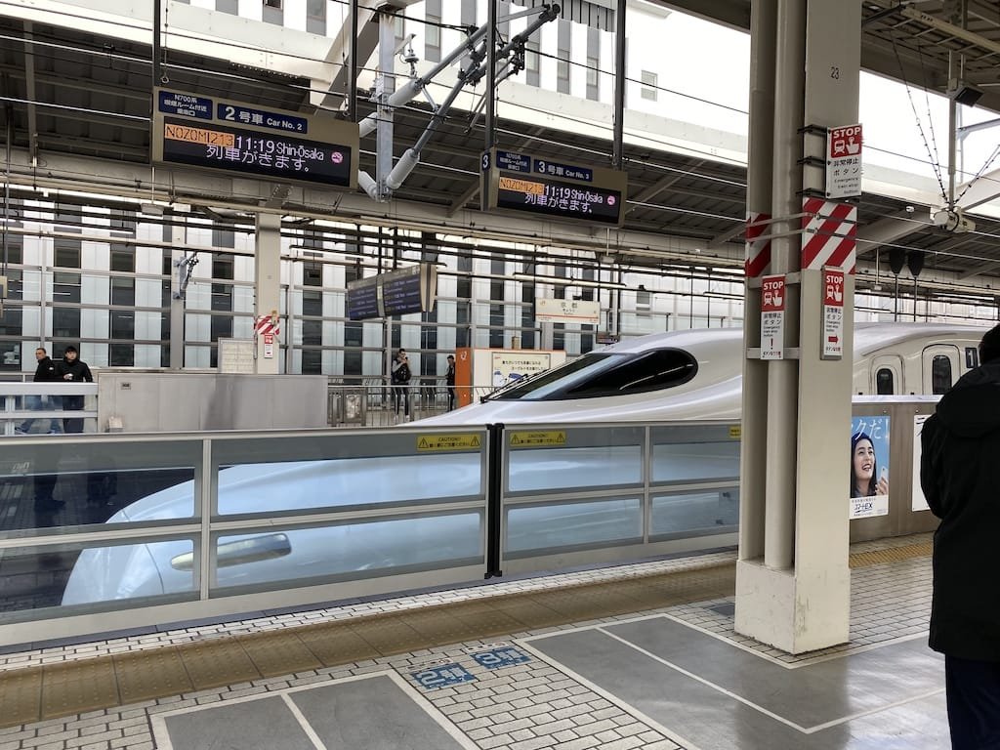

2019 in review
===

As per my previous year-in-reviews ([2018](/blog/2018/12/2018-in-review/), [2017](/blog/2017/12/2017-in-review/), [2016](/blog/2016/12/2016-in-review/), [2015](/blog/2015/12/2015-in-review/), [2014](/blog/2014/12/2014-in-review/)), I always start with the *little* things, now properly sectioned by month, as the list grows longer:

**January**

- Upgraded [from Pixel 1 to Pixel 3](https://twitter.com/cheeaun/status/1082251238505308160). [Sold](https://twitter.com/cheeaun/status/1088695854775431168) Pixel 1 at a later date. 📱
- I showed a [sneak peak](https://twitter.com/cheeaun/status/1083572537987031040) and [launched first and last bus arrival times page for BusRouter SG](https://twitter.com/cheeaun/status/1083989926805409792). 🚌🚀
- [Bought stickers](https://twitter.com/cheeaun/status/1084031032406401025) from [@mintlodica](https://twitter.com/mintlodica). 👾
- I showed [another](https://twitter.com/cheeaun/status/1085810382420099072) [sneak](https://twitter.com/cheeaun/status/1085831499448897536) [peek](https://twitter.com/cheeaun/status/1086255179895255045) of the [rebuilt version of BusRouter SG Visualization mini-site](https://twitter.com/cheeaun/status/1086540096046653440). 🚌🚀

**February**

- [Published](https://twitter.com/cheeaun/status/1092377184704987137) ‘[Building BusRouter SG](/blog/2019/02/building-busrouter-sg/)’. 🚌📝
- Launched [my BusRouter SG app on Google Play](https://twitter.com/cheeaun/status/1094513698498990081). 🚌🚀
- [Started working](https://twitter.com/cheeaun/status/1094513698498990081) at [SWAT](https://www.swatmobile.io/). 💼
- Received my [Blank t-shirts](https://twitter.com/cheeaun/status/1096607371051229184) from [Cotton Bureau](https://cottonbureau.com/blank). 👕
- [Created](https://twitter.com/cheeaun/status/1097488663166967809) a lightweight version of [Check Weather SG](https://checkweather.sg/). 🌦🚀

**March**

- [Gave](https://twitter.com/hj_chen/status/1105086475035504640) a [talk](https://www.engineers.sg/video/something-random-hack-tell-singapore--3241) at [Hack && Tell](https://www.meetup.com/Hack-Tell-Singapore/events/259328715/). 🗣
- I [did](https://twitter.com/cheeaun/status/1106787505058152449) gastroscopy and colonoscopy. 🏥
- [Showed](https://twitter.com/cheeaun/status/1108010887984472069) [sneak peeks](https://twitter.com/cheeaun/status/1109393820569894912) of my rebuilt [ExploreTrees.SG](https://twitter.com/cheeaun/status/1109393820569894912). 👀🌳
- [Acquired](https://twitter.com/cheeaun/status/1108219448530354176) a temporary Singapore IC. 🇸🇬
- [Bought](https://twitter.com/cheeaun/status/1110167041426677760) AirPods with Wireless Charging Case, and [discovered Mismatched AirPods](https://twitter.com/cheeaun/status/1111831446635708416). 💸
- [Made](https://twitter.com/cheeaun/status/1112205077769445376) a [Variable Font experiment on CodePen](https://codepen.io/cheeaun/full/pBojqj).

**April**

- [Acquired](https://twitter.com/cheeaun/status/1112722795505442821) my Singapore passport. 🇸🇬
- I started tweeting my “Highlights of the week”, starting on [6 April 2019](https://twitter.com/cheeaun/status/1114330090433683456). ✨
  - Transfered my .app domain to [Porkbun](https://porkbun.com/). 🐷
  - Registered for a free [TPG mobile plan](https://www.tpgmobile.sg/). 📲
  - Got a [Zipster](https://zipster.io/) card for public transport. 💳
- I [went](https://twitter.com/cheeaun/status/1116298644527828993) for a CT scan, and the [results](https://twitter.com/cheeaun/status/1121056665351049216) were gastritis and possibility of cystitis. 🏥
- [Discovered](https://twitter.com/cheeaun/status/1116591768227594240) that my BusRouter SG app is *featured* in a PDF file linked on [a wedding site](http://www.michaelyvonne.com/). 🌟🚌👰
- [Dribbbled](https://dribbble.com/shots/6317306-JS-Bacon) a JS Bacon. 🥓
- [Dribbbled](https://dribbble.com/shots/6346236-Unofficial-rebound-of-GopherCon-SG-2019-s-mascot) an unofficial rebound of the [GopherCon SG](https://2019.gophercon.sg/) mascot.
- Found [someone copied my side project](https://twitter.com/cheeaun/status/1119903415075655680). 😅
- [Received](https://twitter.com/cheeaun/status/1121667846159781888) some [GatsbyJS](https://www.gatsbyjs.org/) swag. 👕👾
- [Received](https://twitter.com/cheeaun/status/1122057996241006594) my citizenship letter. 🇸🇬
- Received my [Kickstarter-backed Ample power bank](https://www.kickstarter.com/projects/ample/ample-the-powerbank-reinvented).
- [Received](https://twitter.com/cheeaun/status/1122766094945505282) my Check Weather SG logo stickers from StickerMule. 👾
- I [showed](https://twitter.com/cheeaun/status/1114532995799478272) [even](https://twitter.com/cheeaun/status/1114833009289469952) [more](https://twitter.com/cheeaun/status/1114866910682681344) [sneak](https://twitter.com/cheeaun/status/1114919843541573632) [peeks](https://twitter.com/cheeaun/status/1115630822764105728) [of](https://twitter.com/cheeaun/status/1115632732481019916) [my](https://twitter.com/cheeaun/status/1116960752122777601) [side](https://twitter.com/cheeaun/status/1119423681053093888) [project](https://twitter.com/cheeaun/status/1119601127081644032) and finally [released ExploreTrees.SG 2.0](https://twitter.com/cheeaun/status/1123053445546512384) to the public. 👀🌳🚀

**May**

- [BusRouter SG got featured](https://twitter.com/cheeaun/status/1123403239657861121) on [Uber Visualization’s newsletter](https://mailchi.mp/uber/the-future-of-autonomous-requires-open-source-updates-on-deckgl-and-introducing-loadersgl). 🌟🚌
- Acquired a [surprised Pikachu sticker](https://twitter.com/cheeaun/status/1123957357644603392) from [@mushomushypeas](https://twitter.com/mushomushypeas). 😲👾
- ExploreTrees.SG [got featured on Reddit /r/singapore](https://www.reddit.com/r/singapore/comments/bj0xze/my_friend_took_nparkss_data_and_built_a_site_for/). 🌟🌳🇸🇬
- Attended the Citizenship Ceremony, and finally acquired my non-temporary Singapore IC. 🇸🇬
- [Updated my Repokèmon project](https://twitter.com/cheeaun/status/1127466481317335041) with new data and logo. 🚀
- I had my first try of [the Edge browser on Mac](https://twitter.com/cheeaun/status/1128602780988391431).
- Moved to a new electricity retailer, [Ohm](https://ohm.sg/) (Referral code: `OHMREF020CAB`). ⚡️
- I [went](https://twitter.com/cheeaun/status/1132150707983773696) to the last scheduled (monthly) appointment with my gastroenterologist. I got a few medication but don't need to schedule next one anymore. 🏥
- Applied for [GitHub Sponsors](https://github.com/sponsors). 🙏
- [Initiated printing and received some fine JavaScript stickers](https://twitter.com/cheeaun/status/1133575064631123968) from [GoodieSwag](https://www.goodieswag.com/). 👾

**June**

- I [coded](https://twitter.com/cheeaun/status/1134724162973343744) a [coffee cup](https://codepen.io/cheeaun/full/XwPPZe) with [Zdog](https://zzz.dog/), and it got [featured](https://twitter.com/desandro/status/1135578996958212096) in Dave DeSandro’s [Twitter Moment](https://twitter.com/i/events/1135000612356206592) and [CodePen collection](https://codepen.io/collection/DzdGMe/). Few days later, it got [featured](https://twitter.com/cheeaun/status/1139349629793787904) again on [CodePen’s blog](https://blog.codepen.io/2019/06/07/holy-zdog/). ☕️🐶🌟
- I [published](https://twitter.com/cheeaun/status/1135131956725800965) ‘[What I learned from printing custom swags](/blog/2019/06/what-i-learned-from-printing-custom-swags/)’. 📝 Also eventually found out [how much I spent on swags](https://twitter.com/cheeaun/status/1135385801750077440). 💸 And then it got [featured](https://twitter.com/DevRelAvocados/status/1135553677417209861) on [Developer Avocados 🥑 Weekly Issue 31](https://tinyletter.com/developeravocados/letters/developer-avocados-weekly-issue-31). 🌟
- I [realised](https://twitter.com/cheeaun/status/1137256967129391104) that my bus visualization work got listed on [deck.gl’s showcase page](https://deck.gl/#/showcases/). 🌟
- I [started using](https://twitter.com/cheeaun/status/1137969039068651521) my (credit) card for taking public transport, as part of the [SimplyGo initiative](https://simplygo.transitlink.com.sg/). 💳🚌🚆
- Hui Jing [gave me a whole stack of stickers](https://twitter.com/cheeaun/status/1138846945303154688) and a [CSSconf.EU](https://2019.cssconf.eu/) t-shirt. 🤩
- [Attended](https://twitter.com/cheeaun/status/1139339255526768640) [JSConf.Asia](https://twitter.com/cheeaun/status/1139723555371802629) [for 3 days](https://twitter.com/cheeaun/status/1140073228125163521) and managed to witness [Shawn’s talk](https://twitter.com/cheeaun/status/1139736245171445766), [Thai’s talk](https://twitter.com/cheeaun/status/1140077866798813184) (for the 2nd time), and [Laurie’s talk](https://twitter.com/cheeaun/status/1140188310465368064). Best of all, I finally [met Cristian](https://twitter.com/kentaromiura/status/1140207688111947776) in real life (known since the [MooTools](https://mootools.net/) days 😏). 🎟🐄

**July**

- I [manage to scrape all bus arrival timings](https://twitter.com/cheeaun/status/1147749207614185479) for [5,000+ bus stops in Singapore](https://twitter.com/cheeaun/status/1147749351424323584). 🚌
- [Published](https://twitter.com/cheeaun/status/1148966594090958850) ‘[Next-level visualizations with ExploreTrees.SG](/blog/2019/07/next-level-visualizations-exploretrees-sg/)’. 📝🌳🇸🇬
- [Received the Pusheen/popeen stickers](https://twitter.com/cheeaun/status/1150617297037303809). 👾
- JinGen [gave me a Chope card](https://twitter.com/cheeaun/status/1152503535562477569). 💳
- [Donated](https://twitter.com/cheeaun/status/1154699078480977920) to [Parcel](https://opencollective.com/parcel/?referral=6007), and [received a sticker](https://twitter.com/cheeaun/status/1163019983565103105)! 💸
- [Performed](https://twitter.com/cheeaun/status/1155042272855019520) [a few experiments](https://twitter.com/cheeaun/status/1155421740509491200) on live bus locations. 🚌

**August**

- [Co-organized](https://twitter.com/cheeaun/status/1163035637097697281) [Geek Brunch SG](https://geekbrunch.sg/) on [18 August](https://www.facebook.com/events/880713038963304/). 💪 I showed off my first phone in [Kai’s “interview”](https://www.youtube.com/watch?v=UouCCG-hp_I). 😎📱
- Took [a small step venturing](https://twitter.com/cheeaun/status/1164180903817383936) into [custom-made amigurumi’s](https://twitter.com/cheeaun/status/1164180922578558977). 🧸
- Started using [Notion](https://www.notion.so/?r=bd9643199e90414f968541a65a96ae4b) (referral link) seriously and [revealed my travel plan document](https://twitter.com/cheeaun/status/1165246168030310400) to the public. 📑
- [Migrated](https://twitter.com/cheeaun/status/1165271949544542208) from `bash` to `zsh`, in preparation for [macOS Catalina upgrade](https://www.theverge.com/2019/6/4/18651872/apple-macos-catalina-zsh-bash-shell-replacement-features), together with [Hyper](https://hyper.is/). 🐚
- I bragged about my [water-repellent umbrella(s)](https://twitter.com/cheeaun/status/1166185824301412353). ☔️

**September**

- Attended [JSConf Korea](https://twitter.com/cheeaun/status/1168691841341906945). 🎟🇰🇷
- [Received](https://twitter.com/cheeaun/status/1175357736894074880) my [Revolut](https://www.revolut.com/en-SG) card. 💳
- Compiled [a list of tech and design related conferences in Asia](https://twitter.com/cheeaun/status/1176324054548008960). 🚀
- [Received](https://twitter.com/cheeaun/status/1177798620327768065) my [TransferWise](https://transferwise.com/sg/borderless/card) card. 💳
- Received my [Kickstarter-backed Passport Go](https://www.kickstarter.com/projects/zendure/passport-go-worlds-first-travel-adapter-w-gan-technology). 💸
- Started playing [Mario Kart Tour](https://mariokarttour.com/en-US). 🏎
- [Thanks to Cloudflare](https://twitter.com/cheeaun/status/1177801526279979008), Check Weather SG becomes [one of the first sites to support HTTP/3](https://blog.cloudflare.com/http3-the-past-present-and-future/). ⚡️

**October**

- [Upgraded](https://twitter.com/cheeaun/status/1181533290169126912) to [macOS Catalina](https://www.apple.com/sg/macos/catalina/). 🏔
- [Attended](https://twitter.com/cheeaun/status/1185409799913168902) [Geekcamp Singapore](https://geekcamp.sg/). 🎟
- [Got my hands](https://twitter.com/cheeaun/status/1186259805989564416) on the new [iPhone 11 Pro](https://www.apple.com/sg/iphone-11-pro/). Ultra Wide camera is my [favourite feature](https://twitter.com/cheeaun/status/1188038199387410432). 📱📷
- [Finally approved](https://twitter.com/cheeaun/status/1188042393653661696) for [GitHub Sponsors](https://github.com/sponsors/cheeaun)! Got [my first sponsor(s) too](https://twitter.com/cheeaun/status/1188772496322875392)! 💰
- [Bought a bunch of NFC stickers](https://twitter.com/cheeaun/status/1189172509934899201) and did some [cool automations](https://twitter.com/cheeaun/status/1189428575931269120) with the iOS [Shortcuts](https://support.apple.com/en-sg/guide/shortcuts/welcome/ios) app. 💸
- [Bought](https://twitter.com/cheeaun/status/1189400589047779329) [AirPods Pro](https://www.apple.com/sg/airpods-pro/). Yeah, [I know](https://twitter.com/cheeaun/status/1191264676211908614). 💸

**November**

- [Bought](https://twitter.com/cheeaun/status/1198181851858231296) [Tile Stickers](https://www.thetileapp.com/en-us/store/tiles/sticker) (4-pack). 💸
- Bought [Nuud](https://nuudcare.com/) (deodorant), as [recommended by Charis](https://twitter.com/charis/status/1156576254319038467). 💸
- [Attended](https://twitter.com/cheeaun/status/1200621968040480769) [JSConf Japan](https://jsconf.jp/2019/). 🎟

**December**

- [Co-organized](https://twitter.com/supersillyhack/status/1205687964337983489) [Super Silly Hackathon](https://supersillyhackathon.sg/). 😎
- [Bought](https://twitter.com/cheeaun/status/1206093031025201152) the [Molecule Cardholder from Pioneer](https://pioneercarry.com/products/molecule-cardholder). 💸
- Spotted [a very familiar-looking map example](https://twitter.com/cheeaun/status/1207879909604872199). 👀🌟
- [Got my hands](https://twitter.com/cheeaun/status/1208003457883394053) on Asia's first numberless card, [GrabPay Card](https://www.grab.com/sg/pay/card/grabpay/). 💳
- [Witnessed](https://twitter.com/cheeaun/status/1210073835233398784) the ‘Ring of Fire’ annular solar eclipse. ☀️🌑
- [Received](https://twitter.com/cheeaun/status/1210533829011628032) my Kickstarter-backed [VERYKAL umbrella](https://www.kickstarter.com/projects/1093494147/the-japanese-umbrella-thats-lighter-than-your-iphone). ☂️

📊 Statistically, I attended **4 conferences**, gave **1 talk**, co-organized **2 events**, and re-launched **4 existing side projects**. My work got *featured* **7 times**. I was [asked for directions](https://twitter.com/search?q=%23askdirection%20from%3Acheeaun&src=typed_query&f=live) (by others) **13 times** this year. I [tweeted](https://twitter.com/search?q=Highlights%20from%3Acheeaun&src=typed_query&f=live) **31 “Highlights of the week”** since April.

On a slightly more personal side, I had **5 haircuts** and **4 dental** appointments.

[**7 Kopi.JS meetups**](https://github.com/kopijs/kopi.js/issues?q=is%3Aissue+is%3Aclosed+label%3A2019) were held. After running for 6 years, our [50th milestone](https://twitter.com/cheeaun/status/1122057996241006594) was on [27 April 2019](https://github.com/KopiJS/kopi.js/issues/74). ☺️

Fukuoka & Seoul
---

I was planning to attend [JSConf Korea](https://2019.jsconfkorea.com/) on September in Seoul for perhaps 3 to 4 days, but I find it too *wasted* to stay for such a short duration. I haven’t travelled out for *more* than a year, since [June 2018](/blog/2018/12/2018-in-review/), so I *really* need a longer vacation.

Seoul is a fine city, despite that it's not quite a solo-traveller friendly place in my opinion. I’m also not a K-pop or K-drama fan, so I don’t really get the *hype*. Besides, I realised that the weather is not going to be great around that time. The forecast showed that it’ll be hot and rainy, two of the most unfavourable conditions for travellers. 😅♨️🌧

At the same time, I also had plans to attend [WebConf.Asia](https://2019.webconf.asia/) in Hong Kong and figured that I wouldn’t have enough annual leaves to visit Japan. Yeah, I really miss going to Japan ever since my last visit on [July 2017](/blog/2017/12/2017-in-review/), so it’s been 2 years.

So, I decided to take a detour. I’ve heard good things about Fukuoka, I’ve never been there, and it’s geographically the nearest city to South Korea.

Two days before my flight, there were [reports of flood](https://www.straitstimes.com/asia/east-asia/japan-orders-240000-to-evacuate-over-flood-landslide-fears) [in the Fukuoka prefecture](https://www.straitstimes.com/asia/east-asia/900000-evacuated-two-dead-in-japan-flood-chaos). 😅

On [August 31](https://twitter.com/cheeaun/status/1167482125374722048), I departed from Singapore to [Fukuoka Airport (FUK)](https://foursquare.com/v/%E7%A6%8F%E5%B2%A1%E7%A9%BA%E6%B8%AF-fukuoka-airport-fuk/4b5662c7f964a520370e28e3).

The airport is surprisingly very near the city centre. It took like roughly 22 minutes, including walking and waiting time. In fact, most of the time taken is during the shuttle bus ride between the International Terminal and the Domestic Terminal. It took up to [14 minutes](https://twitter.com/cheeaun/status/1168375307335688194) just to switch between terminals 😅. I had to ride the shuttle because the Fukuokakuko subway station is at the Domestic Terminal.

Anyway, Fukuoka was… hot. 😰 No rain, no flood, fortunately. 😌

I finally got to try the [Suica express transit mode](https://support.apple.com/en-us/HT207154) with my iPhone, where the card is inside the Wallet app, and got [super surprised that it works](https://twitter.com/cheeaun/status/1167594070408957952) even when the iPhone is not awake!

I’ve also got to try [Google Maps AR](https://www.theverge.com/2019/8/8/20776247/google-maps-live-view-ar-walking-directions-ios-android-feature) for walking directions, which seems to work… but I don’t quite feel right holding my phone around pointing at the streets and buildings. 😅

I stayed for 2 nights and manage to visit these places:

- [Fukuoka Castle Ruins](https://foursquare.com/v/%E7%A6%8F%E5%B2%A1%E5%9F%8E%E8%B7%A1/4b69051af964a5201d972be3)
- [Ohori Park](https://foursquare.com/v/%E5%A4%A7%E6%BF%A0%E5%85%AC%E5%9C%92-ohori-park/4b5bff0af964a520952029e3) — didn’t explore the whole park because I sweated too much.
- [Canal City Hakata](https://foursquare.com/v/%E3%82%AD%E3%83%A3%E3%83%8A%E3%83%AB%E3%82%B7%E3%83%86%E3%82%A3%E5%8D%9A%E5%A4%9A-canal-city-hakata/4b593dcbf964a520b08228e3)
- [Kushida Shrine](https://foursquare.com/v/%E6%AB%9B%E7%94%B0%E7%A5%9E%E7%A4%BE/4b68da16f964a5201b902be3)
- [Tenjin Central Park](https://foursquare.com/v/%E5%A4%A9%E7%A5%9E%E4%B8%AD%E5%A4%AE%E5%85%AC%E5%9C%92-tenjin-central-park/4b67aa98f964a5201d5a2be3)
- [Fukuoka Tower](https://foursquare.com/v/%E7%A6%8F%E5%B2%A1%E3%82%BF%E3%83%AF%E3%83%BC-fukuoka-tower/4c5647082308be9a02bb566c)

Coincidentally, I got a chance to attend an event called [Fukuoka Freedom Night Market](https://www.fukuoka-now.com/en/event/fukuoka-freedom-night-market-2019/) taking place at Seiryu Park on Fridays, Saturdays and Sundays.

On [September 2](https://twitter.com/cheeaun/status/1168340991595560960), I flew to [Gimpo International Airport Domestic Terminal](https://foursquare.com/v/%EA%B9%80%ED%8F%AC%EA%B5%AD%EC%A0%9C%EA%B3%B5%ED%95%AD-%EA%B5%AD%EB%82%B4%EC%84%A0%EC%B2%AD%EC%82%AC/4b8c4178f964a520dac632e3) with a stopover at the [Gimhae International Airport Domestic Terminal](https://foursquare.com/v/%EA%B9%80%ED%95%B4%EA%B5%AD%EC%A0%9C%EA%B3%B5%ED%95%AD-%EA%B5%AD%EB%82%B4%EC%84%A0/4ba95793f964a5206c203ae3) in Busan. Yeap, instead of the mainstream [Incheon Airport](https://www.airport.kr/ap/en/index.do), this is a partial “international” flight from Fukuoka to Busan and domestic flight from Busan to Gimpo. In Busan, it’s just a [5-min walk](https://twitter.com/cheeaun/status/1168375307335688194) (200m) between the international and domestic terminals.

I’ve been thinking of trying out this airport ever since my last visit to Seoul [in 2018](/blog/2018/12/2018-in-review/), because Gimpo Airport is actually [nearer](https://www.coexcenter.com/directions-map-airport-2/) to the city centre than Incheon Airport.

The diagram above shows the distance between both airports and [COEX](https://www.coexcenter.com/), the location for JSConf Korea.

In 2018, it took almost one and a half hour to reach [Myeong-dong Station](https://foursquare.com/v/%EB%AA%85%EB%8F%99%EC%97%AD/4b78f865f964a520bfe72ee3) from Incheon Airport. This time, it took 1 hour to reach [Seolleung Station](https://foursquare.com/v/%EC%84%A0%EB%A6%89%EC%97%AD/4b13dda4f964a520dd9923e3) from Gimpo Airport. Despite being smaller than Incheon, Gimpo Airport is not bad at all. The immigration and customs procedures are also much faster. ⚡️

Unlike last time, I stayed in the Gangnam area at the southern side of Seoul instead. Closer to the conference location. 😎

I attended the conference on [September 3](https://twitter.com/cheeaun/status/1168691841341906945), with my ex-colleague. Also met [Hui Jing](https://twitter.com/hj_chen), [Thomas](https://twitter.com/serrynaimo), and [flaki](https://twitter.com/slsoftworks) (István Szmozsánszky) there too!

This is my [first time](https://www.instagram.com/p/B18vb7JHJYY/) listening to Korean-language tech talks, where I could understand it by [using the translator device](https://twitter.com/cheeaun/status/1168726082373091334) that **surprisingly works pretty darn well**.

There was a lot of South Korean engineers (duh) and the [talks](https://twitter.com/cheeaun/status/1168693763570405378) [were](https://twitter.com/cheeaun/status/1168760333722218496) [great](https://twitter.com/cheeaun/status/1168766102173696001). The sponsor booths were super amazing with lots of *crazy* swags! Everyone can scan the QR code, fill up a survey form and get free swags! Too bad some of the booths are Korean-only, else I could have [gotten *more* bags of swags](https://twitter.com/cheeaun/status/1168725476971442178) 😅 There were [JavaScript](https://twitter.com/cheeaun/status/1168726304436285440) [bakery cookies](https://www.flickr.com/photos/cheeaun/48730789562/in/album-72157710833974253/), [generative art displays](https://twitter.com/cheeaun/status/1168739595636203520), [wet wipes](https://twitter.com/cheeaun/status/1168754141314740224), [socks](https://www.flickr.com/photos/cheeaun/48730791412/in/album-72157710833974253/), [phone cables](https://www.flickr.com/photos/cheeaun/48730791602/in/album-72157710833974253/), [wireless chargers](https://www.flickr.com/photos/cheeaun/48730612726/in/album-72157710833974253/) and… [*my* stickers](https://twitter.com/cheeaun/status/1168821699539652608). 😏

**Behold** the [swags](https://twitter.com/cheeaun/status/1168822515000471553): 🤩

The next few days, I did my own touristy stuff and visited:

- [Samsung d'light](https://foursquare.com/v/%EC%82%BC%EC%84%B1-%EB%94%9C%EB%9D%BC%EC%9D%B4%ED%8A%B8/4d9288fd7b1960fca39f2540) — 3-floor electronics store showcasing Samsung products
- [Lotte World Mall](https://foursquare.com/v/%EB%A1%AF%EB%8D%B0%EC%9B%94%EB%93%9C%EB%AA%B0-lotte-world-mall/543df83b498e646d155c4d72)
- [Seoul Sky](https://foursquare.com/v/seoul-sky/58e1d87a03cf2507c4bec0fa)
- [Seokchon Lake](https://foursquare.com/v/%EC%84%9D%EC%B4%8C%ED%98%B8%EC%88%98-%EB%8F%99%ED%98%B8-seokchon-lake--east/4cba9e877148f04d4dddddab)
- [Mangwon Market](https://foursquare.com/v/%EB%A7%9D%EC%9B%90%EC%8B%9C%EC%9E%A5/4bae2adaf964a520b98c3be3)
- [Figure Museum W](https://foursquare.com/v/figure-museum-w/54fab8c8498ed0af63e9a825)

Note that the weather was kind of warm and sometimes it rains quite heavily, making it *slightly* difficult for me to go around places.

But at least I get to [see two sheep](https://www.instagram.com/p/B2CF94gng7a/), thanks to [Thanks Nature Cafe](https://foursquare.com/v/thanks-nature-cafe/4b6e7161f964a520a4bd2ce3). 🐑🐑

While resting in my hotel room, when there are occasional downpours due to a [passing typhoon](https://www.straitstimes.com/asia/east-asia/south-korea-surveying-damage-from-powerful-typhoon-lingling), I also found this pretty [cool South Korean TV show](https://twitter.com/cheeaun/status/1169503136278597632) that shows [people trying to code in “Scratch”](https://twitter.com/cheeaun/status/1169504951346716672), which later I [found out](https://twitter.com/sujinleeme/status/1169506347286585344) that it’s a site called [PlayEntry (엔트리)](https://playentry.org/).

On [September 6](https://twitter.com/cheeaun/status/1169853049310859264), I flew back to Fukuoka via Busan. Yeap, this is a double round-trip, SIN ⇄ FUK and FUK ⇄ PUS ⇄ GMP.

I stayed for 2 nights, visited the [Fukuoka Asian Art Museum](https://foursquare.com/v/%E7%A6%8F%E5%B2%A1%E3%82%A2%E3%82%B8%E3%82%A2%E7%BE%8E%E8%A1%93%E9%A4%A8-fukuoka-asian-art-museum/4b5e5842f964a5209a8a29e3), eat ramen at [Nagahama Number One](https://foursquare.com/v/%E9%95%B7%E6%B5%9C%E3%83%8A%E3%83%B3%E3%83%90%E3%83%BC%E3%83%AF%E3%83%B3-%E7%A5%87%E5%9C%92%E5%BA%97/4b5ae180f964a52091d828e3), eat sushi at [Uobei](https://foursquare.com/v/%E9%AD%9A%E3%81%B9%E3%81%84/50c37063c84c4ba0bc7cc10a), and eat ramen again at [Ramen Unari](https://foursquare.com/v/%E3%83%A9%E3%83%BC%E3%83%A1%E3%83%B3%E6%B5%B7%E9%B3%B4-%E4%B8%AD%E6%B4%B2%E5%BA%97/4ed772906da14054c2b129c0).

On September 8, I took the bus from [Hakata Bus Terminal](https://foursquare.com/v/博多バスターミナル-hakata-bus-terminal/4b6b9f03f964a5200d132ce3) to the [International Terminal](https://foursquare.com/v/国際線ターミナル-international-terminal/4b63806bf964a520e17e2ae3), instead of the subway. It took 22 minutes, including waiting and walking time, so roughly the same duration when I first arrive in Fukuoka, taking the shuttle bus at the airport and then switch to the subway.

I [flew back](https://twitter.com/cheeaun/status/1170498283975766017) and arrived in Singapore [46 minutes earlier](https://twitter.com/cheeaun/status/1170593887204691969) than scheduled. It feels like a very short trip even though it’s actually 9 days. Maybe next time I should revisit when the weather is nice and there’s no typhoon. 🤷‍♂️

My observation notes:

- **Seoul**
  - [Lotteria](https://en.wikipedia.org/wiki/Lotteria) is like the KFC/McD of Seoul.
  - [Naver](https://www.naver.com/) app tells you exactly which door (e.g.: 4-1) to stand at the train station so that you can find your path faster on the next station. Unfortunately the app always loose its state on iOS when closing and reopening it.
  - Fire extinguishers are everywhere. Train stations have masks and stuff in case of fire or incidents.
- **Fukuoka**
  - For public buses, the entrance is the middle (rear?) door instead of the front door. The front door is the exit instead. So, after entering, it’s better to move near the front door so that you can easily get out of the bus. 🤔
  - Tap the card twice when boarding and alighting the public buses. If I’m not mistaken, tapping out is not needed in Tokyo. 🤔

The stats:

- 121 Swarm check-ins.
- 21 Instagram posts.
- [350 photos and 17 videos](https://www.flickr.com/photos/cheeaun/albums/72157710833974253/page4) on Flickr.

Tokyo, Kyoto & Osaka
---

As I mentioned, I had plans to attend [WebConf.Asia](https://2019.webconf.asia/) in Hong Kong. Due to unforeseen circumstances, it got [postponed](https://twitter.com/webconf_asia/status/1181870706595975168) to next year 2020.

So… with immediate effect, I changed my plans and got myself a ticket to [JSConf Japan](https://jsconf.jp/2019/)! Okay, I stated that I missed Japan, went to Fukuoka, and then… going to Japan again(?) 😂

The conference is held at a pretty interesting location called [3331 Arts Chiyoda](https://foursquare.com/v/3331-arts-chiyoda/4b626afcf964a520d2462ae3) in Tokyo. Tokyo is a great city but I’ve been there for like 3 times, so it’s time for me to explore other cities in Japan. Fukuoka is now checked off my list, so where’s next? 😉

On [November 29](https://twitter.com/cheeaun/status/1200200321382768640), I flew to [Haneda Airport](https://foursquare.com/v/%E5%9B%BD%E9%9A%9B%E7%B7%9A%E3%82%BF%E3%83%BC%E3%83%9F%E3%83%8A%E3%83%AB-international-terminal/4b6d99b8f964a5203e7f2ce3) and [checked in](https://twitter.com/cheeaun/status/1200324927204646912) at a [robots hotel](https://foursquare.com/v/%E5%A4%89%E3%81%AA%E3%83%9B%E3%83%86%E3%83%AB%E6%9D%B1%E4%BA%AC-%E6%B5%9C%E6%9D%BE%E7%94%BA/5adb018a67a9fe39677c2fed), called [Henn na Hotel](https://www.h-n-h.jp/en/). It’s pretty cool with the human robots in the lobby. They stare at people and talked, but I only need to interact with the two screens in fact; one for check-in, another for check-out. 😂

The weather was *perfect*. I wanted a cold weather so much because my previous travels have always been in the summer.

It's [5° Celcius](https://www.flickr.com/photos/cheeaun/49211309327/in/album-72157712178437106/). I was under-dressed 🥶. It’s fine. Sometimes it drops down to [4° Celcius](https://www.flickr.com/photos/cheeaun/49210601993/in/album-72157712178437106/) but reported as 1° Celcius (RealFeel©) by [AccuWeather](https://www.accuweather.com/).

Oh well, the conference starts at 12 noon so I had enough time to explore around in the [morning](https://twitter.com/cheeaun/status/1200588131793133568).

I also took this chance to visit a very distinct landmark from [3-gatsu no Lion](https://myanimelist.net/anime/31646/3-gatsu_no_Lion) (March comes in like a lion), the Chuo Ohashi Bridge.

I attended JSConf JP for [two](https://twitter.com/cheeaun/status/1200621968040480769) [days](https://twitter.com/cheeaun/status/1200947358999220225). There are 3 rooms and 2 of them looks like basketball courts. 🏀

Honestly speaking, the whole experience felt very comfortable this time, compared to *all* the previous conferences I attended. Maybe because I just hang out in the **hallway track** most of the time. 😝

I met the usual *suspects*; [Hui Jing](https://twitter.com/hj_chen), [Thomas](https://twitter.com/serrynaimo), and [flaki](https://twitter.com/slsoftworks). Surprised to see [Thai](https://twitter.com/dtinth) as well. Met up at izakaya restaurant with [Guillermo Rauch](https://twitter.com/rauchg), [Naoyuki Kanezawa](https://twitter.com/nkzawa), [Henry Zhu](https://twitter.com/left_pad), Garland, Thomas and one guy who I can’t remember the name 🙏. Hanged [out](https://twitter.com/cheeaun/status/1200992841360478208) for [lunch](https://www.flickr.com/photos/cheeaun/49210604023/in/album-72157712178437106/) with flaki and [Jennifer Wong](https://twitter.com/mybluewristband). On the second day, for some reason, spent **hours** talking with Henry, Thai, Garland and [Dominic Tarr](https://twitter.com/dominictarr). [Left some of my stickers](https://twitter.com/cheeaun/status/1200989476777938944) near the [`npm` stickers](https://twitter.com/cheeaun/status/1200990242104213505). Managed to see [Sacha Greif](https://twitter.com/SachaGreif), [Jan Lehnardt](https://twitter.com/janl), [Yosuke Furukawa](https://twitter.com/yosuke_furukawa) and [Eiji Kitamura](https://twitter.com/agektmr). Said ‘hi’ to [Mariko Kosaka](https://twitter.com/kosamari)! After the conference, [hanged out again](https://www.flickr.com/photos/cheeaun/49211312037/in/album-72157712178437106/) with whole bunch of folks and spoke with [Lena Morita](https://twitter.com/mirka) and [Maria Clara](https://twitter.com/olarclara).

At the end of the day, I was totally spent. 😵

On the next day, I set out to take my first ever Shinkansen ride to [Kyoto](https://twitter.com/cheeaun/status/1201378729114488833). Instead of the usual JR Pass, I [use](https://twitter.com/cheeaun/status/1205342358687977472) [SmartEx](https://smart-ex.jp/en/) to purchase tickets and could ride on [Nozomi](https://en.wikipedia.org/wiki/Nozomi_(train)), the fastest train service running on the [Tōkaidō](https://en.wikipedia.org/wiki/Tōkaidō_Shinkansen)/[San'yō Shinkansen](https://en.wikipedia.org/wiki/San'yō_Shinkansen) lines in Japan. It’s a 2 hour and 10 minute ride from [Shinagawa Station](https://foursquare.com/v/%E6%9D%B1%E6%B5%B7%E9%81%93%E6%96%B0%E5%B9%B9%E7%B7%9A-%E5%93%81%E5%B7%9D%E9%A7%85/4b92005ef964a520ebe233e3) to [Kyoto Station](https://foursquare.com/v/%E6%9D%B1%E6%B5%B7%E9%81%93%E6%96%B0%E5%B9%B9%E7%B7%9A-%E4%BA%AC%E9%83%BD%E9%A7%85/4dc8a6077d8b549a55f43a55).

It was [raining](https://www.instagram.com/p/B5-lLAWnWzg/). Couldn’t see Mount Fuji on the way. 😅

I reached Kyoto at around 4PM and the sun sets at around 4:45PM. By the time I checked in and [got out](https://twitter.com/cheeaun/status/1201426830739116032), it’s already dark.

Okay, might as well [get up there](https://foursquare.com/v/%E4%BA%AC%E9%83%BD%E3%82%BF%E3%83%AF%E3%83%BC%E5%B1%95%E6%9C%9B%E5%8F%B0/4b99ab5df964a520f78a35e3) and take a photo. 📸

When the day comes, another photo:

As this is my first time in Kyoto, I switched on my **100% tourist mode** and visited *all* these places:

- [Sanjusangen-do](https://foursquare.com/v/%E4%B8%89%E5%8D%81%E4%B8%89%E9%96%93%E5%A0%82-sanj%C5%ABsangend%C5%8D/4b67c90df964a520ae5d2be3)
- [Fushimi Inari Taisha](https://foursquare.com/v/%E4%BC%8F%E8%A6%8B%E7%A8%B2%E8%8D%B7%E5%A4%A7%E7%A4%BE-fushimi-inari-taisha/4b6e5cddf964a52034ba2ce3)
- [Mt. Inari](https://foursquare.com/v/%E7%A8%B2%E8%8D%B7%E5%B1%B1-mtinari/4f4e5d794fc64d33baa0dbf2)
- [Ginkaku-ji Temple](https://foursquare.com/v/%E6%85%88%E7%85%A7%E5%AF%BA-%E9%8A%80%E9%96%A3%E5%AF%BA-ginkakuji-temple/4b6293b5f964a520d84b2ae3)
- [Philosopher's Path](https://foursquare.com/v/%E5%93%B2%E5%AD%A6%E3%81%AE%E9%81%93-philosophers-path/4ba58530f964a520d50e39e3) — it’s quite a [walk](https://www.instagram.com/p/B5nYiPmneXh/).
- [Eikando Zenrin-ji](https://foursquare.com/v/%E6%B0%B8%E8%A6%B3%E5%A0%82-%E7%A6%85%E6%9E%97%E5%AF%BA-eikando-temple/4b720412f964a520386a2de3)
- [Nanzen-ji Temple](https://foursquare.com/v/%E5%8D%97%E7%A6%85%E5%AF%BA-nanzenji-temple/4b62aef2f964a520e54e2ae3)
- [Tenryu-ji Temple](https://foursquare.com/v/%E5%A4%A9%E9%BE%8D%E5%AF%BA-tenryuji-temple/4b63b420f964a520118d2ae3)
- [Arashiyama Bamboo Grove](https://foursquare.com/v/%E7%AB%B9%E6%9E%97%E3%81%AE%E5%B0%8F%E5%BE%84-arashiyama-bamboo-grove/4ba41893f964a5200a8138e3)
- [Arashiyama Park](https://foursquare.com/v/%E5%B5%90%E5%B1%B1%E5%85%AC%E5%9C%92/4b98a13af964a5207b4935e3)
- [Togetsu-kyo Bridge](https://foursquare.com/v/%E6%B8%A1%E6%9C%88%E6%A9%8B/4b639108f964a520db832ae3)
- [Arashiyama Monkey Park Iwatayama](https://foursquare.com/v/%E5%B5%90%E5%B1%B1%E3%83%A2%E3%83%B3%E3%82%AD%E3%83%BC%E3%83%91%E3%83%BC%E3%82%AF-%E3%81%84%E3%82%8F%E3%81%9F%E3%82%84%E3%81%BE-monkey-park-iwatayama/4fc5a591e4b01c7a89554af8)
- [Kinkaku-ji Temple](https://foursquare.com/v/%E9%B9%BF%E8%8B%91%E5%AF%BA-%E9%87%91%E9%96%A3%E5%AF%BA-kinkakuji-temple/4b779d4af964a52016a42ee3)
- [Ryoan-ji](https://foursquare.com/v/%E9%BE%8D%E5%AE%89%E5%AF%BA-ryoanji-temple/4b88d325f964a520300f32e3)
- [Kyoto Botanical Garden](https://foursquare.com/v/%E4%BA%AC%E9%83%BD%E5%BA%9C%E7%AB%8B%E6%A4%8D%E7%89%A9%E5%9C%92-kyoto-botanical-garden/4b70f081f964a52016352de3)
- [Nishiki Market](https://foursquare.com/v/%E9%8C%A6%E5%B8%82%E5%A0%B4-nishiki-market/4b5c0234f964a520042129e3)

**Everything** looks amazing.

It's [autumn](https://www.instagram.com/p/B5pQSA6nTRW/), so I saw [a lot trees](https://www.instagram.com/p/B5nWHGbHB-m/) with [gradients of green, yellow, orange and red](https://www.instagram.com/p/B5pbsG-n9lf/). I saw [ducks](https://www.flickr.com/photos/cheeaun/49210687028/in/album-72157712178437106/), [monkeys](https://www.instagram.com/p/B5pSR1ynPh1/), a [cat](https://www.flickr.com/photos/cheeaun/49211170396/in/album-72157712178437106/), [fishes](https://www.flickr.com/photos/cheeaun/49211390012/in/album-72157712178437106/), a [wedding couple](https://www.instagram.com/p/B5-nRe5nCeQ/), a [cute bunny](https://www.flickr.com/photos/cheeaun/49211375287/in/album-72157712178437106/) [bakery](http://miffy-kitchen.jp/), [white flowers](https://www.instagram.com/p/B5r0UbrHVG1/), [orange flowers](https://www.instagram.com/p/B5r26NTHjGd/), [purple flowers](https://www.flickr.com/photos/cheeaun/49211357047/in/album-72157712178437106/), [a few](https://www.flickr.com/photos/cheeaun/49211356607/in/album-72157712178437106/) [weird](https://www.flickr.com/photos/cheeaun/49211356582/in/album-72157712178437106/) [monsters](https://www.flickr.com/photos/cheeaun/49211133061/in/album-72157712178437106/) [(yokai)](https://www.flickr.com/photos/cheeaun/49210649118/in/album-72157712178437106/), [hedgehog pastries](https://www.flickr.com/photos/cheeaun/49210648203/in/album-72157712178437106/), and [a very interesting river](https://www.flickr.com/photos/cheeaun/49211427987/in/album-72157712178437106/). I also tried [tako tamago](https://www.instagram.com/p/B5r3M4SHNWR/) which contains an egg inside the octopus’ head. 🥚🐙

Some of my observation notes:

- Suica express transit mode works.
- Can’t help noticing this store called [Malebranche](http://thekyotoproject.org/english/malebranche/), a confectionery shop.
- For public buses, the entrance is the middle (rear?) door. Only tap the card when exiting via the front door because it’s a fixed-fare ride. However, for (some?) **JR** buses, need to tap when boarding because it’s not based on fixed fares. There’s one time I *forgot* to tap when boarding, but everything’s fine after telling the driver where I departed from. 😅
- For the escalator etiquette, stand on the left side… but in areas further away from the city centre, the right side? 😅
- [Wearing a surgical mask](https://twitter.com/cheeaun/status/1202556569524699137) tends to be misleading (in Japan generally). [Face ID](https://twitter.com/cheeaun/status/1202820125528739840) agrees.

On [December 6](https://twitter.com/cheeaun/status/1202774569859239937), I rode the Shinkansen again from Kyoto Station to [Shin-Ōsaka Station](https://foursquare.com/v/%E6%9D%B1%E6%B5%B7%E9%81%93%E5%B1%B1%E9%99%BD%E6%96%B0%E5%B9%B9%E7%B7%9A-%E6%96%B0%E5%A4%A7%E9%98%AA%E9%A7%85/541d2821498ed2c3365199d5). It took roughly 20 minutes.

It’s also my [first time](https://twitter.com/cheeaun/status/1202815424036892674) in Osaka! I [saw](https://www.flickr.com/photos/cheeaun/49211424882/in/album-72157712178437106/) [Glico running man](https://www.happyjappy.com/blog/the-glico-running-man.htm) **everywhere**. There were [huge crabs](https://www.flickr.com/photos/cheeaun/49210644178/in/album-72157712178437106/), [ducks (again)](https://www.flickr.com/photos/cheeaun/49211125251/in/album-72157712178437106/) and [huge pufferfishes](https://www.flickr.com/photos/cheeaun/49210640383/in/album-72157712178437106/). I stayed for only 2 nights and manage to visit these places:

- [Tsutenkaku](https://foursquare.com/v/%E9%80%9A%E5%A4%A9%E9%96%A3-tsutenkaku/4b63a4c9f964a52053892ae3)
- [Namba Walk](https://foursquare.com/v/%E3%81%AA%E3%82%93%E3%81%B0%E3%82%A6%E3%82%A9%E3%83%BC%E3%82%AF-namba-walk/4bde52c40ee3a593b5ba30b0)
- [Osaka Castle](https://foursquare.com/v/%E5%A4%A7%E9%98%AA%E5%9F%8E%E5%A4%A9%E5%AE%88%E9%96%A3/56935956498e90ef2e8be13f)
- [Sky Garden 300](https://foursquare.com/v/sky-garden-300/531bf35f498e8d216335a8fc) on top of [Harukas 300](https://foursquare.com/v/%E3%83%8F%E3%83%AB%E3%82%AB%E3%82%B9300/51ac0a8f498e5f0f7b611358) — oh my god, the night view is awesome.
- [Kuchu Teien Observatory](https://foursquare.com/v/%E7%A9%BA%E4%B8%AD%E5%BA%AD%E5%9C%92%E5%B1%95%E6%9C%9B%E5%8F%B0-kuchu-teien-observatory/4b80c926f964a520fd8b30e3) on top of [Umeda Sky Building](https://foursquare.com/v/%E6%A2%85%E7%94%B0%E3%82%B9%E3%82%AB%E3%82%A4%E3%83%93%E3%83%AB-umeda-sky-building/4b585f2cf964a520d65428e3) — the [escalators](https://www.instagram.com/p/B5xZH1YnAnl/) were very mesmerising.
- [Hozenji Yokocho](https://foursquare.com/v/%E6%B3%95%E5%96%84%E5%AF%BA%E6%A8%AA%E4%B8%81-hozenji-yokocho/4c39a0f2dfb0e21e3bc2b0a8)

Again, my observation notes:

- For escalator etiquette, stand on the right side.
- From my impressions, I would call Osaka the “city of lights”. Even [Google Maps](https://www.flickr.com/photos/cheeaun/49211343997/in/album-72157712178437106/) highlight this event called “[Festival of the Lights](https://osaka-info.jp/en/page/events-hikari-kyoen)” while I was there.
- For some reason, kept seeing a lot of karaoke’s and (old?) folks actually singing. 🎤
- I noticed there are lesser 7-elevens and more Lawson stores.
- There are **three** [Ichiran](https://en.wikipedia.org/wiki/Ichiran) stores, within short walking distance, in [Dotonbori](https://www.osakastation.com/dotonbori-area-the-bright-heart-of-osaka/). I’m not sure if there are any differences, but it’s good to avoid the long queues in one of the stores sometimes. 😅

After almost a week of travelling, I got to say the biggest highlight for this whole trip is this super delicious bowl of ramen from [Jinrui Mina Menrui](https://foursquare.com/v/%E4%BA%BA%E9%A1%9E%E3%81%BF%E3%81%AA%E9%BA%BA%E9%A1%9E/4f8809c2e4b09582a0fa708d) ([人類みな麺類](http://www.jinrui-minamenrui.com/)).

I generally prefer noodles over other kinds of food. Naturally, ramen is one my favourites. I’ve tried a lot of ramen, basically ate it almost every single day whenever I travel to Japan. I personally have a delicate palate for *stronger* flavours. The **first** ever ramen that had a huge impact on me is the [niboshi (dried sardines) ramen](https://www.instagram.com/p/-EbpMuS95y/) at [Ramen Nagi](http://www.n-nagi.com/) in Tokyo (back in [2015](/blog/2015/12/2015-in-review/)).

At Jinrui Mina Menrui, this ramen called “Macro” is the **second** one to have a huge impact on me. I queued for almost 2 hours outside the restaurant. The [queue](https://www.flickr.com/photos/cheeaun/49211292716/in/album-72157712178437106/) mostly consists of locals.

Initially while queuing, I was afraid of two possible (bad) scenarios:

1. The ramen might end up not great, as I set my expectations too high. Then it’ll be a huge waste of my time queueing for this.
2. The ramen might end up nice *just* because I was too hungry. I started queuing at 12:30PM after getting off from [Minamikata Station](https://foursquare.com/v/%E5%8D%97%E6%96%B9%E9%A7%85-minamikata-sta-hk61/4b652f38f964a520fde72ae3). Got in at 2:19PM. It was cold and windy outside. 🥶

Turns out, the moment I sip the soup, it **blew my mind away** 🤯. The noodles have a rough texture and different from other ramen noodles. The pork meat is soft and can be easily cut *apart* with just the chopsticks. 😋😋😋

This “macro” ramen is one of the [three choices in the (English) menu](https://www.flickr.com/photos/cheeaun/49210810598/in/album-72157712178437106/) (should be the same as the [Japanese menu](https://www.flickr.com/photos/cheeaun/49210810278/in/album-72157712178437106/)), customised with thin roast pork, boiled egg and no menma (bamboo shoots — I don’t like them). The egg is fine but I should have ordered *thick* roast pork instead because it’s so, so good. I usually don’t finish the whole bowl and drink all the soup, but this time, I **emptied everything**.

I seriously would visit Osaka again just for this. 😄😄😄

Alright, enough of my ramen review. 😆

On [December 8](https://twitter.com/cheeaun/status/1203579672870580227), I took the train from [Shin-Imamiya Station](https://foursquare.com/v/%E6%96%B0%E4%BB%8A%E5%AE%AE%E9%A7%85-shinimamiya-sta/4b5707ccf964a5208c2328e3), got confused and ended up at Tennōji Station, then took a [Limited Express Haruka](https://www.osakastation.com/the-limited-express-haruka-for-kansai-airport-tennoji-shin-osaka-and-kyoto/), which I didn’t know that I have to [pay more](https://www.flickr.com/photos/cheeaun/49210811988/in/album-72157712178437106/) than just a Suica tap. Oh well, at least the train is filled with [Hello Kitty](https://www.flickr.com/photos/cheeaun/49211294221/in/album-72157712178437106/). 😻

I reached at [Kansai International Airport (KIX)](https://foursquare.com/v/%E7%AC%AC1%E3%82%BF%E3%83%BC%E3%83%9F%E3%83%8A%E3%83%AB-terminal-1/50a31f8b183fa3d781238956) pretty early, so I took this chance to explore around. I’m a **huge fan** of this airport ever since I was a kid watching a documentary called [MegaStructures on National Geographic](https://www.youtube.com/watch?v=Zse2ZJa-vL8) (first released in [2000](https://www.amazon.com/Super-Structures-World-International-Airport/dp/1575238438)).

I took the [Sky Shuttle Bus](https://www.flickr.com/photos/cheeaun/49210812048/in/album-72157712178437106/) to [Sky View](https://foursquare.com/v/%E9%96%A2%E7%A9%BA%E5%B1%95%E6%9C%9B%E3%83%9B%E3%83%BC%E3%83%AB-%E3%82%B9%E3%82%AB%E3%82%A4%E3%83%93%E3%83%A5%E3%83%BCsky-view/4b822ed7f964a5208ecc30e3) to get a full view of the [airport](https://www.kansai-airport.or.jp/en/shop-and-dine/skyview/access.html) and literally, the blue sky.

There’s a [Sky Museum](https://www.kansai-airport.or.jp/en/shop-and-dine/skyview/museum.html). And there was a [Snow Park](https://www.kansai-airport.or.jp/special/event/en/20191207_2_en.html) event. ⛄️

After this, I headed back to the airport terminal, ate [sushi](https://www.flickr.com/photos/cheeaun/49211280686/in/album-72157712178437106/) for lunch, had a [massage](https://www.kansai-airport.or.jp/en/service/relax/03.html), heard my name announced in the airport, *almost* missed the flight check-in time, and flew back to Singapore.

The stats:

- 147 Swarm check-ins.
- 60 Instagram posts.
- [**1,645** photos and 44 videos](https://www.flickr.com/photos/cheeaun/albums/72157712178437106) on Flickr — record-breaking most number of photos I’ve taken in a while.

Looking back
---

2019 has been a pretty *decent* year for me.

In the first half, I focused on two things:

1. **Health**. I went for gastroscopy, colonoscopy and a CT scan to check my stomach issues that started since [April 2018](/blog/2018/12/2018-in-review/). I’ve been recovering pretty well since then, after taking lots of medication and rest.
2. **Citizenship**. I did all the back-and-forth with appointments and embassy stuff, which were pretty tedious, and finally renounced my Malaysian citizenship and become a Singapore citizen.

In the second half, I focused on my travels, especially after I got my new passport and my stomach feeling better. I got to say, I feel very satisfied with my travels this time, especially the second one, as I finally have the chance to wear my cold-weather attires 😂.

I didn’t really do *much* in 2019. It’s deliberate because it’s actually very, very difficult to do absolutely nothing. I even keep track of the weeks that I *did not* go to meetups and treat it as a form of achievement. I did not create any new side projects at all, but doing mostly *maintenance* work. I did not give much talks either, just once.

I went to the clinic once in January and stayed quite healthy throughout the whole year, in conjunction with my stomach issues. However, I do have occasional headaches and backaches, so I need to figure out how to reduce them. Thanks to my stomach issues, I’ve stopped drinking caffeinated or alcoholic drinks for more than a year.

There are times when I felt like I’m stuck. I joined a new company and I [reminisced](https://twitter.com/cheeaun/status/1105840187270000640) about my 10+ years of working in various startups. The term that I like to use is "déjà vu”, when parts of my life seems to keep repeating. Things that are happening feels like they happened before. Places that I visit feels I visited before. All the people I met feels like a mashup of all the people I’ve met before.

**It feels surreal.**

Sometimes I want to break out of the loop and think out of the box, but have never been in a position where I have the power to change things. Everything is always easier said than done. Even when I do something, no one’s looking or listening. Some people had it easy, some people just don’t.

I tell myself not to think too much, but I get frustrated when I don’t think about it. I want to change things but it’s going to require a lot of effort and support. In order to get support, I’ll need to establish a good rapport with people. I can do that of course, since I join a lot of social meetups and even organised a few of them. But it’s a never-ending process because there are always new people, new environments and new organisations. And when things are new, I have to start all over again, and again, and again.

Being popular doesn’t really help, because there will **always** be people who either don’t know or don’t have the capacity to care about things outside of their circle. There’s a limit to how many people one person can interact with, so it’s not expected for one person to know *everyone*.

Social media sort of helps to project oneself. However, it has become a huge advertising board. Everyone *wants* to grab attention, but doesn’t have the time to *pay* attention. Everyone loves to get 100 likes on their own posts, but only gives at most 5 likes to their followers/followings’ posts. Everyone is happy to get 10,000 followers but choose to follow only 10 or unfollow *everyone* to weed out all the noise. Everyone wants to be helped, but don’t bother to offer help. Wants to be noticed but don’t really notice everyone else. It’s all very one-sided and rather selfish.

It’s not a “give-and-take” world. It’s a cruel “take-only” world.

I used to follow 4000+ folks on Twitter. Now reduced to less than 600. I’ve muted/unfollowed/snoozed 160+ people on Facebook. Just like everyone else, I’m being selfish by reducing all the distractions.

However, I’m still the type who loves to give and help. It’s already proven in my actions, my projects, my writings, my social involvement and my work. Whether they are being noticed or not, that’s a different story.

In 2018, I told myself to take a step back and focus on regaining strength. In 2019, I manage to recover, tick off quite a few things on my to-do list, and slowly rethink about the steps I took. I still get tired from time to time, sometimes lost, and sometimes distracted by a lot of things.

Nevertheless, I’ll slowly figure this out at my own pace.

Onwards to 2020.