2020 in review
===

Alright, let’s do this.

- On **January**, I received my [State of JS](https://stateofjs.com/) [t-shirt](https://twitter.com/cheeaun/status/1212995855663284224). 👕
- On **February**, I [*physically* attended](https://twitter.com/cheeaun/status/1225964295474814978) [JavaScript Bangkok](https://javascriptbangkok.com/). 🎟
- On **March**, I was [mind-blown](https://twitter.com/cheeaun/status/1241207808227344384) by the custom scrollbar CSS on Facebook’s [new design](https://arstechnica.com/gadgets/2020/03/facebooks-new-design-turns-your-pc-into-an-enormous-phone/). [Turns out](https://twitter.com/cheeaun/status/1242277468095963137) it’s a very fancy [CSS Trick written by Das Surma](https://developers.google.com/web/updates/2017/03/custom-scrollbar) back in 2017! 😱
- I built [a pretty cool sparkline demo](https://twitter.com/cheeaun/status/1244995853955125249), using CSS `clip-path` property. 😎
- On **April**, I [launched](https://twitter.com/cheeaun/status/1257305456055222273) V2 of [Check Weather SG web site](https://checkweather.sg/). 🚀🌤🇸🇬
- Sort of virtually [attended](https://twitter.com/cheeaun/status/1258064672860696581) [GitHub Satellite Virtual 2020](https://githubsatellite.com/). 🎟
- On **May**, I virtually [attended](http://bangbangcon.com/) [!!Con](http://bangbangcon.com/) (no, [not BTS](https://twitter.com/cheeaun/status/1250454626891005952)) and [received a t-shirt](https://twitter.com/cheeaun/status/1261212744491036672). 🎟👕
- I [revealed](https://twitter.com/cheeaun/status/1260213122750537728) [some](https://twitter.com/cheeaun/status/1267797175666270208) sneak peeks of my 2nd iOS app. 👀
- [Somehow](https://twitter.com/cheeaun/status/1261595440962662401) I implemented dark mode for HackerWeb web site. 🚀🌗
- [Had](https://twitter.com/cheeaun/status/1262641020858019840) one-sided blocked ear. Went for earwax removal. 👂
- Virtually [attended](https://twitter.com/cheeaun/status/1265630068044259328) [Jamstack Conf](https://jamstackconf.com/). [Twice (second one on October)](https://twitter.com/cheeaun/status/1315979319819206656). 🎟🎟
- I [switched](https://twitter.com/cheeaun/status/1266577270866694144) from my “Highlights of the week” to “Highlights of the month”, due to uh… lack of highlights. 🗓
- On **June**, I [migrated](https://twitter.com/cheeaun/status/1268514168874795012) from Google Analytics to [GoatCounter](https://www.goatcounter.com/).
- I [rebuilt](https://twitter.com/cheeaun/status/1269539735526989826) my rain radar screenshot app called ‘[rainshot](https://github.com/cheeaun/rainshot)’. 🚀🌧📸
- I [discovered](https://twitter.com/cheeaun/status/1270008218572304384) [and](https://twitter.com/cheeaun/status/1270015407357718529) [built](https://twitter.com/cheeaun/status/1270301036817743873) one of the coolest CSS demo I’ve ever seen in a long time. 🤩
- Suddenly [have to think hard](https://twitter.com/cheeaun/status/1270595229721096193) about who’s going to be my successor on GitHub. [Twice](https://twitter.com/cheeaun/status/1277819180746543106). 😅 
- [Eventually released](https://twitter.com/cheeaun/status/1271630352562262016) my 2nd iOS app. 🚀
- I [started selling some shirts](https://twitter.com/cheeaun/status/1273589842060824576) on [Cotton Bureau](https://cottonbureau.com/people/lim-chee-aun). 👕🤑
- [Updated](https://twitter.com/cheeaun/status/1275093321170317312) the dataset on my [cheeaun.earth](https://cheeaun.earth/). 🚀
- [*Virtually*](https://twitter.com/cheeaun/status/1275109101635137536) attended [WWDC20](https://developer.apple.com/wwdc20/). 😛🎟
- [Pleasantly surprised](https://twitter.com/cheeaun/status/1276332495391215618) to see few of my projects [featured on an article by Urban Analytics Lab](https://ual.sg/post/2020/06/24/guide-for-open-urban-data-in-singapore/). 🌟
- I’ve [updated the dataset](https://twitter.com/cheeaun/status/1276871576504287232) for [ExploreTrees.SG](https://exploretrees.sg/). 🚀🌳🇸🇬
- Also [fiddled around with 3D buildings](https://twitter.com/cheeaun/status/1277233464035561472). 🏢
- By end of the month, I [moved from Carbon Ads to Adsense](https://twitter.com/cheeaun/status/1280129172967264256), for BusRouter SG. 🤑
- On **July**, I [updated the dataset](https://twitter.com/cheeaun/status/1279707397221543937) for [Repokémon](https://cheeaun.github.io/repokemon/). 🚀
- [Voted](https://twitter.com/cheeaun/status/1281456189147017216) for the [first time](https://en.wikipedia.org/wiki/2020_Singaporean_general_election). 🗳
- I showed [multiple sneak peeks](https://twitter.com/cheeaun/status/1283395650357350400) and [some of my learnings](https://twitter.com/cheeaun/status/1285203856075309057) of the [newly redesigned](https://twitter.com/cheeaun/status/1287385267188273153) [RailRouter SG](https://railrouter.sg/). 🚀🚆🇸🇬
- Had [fungal ear infection](https://twitter.com/cheeaun/status/1287597069637578752). 👂
- On **August**, I [bought and played](https://twitter.com/cheeaun/status/1292019877155201024) [The Battle of Polytopia](https://store.steampowered.com/app/874390/The_Battle_of_Polytopia/) and [Townscaper](https://store.steampowered.com/app/1291340/Townscaper/). 🎮💸
- I’ve also [launched](https://twitter.com/cheeaun/status/1289218483977240584) V3 of [TaxiRouter SG](https://taxirouter.sg/), played around with [3D taxi models](https://twitter.com/cheeaun/status/1292746112319631372) and got [some attention from Reddit /r/singapore](https://www.reddit.com/r/singapore/comments/i7qxrh/i_tried_rendering_datagovsgs_live_taxi_locations/). Eventually [designed a 3D taxi model](https://twitter.com/cheeaun/status/1294913649748750337) myself. 🚀🚕🇸🇬
- [Performed a hearing test and have tinnitus](https://twitter.com/cheeaun/status/1296291391245410306) on my right ear. 👂
- My BusRouter SG site got [featured](https://twitter.com/cheeaun/status/1300038052107042816) on [The Straits Times](https://www.straitstimes.com/lifestyle/hop-on-five-of-the-most-scenic-bus-routes-in-singapore). 🌟🚌🇸🇬
- On **September**, I [virtually attended](https://twitter.com/cheeaun/status/1307199323856281600) [GeekcampSG](https://geekcamp.sg/). 🎟
- On **October**, I [finally got](https://twitter.com/cheeaun/status/1311980285391630337) my [Kickstarter-backed SlimFold wallet](https://www.kickstarter.com/projects/slimfold/minimalist-thin-travel-coin-wallet), which was delivered to the office. 💸
- Got myself [a replacement left earbud for my AirPods Pro](https://twitter.com/cheeaun/status/1312367420955267072). 🎧
- [Virtually attended](https://twitter.com/cheeaun/status/1322569027546353664) [Next.js Conf](https://nextjs.org/conf/). 🎟
- On **November**, I [received](https://twitter.com/cheeaun/status/1333277773306109954) my [Kickstarter-backed t-shirts](https://www.kickstarter.com/projects/o5pro/one-shirt-for-your-all-day-activities-last-for-years/). 👕
- [Virtually attended](https://twitter.com/cheeaun/status/1327432290373304322) [DevRel/Asia](https://devrel.dev/asia-2020/). 🎟
- On **December**, I got [replacement earbuds again for my AirPods Pro](https://twitter.com/cheeaun/status/1336519566508269573). 🎧
- I've [released](https://twitter.com/cheeaun/status/1338106122993995777) [HackerWeb V2 iOS app](https://hackerwebapp.com/), [after](https://twitter.com/cheeaun/status/1310591023085580288) [showing](https://twitter.com/cheeaun/status/1317418880218746880) [so many](https://twitter.com/cheeaun/status/1325439939140415490) [sneak](https://twitter.com/cheeaun/status/1328309431252054016) [peeks](https://twitter.com/cheeaun/status/1330518828279689217). It’s also [listed](https://twitter.com/cheeaun/status/1333808414221234177) on [Airport](https://app.airport.community/app/recf412DDXr3f6OW8), featured on [Reddit /r/reactnative](https://www.reddit.com/r/reactnative/comments/ki6652/rebuilt_my_rn_app_from_scratch_feedback_welcomed/) and [mentioned by Brent](https://twitter.com/notbrent/status/1341467135793455105). It’s not a free app, but I decided to make it free until the last day of 2020. 🚀🛄😎🆓
- I’ve [also released](https://twitter.com/cheeaun/status/1338106122993995777) [Check Weather SG v1.1.0 iOS app](https://apps.apple.com/sg/app/check-weather-sg/id1510170224), which has the new iOS 14 widgets. 🚀🌦🇸🇬
- Bought a new [Macbook Air (M1)](https://twitter.com/cheeaun/status/1339183349554769920). [Did](https://twitter.com/cheeaun/status/1340687860521783296) [some](https://twitter.com/cheeaun/status/1339930709423661056) [reviews](https://twitter.com/cheeaun/status/1341397753235161088). 💻

Statistically, I’ve *attended* 7 conferences (not counting WWDC), re-launched/built 4 apps and launched 1 new app this year. My projects got featured twice.

Bangkok
---

It’s really weird talking about travel this year, but I did travel **once** on February as the pandemic situation started spreading since the beginning of the year.

I planned to attend [JavaScript Bangkok](https://javascriptbangkok.com/) since last year and purchased a ticket on 5 January. During that month, there were already [one confirmed imported case in Singapore](https://www.moh.gov.sg/news-highlights/details/confirmed-imported-case-of-novel-coronavirus-infection-in-singapore-multi-ministry-taskforce-ramps-up-precautionary-measures) and it was quite worrying as the day passed. I’ve had my doubts about the trip and was ready to bail out if the situation worsens. Note that face masks were not compulsory yet during that period of time.

On [7 February](https://twitter.com/cheeaun/status/1225589360352882688), I departed from Singapore to [Suvarnabhumi Airport (BKK)](https://foursquare.com/v/suvarnabhumi-airport-bkk-ทาอากาศยานสวรรณภม/4af833a6f964a5205a0b22e3).

The first few things that I got on my hands are the Airport Rail Link token ticket, [MRT card](https://www.bangkokmrt.com/mrt-tickets/) and [BTS Rabbit card](https://rabbit.co.th/en/about-rabbit-cards/).

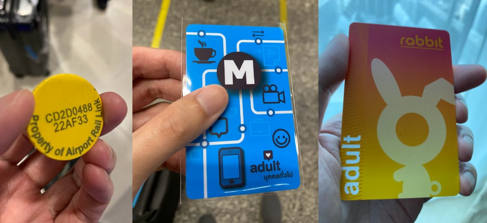

The weather was [hot](https://www.accuweather.com/en/th/bangkok/318849/february-weather/318849?year=2020) (33-35°C 🔥). The air quality was [moderately unhealthy](https://aqicn.org/city/bangkok). And there’s the [uprising](https://asia.nikkei.com/Spotlight/Coronavirus/Thailand-confirms-first-human-to-human-spread-of-coronavirus) pandemic. 😓😓😓

On the [next day](https://twitter.com/cheeaun/status/1225964295474814978), I attended the conference. Saw [Hui Jing](https://twitter.com/hj_chen), [Thomas](https://twitter.com/serrynaimo) and [Thai](https://twitter.com/dtinth) there.

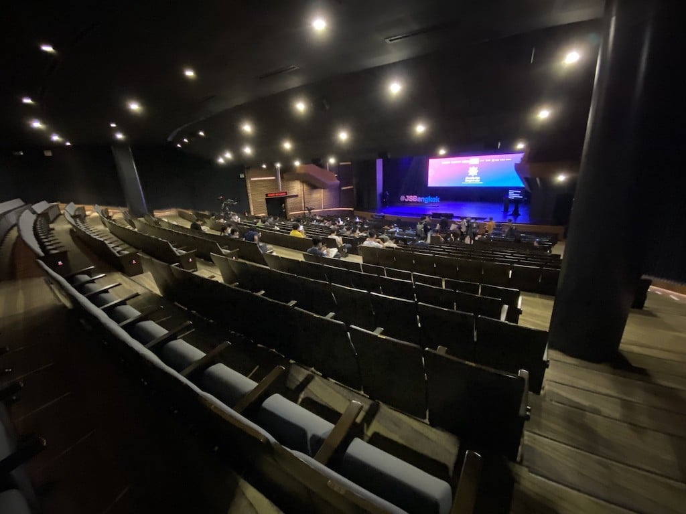

Some talks are in Thai, and there’s a screen on the right side that shows real-time English translations.

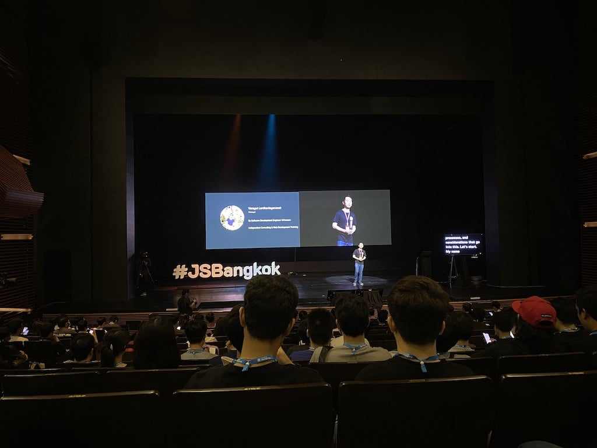

The food during lunch time was pretty good. 😋

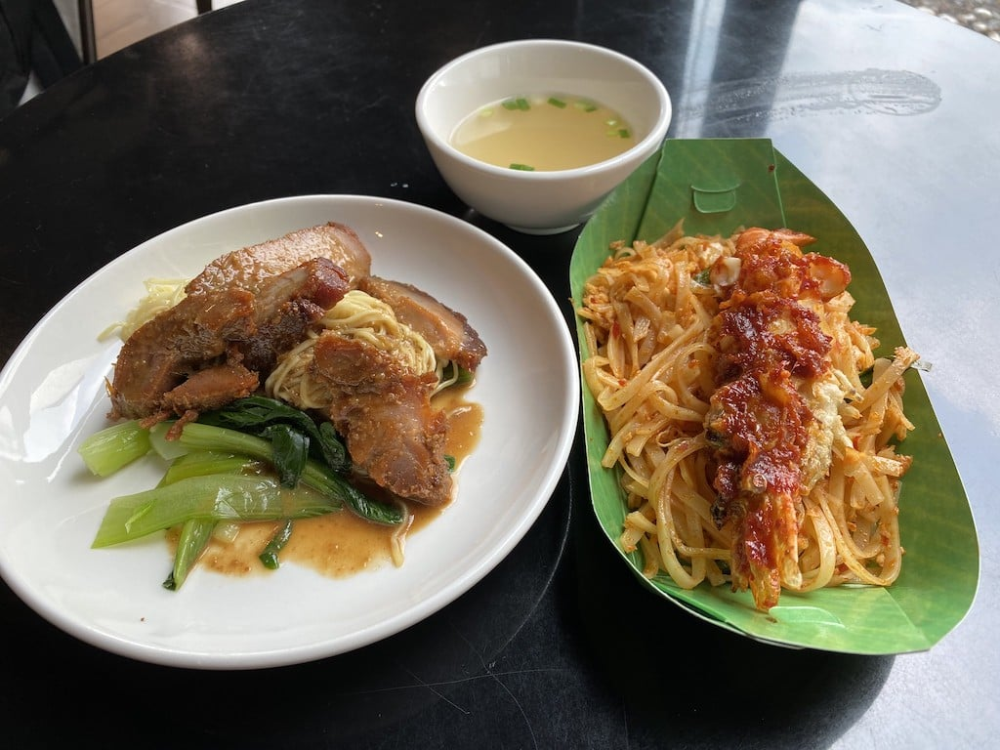

Back to the conference.

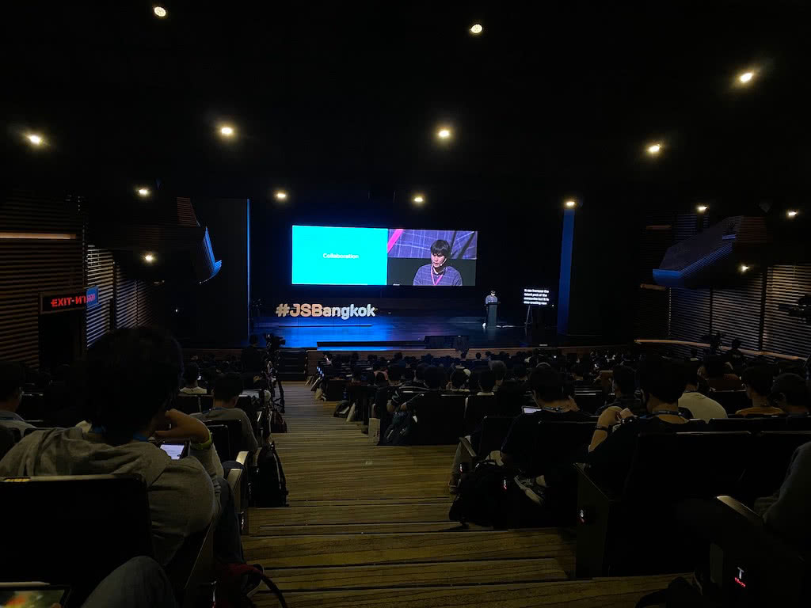

And not forgetting the swags!

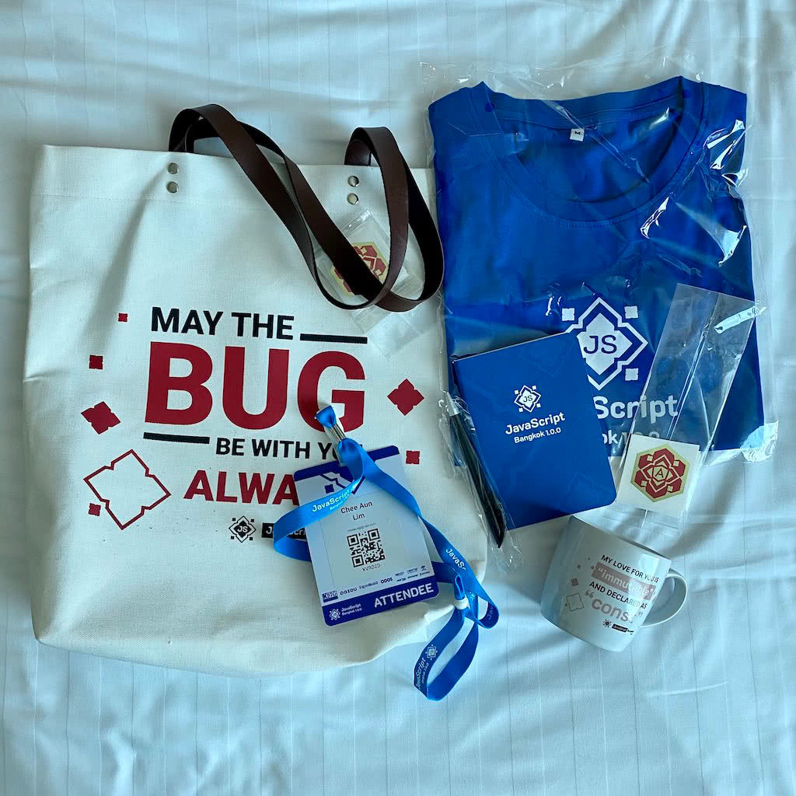

The next few days, I turned on my tourist mode and visited a few places:

- [Artbox](https://foursquare.com/v/artbox/5c83ad802b274a002c6f0838) (night market)
- [ICONSIAM](https://foursquare.com/v/iconsiam/5be46d95d552c7002ccbb459) + [Apple Store](https://foursquare.com/v/apple-iconsiam/5be5f56ed03360002cf8a5aa)
- [Chinatown](https://foursquare.com/v/%E0%B9%80%E0%B8%A2%E0%B8%B2%E0%B8%A7%E0%B8%A3%E0%B8%B2%E0%B8%8A-chinatown-%E5%94%90%E4%BA%BA%E8%A1%97/4c08fff97e3fc9283025f182)
- [King Power Mahanakhon SkyWalk](https://foursquare.com/v/king-power-mahanakhon-skywalk/5bf6c3f6916bc10039e801ac)
- [Bun Meat & Cheese](https://foursquare.com/v/bun-meat--cheese/5e391a6332cdc200084be7fb) (of [Homeburg fame](https://coconuts.co/bangkok/food-drink/viral-bangkok-burger-taiki-makes-four-burgers-daily-homeburg-1000-person-waitlist/)) 😋
- [Wat Pho](https://foursquare.com/v/%E0%B8%A7%E0%B8%94%E0%B8%9E%E0%B8%A3%E0%B8%B0%E0%B9%80%E0%B8%8A%E0%B8%95%E0%B8%9E%E0%B8%99%E0%B8%A7%E0%B8%A1%E0%B8%A5%E0%B8%A1%E0%B8%87%E0%B8%84%E0%B8%A5%E0%B8%B2%E0%B8%A3%E0%B8%B2%E0%B8%A1%E0%B8%AF-wat-pho/4baada7ef964a520848a3ae3)
- [The Grand Palace](https://foursquare.com/v/%E0%B8%9E%E0%B8%A3%E0%B8%B0%E0%B8%9A%E0%B8%A3%E0%B8%A1%E0%B8%A1%E0%B8%AB%E0%B8%B2%E0%B8%A3%E0%B8%B2%E0%B8%8A%E0%B8%A7%E0%B8%87-the-grand-palace/4ceb69b1d27560fca3439b3a)
- [Temple of Emerald Buddha](https://foursquare.com/v/%E0%B8%A7%E0%B8%94%E0%B8%9E%E0%B8%A3%E0%B8%B0%E0%B8%A8%E0%B8%A3%E0%B8%A3%E0%B8%95%E0%B8%99%E0%B8%A8%E0%B8%B2%E0%B8%AA%E0%B8%94%E0%B8%B2%E0%B8%A3%E0%B8%B2%E0%B8%A1-temple-of-the-emerald-buddha-%E0%B8%A7%E0%B8%94%E0%B8%9E%E0%B8%A3%E0%B8%B0%E0%B9%81%E0%B8%81%E0%B8%A7/4b0587f9f964a52001aa22e3)
- [Train Night Market Ratchada](https://foursquare.com/v/%E0%B8%95%E0%B8%A5%E0%B8%B2%E0%B8%94%E0%B8%99%E0%B8%94%E0%B8%A3%E0%B8%96%E0%B9%84%E0%B8%9F-%E0%B8%A3%E0%B8%8A%E0%B8%94%E0%B8%B2-train-night-market-ratchada/54addec5498e0da4bfe14445)
- [Victory Monument](https://foursquare.com/v/%E0%B8%AD%E0%B8%99%E0%B8%AA%E0%B8%B2%E0%B8%A7%E0%B8%A3%E0%B8%A2%E0%B8%8A%E0%B8%A2%E0%B8%AA%E0%B8%A1%E0%B8%A3%E0%B8%A0%E0%B8%A1-victory-monument/4b4ece3cf964a520adf526e3)
- [Chatuchak](https://foursquare.com/v/%E0%B8%95%E0%B8%A5%E0%B8%B2%E0%B8%94%E0%B8%99%E0%B8%94%E0%B8%88%E0%B8%95%E0%B8%88%E0%B8%81%E0%B8%A3-chatuchak-weekend-market/4bd401e477b29c74300a9282) (most stores closed as I went during weekend 😅)

It’s not as many places as I expected, as the weather was hot and hazy at the same time. There were people already wearing masks, possibly due to the pandemic or the haze (or both?). There were also people giving out [free masks](https://www.flickr.com/photos/cheeaun/49551849723/in/album-72157713158882566/). Every single entrance in shopping malls and train stations have hand sanitisers. There was [an unfortunate mass shooting](https://www.bangkokpost.com/thailand/general/1853804/mass-shooter-killed-at-terminal-21-in-korat) [around that time](https://www.channelnewsasia.com/news/asia/bangkok-shooting-pathumwan-chulalongkorn-university-12435206), so all train stations and shopping malls also have metal detector gates that everyone has to go through, with occasional bag check.

Boy, did I choose one of the worst times to visit Bangkok, right? 😅

Anyway, some photos to cheer up a little.

[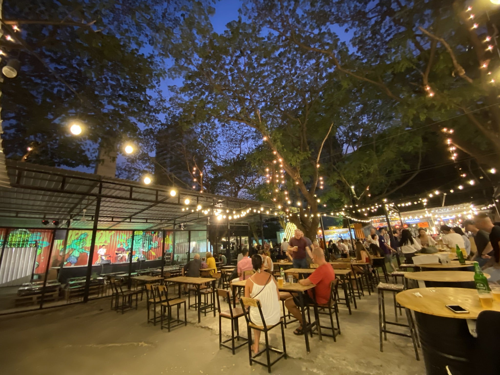](https://www.instagram.com/p/B8eREvCHFif/)

[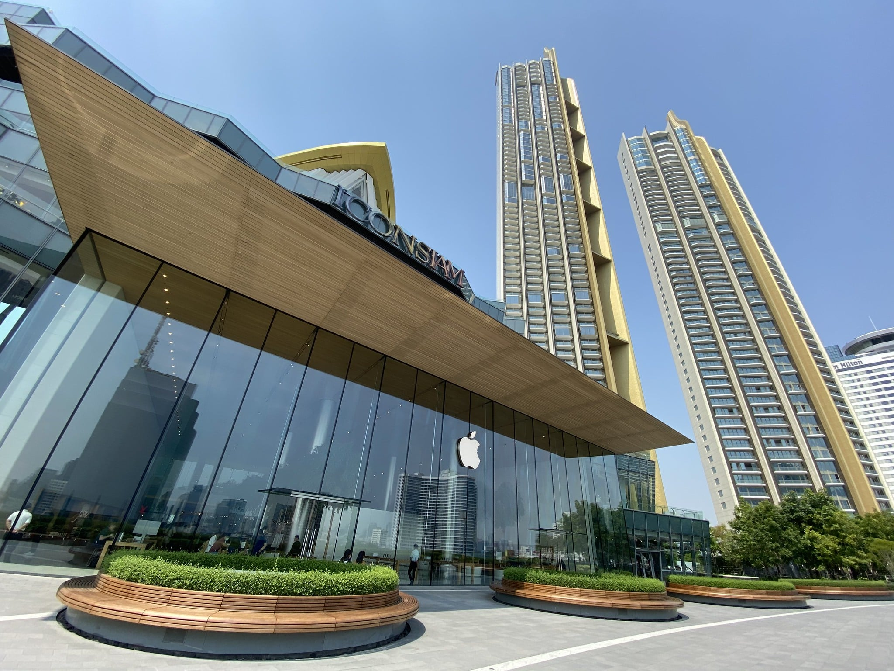](https://www.instagram.com/p/B8eRcecnFfn/)

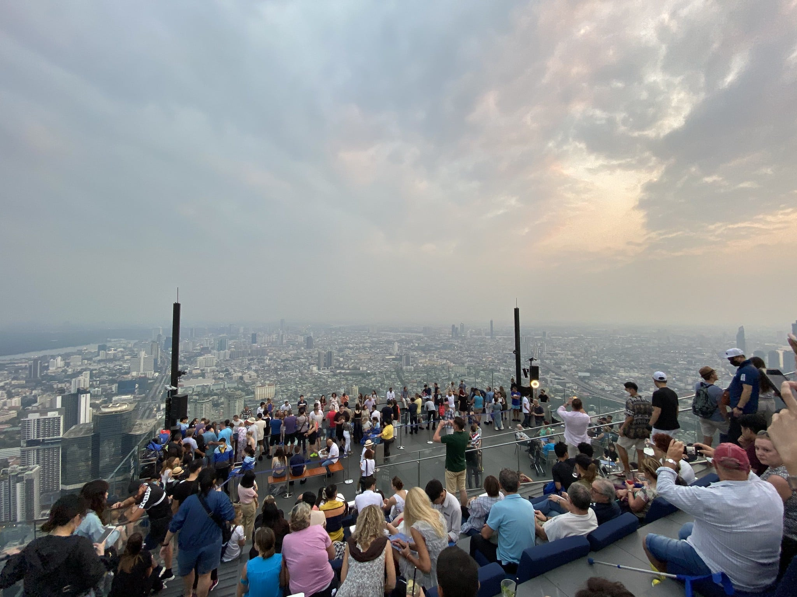

[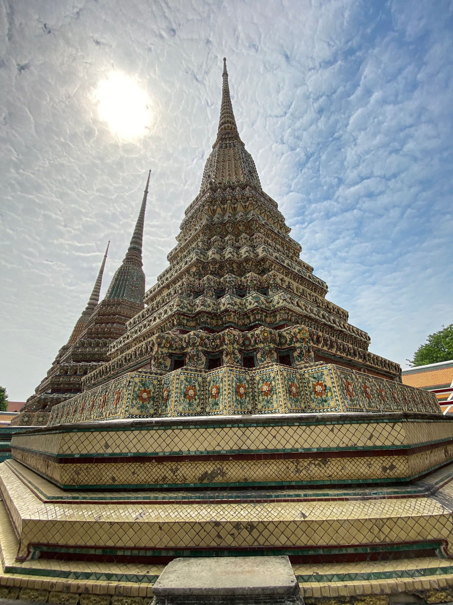](https://www.instagram.com/p/B8fblHEn2__/)

[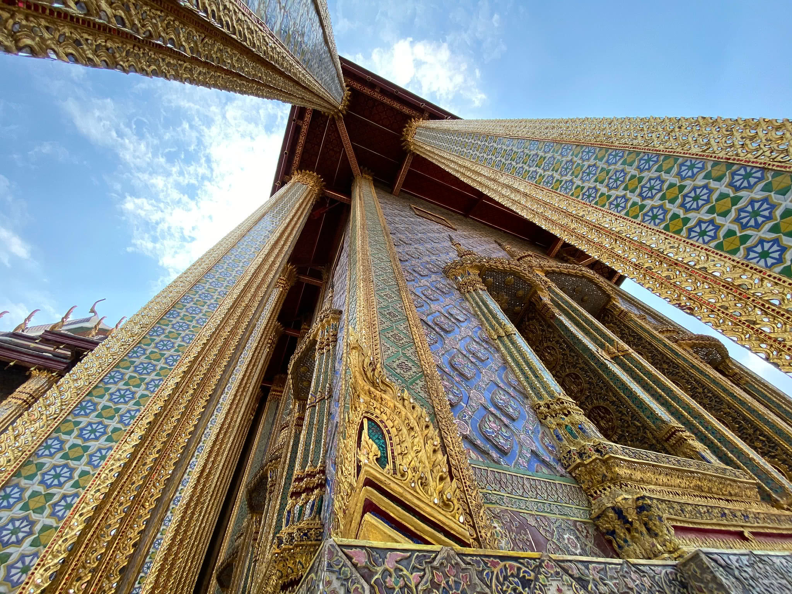](https://www.instagram.com/p/B8f0At1nqJg/)

During the trip, I ate [pad thai](https://www.flickr.com/photos/cheeaun/49551824158/in/album-72157713158882566/), drank [milk tea](https://www.flickr.com/photos/cheeaun/49552351216/in/album-72157713158882566/), drank [mango juice](https://www.flickr.com/photos/cheeaun/49552591507/in/album-72157713158882566/), discovered [Thailand’s date and time notation](https://twitter.com/cheeaun/status/1226704776252932097), ate [pork rice](https://www.flickr.com/photos/cheeaun/49552596932/in/album-72157713158882566/), ate [burgers](https://www.flickr.com/photos/cheeaun/49552583932/in/album-72157713158882566/), ate [crickets](https://www.flickr.com/photos/cheeaun/49552600087/in/album-72157713158882566/) 🦗, saw [a cat while looking at a ticket attached with a coupon that gives free drinking water](https://www.flickr.com/photos/cheeaun/49552361796/in/album-72157713158882566/), ate [mango sticky rice](https://www.flickr.com/photos/cheeaun/49551880618/in/album-72157713158882566/), braved through the [heat](https://www.flickr.com/photos/cheeaun/49552544502/in/album-72157713158882566/), ate [*Khanom bueang*](https://www.flickr.com/photos/cheeaun/49551881948/in/album-72157713158882566/), and ate [boat noodles](https://www.flickr.com/photos/cheeaun/49552543987/in/album-72157713158882566/).

One of the good things that happened is that I got a free upgrade to a [Grand Suite room](https://www.flickr.com/photos/cheeaun/49551856838/in/album-72157713158882566/) due to a water leak in the bathroom. 😃

My observations:

- There’s a [plastic bag ban](https://www.channelnewsasia.com/news/asia/thailand-single-use-plastic-bag-ban-bangkok-government-campaign-12225662) since January. But I still get plastic bags at some 7-eleven and Family Mart stores 🤷‍♂️.
- [Makha Bucha Day](https://www.thaifestivalblogs.com/makha-bucha-day/) was on 8 February.
- For the escalator etiquette, stand on the right side.
- To enter Grand Palace, men are required to wear long pants. I was wearing shorts… because weather 😅. Stalls were selling them for $200-220 THB. After that, I didn’t realise that they are refundable and also rentable from some stalls. 😑
- There’s no Uber. There are alternatives like Grab and [LINE MAN](https://lineman.line.me/) instead.

On 13 February, [somehow](https://twitter.com/cheeaun/status/1227470329515249664) I manage to [have dinner](https://twitter.com/miss_jwo/status/1228006325994446849) and [ice-cream for dessert](https://twitter.com/miss_jwo/status/1228006394797776897) together with [Henry Lim](https://twitter.com/henrylim96), [Jenny Wong](https://twitter.com/miss_jwo) and a few WordPress folks. Got myself a [WordCamp Asia sticker](https://www.flickr.com/photos/cheeaun/49552381056/in/album-72157713158882566/) too, which the [conference itself was cancelled](https://twitter.com/WordCampAsia/status/1227450807387402241) due to the pandemic.

On [14 February](https://twitter.com/cheeaun/status/1228233368183005184), I took a cab to the airport, received [another free mask](https://www.flickr.com/photos/cheeaun/49552542667/in/album-72157713158882566/), [tried out](https://www.flickr.com/photos/cheeaun/49551884863/in/album-72157713158882566/) the Business Class Lounge and [flew](https://www.flickr.com/photos/cheeaun/49552541207/in/album-72157713158882566/) back to Singapore.

The stats:

- 123 Swarm check-ins.
- 12 Instagram posts.
- [517 photos and 3 videos](https://www.flickr.com/photos/cheeaun/albums/72157713158882566) on Flickr.

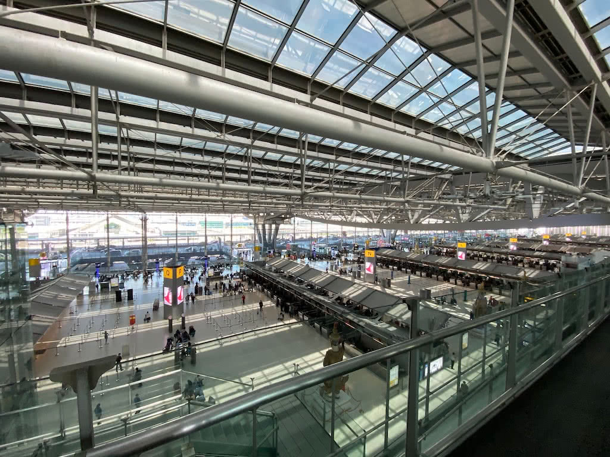

Work from home
---

After my Bangkok trip, to be safe, I did my own self-enforced 14-day "Stay-Home Notice" (SHN) before start going out and working in the office. At that time, the real SHN [took effect](https://www.moh.gov.sg/news-highlights/details/implementation-of-new-stay-home-notice) on 18 February and apply to all returnees with recent travel history to China (outside Hubei) within the last 14 days. It’s also generally advised by the Ministry of Manpower to work from home where feasible. So I’ve been working from home since the day I returned from Bangkok. I went to the office just for few days on March. On April, [circuit breaker](https://en.wikipedia.org/wiki/2020_Singapore_circuit_breaker_measures) was announced and **everyone** worked from home.

Working from home is quite challenging.

Story time. A few years ago, I was thinking about remote working. I did some *analysis* and decided that it’s not for me. I like working with people in a physical space. It feels more like a team when there are engineers, designers and product managers sit together, working towards a common goal. It’s easier to discuss things, pair programming, and sometimes quickly get an opinion.

There’s also an impression that I personally imposed on myself that working at home doesn’t feel like work. Or rather, I would need a specialised setup, like a nice desk and chair, something that the office already have. I don’t have such *privileges* so I probably need to go to other places to work, like Starbucks or a dedicated coworking space. Even then, it would feel kind of lonely, to work by yourself and go for lunch by yourself.

Talking about lunch, I really enjoy lunch hours with my colleagues. I always prefer longer lunch hours instead of restricted timings that are imposed in some other stricter companies. I like the moment that after having lunch with my colleagues, we would explore places like trying out a hipster coffee shop or a newly-opened bubble tea stall across the street. And then taking the sweet time to walk back to the office while chit-chatting about non-work stuff.

Remote working was kind of like a *hipster* thing, in my opinion, mainly due to not a lof of companies doing it, especially in Asia. There are even sites like [remoteok.io](https://remoteok.io/) (since [2015](https://twitter.com/levelsio/status/939877954691072000)) dedicated to listing companies that allows people to work from (almost) anywhere.

Before 2020, I’ve never tried this. But I do know how it feels like working with remote colleagues, in companies that have multiple offices in different countries. Timezone really make things difficult when we have to set meetings at unusual hours. Can’t really miss them if they’re important. Either I have to wake up earlier than usual or stay up late at work. It drains even more energy if the meeting is not very productive. Decisions are also delayed and communications become asynchronous.

Despite all the inconveniences, this year, all of us have no choice but to embrace this *new* style of working, though *slightly* more restricted due to lockdowns and such.

There are pros and cons.

The pros:

- ⏰ **Saves a lot of time by not taking public transport to work**. I personally always factor in travel time when finding jobs. If it takes more than an hour to reach work or return home, it’ll be too tiring for me. Sometimes I’ll explore alternative routes, thus one of the reasons why I built a lot of transport-related web apps, to check if there’s a faster or least-traffic way.
- 🥶 **No more super-cold air-con**. Offices in Singapore *always* set their air conditioning to be super cold. Everyone has to wear sweaters inside and take them off when going out for lunch. It’s the opposite of cold-weather places like Tokyo and San Francisco.
- 💅 **Meetings got more comfortable**. In the beginning, sometimes I’ll turn on the camera to show my face, but after just a week, I turn them off completely. So, it’s a pure audio-only *discussion* and lecture-style *presentation*, kind of like a live podcast or YouTube stream, where you can’t pause, rewind or change the playback speed. Since no one’s looking, I even [cut my nails](https://twitter.com/cheeaun/status/1295305416671293441) during a meeting.

The cons:

- ⚖️ **Blurred work-life balance**. Every day, I wake up, eat, work, eat, sleep and repeat, all in the exact same place. Turns out the travel time to and fro work is a good *transition* to inform the body that it’s work mode versus personal time mode. Weekends start to feel like weekdays. Some of us have to do household chores while working. Some have kids and need to take care of them, while in a meeting. It’s a huge mess.
- 🥱 **Lack of exercise and sunlight**. I generally don’t exercise much, but I really like to walk. Commuting between home and work helps. While working from home, I keep having backaches and have to consciously stand up and stretch every few hours. When I go out to buy food and things after weeks of staying at home, I felt so, so, so much better.
- 🐣 **Everyone is a remote-working beginner**. I agree, it’s tough. Too many meetings. People joining multiple meetings at the same time. Some people treat meetings as background noise and always ask “Could you repeat that again?”. Too many [one-to-one private messages](https://twitter.com/cheeaun/status/1232618300816818176). Lack of company-wide conveniently-searchable written communication and documentation. [Not fully utilising](https://twitter.com/cheeaun/status/1246059161651011585) *all* the available web-based tools that are built for online team communication.

It took some time to adapt, now that the [cheese has moved](https://en.wikipedia.org/wiki/Who_Moved_My_Cheese%3F).

I try my best not to [open both](https://twitter.com/cheeaun/status/1278514382209609729) my work and personal laptop at the same time. I set reminders for myself to stand up, stretch and do light exercises. [Notion](https://www.notion.so/) and [Figma](https://www.figma.com/) helped a lot for work, especially for online collaboration, besides the usual suspects like Slack and Jira. I use [Google Meet Enhancement Suite](https://chrome.google.com/webstore/detail/google-meet-enhancement-s/ljojmlmdapmnibgflmmminacbjebjpno) for auto-mute and auto-video-off. I also use [MuteKey](https://apps.apple.com/us/app/mutekey/id1509590766) to *actually* mute the microphone at the operating system level, because Google Meet’s “mute” button doesn’t really do its thing because it needs to warn people that they might be talking while muted.

On some days, it gets *very* exhausting.

It’s stressful to continue working while the whole world is [on fire](https://knowyourmeme.com/memes/this-is-fine). Hearing, talking or reading news about the pandemic *every single day* doesn’t really help much for mental health. Keeping track on the number of cases *every single day* doesn’t help at all. All the while, there are worries about laid-offs, reduced salaries, affected businesses, [sold-out toilet papers](https://www.straitstimes.com/world/united-states/why-toilet-paper-the-psychology-behind-the-coronavirus-induced-panic), and not being able to go back hometown due to lockdowns.

There are some days that I felt quite productive doing work, and some that I don’t. I was both mentally and physically fatigued once every few weeks and I couldn’t do much work at all. And I tell myself that it’s fine to rest because there’s nothing more important than my own health. Work can come later.

On October, measures were eased as community cases remained low. According to the [Safe Management Measures](https://www.mom.gov.sg/covid-19/requirements-for-safe-management-measures) guideline, work-from-home is still the default and employers must ensure that no more than half of employees who are able to work from home are at the workplace at any point in time. So, I went to the office once a week; a decision that my colleagues and I made. No point going to the office and still have to virtually dial in for meetings or discussions.

For the past few months, I’ve had a very oddly familiar thought to this not-so-flexible "remote working” lifestyle. I realised that there’s a huge lack of written communication and documentation. A lot of the online tools like Slack and Jira allows commenting and threads, which can facilitate tasks around, though not many people actually fully utilise them. There are simple things that I thought that everyone should know, like writing a good pull request or bug report, writing useful comments in code, keeping track of tasks, proactively tag folks when discussing certain topics, keeping track of any changes or decisions made, writing down meeting notes, keeping meetings short and on-topic, use large fonts for presentation slides, always share links to slides or notes during or after a meeting, taking screenshots or videos when reporting bugs or discussing about user interfaces, and more.

It reminds me… of the open-source world.

Many people might have different interpretations of open-source. For me, I’ve personally contributed to open-source projects and maintained a few. In other words, I’ve been on both sides of the spectrum. Contributors, users, and bug reporters are all remote and from all over the world. I’ve never met most of the people who approved my code contributions and those who contributed to my projects. I had to learn how to write good bug reports, with detailed reproduction steps, because it helps the maintainers to understand and debug. I have to learn how to write good documentation with clear screenshots for my projects so that it can be used by other developers. I have to learn how to review other people’s code, ask them questions if I don’t understand certain parts, and reason with them if I disagree with certain logic or paradigm. I also have to manage the issues, close them if there’s no activity, ask for more information if the issue lacks details, tag them nicely for organization, and even moderate the comments if things go haywire. While maintaining code, I also have to handle the marketing and monetisation side of things by building a web site, creating a new Twitter account, adding donation links, writing articles, and offering customer support.

All of these, **without** ever meeting anyone face-to-face or over video/audio calls.

I had a thought that open-source folks and organisations have been doing remote work even before it was a hipster thing? And I somehow subconsciously have done it?

Weird…

Looking back
---

2020 changed everything.

It’s the year that I’ve been hearing a lot since childhood in Malaysia. [Vision 2020](https://en.wikipedia.org/wiki/Wawasan_2020) is a Malaysian ideal introduced by the 4th (and 7th) Prime Minister of Malaysia in 1991. I moved to Singapore in 2009 (24 years old) and here I am now a Singaporean citizen…

It’s the year that I expect everyone had plans to make some dramatic life decisions. I mean, it’s twenty-twenty, sounds good to the ears. Some people quitted their jobs despite others who were *actually* laid off. Marriages were still happening despite all the social distancing and safety measures. Though perhaps I’m one of the few others who decided to play safe and just be grateful with whatever I have right now.

It’s the year that everyone stopped travelling. Wait, I did travel on February, so should probably consider myself lucky. However, even if travel is allowed, it wouldn’t be enjoyable anyway during pandemic times. Imagine yourself enjoying life while the number of death cases around the world going up, is definitely not a thing that I would want to do. For me, travelling has *always* been optional. I actually spent the first 4 years in Singapore, not travelling anywhere at all, except returning to my hometown in Penang and attending my cousins’ wedding dinners. Maybe there’s no [YOLO](https://en.wikipedia.org/wiki/YOLO_(aphorism)) blood in me at that time, but I was actually focusing a lot on clearing my university education loan and house loan. Travel is a privilege, not a right. Telling others that you’ve been to many countries is not a huge achievement that you should be proud of.

Throughout the year, I’m glad that I still have the energy to [work on my side projects](https://twitter.com/cheeaun/status/1270361974258335750), learn [new things](https://twitter.com/cheeaun/status/1275293217987145728) and continue to [find inspiration](https://twitter.com/cheeaun/status/1277233464035561472) over [little discoveries](https://twitter.com/cheeaun/status/1335856717876191232). I’ve made over 598+ commits, 10 issues and 10 new repositories on [GitHub](https://twitter.com/cheeaun/status/1343584446428061698). The unfortunate thing would be that I didn’t write any blog posts about my side projects this year. I just don’t feel like writing, so not going to force myself.

I also found my [new favourite pastime on Twitter](https://twitter.com/cheeaun/status/1278275519067222016) which is to reply to people’s quotes with funny animated GIFs. [Most of them are on *Ten*’s tweets](https://twitter.com/search?q=from%3Acheeaun%20to%3Atzyinc&src=typed_query&f=image). 😂 I did the same thing too on Facebook posts, too bad that most of them are private and not linkable.

Being stuck at home, I started to [binge](https://twitter.com/cheeaun/status/1236638924736348161)-[watch](https://twitter.com/cheeaun/status/1280856129698844674) a lot more *older* anime’s than usual, besides just watching this year’s [anime's](https://cheeaun.tumblr.com/tagged/anime). Few of the ones that I found surprisingly interesting are [Dr. Stone](https://myanimelist.net/anime/38691/Dr_Stone) 👨‍🔬 (2019), [Youjo Senki](https://myanimelist.net/anime/32615/Youjo_Senki) (2017), [Gate](https://myanimelist.net/anime/28907/Gate__Jieitai_Kanochi_nite_Kaku_Tatakaeri) (2015, 2 seasons), [Kono Oto Tomare!](https://myanimelist.net/anime/38080/Kono_Oto_Tomare) 🎼 (2019, 2 seasons), [Ballroom e Youkoso](https://myanimelist.net/anime/34636/Ballroom_e_Youkoso) 💃 (2017), [High Score Girl](https://myanimelist.net/anime/21877/High_Score_Girl) 🎮 (2018, 2 seasons), [Honzuki no Gekokujou](https://myanimelist.net/anime/39468/Honzuki_no_Gekokujou__Shisho_ni_Naru_Tame_ni_wa_Shudan_wo_Erandeiraremasen) 📚 (2019, 2 seasons) and [Kaze ga Tsuyoku Fuiteiru](https://myanimelist.net/anime/37965/Kaze_ga_Tsuyoku_Fuiteiru) 🏃‍♂️ (2018).

I’ve also found another form of entertainment this year: [Uncle Roger](https://www.youtube.com/user/nigelscomedythings). I personally find this funny [because](https://twitter.com/cheeaun/status/1323515664858935297) when I watch reaction videos on anime episodes that I've watched, some folks find me weird. Now, it's okay for everyone to watch [people acting as fictional characters](https://www.youtube.com/watch?v=53me-ICi_f8) reacting on other people's videos. And *then* it escalated to [reaction videos *on* reaction videos](https://www.youtube.com/watch?v=8q5wNwyx5ek). 🤦‍♂️🤦‍♂️

Apart from that, I’ve also been quite grateful to watch another genre of TV shows that I never thought would have watched and *accidentally* picked up since last year. They are [Heart Signal 3](https://mydramalist.com/55693-heart-signal-3) (aired on March–July) and [Heart Signal 3 (Chinese)](https://mydramalist.com/65745-heart-signal-3) (September–November). I literally binge-watched *all* the previous seasons ever since the day I *accidentally* watched one of the similar-genre shows on TV during [my last Seoul trip](/blog/2020/01/2019-in-review/). Yes, they are Korean reality shows. Getting curious, worked up and invested in other people’s lives is probably one of the best ways to stay sane during pandemic times, I think. Also, unexpectedly heartwarming.

To sum up, this year feels *really* short. The whole 12 months felt like just 3 or 4 months to me. Lucky that I’m quite good in keeping track of things I’ve done, else I would probably feel like I did nothing for the whole year.

Did I learn a lot of things this year? Heck yes.

How about my physical health? Kind of okay, still occasional backaches, headaches, gastric, and developed a tinnitus.

How about mental health? Pretty okay so far, but there’s always a slight tint of loneliness and anxiety.

What happened to my Twitter? Oh yeah, I unfollowed almost everyone, decreased from less than 600 to less than 10 followings. I “follow” people using [Twitter lists](https://help.twitter.com/en/using-twitter/twitter-lists) instead.

Wait, how about all the trends? Nope, I’m not into ‘Animal Crossing’, ‘Among Us’, ‘BTS’, ‘Tiger King’, ‘The Mandalorian’, ‘Wonder Woman 1984’, etc. I don’t own a Nintendo Switch™ and don’t even have a Netflix subscription. Does that make me feel disconnected from the world? Maybe, but… I’m typically a “my pace” ([マイペース](http://www.jadij.com/2011/12/on-japanese-english.html)) person and I feel it’s rather close-minded to think that the whole world *only* revolves around them.

The new year is coming and I got to say, it’s a bit difficult to welcome it as the pandemic is *still* around. There are *still* a lot of cases in many countries and our front-line heroes are *still* working really, really hard, while the rest of us sitting comfortably in our houses. There are still some uncertainties and lingering issues that require careful preparations and planning in phases.

All I can do now is simply taking a small step forward, one at a time.