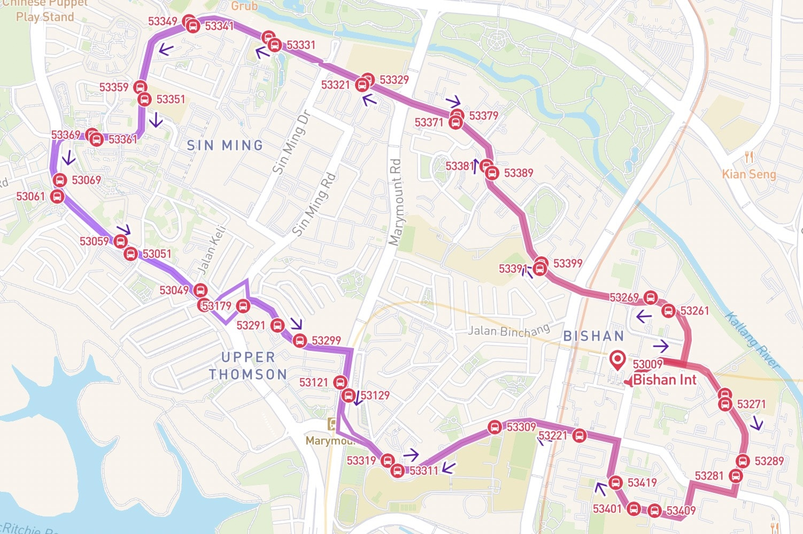

Designing bus service route diagrams on BusRouter SG
===

I launched the all-new design for [BusRouter SG](https://busrouter.sg/) on [November 2018](https://twitter.com/cheeaun/status/1064344313549574144). I [wrote about my journey](/blog/2019/02/building-busrouter-sg/) that lead me to the current design and quoted:

> **Redesign the whole UI** to be more map-focused and mobile-optimized.
>
> - Getting rid of the list view, especially the list of stops for a bus service. Despite its usefulness, I realised that most users don’t care about the bus stop numbers and names.
> - Putting more focus on the search field as I expect most users have a bus service in mind and won’t be *browsing* for bus services.
> - The map should take the full spotlight, by hiding any unnecessary information, and let users focus on the map data.

The first point, for getting rid of the list of stops, was actually a huge deal.

Most web sites and apps usually show two views; map view and list view. The former is great for visually identifying the *real* geographical locations, while the latter is more readable and scannable.

The **previous design**, showing map view *and* list view:

The **current design** (2018-2020), with *only* the map view:

At that time, my thinking is that the list view is useless, as I suspect most people don’t remember stop numbers and even the stop names. The map view is more *visual* and geographically contextual.

Removing the list view was a huge bet. But after a while I have a hunch that some people may not be as map literate as I am. I suspect that *most* users of BusRouter SG would be pretty *advanced* bunch of people who are either passionate about public transports or really knows their way around very well.

Or... perhaps they're neither? 🤔

There were two reasons why I remove the list view:

1. There’s **not enough space** to fit both map view and list view on a small-screen device. I’ve struggled with this by making both views use half of the screen real estate. I’ve thought of making it toggle between views, showing one view at a time, though it would make it difficult to *link* both views visually.
2. Some bus services **have two route patterns**, usually to and fro. The old design, including all other sites and apps, render them in tabs which the user has to toggle. So the user can only view *one* route pattern at a time on the list view, but they can see *both* patterns on the map view. Though some sites and apps opt to show one of the patterns on the map too.
   

Over the years, I’ve rethought about these reasons.

1. Phones are getting bigger, so there should be more space now for both map view and list view. I know that smaller-screen devices still exist but I did a cost-benefit analysis and think scrolling down a list is *still* easier than zooming in/out and panning on a map.
2. Showing one route pattern at a time is not ideal. Showing both takes up a lot space. I need to think of a much better solution for this.

The beginning
---

On [May 2021](https://twitter.com/cheeaun/status/1397539071895883782), I took **a small step forward** into designing and coding one of the **coolest bus service route diagrams I’ve ever seen**.

*First* iteration looks like this:

- Both route patterns are side-by-side taking half of the vertical space (two columns).
- Stops are rendered as red circles, with red lines in between.
- Stop numbers and names are rendered too. Names are not truncated so they could wrap up to 2 or 3 lines.
- This was initially done with [Flexbox](https://developer.mozilla.org/en-US/docs/Learn/CSS/CSS_layout/Flexbox) and every stop row will grow to accommodate space until the last stop at the bottom.

For this route, the data looks roughly like this:

1. Ang Mo Kio Int → … → Shenton Way Ter
2. Shenton Way Ter → … → Ang Mo Kio Int

For this iteration, the second (right) column is **purposely reversed** so that the first stop of the first route pattern is positioned together with the last stop of the second route pattern.

But here’s the problem, how would the users know that?

*Second* iteration [fixes the problem](https://twitter.com/cheeaun/status/1397546051674906624):

- Arrows are added to indicate the direction of the route patterns.
- They are not placed after every single stop, but decently spaced out to prevent clutter.
- Interestingly, there was a [feedback](https://twitter.com/jg_lim/status/1397546621735342080) that they look like approximate real-time locations of buses on the routes 🤔.

Looking at this, it feels like my job is done.

But I got curious. For a long time, I have this idea of linking the stops from the opposite route patterns.

For example:

Bus stop “Blk 140” (10061) is geographically opposite of “Opp Blk 140” (10069). They are walkable via the pedestrian crossing. There’s also a possibility that they serve the same bus services, which is useful if someone accidentally took the wrong side or overshoot their journey, they know the opposite stop should serve the same services of the opposite direction 😉.

To know the "opposite states" of the stops would be a difficult task as they are many kinds of roads and I wouldn’t know if they really serve the same services or even walkable in between. I probably could go though all stops, determine their distances, figure out the services that go through each stop, and generate a whole set of data? Sounds like a lot of work 😅.

Fortunately, thanks to [Land Transport Guru](https://landtransportguru.net/), a website made by a few awesome transport enthusiasts, I found [this gem](https://landtransportguru.net/bus-stops/):

> Most bus stops end with the digit ‘1’ or ‘9’. The last digit is used to differentiate the direction of the services. If it ends with ‘1’ for a service travelling from A to B, the pairing of this bus stop across the road for direction B to A will have a bus stop number ending with ‘9’.

This *really* makes thing easier.

I [made a quick hack](https://twitter.com/cheeaun/status/1397901070697783296) on the rows and columns and came up with these:

- Blue dots in between opposite stops. *Feels* like walking routes.
- The opposite stops affect the *whole* layout and stretch the lines vertically, as if there are magnets between the opposite stops.
- The arrows become slightly opaque, serving as a more subtle hint for the directions.
- The stops that are at the top and bottom of the list (first stop of first route with last stop of second route, and last stop of first route with first stop of second route) will be combined into a single stop if they are the same stop. This makes the line looks continuous and closed-loop if the route pattern is A → B and B → A.

For this kind of layout, I have to use `<table>`s instead of Flexbox. The height of every stop cell changes based on the length of the stop name and the linked opposite stops affecting the sibling stops. To *stretch* some of the cells, I have to tweak and calculate the `rowspan` to “push” the cells down.

In other words, it’s **a lot of math**. 😵‍💫

I made a few more changes and experimented on how the interactions would look like:

<video src="../videos/web/busrouter-sg-bus-service-route-diagram.mp4" controls></video>

- Bus stop numbers have changed from white text on red background to just red text. They don’t need to be so eye-catchy and now it looks more consistent with the map marker labels.
- Map view takes top half of the screen viewport while the list view takes the bottom half. Seems… okay.
- Tapping on a stop in the list will zoom to the stop on the map. Tapping it the second time will open the stop popover.
- A legend is added at the bottom of the diagram to explain what the blue dots mean.

The testing
---

[Basically](https://twitter.com/cheeaun/status/1398643394138677262), there are 4 *main* types of route patterns.

Notice that for A → B (one-way route), the diagram is simply a list, with red line on the left side instead of center.

At this point, I feel like my job is done (again?), *but* still not feeling confident enough to see if the diagram layout logic would work for **every** single use-case. There could be A → B + B → C route? What if the first stop of first route pattern is opposite of the 2nd last stop of the 2nd route pattern? What if the route pattern has only 2 stops and also a loop route?

Okay fine, I [wrote tests](https://twitter.com/cheeaun/status/1398944388395409410)!

I try to *simulate* as many (weird) use-cases as possible and fix the bugs as I find them. This test suite is not quite a *real* test suite. There are no test frameworks and I’m basically eyeballing for bugs or unexpected cases 🤣.

I feel that this is *still* not enough, and decided to [go the extra mile](https://twitter.com/cheeaun/status/1399035542147264516) and render **all 500+ bus routes**. 🤯

<video src="../videos/web/busrouter-sg-500-bus-service-route-diagrams.mp4" controls></video>

By doing this, I manage to find *even more* bugs (duh).

[For](https://twitter.com/cheeaun/status/1399378847498342405) [example](https://twitter.com/cheeaun/status/1399378847498342405), bus service ‘**307**’:

The diagram above shows two versions; left is the initial implementation, right is the final best-effort “bottom-wrapped” fixed version.

This bus service is one of the cases where this kind of layout is not suitable. “Chua Chu Kang Int” (44009) has to be at the top of the list so that the user can see where the bus starts departing. But in reality, the route on the map looks like this:

“Chua Chu Kang Int” is right in the **middle** of the route loop, with *most* of the other stops being opposite to one another.

The bus stops that require some attention here is ‘44461’ opposite to ‘44469’. In the above route diagram for service ‘307’, there’s no way that they can laid out opposite each other. All the bus stops at the top section can’t be grouped together, but at least the stops at the bottom section can be “wrapped” around (best-effort fix).

I’ve thought about this. Here are some sketches that could possibly fix this and make it contextually similar to their geographical locations.

There are 3 sketches.

- The **first sketch** is the most logical layout but it takes up more horizontal space which doesn’t match the vertical layout here. It will also be more difficult to place the stop numbers and names along the stop circles. 😫
- The **second sketch** shifts the starting stop to the left-side middle of the list. The layout stays the same in vertical mode but now the starting stop is no longer the first at-the-top thing that the user see, which may cause some confusion. 🤨
- The **third sketch** is a weird combination of both, trying to maintain the vertical layout mode while trying to keep the starting stop at the top. Obviously, it’s impossible to fit so many things in such a tight space. Two columns of stop numbers and names is already quite a challenge, and this is like four columns? 😅

I didn’t implement any of these sketches. None of them are perfect yet.

So for now, service ‘307’ ended up with the above-shown best-effort version, with “bottom-wrapped” stops.

Okay, let’s move on to another [example](https://twitter.com/cheeaun/status/1399739597425233920), bus service ‘**410**’:

Looking at this diagram carefully, there are **two** “Bishan Int” stops and… they’re actually the same place (53009)! This is rendered like a A → B → A route but it’s actually A → A → A. 😵‍💫

It has two route patterns. Both goes to the same stop so that makes it a loop route. This means service ‘410’ has two one-way loop routes! 🤯 (I’m not sure if I’m making any sense here)

It’s *really* difficult to explain this. The route on the map looks like this:

For the first route pattern, the bus goes anti-clockwise starting from “Bishan Int” and end up back to the same stop itself. Then for the second pattern, the bus goes clockwise.

Some might think that this should have been two separate bus services, right? 😏

The geographically-correct route diagram should have been like this:

Sigh, yet another impossible 4-column layout? I can’t think of any other ways to represent these route patterns.

I decided to keep this in the backlog and maybe come up with a solution next time. So, service ‘410’ is left untouched. 🙏

Anyway, I continued rendering all 500+ services and fixing all the weird routes. Things start to [look pretty good](https://twitter.com/cheeaun/status/1399388155627786243).

I’ve updated the pagination.

Added bus service names too besides the bus number.

A few more *weird* bus routes like ‘811’ and ‘912’.

And… not forgetting bus service ‘902’, the shortest bus route ever in Singapore.

The launch
---

On [7 June 2021](https://twitter.com/cheeaun/status/1401895481467228161), I launched the all-new bus routes diagram on [BusRouter SG](https://busrouter.sg/), with a little bit of [redesign](https://twitter.com/cheeaun/status/1401406847479812097). 🚀

I also made a little introductory video and [posted it on /r/singapore](https://www.reddit.com/r/singapore/comments/nv03xe/ive_designed_a_pretty_unique_bus_service_route/).

Feedback from the Reddit folks have been surprisingly positive, which I think is more related to the whole app itself instead of the route diagrams 😅. It’s pretty obvious that there are still a lot of people who don’t know the existence of my app, as I don’t do any marketing work for it.

Nevertheless, positive feedback is always good and this experiment has been a lot of fun for me. I’m still not sure if this work will be useful for anyone, however I do felt **relieved**, like a weight has been lifted off my shoulders. An idea that has been stuck in my mind for so long, is now actualised. Despite not 100% perfect yet, at least it’s out for public consumption.
